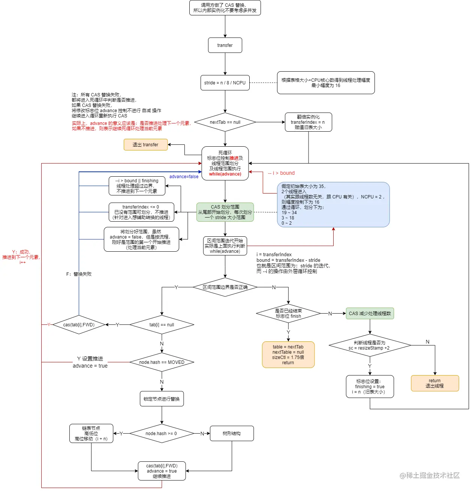

[TOC]

# 流程图



`ConcurrenthashMap` 的 `transfer` 主要是用于扩容重组阶段，当内部数组的容量值超过阈值时，将触发扩容重组， `transfer` 是该过程的主要实现。

# 相关概念

1. `ConcurrentHashMap` 中，使用一个字段复用了多种功能，如：阈值控制、内部 `Node[]` 数组状态控制、扩容线程控制 等，该字段就是 `sizeCtl`。

```java
/**
 * 默认为0，用来控制table的初始化和扩容操作
 * -1: 代表table正在初始化
 * -N: 取-N对应的二进制的低16位数值为 M=(sizeCtl&31)，此时有M-1个线程进行扩容
 * 
 * 其余情况：
 * 1、如果table未初始化，表示table需要初始化的大小。
 * 2、如果table初始化完成，表示table的容量，默认是table大小的0.75倍
 */
 private transient volatile int sizeCtl;
```

2. `ConcurrentHashMap` 在重组时，做法与 `HashMap` 类似，但是具体新的数组，则是使用了内部一个数组变量 `nextTable` 以保证并发控制。其他如：链表的重组、树结构的重组 流程均是大同小异。
3. `ConcurrentHashMap` 的重组采用了跟分段表类似的思想，实际上是将数组划分为不同的分段区间，如果有线程进入，可获取该区间辅助转换。
4. `transferIndex` 是 `ConcurrentHashMap` 的内部属性，主要是在重组阶段中使用，用来表示还未被转换的数组，区间为：`table[0] ~ table[transferIndex-1]`
5. `ConcurrentHashMap` 并发转换的过程，借助了 信号量 的概念，只有获取到信号的线程，才能进入辅助转换，而 信号量 则存储在 `sizeCtl`，每当一个线程进入获取，则 `sizeCtl + 1`（首个线程开启转换则是 `sizeCtl + 2`）。主要注意的是，该信号量的初始值为 负数，加入线程将增大 `sizeCtl`，直到 `sizeCtl` 的增大达到 0 时，信号量将用完，默认的与 信号量 相加等于 0 的值是：65534，也就是说，最多允许 65534 条线程参与辅助转换（非固定，可调节）。所以可通过 **`rs + 1 ~ rs + 65534 `** 的边界控制，来决定线程是否加入辅助转换。让 `sizeCtl` 成为负数变成信号量的主要代码是： `resizeStamp(n) << RESIZE_STAMP_SHIFT`
6. `ConcurrentHash` 的转换过程中，用到的辅助属性有两个：`nextTable`，`transferIndex`，它们属于线程共享的，所以在对他们进行变更时，都是使用了 `“自旋/死循环 + CAS”` 的方式，实现线程并发安全。

# 解析

转换过程 `transfer` 的每个调用入口，实际上外部都有对 `sizeCtl` 进行 `自旋 + CAS ` 的操作。也就是并发情况下，即使多条线程想要进行扩容，那也只有一条线程能够成功，另外的线程则进入辅助扩容的过程

## addCount

扩容方法进入前的判断如下：

```java
private final void addCount(long x, int check) {
    // 省略部分代码...
    // nt -> nextTable
    // n -> num，sc -> sizeCtl
    Node<K, V>[] tab, nt;
    int n, sc;
    // 当前存储大于 75%，且总大小小于最大容量，需要扩容
    while (s >= (long) (sc = sizeCtl) && (tab = table) != null && (n = tab.length) < MAXIMUM_CAPACITY) {
        // resizeStamp 纯粹只是移位来保证右 16 位为0，可用来控制作为线程最大数
        // 左 16 位实际并没有保留太多信息（因为明显：resizeStamp(4)、resizeStamp(5)、resizeStamp(6)、(7)
        // 是相同的结果
        int rs = resizeStamp(n) << RESIZE_STAMP_SHIFT;
        if (sc < 0) {
            // 限制线程的最大或最小，当达到最大 65534（默认） 或 1 条时，则直接跳出
            // rs + 1 --> 最少线程数（相当于不正确的情况了，或者是初始化，因为起始时最少是 rs + 2）
            // rs + MAX_RESIZERS --> 最多线程数
            // 或其他情况，则不再辅助转移，如：nextable 已为 null 或 transferIndex <= 0（说明已结束）
            // 前两个条件是限制线程数，后两个条件是扩容已经结束
            if (sc == rs + MAX_RESIZERS || sc == rs + 1 || (nt = nextTable) == null || transferIndex <= 0)
                break;
            if (U.compareAndSetInt(this, SIZECTL, sc, sc + 1))
                transfer(tab, nt);
        }
        // 如果 sc >= 0，说明是刚开始，
        // 因为 sc < 0 时，低16位表示有多少条线程在进行转移：sizeCtl & 31 - 1
        // 所以这里要 rs + 2
        else if (U.compareAndSetInt(this, SIZECTL, sc, rs + 2))
            transfer(tab, null);
        s = sumCount();
    }
}
```

这里出现大量的判断比较，容易造成混乱，但主要记住：**这些判断比较，在 `ConcurrentHashMap` 大部分是边界判断。**记住这点后能够帮助理解大部分的判断比较，比如：`sc == rs + MAX_RESIZERS` 和 `sc == rs + 1 `实际上是对线程数的上下界的限制，超过限制，则不进入辅助转换。

## transfer

`ConcurrentHashMap` 是分段进行并发转换，就是一个数组，按 **`幅度`** 划分，然后相应的线程获取到哪个分组，则负责该分组的转换的完成。那么重组转换的出口在哪里呢？只有当所有线程都执行完毕，处理转换的线程的信号量没有被获取了 ，才退出整个转换过程。默认最小幅度是 16，也就是说线程的最少处理元素个数是 16 个。

```java
private final void transfer(Node<K,V>[] tab, Node<K,V>[] nextTab) {
	// stride 幅度
	int n = tab.length, stride;
	// 如果 CPU 大于 1，控制最少每个线程的处理量为 16 ==> n / 8 / NCPU
	if ((stride = (NCPU > 1) ? (n >>> 3) / NCPU : n) < MIN_TRANSFER_STRIDE)
	    stride = MIN_TRANSFER_STRIDE; // subdivide range
	if (nextTab == null) {            // initiating
	    try {
	        // 数组翻倍，为什么要多出一个赋值操作？是因为 new 操作可能异常？貌似也不影响
	        @SuppressWarnings("unchecked")
	       Node<K,V>[] nt = (Node<K,V>[])new Node<?,?>[n << 1];
	       nextTab = nt;
	   } catch (Throwable ex) {      // try to cope with OOME
	       // 失败，直接增加数组大小，退出
	       sizeCtl = Integer.MAX_VALUE;
	       return;
	   }
	   // 因为本方法的外层调用都使用了 CAS，所以可以保证此赋值的正确性（多线程情况下）
	   nextTable = nextTab;
	   // table 大小，最开始的转换范围是原数组大小
	   transferIndex = n;
	}
    //...
 }
```

进入转换方法后，首先就是确定线程处理幅度，然后初始化 `nextTable` （如果需要的话），并初始化转换过程中需要用到的一些辅助属性，如：`transferIndex = n = table.length`。

接下来，就是一个死循环（假象）。死循环内嵌死循环。第一个死循环使用到了局部参数 `i 和 bound`，实际上，在每个线程进入该方法后，都会获得自己这两个局部变量值，而它们的值变动则是在内部循环中开始赋值，一旦赋值成功，那么第一个死循环就变成了一个`有界的 for 循环`

优先看第二个内部循环， `advance` 变量控制了该循环。`advance` 变量主要表示：是否推进到下一个元素。它实际与 `i 和 bound `是有逻辑关系的，一旦 `i 和 bound `的关系不匹配，那么 `advance` 也就必须为 `false`，不再让线程进行推进，推进的操作是`（ --i ）`。也就是说，线程进入后，将有三个变量控制其运行，其中 `bound, i `是线程处理的数组边界，而 `advance` 则控制线程在这个边界中进行移动

```java
private final void transfer(Node<K,V>[] tab, Node<K,V>[] nextTab) {
  // ... 省略部分代码
	int nextn = nextTab.length;
	ForwardingNode<K,V> fwd = new ForwardingNode<K,V>(nextTab);
	// 是否推进到下一个元素，false 则表示还是处理当前元素
	boolean advance = true;
	boolean finishing = false; // to ensure sweep before committing nextTab
	for (int i = 0, bound = 0;;) {
	    // f -> findNode；fh -> findNode hash
	    Node<K,V> f; int fh;
	    // 死循环主要是为了划分线程处理区间 ！还有控制元素推进
	    while (advance) {
	        int nextIndex, nextBound;
	        // 死循环标志位，不断死循环执行处理，没有太多意义，纯粹依靠标志位
	        // 每一个线程进来，第一个判断都不成立
	        // 通过 --i 来控制线程处理区间的推进，
	        // 如果 --i > bound 说明区间范围超过线程的处理范围，线程不再该范围内就行推进，标志位为false
	        // 每一次划分完，则 i 实际上是闭区间的尾部，而 bound 则为区间的首部，所以 --i 成功，进入区间下一个元素处理
	        if (--i >= bound || finishing)
	            advance = false;
	        else if ((nextIndex = transferIndex) <= 0) {
	            // 赋值 nextIndex
	            // 小于0 ：表已被划分完，不再作划分推进，跳出循环
	            i = -1;
	            advance = false;
	        }
	        else if (U.compareAndSetInt
	                 (this, TRANSFERINDEX, nextIndex,
	                  nextBound = (nextIndex > stride ?
	                               nextIndex - stride : 0))) {
	            // CAS 替换值，将 transferIndex 更新为 transferIndex - stride
	            // 控制此线程的处理区间为：bound ~ (nextIndex - 1)
	            // 假定初始表大小为 35，2个线程进入（其实跟线程数无关，跟 CPU 有关），NCPU = 2 ，则幅度控制下为 16
	            // 通过循环，划分下为：
	            // 19 ~ 34
	            // 3 ~ 18
	            // 0 ~ 2
	            // 也就说，transfer 的处理，（单线程）是从尾部到头部（当然总体情况下多线程则取决于线程的执行情况）
	            bound = nextBound;
	            i = nextIndex - 1;
	            advance = false;
	        }
	    }
      // ... 省略部分代码
}
```

可以看到，内部死循环的主要作用，**其实是为了划分分区（划分幅度为 `stride`）**，也可以意识到，即使是单线程，其执行也是按分区执行，并且执行的分区顺序是从尾部到首部。通过 `CAS` 保证分区的划分的线程安全，失败则重新循环再次操作。

划分完分区后，剩下的就是线程的处理过程。处理过程包括 2 部分，**一部分是普通的元素处理，一部分是边界控制——退出出口**。

在每一个元素的处理过程中，线程都会先判断是否到达出口，是则退出？差不离，但退出包含两种情况，一种是普通的辅助线程的退出，它只擦自己的屁股，另外一种是整体线程的退出，它除了处理负责自己的退出出口，还要负责将重组后的结果 nextTable 重复赋值给 table，并为 sizeCtl 赋值为新数组大小的 0.75 倍的阈值

```java
private final void transfer(Node<K,V>[] tab, Node<K,V>[] nextTab) {
  // ... 省略部分代码
	// 如果 i < 0 || i >= n || i + n >= nextn ，都属于区间的边界判断
	// 超过边界则判断是否线程都已执行完毕，其实只有首尾区间的线程会触发到这个判断，
	// 其他的线程因为 stride < i < 2stride，所以不会触发此判断
	if (i < 0 || i >= n || i + n >= nextn) {
	    int sc;
	    // 扩容出口
	    // 只有当 finishing 为 true 时，才真正将 nextTable 赋值给 旧 table 指针
	    // 而 finishing 为 true 的唯一条件，是所有的线程都执行完毕
	    if (finishing) {
	        nextTable = null;
	        table = nextTab;
	        // 翻倍减去 0.25 ，为新数组大小的 0.75 倍的阈值
	        sizeCtl = (n << 1) - (n >>> 1);
	        return;
	    }
	    if (U.compareAndSetInt(this, SIZECTL, sc = sizeCtl, sc - 1)) {
	        if ((sc - 2) != resizeStamp(n) << RESIZE_STAMP_SHIFT)
	            return;
	        // 只有当所有的线程都执行完毕，才能保证 finishing 为 true
	        finishing = advance = true;
	        i = n; // recheck before commit
	    }
	}     
  // ... 省略部分代码
}
```

说完了边界出口，剩下的就是普通的操作了，有以下判断：

- 当线程转换时**旧数组**对应位置上为 `null`，则直接 `CAS` 替换为 `ForwardingNode`（其` hash = MOVED`），表示转移过了；此时，当外部有操作 `put` 刚好命中此位置时，将会进入辅助转换的过程，判断依据就是 `if (hash == MOVED)`。也就是说，在重组转换过程中，进行 `put` 操作，将进入辅助转换过程。
- 如果 `hash 为 MOVED`，则表示该位置已被其他线程转移过，推进到下一个元素

最后，进入与 `HashMap` 相同的链表重组和树结构重组的逻辑中，成功执行后，`advance = true`，继续推进处理元素`（--i）`。这里比 `HashMap` 多出一步，就是将旧数组对应位置上的标记为已处理。

```java
private final void transfer(Node<K,V>[] tab, Node<K,V>[] nextTab) {
  // ... 省略部分代码
	else if ((f = tabAt(tab, i)) == null)
	    advance = casTabAt(tab, i, null, fwd);　　　// 如果旧表该位置为null，则标记为已处理
	else if ((fh = f.hash) == MOVED)         // 感觉不太可能遇到，毕竟线程单一负责自己的区域（？）
	    advance = true; // already processed
	else {
	    // 进入转换
	    synchronized (f) {
	        if (tabAt(tab, i) == f) {
	            Node<K,V> ln, hn;
	            // 普通链表的 hash 节点是正常的 hash 码，树节点的 hash 则默认小于 0
	            // 重哈希算法与 HashMap 相同，都是以 2的n次幂 对应的二进制刚好为 1，
	            // 直接移动高位部分元素
	            if (fh >= 0) {
                // ... 省略部分代码
              }
	            else if (f instanceof TreeBin) {
	              // ... 省略部分代码 
                setTabAt(nextTab, i, ln);
	　　　　　      setTabAt(nextTab, i + n, hn);
	　　　　　      // 处理完成后，将旧数组的节点标记为已处理（旧数据将没有数据）
	　　　　　      setTabAt(tab, i, fwd); 
                advance = true;
	　　　　　　　}
          }
      }
  }
}
```

至此，整个 `ConcurrentHashMap` 的转换过程算完了