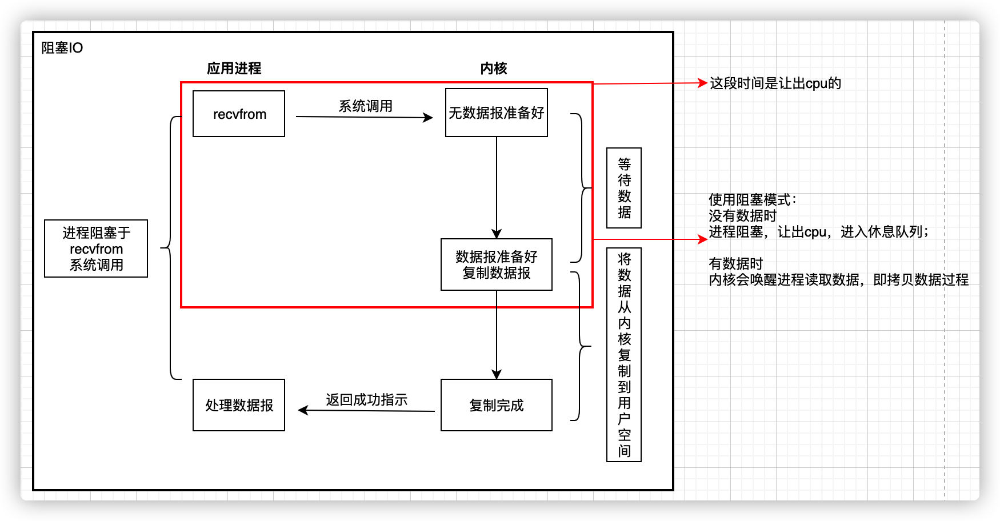
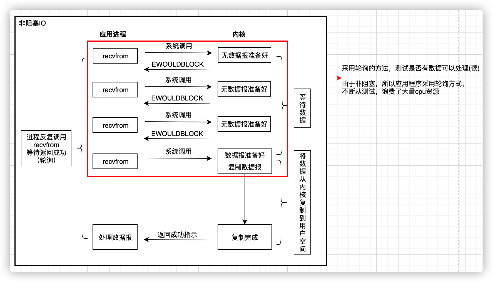
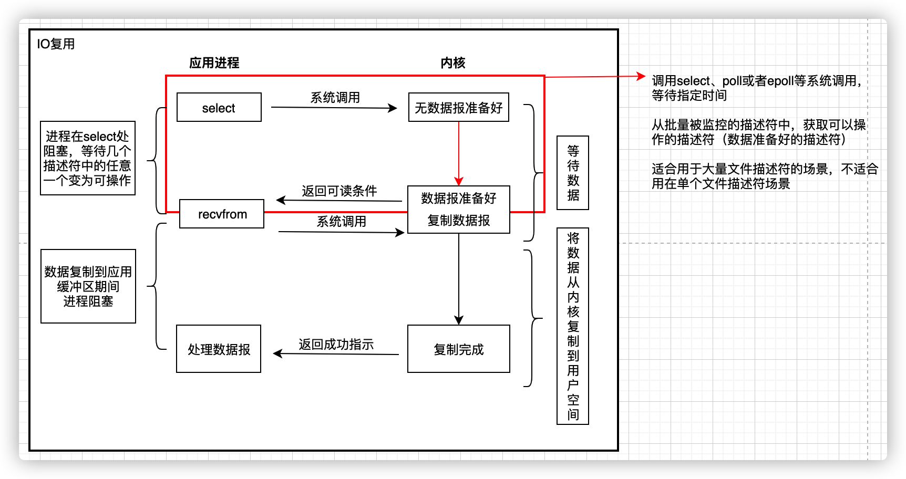
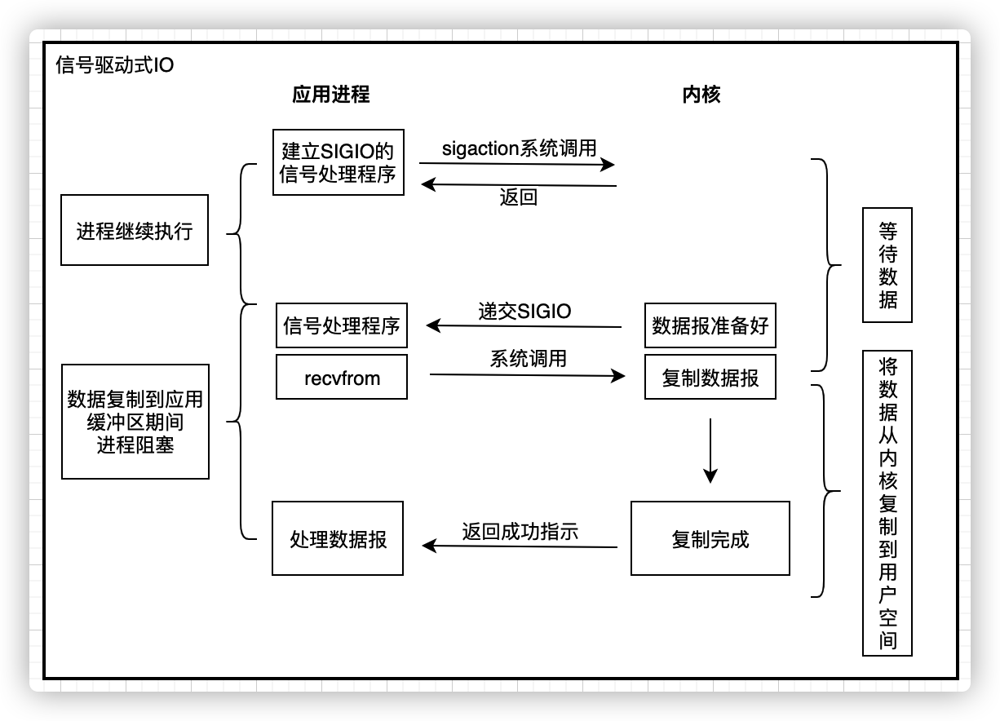
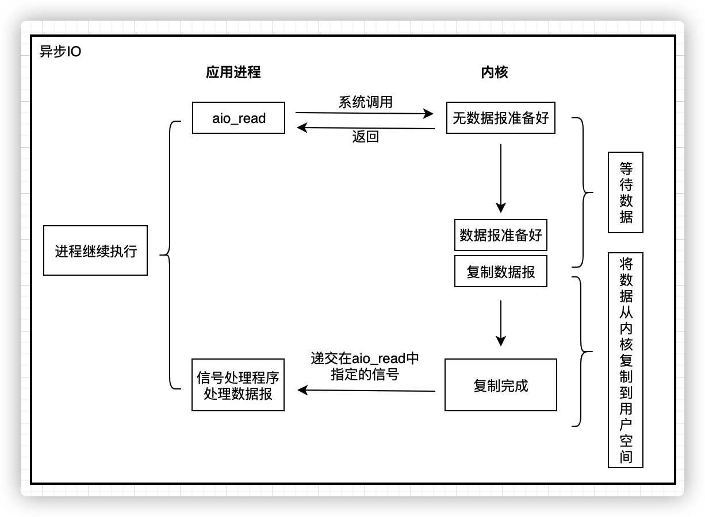
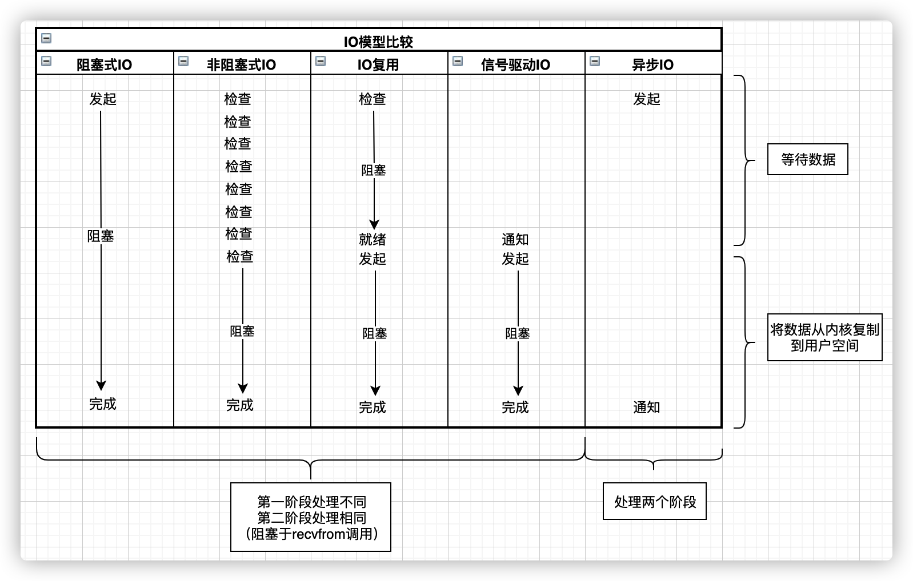

[toc]

## Unix五种I/O 模式

- 阻塞 I/O           (Linux下的I/O操作默认是阻塞I/O，即open和socket创建的I/O都是阻塞I/O)

- 非阻塞 I/O        (可以通过fcntl或者open时使用O_NONBLOCK参数，将fd设置为非阻塞的I/O)

- I/O 多路复用     (I/O多路复用，通常需要非阻塞I/O配合使用)

- 信号驱动 I/O    (SIGIO)

- 异步 I/O   (aio_系列函数)

### 五种IO模型都包含两个阶段

1. 等待数据准备好（等待数据从网络中到达，数据到达后，被复制到内核的缓冲区中） 
2. 从内核缓冲区向用户缓冲区复制数据

分别介绍不同的IO模型，并且使用UDP作为例子，因为UDP整个数据报要么已经收到，要么没有。

### 阻塞IO

进程处于阻塞模式时，让出CPU，进入休眠状态

一个进程调用 recvfrom  ，然后系统调用并不返回，直到有数据报到达本地系统且被复制到应用进程的缓冲区或者发生错误才返回。 （如果系统调用收到一个中断信号，则它的调用会被中断）

我们称这个进程在调用recvfrom一直到从recvfrom返回这段时间是阻塞的。当recvfrom正常返回时，我们的进程继续它的操作。

### 非阻塞IO

等待数据的阶段是非阻塞的，也就是当没有数据报准备好，recvfrom立即返回一个错误，但是当数据包准备好了，recvfrom将数据报从内核缓冲区复制到应用进程缓冲区后返回。

### I/O多路复用

io复用模型是阻塞在select/poll或epoll函数(2.6内核开始支持)系统调用之上的，而没有阻塞在真正的I/O系统调用如recvfrom之上。它等待数据报套接字变为可读，当数据报可读时，调用recvfrom把数据报复制到应用进程缓冲区中。

> 当我们调用 select函数阻塞的时候，select 函数等待数据报套接字进入读就绪状态。当select函数返回的时候， 也就是套接字可以读取数据的时候。 这时候我们就可以调用 recvfrom函数来将数据拷贝到我们的程序缓冲区中。

对于单个I/O操作，和阻塞模式相比较，select()和poll()或epoll并没有什么高级的地方。而且，

- 阻塞模式下只需要调用一个函数：读取或发送函数。

- 使用了多路复用技术后，我们需要调用两个函数了：先调用 select()函数或poll()函数，然后才能进行真正的读写。

多路复用的高级之处在于:

它能同时等待多个文件描述符，而这些文件描述符（套接字描述符）其中的任意一个进入读就绪状态，select()函数就可以返回

IO 多路技术一般在下面这些情况中被使用：

1. 当一个客户端需要同时处理多个文件描述符的输入输出操作的时候（一般来说是标准的输入输出和网络套接字)，I/O 多路复用技术将会有机会得到使用。
2. 当程序需要同时进行多个套接字的操作的时候。
3. 如果一个 TCP 服务器程序同时处理正在侦听网络连接的套接字和已经连接好的套接字。
4. 如果一个服务器程序同时使用 TCP 和 UDP 协议。
5. 如果一个服务器同时使用多种服务并且每种服务可能使用不同的协议（比如 inetd就是这样的）。

### 信号驱动式IO

通过sigaction系统调用安装一个信号处理函数，系统调用立即返回，当数据报准备好读取时，内核产生一个信号，随后就可以在信号处理函数中调用recvfrom读取数据报，将数据从内核空间复制到用户空间

### 异步IO

调用aio_系列函数，给内核传递描述符、缓冲区指针、缓冲区大小和文件偏移，该系统调用立即返回，当整个IO操作完成，即数据报到达，并且从内核缓冲区被复制到用户缓冲区后，才产生一个信号。

当我们运行在异步 I/O 模式下时，我们如果想进行 I/O 操作，只需要告诉内核我们要进行 I/O 操作，然后内核会马上返回。具体的 I/O 和数据的拷贝全部由内核来完成，我们的程序可以继续向下执行。当内核完成所有的 I/O 操作和数据拷贝后，内核将通知我们的程序。

异步 I/O 和  信号驱动I/O的区别是：

1. 信号驱动 I/O 模式下，内核在操作可以被操作的时候通知给我们的应用程序发送SIGIO 消息。
2. 异步 I/O 模式下，内核在所有的操作都已经被内核操作结束之后才会通知我们的应用程序

## IO模型比较

对比几种模型，可以看出，前4种模型区别主要在第一阶段，它们的第二阶段是一样的：在数据从内核复制到调用者缓冲区期间，进程是阻塞于recvfrom调用，而异步IO，这两个阶段都要处理完毕。

### 同步IO/异步IO

- 同步IO操作：导致请求进程阻塞，直到IO操作完成。 
- 异步IO操作：不导致进程阻塞。

  所以前4种都是同步IO模型，因为发生了阻塞。

### 阻塞/非阻塞

在处理（网络） IO 的时候，阻塞和非阻塞都是同步IO，阻塞与非阻塞的区分在于网络IO时进行IO操作的线程会不会挂起。

其实对于某些IO模型来说，阻塞非阻塞其实比较难定义，比如select模型中指用户线程不会阻塞于recvfrom等网络IO操作上，但在select操作本身上是阻塞的，不过因为网络IO并未阻塞的原因仍称selec模型为非阻塞的模型。