[toc]

不学习底层知识可能不会阻碍你称为一个称职的程序员，但也许会阻碍你成为一个优秀的程序员。我所理解的底层知识，是指编程或开发所依赖的平台(或者框架、工具)的知识。对于 Java 开发者来 说，虚拟机、字节码就是其底层知识。

# 1. Hello, World

这篇文章我们以输出 "Hello, World" 来开始字节码之旅，如果之前没有怎么接触过字节码的话，这篇文章应该能够让你对字节码有一个最基本的认识。 

## 0x01 java 文件如何变成 .class文件

新建一个 Hello.java 文件，源码如下:

```java
public class Hello {
	public static void main(String[] args) {
		System.out.println("Hello, World"); 
  }
}
```

Java 从源文件到执行的过程如下图所示

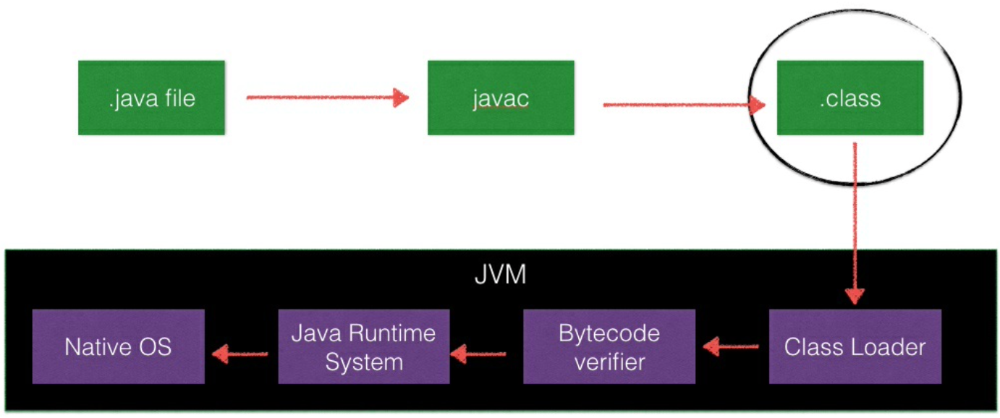

JDK 工具 javac(java 编译器)帮我们完成了源文件编译成 JVM 可识别的 class 文件的工作。 在命令行中执行javac Hello.java，可以看到生成了 Hello.class 文件。用xxd 命令以 16 进制的方式查看这个 class 文件。

```shell
xxd Hello.class

00000000: cafe babe 0000 0034 0022 0a00 0600 1409 .......4."...... 
00000010: 0015 0016 0800 170a 0018 0019 0700 1a07 ................ 
00000020: 001b 0100 063c 696e 6974 3e01 0003 2829 .....<init>...() 
00000030: 5601 0004 436f 6465 0100 0f4c 696e 654e V...Code...LineN 
00000040: 756d 6265 7254 6162 6c65 0100 124c 6f63 umberTable...Loc 
00000050: 616c 5661 7269 6162 6c65 5461 626c 6501 alVariableTable. 
00000060: 0004 7468 6973 0100 074c 4865 6c6c 6f3b ..this...LHello;
```

## 0x02 魔数 0xCAFEBABE


class 文件的头四个字节称为魔数(Magic Number)，可以看到 class 的魔数为 0xCAFEBABE。很多文件都以魔数来进行文件类型的区分，比如 PDF 文件的魔数是%PDF-(16进制0x255044462D)，png 文件的 魔数是\x89PNG(0x89504E47)。文件格式的制定者可以自由的选择魔数值，只要魔数值还没有被广泛的采用过且不会引起混淆即可。

Java 早期开发者选用了这样一个浪漫气息的魔数，高司令有解释这一段 轶事。这个魔数值在 Java 还成为 Oak 语言的时候就已经确定下来了。

这个魔数是 JVM 识别 .class 文件的标志，虚拟机在加载类文件之前会先检查这四个字节，如果不是 0xCAFEBABE 则拒绝加载该文件，更多关于字节码格式的说明，我们会在后面的文章中慢慢介绍。

## 0x03 javap 详解

类文件是二进制块，想直接与它打交道比较艰难，但是很多情况下我们必须理解类文件。比如服务器上的接又出了 bug，重新打包部署以后问题并没有解决，为了找出原因你可能需要看一下部署以后的 class 文件究竟是不是我们想要的。还有一种情况跟你合作的开发商跑路了，只给你留下一堆编译过的代码，没有源代码，当出 bug 时我们需要研究这些类文件，看问题出在哪里。 好在 JDK 提供了专门 用来分析类文件的工具:javap，用来方便的窥探 class 文件内部的细节。javap 有比较多的参数选项，其中-c -v -l -p -s 是最常用的。

```she
Usage: javap <options> <classes> where possible options include:

-help --help -? 								Print this usage message
-version 												Version information
-v -verbose 										Print additional information
-l 															Print line number and local variable tables
-public 												Show only public classes and members
-protected 											Show protected/public classes and members
-package 												Show package/protected/public classes and members (default)
-p -private 										Show all classes and members
-c 															Disassemble the code
-s 															Print internal type signatures
-sysinfo 												Show system info (path, size, date, MD5 hash) of class being processed
-constants 											Show final constants
-classpath <path> 							Specify where to find user class files
-cp <path> 											Specify where to find user class files
-bootclasspath <path> 					Override location of bootstrap class files
```

### -c  选项

最常用的选项是 -c，可以对类进行反编译，执行 javap -c Hello 的输出结果如下：

```shell
Compiled from "Hello.java" 
public class Hello {
	public Hello(); 
		Code:
				0: aload_0 
				1: invokespecial #1 		// Method java/lang/Object."<init>":()V
		  	4: return
	public static void main(java.lang.String[]);
		Code:
				0: getstatic #2 				// Field java/lang/System.out:Ljava/io/PrintStream; 
				3: ldc #3 							// String Hello, World 
				5: invokevirtual #4 		// Method java/io/PrintStream.println:(Ljava/lang/String;)V 
				8: return
}
```

上⾯代码前⾯的数字表⽰从⽅法开始算起的字节码偏移量 

- 3 ~ 7 ⾏：可以看到虽然没有写 Hello 类的构造器函数，编译器会⾃动加上⼀个默认构造器函数 
- 5 ⾏：aload_0 这个操作码是 aload_x 格式操作码中的⼀个。它们⽤来把对象引⽤加载到操作数栈。 x 表⽰正在被访问的局部变量数组的位置。在这⾥的 0 代表什么呢？我们知道⾮静态的函数都有第 ⼀个默认参数，那就是 this，这⾥的 aload_0 就是把 this ⼊栈 
- 6 ⾏：invokespecial #1，invokespecial 指令调⽤实例初始化⽅法、私有⽅法、⽗类⽅法，#1 指的是常量池中的第⼀个，这⾥是⽅法引⽤java/lang/Object."<init>":()V，也即构造器函数 
- 7 ⾏：return，这个操作码属于 ireturn、lreturn、freturn、dreturn、areturn 和 return 操作码组中的⼀员，其中 i 表⽰ int，返回整数，同类的还有 l 表⽰ long，f 表⽰ float，d 表⽰ double，a 表⽰ 对象引 ⽤。没有前缀类型字母的 return 表⽰返回 void 

到此为⽌，默认构造器函数就讲完了，接下来，我们来看 9 ~ 14 ⾏的 main 函数 

- 11 ⾏：getstatic #2，getstatic 获取指定类的静态域，并将其值压⼊栈顶，#2 代表常量池中的第 2 个，这⾥表⽰的是java/lang/System.out:Ljava/io/PrintStream;，其实就是java.lang.System 类的静态 变量 out（类型是 PrintStream） 
- 12 ⾏：ldc #3，ldc ⽤来将常量从运⾏时常量池压栈到操作数栈，#3 代表常量池的第三个（字符串 Hello, World） 
- 13 ⾏：invokevirtual #4，invokevirutal 指令调⽤⼀个对象的实例⽅法，#4 表⽰ PrintStream.println(String) 函数引⽤，并把栈顶两个元素出栈

### -p 选项

默认情况下，javap 会显⽰访问权限为 public、protected 和默认（包级 protected）级别的⽅法，加上 -p 选项以后可以显⽰ private ⽅法和字段

### -v 选项 

javap 加上 -v 参数的输出更多详细的信息，⽐如栈⼤⼩、⽅法参数的个数。

```shell
public Hello(); 
		stack=1, locals=1, args_size=1

public static void main(java.lang.String[]); 
		stack=2, locals=1, args_size=1
```

为什么Hello() 和main()的args_size都等于1呢？明明 Hello 的构造器函数没有参数的呀？ 对于⾮静态函数，this对象会作为函数的隐式第⼀个参数，所以 Hello() 的args_size=1 对于静态main函数，不需 要this对象，它的参数就是String[] args这个数组，也等于1

### -s 选项

javap 还有⼀个好⽤的选项 -s，可以输出签名的类型描述符。我们可以看下 Hello.java 所有的⽅法签名

```shell
javap -s Hello 

Compiled from "Hello.java" 
public class Hello {
	public Hello();
		descriptor: ()V
	public static void main(java.lang.String[]);
		descriptor: ([Ljava/lang/String;)V 
}
```

可以看到 main 函数的⽅法签名是 ([Ljava/lang/String;)V。JVM 内部使⽤⽅法签名与我们⽇常阅读的⽅法签名不太⼀样，但是后⾯会频繁遇到，主要分为两部分字段描述符和⽅法描述符。 字段描述符（Field Descriptor），是⼀个表⽰类、实例或局部变量的语法符号，它的表⽰形式是紧凑的，⽐如 int 是⽤ I 表⽰的。完整的类型描述符如下表

| 描述符       | 类型                                         |
| ------------ | -------------------------------------------- |
| B            | byte                                         |
| C            | char                                         |
| D            | double                                       |
| F            | float                                        |
| I            | int                                          |
| J            | long                                         |
| L Classname; | 引用类型（比如Ljava/lang/String;用于字符串） |
| S            | short                                        |
| Z            | boolean                                      |
| [            | Array-of                                     |

⽅法描述符（Method Descriptor）表⽰⼀个⽅法所需参数和返回值信息，表⽰形式为( ParameterDescriptor* ) ReturnDescriptor 。 ParameterDescriptor 表⽰参数类型，ReturnDescriptor表⽰返回值信息， 当没有返回值时⽤V表⽰。⽐如⽅法Object foo(int i, double d, Thread t) 的描述符为(IDLjava/lang/Thread;)Ljava/lang/Object;

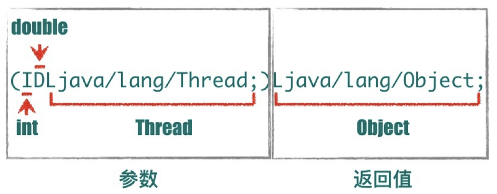

## 0x04 小结

这篇⽂章讲解了⼀个输出 "Hello, World" 的字节码的细节，⼀起来回顾⼀下要点：

- 第⼀，class ⽂件的魔数是具有浪漫⽓息的 0xCAFEBABE； 
- 第⼆，我们讲解了字节码分析的利器 javap 的各个参数详细的⽤法；
- 第三，讲解了字段描述符与⽅法描述符在 JVM 层⾯的表⽰规则，⽅便我们后⾯⽂章的理解。

## 0x05 思考

最后，给你留⼀个思考题，javap 的 -l 参数有什么⽤？ 欢迎你在留⾔区留⾔，和我⼀起讨论。


---


# 2. jvm的运行

## 0x01 虚拟机：stack based vs register based


虚拟机常见的实现⽅式有两种：Stack based 的和 Register based。⽐如基于 Stack 的虚拟机有Hotspot JVM、.net CLR，这种基于 Stack 实现虚拟机是⼀种⼴泛的实现⽅法。⽽基于 Register 的虚拟机有 Lua 语 ⾔虚拟机 LuaVM 和 Google 开发的安卓虚拟机 DalvikVM。 

两者有什么不同呢？举⼀个计算两数相加的例⼦：c = a + b 基于 HotSpot JVM 的源码和字节码如下

源码 

```java
void bar(int a, int b) { 
  int c = a + b; 
}
```

对应字节码

```shell
0: iload_1 	// 将 a 压⼊操作数栈 
1: iload_2 	// 将 b 压⼊操作数栈 
2: iadd 		// 将栈顶两个值出栈，相加，然后将结果放回栈顶 
3: istore_3 // 将栈顶值存⼊局部变量表中第 3 个 slot 中
```

基于寄存器的 LuaVM 的 lua 源码和字节码如下，查看字节码使⽤ luac -l -l -v -s test.lua 命令

源码 

```lua
local function my_add(a, b) 
  return a + b; 
end
```

对应字节码 

```shell
1 [3] ADD			2 0 1
```

基于寄存器的 add 指令直接把寄存器 R0 和 R1 相加，结果保存在寄存器 R2 中。 

基于栈和寄存器的指令集各有优缺点，基于栈的指令集移植性更好，代码更加紧凑、编译器实现更加简单，但完成相同功能所需的指令数⼀般⽐寄存器架构多，需要频繁的⼊栈出栈，栈架构指令集的执 ⾏速度会相对⽽⾔慢⼀些。

为了理解字节码的细节，我们需要详细了解字节码的执⾏过程。众所周知，Hotspot JVM 是⼀个基于栈的虚拟机，每个线程都有⼀个虚拟机栈，存储了「栈帧」。每次⽅法调⽤都伴随着栈帧的创建销 毁。

## 0x02 栈帧

栈帧（Stack Frame）是⽤于⽀持虚拟机进⾏⽅法调⽤和⽅法执⾏的数据结构 栈帧随着⽅法调⽤⽽创建，随着⽅法结束⽽销毁，栈帧的存储空间分配在 Java 虚拟机栈中，每个栈帧拥有⾃⼰的局部变量表 （Local Variables）、操作数栈（Operand Stack） 和 指向运⾏时常量池的引⽤

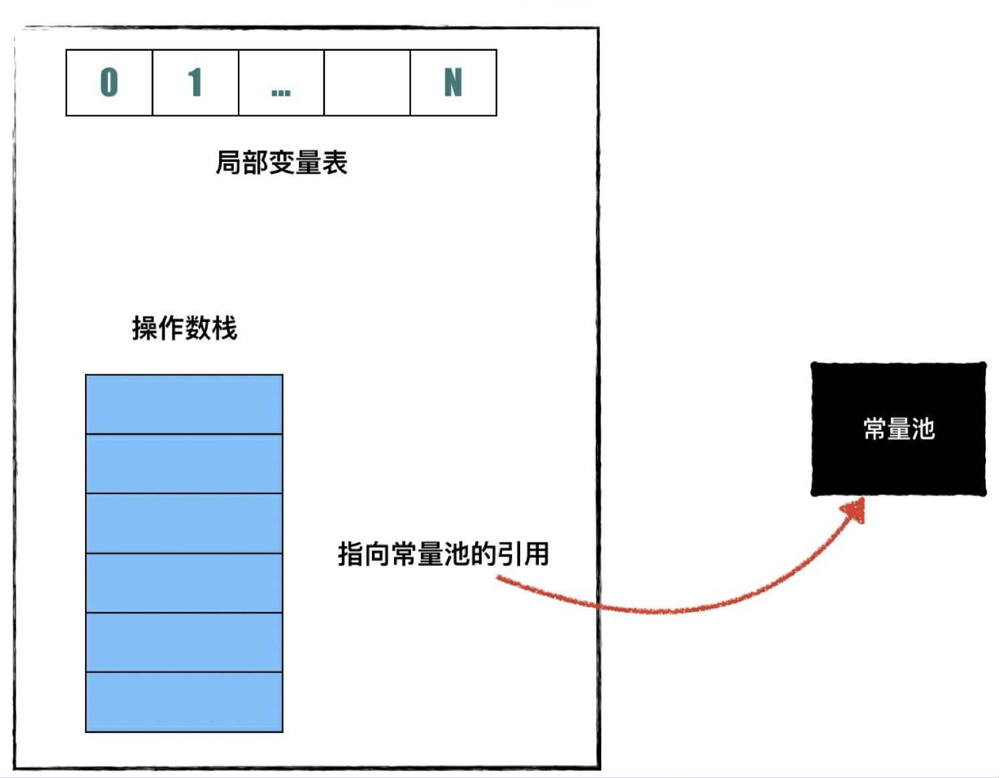

### 局部变量表

每个栈帧内部都包含⼀组称为局部变量表（Local Variables）的变量列表，局部变量表的⼤⼩在编译期间就已经确定。Java 虚拟机使⽤局部变量表来完成⽅法调⽤时的参数传递，当⼀个⽅法被调⽤时，它 的参数会被传递到从 0 开始的连续局部变量列表位置上。当⼀个实例⽅法（⾮静态⽅法）被调⽤时，第 0 个局部变量是调⽤这个实例⽅法的对象的引⽤（也就是我们所说的 this ）

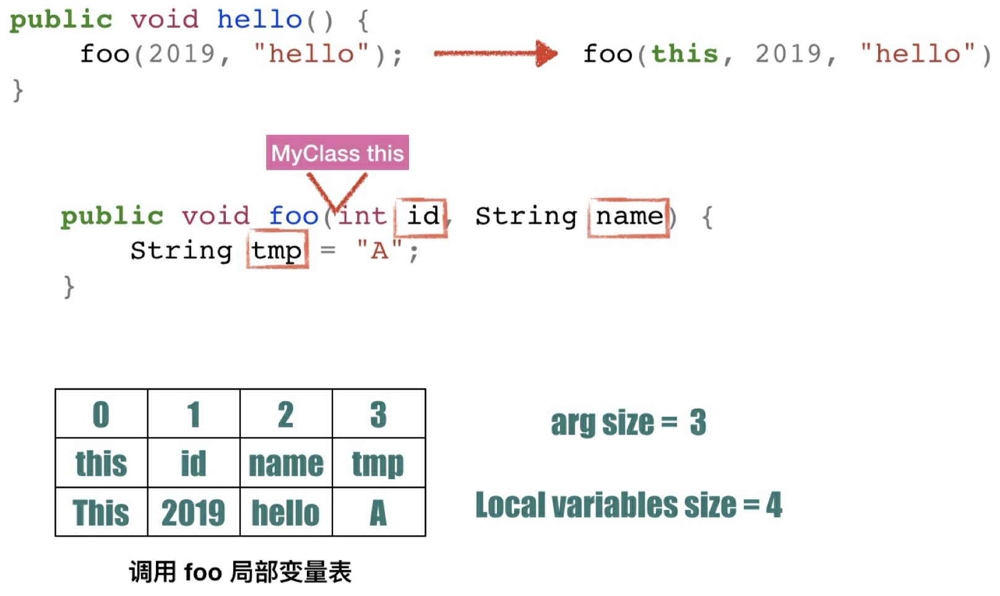

### 操作数栈

每个栈帧内部都包含了⼀个称为操作数栈的后进先出（LIFO）栈，栈的⼤⼩同样也是在编译期间确定。Java 虚拟机提供的⼀些字节码指令⽤来从局部变量表或者对象实例的字段中复制常量或者变量到操 作数栈，也有⼀些指令⽤于从操作数栈取⾛数据、操作数据和把操作结果重新⼊栈。在⽅法调⽤时，操作数栈也⽤来准备调⽤⽅法的参数和接收⽅法返回的结果。

⽐如 iadd 指令⽤来将两个 int 类型的数值相加，它要求执⾏之前操作数栈已经存在两个由前⾯其它指令放⼊的 int 型数值，在 iadd 指令执⾏时，两个 int 值从操作数栈中出栈，相加求和，然后将求和的结 果重新⼊栈。

⽐如 1 + 2 这样的指令执⾏过程如下

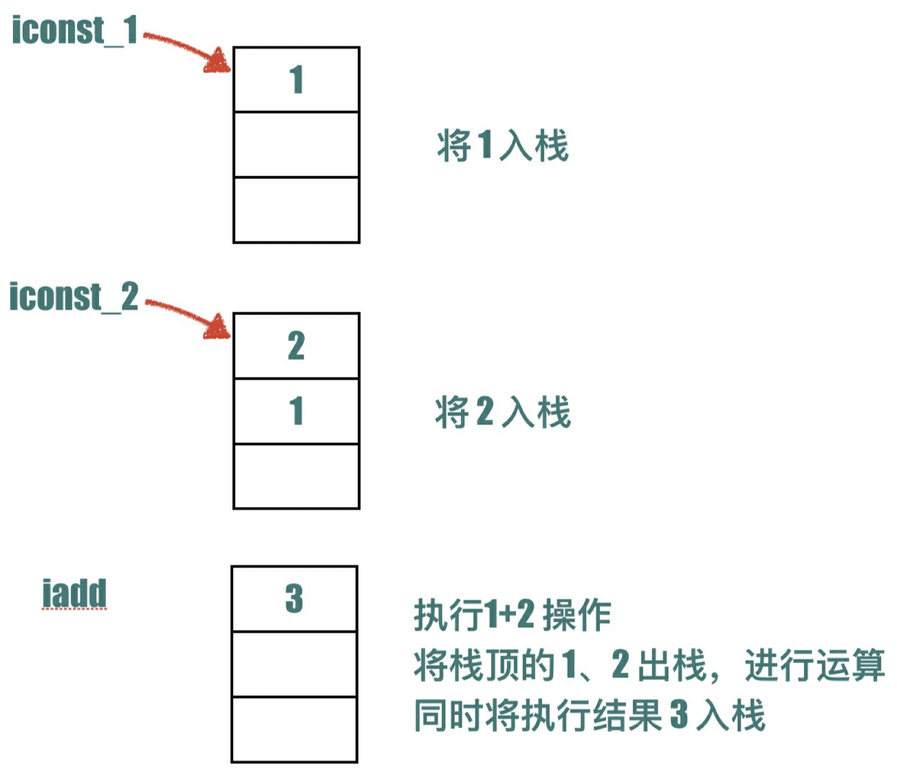

整个 JVM 指令执⾏的过程就是局部变量表与操作数栈之间不断 load、store 的过程

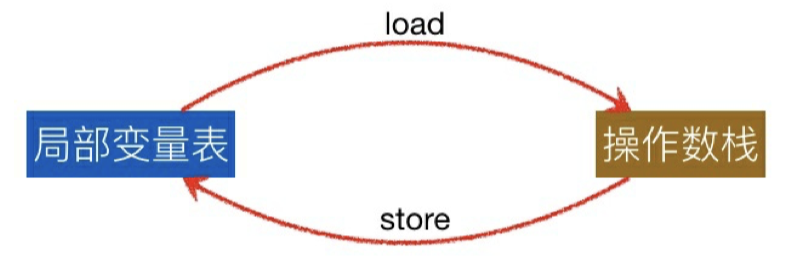

我们再来看⼀个稍微复杂⼀点的例⼦

```java
public class ScoreCalculator {
	public void record(double score) { 
  }
	public double getAverage() { 
    return 0; 
  }
} 

public static void main(String[] args) { 
  ScoreCalculator calculator = new ScoreCalculator();
	
  int score1 = 1; 
  int score2 = 2;
	
  calculator.record(score1); 
  calculator.record(score2);
  
	double avg = calculator.getAverage();
}
```

javap 查看字节码输出如下

```shell
public static void main(java.lang.String[]); 
descriptor: ([Ljava/lang/String;)V 
flags: ACC_PUBLIC, ACC_STATIC 
Code:
	stack=3, locals=6, args_size=1 
	0: new #2 								// class ScoreCalculator 
	3: dup 
	4: invokespecial #3 			// Method ScoreCalculator."<init>":()V 
	7: astore_1

	8: iconst_1 
	9: istore_2
	
	10: iconst_2 
	11: istore_3
	
	12: aload_1 
	13: iload_2 
	14: i2d 
	15: invokevirtual #4			// Method ScoreCalculator.record:(D)V

	18: aload_1 
	19: iload_3 
	20: i2d 
	21: invokevirtual #4			// Method ScoreCalculator.record:(D)V

	24: aload_1 
	25: invokevirtual #5 			// Method ScoreCalculator.getAverage:()D
	28: dstore 4

	30: return
```

- 0 ~ 7：新建了⼀个 ScoreCalculator 对象，使⽤ astore_1 存储在局部变量 calculator 中：astore_1 的含义是把栈顶的值存储到局部变量表下标为 1 的位置上，这⾥为什么会有⼀个 dup，我们后⾯会讲到 
- 8 ~ 11：iconst_1 和 iconst_2 ⽤来将整数 1 和 2 加载到栈顶，istore_2 和 istore_3 ⽤来将栈顶的元素存储到局部变量表 2 和 3 的位置上 
- 12 ~ 15：可以看到 *store* 指令会把栈顶元素移除，所以下次我们要⽤到这些局部变量时，需要使⽤ load 命令重新把它加载到栈顶。⽐如我们要执⾏calculator.record(score1)，对应的字节码如 下

> 12: aload_1 
>
> 13: iload_2 
>
> 14: i2d 
>
> 15: invokevirtual #4 			// Method ScoreCalculator.record:(D)V
>
> 可以看到 aload_1 先从局部变量表中 1 的位置加载 calculator 对象，iload_2 从 局部变量表中 2 的位置加载⼀个整型值，i2d 这个指令⽤来将整型值转为 double 并将新的值重新⼊栈，到⽬前为⽌参数全部就 绪，可以⽤ invokevirtual 执⾏⽅法调⽤了

- 24 ~ 28：同样是⼀个普通的⽅法调⽤，流程还是先 aload_1 加载 calculator 对象，invokevirtual 调⽤ getAverage ⽅法，并将 栈顶元素存储到局部变量表下标为 4 的位置上 有⼀点需要注意的是 javap 输出的 locals=6，但是我们⽬前看到的局部变量只有args、calculator、score1、score2、avg这 5 个，为什么这⾥等于 6 呢？这是因为 avg 为 double 型变量，需要两个槽位 （slot） 整个过程局部变量表如下图所⽰

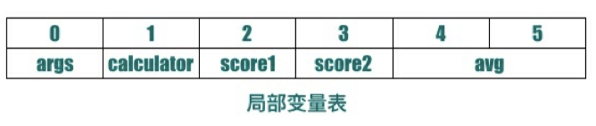

其实局部变量表可以通过 javap ⽤ -l 参数直接输出，但是我们⽤ javap -v -p -l MyLocalVariableTest 并没有输出任何局部变量表相关的信息。这是因为默认情况下局部变量表属于调试级别的信 息，javac 编译的时候并没有编译进字节码，我们可以加上 javac -g ⽣成字节码的时候同时⽣成所有的调试信息，如下所⽰

```shell
javac -g MyLocalVariableTest.java 
javap -v -p -l MyLocalVariableTest 

LocalVariableTable:
Start Length Slot Name Signature
		0 		31 		0 args [Ljava/lang/String; 
		8 		23 		1 calculator LScoreCalculator; 
		10 		21 		2 score1 	I 
		12 		19 		3 score2 	I 
		30 		 1 		4 avg 		D
```

## 0x03 从⼆进制看 class ⽂件和字节码

```java
public class Get { 
  String name;
	public String getName() { 
	  return name; 
	}
}
```

javap 查看字节码如下

```shell
public java.lang.String getName(); 
descriptor: ()Ljava/lang/String; 
flags: ACC_PUBLIC 
Code:
	stack=1, locals=1, args_size=1 
	0: aload_0 
	1: getfield #2 		// Field name:Ljava/lang/String; 
	4: areturn
```

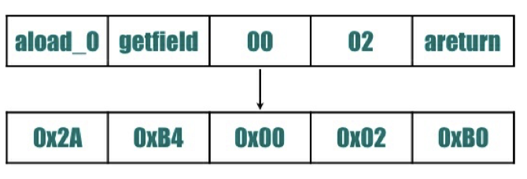

直接从⼆进制来看下这个 class ⽂件 xxd Get.class

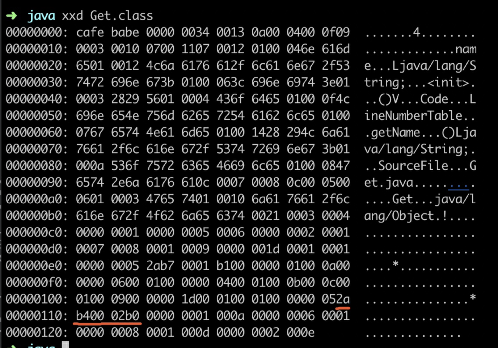

我们可以⼿动⽤ 16 进制编辑器去修改这些字节码⽂件，只是⽐较容易出错，所以产⽣了⼀些字节码操作的⼯具，最出名的莫过于 ASM 和 Javassist。我们后⾯讲到软件破解的时候，会介绍直接修改字节 码和通过 ASM 动态修改字节码这两种⽅式

## 0x04 ⼩结

⼀起来回顾⼀下这篇⽂章的要点：

- 第⼀，基于栈和基于寄存器指令集的优劣势； 
- 第⼆，讲解了 JVM 栈帧的构成（局部变量表、操作数栈、指向运⾏时常量池的引⽤），顺带讲解了 javap -l 参数和其在局部变量表中的应⽤；
-  第三，从类⽂件⼆进制⾓度看字节码的实现，并引出 ASM 字节码改写技术。

## 0x05 思考

最后，给你留⼀道作业，⽤ Java 写⼀个简单的 class ⽂件解析⼯具⽀持输出函数列表。


---


# 3. 控制转移指令

控制转移指令，也就是 if-else、三⽬表达式、switch-case 背后的指令。

## 0x01 概述

根据字节码的不同⽤途，可以⼤概分为如下⼏类 

- 加载和存储指令，⽐如 iload 将⼀个整形值从局部变量表加载到操作数栈 
- 控制转移指令，⽐如条件分⽀ ifeq 
- 对象操作，⽐如创建类实例的指令 new 
- ⽅法调⽤，⽐如 invokevirtual 指令⽤于调⽤对象的实例⽅法 
- 运算指令和类型转换，⽐如加法指令 iadd 
- 线程同步，monitorenter 和 monitorexit 两条指令来⽀持 synchronized 关键字的语义 
- 异常处理，⽐如 athrow 显式抛出异常

## 0x02 控制转移指令


控制转移指令根据条件进⾏分⽀跳转，我们常见的 if-then-else、三⽬表达式、for 循环、异常处理等都属于这个范畴。对应的指令集包括：

- 条件分⽀：ifeq、iflt、ifle、ifne、ifgt、ifge、ifnull、ifnonnull、if_icmpeq、 if_icmpne、if_icmplt, if_icmpgt、if_icmple、if_icmpge、if_acmpeq 和 if_acmpne。
- 复合条件分⽀：tableswitch、lookupswitch 
- ⽆条件分⽀：goto、goto_w、jsr、jsr_w、ret

看⼀个 for 循环的例⼦

```java
public class MyLoopTest { 
  public static int[] numbers = new int[]{1, 2, 3}; 
  public static void main(String[] args) { 
    ScoreCalculator calculator = new ScoreCalculator(); 
    for (int number : numbers) { 
      calculator.record(number); 
    } 
  } 
}
```

对应的字节码

```shell
public static void main(java.lang.String[]); 
Code:
	0: new 						#2 			// class ScoreCalculator 
	3: dup 
	4: invokespecial  #3 			// Method ScoreCalculator."<init>":()V 
	7: astore_1

	8: getstatic 			#4			// Field numbers:[I
 11: astore_2 
 12: aload_2 
 13: arraylength 
 14: istore_3 
 15: iconst_0 
 16: istore					4

 18: iload 					4 
 20: iload_3 
 21: if_icmpge 			43 
 24: aload_2 
 25: iload 4				4 
 27: iaload 
 28: istore 				5
 30: aload_1 
 31: iload 					5 
 33: i2d 
 34: invokevirtual  #5			// Method ScoreCalculator.record:(D)V		
 37: iinc 					4, 1
 40: goto						18
 41: return
```

先把局部变量表的⽰意图放出来便于理解


- 0 ~ 7：new、dup 和⼀个 的 invokespecial 表⽰创建新类实例，下⼀节会重点介绍 
- 8 ~ 16：是初始化循环控制变量的⼀个过程。加载静态变量数组引⽤，存储到局部变量下标为 2 的位置上，记为$array，aload_2 加载 $array到栈顶，调⽤ arraylength 指令 获取数组长度存储到栈 顶，随后调⽤ istore_3 将数组长度存储到局部变量表中第 3 个位置，记为 $len。

Java 虚拟机指令集使⽤不同的字节码来区分不同的操作数类型，⽐如 iconst_0、istore_1、iinc、if_icmplt 都只针对于 int 数据类型。

同时注意到 istore_3 和 istore 4 使⽤了不同形式的指令类型，它们的作⽤都是把栈顶元素存⼊到局部变量表的指定位置。对于 3 采⽤了 istore_3，它属于 istore_<i>指令组，其中 i 只能是0 1 2 3 。其实 把istore_3 写成 istore 3 也能获取正确的结果，但是编译的字节码会变长，在字节码执⾏时也需要获取和解析 3 这个额外的操作数。

类似的做法还有 iconst_<i>，可以将 -1 0 1 2 3 4 5 压⼊操作数栈。这么做的⽬的是把使⽤最频繁的⼏个操作数融⼊到指令中，使得字节码更简洁⾼效

iconst_0 将整型值 0 加载到栈顶，随后将它存储到局部变量表第 4 个位置，记为 $i，写成伪代码就是

```
$array = numbers; 
$len = $array.arraylength 
$i = 0
```

- 18 ~ 34：是真正的循环体。⾸先加载 $i和 $len到栈顶，然后调⽤ if_icmpge 进⾏⽐较，如果 $i >= $len ，直接跳转到指令 43，也就是 return，函数结束。如果$i < $len ，执⾏循环体，加 载$array、$i，然后 iaload 指令把下标为 $i 的数组元素加载到操作数栈上，随后存储到局部变量表下标为 5 的位置上，记为$item。随后调⽤ invokevirtual 指令来执⾏ record ⽅法 
- 37 ~ 40：执⾏循环后的 $i ⾃增操作。

iinc 这个指令⽐较特殊，之前介绍的指令都是基于操作数栈来实现功能，iinc 是⼀个例外，它直接对局部变量进⾏⾃增操作，不要先⼊栈、加⼀、再出栈，因此效率⾮常⾼，适合循环结构。

这⼀段写成伪代码就是

```
@start: if ($i >= $len) return; 
$item = $array[$i] 
++ $i 
goto @start
```

整段代码是不是⾮常熟悉，看看下⾯这个代码

```
for (int i = 0; i < numbers.length; i++) { 
	calculator.record(numbers[i]); 
}
```

由此可见，for(item : array) 就是⼀个语法糖，javac 会让它现出原形，回归到它的本质

## 0x02 你不⼀定知道的 switch 底层实现


如果让你来设计⼀个 switch-case 的底层实现，你会如何来实现？是⼀个个 if-else 来判断吗？ 实际上编译器将使⽤ tableswitch 和 lookupswitch 两个指令来⽣成 switch 语句的编译代码。为什么会有两个呢？ 这充分体现了效率上的考量。

```java
int chooseNear(int i) { 
	switch (i) { 
		case 100: return 0; 
		case 101: return 1; 
		case 104: return 4; 
		default: return -1; 
	} 
}
```

字节码如下：

```shell
0: iload_1 
1: tableswitch { // 100 to 104
				100: 36 
				101: 38 
				102: 42 
				103: 42 
				104: 40 
		default: 42 
}
36: iconst_0 		// return 0
37: ireturn 
38: iconst_1 		// return 1
39: ireturn 
40: iconst_4 		// return 4
41: ireturn 
42: iconst_m1 	// return -1
43: ireturn
```

细⼼的同学会发现，代码中的 case 中并没有出现 102、103，为什么字节码中出现了呢？ 编译器会对 case 的值做分析，如果 case 的值⽐较紧凑，中间有少量断层或者没有断层，会采⽤ tableswitch 来实现 switch-case，有断层的会⽣成⼀些虚假的 case 帮忙补齐连续，这样可以实现 O(1) 时间复杂度的查找：因为 case 已经被补齐为连续的，通过游标就可以⼀次找到。

伪代码如下

```java
int val = pop(); 								// pop an int from the stack
if (val < low || val > high) {  // if its less than <low> or greater than <high>, 
	pc += default; 								// branch to default
} else {												// otherwise
	pc += table[val - low]; 			// branch to entry in table
}
```

我们来看⼀个 case 值断层严重的例⼦

```java
int chooseFar(int i) { 
  switch (i) { 
    case 1: return 1; 
    case 10: return 10; 
    case 100: return 100; 
    default: return -1; 
  } 
}
```

对应字节码

```shell
0: iload_1 
1: lookupswitch { // 3
					1: 36 
				 10: 38 
				100: 41 
		default: 44 
}
```

如果还是采⽤上⾯那种 tableswitch 补齐的⽅式，就会⽣成上百个假 case，class ⽂件也爆炸式增长，这种做法显然不合理。lookupswitch应运⽽⽣，它的键值都是经过排序的，在查找上可以采⽤⼆分查找的 ⽅式，时间复杂度为 O(log n)

结论是：switch-case 语句 在 case ⽐较稀疏的情况下，编译器会使⽤ lookupswitch 指令来实现，反之，编译器会使⽤ tableswitch 来实现

### 补充内容：稀疏与否到底是什么意思

读者提问，下⾯的代码编译出的 switch-case 语句为什么采⽤了 lookupswitch，⽽不是 tableswitch，不是说「如果 case 的值⽐较紧凑，中间有少量断层或者没有断层，会采⽤ tableswitch 来实现 switchcase」吗？

```java
public static void foo() {
	int a = 0; 
  switch (a) { 
    case 0:
			System.out.println("#0"); 
      break; 
    case 1:
			System.out.println("#1"); 
      break; 
    default: 
      System.out.println("default"); 
      break;
	}
}
```

对应字节码

```shell
public static void foo(); 
	0: iconst_0 
	1: istore_0 
	2: iload_0 
	3: lookupswitch { // 2 
						0: 28 
						1: 39 
			default: 50 
	}
```


这个问题⽐较有意思，我调试了⼀下 javac 的源码，主要是 tableswitch 和 lookupswitch 代价的估算。

```c
hi=1 
lo=0 
nlabels = 2

// table_space_cost = 4 + (1 - 0 + 1) = 6 
long table_space_cost = 4 + ((long) hi - lo + 1); // words

// table_time_cost = 3 
long table_time_cost = 3; // comparisons

// lookup_space_cost = 3 + 2 * 2 = 7 
long lookup_space_cost = 3 + 2 * (long) nlabels;

// lookup_time_cost = 2 
long lookup_time_cost = nlabels;

// table_space_cost + 3 * table_time_cost = 6 + 3 * 3 = 15 
// lookup_space_cost + 3 * lookup_time_cost = 7 + 3 * 2 = 13 
// opcode = 15 <= 13 ? tableswitch : lookupswich

int opcode = nlabels > 0 && 
  table_space_cost + 3 * table_time_cost <= lookup_space_cost + 3 * lookup_time_cost 
  ? tableswitch : lookupswitch;
```

所以在 case 值只有 0， 1 两个的情况下，代价的计算是 table_space_cost + 3 * table_time_cost > lookup_space_cost + 3 * lookup_time_cost，lookupswich代价更⼩选 lookupswich 


如果有三个呢？

```c
hi=2 
lo=0 
nlabels = 3

// table_space_cost = 4 + (2 - 0 + 1) = 7 
long table_space_cost = 4 + ((long) hi - lo + 1); // words

// table_time_cost = 3 
long table_time_cost = 3; // comparisons

// lookup_space_cost = 3 + 2 * 3 = 9 
long lookup_space_cost = 3 + 2 * (long) nlabels;

// lookup_time_cost = 3 
long lookup_time_cost = nlabels;

// table_space_cost + 3 * table_time_cost = 7 + 3 * 3 = 16 
// lookup_space_cost + 3 * lookup_time_cost = 9 + 3 * 3 = 18 
// opcode = 16 <= 18 ? tableswitch : lookupswich

int opcode = nlabels > 0 &&
table_space_cost + 3 * table_time_cost <= lookup_space_cost + 3 * lookup_time_cost
? tableswitch : lookupswitch;
```

所以在 case 值只有 0， 1，2 三个的情况下，代价的计算是 table_space_cost + 3 * table_time_cost < lookup_space_cost + 3 * lookup_time_cost，tableswitch 代价更⼩选 tableswitch 其实在数量极少的情况下，两个的差别不⼤，只是 javac 这⾥的算法导致选择了 lookupswitch

## 0x03 ⼩结

这篇⽂章以 for 和 switch-case 语句为例讲解了控制转移指令的实现细节，⼀起来回顾⼀下要点： 

- 第⼀，for(item : array) 语法糖实际上会改写为for (int i = 0; i < numbers.length; i++) 的形式；
- 第⼆，switch-case 语句 在 case 稀疏程度不同的情况下会分别采⽤ lookupswitch 和 tableswitch 指令来实现。

## 0x04 思考

最后，给你留⼀个道作业题，switch-case 语句⽀持枚举类型，你能通过分析字节码写出其底层的实现原理吗？


---


# 4. 对象相关字节码

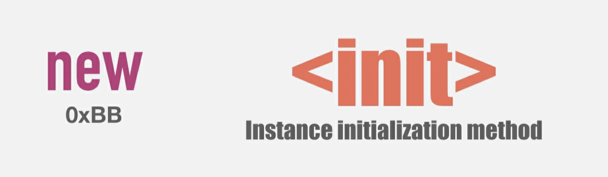

## 0x01 new, \<init> & \<clinit>

在 Java 中 new 是⼀个关键字，在字节码中也有⼀个指令 new。当我们创建⼀个对象时，背后发⽣了哪些事情呢？

```java
ScoreCalculator calculator = new ScoreCalculator();
```

对应的字节码如下：

```shell
0: new 						#2 			// class ScoreCalculator
3: dup 
4: invokespecial  #3			// Method ScoreCalculator."<init>":()V

7: astore_1
```

⼀个对象创建的套路是这样的：new、dup、invokespecial，下次遇到同样的指令要形成条件反射。 


为什么创建⼀个对象需要三条指令呢？ 

⾸先，我们需要清楚类的构造器函数是以 <init>函数名出现的，被称为实例的初始化⽅法。调⽤ new 指令时，只是创建了⼀个类的实例，但是还没有调⽤构造器函 数，使⽤ invokespecial 调⽤了 <init> 后才真正调⽤了构造器函数，正是因为需要调⽤这个函数才导致中间必须要有⼀个 dup 指令，不然调⽤完<init>函数以后，操作数栈为空，就再也找不回刚刚创建 的对象了。

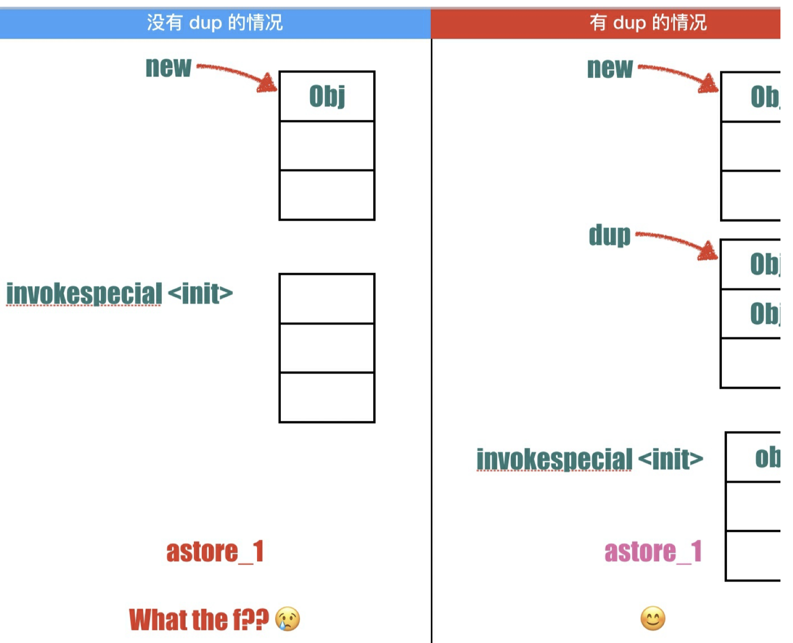

前⾯我们知道 <init> 会调⽤构造器函数，<clinit> 是类的静态初始化 ⽐ <init> 调⽤得更早⼀些，<clinit> 不会直接被调⽤，它在下⾯这个四个指令触发调⽤：new, getstatic, putstatic or invokestatic 。也就是说，初始化⼀个类实例、访问⼀个静态变量或者⼀个静态⽅法，类的静态初始化⽅法就会被触发。

看⼀个具体的例⼦

```java
public class Initializer { 
  static int a; 
  static int b; 
  static {
    a = 1; 
    b = 2; 
  } 
} 
```

部分字节码如下 

```shell
static {}; 
	0: iconst_1 
	1: putstatic 		#2				// Field a:r
	4: iconst_2 
	5: putstatic 		#3				// Field b:I
	8: return
```

上⾯的 static {} 就对应我们刚说的 <clinit>

## 0x02 相关⾯试题分析

某东的⼀个⾯试题如下，类 A 和类 B 的关系如下

```java
public class A { 
  static { 
    System.out.println("A init"); 
  } 
  public A() { 
    System.out.println("A Instance" ); 
  } 
}

public class B extends A { 
  static { 
    System.out.println("B init"); 
  } 
  public B() { 
    System.out.println("B Instance" ); 
  } 
}
```

### 问题 1： A a = new B(); 输出结果及正确的顺序？ 

要彻底搞清楚这个问题，需要弄清楚 B 构造器函数的字节码。

```shell
public B();
	0: aload_0 	
	1: invokespecial 		#1 		// Method A."<init>":()V
	4: getstatic 				#2 		// Field java/lang/System.out:Ljava/io/PrintStream;
	7: ldc 							#3 		// String B Instance
	9: invokevirtual 		#4 		// Method java/io/PrintStream.println:(Ljava/lang/String;)V
 12: return
```

从 B 的构造器函数字节码可以看到它⾸先默默的帮忙调⽤了 A 的构造器函数 所以刚刚的过程是 new B() 的 <init> 触发了 B 的静态初始化 <clinit>，但这时⽗类 A 还没有进⾏静态初始化，会先进⾏ A 的静态初始化，然后执⾏ B 的构造器函数时，先调⽤了 A 的 <init> 构造器函数，最后执⾏ B 的构造器函数。

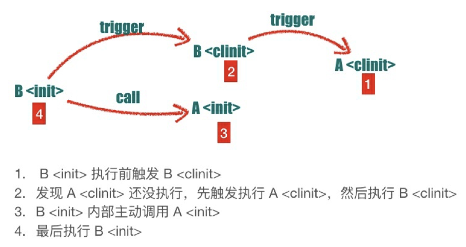

所以上述答案是：

```
A init 
B init 
A Instance 
B Instance
```

### 问题 2：B[] arr = new B[10] 会输出什么？

这涉及到数组的初始化指令，对应字节码如下：

```shell
bipush 10 
anewarray 'B' 
astore 1
```

anewarray 接收栈顶的元素（数组的长度），新建⼀个数组引⽤。由此可见新建⼀个 B 的数组没有触发任何类或者实例的初始化操作。所以问题 2 的答案是什么也不会输出 

### 问题 3：新增⼀个静态不可变对象会输出什么？

如果把 B 的代码稍微改⼀下，新增⼀个静态不可变对象，调⽤System.out.println(B.HELLOWORD) 会输出什么？

  ```java
  public class B extends A { 
    public static final String HELLOWORD = "hello word" ; 
    static{ 
      System.out.println("B init"); 
    } 
    public B() { 
      System.out.println("B Instance" ); 
    } 
  } 
  
  public class InitOrderTest { 
    public static void main(String[] args) { 
      System.out.println(B.HELLOWORD); 
    } 
  }
  ```

同样这⾥要回归到字节码和 JVM 本⾝上，System.out.println(B.HELLOWORD)对应的字节码如下：

```shell
0: getstatic 			#2 			// Field java/lang/System.out:Ljava/io/PrintStream;
3: ldc 						#4 			// String hellow word
5: invokevirtual	#5			// Method java/io/PrintStream.println:(Ljava/lang/String;)V
```

InitOrderTest 常量池信息如下： 

```shell
#1 = Methodref 			#7.#21 		// java/lang/Object."<init>":()V
#2 = Fieldref 			#22.#23 	// java/lang/System.out:Ljava/io/PrintStream;
#3 = Class 					#24 			// B
#4 = String 				#25				// hellow word
```

可以看到同样没有触发任何 B 有关的初始化指令。虽然我们引⽤了 B 类的常量 HELLOWORD，但是这个常量在编译期间就被放到了 InitOrderTest 类的常量池中，不会与 B 发⽣任何关系 所以题⽬ 3 的答 案除了"hello world"以外什么也不会输出。

### 问题 4：为什么局部变量没有初始化就不能使⽤，⽽对象的实例变量就可以？

为什么局部变量没有初始化，就不能使⽤。⽽⼀个对象的实例变量（⽆⼿动初始化）就可以⽤在后⾯的⽅法使⽤呢？

也就是下⾯的代码输出 0

```java
public class TestLocal { 
  int a; 
  public static void main(String[] args) { 
    TestLocal testLocal = new TestLocal(); 
    System.out.println(testLocal.a); 
  } 
}
```

⽽下⾯的代码编译出错，报error: variable b might not have been initialized

```java
public class TestLocal {
	public void foo() { 
    int b; 
    System.out.println(b); 
  }

	public static void main(String[] args) { 
    TestLocal testLocal = new TestLocal(); 
    testLocal.foo(); 
  }
}
```

看起来是⼀个⾮常简单的问题，这背后的原理牵扯到 new 指令背后对象初始化的过程。以下⾯这个复杂⼀点的例⼦为例。

```java
public class TestLocal {
	private int a; 
  private static int b = 199; 
  static {
		System.out.println("log from static block"); 
  } 
  
  public TestLocal() {
		System.out.println("log from constructor block"); 
  }

  {
		System.out.println("log from init block");
	}

	public static void main(String[] args) { 
    TestLocal testLocal = new TestLocal(); 
  }
}
```

输出： 

```shell
log from static block 
log from init block 
log from constructor block
```

如果去看源码的话，整个初始化过程简化如下（省略了若⼲步)：

- 类加载校验：将类 TestLocal 加载到虚拟机 
- 执⾏ static 代码块 
- 为对象分配堆内存 
- 对成员变量进⾏初始化（对象的实例字段在可以不赋初始值就直接使⽤，⽽局部变量中如果不赋值就直接使⽤，因为没有这⼀步操作，不赋值是属于未定义的状态，编译器会直接报错） 
- 调⽤初始化代码块 
- 调⽤构造器函数（可见构造器函数在初始化代码块之后执⾏）

弄清楚了这个流程，就很容易理解开始提出的问题了，简单来讲就是对象初始化的时候⾃动帮我们把未赋值的变量赋值为了初始值。

## 0x03 ⼩结

这篇⽂章讲解了对象初始化相关的指令，⼀起来回顾⼀下要点：

- 第⼀，创建⼀个对象通常是 new、dup、 <init>的 invokespecial 三条指令⼀起出现； 
- 第⼆，类的静态初始化<clinit> 会在下⾯这个四个指令触发调⽤：new, getstatic, putstatic or invokestatic 。

## 0x04 思考

最后，给你留⼀个道作业题，下⾯的代码会输出什么？原因是什么

```java
class Father {
    private int i = fTest();
    private int j = sTest();
    private static int k = method();

    static {
        System.out.println("(父类静态代码块)");
    }

    Father() {
        System.out.println("(父类构造函数)");
    }

    {
        System.out.println("(父类初始化代码块)");
    }

    public int sTest() {
        System.out.println("(父类和子类同名的普通函数)");
        return 1;
    }

    public int fTest() {
        System.out.println("(父类普通属性调用的普通函数)");
        return 1;
    }

    public static int method() {
        System.out.println("(父类静态变量掉用的静态方法)");
        return 1;
    }

    public static int method2() {
        System.out.println("(父类静态方法)");
        return 1;
    }
}

public class Son extends Father {
    private int i = test();
    private static int j = method();

    static {
        System.out.println("(子类静态代码块)");
    }

    Son() {
        System.out.println("(子类构造函数)");
    }

    {
        System.out.println("(子类初始化代码块)");
    }

    public int test() {
        System.out.println("(子类普通属性调用的普通函数)");
        return 1;
    }

    public int sTest() {
        System.out.println("(子类和父类同名的普通函数)");
        return 1;
    }

    public static int method() {
        System.out.println("(子类静态变量掉用的静态方法)");
        return 1;
    }

    public static void main(String[] args) {
        Son s1 = new Son();
        System.out.println();
        Son s2 = new Son();
    }
}
```

 输出

```shell
(父类静态变量掉用的静态方法)
(父类静态代码块)
(子类静态变量掉用的静态方法)
(子类静态代码块)
(父类普通属性调用的普通函数)
(子类和父类同名的普通函数)
(父类初始化代码块)
(父类构造函数)
(子类普通属性调用的普通函数)
(子类初始化代码块)
(子类构造函数)

(父类普通属性调用的普通函数)
(子类和父类同名的普通函数)
(父类初始化代码块)
(父类构造函数)
(子类普通属性调用的普通函数)
(子类初始化代码块)
(子类构造函数)
```

> 这里存在一个细节：**父类初始化属性时，掉用了被子类重写的函数**，这时候不会执行父类的函数，只会执行子类重写后的函数


---


# 5. invokeXXX 指令


前⾯我们看到过⼏个关于⽅法调⽤的指令了。⽐如上篇⽂章有讲到的对象实例初始化<init>函数由 invokespecial 调⽤。这篇⽂章我们将介绍关于⽅法调⽤的五个指令：

- invokestatic：⽤于调⽤静态⽅法
-  invokespecial：⽤于调⽤私有实例⽅法、构造器，以及使⽤ super 关键字调⽤⽗类的实例⽅法或构造器，和所实现接口的默认⽅法 
- invokevirtual：⽤于调⽤⾮私有实例⽅法
-  invokeinterface：⽤于调⽤接口⽅法
- invokedynamic：⽤于调⽤动态⽅法

## 0x01 ⽅法的静态绑定与动态绑定

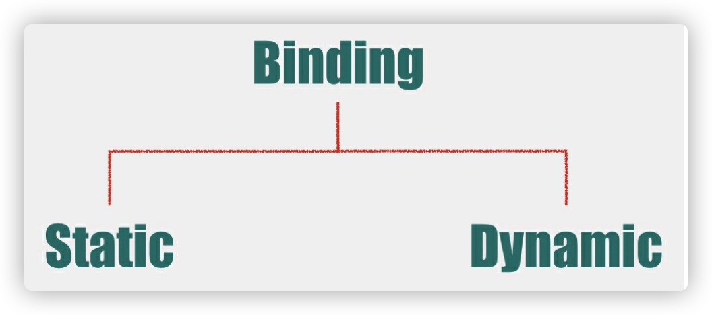

要理解为什么需要上⾯ 5 种⽅法调⽤，需要先弄清楚 Java 的两种⽅法绑定⽅式：静态绑定与动态绑定。 在编译时时能确定⽬标⽅法叫做静态绑定，相反地，需要在运⾏时根据调⽤者的类型动态识别的 叫动态绑定

invokestatic 和 invokespecial 这两个指令对应的⽅法是静态绑定的，invokestatic 调⽤的是类的静态⽅法，在编译期间确定，运⾏期不会修改。剩下的三个都属于动态绑定，下⾯进⾏⼀⼀介绍。

## 0x02 invokestatic

invokestatic ⽤来调⽤静态⽅法，即使⽤ static 关键字修饰的⽅法。 它要调⽤的⽅法在编译期间确定，运⾏期不会修改，属于静态绑定。它也是所有⽅法调⽤指令⾥⾯最快的。⽐如 Integer.valueOf("42")对应字节码

```shell
0: ldc 						#2		// String 42
2: invokestatic 	#3    // Method java/lang/Integer.valueOf:(Ljava/lang/String;)Ljava/lang/Integer;
5: pop
```

## 0x03 invokevirtual vs invokespecial 既⽣瑜何⽣亮

- invokevirtual：⽤来调⽤ public、protected、package 访问级别的⽅法 
- invokespecial：顾名思义，它是「特殊」的⽅法，包括实例构造⽅法、私有⽅法（private 修饰的⽅法）和⽗类⽅法（即 super 关键字调⽤的⽅法）。很明显，这些「特殊」的⽅法可以直接确定实际执⾏的⽅法的实现，与 invokestatic ⼀样，也属于静态绑定 

在 JDK 1.0.2 之前，invokespecial 指令曾被命名为 invokenonvirtual，以区别于 invokevirtual 

看到这⾥，你有没有想过为什么有了 invokevirtual 还需要 invokespecial 的存在呢？ 

其实 java 虚拟机规范⾥⾯有⽐较详细的介绍 

> The difference between the invokespecial and the invokevirtual instructions is that invokevirtual invokes a method based on the class of the object. The invokespecial instruction is used to invoke instance initialization methods as well as private methods and methods of a superclass of the current class.

- invokespecial ⽤在在类加载时就能确定需要调⽤的具体⽅法，⽽不需要等到运⾏时去根据实际的对象值去调⽤该对象的⽅法。private ⽅法不会因为继承被覆写的，所以 private ⽅法归为了 invokespecial 这⼀类。
-  invokevirtual ⽤在⽅法要根据对象类型不同动态选择的情况，在编译期不确定。

举⼀个实际的例⼦

```java
public class Color { 
  public void printColorName() { 
    System.out.println("Color name from parent"); 
  } 
} 
public class Red extends Color { 
  @Override 
  public void printColorName() { 
    System.out.println("Color name is Red"); 
  } 
} 
public class Yellow extends Color { 
  @Override 
  public void printColorName() { 
    System.out.println("Color name is Yellow" ); 
  } 
} 
public class InvokeVirtualTest { 
  private static Color yellowColor = new Yellow(); 
  private static Color redColor = new Red(); 
  public static void main(String[] args) { 
    yellowColor.printColorName(); 
    redColor.printColorName(); 
  } 
}
```

输出 

```shell
Color name is Yellow 
Color name is Red
```

我们来看⼀下 main 函数的字节码

```shell
0: getstatic 				#2 	// Field yellowColor:LColor;
3: invokevirtual 		#3 	// Method Color.printColorName:()V
6: getstatic 				#4 	// Field redColor:LColor;
9: invokevirtual 		#3	// Method Color.printColorName:()V
```

可以看到 3 和 9 ⾏指令完全⼀样，都是Color.printColorName，并没有被编译器改写为Yellow.printColorName和Red.printColorName。

它们最终调⽤的⽬标⽅法却不同，invokevirtual 会根据对象的实际类 型进⾏分派（虚⽅法分派），在编译期间不能确定最终会调⽤⼦类还是⽗类的⽅法。

## 0x04 invokeinterface vs invokevirtual 孪⽣兄弟⼤不同

invokeinterface ⽤于调⽤接口⽅法，在运⾏时再确定⼀个实现此接口的对象。 那它跟 invokevirtual 有什么区别呢？为什么不⽤ invokevirtual 来实现接口⽅法的调⽤？其实也不是不可以，只是为了效率上的 考量。

invokestatic 指令需要调⽤的⽅法只属于某个特定的类，在编译期唯⼀确定，不会运⾏时动态变化，是最快的 invokespecial 指令可能调⽤的⽅法也在编译期确定，且只有少数⼏个需要处理的⽅法，查找也⾮常快 

invokevirtual 和 invokeinterface 的关系就⽐较微妙了，区别没有那么明显，我们⽤⼀个实际的例⼦来说明，可以这么认为，每个类⽂件都关联着⼀个「虚⽅法表」（virtual method table），这个表中包含了⽗类的⽅法和⾃⼰扩展的⽅法。⽐如

```java
class A { 
  public void method1() { } 
  public void method2() { } 
  public void method3() { } 
}

class B extends A { 
  public void method2() { } // overridden from BaseClass 
  public void method4() { } 
}
```

对应的虚⽅法表如下

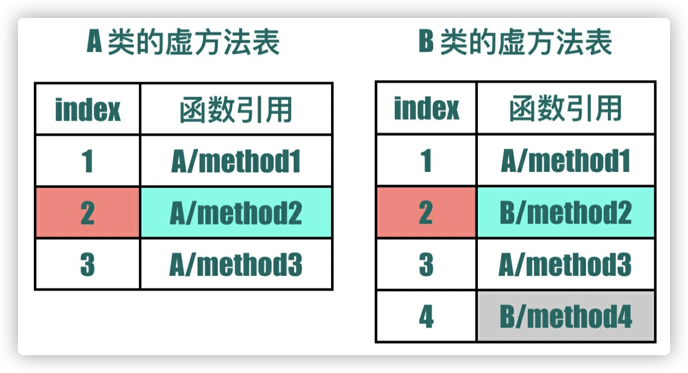

现在 B 类的虚⽅法表保留了⽗类 A 中⽅法的顺序，只是覆盖了 method2() 指向的函数链接和新增了method4()。 假设这时需要调⽤ method2 ⽅法，invokevirtual 只需要直接去找虚⽅法表位置为 2 的地⽅的 函数引⽤就可以了

如果是⽤ invokeinterface，这样的优化是没法起作⽤的，⽐如，我们改⼀下让 B 实现 X 接口

```java
interface X { 
  void methodX() 
} 
class B extends A implements X {
	public void method2() { } // overridden from BaseClass
	public void method4() { }
	public void methodX() { } 
} 
class C implements X {
	public void methodC() { }
	public void methodX() { } 
}
```

这样的情况下虚⽅法表如下

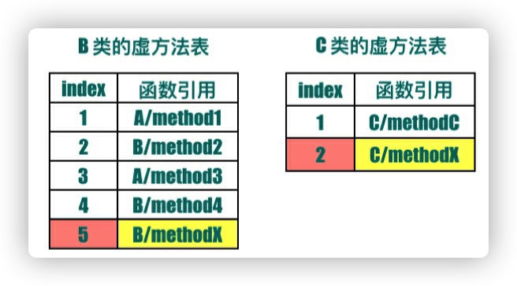

这种情况下，B 类的 methodX 在位置 5 的地⽅，C 类的 methodX 在位置 2 的地⽅，如果要⽤ invokevirtual 调⽤ methodX 就不能直接从固定的虚⽅法表索引位置拿到对应的⽅法链接。invokeinterface 不得 不搜索整个虚⽅法表来找到对应⽅法，效率上远不如 invokevirtual

## 0x05 动态⽅法调⽤秘密武器 invokedynamic

invokedynamic 是五种 invoke ⾥⾯最复杂的，下⼀篇⽂章将专门介绍 invokedynamic 的概念

## 0x06 ⼩结

这篇⽂章讲解了⽅法调⽤的 5 个指令，⼀起来回顾⼀下要点：

- 第⼀，介绍了动态绑定和静态绑定的区别。 
- 第⼆，介绍了 invokestatic、invokevirtual、invokespecial、invokeinterface 四个指令背后深层次效率上的考量。

## 0x07 思考

最后，给你留两道思考题

1. invokestatic、invokevirtual、invokespecial、invokeinterface 这四个指令调⽤效率的排序是怎么样的？
2. JDK8 的 lambda 表达式为什么采⽤ invokedynamic 来实现？跟匿名内部类的⽅式相⽐有哪些优点？


---


# 6. 通过 HSDB ⼯具窥探 JVM 运⾏时数据

## 0x01 HSDB 基础

HSDB 全称是：Hotspot Debugger，是内置的 JVM ⼯具，可以⽤来深⼊分析 JVM 运⾏时的内部状态。HSDB 位于 JDK 安装⽬录下的 lib/sa-jdi.jar 中， 启动 HSDB 

```shell
sudo java -cp sa-jdi.jar sun.jvm.hotspot.HSDB
```

不出意外就会弹出下⾯的界⾯，在 File 菜单中可以选择 attach 到⼀个 Hotspot JVM 进程、或者打开⼀个 core ⽂件、或者连接到⼀个远程的 debug server。

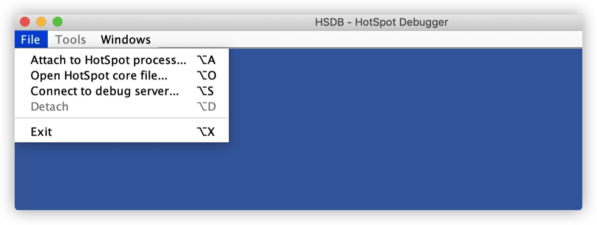

attach 到⼀个 JVM 进程是最常⽤的选项，进程号的获取可以⽤系统⾃带的 ps 命令，也可以⽤ jps 命令。 在弹出的输⼊框中输⼊进程号以后默认展⽰当前线程列表。

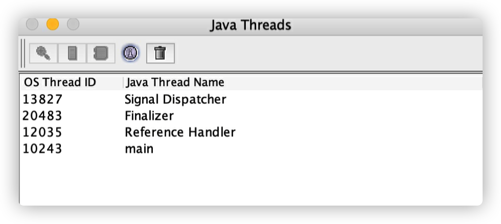

Tools 选项中有很多功能可供我们选择，⽐如查看类列表、查看堆信息、inspect 对象内存、死锁检测等，每个都值得好好玩⼀下。

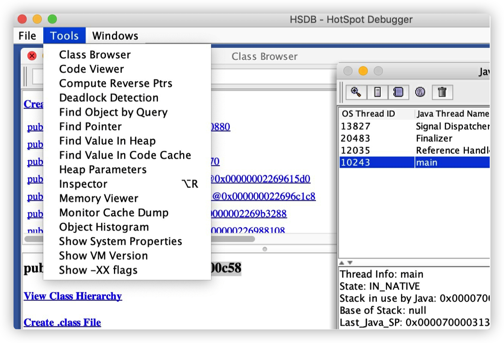

## 0x02 利⽤ HSDB 来看多态的基础 vtable

⽰例代码如下

```java
public abstract class A { 
  public void printMe() { 
    System.out.println("I love vim" ); 
  } 
  public abstract void sayHello(); 
} 

public class B extends A { 
  @Override 
  public void sayHello() { 
    System.out.println("hello, i am child B"); 
  } 
}

public class MyTest { 
  public static void main(String[] args) throws IOException { 
    A obj = new B(); 
    System.in.read(); 
    System.out.println(obj); 
  } 
}
```

运⾏ MyTest，在命令⾏中执⾏ jps，找到 MyTest 的进程 ID 97169

```shell
jps 
97169 MyTest
```

在 HSDB 的界⾯中选择File->Attach to Hotspot process ，输⼊进程号，然后选择Tools->Class Browser 可以找到对象列表，找到 B 对象的内存指针地址。

```shell
B @0x00000007c0060418
```

然后选择Tools->Inspector输⼊ B 的上⾯的内存指针地址：

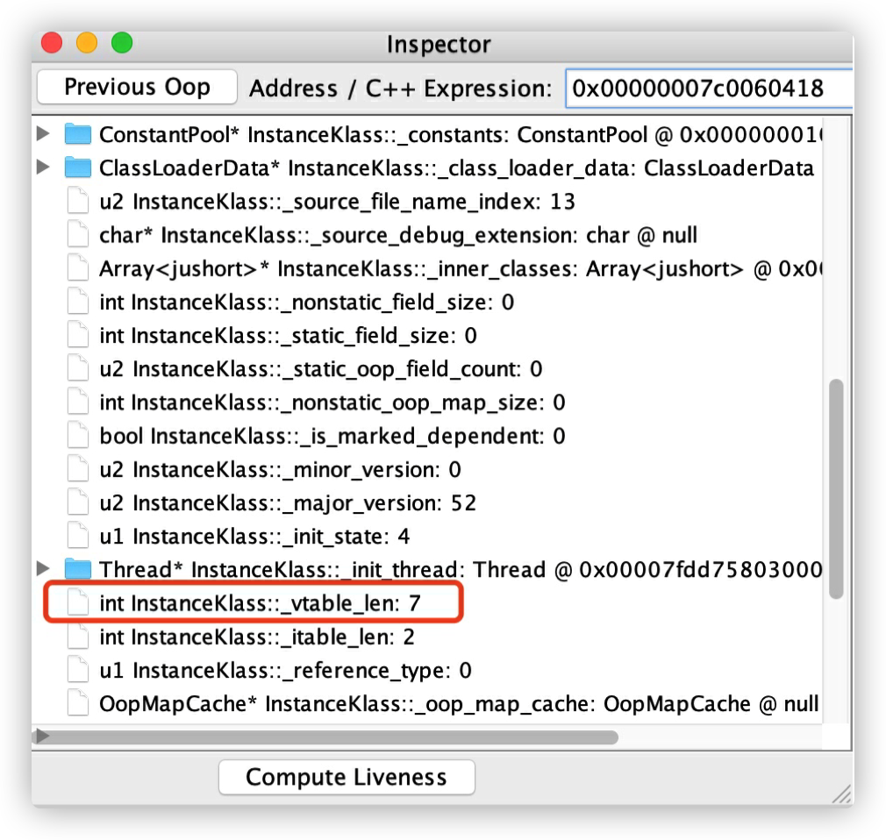

可以看到它的 vtable 的长度为 7。先说结论：有 5 个是 上帝类 Object 的 5 个⽅法，⼀个是 B 覆写的 sayHello ⽅法，⼀个是继承 A 的 printMe ⽅法，接下来我们来验证。 vtable 分配在 instanceKlass 对象实例的内存末尾，instanceKlass⼤⼩在 64 位系统的⼤⼩为 0x1b8，因此 vtable 的起始地址等于 instanceKlass 的内存⾸地址加上 0x1B8 等于 0x00000007C00605D0

```shell
0x00000007c0060418 + 0x1B8 = 0x00000007C00605D0
```

在 HSDB 的 console 输⼊ mem 查看实际的内存分布。mem 命令接受的两个参数都必选，⼀个是起始地址，另⼀个是长度。 输⼊ mem 0x7C00605D0 7 就可以查看 vtable 内存起始地址的 7 个⽅法指针地址 了。

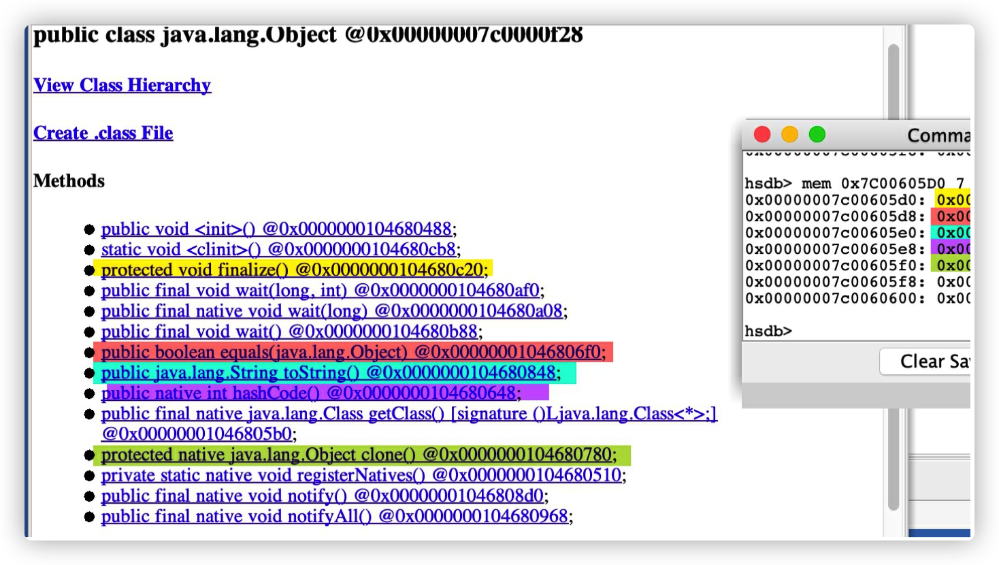

可以看到 vtable 的前 5 条⼀⼀对应 java.lang.Object 的五个⽅法，vtable ⾥存储的是指向⽅法内存的指针

```shell
void finalize() 
boolean equals(java.lang.Object) 
java.lang.String toString() 
int hashCode() 
java.lang.Object clone()
```

我们继续看剩下的两个函数地址

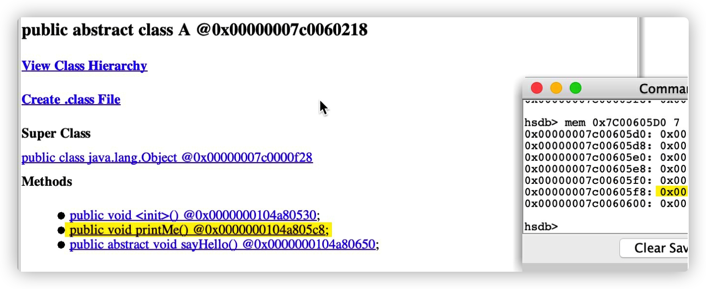

可以看到 B 类的有⼀个函数是指向 A 类的⽅法 printMe。因为 B 继承 A 的 printMe ⽅法

最后⼀个函数 0x0000000104a80900 指向是 B 类的 sayHello,

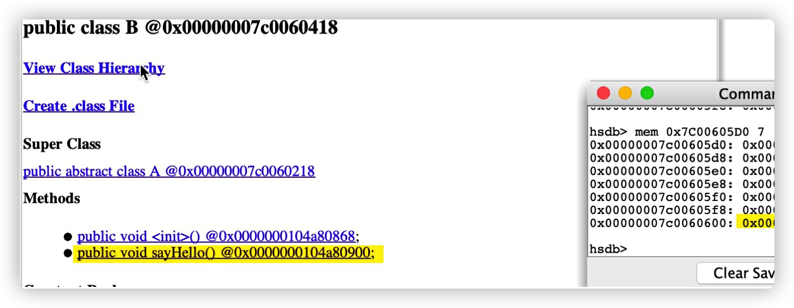

B 类 vtable 如下图所⽰

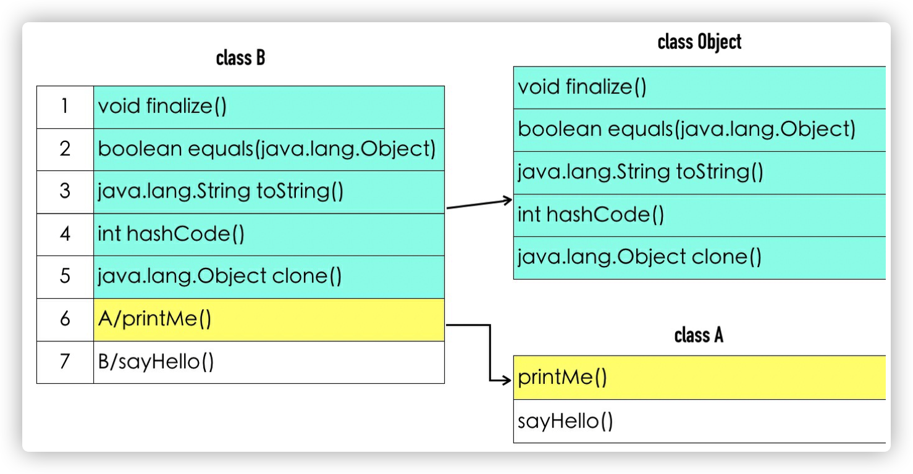

vtable 是 Java 实现多态的基⽯，如果⼀个⽅法被继承和重写，会把 vtable 中指向⽗类的⽅法指针指向⼦类⾃⼰的实现。

- Java ⼦类会继承⽗类的 vtable。Java 所有的类都会继承 java.lang.Object 类，Object 类有 5 个虚⽅法可以被继承和重写。当⼀个类不包含任何⽅法时，vtable 的长度也最⼩为 5，表⽰ Object 类的 5 个 虚⽅法 
- final 和 static 修饰的⽅法不会被放到 vtable ⽅法表⾥ 
- 当⼦类重写了⽗类⽅法，⼦类 vtable 原本指向⽗类的⽅法指针会被替换为⼦类的⽅法指针 
- ⼦类的 vtable 保持了⽗类的 vtable 的顺序 


下⾯我们在做⼀些实验，让 B 实现接口 MyInterface，同时在 B 中新增了⼀个 static ⽅法和⼀个 final ⽅法。

```java
public interface MyInterface { 
  public void testMe(); 
} 
public abstract class A { 
  public void printMe() { 
    System.out.println("I am vim fun"); 
  } 
  public abstract void sayHello(); 
} 

public class B extends A implements MyInterface { 
  @Override 
  public void sayHello() { 
    System.out.println("hello, i am child B"); 
  } 
  @Override 
  public void testMe() { 
    System.out.println("test me"); 
  } 
  public static void foo(){ } 
  public final void testFinal() { }
}
```

采⽤同样的⽅法，这时显⽰ B 类的 vtable ⼤⼩为 8，这 8 个⽅法的指针地址⽤ mem 指令可以进⾏查看

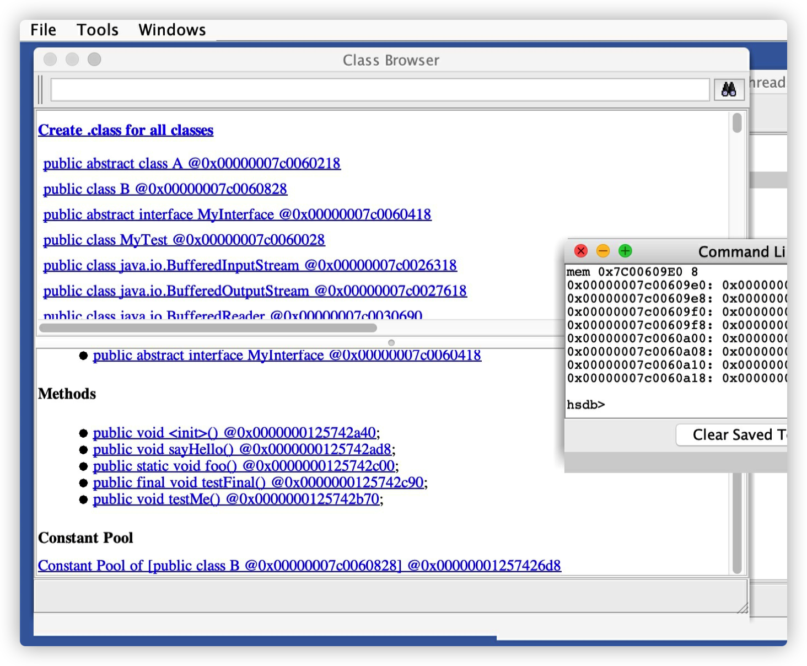

可以看到 vtable 中 B 类的 static 和 final 的⽅法没有出现。

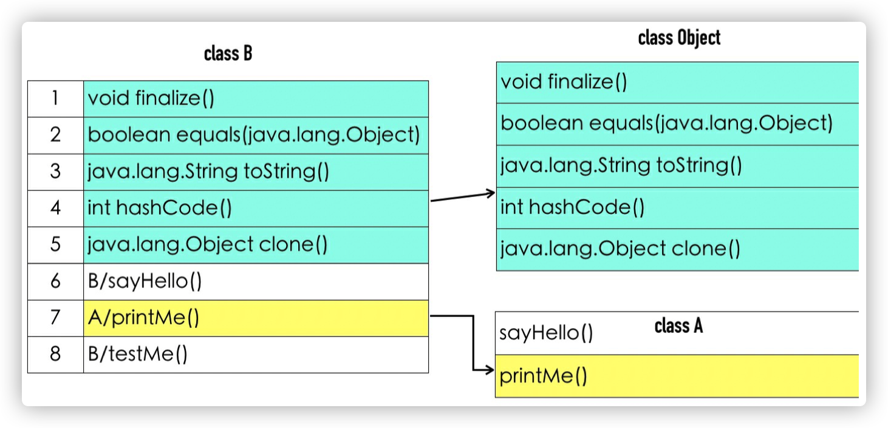

## 0x03 ⼩结

作为上⼀篇⽂章的补充，这篇⽂章通过介绍 HSDB ⼯具来窥探 JVM 内存，通过 vtable 的例⼦深⼊理解了⽅法继承的细节以及多态的原理，当然还有很多有趣的事情可以⽤ HSDB 神器去发现，希望⼤家 都可以熟练掌握这个⼯具。

## 参考⽂章

- 笨神的⽂章：http://lovestblog.cn/blog/2014/06/28/hsdb-string/ 
- R ⼤的⽂章：https://rednaxelafx.iteye.com/blog/1847971


---


# 7. invokedynamic


Java 虚拟机的指令集从 1.0 开始到 JDK7 之间的⼗余年间没有新增任何指令。但基于 JVM 的语⾔倒是百花齐放，但是 JVM 有诸多的限制，⼤部分情况下这些⾮ Java 的语⾔需要许多 trick 才能很好的⼯ 作。随着 JDK7 的发布，字节码指令集新增了⼀个重量级指令 invokedynamic。这个指令为为多语⾔在 JVM 上百花齐放提供了坚实的技术⽀撑。因为 invokedynamic 概念不是那么好理解，这篇⽂章专门讲 这个指令，希望能帮助你掌握。

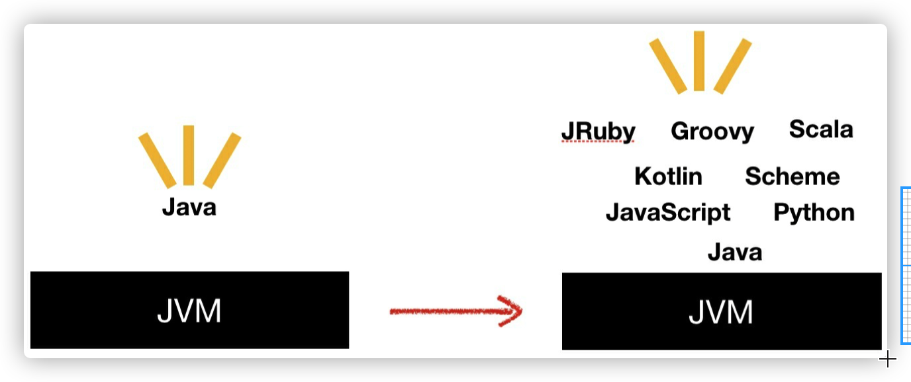

JDK7 中虽然在指令集中新增了这个指令，但是 javac 并不会⽣成 invokedynamic，直到 JDK8 lambda 表达式的出现，在 Java 中才第⼀次⽤上了这个指令。

## 0x01 动态语⾔：变量⽆类型，变量值才有类型

对于 JVM ⽽⾔都是强类型语⾔，它会在编译时检查传⼊参数的类型和返回值的类型，⽐如下⾯这段代码

```java
obj.println("hello world");
```

Java 语⾔中情况下，对应字节码如下

```shell
Constant pool: 
#1 = Methodref 			#6.#15		// java/lang/Object."<init>":()V
#4 = Methodref			#19.#20		// java/io/PrintStream.println:(Ljava/lang/String;)V

0: getstatic #2 						// Field java/lang/System.out:Ljava/io/PrintStream;
3: ldc #3 									// String Hello World
5: invokevirtual #4					// Method java/io/PrintStream.println:(Ljava/lang/String;)V
```

可以看到 println 要求如下

- 要调⽤的对象类：java.io.PrintStream 
- ⽅法名必须是 println 
- ⽅法参数必须是 (String) 
- 函数返回值必须是 void

如果当前类找不到符合条件的函数，会在其⽗类中继续查找，如果 obj 所属的类与 PrintStream 没有继承关系，就算 obj 所属的类有符合条件的函数，上述调⽤也不会成功（类型检查不会通过） 但是相同 的代码在 Groovy 或者 JavaScript 等语⾔中就不⼀样了，⽆论 obj 是何种类型，只有所属类包含函数名为 println，函数参数为(String)的函数，那么上述调⽤就会成功。这也是我们下⾯要讲到的「鸭⼦类 型」

## 0x02 鸭⼦类型（Duck Typing）

鸭⼦类型概念的名字来源于由 James Whitcomb Riley 提出的鸭⼦测试，可以这样表述： 当看到⼀只鸟⾛起来像鸭⼦、游泳起来像鸭⼦、叫起来也像鸭⼦，那么这只鸟就可以被称为鸭⼦

在鸭⼦类型中，关注点在于对象的⾏为，能做什么；⽽不是关注对象所属的类型，不关注对象的继承关系

以下⾯这段 Groovy 脚本为例

```groovy
class Duck { 
  void fly() { println "duck flying" } 
}

class Airplane { 
  void fly() { println "airplane flying" } 
}

class Whale { 
  void swim() { println "Whale swim" } 
}

def liftOff(entity) { entity.fly() }

liftOff(new Duck()) 
liftOff(new Airplane()) 
liftOff(new Whale())
```

输出： 

```shell
duck flying 
airplane flying 
groovy.lang.MissingMethodException: No signature of method: Whale.fly() is applicable for argument types: () values: []
```

我们可以看到 liftOff 函数，调⽤了⼀个传⼊对象的 fly ⽅法，但是它并不知道这个对象的类型，也不知道这个对象是否包含了 fly ⽅法。

开始讲解 invokedynamic 之前需要先介绍⼀个核⼼的概念⽅法句柄（MethodHandle）。

## 0x03 MethodHandle 是什么

MethodHandle 又被称为⽅法句柄或⽅法指针， 是java.lang.invoke 包中的 ⼀个类，它的出现使得 Java 可以像其它语⾔⼀样把函数当做参数进⾏传递。MethodHandle 类似于反射中的 Method 类，但它⽐ Method 类要更加灵活和轻量级。 下⾯以⼀个实际的例⼦来看 MethodHandle 的⽤法

```java
public class Foo {
	public void print(String s) { 
    System.out.println("hello, " + s); 
  } 
  public static void main(String[] args) throws Throwable {
		Foo foo = new Foo();
		MethodType methodType = MethodType.methodType(void.class, String.class); 			
    MethodHandle methodHandle = MethodHandles.lookup().findVirtual(Foo.class, "print" , methodType); 
    methodHandle.invokeExact(foo, "world" );
	}
}
```

运⾏输出 

```shell
hello, world
```

使⽤ MethodHandle 的⽅法的步骤是:

- 创建 MethodType 对象。MethodType ⽤来表⽰⽅法签名，每个 MethodHandle 都有⼀个 MethodType 实例，⽤来指定⽅法的返回值类型和各个参数类型 
- 调⽤ MethodHandles.lookup 静态⽅法返回 MethodHandles.Lookup对象，这个对象是查找的上下⽂，根据⽅法的不同类型通过 findStatic、findSpecial、findVirtual 等⽅法查找⽅法签名为 MethodType 的 ⽅法句柄 
- 拿到⽅法句柄以后就可以执⾏了。通过传⼊⽬标⽅法的参数，使⽤invoke或者invokeExact就可以进⾏⽅法的调⽤

## 0x04 什么是 invokedynamic

援引 JRuby 作者给 invokedynamic 下⼀个定义：

> invokedynamic is a user-definable bytecode，You decide how the JVM implements it。 

回顾上⼀节的内容

```shell
invokestatic: 
System.currentTimeMillis() 
Math.abs(-100)
---
invokevirtual:
"hello, world".toUpperCase()
---
invokespecial: 
new ArrayList()
---
invokeinterface: 
myRunnable.run()
```

这 4 条 invoke* 指令分配规则固化在了虚拟机中，invokedynamic 则把如何查找⽬标⽅法的决定权从虚拟机下放到了具体的⽤户代码中。

invokedynamic 的调⽤流程如下

- JVM ⾸次执⾏ invokedynamic 调⽤时会调⽤引导⽅法（Bootstrap Method） 
- 引导⽅法返回 CallSite 对象，CallSite 内部根据⽅法签名进⾏⽬标⽅法查找。它的 getTarget ⽅法返回⽅法句柄（MethodHandle）对象。 
- 在 CallSite 没有变化的情况下，MethodHandle 可以⼀直被调⽤，如果 CallSite 有变化的话重新查找即可。以 def add(a, b) { a + b } 为例，如果在代码中⼀开始使⽤两个 int 参数进⾏调⽤，那么极 有可能后⾯很多次调⽤还会继续使⽤两个 int，这样就不⽤每次都重新选择⽬标⽅法。

它们之间的关系如下图所⽰：

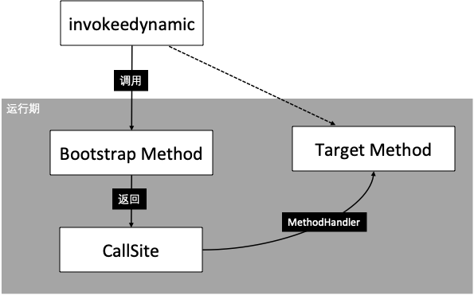

## 0x05 Groovy 与 invokedynamic

以下⾯的 groovy 代码为例来讲解 invokedynamic 在 Groovy 语⾔上的应⽤。

```groovy
Test.groovy 
def add(a, b) {
	new Exception().printStackTrace()
	return a + b 
}

add("hello" , "world" )
```

默认情况下 invokedynamic 在 Groovy 上并未启⽤。如果需要使⽤需要加上 --indy选项，使⽤groovy --indy Test.groovy 进⾏编译。⽣成的 Test.class 对应的字节码如下：

```shell
public java.lang.Object run(); 
descriptor: ()Ljava/lang/Object; 
flags: ACC_PUBLIC 
Code:
	stack=3, locals=1, args_size=1 
	0: aload_0 
	1: ldc 						#44 		// String hello
	3: ldc 						#46 		// String world
	5: invokedynamic  #52, 0 	// InvokeDynamic #1:invoke:(LTest;Ljava/lang/String;Ljava/lang/String;)Ljava/lang/Object;
 10: areturn
-----------------Constant pool:
#1 = Utf8 Test
...省略掉部分字节码...
#52 = InvokeDynamic 	#1:#51	// #1:invoke:(LTest;Ljava/lang/String;Ljava/lang/String;)Ljava/lang/Object;
-----------------
BootstrapMethods:
...省略掉部分字节码...
1: #34 invokestatic org/codehaus/groovy/vmplugin/v7/IndyInterface.bootstrap:(Ljava/lang/invoke/MethodHandles$Lookup;Ljava/lang/String;Ljava/lang/invoke/MethodType;Ljava/lang/String;I)Ljava/lang Method arguments:

#48 add 
#49 2
```

可以看到 add("hello", "world") 调⽤被翻译为了 invokedynamic 指令，第⼀次参数是常量池中的 #52，这个条⽬又指向了 BootstrapMethods 中的 #1，调⽤了静态⽅法IndyInterface.bootstrap，返回值是 ⼀个 CallSite 对象，这个函数签名如下：

```shell
public static CallSite bootstrap( 
	Lookup caller, // the caller 
	String callType, // the type of the call 
	MethodType type, // the MethodType 
	String name, // the real method name 
	int flags // call flags ) { 
	}
```

其中 callType 为调⽤类型，是枚举类 CALL_TYPES 的⼀种，这⾥为CALL_TYPES.METHOD("invoke") ，name 为实际调⽤的函数名，这⾥为"add"。

这个函数内部调⽤了 realBootstrap 函数，这个函数返回了 CallSite 对象，这个 CallSite 的⽬标⽅法句柄（MethodHandle）真正调⽤了 selectMethod ⽅法，这个⽅法在运⾏期选择合适的⽅式进⾏调⽤。

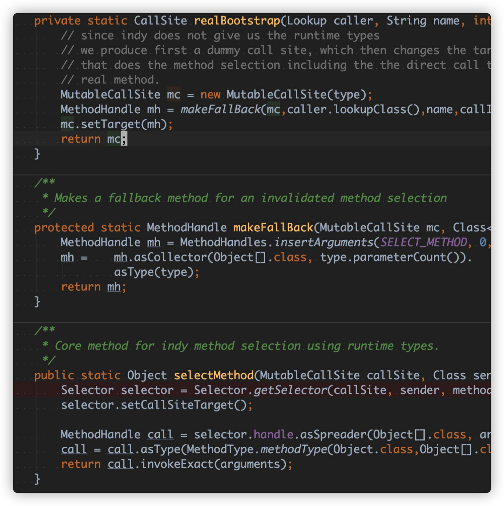

selectMethod ⽅法内部则是通过 MethodHandle 的 invokeExact ⽅法执⾏了最终的⽅法调⽤。

 简化上述过程为伪代码就是

```groovy
public static void main(String[] args) throws Throwable { 
  MethodHandles.Lookup lookup = MethodHandles.lookup(); 
  MethodType mt = MethodType.methodType(Object.class, Object.class, Object.class); 	
  CallSite callSite = IndyInterface.bootstrap(lookup, "invoke", mt, "add", 0); 
  MethodHandle mh = callSite.getTarget(); 
  mh.invoke(obj, "hello" , "world" ); 
}
```

Groovy 采⽤ invokedynamic 指令有哪些好处?

- 标准化。使⽤ Bootstrap Method、CallSite、MethodHandle 机制使得动态调⽤的⽅式得到统⼀ 
- 保持了字节码层的统⼀和向后兼容。把动态⽅法的分派逻辑下放到语⾔实现层，未来版本可以很⽅便的进⾏优化、修改
- ⾼性能。接近原⽣ Java 调⽤的性能，也可以享受到 JIT 优化等 

有⼈会有疑问，invokedynamic 只能在动态语⾔上吗？其实不是的，invokedynamic 是⼀种⽅法动态分派的⽅式，除了⽤于动态语⾔还有其他很多的⽤途，⽐如下⼀篇⽂章我们要讲的 Java 的 lambda 表达 式。

## 0x06 ⼩结

这篇⽂章主要介绍了 invokedynamic 指令的原理。invokedynamic 其实是⼀种调⽤⽅法的新⽅式，它⽤来告诉 JVM 可以延迟确认最终要调⽤的哪个⽅法。⼀开始 invokedynamic 并不知道要调⽤什么⽬标⽅ 法。第⼀次调⽤时引导⽅法（Bootstrap Method）会被调⽤，由这个引导⽅法决定哪个⽬标⽅法进⾏调⽤。


---


# 8. Lambda 表达式与字节码的关系

## 0x01 测试匿名内部类的实现

```java
public static void main(String[] args) { 
  Runnable r1 = new Runnable() { 
    @Override 
    public void run() { 
      System.out.println("hello, inner class"); 
    } 
  }; 
  r1.run(); 
}
```

使⽤ javac 进⾏编译会⽣成两个 class ⽂件Test.class和Test$1.class 

main 函数简化过的字节码如下： 

```shell
public static void main(java.lang.String[]); 
Code:
	stack=2, locals=2, args_size=1 
		0: new 							#2 		// class Test$1 
		3: dup 
		4: invokespecial 		#3 		// Method Test$1."<init>":()V 
		7: astore_1 
		8: aload_1 
		9: invokeinterface 	#4, 1 // InterfaceMethod java/lang/Runnable.run:()V 
	 14: return
```

- 第 0 ~ 7 ⾏：新建Test$1实例对象 
- 第 8 ~ 9 ⾏：执⾏ Test$1 对象的 run ⽅法

整个过程的伪代码就是

```java
class Test$1 implements Runnable { 
  public Test$1(Test test) { }

	@Override 
  public void run() { 
    System.out.println("hello, inner class"); 
  }

} 
public class Test { 
  public static void main(String[] args) { 
    Runnable r1 = new Test$1(this); r1.run(); 
  } 
}
```

因此可以得出结论：匿名内部类是在编译期间⽣成新的 class ⽂件来实现的。

## 0x02 测试 lambda 表达式

还是上⾯的代码，修改为 lambda 的⽅式

```java
public static void main(String[] args) { 
  Runnable r = ()->{System.out.println("hello, lambda");}; 
  r.run(); 
}
```

继续使⽤ javac 编译，发现这次只⽣成了 Test.class ⼀个类⽂件，并没有⽣成匿名内部类，

使⽤ javap -p -s -c -v -l Test 查看对应字节码如下

```shell
public static void main(java.lang.String[]); 
descriptor: ([Ljava/lang/String;)V 
flags: ACC_PUBLIC, ACC_STATIC 
Code:
	stack=1, locals=2, args_size=1 
	0: invokedynamic 		#2, 0 	// InvokeDynamic #0:run:()Ljava/lang/Runnable; 
	5: astore_1 
	6: aload_1 
	7: invokeinterface 	#3, 1 	// InterfaceMethod java/lang/Runnable.run:()V 
 12: return

private static void lambda$main$0(); 
Code:
	0: getstatic 				#4 			// Field java/lang/System.out:Ljava/io/PrintStream;
	3: ldc 							#5 			// String hello, lambda
	5: invokevirtual 		#6 			// Method java/io/PrintStream.println:(Ljava/lang/String;)V
	8: return
```

出乎意料的出现了⼀个名为 lambda$main$0 的静态⽅法，这段字节码⽐较简单，⼈⾁翻译⼀下就是

```java
private static void lambda$main$0() { 
  System.out.println("hello, lambda"); 
}
```

这⾥ main 函数中出现了上⼀节最后介绍的神奇指令 invokedynamic。第 0 ⾏中 #2 表⽰常量池中#2，它又指向了#0:#23

```shell
Constant pool:
	#1 = Methodref 			#8.#18		// java/lang/Object."<init>":()V 
	#2 = InvokeDynamic  #0:#23		// #0:run:()Ljava/lang/Runnable;
	...
	#23 = NameAndType		#35:#36		// run:()Ljava/lang/Runnable;

BootstrapMethods:
	0: #20 invokestatic java/lang/invoke/LambdaMetafactory.metafactory:(Ljava/lang/invoke/MethodHandles$Lookup;Ljava/lang/String;Ljava/lang/invoke/MethodType;Ljava/lang/invoke/MethodType;Ljava/la 
	Method arguments:
		#21 ()V 
		#22 invokestatic Test.lambda$main$0:()V 
		#21 ()V
```

其中#0是⼀个特殊的查找，对应 BootstrapMethods 中的 0 ⾏，可以看到这是⼀个对静态⽅法 LambdaMetafactory.metafactory() 的调⽤，它的返回值是 java.lang.invoke.CallSite 对象，这个对象代表了真正执 ⾏的⽬标⽅法调⽤。


核⼼的 metafactory 函数定义如下

```shell
public static CallSite metafactory( 
	MethodHandles.Lookup caller, 
	String invokedName, 
	MethodType invokedType, 
	MethodType samMethodType, 
	MethodHandle implMethod, 
	MethodType instantiatedMethodType 
)
```

各个参数的含义如下

- caller：JVM 提供的查找上下⽂
-  invokedName：表⽰调⽤函数名，在本例中 invokedName 为 "run" 
- samMethodType：函数式接口定义的⽅法签名（参数类型和返回值类型），本例中为 run ⽅法的签名 "()void" 
- implMethod：编译时⽣成的 lambda 表达式对应的静态⽅法invokestatic Test.lambda$main$0 
- instantiatedMethodType：⼀般和 samMethodType 是⼀样或是它的⼀个特例，在本例中是 "()void"

metafactory ⽅法的内部细节是整个 lambda 表达式最复杂的地⽅。它的源码如下

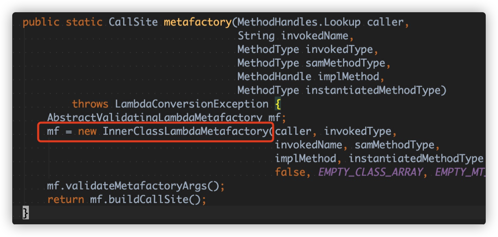

跟进 InnerClassLambdaMetafactory 类，看到它在默默⽣成新的内部类，类名的规则是ClassName$$Lambda$1，其中 ClassName 是 lambda 所在的类名，后⾯的数字按⽣成的顺序依次递增。

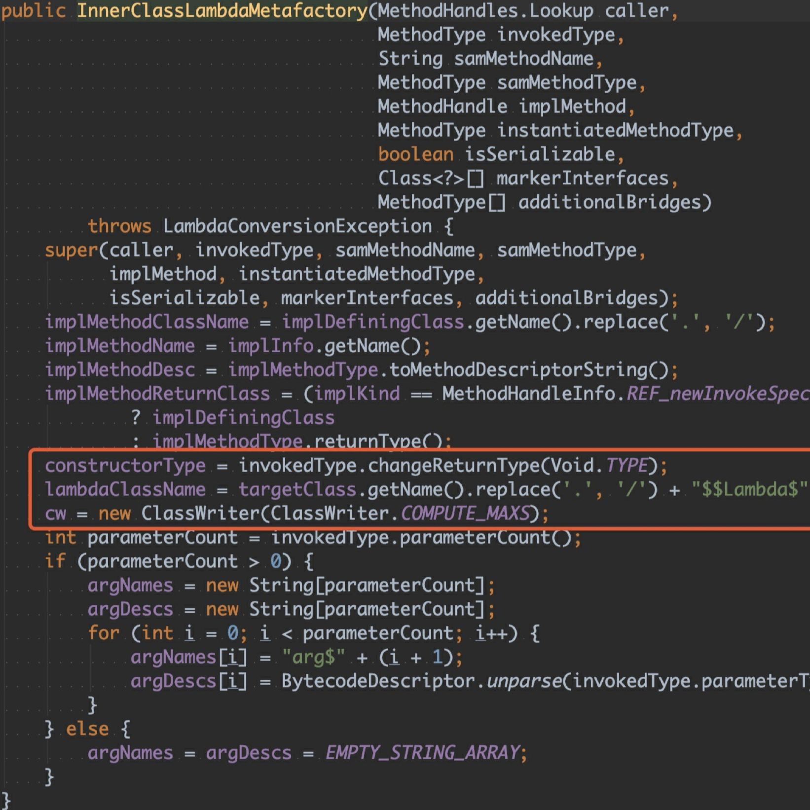

同样可以使⽤打印的⽅式看⼀下具体⽣成的类名

```java
Runnable r = ()->{ 
  System.out.println("hello, lambda"); 
};

System.out.println(r.getClass().getName());
```

输出： 

```shell
Test$$Lambda$1/1108411398
```

其中斜杠/后⾯的数字 1108411398 是类对象的 hashcode 值。

InnerClassLambdaMetafactory 这个类的静态初始化⽅法块⾥有⼀个开关可以选择是否把⽣成的类 dump 到磁盘中。

```java
// For dumping generated classes to disk, for debugging purposes private static final ProxyClassesDumper dumper; 
static {
	final String key = "jdk.internal.lambda.dumpProxyClasses"; 
	String path = AccessController.doPrivileged( 
    new GetPropertyAction(key), null, new PropertyPermission(key , "read"));
	dumper = (null == path) ? null : ProxyClassesDumper.getInstance(path); 
}
```

使⽤java -Djdk.internal.lambda.dumpProxyClasses=. Test运⾏ Test 类会发现在运⾏期间⽣成了⼀个新的内部类： Test$$Lambda$1.class。这个类正是由InnerClassLambdaMetafactory 使⽤ ASM 字节码 技术动态⽣成的，只是默认情况看不到⽽已。

这个类实现了 Runnable 接口，并在 run ⽅法⾥调⽤了 Test 类的静态⽅法lambda$main$0()。

把这个类的字节码⼈⾁翻译过来是下⾯这样

```java
final class Test$$Lambda$1 implements Runnable { 
  @Override 
  public void run() { 
    Test.lambda$main$0(); 
  } 
}
```

整个过程就⽐较明朗了:

- lambda 表达式声明的地⽅会⽣成⼀个 invokedynamic 指令，同时编译器⽣成⼀个对应的引导⽅法（Bootstrap Method） 
- 第⼀次执⾏ invokedynamic 指令时，会调⽤对应的引导⽅法（Bootstrap Method），该引导⽅法会调⽤ LambdaMetafactory.metafactory ⽅法动态⽣成内部类 
- 引导⽅法会返回⼀个动态调⽤ CallSite 对象，这个 CallSite 会链接最终调⽤的实现了 Runnable 接口的内部类 lambda 表达式中的内容会被编译成静态⽅法，前⾯动态⽣成的内部类会直接调⽤该静态⽅法 
- 真正执⾏ lambda 调⽤的还是⽤ invokeinterface 指令

## 0x03 为什么 Java 8 的 Lambda 表达式要基于 invokedynamic

关于为什么⽤ invokedynamic 来实现 Lambda，Oracle 的开发者专门写了⼀篇⽂章 Translation of Lambda Expressions，介绍了 Java 8 Lambda 设计时的考虑以及实现⽅法。 ⽂中提到 Lambda 表达式可以通过 内部类、method handle、dynamic proxies 等⽅式实现，但是这些⽅法各有优劣。实现 Lambda 表达式需要达成两个⽬标：

- 为未来的优化提供最⼤的灵活性 
- 保持类⽂件字节码格式的稳定

使⽤ invokedynamic 可以很好的兼顾这两个⽬标。

原⽂如下

> here are a number of ways we might represent a lambda expression in bytecode, such as inner classes, method handles, dynamic proxies, and others. Each of these approaches has pros and cons. In selecting a strategy, there are two competing goals: maximizing flexibility for future optimization by not committing to a specific strategy, vs providing stability in the classfile representation.

invokedynamic 与之前四个 invoke 指令最⼤的不同就在于它把⽅法分派的逻辑从虚拟机层⾯下放到程序语⾔。 lambda 表达式采⽤的⽅式是不在编译期间就⽣成匿名内部类，⽽是提供了⼀个稳定的字节码 ⼆进制表⽰规范，对⽤户⽽⾔看到的只有 invokedynamic 这样⼀个⾮常简单的指令。⽤ invokedynamic 来实现就是把翻译的逻辑隐藏在 JDK 的实现中，后续想替换实现⽅式⾮常简单，只⽤修改 LambdaMetafactory.metafactory ⾥⾯的逻辑就可以了，这种⽅法把 lambda 翻译的策略由编译期间推迟到运⾏时。

## 0x04 ⼩结

lambda 表达式与普通的匿名内部类的实现⽅式不⼀样，在编译阶段只是新增了⼀个 invokedynamic 指令，并没有在编译期间⽣成匿名内部类，lambda 表达式的内容会被编译成⼀个静态⽅法。在运⾏时 LambdaMetafactory.metafactory 这个⼯⼚⽅法来动态⽣成⼀个内部类 class，该内部类会调⽤前⾯⽣成的静态⽅法。 lambda 表达式最终还是会⽣成⼀个内部类，只不过是不是在编译期间⽽是在运⾏时，未 来的 JDK 会怎么实现 Lambda 表达式可能还会有变化。

## 0x05 思考题

下⾯的两段代码分别会⽣成多少个内部类？为什么?

代码⽚段 1

```java
for (int i = 0; i < 10; i++) { 
  Runnable r = () -> { 
    System.out.println("hello, lambda"); 
  }; 
  r.run(); 
}
```

代码⽚段 2

```java
Runnable r1 = () -> { 
  System.out.println("hello, lambda"); 
}; 
r1.run();

Runnable r2 = () -> { 
  System.out.println("hello, lambda"); 
}; 
r2.run();
```


---


# 9. i++ vs ++i


## 0x01 看⼀道笔试题

```java
public static void foo() { 
  int i = 0; 
  for (int j = 0; j < 50; j++) 
    i = i++; 
  System.out.println(i); 
}
```

输出结果是 0，⽽不是 50

关于 i++ 和 ++i 的区别，稍微有经验的程序员都或多或少都是了解的。听过了很多道理，依旧过不好这⼀⽣，我们从字节码的⾓度来彻底分析⼀下

```shell
public static void foo(); 
	0: iconst_0 
	1: istore_0 
	2: iconst_0 
	3: istore_1 
	4: iload_1 
	5: bipush 				50
	7: if_icmpge			21

 10: iload_0 
 11: iinc 					0, 1
 14: istore_0

 15: iinc 					1, 1
 18: goto						4

 21: getstatic 			#3 				// Field java/lang/System.out:Ljava/io/PrintStream;
 24: iload_0 
 25: invokevirtual 	#4 				// Method java/io/PrintStream.println:(I)V
 28: return
```

对应i = i++; 的字节码是 10 ~ 14 ⾏：

- 10：iload_0 把局部变量表 slot = 0 的变量(i)加载到操作数栈上 
- 11：iinc 0, 1 对局部变量表slot = 0 的变量(i)直接加 1，但是这时候栈顶的元素没有变化，还是 0 
- 14：istore_0 将栈顶元素出栈赋值给局部变量表 slot = 0 的变量，也就是 i。在这时，局部变量 i 又被赋值为 0 了，前⾯的 iinc 指令对 i 的加⼀操作前功尽弃。

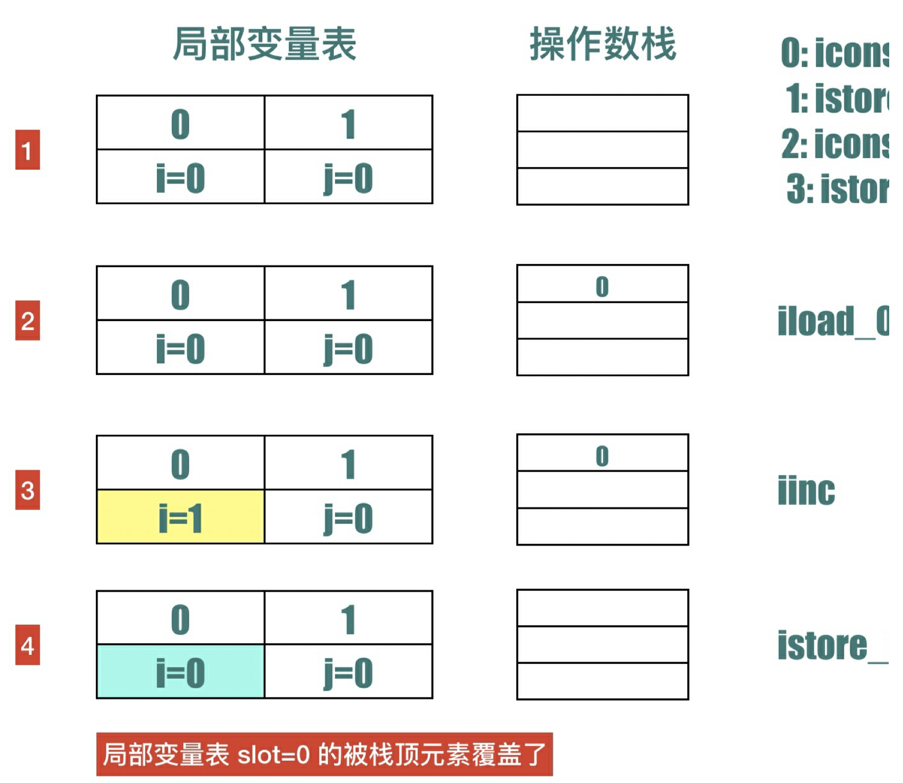

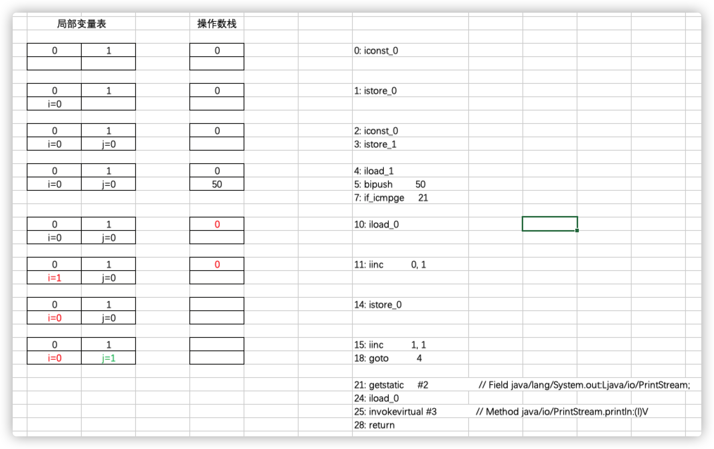

如果要⽤伪代码来理解i = i++ ，应该是下⾯这样的

```shell
tmp = i; 
i = i + 1; 
i = tmp;
```

## 0x02 ++i 又会是怎么样

把代码稍作修改，如下

```java
public static void foo() { 
  int i = 0; 
  for (int j = 0; j < 50; j++) 
    i = ++i; 
  System.out.println(i); 
}
```

来看对应的字节码

```shell
public static void foo(); 
	0: iconst_0 
	1: istore_0 
	2: iconst_0 
	3: istore_1 
	4: iload_1 
	5: bipush 				50 
	7: if_icmpge 			21

 10: iinc 					0, 1
 13: iload_0 
 14: istore_0

 15: iinc 					1, 1
 18: goto						4

 21: getstatic 			#3 			// Field java/lang/System.out:Ljava/io/PrintStream;
 24: iload_0 
 25: invokevirtual 	#4 			// Method java/io/PrintStream.println:(I)V
 28: return
```

可以看到i = ++i; 对应的字节码还是 10 ~ 14 ⾏，与 i++ 的字节码对⽐如下图：

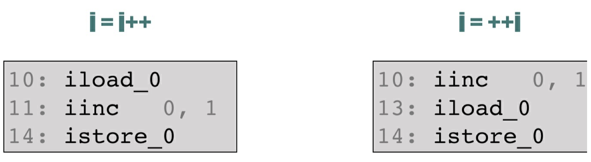

可以看出i = ++i; 先对局部变量表 slot = 0 的变量加 1，然后才把它加载到操作数栈上，随后又从操作数栈上出栈赋值给了局部变量表，最后写回去的值也是最新的值。 画出整个过程的局部变量表和操作数栈的变化如下：

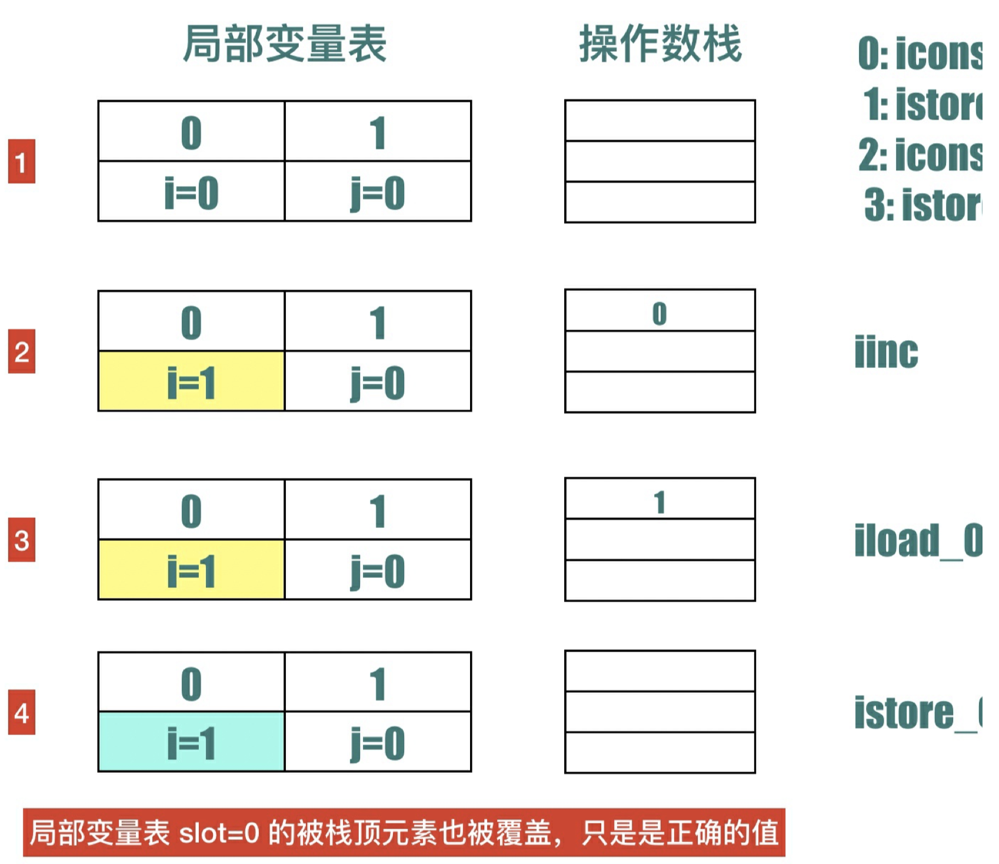

如果要⽤伪代码来理解i = ++i ，应该是下⾯这样的

```shell
i = i + 1; 
tmp = i; 
i = tmp;
```

## 0x03 看⼀道难⼀点的题⽬

```java
public static void bar() { 
  int i = 0; 
  i = i++ + ++i; 
  System.out.println("i=" + i);
}
```

输出是什么？ 

同样我们以字节码的⾓度来分析，add 指令的第⼀个参数值为 0，第⼆个参数值为 2，最终输出的结果为 2，详细的分析过程我画了⼀个简单的过程图，如下：

```shell
public static void bar(); 
	0: iconst_0 
	1: istore_0

	2: iload_0 
	3: iinc 				0, 1
	6: iinc 				0, 1
	9: iload_0 
	10: iadd 
	11: istore_0
```

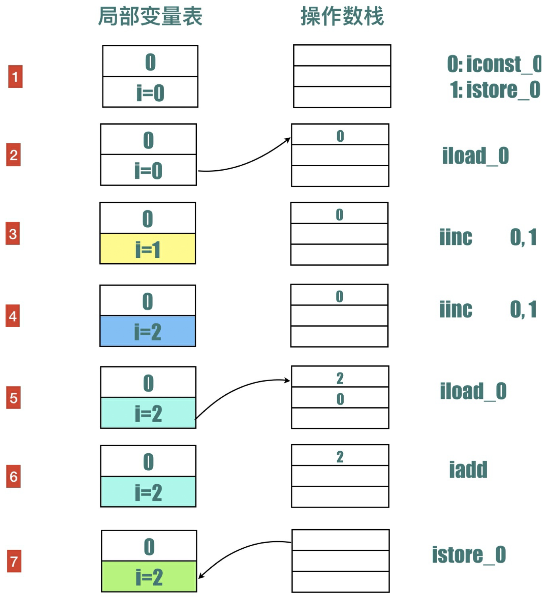

⽤伪代码的⽅式就是，会不会更好理解⼀些?

```shell
i = 0;
tmp1 = i; 
i = i + 1;

i = i + 1 
tmp2 = i;

tmpSum = tmp1 + tmp2;

i = tmpSum;
```

## 0x03 ⼩结

这篇⽂章，我们通过 i++ 与 ++i 字节码的不同讲述了两者的区别，希望能对你后续笔试遇到类似的题⽬有所帮助。 

## 0x04 思考

留⼀道作业题给你，下⾯的代码输出是什么？你可以画出各阶段的过程图吗？

```java
public static void foo() { 
  int i = 0; 
  i = ++i + i++ + i++ + i++; 
  System.out.println("i=" + i); 
}
```


---


# 10. switch-case

## 0x01 ⼀个⼩ demo

前⾯我们已经知道了，switch-case 依据 case 值的稀疏程度，分别由两个指令 tableswitch 和 lookupswitch 实现，但这两个指令都只⽀持整型值。那怎么样让 String 类型的值也⽀持 switch-case 呢？

```java
public int test(String name) { 
  switch (name) { 
    case "Java":
			return 100;
		case "Kotlin":
			return 200;
		default:
			return -1;
	} 
}
```

我们直接来看字节码

```shell
0: aload_1 
1: astore_2 
2: iconst_m1 
3: istore_3

4: aload_2 
5: invokevirtual #2 // Method java/lang/String.hashCode:()I 
8: lookupswitch { // 2
			-2041707231: 	50 // 对应 "Kotlin".hashCode() 
					2301506:  36 // 对应 "Java".hashCode() 
					default: 	61 
			}
36: aload_2 
37: ldc 						#3 			// String Java
39: invokevirtual 	#4 			// Method java/lang/String.equals:(Ljava/lang/Object;)Z
42: ifeq 61 
45: iconst_0 
46: istore_3 
47: goto 61

50: aload_2 
51: ldc 						#5 			// String Kotlin
53: invokevirtual 	#4 			// Method java/lang/String.equals:(Ljava/lang/Object;)Z
56: ifeq 61 
59: iconst_1 
60: istore_3

61: iload_3 
62: lookupswitch { // 2 
				0: 88 
				1: 91 
	default: 95 
	}

// 88 ~ 90 
88: bipush 						100
90: ireturn

91: sipush 						200
94: ireturn

95: iconst_m1 
96: ireturn
```

- 0 ~ 3：做⼀些初始化操作，把⼊参 name 赋值给局部变量表下标为 2 的变量，记为 tmpName ，初始化局部变量表 3 位置的变量为 -1，记为 matchIndex 
- 4 ~ 8：对 tmpName 调⽤了 hashCode 函数，得到⼀个整型值。因为⼀般⽽⾔ hash 都⽐较离散，所以没有选⽤ tableswitch ⽽是⽤ lookupswitch 来作为 switch case 的实现。 
- 36 47：如果 hashCode 等于 "Java".hashCode() 会跳转到这部分字节码。⾸先把字符串进⾏真正意义上的 equals ⽐较，看是否相等，是否相等使⽤的是 ifeq 指令， ifeq 这个指令语义上有点绕，ifeq 的含义是ifeq 0则跳转到对应字节码⾏处，实际上是等于 false 跳转。这⾥如果相等则把 matchIndex 赋值为 0 
- 61 ~ 96：进⾏最后的 case 分⽀执⾏。这⼀段⽐较好理解，不再继续做分析。 

结合上⾯的字节码解读，我们可以推演出对应的 Java 代码实现

```java
public int test_translate(String name) {
	String tmpName = name; 
  int matchIndex = -1; 
  switch (tmpName.hashCode()) { 
    case -2041707231:
			if (tmpName.equals("Kotlin")) { 
        matchIndex = 1; 
      } 
      break; 
    case 2301506:
			if (tmpName.equals("Java")) { 
        matchIndex = 0; 
      } 
      break; 
    default:
			break;
	} 
	switch (matchIndex) { 
  	case 0:
			return 100; 
	  case 1:
			return 200; 
	  default: 
  	  return -1;
	}
}
```

## 0x02 hashCode 冲突如何处理

有⼈可能会想，hashCode 冲突的时候要怎么样处理，⽐如 "Aa" 和 "BB" 的 hashCode 都是 2112。

```shell
public int testSameHash(java.lang.String); 
descriptor: (Ljava/lang/String;)I 
flags: ACC_PUBLIC 
Code:
	stack=2, locals=4, args_size=2 
	0: aload_1 
	1: astore_2 
	2: iconst_m1 
	3: istore_3

	4: aload_2 
	5: invokevirtual 			#2 		// Method java/lang/String.hashCode:()I
	8: lookupswitch { // 1 
				2112: 28
		 default: 53
			}

	28: aload_2 
	29: ldc 							#3 		// String BB
	31: invokevirtual 		#4 		// Method java/lang/String.equals:(Ljava/lang/Object;)Z
	34: ifeq 42 
	37: iconst_1 
	38: istore_3 
	39: goto 53

	42: aload_2 
	43: ldc 							#5 		// String Aa
	45: invokevirtual 		#4 		// Method java/lang/String.equals:(Ljava/lang/Object;)Z
	48: ifeq 53 
	51: iconst_0 
	52: istore_3

	53: iload_3 
	54: lookupswitch { // 2 
					0: 80 
					1: 83 
		default: 87 
			} 
	80: bipush 100 
	82: ireturn 
	83: sipush 200 
	86: ireturn 
	87: iconst_m1 
	88: ireturn
```

可以看到 34 ⾏ 在 hashCode 冲突的情况下，JVM 的处理不过是多⼀次字符串相等的⽐较。与 "BB" 不相等的情况，会继续判断是否等于 "Aa"，翻译为 Java 源代码如下：

```java
public int testSameHash_translate(String name) { 
  String tmpName = name; 
  int matchIndex = -1;

	switch (tmpName.hashCode()) {
		case 2112:
			if (tmpName.equals("BB")) { 
        matchIndex = 1; 
      } else if (tmpName.equals("Aa")) { 
        matchIndex = 0; 
      } 
      break; 
    default:
      break;
	}

	switch (matchIndex) { 
    case 0:
			return 100; 
    case 1:
      return 200; 
    default:
      return -1; 
  }
}
```

## 0x03 ⼩结

总结⼀下，JDK7 引⼊的 String 的 switch 实现流程分为下⾯⼏步：

1. 计算字符串 hashCode

2. 使⽤ lookupswitch 对整型 hashCode 进⾏分⽀

3. 对相同 hashCode 值的字符串进⾏最后的字符串匹配

4. 执⾏ case 块代码

## 0x04 思考

最后，给你留两道思考题

1. Java 的 hashCode 冲突的概率其实是很⼤的，其底层原因是什么？
2. 你可以随意构造两个 hashCode 相同的字符串吗？它们有什么规律


---


# 11. try-catch-finally 


Java笔试中，经常会考 try catch finally 执⾏顺序和返回值的问题，⼤部分都只在书⾥⾯看过，说 finally ⼀定会执⾏。其背后的原因值得深究，看看try catch finally 这个语法糖背后的实现原理

## 0x01 try catch 字节码分析

```java
public class TryCatchFinallyDemo { 
  public void foo() { 
    try { 
      tryItOut1(); 
    } catch (MyException1 e) { 
      handleException(e); 
    } 
  } 
}
```

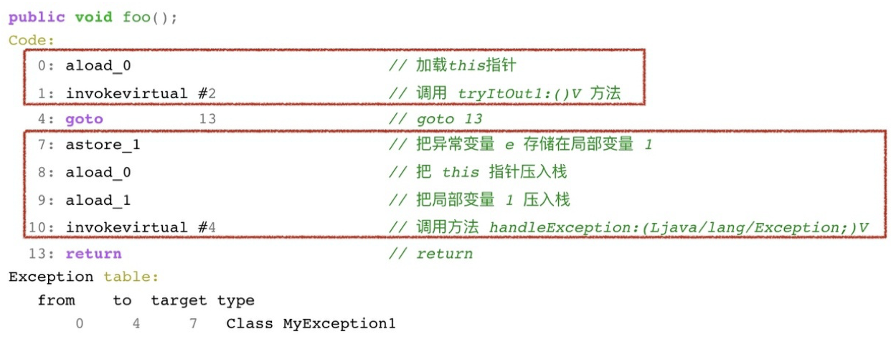

在编译后字节码中，每个⽅法都附带⼀个异常表（Exception table），异常表⾥的每⼀⾏表⽰⼀个异常处理器，由 from 指针、to 指针、target 指针、所捕获的异常类型 type 组成。这些指针的值是字节码索 引，⽤于定位字节码 其含义是在[from, to)字节码范围内，抛出了异常类型为type的异常，就会跳转到target表⽰的字节码处。 ⽐如，上⾯的例⼦异常表表⽰：在0到4中间（不包含 4）如果抛出 了MyException1 的异常，就跳转到7执⾏。

当有多个的catch的情况下，又会是怎样？

```java
public void foo() { 
  try { 
    tryItOut2(); 
  } catch (MyException1 e) { 
    handleException1(e); 
  } catch (MyException2 e) { 
    handleException2(e); 
  } 
}
```

对应字节码如下：

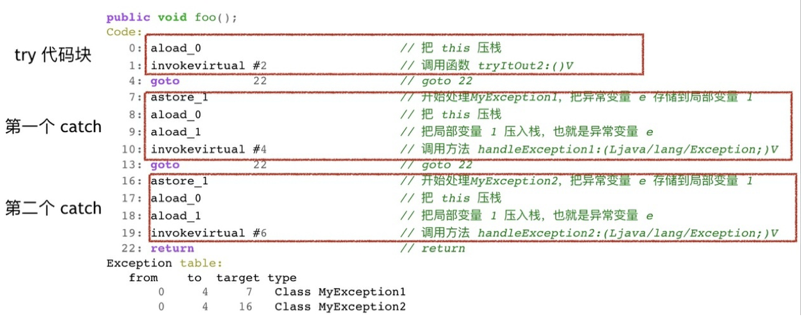

可以看到多⼀个异常，会在异常表（Exception table ⾥⾯多⼀条记录）。

当程序出现异常时，Java 虚拟机会从上⾄下遍历异常表中所有的条⽬。当触发异常的字节码索引值在某个异常条⽬的[from, to)范围内，则会判断抛出的异常与该条⽬想捕获的异常是否匹配。

- 如果匹配，Java 虚拟机会将控制流跳转到 target 指向的字节码；如果不匹配则继续遍历异常表 
- 如果遍历完所有的异常表，还未匹配到异常处理器，那么该异常将蔓延到调⽤⽅（caller）中重复上述的操作。最坏的情况下虚拟机需要遍历该线程 Java 栈上所有⽅法的异常表

## 0x02 finally 字节码分析

finally 的字节码分析最为有意思，之前我⼀直以为 finally 的实现是⽤简单的跳转来实现的，实际上并⾮如此。⽐如下⾯的代码

```java
public void foo() { 
  try { 
    tryItOut1(); 
  } catch (MyException1 e) { 
    handleException(e); 
  } finally { 
    handleFinally(); 
  } 
}
```

对应的字节码如下：

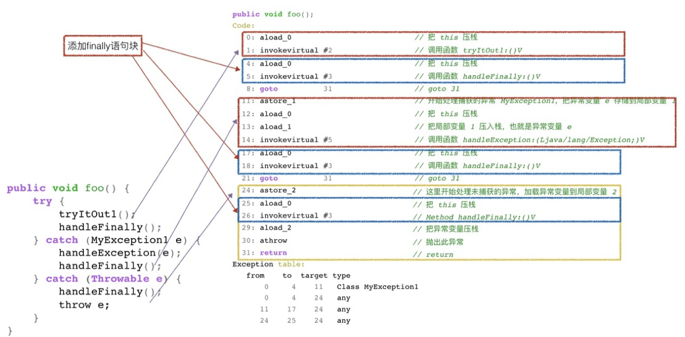

可以看到，字节码中包含了三份 finally 语句块，都在程序正常 return 和异常 throw 之前。其中两处在 try 和 catch 调⽤ return 之前，⼀处是在异常 throw 之前。 Java 采⽤⽅式是复制 finally 代码块的内容，分别放在 try catch 代码块所有正常 return 和 异常 throw 之前。 相当于如下的代码：

```java
public void foo() {
	try { 
    tryItOut1(); 
    handleFinally(); 
  } catch (MyException1 e) { 
    handleException(e); 
    handleFinally(); 
  } catch (Throwable e) { 
    handleFinally(); 
    throw e; 
  }
}
```

整个过程如下图所⽰

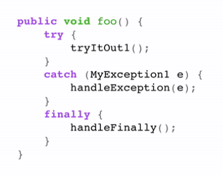

这样就解释了我们⼀直以来被灌输的观点，finally语句⼀定会执⾏

## 0x03 ⾯试题解析

这⾥有⼀个笔试中特别喜欢考，但是实际⽤处不⼤的场景：在 finally 中有 return 的情况 。

有了上述分析，就⽐较简单了，如果 finally 中有 return，因为它先于其它的执⾏，会覆盖其它的返回（包括异 常）

题⽬1： 

```java
public static int func() { 
  try { 
    return 0; 
  } catch (Exception e){ 
    return 1; 
  } finally { 
    return 2; 
  } 
} 
// 返回 2
```

题⽬2： 

```java
public static int func() { 
  try { 
    int a = 1 / 0; 
    return 0; 
  } catch (Exception e) { 
    return 1; 
  } finally { 
    return 2; 
  } 
} 
// 返回 2
```

题⽬3： 

```java
public static int func() { 
  try { 
    int a = 1 / 0; 
    return 0; 
  } catch (Exception e) { 
    int b = 1 / 0; 
  } finally { 
    return 2; 
  } 
} 
// 返回 2
```

 问题4:

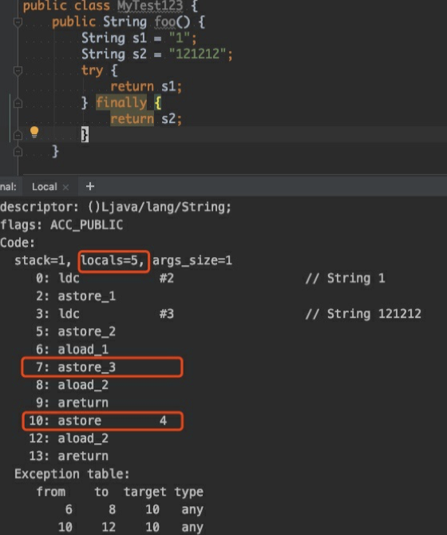

问题是：字节码中的第 10 ⾏ astore 4 是什么意思，栈上不都是空的吗？还有为什么显⽰局部变量 locals 个数等于 5，不是只有 this、s1、s2 这 3 个吗？

先来看astore_3这个字节码，其实是把 s1 的引⽤存储到局部变量表 slot 为 3 的位置上。第 10 ⾏的astore 4 是什么呢？从异常表（Exception table）可以看到第 10 ⾏开始是异常处理的逻辑，这个时候栈顶 并⾮是空的，栈顶元素就是抛出的异常，astore 4 将这个异常放到局部变量表中 slot 为 4 的位置。因此最后⼀个局部变量也清楚了。局部变量表列表如下：

```shell
0：this 
1：s1 
2：s2 
3：tmp_s1 
4：exception
```

如果上⾯的例⼦还不够清楚直接，可以再来⼀段代码

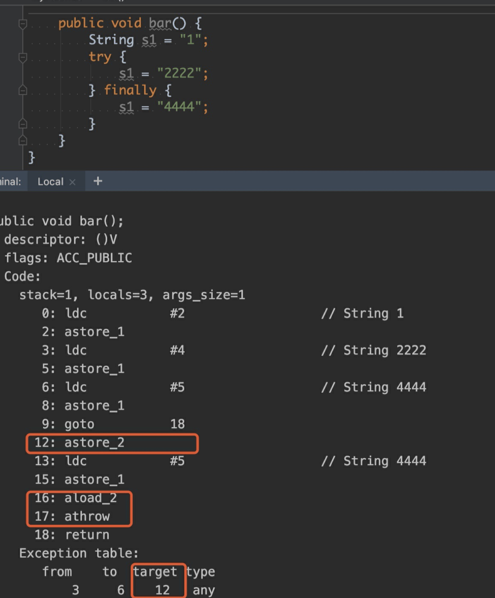

字节码中 12 ⾏开始是异常处理的逻辑，字节码16: aload_2 17: athrow ，通过 athrow 可以知道局部变量表中位置为 2 的变量是⼀个异常。与上⾯的例⼦是⼀样的。

## 0x05 ⼩结

这篇⽂章我们讲了 try-catch-finally 语句块的底层字节码实现，⼀起来回顾⼀下要点：

- 第⼀，JVM 采⽤异常表的⽅式来处理 try-catch 的跳转逻辑；
- 第⼆，finally 的实现采⽤拷贝 finally 语句块的⽅式来实现 finally ⼀定会执⾏的语义逻辑； 
- 第三，讲解了⾯试喜欢考的在 finally 中有 return 语句或者 抛异常的情况。

## 0x06 作业题

最后，给你留两道作业题。 1、下⾯代码输出什么，原因是什么

```java
public static int foo() { 
  int x = 0; 
  try { 
    return x; 
  } finally { 
    ++x; 
  } 
}

public static void main(String[] args) { 
  int res = foo(); 
  System.out.println(res); 
}
// 输出 0
```

2、低版本的 JDK 采⽤ jsr/ret 来实现 finally 语句块，你可以去了解⼀下这两个指令的作⽤，实现⼀下 finally 语义吗？


---


# 12. try-with-resource


Java 7中的 try-with-resource，在没有这个语法糖的情况下的等价实现是什么？ 以下⾯的 demo 为例，这个问题⽬测 99%的⼈都写不完全正确，不信来战。

## 0x01 初试⽜⼑

```java
public static void foo() throws Exception { 
  try (AutoCloseable c = dummy()) { 
    bar(); 
  } 
}

public static void bar() { 
  // may throw exception 
}
```

我们凭第⼀感觉来写⼀下：

```java
public static void foo() throws Exception {
	AutoCloseable c = null; 
  try { 
    c = dummy(); 
    bar(); 
  } finally { 
    if (c != null) { 
      c.close(); 
    } 
  }
}
```

看起来没什么问题，但是仔细想⼀下，如果bar()抛出了异常e1，c.close()也抛出了异常e2，调⽤者会收到哪个呢？ 我们来回顾⼀下Java基础，try catch finally 部分

```java
public static void foo() { 
  try { 
    throw new RuntimeException("in try"); 
  } finally { 
    throw new RuntimeException("in finally" ); 
  } 
}
```

调⽤foo()函数最终会抛出什么异常呢？ 运⾏⼀下： Exception in thread "main" java.lang.RuntimeException: in finally

try中抛出的异常，就被finally 中抛出的异常淹没掉了。

## 0x02 suppressed 异常是什么

回到刚刚的问题，如果 bar() 和 c.close()同时抛了异常，那么调⽤端应该会收到c.close()抛出的异常e2, 往往这并不是我们想要的。那么怎么样抛出 try 中的异常，同时又不丢掉 finally 中的异常呢？ 

> Java 7 中 为 Throwable 类 增 加 的 addSuppressed ⽅ 法。当 ⼀ 个异 常 被 抛 出 的 时 候 , 可 能 有 其 他 异 常 因 为 该 异 常 ⽽ 被 抑 制 住 , 从 ⽽ ⽆ 法 正 常 抛 出 。 这时 可 以 通过addSuppressed ⽅ 法 把 这 些 被 抑 制 的 ⽅ 法 记 录 下 来 。 被 抑 制 的 异 常 会 出 现在 抛 出 的 异 常 的 堆 栈 信 息 中 , 也 可 以 通 过 getSuppressed ⽅ 法 来 获 取 这 些 异 常 。 这 样做 的好处是不会丢失任何异常,⽅便开发⼈员进⾏调试。

 有了上述概念，我们进⾏改写

```java
public static void foo() throws Exception {
	AutoCloseable c = null; 
  Exception tmpException = null; 
  try {
		c = dummy();
		bar(); 
  } catch (Exception e) {
		tmpException = e;
		throw e; 
  } finally {
		if (c != null) {
			if (tmpException != null) { 
        try { 
          c.close(); 
        } catch (Exception e) { 
          tmpException.addSuppressed(e); 
        }
			} else { 
        c.close();
			}
		}
	}
}
```

验证我们的想法 javap -c 查看字节码：

```shell
public static void foo() throws java.lang.Exception;
	Code:
		0: invokestatic 		#2	  // Method dummy:()Ljava/lang/AutoCloseable; 
		3: astore_0 
		4: aconst_null 
		5: astore_1

		6: invokestatic			#3		// Method bar:()V

		9: aload_0 
	 10: ifnull 					86
	 13: aload_1 
	 14: ifnull						35

	 17: aload_0 
	 18: invokeinterface 	#4, 1	// InterfaceMethod java/lang/AutoCloseable.close:()V
	 23: goto 						86

	 26: astore_2 
	 27: aload_1 
	 28: aload_2 
	 29: invokevirtual 		#6 		// Method java/lang/Throwable.addSuppressed:(Ljava/lang/Throwable;)V
	 32: goto 						86 
	 35: aload_0 
	 36: invokeinterface 	#4, 1  // InterfaceMethod java/lang/AutoCloseable.close:()V
	 41: goto 						86

	 44: astore_2 
	 45: aload_2 
	 46: astore_1 
	 47: aload_2 
	 48: athrow

   49: astore_3 
   50: aload_0 
   51: ifnull 					84
   54: aload_1 
   55: ifnull						78

	 58: aload_0 
	 59: invokeinterface 	#4, 1  // InterfaceMethod java/lang/AutoCloseable.close:()V
	 64: goto 						84

	 67: astore						4
	 69: aload_1 
	 70: aload 						4 
	 72: invokevirtual 		#6 		 // Method java/lang/Throwable.addSuppressed:(Ljava/lang/Throwable;)V
	 75: goto 						84 
	 78: aload_0 
	 79: invokeinterface 	#4, 1  // InterfaceMethod java/lang/AutoCloseable.close:()V
	 84: aload_3 
	 85: athrow 
	 86: return 
Exception table:
	from to target type 
	17 23 26 Class java/lang/Throwable 
	 6  9 44 Class java/lang/Throwable 
	 6  9 49 any 
	58 64 67 Class java/lang/Throwable 
	44 50 49 any
```

从字节码的细节可以看到基本跟我们最后的逻辑⼀致。

## 0x03 ⼩结

这篇⽂章我们讲了 try with resource 语句块的底层字节码实现，⼀起来回顾⼀下要点：

- 第⼀，try-with-resource 语法并不是简单的在 finally ⾥中加⼊了closable.close()⽅法，因为 finally 中的 close ⽅法如果抛出了异常会淹没真正的异常； 
- 第⼆，引⼊了 suppressed 异常的概念，能抛出真正的异常，且会调⽤ addSuppressed 附带上 suppressed 的异常。

## 0x04 思考

留⼀个作业：我们没有逐⾏解析 0x02 中的字节码，你能逐⾏分析⼀下每条字节码的含义吗？


---


# 13. Kotlin

Kotlin 是一门让人觉得惊喜的语言，2017 年 Google I/O 大会上，Google 宣布将 Kotlin 作为 Android 开发的头等语言以后，Kotlin 得到了大量的关注和快速的发展，我们后端开发也在此时进行了第一时间 的跟进。

Kotlin 代码更加简洁、类型推断、不变性、null 安全、函数式编程、协程等特性，都非常好用，而且能够与 Java 无缝互相调用，迁移成本几乎为零。与其说 Kotlin 是一门新语言，不如说是 Java 上最流行的库。这些好用语法层面的特性的背后都是华丽的语法糖，写 Kotlin 很爽是因为编译器把那些繁琐的东西帮我们都做了。

哪有什么岁月静好，不过是有人替你负重前行，

## 0x01 main 是怎么回事

在 Java 中，main 函数必须要写在一个 class 里面，但是 Kotlin 中却不用这样，比如我们新建了一个 MyTestMain.kt 文件，写入一个 main 函数

```kotlin
fun main(args: Array<String>) { 
  println("hello kotlin")
}
```

用 kotlinc 编译一下，会发现生成一个类文件 MyTestMainKt.class

```shell
public final class MyTestMainKt {
	public static final void main(java.lang.String[]);
		Code:
			1: ldc 						#9 		// String args
  		3: invokestatic 	#15 	// Method kotlin/jvm/internal/Intrinsics.checkParameterIsNotNull:(Ljava/lang/Object;Ljava/lang/String;)V 
  		6: ldc 						#17		// String hello kotlin
  		8: astore_1
			9: getstatic 			#23		// Field java/lang/System.out:Ljava/io/PrintStream;
			12: aload_1
			13: invokevirtual #29		// Method java/io/PrintStream.println:(Ljava/lang/Object;)V
			16: return
```

人肉翻译一下

```kotlin
public final class MyTestMainKt {
	public static final void main(String[] args) {
		Intrinsics.checkParameterIsNotNull(args, "args");
    String str = "hello kotlin";
    System.out.println(str);
	} 
}
```

在 Kotlin1.3 版本中，我们甚至可以省略掉 main 函数的参数，更加简洁

```kotlin
fun main() {
	println("hello kotlin")
}
```

## 0x02 object 易如反掌创建单例

在准备面试的过程中，你一定准备过单例模式的 N 中写法，比如饿汉式、懒汉式、单线程写法、双重检查锁写法、枚举

下面这种就是最简单的一种 eager 模式单例

```kotlin
public class SingleObject {
	private static SingleObject instance = new SingleObject(); 
  private SingleObject() {}

	public static SingleObject getInstance(){
		return instance; 
  }
}
```

object 关键字天生为单例而生，只用如下简单的做法就可以实现了上面代码 饿汉式单例模式同样的功能 

```kotlin
object MySingleton {

}
```

它是如何做到的呢? 用 kotlinc 把上面的源码编译成字节码kotlinc MySingleton.kt

```shell
static {};
	0: new 					 #2  // class MySingleton 
	3: dup
	4: invokespecial #25 // Method "<init>":()V
	7: astore_0
	8: aload_0
	9: putstatic 		 #27 // Field INSTANCE:LMySingleton;
	12: return 
```


- 0 ~ 7:是我们前面介绍对象初始化操作里面非常经典的操作，new-dup-invokespecial-astore，看到这个现在就要形成条件反射，这就是新建一个对象存储到局部变量表的过程。可以理解为对应 Java 中代码MySingleton localMySingleton = new MySingleton()
- 8 ~ 9:是把刚刚新建的变量从局部变量表中捞出来存储到类的静态变量 INSTANCE 中

人肉翻译成 Java 代码就是

```kotlin
public final class MySingleton {
	public static final MySingleton INSTANCE; 
  	static {
			MySingleton localMySingleton = new MySingleton();
			INSTANCE = localMySingleton; 
    }
}
```


## 0x03 扩展方法

Kotlin 的扩展方法比 Java 要灵活多了， ExtensionTest.kt

```kotlin
class MyClass(val i: Int)
fun MyClass.plusOne() = this.i + 1 
fun main(args: Array<String>) {
	val obj = MyClass(1)
	println(obj.plusOne()) 
}
```

那 Kotlin 编译器会怎么实现这样一个特性呢?先来看下 MyClass类有没有做修改,使用 javap MyClass.class 会发现 MyClass 并没有发现 plusOne 函数的踪迹，这也比较符合常理，因为扩展方法往往是后期动 态新增的，直接修改 MyClass 类不太合适，剩下的一个类就是 ExtensionTestKt 了，查看一下字节码

```shell
public static final int plusOne(MyClass); 
	Code:
		0: aload_0
		1: ldc 					#9  // String receiver$0
		3: invokestatic #15 // Method kotlin/jvm/internal/Intrinsics.checkParameterIsNotNull:(Ljava/lang/Object;Ljava/lang/String;)V
		6: aload_0
		7: invokevirtual #21 // Method MyClass.getI:()I
		10: iconst_1
		11: iadd
		12: ireturn
```

可以看到 ExtensionTestKt 新增了一个 plusOne 函数，函数参数是 MyClass 对象，上面的字节码非常简单，人肉翻译机翻译一下是这样

```kotlin
public static final int plusOne(MyClass $receiver) {
  Intrinsics.checkParameterIsNotNull($receiver, "receiver$0"); 
  return $receiver.getI() + 1;
}
```

main 调用翻译成 Java 代码

```
MyClass obj = new MyClass(1);
int i = ExtensionTestKt.plusOne(obj); 
System.out.println(i);
```

所以 Kotlin 就是扩展函数代码所在的类新建了一个静态的函数，把要扩展的类作为静态函数的第一个参数传入进来，简化而言就是这样:func obj.extension -> OtherClass.extension(obj) Kotlin 就是用这样一 种非常简单轻量的方式实现了函数扩展。

## 0x04 高级 for 循环

```kotlin
for (i in 100 downTo 1 step 2) {
	println(i)
}
```

输出:

> 100 98 ... 2

对应字节码

```shell
public static final void foo(); 
	Code:
		0: bipush         100
		2: iconst_1
		3: invokestatic   #57 // Method kotlin/ranges/RangesKt.downTo:(II)Lkotlin/ranges/IntProgression;
		6: iconst_2
		7: invokestatic   #61 // Method kotlin/ranges/RangesKt.step:(Lkotlin/ranges/IntProgression;I)Lkotlin/ranges/IntProgression;
		
		10: dup
		11: dup
		12: invokevirtual #67 // Method kotlin/ranges/IntProgression.getFirst:()I 
		15: istore_0
		16: invokevirtual #70 // Method kotlin/ranges/IntProgression.getLast:()I 
		19: istore_1
		20: invokevirtual #73 // Method kotlin/ranges/IntProgression.getStep:()I
		23: istore_2
		
		24: iload_0
		25: iload_1
		26: iload_2
		27: ifle          36
		30: if_icmpgt     58 
		33: goto          39 
		36: if_icmplt     58
		
		39: getstatic     #39 // Field java/lang/System.out:Ljava/io/PrintStream;
		42: iload_0
		43: invokevirtual #76  // Method java/io/PrintStream.println:(I)V
		46: iload_0
		47: iload_1
		48: if_icmpeq      58
		51: iload_0
		52: iload_2
		53: iadd
		54: istore_0
		55: goto 39
		58: return
```

我们把局部变量表放出来，你能否通过上面的字节码人肉翻译出 Java 代码呢?

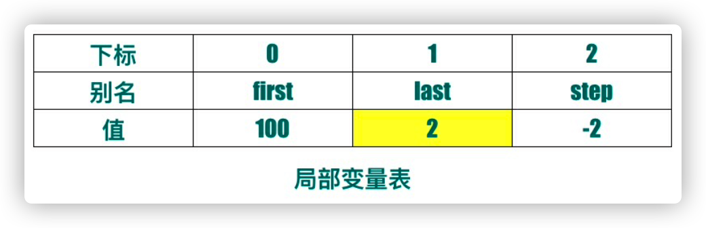

我们逐行翻译一下

- 0 ~ 7:调用了 kotlin 标准库的两个函数，翻译一下大概如下 IntProgression progression = RangesKt.step(RangesKt.downTo(100, 1), 2); 这里要注意，last 的初始化值为 2(不是我们代码中的1)，不是我写错了，是 Kotlin 根据 first last step 初始值算出来的最终迭代退出的值，后面会有用
- 10 ~ 23:初始化一些变量为后面循环做准备，这里有三个变量分别是循环开始值(记为 first)、循环结束值(记为 last)、循环 step(记为 step) 24 ~ 30:做一些明显不符合条件的跳出。比如 step 大于 0 的情况下，first 应该小于等于 last，step 小于等于 0 的情况下，fist 应该大于等于 last

- 24 ~ 26:加载三个变量到操作数栈上

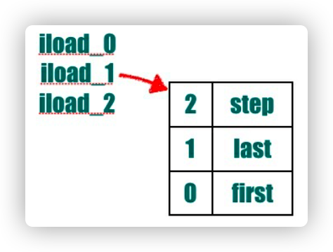

- 27 行:ifle 指令表示小于等于 0 则跳转 36 行，这里是判断 step 小于等于 0 的情况下，继续进行 first 和 last 的比较。执行完，操作数栈如下


- 30 行与 36 行使用 if_icmpgt 和 if_icmplt 对栈顶的两个变量进行比较(也即first 和 last)，如果不合法直接跳出

- 39 ~ 55:while 循环处理。39 ~ 43 打印 first 的值，然后对局部变量表 0 和 1 位置的变量进行比较是否相等，这里是进行 first 和 last 是否相等的判断，如果相等，则退出循环。如果不等，对 first +=

  step 操作

人肉字节码翻译机的结果如下:

```kotlin
public static void foo() {
	IntProgression progression = RangesKt.step(RangesKt.downTo(100, 1), 2); 
  int first = progression.getFirst(); // first: 100
	int last = progression.getLast(); 	// last : 2
  int step = progression.getStep(); 	// step : -2
  if (step > 0) {
		if (first > last) { 
      return;
		}
	} else if (first < last) {
		return;
  }
	while (true) { 
    System.out.println(first); 
    if (first == last) {
			return; 
    }
		first += step; 
  }
}
```

在 while 循环中，注意循环退出的条件是判断 first 是否与 last 相等，而不是 first 是否小于 last，就是因为在 IntProgression 初始化的时候就已经做好了 last 的计算，可以用效率更高的等于在循环中进行比 较判断。

## 0x05 小结

这篇文章我们讲了 Kotlin 语法糖在字节码层面的实现细节，一起来回顾一下要点:第一，没有被任何类包裹的 main 函数在编译后自动生成一个临时类包含了上面的静态 main 函数。第二，object 对象即 单例的写法实际上是一个 eager 模式的单例实现。第三，Kotlin 扩展方法实际上是生成了一个静态方法，把对象作为静态方法的参数传入，调用扩展方法实际上是调用了另外一个类的静态方法。第四，我 们讲了一下 Kotlin 高级 for 循环的例子，其底层是可以理解为是用 while 语句来实现。

## 0x06 思考

留一个作业:Kotlin 声明函数时可以指定默认参数值，这样可以避免创建重载的函数，你可以从字节码的角度分析一下具体的实现吗?


---


# 14. synchronized


这篇⽂章我们将深⼊的分析 synchronized 关键字在字节码层⾯是如何实现的

## 0x01 代码块级别的 synchronized

```java
private Object lock = new Object(); 
public void foo() {
	synchronized (lock) {
		bar();
	} 
}
public void bar() { }
```

编译成字节码如下

```shell
public void foo(); 
	Code: 
		0: aload_0 
		1: getfield 			#3		// Field lock:Ljava/lang/Object;
		4: dup 
		5: astore_1

		6: monitorenter
		
		7: aload_0 
		8: invokevirtual 	#4		// Method bar:()V

	 11: aload_1 
	 12: monitorexit 
	 13: goto						21

	 16: astore_2 
	 17: aload_1 
	 18: monitorexit 
	 19: aload_2 
	 20: athrow 
	 21: return 
Exception table:
	from to target type 
		 7 13 	16  	any 
		16 19 	16	  any
```

Java 虚拟机中代码块的同步是通过 monitorenter 和 monitorexit 两个⽀持 synchronized 关键字语意的。⽐如上⾯的字节码

- 0 ~ 5：将 lock 对象⼊栈，使⽤ dup 指令复制栈顶元素，并将它存⼊局部变量表位置 1 的地⽅，现在栈上还剩下⼀个 lock 对象 
- 6：以栈顶元素 lock 做为锁，使⽤ monitorenter 开始同步 
- 7 ~ 8：调⽤ bar() ⽅法
- 11 ~ 12：将 lock 对象⼊栈，调⽤ monitorexit 释放锁

monitorenter 对操作数栈的影响如下

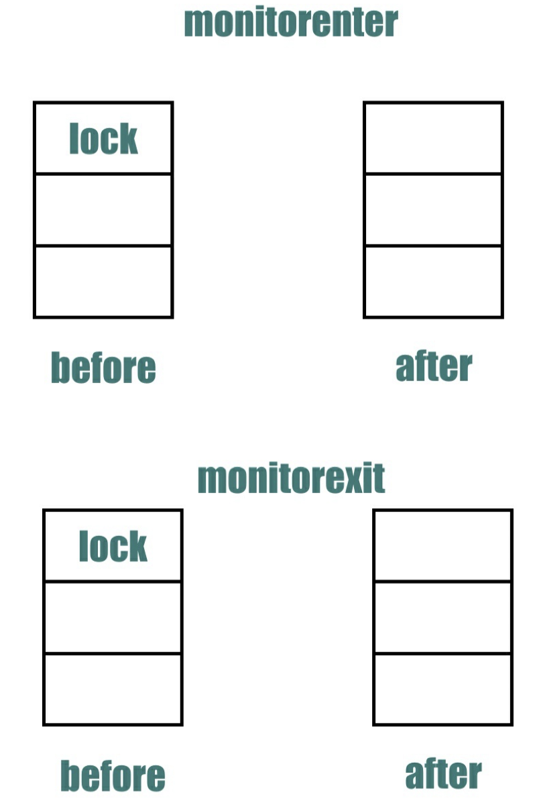

- 16 ~ 20：执⾏异常处理，我们代码中本来没有 try-catch 的代码，为什么字节码会帮忙加上这段逻辑呢？

因为编译器必须保证，⽆论同步代码块中的代码以何种⽅式结束（正常 return 或者异常退出），代码中每次调⽤ monitorenter 必须执⾏对应的 monitorexit 指令。为了保证这⼀点，编译器会⾃动⽣成⼀个 异常处理器，这个异常处理器的⽬的就是为了同步代码块抛出异常时能执⾏ monitorexit。这也是字节码中，只有⼀个 monitorenter 却有两个 monitorexit 的原因 

可理解为这样的⼀段 Java 代码

```java
public void _foo() throws Throwable { 
  monitorenter(lock); 
  try { 
    bar(); 
  } finally { 
    monitorexit(lock); 
  } 
}
```

根据我们之前介绍的 try-catch-finally 的字节码实现原理，复制 finally 语句块到所有可能函数退出的地⽅，上⾯的代码等价于

```java
public void _foo() throws Throwable { 
  monitorenter(lock); 
  try { 
    bar(); 
    monitorexit(lock); 
  } catch (Throwable e) { 
    monitorexit(lock); 
    throw e; 
  } 
}
```

## 0x02 ⽅法级的 synchronized

⽅法级的同步与上述有所不同，它是由常量池中⽅法的 ACC_SYNCHRONIZED 标志来隐式实现的。

```java
synchronized public void testMe() { }
```

对应字节码

```shell
public synchronized void testMe(); 
descriptor: ()V 
flags: ACC_PUBLIC, ACC_SYNCHRONIZED
```

JVM 不会使⽤特殊的字节码来调⽤同步⽅法，当 JVM 解析⽅法的符号引⽤时，它会判断⽅法是不是同步的（检查⽅法 ACC_SYNCHRONIZED 是否被设置）。

如果是，执⾏线程会先尝试获取锁。如果是 实例⽅法，JVM 会尝试获取实例对象的锁，如果是类⽅法，JVM 会尝试获取类锁。在同步⽅法完成以后，不管是正常返回还是异常返回，都会释放锁

## 0x03 ⼩结

这篇⽂章我们讲了 synchronized 关键字在字节码层⾯的实现细节，⼀起来回顾⼀下要点：

- 第⼀，代码块级别的 synchronized 是使⽤ monitorenter、monitorexit 指令来实现的，monitorexit 会在所有可能退出 的地⽅调⽤（正常退出、异常退出），以实现 monitorexit ⼀定会调⽤的语义。
- 第⼆，⽅法级的 synchronized 是 JVM 隐式实现的，没有成对的 monitorenter-monitorexit 语句块。

## 0x04 思考

留⼀道作业题：monitorenter 和 monitorexit 底层做了什么？跟 Java 的对象头有什么关系？

欢迎你在留⾔区留⾔，和我⼀起讨论。


---


# 15. java泛型


Java 泛型是 JDK5 引进的新特性，对于泛型的引⼊，社区褒贬不⼀，好的地⽅是泛型可以在编译期帮我们发现⼀些明显的问题，不好的地⽅是泛型在设计上因为考虑兼容性等原因，留下了⽐较⼤的坑。 ⽹上有很多喷 Java 的泛型设计，甚⾄《Thinking in Java》的作者都发表了⼀篇⽂章来批评 JDK5 中的泛型实现，知乎也有很多类似的帖⼦。 Java 泛型更像是⼀个 Java 语⾔的语法糖，我们将从字节码的⾓度分析⼀下泛型。

## 0x01 当泛型遇到重载

```java
public void print(List<String> list) { } 
public void print(List<Integer> list) { }
```

上⾯的代码编译的时候会报错，提⽰name clash: print(List<Integer>) and print(List<String>) have the same erasure 这两个函数对应的字节码都是

```shell
descriptor: (Ljava/util/List;)V 
Code:
	stack=0, locals=2, args_size=2 
		0: return 
	LocalVariableTable:
		Start Length Slot Name Signature 
			0 		1 		0 	this LMyClass;
			0 		1 		1 	list Ljava/util/List;
```

为了弄懂这个问题，需要先了解泛型的类型擦除

## 0x02 泛型的核⼼概念：类型擦除（type erasure）

理解泛型概念的最重要的是理解类型擦除。Java 的泛型是在 javac 编译期这个级别实现的。在⽣成的字节码中，已经不包含类型信息了。这种在泛型使⽤时加上类型参数，在编译时被抹掉的过程被称为泛型擦除。 

⽐如在代码中定义：List<String> 与 List<Integer> 在编译以后都变成了 List。JVM 看到的只是 List，⽽ JVM 不允许相同签名的函数在⼀个类中同时存在，所以上⾯代码中编译⽆法通过。 

由泛型附加的类型信息对 JVM 来说是不可见的。Java 编译器会在编译时尽可能的发现可能出错的地⽅，但是也不是万能的。 很多泛型的奇怪语法规定都与类型擦除的存在有关

- 泛型类并没有⾃⼰独有的 Class 类对象，⽐如并不存在 List<String>.class 或是 List<Integer>.class，⽽只有 List.class。 
- 泛型的类型参数不能⽤在 Java 异常处理的 catch 语句中。因为异常处理是由 JVM 在运⾏时刻来进⾏的。由于类型信息被擦除，JVM 是⽆法区分两个异常类型 和 MyException<Integer>的。对于 JVM 来说，它们都是 MyException 类型的 MyException<String>

## 0x03 泛型真的被完全擦除了吗

学习泛型的时候，我们被⼤量的⽂章警⽰「泛型信息在编译之后是拿不到的，因为已经被擦除掉」，真的是这样吗？ 我们在 javac 编译的时候加上 -g 参数⽣成更多的调试信息，使⽤ javap -c -v -l 来查看字节码时可以看到更多有⽤的信息

```shell
public void print(java.util.List<java.lang.String>);
	descriptor: (Ljava/util/List;)V 
		stack=0, locals=2, args_size=2 
			0: return 
		LocalVariableTypeTable:
			Start Length Slot Name Signature 
					0 		1 		1 list Ljava/util/List<Ljava/lang/String;>; 
			Signature: #18 					// (Ljava/util/List<Ljava/lang/String;>;)V
```

LocalVariableTypeTable 和 Signature 是针对泛型引⼊的新的属性，⽤来解决泛型的参数类型识别问题，Signature 最为重要，它的作⽤是存储⼀个⽅法在字节码层⾯的特征签名，这个属性保存的不是原⽣类型，⽽是包括了参数化类型的信息。我们依然可以通过反射的⽅式拿到参数的类型。所谓的擦除，只是把⽅法 code 属性的字节码进⾏擦除。 

## 0x04 ⼩结

这篇⽂章我们讲解了字节码在 Java 泛型上的应⽤，⼀起来回顾⼀下要点：

- 第⼀，由于类型擦除的存在，List<String>.class、List<Integer>.class在 JVM 层⾯只有 List.class，因此泛型在重载上有⼀些问题。
- 第⼆，通过 javap 可以看到泛型的类型擦除并不是完全擦除了，字节码中 Signature 域存储了⽅法带有泛型的签名。

## 0x05 思考

留⼀道作业题：下⾯的代码，你可以看出为什么 Java 编译器会提⽰编译错误吗？

```java
public void inspect(List<Object> list) { } 
public void test() {
	List<String> strs = new ArrayList<String>();
	inspect(strs); // 编译错误，不兼容类型
}
```


---


# 16. 反射背后的原理

在 Java 中反射随处可见，它底层的原也⽐较有意思，这篇⽂章来详细介绍反射背后的原理。

## 0x01 一个例子

先来看下⾯这个例⼦：

```java
public class ReflectionTest {
	private static int count = 0; 
  public static void foo() { 
    new Exception("test#" + (count++)).printStackTrace(); 
  }

	public static void main(String[] args) throws Exception { 
    Class<?> clz = Class.forName("ReflectionTest"); 
    Method method = clz.getMethod("foo"); 
    for (int i = 0; i < 20; i++) { 
      method.invoke(null);
    } 
  }
}
```

运⾏结果如下

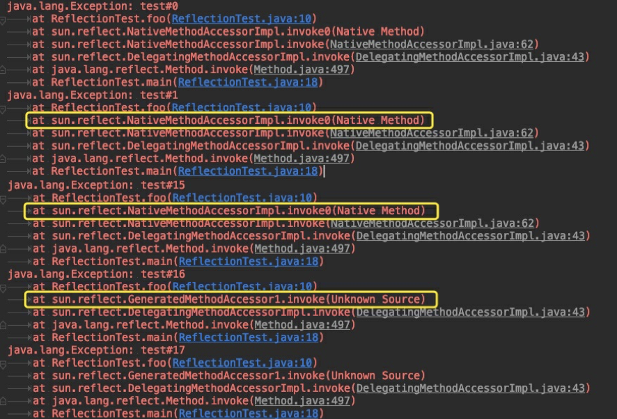

可以看到同⼀段代码，运⾏的堆栈结果与执⾏次数有关系，在 0 ~ 15 次调⽤⽅式为sun.reflect.NativeMethodAccessorImpl.invoke0，从第 16 次开始调⽤⽅式变为 了sun.reflect.GeneratedMethodAccessor1.invoke。原因是什么呢？继续往下看。

## 0x02 反射⽅法源码分析

Method.invoke 源码如下：

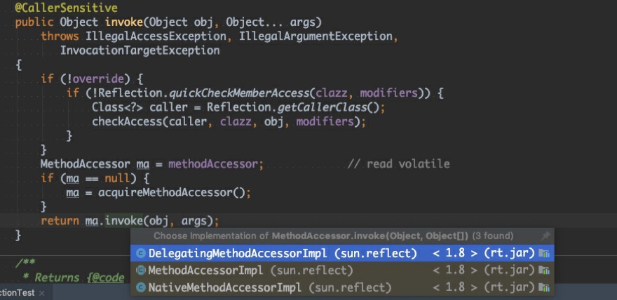

可以最终调⽤了MethodAccessor.invoke⽅法，MethodAccessor 是⼀个接口

```java
public interface MethodAccessor { 
  public Object invoke(Object obj, Object[] args) 
    throws IllegalArgumentException, InvocationTargetException; 
}
```

从输出的堆栈可以看到 MethodAccessor 的实现类是委托类DelegatingMethodAccessorImpl，它的 invoke 函数⾮常简单，就是把调⽤委托给了真正的实现类。

```java
class DelegatingMethodAccessorImpl extends MethodAccessorImpl {
	private MethodAccessorImpl delegate; 
  public Object invoke(Object obj, Object[] args) 
    throws IllegalArgumentException, InvocationTargetException {
		return delegate.invoke(obj, args); 
  }
```

通过堆栈可以看到在第 0 ~ 15 次调⽤中，实现类是 NativeMethodAccessorImpl，从第 16 次调⽤开始实现类是 GeneratedMethodAccessor1，为什么是这样呢？⽞机就在 NativeMethodAccessorImpl 的 invoke ⽅法中

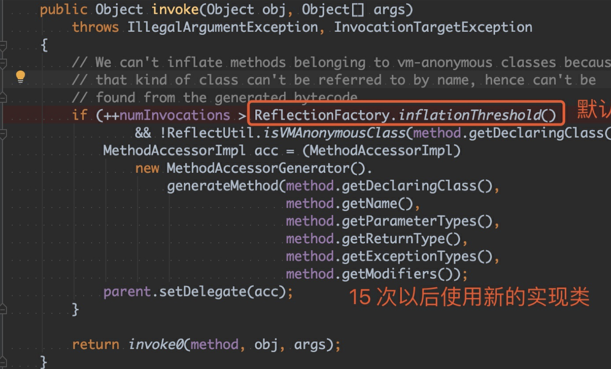

前 0 ~ 15 次都会调⽤到invoke0 ，这是⼀个 native 的函数。

```java
private static native Object invoke0(Method m, Object obj, Object[] args);
```

有兴趣的同学可以去看⼀下 Hotspot 的源码，依次跟踪下⾯的代码和函数：

> ./jdk/src/share/native/sun/reflect/NativeAccessors.c
>
> JNIEXPORT jobject JNICALL Java_sun_reflect_NativeMethodAccessorImpl_invoke0 (JNIEnv *env, jclass unused, jobject m, jobject obj, jobjectArray args)
>
> ./hotspot/src/share/vm/prims/jvm.cpp JVM_ENTRY(jobject, JVM_InvokeMethod(JNIEnv *env, jobject method, jobject obj, jobjectArray args0))
>
> ./hotspot/src/share/vm/runtime/reflection.cpp oop Reflection::invoke_method(oop method_mirror, Handle receiver, objArrayHandle args, TRAPS)

这⾥不详细展开 native 实现的细节。


15 次以后会⾛新的逻辑，使⽤ GeneratedMethodAccessor1 来调⽤反射的⽅法。MethodAccessorGenerator 的作⽤是通过 ASM ⽣成新的类 sun.reflect.GeneratedMethodAccessor1。为了查看整个类的内容， 可以使⽤阿⾥的 [arthas](https://arthas.aliyun.com/doc/) ⼯具。修改上⾯的代码，在 main 函数的最后加上System.in.read(); 让 JVM 进程不要退出。 执⾏ arthas ⼯具中的./as.sh ，会要求输⼊ JVM 进程

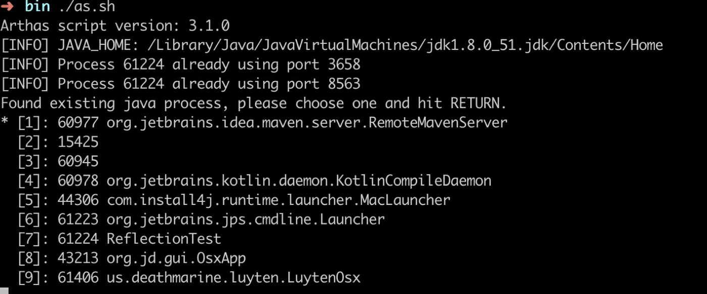

选择在运⾏的 ReflectionTest 进程号 7 就进⼊到了 arthas 交互性界⾯。执⾏ dump sun.reflect.GeneratedMethodAccessor1⽂件就保存到了本地。

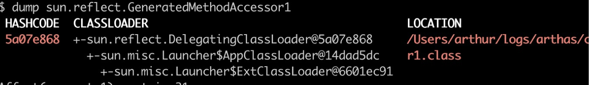

来看下这个类的字节码

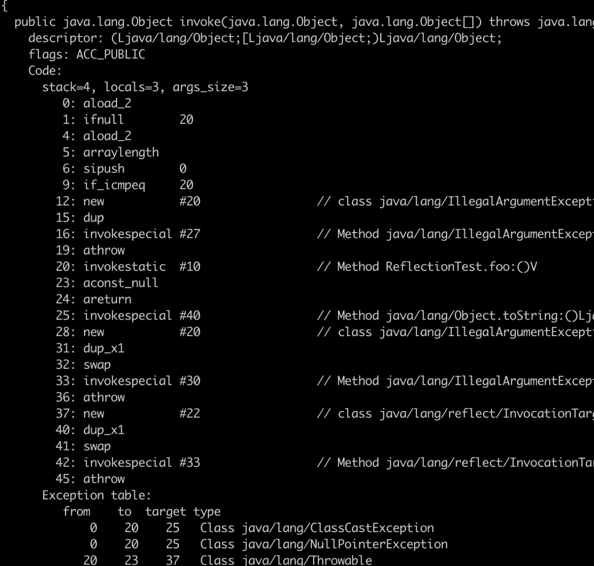

⼈⾁翻译⼀下这个字节码，忽略掉异常处理以后的代码如下

```java
public class GeneratedMethodAccessor1 extends MethodAccessorImpl { 
  @Override 
  public Object invoke(Object obj, Object[] args) 
    throws IllegalArgumentException, InvocationTargetException { 
    ReflectionTest.foo(); 
    return null; 
  } 
}
```

那为什么要采⽤ 0 ~ 15 次使⽤ native ⽅式来调⽤，15 次以后使⽤ ASM 新⽣成的类来处理反射的调⽤呢？

⼀切都是基于性能的考虑。JNI native 调⽤的⽅式要⽐动态⽣成类调⽤的⽅式慢 20 倍，但是又由于第⼀次字节码⽣成的过程⽐较慢。如果反射仅调⽤⼀次的话，采⽤⽣成字节码的⽅式反⽽⽐ native 调⽤ 的⽅式慢 3 ~ 4 倍。

## 0x03 inflation 机制

因为很多情况下，反射只会调⽤⼀次，因此 JVM 想了⼀招，设置了 15 这个 sun.reflect.inflationThreshold 阈值，反射⽅法调⽤超过 15 次时（从 0 开始），采⽤ ASM ⽣成新的类，保证后⾯的调⽤⽐ native 要快。如果⼩于 15 次的情况下，还不如⽣成直接 native 来的简单直接，还不造成额外类的⽣成、校验、加载。这种⽅式被称为 「inflation 机制」。inflation 这个单词也⽐较有意思，它的字⾯意思是 「膨胀；通货膨胀」。

JVM 与 inflation 相关的属性有两个，⼀个是刚提到的阈值 sun.reflect.inflationThreshold，还有⼀个是是否禁⽤ inflation的属性 sun.reflect.noInflation，默认值为 false。如果把这个值设置成true 的 话，从第 0 次开始就使⽤动态⽣成类的⽅式来调⽤反射⽅法了，不会使⽤ native 的⽅式。

增加 noInflation 属性重新执⾏上述 Java 代码

```shell
java -cp . -Dsun.reflect.noInflation=true ReflectionTest
```

输出结果为

```shell
java.lang.Exception: test#0 
		at ReflectionTest.foo(ReflectionTest.java:10) 
		at sun.reflect.GeneratedMethodAccessor1.invoke(Unknown Source) 
		at java.lang.reflect.Method.invoke(Method.java:497) 
		at ReflectionTest.main(ReflectionTest.java:18) 
java.lang.Exception: test#1 
		at ReflectionTest.foo(ReflectionTest.java:10) 
		at sun.reflect.GeneratedMethodAccessor1.invoke(Unknown Source) 
		at java.lang.reflect.Method.invoke(Method.java:497) 
		at ReflectionTest.main(ReflectionTest.java:18)
```

可以看到，从第 0 次开始就已经没有使⽤ native ⽅法来调⽤反射⽅法了。

## 0x04 ⼩结 

这篇⽂章主要介绍了 Java ⽅法反射调⽤底层的原理，主要有两种⽅式 

- native ⽅法 
- 动态⽣成类的⽅式 

native 调⽤的⽅式⽐ Java 类直接调⽤的⽅式慢 20 倍，但是第⼀次⽣成动态类又⽐较耗时，因此 JVM 才有了⼀个优化策略，在某阈值之前使⽤ native 调⽤，在此阈值之后使⽤动态⽣成类的⽅式。这样既 可以保证在反射⽅法少数调⽤的情况下，不⽤⽣成新的类，又可以保证调⽤次数很多的情况下使⽤性能更优的动态类的⽅式。

## 0x05 思考题

现实中⼤量使⽤反射调⽤的项⽬，inflation 机制可能造成哪些隐患呢？

- 接口的通用性，java的invoke方法是传object和object[]数组的。基本参数类型需要装箱和拆箱，产生大量额外的对象和内存开销，频繁促发GC。
- 编译器难以对动态调用的代码提前做优化，比如方法内联。
- 反射需要按名检索类和方法，有一定的时间开销。


---


# 17. javac 编译原理

javac 的目标是把 Java 源码编译为符合 Java 虚拟机规范的 class 文件，在 Oracle 的 JDK 中，javac 是用 java 语言写的，在某种意义上算是实现了 java 语言的自举。你完全可以不使用 Oracle 提供的 javac，自己实现一个java 源码编译器，Eclipse 自己就实现了自己的编译器，称为 Eclipse Compiler for Java (ECJ)。

Javac 的源码非常复杂，没有较强的编译原理理论阅读起来会比较吃力，调试源码的方式是一个比较好的方法帮助我们理解里面的实现细节，本章开始我首先会介绍 Javac 源码的调试。

## Javac 源码调试

javac 源码调试的过程是比较简单的，它本身就是一个用 Java 语言写的，对我们理解内部逻辑比较友好。下面的环境是 Intellij 和 JDK8 下完成。

### 1. 下载导入 javac 的源码

> 如果不想从 openjdk 下载折腾，可以跳过第 1 步
>
> 直接从我的 github 下载: https://github.com/jelly54/java-code-reading
>
> 下载后直接导入 IDEA 即可使用

OpenJDK 的下载方式为: 打开 https://hg.openjdk.java.net/jdk8/jdk8/langtools/ ，点击左侧的 zip 或者 gz 进行下载。

在 Intellij 中新建一个 javac-source-code-reading 项目，把源码目录的 src/share/classes/com 目录整个拷贝到项目 src 目录下，删掉没用的 javadoc 目录。 

### 2. 找到 javac 主函数入口

代码在src/com/sun/tools/javac/Main.java

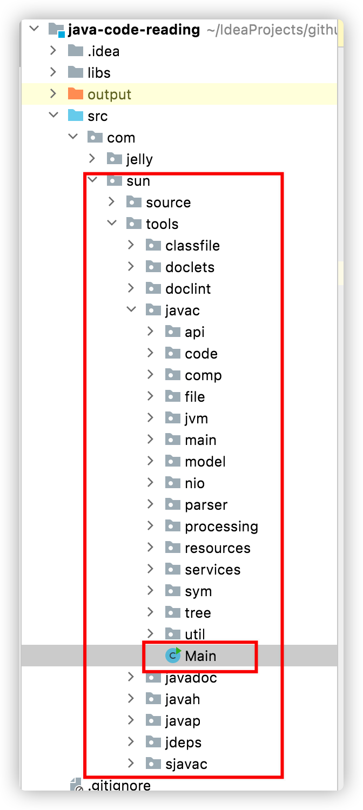

运行这个 main 函数，因为没有加需要编译的源代码路径，不出意外应该会在控制台会输出下面的内容

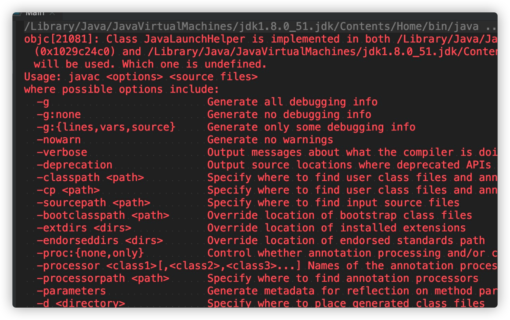

新建一个HelloWorld.java文件，内容随缘，在启动配置的Program arguments里加入 HelloWorld.java 的绝对路径

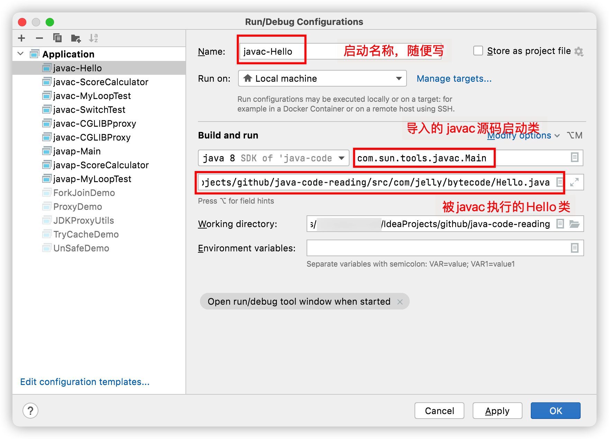

再次运行 Main.java，会在 HelloWorld.java 的同级目录生成 HelloWorld.class 文件。

### 3.调涨源码级别

Intellij 中显示的是反编译 tools.jar 得到的源码，可读性没有源码那么好。

打开 Project Structure 页面(File->Project Structure)， 选中图中 Dependencies 选项卡，把 <Moudle source> 顺序调整到项目 JDK 的上面:

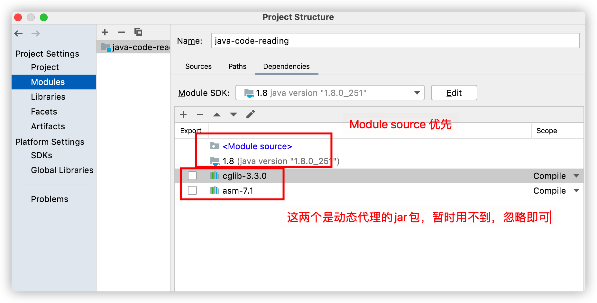

### 3. 加断点

在 Main.java 中打上断点，开始调试。

## Javac 的七个阶段

javac 整个流程分为七个大的阶段:

1. parse: 解析阶段的主要读取.java 源文件做词法分析(LEXER)和语法分析(PARSER) 
2. enter: 生成符号表

3. process:处理注解

4. attr: 检查语义合法性、常量折叠

5. flow: 数据流分析
6. desugar: 去除语法糖 
7. generate: 生成字节码

### 解析(parse)

解析阶段的主要读取 .java 源文件做词法分析(LEXER)和语法分析(PARSER)。

**词法分析**

词法分析可以算是编译器的一项工作，就比如英语句子 "you are handsome" 在我们大脑中会被拆分为 "you" + "are" + "handsome" 一样，词法分析将源代码转换为一个个词法记号(Token)。

javac 中的词法分析由 com.sun.tools.javac.parser.Scanner 实现，以语句 int k = i + j; 为例，引入 Scanner 类的源码做实际的测试:

```java
import com.sun.tools.javac.parser.Scanner;
import com.sun.tools.javac.parser.ScannerFactory; 
import com.sun.tools.javac.util.Context;

public class MyTest {
	public static void main(String[] args) {
    ScannerFactory factory = ScannerFactory.instance(new Context());
		Scanner scanner = factory.newScanner("int k = i + j;", false);
	
		scanner.nextToken(); 
		System.out.println(scanner.token().kind);   // int
		scanner.nextToken(); 		
		System.out.println(scanner.token().name()); // j
		scanner.nextToken(); 		
		System.out.println(scanner.token().kind);   //=
		scanner.nextToken(); 
		System.out.println(scanner.token().name()); // i
		scanner.nextToken(); 
		System.out.println(scanner.token().kind);   //+
		scanner.nextToken(); 		
		System.out.println(scanner.token().name()); // j
		scanner.nextToken(); 
		System.out.println(scanner.token().kind);    //;
  }
}
```

这个过程如下图所示:

图没了……


**语法分析**

紧随词法分析之后的是语法分析。语法分析是在词法分析的基础上，生成抽象语法树(AST)，语句 int k = i + j; 对应的 AST 如下:

图没了……


生成 AST 的作用是方便计算机进行进一步的处理，比如通过遍历可以得到结点的值。

### 生成符号表(enter)

enter 阶段的主要作用是填充符号表(symbol table)。符号表是由标识符与标识符相关信息构成的记录表，标识符相关的信息包括它们的类型、作用域等。在处理变量、方法定义时，会讲它们的信息存储 到符号表中，方便后续用的时候进行快速的查询。

比如下面的 Java 代码:

```java
public class HelloWorld { // 定义类 HelloWorld
	intx=5;       // 定义 int 型字段 x，初始化值为 5
	char y = 'A'; // 定义 char 型字段 y，初始化值为 'A'

	// 定义 add 方法，返回类型为 long，参数个数为 2，类型都为 long 
  public long add(long a, long b) {
		return a + b; 
  }
}
```

在 javac 中，使用 Symbol 类来表示符号，每个符号都包含名称、类别和类型这三个关键属性:

- name:符号名，比如上面代码中的 "x"，"y"，"add" 都是符号名
- kind:符号类型，上面代码代码中 x 的符号类型是 Kinds.VAR 表示这是一个变量符号，add 的符号类型是 Kinds.MTH，表示这个是一个方法符号 
- type:符号类型，上面代码中 x 的符号类型是 int，y 的符号类型为 char，add 方法的符号类型为 null，对于 Java 这种静态类型的语义来说，在编译期就会确定了变量的类型

Javac 中 Symbol 类是一个抽象类，常见的实现类如下图:

图没了……


接下来我们来介绍作用域(Scope)，由 com.sun.tools.javac.code.Scope 类表示。作用域是指类、变量、方法等的有效范围。以下面的代码为例:

```java
public void foo() {
	intx=0;//x 在 foo 方法作用域内 
  System.out.println(x);
}

public void bar() {
	intx=0;//x 在 bar 方法作用域内 
  System.out.println(x);
}
```

foo 和 bar 函数都定义了一个名为 "x" 的 int 类型的变量，这两个变量能独立使用不会互相影响，在超出各自的方法体作用域以后就对外不可见了，外部也访问不到。 作用域也可以进行嵌套:

```java
public class MyClass {
	int x = 0;
  public void foo() {
    int i = 0; // foo 方法作用域
    {
        int y = 0; // 第一层嵌套作用域
        {
            int z = 0; // 第二层嵌套作用域
        }
    }
    int j = 0; // foo 方法作用域    
	} 
}
```

如下图所示:

图没了……


接下来很关键的一步是符号表的查找，符号表查找的方式是先在当前作用域下查找，如果找到就直接返回，如果在当前作用域没有找到，那么它会向上在外层的作用域继续查找，直到找到或者到达顶层 作用域为止。

Enter 阶段除了上述生成符号表，还会在类文件中没有默认构造方法的情况下，添加 <init> 构造方法 

### 处理注解(process)

process 用来做注解的处理，这个步骤是 com.sun.tools.javac.processing.JavacProcessingEnvironment 类完成，从 JDK6 开始 javac 支持在编译阶段允许用户自定义处理注解，大名鼎鼎的 lombok 框架就是利用 了这个特性来通过注解进行了预处理生成目标 class 文件，比在运行时用反射来处理性能明显提升。

### 检查合法性(Attr)

Attr 主要由 com.sun.tools.javac.comp.Attr 类实现，这个阶段会做语义合法性检查和进行逻辑判断等: 

1. 会检查是否有冲突的类定义，同一个类中是否存在相同签名的方法， 
2. 检查访问权限是否符合语义，比如 private 方法的访问是否是在方法所在类中访问等。
3. 方法重载的情况下解析出最符合(Most Specific)的方法，比如下面的例子

```java
public static void method(Object obj){ }

public static void method(String obj){ }
```

调用 method(null); 会最终调用第二个方法，这个过程在编译期间就已经确定，方法的选择是在 Resolve 类的 mostSpecific 方法中完成。

4. 折叠常量:常量字符串相加，常量整数运算等，比如下面的代码:

```java
public void foo() { 
  int x = 1 + 2;
	String y = "hel" + "lo";
	int z = 100 / 2; 
}

// 在 Attr 阶段后会合并为下面这样:

public void foo() { 
  int x = 3;
	String y = "hello";
	int z = 50; 
}
```

### 数据流分析(flow)

flow 阶段是数据流分析阶段，主要由 com.sun.tools.javac.comp.Flow 类实现，下面列举几个常见的场景: 

1. 检查非 void 方法是否所有的退出分支都有返回值

```java
public boolean foo(int x) { 
  if (x == 0) {
		return true;
	}
	// 注释掉这个 return 
  // return false;
}

编译报错:
error: missing return statement 
```

2. 检查受检异常(checked exception)是否被被捕获或者显式抛出

```java
public void foo() {
	throw new FileNotFoundException();
}

编译报错:
error: unreported exception FileNotFoundException; must be caught or declared to be thrown throw new FileNotFoundException();
```

3. 局部变量使用前未初始化

Java 中的成员变量在为赋值的情况下会赋值为默认值，但是局部变量不会，在使用前必须先赋值，比如下面的代码:

```java
public void foo() { 
  int x;
	int y = x + 1;
	System.out.println(y); 
}

编译报错:
error: variable x might not have been initialized int y = x + 1;
```

4. 检查 final 变量是否有重复赋值，保证 final 的语义

```java
public void foo(final int x) { 
  x = 2;
	System.out.println(x); 
}

编译报错:
error: final parameter x may not be assigned x = 2;
```

5. 是否有语句不可达，比如在 return 之后的语句 

```java
public int foo() {
  System.out.println("Hello"); 
  return 1; 
  System.out.println("World");
}

编译报错:
error: unreachable statement System.out.println("World");
```

这个逻辑判断是在 Flow.java 的 AliveAnalyzer 中完成的，在碰到 return 以后，会回调 markDead 方法，把 alive 变量设置为 false，表示后面的代码块将不可达

```java
void markDead(JCTree tree) { 
  alive = false;
}
```

继续往下处理第二个 println 时，回调 AliveAnalyzer 的 scanStat 方法，这里会判定当前语句是否已经不可达，如果不可达输出错误日志

```java
void scanStat(JCTree tree) {
	// 如果已经不可达，tree 代表第二次 println 语句，不为 null 
  if (!alive && tree != null) {
		// 打印 "error: unreachable statement" 
    log.error(tree.pos(), "unreachable.stmt"); 
    if (!tree.hasTag(SKIP)) alive = true;
	}
	scan(tree); 
}
```

### 去除语法糖(desugar)

Java 中的语法糖没有 Kotlin 和 Scala 那么花里胡哨，每次随着新版本的发布也是有非常多的语法糖在不停的加入进来。比如下面这些都算是语法糖:

- 泛型
- 内部类
- try-with-resources
- foreach 语句 
- 原始类型和对象之间的隐式转换 
- 字符串和枚举的 switch-case 实现 
- 后缀和前缀运算符(i++ 和 ++i) 
- 变长参数

desugar 的过程就是解除语法糖，主要由 com.sun.tools.javac.comp.TransTypes 类和com.sun.tools.javac.comp.Lower 类中完成。TransTypes 类用来擦除泛型和插入相应的类型转换代码，Lower 类用来处理除泛 型以外其它的语法糖。以下面的代码为例，

```java
public void foo() {
	List<Long> idList = new ArrayList<>(); 
  idList.add(1L);
	long firstId = idList.get(0);
}
```

对应的字节码如下:

```shell
// 执行 new ArrayList<>() 
0: new 						#2 // class java/util/ArrayList
3: dup
4: invokespecial  #3 // Method java/util/ArrayList."<init>":()V
7: astore_1
8: aload_1
// 把原始类型 1 自动装箱为 Long 类型 
9: lconst_1
10: invokestatic  #4 // Method java/lang/Long.valueOf:(J)Ljava/lang/Long;
// 执行 add 调用
13: invokeinterface #5, 2 // InterfaceMethod java/util/List.add:(Ljava/lang/Object;)Z
18: pop
19: aload_1
// 执行 get(0) 调用
20: iconst_0
21: invokeinterface  #6, 2 // InterfaceMethod java/util/List.get:(I)Ljava/lang/Object;
// 检查 Object 对象是否是 Long 类型 
26: checkcast				 #7    // class java/lang/Long
// 自动拆箱为原始类型
29: invokevirtual 	 #8    // Method java/lang/Long.longValue:()J
32: lstore_2
33: return
```

把上面的代码转换为相应的 Java 代码应该是:

```java
public void foo() {
	List idList = new ArrayList();
	// 原始类型自动装箱
	idList.add(Long.valueOf(1L));
	// 插入强制类型转换，保持泛型语义，自动拆箱转为原始类型 
  long firstId = ((Long) idList.get(0)).longValue();
}
```

接了下来我们来看枚举类的 switch-case 是如何实现的。

```java
Color color = Color.BLUE; 
switch (color) {
	case RED: 
    System.out.println("red"); 
    break;
	case BLUE: 
    System.out.println("blue"); 
    break;
	default: 
    System.out.println("default"); 
    break;
}
```

会转为如下的实现形式:

```java
class Outer$0 {
	synthetic static final int[] $SwitchMap$Color = new int[Color.values().length];
	
  static { 
    try {
			$SwitchMap$Color[Color.RED.ordinal()] = 1; 
    } catch (NoSuchFieldError ex) {
		}
		try {
			$SwitchMap$Color[Color.BLUE.ordinal()] = 2; 
    } catch (NoSuchFieldError ex) {
		}
  } 
}

public void bar(Color color) {
	switch (Outer$0.$SwitchMap$Color[color.ordinal()]) {
		case 1: 
      System.out.println("red"); 
      break;
		case 2: 
      System.out.println("blue"); 
      break;
		default: 
      System.out.println("default"); 
      break;
	} 
}
```

javac 为枚举的每一个 switch 都会生成了一个中间类，这个类包含了一个称之为 "SwitchMap" 的数组，SwitchMap 数组做了 case 值中枚举 ordinal 和一个递增整数序列的映射。

为什么不在直接用 ordinal 值来做 case 值呢?一个理由可能的理由是为了更好性能，case 值中的 ordinal 不一定是连续的，通过 SwitchMap 数组可以把不连续的 ordinal 值转为连续的 case 值，编译成更高效的 tableswitch 指令。

### 生成字节码(generate)

generate 阶段主要作用是生成最终的 Class文件，由 com.sun.tools.javac.jvm.Gen 类完成。 下面我列举几个常见的场景:

初始化块代码收集到 <init> 和 <clinit> 中 比如下面的代码:

```java
public class MyInit { 
	{
		System.out.println("hello"); 
  }
  public int a = 100; 
}
```

编译器会生成如下的 <init> 方法:

```java
public int a;
public String b; 
public void <init>() {
  // 调用父类 Object 的 <init>() 方法
  super.<init>();
  System.out.println("hello");
  a = 100;
	b = "hello"; 
}
```

javac 会在 generate 阶段将类非静态初始化代码块统一整理到 <init> 方法中，并先调用父类的实例构造器方法。 static 修饰的静态初始化的逻辑一样，会将静态初始化块和静态变量初始化放到 <clinit> 方法中。

把字符串相加"+" 转换为 String 转为 StringBuilder.append

比如下面的字符串 x 和 y 相加代码:

```java
public void foo(String x, String y) { 
  String ret = x + y; 
  System.out.println(ret);
}
```

在 generate 阶段会被转换为:

```java
public void foo(String x, String y) {
	String ret = new StringBuilder().append(s).append(s2).toString(); 		
  System.out.println(ret);
}
```

switch-case 实现中 tableswitch 和 lookupswitch 指令的选择

前面的几章介绍过，switch-case 根据 case 值的稀疏程度会选择对应的 tableswitch 或者 lookupswitch 指令来实现。这个过程也是在generate 阶段来做的，具体的代码在 Gen.java 的 visitSwitch 方法中，核心

的代码逻辑如下:

那“稀疏”与否是如何确定的呢?比如下面代码:

```java
public static void foo() { 
  int a = 0;
	switch (a) { 
    case 0:
			System.out.println("#0");
			break; 
    case 1:
			System.out.println("#1");
			break; 
    default:
			System.out.println("default");
			break;
  }
}
```

对应的字节码如下:

```shell
public static void foo(); 
	0: iconst_0
	1: istore_0
	2: iload_0
	3: lookupswitch { // 2 
					0: 28
					1: 39 
		default: 50
}
```

可以看到实际上是采用了 lookupswitch 而不是 tableswitch 来实现，难道 case 值 0 和 1 还不够紧凑吗? 经过调试 javac 的源码，lookupswitch 和 tableswitch 指令的选择的逻辑在这里:

```shell
com/sun/tools/javac/jvm/Gen.java

long table_space_cost = 4 + ((long) hi - lo + 1); // words 
long table_time_cost = 3; // comparisons
long lookup_space_cost = 3 + 2 * (long) nlabels;
long lookup_time_cost = nlabels;
int opcode = nlabels > 0 &&
	table_space_cost + 3 * table_time_cost <= lookup_space_cost + 3 * lookup_time_cost ?
	tableswitch : lookupswitch;
```

在上面的例子中，nlables 等于 case 值的个数，等于 2，hi 表示 case 值的最大值 1，lo 表示 case 值的最小值 0，因此可以计算出:

```shell
// table_space_cost 表示 tableswitch 空间代价 table_space_cost = 4 + (1 - 0 + 1) = 6
// table_time_cost 表示 tableswitch 时间代价，恒等于 3 table_time_cost = 3
// lookup_space_cost 表示 lookupswitch 的空间代价 lookup_space_cost = 3 + 2 * 2 = 7
// lookup_time_cost 表示 lookupswitch 的时间代价 lookup_time_cost = 2
```

tableswitch 和 lookupswitch 的总代价计算公式

代价 = 空间代价 +3* 时间代价

因此在 case 值为 0、1 时，tableswitch 的代价为 6 + 3 * 3 = 15，lookupswitch 代价为 7 + 3 * 2 = 13，lookupswitch 的代价更小，javac 选择了 lookupswitch 作为 switch-case 的实现指令。 如果 case 值变多为 0、1、2 时，nlables 等于 3，hi 等于 2，lo 等于 0，因此可以计算出:

```shell
table_space_cost = 7
table_time_cost = 3
lookup_space_cost = 3 + 2 * 3 = 9
lookup_time_cost = 3
table_space_cost + 3 * table_time_cost = 7 + 3 * 3 = 16 
lookup_space_cost + 3 * lookup_time_cost = 9 + 3 * 3 = 18
```

这个时候 table_space_cost 的代价更小，选择 tableswitch 作为 switch-case 的实现指令。

回到开始的问题，为什么 case 值为 0、1 时选择 lookupswitch 作为生成的指令。在数量极少的情况下，lookupswitch 和 tableswitch 的差别不大，只是 javac 的代价计算算法最终导致选择了 lookupswitch。

## 小结

到这里 javac 的内容就介绍完了，javac 的源码非常复杂，里面有大量编译原理的实现细节，这个小节只是解开了里面的冰山一角，更多的细节可以通过文章开头的源码调试来做更深入的理解。

# 18. Java Instrumentation 包


## Java Instrumentation 概述

Java Instrumentation 这个技术看起来非常神秘，很少有书会详细介绍。但是有很多工具是基于 Instrumentation 来实现的:

- APM 产品: pinpoint、skywalking、newrelic、听云的 APM 产品等都基于 Instrumentation 实现 
- 热部署工具:Intellij idea 的 HotSwap、Jrebel 等
- Java 诊断工具:Arthas、Btrace 等

由于对字节码修改功能的巨大需求，JDK 从 JDK5 版本开始引入了java.lang.instrument 包。它可以通过 addTransformer 方法设置一个 ClassFileTransformer，可以在这个 ClassFileTransformer 实现类的转 换。

JDK 1.5 支持静态 Instrumentation，基本的思路是在 JVM 启动的时候添加一个代理(javaagent)，每个代理是一个 jar 包，其 MANIFEST.MF 文件里指定了代理类，这个代理类包含一个 premain 方法。 JVM 在类加载时候会先执行代理类的 premain 方法，再执行 Java 程序本身的 main 方法，这就是 premain 名字的来源。在 premain 方法中可以对加载前的 class 文件进行修改。这种机制可以认为是虚拟机 级别的 AOP，无需对原有应用做任何修改，就可以实现类的动态修改和增强。

从 JDK 1.6 开始支持更加强大的动态 Instrument，在JVM 启动后通过 Attach API 远程加载，后面会详细介绍。

这个章节会分为 javaagent 和动态 Attach 两个部分来介绍

## Java Instrumentation 核心方法

Instrumentation 是 java.lang.instrument 包下的一个接又，这个接又的方法提供了注册类文件转换器、获取所有已加载的类等功能，允许我们在对已加载和未加载的类进行修改，实现 AOP、性能监控等 功能。

常用的方法如下:

```java
/**
 * 为 Instrumentation 注册一个类文件转换器，可以修改读取、修改类文件字节码
 */
void addTransformer(ClassFileTransformer transformer, boolean canRetransform);

/**
 * 对JVM已经加载的类重新触发类加载 
 */
void retransformClasses(Class<?>... classes) throws UnmodifiableClassException;

/**
 * 获取当前 JVM 加载的所有类对象 
 */
Class[] getAllLoadedClasses()
```

它的 addTransformer 给 Instrumentation 注册一个 transformer，transformer 是 ClassFileTransformer 是一个接又的实例，这个接又就只有一个 transform 方法，调用 addTransformer 设置 transformer 以后，后续 所有 JVM 加载类之前都会被这个 transform 方法拦截，这个方法接收原类文件的字节数组，返回转换过的字节数组，在这个方法中可以做任意的类文件改写。

下面是一个空的 ClassFileTransformer 的实现

```java
public class MyClassTransformer implements ClassFileTransformer { 
    @Override
    public byte[] transform(ClassLoader loader, String className, Class<?> classBeingRedefined, ProtectionDomain protectionDomain, byte[] classBytes) 
      throws IllegalClassFormatException { 
        // 在这里读取、转换类文件
        return classBytes;
    } 
}
```

## Javaagent 介绍

Javaagent 是一个特殊的 jar 包，它并不能单独启动的，而不是必须依附于一个 JVM 进程，可以看作是 JVM 的一个寄生插件，使用 Instrumentation 的 API 用来读取和改写当前 JVM 的类文件。 

### Agent 的两种使用方式

它有两种使用方式:

- 在 JVM 启动的时候加载，通过 javaagent 启动参数 java -javaagent:myagent.jar MyMain，这种方式在程序 main 方法执行之前执行 agent 中的 premain 方法 
- 在 JVM 启动后 Attach，通过 Attach API 进行加载，这种方式会在 agent 加载以后执行 agentmain 方法

premain 和 agentmain 方法签名如下:

```java
public static void premain(String agentArgument, Instrumentation instrumentation) throws Exception 

public static void agentmain(String agentArgument, Instrumentation instrumentation) throws Exception
```

这两个方法都有两个参数

- 第一个 agentArgument 是 agent 的启动参数，可以在 JVM 启动命令行中设置，比如java -javaagent:<jarfile>=appId:agent-demo,agentType:singleJar test.jar的情况下 agentArgument 的值为 "appId:agent-demo,agentType:singleJar"。

- 第二个 instrumentation 是 java.lang.instrument.Instrumentation 的实例，可以通过 addTransformer 方法设置一个 ClassFileTransformer。 第一种 premain 方式的加载时序如下:

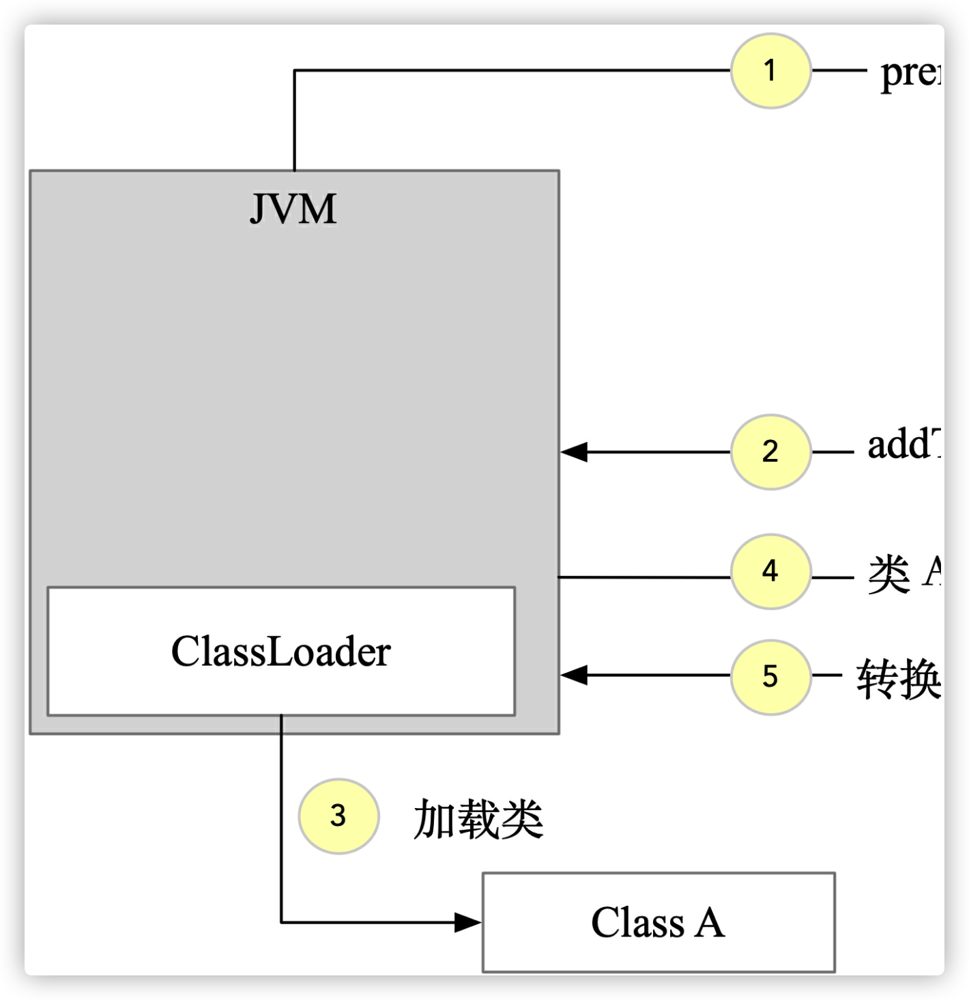

### Agent 打包

为了能够以 javaagent 的方式运行 premain 和 agentmain 方法，我们需要将其打包成 jar 包，并在其中的 MANIFEST.MF 配置文件中，指定 Premain-class 等信息，一个典型的生成好的 MANIFEST.MF 内容 如下

```xml
Premain-Class: me.geek01.javaagent.AgentMain 
Agent-Class: me.geek01.javaagent.AgentMain 
Can-Redefine-Classes: true 
Can-Retransform-Classes: true

# 下面是一个可以帮助生成上面 MANIFEST.MF 的 maven 配置

<build> 
  <finalName>my-javaagent</finalName> 
  <plugins>
		<plugin> 
      <groupId>org.apache.maven.plugins</groupId> 
      <artifactId>maven-jar-plugin</artifactId> 
      <configuration>
				<archive> 
          <manifestEntries>
						<Agent-Class>me.geek01.javaagent.AgentMain</Agent-Class> 
            <Premain-Class>me.geek01.javaagent.AgentMain</Premain-Class> 
            <Can-Redefine-Classes>true</Can-Redefine-Classes> 
            <Can-Retransform-Classes>true</Can-Retransform-Classes>
					</manifestEntries> 
        </archive>
			</configuration> 
    </plugin>
	</plugins> 
</build>
```

### Agent 使用方式一: JVM 启动参数

下面使用 javaagent 实现简单的函数调用栈跟踪，以下面的代码为例:

```java
public class MyTest {
	public static void main(String[] args) {
		new MyTest().foo(); 
  }

	public void foo() { 
    bar1();
		bar2(); 
  }
	public void bar1() { }
	public void bar2() { } 
}
```

通过 javaagent 启动参数的方式在每个函数进入和结束时都打印一行日志，实现调用过程的追踪的效果。代码见:https://github.com/arthur-zhang/jvm-bytecode-book-example/tree/master/my-trace-agent 核心的方法 instrument 的逻辑如下:

```java
public static class MyMethodVisitor extends AdviceAdapter {
	@Override
	protected void onMethodEnter() {
		// 在方法开始处插入 <<<enter xxx
		mv.visitFieldInsn(GETSTATIC, "java/lang/System", "out", "Ljava/io/PrintStream;"); 		mv.visitLdcInsn("<<<enter " + this.getName());
		mv.visitMethodInsn(INVOKEVIRTUAL, "java/io/PrintStream", "println", "(Ljava/lang/String;)V", false); 
    super.onMethodEnter();
	}

	@Override
	protected void onMethodExit(int opcode) {
		super.onMethodExit(opcode);
		// 在方法结束处插入 <<<exit xxx
		mv.visitFieldInsn(GETSTATIC, "java/lang/System", "out", "Ljava/io/PrintStream;"); 		mv.visitLdcInsn(">>>exit " + this.getName());
		mv.visitMethodInsn(INVOKEVIRTUAL, "java/io/PrintStream", "println", "(Ljava/lang/String;)V", false);
 	} 
}
```

把 agent 打包生成 my-trace-agent.jar，添加 agent 启动 MyTest 类 

> java -javaagent:/path_to/my-trace-agent.jar MyTest 

可以看到输出结果如下:

```
<<<enter main 
<<<enter foo 
<<<enter bar1 
>>>exit bar1 
<<<enter bar2 
>>>exit bar2 
>>>exit foo 
>>>exit main
```

通过上面的方式，我们在不修改 MyTest 类源码的情况下实现了调用链跟踪的效果。更加健壮和完善的调用链跟踪实现会在后面的 APM 章节详细介绍。 

### Agent 使用方式二: Attach API 使用

在 JDK5 中，开发者只能 JVM 启动时指定一个 javaagent 在 premain 中操作字节码，Instrumentation 也仅限于 main 函数执行前，这样的方式存在一定的局限性。从 JDK6 开始引入了动态 Attach Agent 的方 案，除了在命令行中指定 javaagent，现在可以通过 Attach API 远程加载。我们常用的 jstack、arthas 等工具都是通过 Attach 机制实现的。

这个小节会结合跨进程通信中的信号和 Unix 域套接字来看 JVM Attach API 的实现原理，

#### JVM Attach API 基本使用

下面以一个实际的例子来演示动态 Attach API 的使用，代码中有一个 main 方法，每个 3s 输出 foo 方法的返回值 100，接下来动态 Attach 上 MyTestMain 进程，修改 foo 的字节码，让 foo 方法返回 50。

```java
public class MyTestMain {
	public static void main(String[] args) throws InterruptedException {
		while (true) { 
      System.out.println(foo()); 
      TimeUnit.SECONDS.sleep(3);
		} 
  }
	public static int foo() { 
    return 100; // 修改后 return 50;
  }
}
```

步骤如下:

1. 编写 Attach Agent，对 foo 方法做注入，完整的代码见:https://github.com/arthur-zhang/jvm-attach-code/tree/master/my-attach-demo

动态 Attach 的 agent 与通过 JVM 启动 javaagent 参数指定的 agent jar 包的方式有所不同，动态 Attach 的 agent 会执行 agentmain 方法，而不是 premain 方法。

```java
public class AgentMain {
	public static void agentmain(String agentArgs, Instrumentation inst) 
    throws ClassNotFoundException, UnmodifiableClassException {

		System.out.println("agentmain called"); 
    inst.addTransformer(new MyClassFileTransformer(), true); 
    Class classes[] = inst.getAllLoadedClasses();
		for (int i = 0; i < classes.length; i++) {
			if (classes[i].getName().equals("MyTestMain")) { 
        System.out.println("Reloading: " + classes[i].getName()); 	
        inst.retransformClasses(classes[i]);
				break;
      } 
    }
  }
}
```

2. 因为是跨进程通信，Attach 的发起端是一个独立的 java 程序，这个 java 程序会调用 VirtualMachine.attach 方法开始和目标 JVM 进行跨进程通信。

```java
public class MyAttachMain {
	public static void main(String[] args) throws Exception {
		VirtualMachine vm = VirtualMachine.attach(args[0]); 
    try {
			vm.loadAgent("/path/to/agent.jar"); 
    } finally {
			vm.detach(); 
    }
}
```

使用 jps 查询到 MyTestMain 的进程 id，

> java -cp /path/to/your/tools.jar:. MyAttachMain pid

可以看到 MyTestMain 的输出的 foo 方法已经返回了 50。

```shell
java -cp . MyTestMain

100
100
100
agentmain called 
Reloading: MyTestMain 
50
50 
50
```

#### JVM Attach API 的底层原理

JVM Attach API 的实现主要基于信号和 Unix 域套接字，接下来详细介绍这两部分的内容。

##### 信号是什么

信号是某事件发生时对进程的通知机制，也被称为“软件中断”。信号可以看做是一种非常轻量级的进程间通信，信号由一个进程发送给另外一个进程，只不过是经由内核作为一个中间人发出，信号最初 的目的是用来指定杀死进程的不同方式。

每个信号都一个名字，以 "SIG" 开头，最熟知的信号应该是 SIGINT，我们在终端执行某个应用程序的过程中按下 Ctrl+C 一般会终止正在执行的进程，正是因为按下 Ctrl+C 会发送 SIGINT 信号给目标程 序。

每个信号都有一个唯一的数字标识，从 1 开始，下面是常见的信号量列表:

| 信号名  | 编号 | 描述                                                         |
| ------- | ---- | ------------------------------------------------------------ |
| SIGINT  | 2    | 键盘中断信号(Ctrl+C)                                         |
| SIGQUIT | 3    | 键盘退出信号(Ctrl+/)                                         |
| SIGKILL | 9    | “必杀”(sure kill) 信号，应用程序无法忽略或者捕获，总会被杀死 |
| SIGTERM | 15   | 终止信号                                                     |

在 Linux 中，一个前台进程可以使用 Ctrl+C 进行终止，对于后台进程需要使用 kill 加进程号的方式来终止，kill 命令是通过发送信号给目标进程来实现终止进程的功能。默认情况下，kill 命令发送的是编 号为 15 的 SIGTERM 信号，这个信号可以被进程捕获，选择忽略或正常退出。目标进程如何没有自定义处理这个信号，就会被终止。对于那些忽略 SIGTERM 信号的进程，则需要编号为 9 的 SIGKILL 信号 强行杀死进程，SIGKILL 信号不能被忽略也不能被捕获和自定义处理。

下面写了一段 C 代码，自定义处理了 SIGQUIT、SIGINT、SIGTERM 信号

signal.c

```c
static void signal_handler(int signal_no) { 
  if (signal_no == SIGQUIT) {
		printf("quit signal receive: %d\n", signal_no); 
  } else if (signal_no == SIGTERM) {
		printf("term signal receive: %d\n", signal_no); 
  } else if (signal_no == SIGINT) {
		printf("interrupt signal receive: %d\n", signal_no); 
  }
}

int main() {
	signal(SIGQUIT, signal_handler); 
  signal(SIGINT, signal_handler); 
  signal(SIGTERM, signal_handler); 
  for (int i = 0;; i++) {
    printf("%d\n", i);
    sleep(3); 
  }
}
```

编译运行上面的 signal.c 文件

```shell
gcc signal.c -o signal
./signal
```

这种情况下，在终端中Ctrl+C，kill -3，kill -15都没有办法杀掉这个进程，只能用kill -9

```shell
0
^Cinterrupt signal receive: 2  // Ctrl+C
1
2
term signal receive: 15				 // kill pid
3
4
5
quit signal receive: 3         // kill -3
6
7
8
[1] 46831 killed      ./signal // kill -9 成功杀死进程
```

JVM 对 SIGQUIT 的默认行为是打印所有运行线程的堆栈信息，在类 Unix 系统中，可以通过使用命令 kill -3 pid 来发送 SIGQUIT 信号。运行上面的 MyTestMain，使用 jps 找到整个 JVM 的进程 id，执行

`kill -3 pid`，在终端就可以看到打印了所有的线程的调用栈信息:

```shell
Full thread dump Java HotSpot(TM) 64-Bit Server VM (25.51-b03 mixed mode):
"Service Thread" #8 daemon prio=9 os_prio=31 tid=0x00007fe060821000 nid=0x4403 runnable [0x0000000000000000] java.lang.Thread.State: RUNNABLE
...
"Signal Dispatcher" #4 daemon prio=9 os_prio=31 tid=0x00007fe061008800 nid=0x3403 waiting on condition [0x0000000000000000]
java.lang.Thread.State: RUNNABLE
"main" #1 prio=5 os_prio=31 tid=0x00007fe060003800 nid=0x1003 waiting on condition [0x000070000d203000]
java.lang.Thread.State: TIMED_WAITING (sleeping)
at java.lang.Thread.sleep(Native Method)
at java.lang.Thread.sleep(Thread.java:340)
at java.util.concurrent.TimeUnit.sleep(TimeUnit.java:386) at MyTestMain.main(MyTestMain.java:10)
```

##### Unix 域套接字 (Unix Domain Socket)

使用 TCP 和 UDP 进行 socket 通信是一种广为人知的 socket 使用方式，除了这种方式还有一种称为 Unix 域套接字的方式，可以实现同一主机上的进程间通信。虽然使用 127.0.01 环回地址也可以通过网络 实现同一主机的进程间通信，但 Unix 域套接字更可靠、效率更高。Docker 守护进程(Docker daemon)使用了 Unix 域套接字，容器中的进程可以通过它与Docker 守护进程进行通信。MySQL 同样提供了域套接字进行访问的方式。

**Unix** **域套接字是什么?**

Unix 域套接字是一个文件，通过 ls 命令可以看到

```shell
ls -l
srwxrwxr-x. 1 ya ya 0 9月 8 00:26 tmp.sock
```

两个进程通过读写这个文件就实现了进程间的信息传递。文件的拥有者和权限决定了谁可以读写这个套接字。


**与普通套接字的区别是什么****?**

- Unix 域套接字更加高效，Unix 套接字不用进行协议处理，不需要计算序列号，也不需要发送确认报文，只需要复制数据即可 
- Unix 域套接字是可靠的，不会丢失报文，普通套接字是为不可靠通信设计的
- Unix 域套接字的代码可以非常简单的修改转为普通套接字


**域套接字代码示例**

下面是一个简单的 C 实现的域套接字的例子

server.c 充当 Unix 域套接字服务器，启动后会在当前目录生成一个名为 tmp.sock 的 Unix 域套接字文件，它读取客户端写入的内容并输出

server.c

```c
#include <stdio.h>
#include <sys/socket.h>
#include <string.h>
#include <sys/un.h>
#include <unistd.h>
#include <stdlib.h>

int main() {
    int fd = socket(AF_UNIX, SOCK_STREAM, 0);
    if (fd == -1) {
        return -1;
    }
    struct sockaddr_un addr;
    memset(&addr, 0, sizeof(addr));
    addr.sun_family = AF_UNIX;
    strcpy(addr.sun_path, "tmp.sock");
    int ret = bind(fd, (struct sockaddr *) &addr, sizeof(addr));
    if (ret == -1) {
        perror("bind error");
        exit(-1);
    }
    if (listen(fd, 5) == -1) {
        perror("listen error");
        exit(-1);
    }

    int accept_fd;
    char buf[100];

    while (1) {
        if ((accept_fd = accept(fd, NULL, NULL)) == -1) {
            perror("accept error");
            continue;
        }

        while ((ret = read(accept_fd, buf, sizeof(buf))) > 0) {
            // 输出客户端传过来的数据
            printf("receive %u bytes: %s\n", ret, buf);
        }
        if (ret == -1) {
            perror("read");
            exit(-1);
        } else if (ret == 0) {
            printf("EOF\n");
            close(accept_fd);
        }
    }
}
```

客户端代码如下：

client.c

```c
#include <stdio.h>
#include <sys/socket.h>
#include <string.h>
#include <sys/un.h>
#include <unistd.h>
#include <stdlib.h>

int main()
{
    int fd = socket(AF_UNIX, SOCK_STREAM, 0);
    if (fd == -1)
    {
        return -1;
    }
    struct sockaddr_un addr;
    memset(&addr, 0, sizeof(addr));
    addr.sun_family = AF_UNIX;
    strcpy(addr.sun_path, "tmp.sock");
    if (connect(fd, (struct sockaddr *)&addr, sizeof(addr)) == -1)
    {
        perror("connect error");
        exit(-1);
    }
    int rc;
    char buf[100];
    // 读取终端标准输入的内容，写入到 Unix 域套接字文件中
    while ((rc = read(STDIN_FILENO, buf, sizeof(buf))) > 0)
    {
        if (write(fd, buf, rc) < 0)
        {
            perror("write error");
            exit(-1);
        }
    }
}
```

在命令行中进行编译和执行

```shell
gcc server.c -o server 
gcc client.c -o client
```

启动两个终端，一个启动 server 端，一个启动 client 端 

```shell
./server
./client
```

可以看到当前目录生成了一个 "tmp.sock" 文件

```shell
ls -l
srwxrwxr-x. 1 ya ya 0 9月 8 00:08 tmp.sock
```

在 client 输入 hello，在 server 的终端就可以看到 

```shell
./server
receive 6 bytes: hello
```


#### JVM Attach 过程分析

执行 MyAttachMain，当指定一个不存在的 JVM 进程时，会出现如下的错误

```shell
java -cp /path/to/your/tools.jar:. MyAttachMain 1234
Exception in thread "main" java.io.IOException: No such process
	at sun.tools.attach.LinuxVirtualMachine.sendQuitTo(Native Method)
	at sun.tools.attach.LinuxVirtualMachine.<init>(LinuxVirtualMachine.java:91)
	at sun.tools.attach.LinuxAttachProvider.attachVirtualMachine(LinuxAttachProvider.java:63) 	at com.sun.tools.attach.VirtualMachine.attach(VirtualMachine.java:208)
	at MyAttachMain.main(MyAttachMain.java:8)
```

可以看到 VirtualMachine.attach 最终调用了 sendQuitTo 方法，这是一个 native 的方法，底层就是发送了 SIGQUIT 号给目标 JVM 进程。

前面信号部分我们介绍过，JVM 对 SIGQUIT 的默认行为是 dump 当前的线程堆栈，那为什么调用 VirtualMachine.attach 没有输出调用栈堆栈呢?

对于 Attach 的发起方，假设目标进程为 12345，这部分的详细的过程如下:

1. Attach 端检查临时文件目录是否有 .java_pid12345 文件

这个文件是一个 UNIX 域套接字文件，由 Attach 成功以后的目标 JVM 进程生成。如果这个文件存在，说明正在 Attach 中，可以用这个 socket 进行下一步的通信。如果这个文件不存在则创建一个 .attach_pid12345 文件，这部分的伪代码如下:

```java
String tmpdir = "/tmp";
File socketFile = new File(tmpdir, ".java_pid" + pid); 
if (socketFile.exists()) {
	File attachFile = new File(tmpdir, ".attach_pid" + pid);
	createAttachFile(attachFile.getPath()); 
}
```

2. Attach 端检查如果没有 .java_pid12345 文件，创建完 .attach_pid12345 文件以后发送 SIGQUIT 信号给目标 JVM。然后每隔 200ms 检查一次 socket 文件是否已经生成，5s 以后还没有生成则退出，如果有生成则进行 socket 通信
3. 对于目标 JVM 进程而言，它的 Signal Dispatcher 线程收到 SIGQUIT 信号以后，会检查 .attach_pid12345 文件是否存在。 
   1. 目标 JVM 如果发现 .attach_pid12345 不存在，则认为这不是一个 attach 操作，执行默认行为，输出当前所有线程的堆栈
   2. 目标 JVM 如果发现 .attach_pid12345 存在，则认为这是一个 attach 操作，会启动 Attach Listener 线程，负责处理 Attach 请求，同时创建名为 .java_pid12345 的 socket 文件，监听 socket。 

源码中 `/hotspot/src/share/vm/runtime/os.cpp` 这一部分处理的逻辑如下:

```c
#define SIGBREAK SIGQUIT
static void signal_thread_entry(JavaThread* thread, TRAPS) { 
  while (true) {
    int sig;
		{
			switch (sig) {
        case SIGBREAK: {
				// Check if the signal is a trigger to start the Attach Listener - in that 
        // case don't print stack traces.
				if (!DisableAttachMechanism && AttachListener::is_init_trigger()) {
					continue; 
        }
				...
				// Print stack traces 
        }
}
```

AttachListener 的 is_init_trigger 在 .attach_pid12345 文件存在的情况下会新建 .java_pid12345 套接字文件，同时监听此套接字，准备 Attach 端发送数据。 

那 Attach 端和目标进程用 socket 传递了什么信息呢?可以通过 strace 的方式看到 Attach 端究竟往 socket 里面写了什么:

```shell
sudo strace -f java -cp /usr/local/jdk/lib/tools.jar:. MyAttachMain 12345 2> strace.out

...
5841 [pid 3869] socket(AF_LOCAL, SOCK_STREAM, 0) = 5
5842 [pid 3869] connect(5, {sa_family=AF_LOCAL, sun_path="/tmp/.java_pid12345"}, 110) = 0
5843 [pid 3869] write(5, "1", 1)            = 1
5844 [pid 3869] write(5, "\0", 1)           = 1
5845 [pid 3869] write(5, "load", 4)         = 4
5846 [pid 3869] write(5, "\0", 1)           = 1
5847 [pid 3869] write(5, "instrument", 10)  = 10
5848 [pid 3869] write(5, "\0", 1)           = 1
5849 [pid 3869] write(5, "false", 5)        = 5
5850 [pid 3869] write(5, "\0", 1)           = 1
5855 [pid 3869] write(5, "/home/ya/agent.jar"..., 18 <unfinished ...>
```

可以看到往 socket 写入的内容如下:

```shell
1
\0
load
\0
instrument
\0
false
\0 /home/ya/agent.jar 
\0
```

数据之间用 \0 字符分隔，第一行的 1 表示协议版本，接下来是发送指令 "load instrument false /home/ya/agent.jar" 给目标 JVM，目标 JVM 收到这些数据以后就可以加载相应的 agent jar 包进行字节 码的改写。

如果从 socket 的角度来看，VirtualMachine.attach 方法相当于三次握手建连，VirtualMachine.loadAgent 则是握手成功之后发送数据，VirtualMachine.detach 相当于四次挥手断开连接。 

## 小结

这个章节讲解了 javaagent，一起来回顾一下要点:

- 第一，javaagent 是一个使用 instrumentation 的 API 用来改写类文件的 jar 包，可以看作是 JVM 的一个寄生插件。
- 第二，javaagent 有两个重要的入口类: Premain-Class 和 Agent-Class，分别对应入口函数 premain 和 agentmain，其中 agentmain 可以采用远程 attach API 的方式远程挂载另一个 JVM 进程。
- 第三，介绍了 javaagent 的 maven 打包如何配置。


---


# 19. ASM

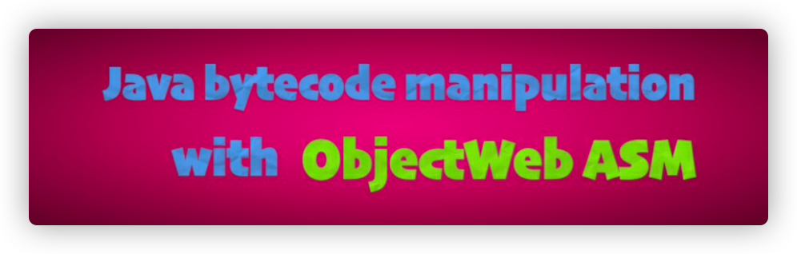

码规范的前提下进行字节码改造。如果你写过 class 文件的解析程序，就会发现这个过程极其繁琐，更别说进行增加方法等操作了。

## 0x01 什么是 ASM

ASM 是一个 Java 字节码操控框架。它能被用来动态生成类或者增强既有类的功能。ASM 可以直接产生二进制 class 文件，也可以在类被加载入 Java 虚拟机之前动态改变类行为。 它有以下优点

- 架构设计精巧，使用方便。
- 更新速度快，支持最新的 Java 版本
- 速度非常快，在动态代理 class 的生成和 class 的转换时，尽可能确保运行中的应用不会被 ASM 拖慢 
- 非常可靠、久经考验，已经有很多著名的开源框架都在使用，例如 cglib,、mybatis、fastjson

## 0x02 ASM 核心类介绍

ASM 库是设计模式中访问者模式的典型应用，三大核心类 ClassReader、ClassVisitor、ClassWriter 介绍如下

ClassReader

它是字节码读取和分析引擎，帮我们做了最苦最累的解析二进制的 class 文件字节码的活。采用类似于 SAX 的事件读取机制，每当有事件发生时，触发相应的 ClassVisitor、MethodVisitor 等做相应的处

理。

ClassVisitor

它是一个抽象类，ClassReader 对象创建之后，调用 ClassReader.accept() 方法，传入一个 ClassVisitor 对象。ClassVisitor 在解析字节码的过程中遇到不同的节点时会调用不同的 visit() 方法，比如 visitSource, visitOuterClass, visitAnnotation, visitAttribute, visitInnerClass, visitField, visitMethod 和 visitEnd方法。 在上述 visit 的过程中还会产生一些子过程，比如 visitAnnotation 会触发 AnnotationVisitor 的调 用、visitMethod 会触发 MethodVisitor 的调用。 正是在这些 visit 的过程中，我们得以有机会去修改各个子节点的字节码。 整个过程时序图如下:

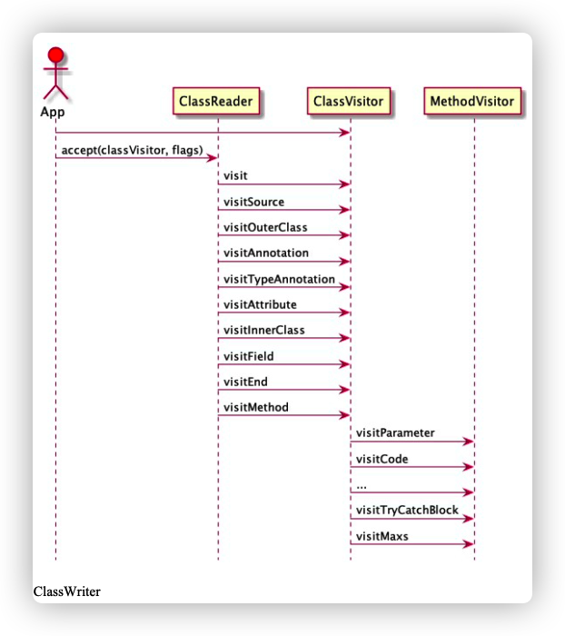

这个类是 ClassVisitor 抽象类的一个实现类，其之前的每个 ClassVisitor 都可能对原始的字节码做修改，ClassWriter 的 toByteArray 方法则把最终修改的字节码以 byte 数组的形式返回 这三个核心类的关系如下图

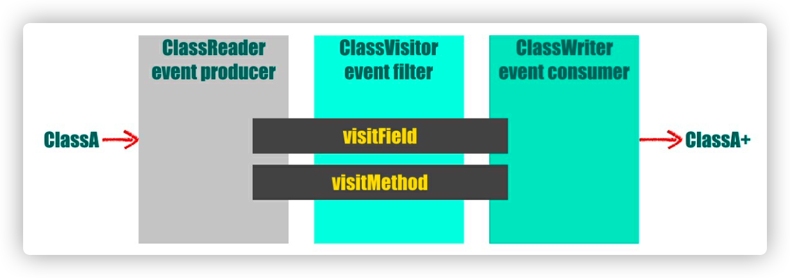

## 0x03 用 ASM 实现简单的调用链跟踪

同样，我们来看一个最简单的 demo，读取一个 class 文件，并对指定的方法进行注入，在方法执行前和执行后分别加一句打印 原始的 main 函数如下，step1() 和 step2() 函数是我们要注入的函数

```java
public class Test01 {
	public static void main(String[] args) {
		System.out.println("in test01 main");
		new Test01().process(); }
		public void process() {
			// 注入打印 "Call step1"，也即 System.out.println("Call " + methodName); 
      step1();
			// 注入打印 "Return step1",也即 System.out.println("Return " + methodName);

			// 注入打印 "Call step2" 
      step2();
			// 注入打印 "Return step2"
	}

	public void step1() { 
    System.out.println("in step1");
	}
	public void step2() { 
    System.out.println("in step2");
	} 
}

// 执行 javac 把源文件编译成 class 文件 
javac Test01
```

下面这段代码是把上面的Test01类文件改写并存储到一个新的文件中

```java
FileInputStream in = new FileInputStream("/path/to/Test01.class"); 
ClassReader cr = new ClassReader(in);
ClassWriter cw = new ClassWriter(cr, ClassWriter.COMPUTE_FRAMES); 
ClassVisitor cv = new TraceClassVisitor(cw);

cr.accept(cv, ClassReader.SKIP_FRAMES | ClassReader.SKIP_DEBUG);
byte[] bytes = cw.toByteArray();
// 把改写以后的类文件字节数组写入到新的文件中
FileUtils.writeByteArrayToFile(new File("/new/path/to/Test01.class"), bytes, false);
```

核心的改写类是TraceClassVisitor。我们只需要覆盖 visitMethod ，这个方法的返回值是一个MethodVisitor,这个对象会被用来处理方法体，可以插入额外的指令来完成我们打印调用链的功能。 我们来看 一下核心的注入行System.out.println("Call step1");对应的字节码是什么

```shell
0: getstatic  	 #2 // Field java/lang/System.out:Ljava/io/PrintStream;
3: ldc 					 #3 // String Call step1
5: invokevirtual #4 // Method java/io/PrintStream.println:(Ljava/lang/String;)V 
8: return
```

翻译成 ASM 的代码就是

```shell
mv.visitFieldInsn(Opcodes.GETSTATIC, "java/lang/System", "out", "Ljava/io/PrintStream;"); 
mv.visitLdcInsn("Call " + name);
mv.visitMethodInsn(Opcodes.INVOKEVIRTUAL, "java/io/PrintStream", "println", "(Ljava/lang/String;)V", false);
```

当然这个过程，Intellij 有插件[ASM Bytecode Outline]( https://plugins.jetbrains.com/plugin/5918-asm-bytecode-outline) 可以直接生成，不用自己去手写。

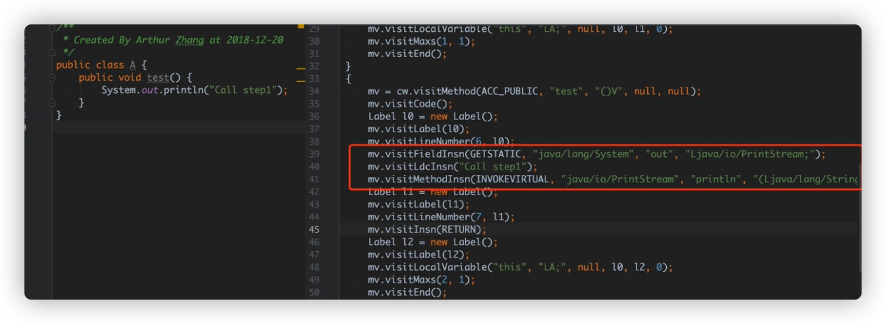

完整的 TraceClassVisitor 代码如下

```java
public class TraceClassVisitor extends ClassVisitor { 
  public TraceClassVisitor(ClassVisitor cv) {
		super(ASM5, cv); }
		@Override
		public MethodVisitor visitMethod(int access, String name, String desc, String signature, String[] exceptions) {

		MethodVisitor mv = super.visitMethod(access, name, desc, signature, exceptions); 			return new TraceMethodVisitor(mv);
	}

	public static class TraceMethodVisitor extends MethodVisitor {
		public TraceMethodVisitor(MethodVisitor mv) { 
    	super(ASM5, mv);
		}

		@Override
		public void visitMethodInsn(int opcode, String owner, String name, String desc, boolean itf) {
			if (!name.startsWith("step")) { 
        mv.visitMethodInsn(opcode, owner, name, desc, itf); 
        return;
			}
			// 增加 System.out.println("Call " + name);
			mv.visitFieldInsn(Opcodes.GETSTATIC, "java/lang/System", "out", "Ljava/io/PrintStream;"); 
      mv.visitLdcInsn("Call " + name);
			mv.visitMethodInsn(Opcodes.INVOKEVIRTUAL, "java/io/PrintStream", "println", "(Ljava/lang/String;)V", false);

			// 调用原始的 call
			mv.visitMethodInsn(opcode, owner, name, desc, itf);
			// 增加 System.out.println("Return " + name);
			mv.visitFieldInsn(Opcodes.GETSTATIC, "java/lang/System", "out", "Ljava/io/PrintStream;"); mv.visitLdcInsn("Return " + name);
			mv.visitMethodInsn(Opcodes.INVOKEVIRTUAL, "java/io/PrintStream", "println", "(Ljava/lang/String;)V", false);
    } 
  }
}
```

执行一下 main 函数，生成改写的 Test01.class，然后执行

```shell
in test01 main 
Call step1
in step1 
Return step1 
Call step2
in step2 
Return step2
```

生成的 class 文件用反编译工具(jd-gui)如下

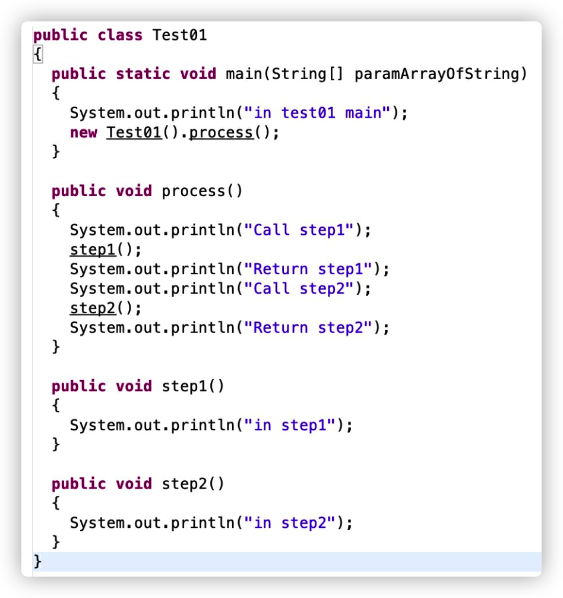

## 0x04 小结

这篇文章我们主要讲解了 ASM 字节码操作框架，一起来回顾一下要点:

- 第一，ASM 是一个久经考验的工业级字节码操作框架。
- 第二，ASM 的三个核心类 ClassReader、ClassVisitor、ClassWriter。ClassReader 对象创建之后，调用 ClassReader.accept() 方法，传入一个 ClassVisitor 对象。ClassVisitor 在解析字节码的过程中遇到 不同的节点时会调用不同的 visit() 方法。ClassWriter 负责把最终修改的字节码以 byte 数组的形式返回
- 第三，介绍完原理，用 ASM 实现了一个简单的调用链跟踪。

## 0x05 思考

给你留一道作业题:除了文中介绍的 ASM 的字节码应用，你知道还有哪些库或者框架使用了 ASM 吗?ASM 在其中承担的作用是什么?


---


# 20. CGLIB


## 0x01 cglib 的简单应用

如果说 ASM 是字节码改写事实上的标准，那么可以说 cglib 则是动态代理事实上的标准。 cglib 是一个强大的、高性能的代码生成库，被大量框架使用

Spring:为基于代理的 AOP 框架提供方法拦截 MyBatis:用来生成 Mapper 接又的动态代理实现类 Hibernate:用来生成持久化相关的类 Guice、EasyMock、jMock 等

在实现内部，cglib 库使用了 ASM 字节码操作框架来转化字节码，产生新类，帮助开发者屏蔽了很多字节码相关的内部细节，不用再去关心类文件格式、指令集等

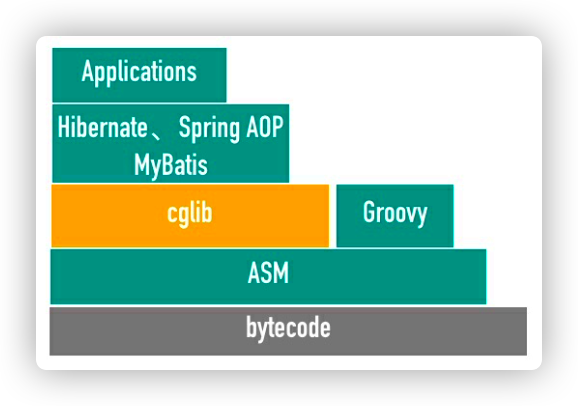

有这样一个 Person 类，想在 doJob 调用前和调用后分别记录一些日志

```java
public class Person {
	public void doJob(String jobName) {
		System.out.println("who is this class: " + getClass());
		System.out.println("doing job: " + jobName); }
}
```

我们可以使用 JDK 动态代理来实现，不过介于 JDK 动态代理有个明显的缺点(需要目标对象实现一个或多个接又)，在这里重点介绍 cglib 的实现方案。

一个典型的实现方案是实现一个 net.sf.cglib.proxy.MethodInterceptor 接又，用来拦截方法调用。这个接又只有一个方法:public Object intercept(Object obj, java.lang.reflect.Method method,

Object[] args, MethodProxy proxy) throws Throwable;

这个方法的第一个参数 obj 是代理对象，第二个参数 method 是拦截的方法，第三个参数是方法的参数，第四个参数 proxy 用来调用父类的方法。MethodInterceptor 作为一个桥梁连接了目标对象和代理对 象

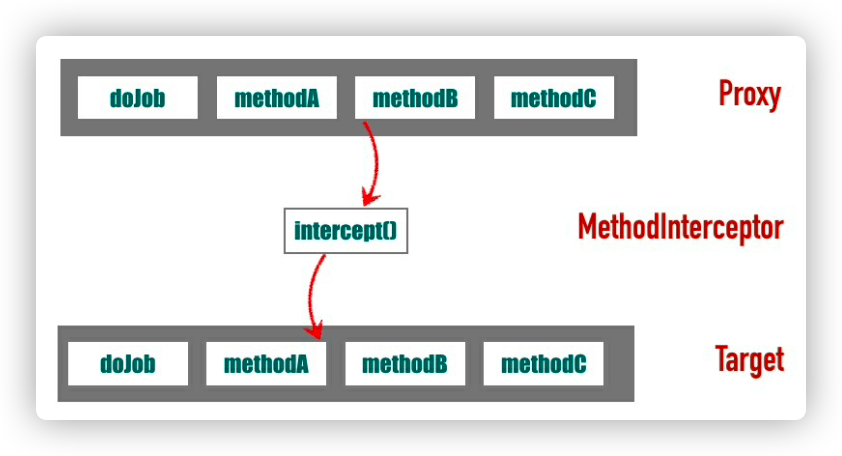

cglib 代理的核心是net.sf.cglib.proxy.Enhancer类，它用于创建一个 cglib 代理。这个类有一个静态方法public static Object create(Class type, Callback callback)，该方法的第一个参数 type 指明要代理的对象类型，第二个参数 callback 是要拦截的具体实现，一般都会传入一个 MethodInterceptor 的实现

```java
public static void main(String[] _args) {
	MethodInterceptor interceptor = new MethodInterceptor() {
		@Override
		public Object intercept(Object obj, Method method, Object[] args, MethodProxy methodProxy) throws Throwable {
		
      System.out.println(">>>>>before intercept"); 
      Object o = methodProxy.invokeSuper(obj, args); 
      System.out.println(">>>>>end intercept"); 
      return o;
    } 
  };
	Person person = (Person) Enhancer.create(Person.class, interceptor);
	person.doJob("coding"); 
}
```

运行上面的代码输出:

```java
>>>>>before intercept
who is this class: class Person$$EnhancerByCGLIB$$a1da8fe5 
doing job: coding
>>>>>end intercept
```

可以用设置系统变量让 cglib 输出生成的文件

```java
System.setProperty(DebuggingClassWriter.DEBUG_LOCATION_PROPERTY, "/path/to/cglib-debug-location");
```

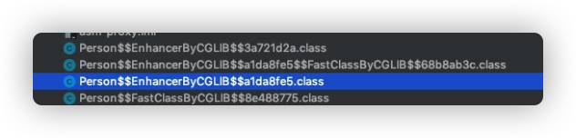

核心类是 `Person$$EnhancerByCGLIB$$a1da8fe5.class`，这个类的反编译以后的代码如下

```java
public class Person$$EnhancerByCGLIB$$a1da8fe5 extends Person implements Factory { 
	public final void doJob(String jobName) {
		MethodInterceptor methodInterceptor = this.CGLIB$CALLBACK_0;
		methodInterceptor.intercept(this, CGLIB$doJob$0$Method, new Object[]{jobName}, CGLIB$doJob$0$Proxy); 
  }
}
```

可以看到 cglib 生成了一个 Person 的子类，实现了 doJob 方法，此方法会调用 MethodInterceptor 的 intercept 函数，这个函数先输出 ">>>>>before intercept" 然后调用父类(也即真正的 Person 类)的 doJob 的方法，最后输出 ">>>>>end intercept"

## 0x02 fastjson

fastjson 是目前 java 语言中最快的 json 库，比自称最快的 jackson 速度要快。fastjson 库内置 ASM，基于 objectweb asm 3.3 改造，只保留必要的部分不到 2000 行代码，通过 ASM 自动生成序列号、反序列 化字节码，减少反射开销，理论上可以提高 20% 的性能。 如果不用反射，一个 json 反序列化要怎么样来做呢?下面写了一个最简单粗暴的例子，来反序列化下面的 json 字符串

```json
{
	"id": "A10001",
	"name": "Arthur.Zhang", 
  "score": 100
}
```

对应 Java bean

```java
public static class MyBean { 
  public String id;
	public String name; 
  public Integer score;
}
```

假定不考虑嵌套，特殊字符的情况，不做语法解析的情况下，可以这么来写

```java
public static void main(String[] args) {
	String json = "{ \"id\": \"A10001\", \"name\": \"Arthur.Zhang\", \"score\": 100 }"; 	// 去掉头尾的 {}
	String str = json.substring(1, json.length() - 1);
	// 用 "," 分割字符串
	String[] fieldStrArray = str.split(",");
	MyBean bean = new MyBean();
	
  for (String item : fieldStrArray) {
		// 分隔 key value
    String[] parts = item.split(":");
    String key = parts[0].replaceAll("\"", "").trim(); 
    String value = parts[1].replaceAll("\"", "").trim(); 
    // 通过反射获取字段对应的 field
    Field field = MyBean.class.getDeclaredField(key);
		// 根据字段类型通过反射设置字段的值
    if (field.getType() == String.class) {
			field.set(bean, value);
		} else if (field.getType() == Integer.class) {
			field.set(bean, Integer.valueOf(value)); 
    }
	}
	System.out.println(bean); 
}
```

可以看到获取获取字段 field、设置字段值都需要通过反射的方式。那么 fastjson 是怎么解决反射低效的问题的呢? 通过调试的方式，把 fastjson 生成的字节码写入到文件中。针对 MyBean，fastjson 使用 ASM 为它生成了一个反序列化的类，里面硬编码了处理序列化需要用到的所有可能场景，不再需要任何反射相关的代码。结合创新的 sort field fast match 算法，速度更上一层楼。下面是通过阅读字节码 精简以后的 Java 代码。

```java
public class FastjsonASMDeserializer_1_MyBean extends JavaBeanDeserializer { 
  public char[] id_asm_prefix__ = "\"id\":".toCharArray();
	public char[] name_asm_prefix__ = "\"name\":".toCharArray();
	public char[] score_asm_prefix__ = "\"score\":".toCharArray();

	@Override
	public Object deserialze(DefaultJSONParser parser, Type type, Object fieldName, int features) {

		JSONLexerBase lexer = (JSONLexerBase) parser.lexer; 
    MyTest.MyBean localMyBean = new MyTest.MyBean();
		String id = lexer.scanFieldString(this.id_asm_prefix__); 
    if (lexer.matchStat > 0) {
			localMyBean.id = id; 
    }
		String name = lexer.scanFieldString(this.name_asm_prefix__); 
    if (lexer.matchStat > 0) {
			localMyBean.name = name; 
    }
		Integer score = lexer.scanFieldInt(this.score_asm_prefix__); 
    if (lexer.matchStat > 0) {
			localMyBean.score = score; 
    }
		return localMyBean; 
  }


```

通过上面的两个例子，我们可以看到 ASM 字节码技术在底层库上的强大。可能每天写业务代码不会需要使用这些底层的优化，但是当我们想造一个轮子，想读懂开源代码背后的核心时，都不得不深入 的去学习了解这部分知识，很难，但很值得。

## 0x03 小结

这篇文章我们主要讲解了 ASM 字节码改写技术在 cglib 和 fastjson 上的应用，一起来回顾一下要点:

- 第一，cglib 使用 ASM 生成了目标代理类的一个子类，在子类中扩展父类方法，达到代理的功能，因此要求代理的类不能是 final 的。 
- 第二，fastjson 使用 ASM 生成了实例 Bean 反序列化类，彻底去掉了反射的开销，使性能更上一层楼。

## 0x04 思考

给你留一道作业题:大名鼎鼎的 MyBatis 也用到了 ASM，它用 ASM 实现了什么功能呢? 欢迎你在留言区留言，和我一起讨论。


---


# 21. CRACK


# 22. APM


