00 学好 Netty，是你修炼 Java 内功的必经之路
=============================

你好，我是若地。我曾担任美团点评技术专家，是一名高性能组件发烧友，平时专注于基础架构中间件的研发工作，积累了丰富的分布式架构设计和调优经验。

我们知道网络层是架构设计中至关重要的环节，但 Java 的网络编程框架有很多（比如 Java NIO、Mina、Grizzy），为什么我这里只推荐 Netty 呢？

因为 Netty 是目前最流行的一款高性能 Java 网络编程框架，它被广泛使用在中间件、直播、社交、游戏等领域。目前，许多知名的开源软件也都将 Netty 用作网络通信的底层框架，如 Dubbo、RocketMQ、Elasticsearch、HBase 等。

## 为什么要学习 Netty？

讲到这里，你可能要问了：如果我的工作中涉及网络编程的内容并不多，那我是否还有必要花精力学习 Netty 呢？

其实在互联网大厂（阿里、腾讯、美团等）的中高级 Java 开发面试中，经常会问到涉及 Netty 核心技术原理的问题，比如：

1.  Netty 的高性能表现在哪些方面？对你平时的项目开发有何启发？
2.  Netty 中有哪些重要组件，它们之间有什么联系？
3.  Netty 的内存池、对象池是如何设计的？
4.  针对 Netty 你有哪些印象比较深刻的系统调优案例？

这些问题看似简单，但如果你对 Netty 掌握不够深入，回答时就很容易“翻车”。我面试过很多求职者，虽然他们都有一定的 Netty 使用经验，但当深入探讨技术细节及如何解决项目中的实际问题时，就会发现大部分人只是简单使用，并没有深入掌握 Netty 的技术原理。**如果你可以学好 Netty，掌握底层原理，一定会成为你求职面试的加分项。**

**而且通过 Netty 的学习，还可以锻炼你的编程思维，对 Java 其他的知识体系起到融会贯通的作用。**

当年我刚踏入工作，领到的第一个任务是数据采集和上报。我尝试了各种解决方案最后都被主管否掉了，他说“不用那么麻烦，直接使用 Netty 就好了”。于是我一边学习一边完成工作，工作之余还会挤出时间研究 Netty 源码。

回想起研究源码的那段日子，虽然很辛苦，但仿佛为我**打开了一扇 Java 新世界的大门**，当我理解领悟 Netty 的设计原理之后，对 I/O 模型 、内存管理、线程模型、数据结构等当时理解起来有一定难度的知识，仿佛一瞬间“顿悟”了。而且在我日后再去学习 RocketMQ、Nginx、Redis 等优秀框架时，也明显感觉更加便捷、高效了。

因此，如果你想提升自己的技术水平并找到一份满意的工作，学习掌握 Netty 就非常重要。事实上，在平时的开发工作中，**Netty 的易用性和可靠性也极大程度上降低了开发者的心智负担。**

我在学生时代，写过不少网络应用，现在看来，非常冗长。当我熟练掌握 Netty 后，一切问题迎刃而解。Netty 对 Java NIO 进行了高级封装，简化了网络应用的开发过程，我们不再需要花费大量精力关注 Selector、SocketChannel、ServerSocketChannel 等繁杂的 API。

当我自己写网络应用时，拆包/粘包、数据编解码、TCP 断线重连等一系列问题都需要考虑到，而现在 Netty 给我们提供了现成的解决方案。此外遇到问题还可以在社区讨论，Netty 的迭代周期短修复问题快，其可靠性和健壮性被越来越多的公司所认可和采纳。

不客气地说，**正是因为有 Netty 的存在，网络编程领域 Java 才得以与 C++ 并肩而立**。

由以上几点出发，我想和你一起学习 Netty，希望在工作和求职的过程中能够为你提供帮助，也可以为你打开学习思路。

## 学习目标与困难

那么我们该如何学习 Netty 技术呢？作为初学者，你一定会有很多疑问或遇到一些问题：

*   缺乏网络相关的基础知识，学习 Netty 往往理解不深刻，始终不得其法；
*   Netty 知识点非常多，网上资源比较零散，社区文档对初学者也不够友好，如何系统化学习 Netty；
*   看了这么多 Netty 的基础理论，落到项目开发中却依然毫无头绪；
*   Netty 源码过于复杂，学习无从下手，抓不住重点，最终半途而废；
*   工作中缺少实践，仅仅学习理论知识很容易就忘记了。

在学习的过程中我也遇到了同样的问题，但幸运的是美团的工作经历让我有了很多实践和解决问题的机会。在这期间，我在系统设计方面不断有新的认知。

这里我想分享一些我的学习经验，供你一同学习。学习方法不但适合 Netty，也适合其他技术。希望通过这些经验，可以一同进步。

*   首先，兴趣是最好的老师，工作之余我一定会分配出至少 10% 的时间去思考和学习新的知识，像 Netty 如此优秀的学习资源当然不能放过。
*   其次，如果你工作中缺乏项目实战，其实也不必过于担心，可以尝试实现一些 MVP 的原型系统，例如 RPC、IM 即时聊天，HTTP 服务器等。不要觉得这是在浪费时间，实践出真知，在学习 Netty 的同时你也会得到很多收获。
*   再次，在学习源码之前，首先要让自己成为一个熟练工，掌握基本理论。事实上，不论是学习什么框架，我会先尝试挑战自己。我在心中问自己：“我会如何设计它的架构？”然后再去学习相关的博客、源码等资源，思考作者的设计为什么与自己完全不一样？两者设计的差别在哪里？
*   最终，反复学习也很重要。有时在汲取新知识的时候会对之前的知识点理解产生新的想法，我会带着疑问去把相关的知识重新学习一遍，打破砂锅问到底，经常收获满满。

## Netty 的学习路径

如果现阶段的你：

1.  具备一定的 Java 基础，需要深入学习一款开源框架提升能力和开拓视野；
2.  希望自己在求职面试中增加闪光点，成为精通 Netty 的硬核程序员；
3.  想系统学习 Netty 服务端开发，并希望通过实战来加深理解；
4.  正在从事网络、分布式服务框架等方向的工作，期望自己成为该领域的专家。

那么这个课程就是为你量身定做的，课程中我会**结合高频的面试题**，从源码出发剖析 Netty 的核心技术原理，同时将这么多年使我受益匪浅的一些**编程思想**和**实战经验**分享给你，帮助你在工作中学以致用，避免踩坑。

在这里我也总结归纳出一份 Netty 核心知识点的思维导图，希望可以帮助你梳理本专栏的整体知识脉络。我会由浅入深地带你建立起完整的 Netty 知识体系，夯实你的 Netty 基础知识、Netty 进阶技能、实战开发经验。


*   **夯实 Netty 基础知识**：第一、二部分介绍 Netty 的全貌，了解 Netty 的发展现状和技术架构，并且逐一讲解了 Netty 的核心组件原理和使用，以及网络通信必不可少的编解码技能，为后面的源码解析和实践环节打下基础。
*   **Netty 进阶技能**：第三部分讲解 Netty 的内存管理，并希望通过对比介绍 Nginx、Redis 两个著名的开源软件，帮你达到举一反三的能力。第四部分结合高频的面试问题，通过多解读剖析 Netty 的核心源码，帮助你快速准确地理解 Netty 高性能的技术原理，对其中的设计思想学以致用。
*   **实战开发经验**：课程最后带你从 0 到 1 打造一个高性能分布式 RPC 框架，并针对 RPC 框架的核心要点，帮助你掌握网络编程的技巧，加深对 Netty 的理解。

除了上述内容，你还可以通过本专栏获得一些额外的福利。

*   万丈高楼平地起，课程会穿插必备的 Linux 网络编程基础知识，助你理解 Netty 时事半功倍。
*   Netty 源码的调试经验和技巧，从源码中我们可以学习到优秀的设计思想和技巧。
*   Netty 在实际的项目实践中踩过哪些坑？最佳实践应该是什么？
*   利用 Netty 如何快速搭建一套高性能的分布式 RPC 框架？我会一步步带你完成这个 MVP 原型。
*   在技术道路上如何升级打怪？告诉你我是如何学习和打造自己的技术体系的。

讲到最后，相信你一定对学习 Netty 满怀激情，那么一起来解锁 Netty 这项技能吧，也欢迎你留言和我一起交流和讨论。希望你能够将 Netty 这门技术融会贯通，让你的开发实践与职业发展走得更加顺利、长远！

01 初识 Netty：为什么 Netty 这么流行？
===========================

你好，我是若地。今天我们将正式开始学习本专栏，一同了解一下 Netty。

众所周知，Java 的生态非常完善，同一类型的需求可能会有几款产品供你选择。那为什么 Java 的网络编程框架大家都会向你推荐 Netty，而不是 Java NIO、Mina、Grizzy 呢？

本节课，我们就一起来看看 Netty 为什么这么流行，它到底解决了什么问题，以及目前它的发展现状，让你对 Netty 有一个全面的认识。

## 为什么选择 Netty？

Netty 是一款用于高效开发网络应用的 NIO 网络框架，它大大简化了网络应用的开发过程。我们所熟知的 TCP 和 UDP 的 Socket 服务器开发，就是一个有关 Netty 简化网络应用开发的典型案例。

既然 Netty 是网络应用框架，那我们永远绕不开以下几个核心关注点：

*   **I/O 模型、线程模型和事件处理机制；**
*   **易用性 API 接口；**
*   **对数据协议、序列化的支持。**

我们之所以会最终选择 Netty，是因为 Netty 围绕这些核心要点可以做到尽善尽美，其健壮性、性能、可扩展性在同领域的框架中都首屈一指。下面我们从以下三个方面一起来看看，Netty 到底有多厉害。

## 高性能，低延迟

经常听到这么一句话：“网络编程只要你使用了 Netty 框架，你的程序性能基本就不会差。”这句话虽然有些绝对，但是也从侧面上反映了人们对 Netty 高性能的肯定。

实现高性能的网络应用框架离不开 I/O 模型问题，在了解 Netty 高性能原理之前我们需要先储备 I/O 模型的基本知识。

I/O 请求可以分为两个阶段，分别为调用阶段和执行阶段。

*   第一个阶段为**I/O 调用阶段**，即用户进程向内核发起系统调用。
*   第二个阶段为**I/O 执行阶段**。此时，内核等待 I/O 请求处理完成返回。该阶段分为两个过程：首先等待数据就绪，并写入内核缓冲区；随后将内核缓冲区数据拷贝至用户态缓冲区。

为了方便大家理解，可以看一下这张图：

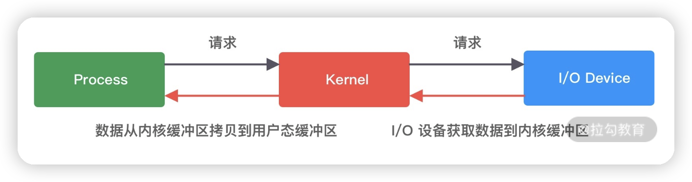

接下来我们来回顾一下 Linux 的 5 种主要 I/O 模式，并看下各种 I/O 模式的优劣势都在哪里？

### 1\. 同步阻塞 I/O（BIO）


如上图所表现的那样，应用进程向内核发起 I/O 请求，发起调用的线程一直等待内核返回结果。一次完整的 I/O 请求称为BIO（Blocking IO，阻塞 I/O），所以 BIO 在实现异步操作时，**只能使用多线程模型**，一个请求对应一个线程。但是，线程的资源是有限且宝贵的，创建过多的线程会增加线程切换的开销。

### 2\. 同步非阻塞 I/O（NIO）

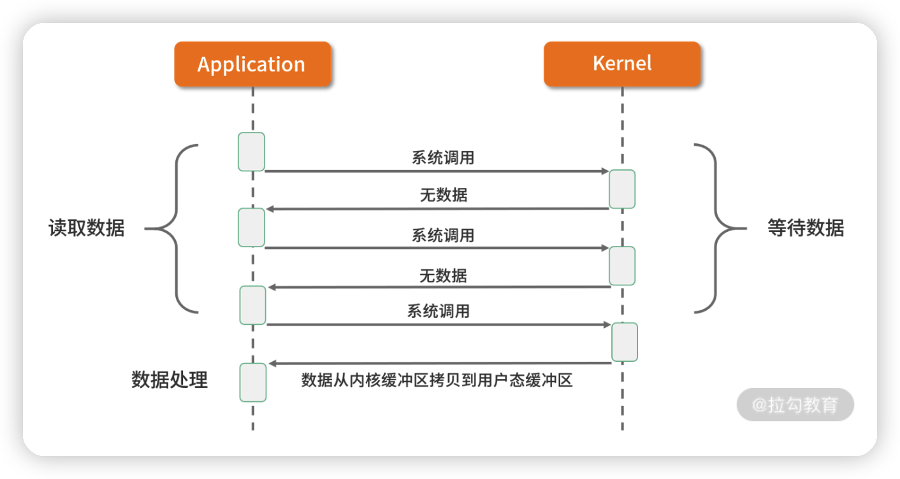

在刚介绍完 BIO 的网络模型之后，NIO 自然就很好理解了。

如上图所示，应用进程向内核发起 I/O 请求后不再会同步等待结果，而是会立即返回，通过轮询的方式获取请求结果。NIO 相比 BIO 虽然大幅提升了性能，但是轮询过程中大量的系统调用导致上下文切换开销很大。所以，**单独使用非阻塞 I/O 时效率并不高**，而且随着并发量的提升，非阻塞 I/O 会存在严重的性能浪费。

### 3\. I/O 多路复用


多路复用实现了**一个线程处理多个 I/O 句柄的操作**。多路指的是多个**数据通道**，复用指的是使用一个或多个固定线程来处理每一个 Socket。select、poll、epoll 都是 I/O 多路复用的具体实现，线程一次 select 调用可以获取内核态中多个数据通道的数据状态。多路复用解决了同步阻塞 I/O 和同步非阻塞 I/O 的问题，是一种非常高效的 I/O 模型。

### 4\. 信号驱动 I/O

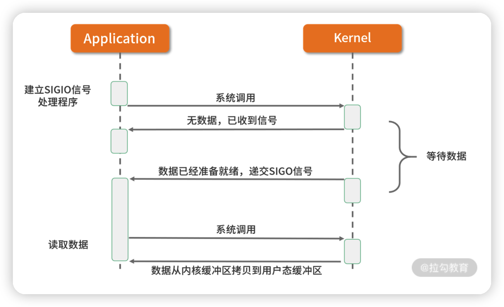

信号驱动 I/O 并不常用，它是一种半异步的 I/O 模型。在使用信号驱动 I/O 时，当数据准备就绪后，内核通过发送一个 SIGIO 信号通知应用进程，应用进程就可以开始读取数据了。

### 5\. 异步 I/O

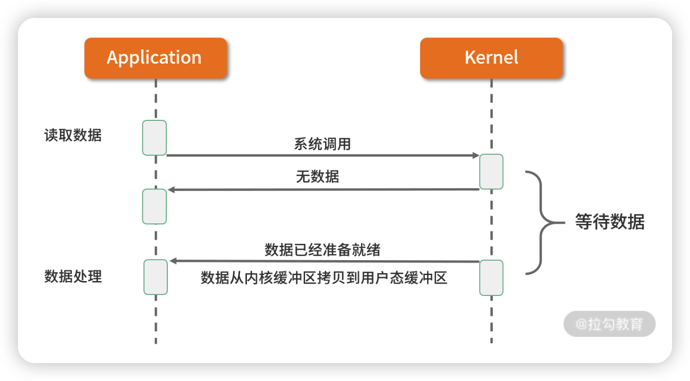

异步 I/O 最重要的一点是从内核缓冲区拷贝数据到用户态缓冲区的过程也是由系统异步完成，应用进程只需要在指定的数组中引用数据即可。**异步 I/O 与信号驱动 I/O 这种半异步模式的主要区别**：信号驱动 I/O 由内核通知何时可以开始一个 I/O 操作，而异步 I/O 由内核通知 I/O 操作何时已经完成。

了解了上述五种 I/O，我们再来看 Netty 如何实现自己的 I/O 模型。Netty 的 I/O 模型是基于非阻塞 I/O 实现的，底层依赖的是 JDK NIO 框架的多路复用器 Selector。一个多路复用器 Selector 可以同时轮询多个 Channel，采用 epoll 模式后，只需要一个线程负责 Selector 的轮询，就可以接入成千上万的客户端。

在 I/O 多路复用的场景下，当有数据处于就绪状态后，需要一个事件分发器（Event Dispather），它负责将读写事件分发给对应的读写事件处理器（Event Handler）。事件分发器有两种设计模式：Reactor 和 Proactor，**Reactor 采用同步 I/O， Proactor 采用异步 I/O**。

Reactor 实现相对简单，适合处理耗时短的场景，对于耗时长的 I/O 操作容易造成阻塞。Proactor 性能更高，但是实现逻辑非常复杂，目前主流的事件驱动模型还是依赖 select 或 epoll 来实现。

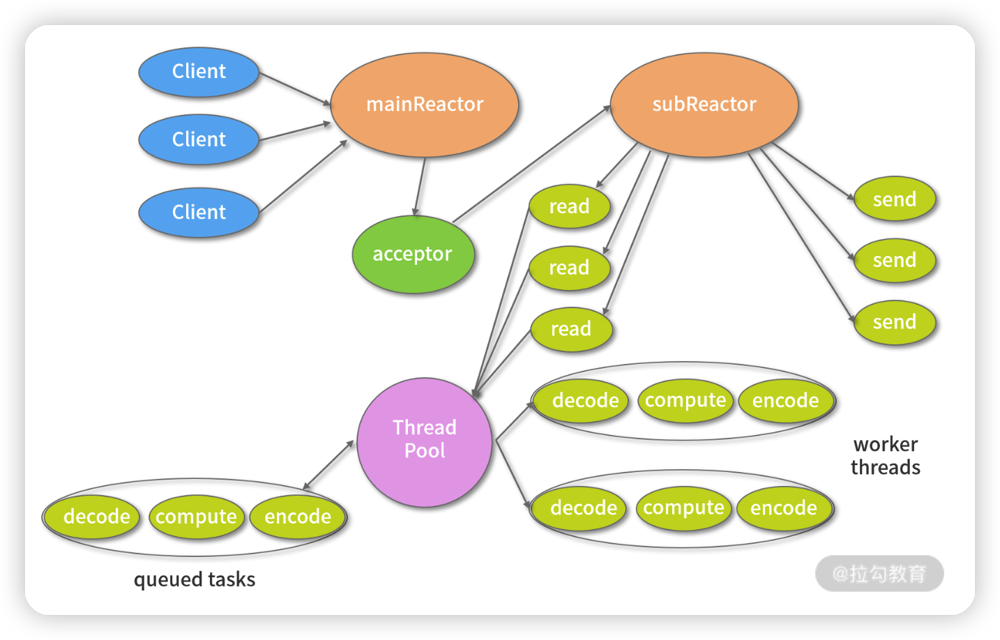

（[摘自 Lea D. Scalable IO in Java](http://gee.cs.oswego.edu/dl/cpjslides/nio.pdf]) ）

上图所描述的便是 Netty 所采用的主从 Reactor 多线程模型，所有的 I/O 事件都注册到一个 I/O 多路复用器上，当有 I/O 事件准备就绪后，I/O 多路复用器会将该 I/O 事件通过事件分发器分发到对应的事件处理器中。该线程模型避免了同步问题以及多线程切换带来的资源开销，真正做到高性能、低延迟。

### 完美弥补 Java NIO 的缺陷

在 JDK 1.4 投入使用之前，只有 BIO 一种模式。开发过程相对简单。新来一个连接就会创建一个新的线程处理。随着请求并发度的提升，BIO 很快遇到了性能瓶颈。JDK 1.4 以后开始引入了 NIO 技术，支持 select 和 poll；JDK 1.5 支持了 epoll；JDK 1.7 发布了 NIO2，支持 AIO 模型。Java 在网络领域取得了长足的进步。

既然 JDK NIO 性能已经非常优秀，为什么还要选择 Netty？这是因为 Netty 做了 JDK 该做的事，但是做得更加完备。我们一起看下 Netty 相比 JDK NIO 有哪些突出的优势。

*   **易用性。** 我们使用 JDK NIO 编程需要了解很多复杂的概念，比如 Channels、Selectors、Sockets、Buffers 等，编码复杂程度令人发指。相反，Netty 在 NIO 基础上进行了更高层次的封装，屏蔽了 NIO 的复杂性；Netty 封装了更加人性化的 API，统一的 API（阻塞/非阻塞） 大大降低了开发者的上手难度；与此同时，Netty 提供了很多开箱即用的工具，例如常用的行解码器、长度域解码器等，而这些在 JDK NIO 中都需要你自己实现。
*   **稳定性。** Netty 更加可靠稳定，修复和完善了 JDK NIO 较多已知问题，例如臭名昭著的 select 空转导致 CPU 消耗 100%，TCP 断线重连，keep-alive 检测等问题。
*   **可扩展性。** Netty 的可扩展性在很多地方都有体现，这里我主要列举其中的两点：一个是可定制化的线程模型，用户可以通过启动的配置参数选择 Reactor 线程模型；另一个是可扩展的事件驱动模型，将框架层和业务层的关注点分离。大部分情况下，开发者只需要关注 ChannelHandler 的业务逻辑实现。

### 更低的资源消耗

作为网络通信框架，需要处理海量的网络数据，那么必然面临有大量的网络对象需要创建和销毁的问题，对于 JVM GC 并不友好。为了降低 JVM 垃圾回收的压力，Netty 主要采用了两种优化手段：

*   **对象池复用技术。** Netty 通过复用对象，避免频繁创建和销毁带来的开销。
*   **零拷贝技术。** 除了操作系统级别的零拷贝技术外，Netty 提供了更多面向用户态的零拷贝技术，例如 Netty 在 I/O 读写时直接使用 DirectBuffer，从而避免了数据在堆内存和堆外内存之间的拷贝。

因为 Netty 不仅做到了高性能、低延迟以及更低的资源消耗，还完美弥补了 Java NIO 的缺陷，所以在网络编程时越来越受到开发者们的青睐。

## 网络框架的选型

很多开发者都使用过 Tomcat，Tomcat 作为一款非常优秀的 Web 服务器看上去已经帮我们解决了类似问题，那么它与 Netty 到底有什么不同？

Netty 和 Tomcat 最大的区别在于对**通信协议**的支持，可以说 Tomcat 是一个 HTTP Server，它主要解决 HTTP 协议层的传输，而 Netty 不仅支持 HTTP 协议，还支持 SSH、TLS/SSL 等多种应用层的协议，而且能够自定义应用层协议。

Tomcat 需要遵循 Servlet 规范，在 Servlet 3.0 之前采用的是同步阻塞模型，Tomcat 6.x 版本之后已经支持 NIO，性能得到较大提升。然而 Netty 与 Tomcat 侧重点不同，所以不需要受到 Servlet 规范的约束，可以最大化发挥 NIO 特性。

如果你仅仅需要一个 HTTP 服务器，那么我推荐你使用 Tomcat。术业有专攻，Tomcat 在这方面的成熟度和稳定性更好。但如果你需要做面向 TCP 的网络应用开发，那么 Netty 才是你最佳的选择。

此外，比较出名的网络框架还有 Mina 和 Grizzly。Mina 是 Apache Directory 服务器底层的 NIO 框架，由于 Mina 和 Netty 都是 Trustin Lee 主导的作品，所以两者在设计理念上基本一致。Netty 出现的时间更晚，可以认为是 Mina 的升级版，解决了 Mina 一些设计上的问题。比如 Netty 提供了可扩展的编解码接口、优化了 ByteBuffer 的分配方式，让用户使用起来更为便捷、安全。Grizzly 出身 Sun 公司，从设计理念上看没有 Netty 优雅，几乎是对 Java NIO 比较初级的封装，目前业界使用的范围也很小。

综上所述，Netty 是我们一个较好的选择。

## Netty 的发展现状

Netty 如此成功离不开社区的精心运营，迭代周期短且文档比较齐全，如果你遇到任何问题通过 issue 或者邮件都可以得到非常及时的答复。

你可以去官方社区学习相关资料，下面这些网站可以帮助你学习。

*   官方社区。
*   [GitHub](https://netty.io/)。截止至 2020 年 7 月，2.4w+ star，一共被 4w+ 的项目所使用。

Netty 官方提供 3.x、4.x 的稳定版本，之前一直处于测试阶段的 5.x 版本已被作者放弃维护。此前，官方从未对外发布过任何 5.x 的稳定版本。我在工作中也会碰到一些业务方在开发新项目时直接使用 Netty 5.x 版本的情况，这是因为不少人信任 Netty 社区，并认为这样可以避免以后升级。可惜这一省事之举随着 5.x 版本废弃后全白费了。不过这也给我们带来了一个经验教训：**尽可能不要在生产环境使用任何非稳定版本的组件。**

如果没有项目历史包袱，目前主流推荐 Netty 4.x 的稳定版本，Netty 3.x 到 4.x 版本发生了较大变化，属于不兼容升级，下面我们初步了解下 4.x 版本有哪些值得你关注的变化和新特性。

*   **项目结构**：模块化程度更高，包名从 org.jboss.netty 更新为 io.netty，不再属于 Jboss。
*   **常用 API**：大多 API 都已经支持流式风格，更多新的 API 参考以下网址：[https://netty.io/news/2013/06/18/4-0-0-CR5.html](https://netty.io/news/2013/06/18/4-0-0-CR5.html)。
*   **Buffer 相关优化**：Buffer 相关功能调整了现在 5 点。
    1.  ChannelBuffer 变更为 ByteBuf，Buffer 相关的工具类可以独立使用。由于人性化的 Buffer API 设计，它已经成为 Java ByteBuffer 的完美替代品。
    2.  Buffer 统一为动态变化，可以更安全地更改 Buffer 的容量。
    3.  增加新的数据类型 CompositeByteBuf，可以用于减少数据拷贝。
    4.  GC 更加友好，增加池化缓存，4.1 版本开始 jemalloc 成为默认内存分配方式。
    5.  内存泄漏检测功能。
*   **通用工具类**：io.netty.util.concurrent 包中提供了较多异步编程的数据结构。
*   **更加严谨的线程模型控制**，降低用户编写 ChannelHandler 的心智，不必过于担心线程安全问题。

可见 Netty 4.x 带来了很多提升，性能、健壮性都变得更加强大了。Netty 精益求精的设计精神值得每个人学习。当然，其中还有更多细节变化，感兴趣的同学可以参考以下网址：[https://netty.io/wiki/new-and-noteworthy-in-4.0.html](https://netty.io/wiki/new-and-noteworthy-in-4.0.html)。如果你现在对这些概念还不是很清晰，也不必担心，专栏后续的内容中我都会具体讲解。

## 谁在使用 Netty？

Netty 凭借其强大的社区影响力，越来越多的公司逐渐采用Netty 作为他们的底层通信框架，下图中我列举了一些正在使用 Netty 的公司，一起感受下它的热度吧。


Netty 经过很多出名产品在线上的大规模验证，其健壮性和稳定性都被业界认可，其中典型的产品有一下几个。

*   服务治理：Apache Dubbo、gRPC。
*   大数据：Hbase、Spark、Flink、Storm。
*   搜索引擎：Elasticsearch。
*   消息队列：RocketMQ、ActiveMQ。

还有更多优秀的产品我就不一一列举了，感兴趣的小伙伴可以参考下面网址：[https://netty.io/wiki/related-projects.html](https://netty.io/wiki/related-projects.html)。

## 总结

作为正式学习专栏前的开胃餐，今天我主要向你介绍了 Netty 的优势与特色，同时提到了 I/O 多路复用、Reactor 设计模式、零拷贝等必备的知识点，帮助你对 Netty 有了基本的认识。相信你一定意犹未尽，在后续的章节中我们将逐步走进 Netty 的世界。

最后，我也想给你留一个思考题：Netty 的内部结构大概如何？为什么 Netty 能够成为如此优秀的工具？下节课我将为你解答这个问题。

# 02 纵览全局：把握 Netty 整体架构脉络

上次课程中我介绍了 Netty 的功能特性和优势，从今天开始我们正式进入 Netty 技术原理的学习。

学习任何一门技术都需要有全局观，在开始上手的时候，不宜陷入琐碎的技术细节，避免走进死胡同。这节课我们以 Netty 整体架构设计为切入点，来带你明确学习目标，建立起 Netty 的学习主线，这条主线将贯穿我们整个的学习过程。

本节课以 Netty 4.1.42 为基准版本，我将分别从 Netty **整体结构**、**逻辑架构**、**源码结构**三个方面对其进行介绍。

## Netty 整体结构

Netty 是一个设计非常用心的**网络基础组件**，Netty 官网给出了有关 Netty 的整体功能模块结构，却没有其他更多的解释。从图中，我们可以清晰地看出 Netty 结构一共分为三个模块：

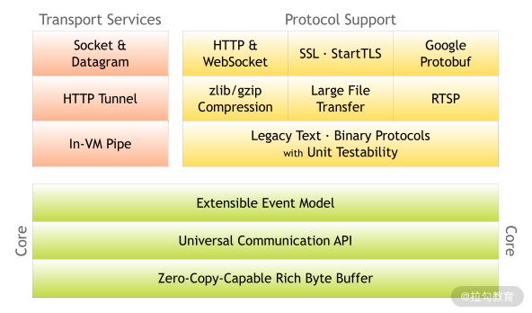

### 1\. Core 核心层

Core 核心层是 Netty 最精华的内容，它提供了底层网络通信的通用抽象和实现，包括可扩展的事件模型、通用的通信 API、支持零拷贝的 ByteBuf 等。

### 2\. Protocol Support 协议支持层

协议支持层基本上覆盖了主流协议的编解码实现，如 HTTP、SSL、Protobuf、压缩、大文件传输、WebSocket、文本、二进制等主流协议，此外 Netty 还支持自定义应用层协议。Netty 丰富的协议支持降低了用户的开发成本，基于 Netty 我们可以快速开发 HTTP、WebSocket 等服务。

### 3\. Transport Service 传输服务层

传输服务层提供了网络传输能力的定义和实现方法。它支持 Socket、HTTP 隧道、虚拟机管道等传输方式。Netty 对 TCP、UDP 等数据传输做了抽象和封装，用户可以更聚焦在业务逻辑实现上，而不必关系底层数据传输的细节。

Netty 的模块设计具备较高的**通用性和可扩展性**，它不仅是一个优秀的网络框架，还可以作为网络编程的工具箱。Netty 的设计理念非常优雅，值得我们学习借鉴。

现在，我们对 Netty 的整体结构已经有了一个大概的印象，下面我们一起看下 Netty 的逻辑架构，学习下 Netty 是如何做功能分解的。

## Netty 逻辑架构

下图是 Netty 的逻辑处理架构。Netty 的逻辑处理架构为典型网络分层架构设计，共分为网络通信层、事件调度层、服务编排层，每一层各司其职。图中包含了 Netty 每一层所用到的核心组件。我将为你介绍 Netty 的每个逻辑分层中的各个核心组件以及组件之间是如何协调运作的。


### 网络通信层

网络通信层的职责是执行网络 I/O 的操作。它支持多种网络协议和 I/O 模型的连接操作。当网络数据读取到内核缓冲区后，会触发各种网络事件，这些网络事件会分发给事件调度层进行处理。

网络通信层的**核心组件**包含**BootStrap、ServerBootStrap、Channel**三个组件。

- **BootStrap & ServerBootStrap**

Bootstrap 是“引导”的意思，它主要负责整个 Netty 程序的启动、初始化、服务器连接等过程，它相当于一条主线，串联了 Netty 的其他核心组件。

如下图所示，Netty 中的引导器共分为两种类型：一个为**用于客户端引导的 Bootstrap**，另一个为**用于服务端引导的 ServerBootStrap**，它们都继承自抽象类 AbstractBootstrap。


Bootstrap 和 ServerBootStrap 十分相似，两者非常重要的区别在于 Bootstrap 可用于连接远端服务器，只绑定一个 EventLoopGroup。而 ServerBootStrap 则用于服务端启动绑定本地端口，会绑定两个 EventLoopGroup，这两个 EventLoopGroup 通常称为 Boss 和 Worker。

ServerBootStrap 中的 Boss 和 Worker 是什么角色呢？它们之间又是什么关系？这里的 Boss 和 Worker 可以理解为“老板”和“员工”的关系。每个服务器中都会有一个 Boss，也会有一群做事情的 Worker。Boss 会不停地接收新的连接，然后将连接分配给一个个 Worker 处理连接。

有了 Bootstrap 组件，我们可以更加方便地配置和启动 Netty 应用程序，它是整个 Netty 的入口，串接了 Netty 所有核心组件的初始化工作。

- **Channel**

Channel 的字面意思是“通道”，它是网络通信的载体。Channel 提供了基本的 API 用于网络 I/O 操作，如 register、bind、connect、read、write、flush 等。Netty 自己实现的 Channel 是以 JDK NIO Channel 为基础的，相比较于 JDK NIO，Netty 的 Channel 提供了更高层次的抽象，同时屏蔽了底层 Socket 的复杂性，赋予了 Channel 更加强大的功能，你在使用 Netty 时基本不需要再与 Java Socket 类直接打交道。

下图是 Channel 家族的图谱。AbstractChannel 是整个家族的基类，派生出 AbstractNioChannel、AbstractOioChannel、AbstractEpollChannel 等子类，每一种都代表了不同的 I/O 模型和协议类型。常用的 Channel 实现类有：


- NioServerSocketChannel 异步 TCP 服务端。
- NioSocketChannel 异步 TCP 客户端。
- OioServerSocketChannel 同步 TCP 服务端。
- OioSocketChannel 同步 TCP 客户端。
- NioDatagramChannel 异步 UDP 连接。
- OioDatagramChannel 同步 UDP 连接。

当然 Channel 会有多种状态，如**连接建立、连接注册、数据读写、连接销毁**等。随着状态的变化，Channel 处于不同的生命周期，每一种状态都会绑定相应的事件回调，下面的表格我列举了 Channel 最常见的状态所对应的事件回调。

事件

说明

channelRegistered

Channel 创建后被注册到 EventLoop 上

channelUnregistered

Channel 创建后未注册或者从 EventLoop 取消注册

channelActive

Channel 处于就绪状态，可以被读写

channelInactive

Channel 处于非就绪状态

channelRead

Channel 可以从远端读取到数据

channelReadComplete

Channel 读取数据完成

有关网络通信层我就先介绍到这里，简单地总结一下。BootStrap 和 ServerBootStrap 分别负责客户端和服务端的启动，它们是非常强大的辅助工具类；Channel 是网络通信的载体，提供了与底层 Socket 交互的能力。那么 Channel 生命周期内的事件都是如何被处理的呢？那就是 Netty 事件调度层的工作职责了。

### 事件调度层

事件调度层的职责是通过 Reactor 线程模型对各类事件进行聚合处理，通过 Selector 主循环线程集成多种事件（ I/O 事件、信号事件、定时事件等），实际的业务处理逻辑是交由服务编排层中相关的 Handler 完成。

事件调度层的**核心组件**包括 **EventLoopGroup、EventLoop**。

- **EventLoopGroup & EventLoop**

EventLoopGroup 本质是一个线程池，主要负责接收 I/O 请求，并分配线程执行处理请求。在下图中，我为你讲述了 EventLoopGroups、EventLoop 与 Channel 的关系。

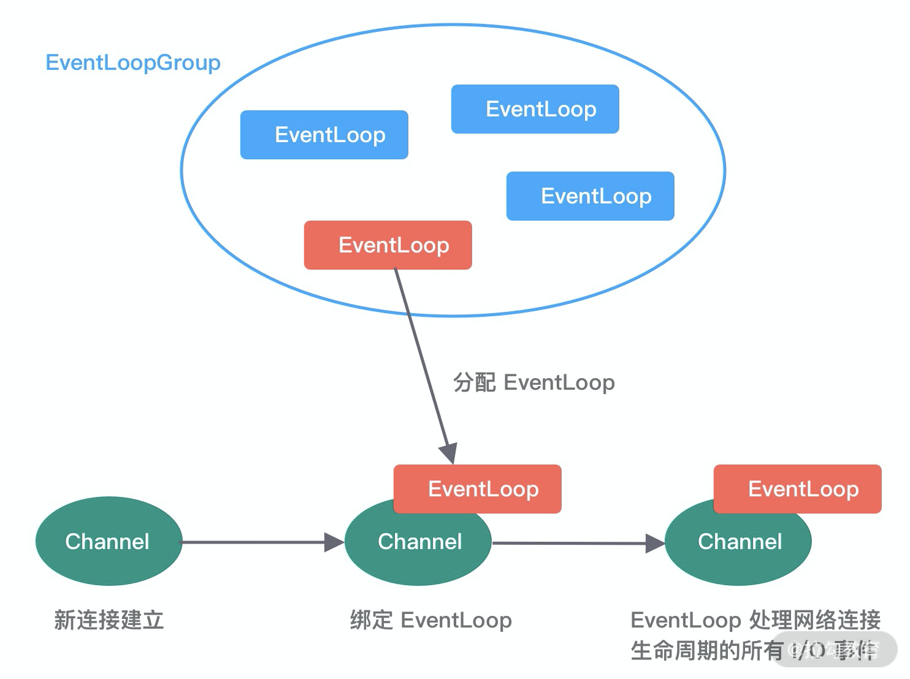

从上图中，我们可以总结出 EventLoopGroup、EventLoop、Channel 的几点关系。

1.  一个 EventLoopGroup 往往包含一个或者多个 EventLoop。EventLoop 用于处理 Channel 生命周期内的所有 I/O 事件，如 accept、connect、read、write 等 I/O 事件。
2.  EventLoop 同一时间会与一个线程绑定，每个 EventLoop 负责处理多个 Channel。
3.  每新建一个 Channel，EventLoopGroup 会选择一个 EventLoop 与其绑定。该 Channel 在生命周期内都可以对 EventLoop 进行多次绑定和解绑。

下图是 EventLoopGroup 的家族图谱。可以看出 Netty 提供了 EventLoopGroup 的多种实现，而且 EventLoop 则是 EventLoopGroup 的子接口，所以也可以把 EventLoop 理解为 EventLoopGroup，但是它只包含一个 EventLoop 。

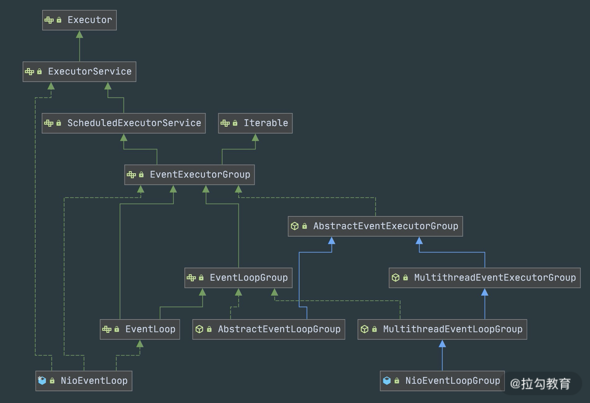

EventLoopGroup 的实现类是 NioEventLoopGroup，NioEventLoopGroup 也是 Netty 中最被推荐使用的线程模型。NioEventLoopGroup 继承于 MultithreadEventLoopGroup，是基于 NIO 模型开发的，可以把 NioEventLoopGroup 理解为一个线程池，每个线程负责处理多个 Channel，而同一个 Channel 只会对应一个线程。

EventLoopGroup 是 Netty 的核心处理引擎，那么 EventLoopGroup 和之前课程所提到的 Reactor 线程模型到底是什么关系呢？其实 EventLoopGroup 是 Netty Reactor 线程模型的具体实现方式，Netty 通过创建不同的 EventLoopGroup 参数配置，就可以支持 Reactor 的三种线程模型：

1.  **单线程模型**：EventLoopGroup 只包含一个 EventLoop，Boss 和 Worker 使用同一个 EventLoopGroup；
2.  **多线程模型**：EventLoopGroup 包含多个 EventLoop，Boss 和 Worker 使用同一个 EventLoopGroup；
3.  **主从多线程模型**：EventLoopGroup 包含多个 EventLoop，Boss 是主 Reactor，Worker 是从 Reactor，它们分别使用不同的 EventLoopGroup，主 Reactor 负责新的网络连接 Channel 创建，然后把 Channel 注册到从 Reactor。

在介绍完事件调度层之后，可以说 Netty 的发动机已经转起来了，事件调度层负责监听网络连接和读写操作，然后触发各种类型的网络事件，需要一种机制管理这些错综复杂的事件，并有序地执行，接下来我们便一起学习 Netty 服务编排层中核心组件的职责。

### 服务编排层

服务编排层的职责是负责组装各类服务，它是 Netty 的核心处理链，用以实现网络事件的动态编排和有序传播。

服务编排层的**核心组件**包括 **ChannelPipeline**、**ChannelHandler、ChannelHandlerContext**。

- **ChannelPipeline**

ChannelPipeline 是 Netty 的核心编排组件，**负责组装各种 ChannelHandler**，实际数据的编解码以及加工处理操作都是由 ChannelHandler 完成的。ChannelPipeline 可以理解为**ChannelHandler 的实例列表**——内部通过双向链表将不同的 ChannelHandler 链接在一起。当 I/O 读写事件触发时，ChannelPipeline 会依次调用 ChannelHandler 列表对 Channel 的数据进行拦截和处理。

ChannelPipeline 是线程安全的，因为每一个新的 Channel 都会对应绑定一个新的 ChannelPipeline。一个 ChannelPipeline 关联一个 EventLoop，一个 EventLoop 仅会绑定一个线程。

ChannelPipeline、ChannelHandler 都是高度可定制的组件。开发者可以通过这两个核心组件掌握对 Channel 数据操作的控制权。下面我们看一下 ChannelPipeline 的结构图：

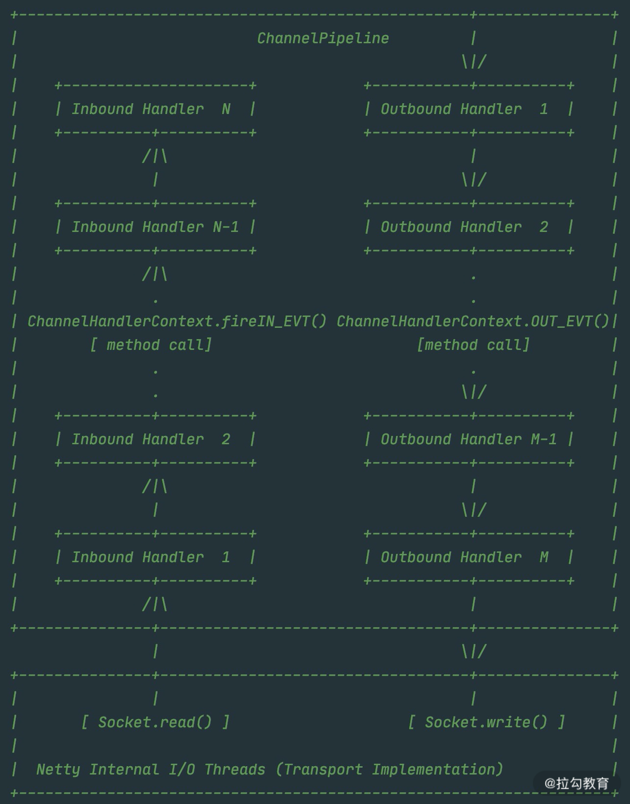

从上图可以看出，ChannelPipeline 中包含入站 ChannelInboundHandler 和出站 ChannelOutboundHandler 两种处理器，我们结合客户端和服务端的数据收发流程来理解 Netty 的这两个概念。

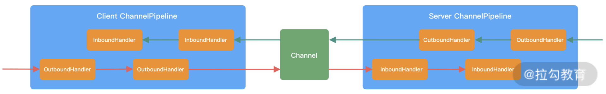

客户端和服务端都有各自的 ChannelPipeline。以客户端为例，数据从客户端发向服务端，该过程称为**出站**，反之则称为**入站**。数据入站会由一系列 InBoundHandler 处理，然后再以相反方向的 OutBoundHandler 处理后完成出站。我们经常使用的编码 Encoder 是出站操作，解码 Decoder 是入站操作。服务端接收到客户端数据后，需要先经过 Decoder 入站处理后，再通过 Encoder 出站通知客户端。所以客户端和服务端一次完整的请求应答过程可以分为三个步骤：客户端出站（请求数据）、服务端入站（解析数据并执行业务逻辑）、服务端出站（响应结果）。

- **ChannelHandler & ChannelHandlerContext**

在介绍 ChannelPipeline 的过程中，想必你已经对 ChannelHandler 有了基本的概念，数据的编解码工作以及其他转换工作实际都是通过 ChannelHandler 处理的。站在开发者的角度，最需要关注的就是 ChannelHandler，我们很少会直接操作 Channel，都是通过 ChannelHandler 间接完成。

下图描述了 Channel 与 ChannelPipeline 的关系，从图中可以看出，每创建一个 Channel 都会绑定一个新的 ChannelPipeline，ChannelPipeline 中每加入一个 ChannelHandler 都会绑定一个 ChannelHandlerContext。由此可见，ChannelPipeline、ChannelHandlerContext、ChannelHandler 三个组件的关系是密切相关的，那么你一定会有疑问，每个 ChannelHandler 绑定 ChannelHandlerContext 的作用是什么呢？

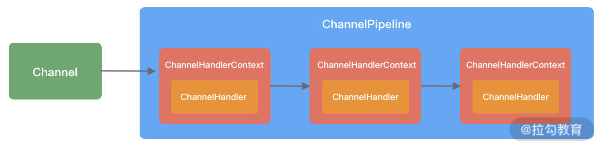

ChannelHandlerContext 用于保存 ChannelHandler 上下文，通过 ChannelHandlerContext 我们可以知道 ChannelPipeline 和 ChannelHandler 的关联关系。ChannelHandlerContext 可以实现 ChannelHandler 之间的交互，ChannelHandlerContext 包含了 ChannelHandler 生命周期的所有事件，如 connect、bind、read、flush、write、close 等。此外，你可以试想这样一个场景，如果每个 ChannelHandler 都有一些通用的逻辑需要实现，没有 ChannelHandlerContext 这层模型抽象，你是不是需要写很多相同的代码呢？

以上便是 Netty 的逻辑处理架构，可以看出 Netty 的架构分层设计得非常合理，屏蔽了底层 NIO 以及框架层的实现细节，对于业务开发者来说，只需要关注业务逻辑的编排和实现即可。

## 组件关系梳理

当你了解每个 Netty 核心组件的概念后。你会好奇这些组件之间如何协作？结合客户端和服务端的交互流程，我画了一张图，为你完整地梳理一遍 Netty 内部逻辑的流转。

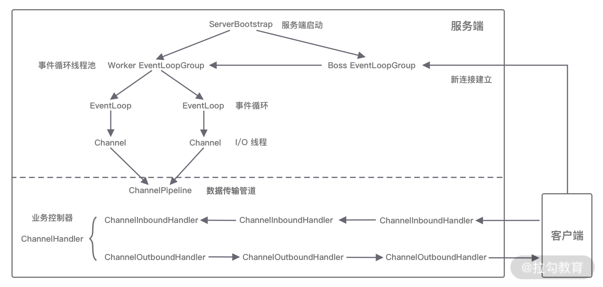

- 服务端启动初始化时有 Boss EventLoopGroup 和 Worker EventLoopGroup 两个组件，其中 Boss 负责监听网络连接事件。当有新的网络连接事件到达时，则将 Channel 注册到 Worker EventLoopGroup。
- Worker EventLoopGroup 会被分配一个 EventLoop 负责处理该 Channel 的读写事件。每个 EventLoop 都是单线程的，通过 Selector 进行事件循环。
- 当客户端发起 I/O 读写事件时，服务端 EventLoop 会进行数据的读取，然后通过 Pipeline 触发各种监听器进行数据的加工处理。
- 客户端数据会被传递到 ChannelPipeline 的第一个 ChannelInboundHandler 中，数据处理完成后，将加工完成的数据传递给下一个 ChannelInboundHandler。
- 当数据写回客户端时，会将处理结果在 ChannelPipeline 的 ChannelOutboundHandler 中传播，最后到达客户端。

以上便是 Netty 各个组件的整体交互流程，你只需要对每个组件的工作职责有所了解，心中可以串成一条流水线即可，具体每个组件的实现原理后续课程我们会深入介绍。

## Netty 源码结构

Netty 源码分为多个模块，模块之间职责划分非常清楚。如同上文整体功能模块一样，Netty 源码模块的划分也是基本契合的。

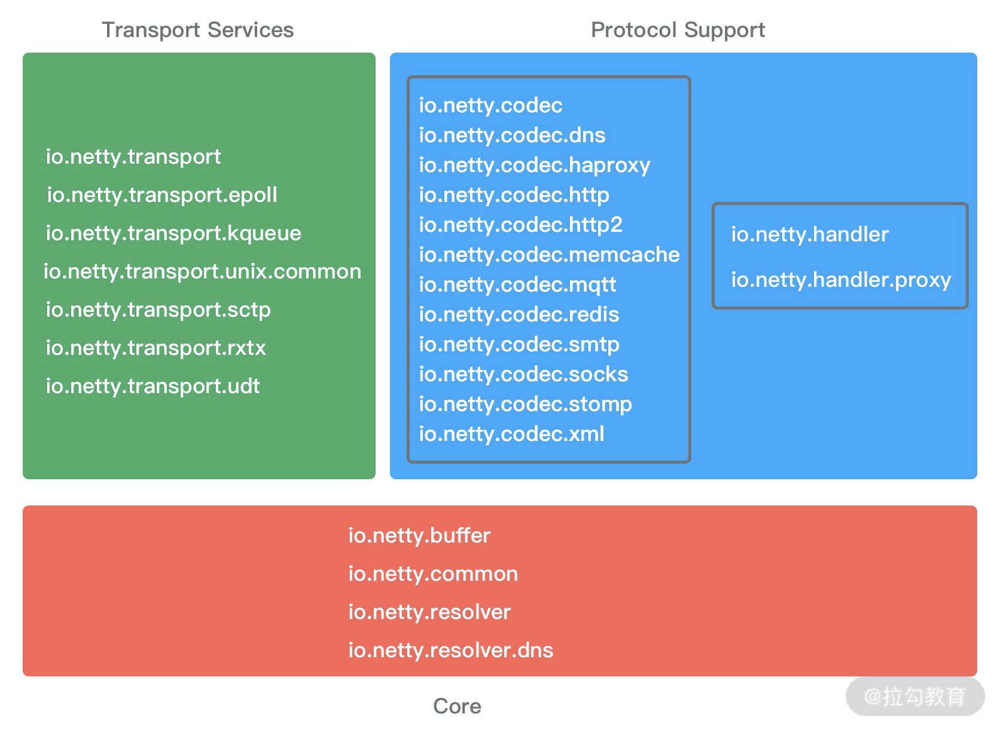

我们不仅可以使用 Netty all-in-one 的 Jar 包，也可以单独使用其中某些工具包。下面我根据 Netty 的分层结构以及实际的业务场景具体介绍 Netty 中常用的工具包。

### Core 核心层模块

**netty-common**模块是 Netty 的核心基础包，提供了丰富的工具类，其他模块都需要依赖它。在 common 模块中，常用的包括**通用工具类**和**自定义并发包**。

- 通用工具类：比如定时器工具 TimerTask、时间轮 HashedWheelTimer 等。
- 自定义并发包：比如异步模型\*\*\*\*Future & Promise、相比 JDK 增强的 FastThreadLocal 等。

在**netty-buffer 模块中**Netty 自己实现了的一个更加完备的**ByteBuf 工具类**，用于网络通信中的数据载体。由于人性化的 Buffer API 设计，它已经成为 Java ByteBuffer 的完美替代品。ByteBuf 的动态性设计不仅解决了 ByteBuffer 长度固定造成的内存浪费问题，而且更安全地更改了 Buffer 的容量。此外 Netty 针对 ByteBuf 做了很多优化，例如缓存池化、减少数据拷贝的 CompositeByteBuf 等。

**netty-resover**模块主要提供了一些有关**基础设施**的解析工具，包括 IP Address、Hostname、DNS 等。

### Protocol Support 协议支持层模块

**netty-codec**模块主要负责编解码工作，通过编解码实现原始字节数据与业务实体对象之间的相互转化。如下图所示，Netty 支持了大多数业界主流协议的编解码器，如 HTTP、HTTP2、Redis、XML 等，为开发者节省了大量的精力。此外该模块提供了抽象的编解码类 ByteToMessageDecoder 和 MessageToByteEncoder，通过继承这两个类我们可以轻松实现自定义的编解码逻辑。

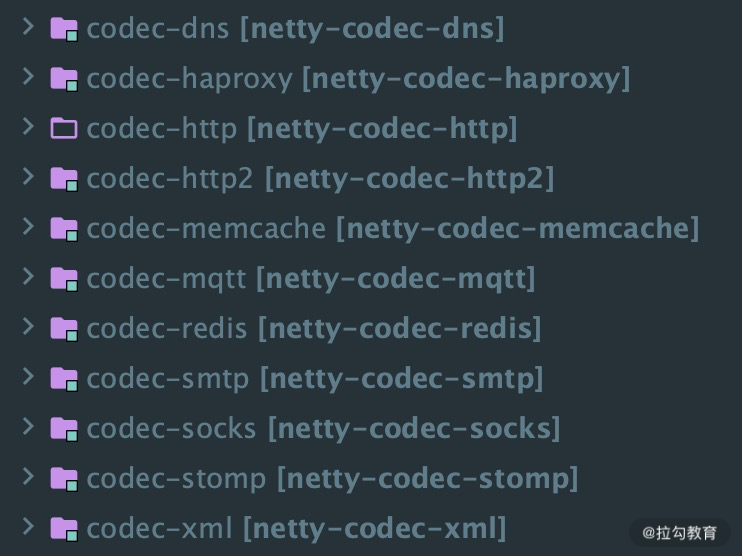

**netty-handler**模块主要负责数据处理工作。Netty 中关于数据处理的部分，本质上是一串有序 handler 的集合。netty-handler 模块提供了开箱即用的 ChannelHandler 实现类，例如日志、IP 过滤、流量整形等，如果你需要这些功能，仅需在 pipeline 中加入相应的 ChannelHandler 即可。

### Transport Service 传输服务层模块

netty-transport 模块可以说是 Netty 提供数据**处理和传输的核心模块**。该模块提供了很多非常重要的接口，如 Bootstrap、Channel、ChannelHandler、EventLoop、EventLoopGroup、ChannelPipeline 等。其中 Bootstrap 负责客户端或服务端的启动工作，包括创建、初始化 Channel 等；EventLoop 负责向注册的 Channel 发起 I/O 读写操作；ChannelPipeline 负责 ChannelHandler 的有序编排，这些组件在介绍 Netty 逻辑架构的时候都有所涉及。

以上只介绍了 Netty 常用的功能模块，还有很多模块就不一一列举了，有兴趣的同学可以在 GitHub（[https://github.com/netty/netty](https://github.com/netty/netty)）查询 Netty 的源码。

## 总结

本节课我们分别从整体结构、逻辑架构以及源码结构对 Netty 的整体架构进行了初步介绍，可见 Netty 的分层架构设计非常合理，实现了各层之间的逻辑解耦，对于开发者来说，只需要扩展业务逻辑即可。

在我刚开始接触 Netty 时，面对太多的核心组件刚开始是无从下手的，所以在 Netty 的逻辑架构中我梳理了 Netty 中各个核心组件的关系，希望能够帮助你快速入门。从下节课开始我们会对 Netty 逻辑架构中的核心组件做详细的介绍。

03 引导器作用：客户端和服务端启动都要做些什么？
=========================

你好，我是若地。上节课我们介绍了 Netty 中核心组件的作用以及组件协作的方式方法。从这节课开始，我们将对 Netty 的每个核心组件依次进行深入剖析解读。我会结合相应的代码示例讲解，帮助你快速上手 Netty。

我们在使用 Netty 编写网络应用程序的时候，一定会从**引导器 Bootstrap**开始入手。Bootstrap 作为整个 Netty 客户端和服务端的**程序入口**，可以把 Netty 的核心组件像搭积木一样组装在一起。本节课我会从 Netty 的引导器**Bootstrap**出发，带你学习如何使用 Netty 进行最基本的程序开发。

## 从一个简单的 HTTP 服务器开始

HTTP 服务器是我们平时最常用的工具之一。同传统 Web 容器 Tomcat、Jetty 一样，Netty 也可以方便地开发一个 HTTP 服务器。我从一个简单的 HTTP 服务器开始，通过程序示例为你展现 Netty 程序如何配置启动，以及引导器如何与核心组件产生联系。

完整地实现一个高性能、功能完备、健壮性强的 HTTP 服务器非常复杂，本文仅为了方便理解 Netty 网络应用开发的基本过程，所以只实现最基本的**请求-响应**的流程：

1.  搭建 HTTP 服务器，配置相关参数并启动。
2.  从浏览器或者终端发起 HTTP 请求。
3.  成功得到服务端的响应结果。

Netty 的模块化设计非常优雅，客户端或者服务端的启动方式基本是固定的。作为开发者来说，只要照葫芦画瓢即可轻松上手。大多数场景下，你只需要实现与业务逻辑相关的一系列 ChannelHandler，再加上 Netty 已经预置了 HTTP 相关的编解码器就可以快速完成服务端框架的搭建。所以，我们只需要两个类就可以完成一个最简单的 HTTP 服务器，它们分别为**服务器启动类**和**业务逻辑处理类**，结合完整的代码实现我将对它们分别进行讲解。

### 服务端启动类

所有 Netty 服务端的启动类都可以采用如下代码结构进行开发。简单梳理一下流程：首先创建引导器；然后配置线程模型，通过引导器绑定业务逻辑处理器，并配置一些网络参数；最后绑定端口，就可以完成服务器的启动了。

```java
public class HttpServer {

    public void start(int port) throws Exception {

        EventLoopGroup bossGroup = new NioEventLoopGroup();

        EventLoopGroup workerGroup = new NioEventLoopGroup();

        try {

            ServerBootstrap b = new ServerBootstrap();

            b.group(bossGroup, workerGroup)

                    .channel(NioServerSocketChannel.class)

                    .localAddress(new InetSocketAddress(port))

                    .childHandler(new ChannelInitializer<SocketChannel>() {

                        @Override

                        public void initChannel(SocketChannel ch) {

                            ch.pipeline()

                                    .addLast("codec", new HttpServerCodec())                  // HTTP 编解码

                                    .addLast("compressor", new HttpContentCompressor())       // HttpContent 压缩

                                    .addLast("aggregator", new HttpObjectAggregator(65536))   // HTTP 消息聚合

                                    .addLast("handler", new HttpServerHandler());             // 自定义业务逻辑处理器

                        }

                    })

                    .childOption(ChannelOption.SO_KEEPALIVE, true);

            ChannelFuture f = b.bind().sync();

            System.out.println("Http Server started， Listening on " + port);

            f.channel().closeFuture().sync();

        } finally {

            workerGroup.shutdownGracefully();

            bossGroup.shutdownGracefully();

        }

    }

    public static void main(String[] args) throws Exception {

        new HttpServer().start(8088);

    }

}
```

### 服务端业务逻辑处理类

如下代码所示，HttpServerHandler 是业务自定义的逻辑处理类。它是入站 ChannelInboundHandler 类型的处理器，负责接收解码后的 HTTP 请求数据，并将请求处理结果写回客户端。

```java
public class HttpServerHandler extends SimpleChannelInboundHandler<FullHttpRequest> {

    @Override

    protected void channelRead0(ChannelHandlerContext ctx, FullHttpRequest msg) {

        String content = String.format("Receive http request, uri: %s, method: %s, content: %s%n", msg.uri(), msg.method(), msg.content().toString(CharsetUtil.UTF_8));

        FullHttpResponse response = new DefaultFullHttpResponse(

                HttpVersion.HTTP_1_1,

                HttpResponseStatus.OK,

                Unpooled.wrappedBuffer(content.getBytes()));

        ctx.writeAndFlush(response).addListener(ChannelFutureListener.CLOSE);

    }

}
```

通过上面两个类，我们可以完成 HTTP 服务器最基本的请求-响应流程，测试步骤如下：

1.  启动 HttpServer 的 main 函数。
2.  终端或浏览器发起 HTTP 请求。

测试结果输出如下：

```shell
$ curl http://localhost:8088/abc

$ Receive http request, uri: /abc, method: GET, content:
```

当然，你也可以使用 Netty 自行实现 HTTP Client，客户端和服务端的启动类代码十分相似，我在附录部分提供了一份 HTTPClient 的实现代码仅供大家参考。

通过上述一个简单的 HTTP 服务示例，我们基本熟悉了 Netty 的编程模式。下面我将结合这个例子对 Netty 的引导器展开详细的介绍。

## 引导器实践指南

Netty 服务端的启动过程大致分为三个步骤：

1.  **配置线程池；**
2.  **Channel 初始化；**
3.  **端口绑定。**

下面，我将逐一为大家介绍每一步具体需要做哪些工作。

### 配置线程池

Netty 是采用 Reactor 模型进行开发的，可以非常容易切换三种 Reactor 模式：**单线程模式**、**多线程模式**、**主从多线程模式**。

### 单线程模式

Reactor 单线程模型所有 I/O 操作都由一个线程完成，所以只需要启动一个 EventLoopGroup 即可。

```java
EventLoopGroup group = new NioEventLoopGroup(1);

ServerBootstrap b = new ServerBootstrap();

b.group(group)
```

### 多线程模式

Reactor 单线程模型有非常严重的性能瓶颈，因此 Reactor 多线程模型出现了。在 Netty 中使用 Reactor 多线程模型与单线程模型非常相似，区别是 NioEventLoopGroup 可以不需要任何参数，它默认会启动 2 倍 CPU 核数的线程。当然，你也可以自己手动设置固定的线程数。

```java
EventLoopGroup group = new NioEventLoopGroup();

ServerBootstrap b = new ServerBootstrap();

b.group(group)
```

### 主从多线程模式

在大多数场景下，我们采用的都是**主从多线程 Reactor 模型**。Boss 是主 Reactor，Worker 是从 Reactor。它们分别使用不同的 NioEventLoopGroup，主 Reactor 负责处理 Accept，然后把 Channel 注册到从 Reactor 上，从 Reactor 主要负责 Channel 生命周期内的所有 I/O 事件。

```java
EventLoopGroup bossGroup = new NioEventLoopGroup();

EventLoopGroup workerGroup = new NioEventLoopGroup();

ServerBootstrap b = new ServerBootstrap();

b.group(bossGroup, workerGroup)
```

从上述三种 Reactor 线程模型的配置方法可以看出：Netty 线程模型的可定制化程度很高。它只需要简单配置不同的参数，便可启用不同的 Reactor 线程模型，而且无需变更其他的代码，很大程度上降低了用户开发和调试的成本。

## Channel 初始化

### 设置 Channel 类型

NIO 模型是 Netty 中最成熟且被广泛使用的模型。因此，推荐 Netty 服务端采用 NioServerSocketChannel 作为 Channel 的类型，客户端采用 NioSocketChannel。设置方式如下：

​     b.channel(NioServerSocketChannel.class);
​    

当然，Netty 提供了多种类型的 Channel 实现类，你可以按需切换，例如 OioServerSocketChannel、EpollServerSocketChannel 等。

### 注册 ChannelHandler

在 Netty 中可以通过 ChannelPipeline 去注册多个 ChannelHandler，每个 ChannelHandler 各司其职，这样就可以实现最大化的代码复用，充分体现了 Netty 设计的优雅之处。那么如何通过引导器添加多个 ChannelHandler 呢？其实很简单，我们看下 HTTP 服务器代码示例：

```java
b.childHandler(new ChannelInitializer<SocketChannel>() {

    @Override

    public void initChannel(SocketChannel ch) {

        ch.pipeline()

                .addLast("codec", new HttpServerCodec())

                .addLast("compressor", new HttpContentCompressor())

                .addLast("aggregator", new HttpObjectAggregator(65536)) 

                .addLast("handler", new HttpServerHandler());

    }

})
```

ServerBootstrap 的 childHandler() 方法需要注册一个 ChannelHandler。**ChannelInitializer**是实现了 ChannelHandler**接口的匿名类**，通过实例化 ChannelInitializer 作为 ServerBootstrap 的参数。

Channel 初始化时都会绑定一个 Pipeline，它主要用于服务编排。Pipeline 管理了多个 ChannelHandler。I/O 事件依次在 ChannelHandler 中传播，ChannelHandler 负责业务逻辑处理。上述 HTTP 服务器示例中使用链式的方式加载了多个 ChannelHandler，包含**HTTP 编解码处理器、HTTPContent 压缩处理器、HTTP 消息聚合处理器、自定义业务逻辑处理器**。

在以前的章节中，我们介绍了 ChannelPipeline 中**入站 ChannelInboundHandler**和**出站 ChannelOutboundHandler**的概念，在这里结合 HTTP 请求-响应的场景，分析下数据在 ChannelPipeline 中的流向。当服务端收到 HTTP 请求后，会依次经过 HTTP 编解码处理器、HTTPContent 压缩处理器、HTTP 消息聚合处理器、自定义业务逻辑处理器分别处理后，再将最终结果通过 HTTPContent 压缩处理器、HTTP 编解码处理器写回客户端。

### 设置 Channel 参数

Netty 提供了十分便捷的方法，用于设置 Channel 参数。关于 Channel 的参数数量非常多，如果每个参数都需要自己设置，那会非常繁琐。幸运的是 Netty 提供了默认参数设置，实际场景下默认参数已经满足我们的需求，我们仅需要修改自己关系的参数即可。

```java
b.option(ChannelOption.SO_KEEPALIVE, true);
```

ServerBootstrap 设置 Channel 属性有**option**和**childOption**两个方法，option 主要负责设置 Boss 线程组，而 childOption 对应的是 Worker 线程组。

这里我列举了经常使用的参数含义，你可以结合业务场景，按需设置。

参数 | 含义 
-- | --
SO_KEEPALIVE | 设置为 true 代表启用了 TCP SO_KEEPALIVE 属性，TCP 会主动探测连接状态，即连接保活
SO_BACKLOG | 已完成三次握手的请求队列最大长度，同一时刻服务端可能会处理多个连接，在高并发海量连接的场景下，该参数应适当调大
TCP_NODELAY | Netty 默认是 true，表示立即发送数据。如果设置为 false 表示启用 Nagle 算法，该算法会将 TCP 网络数据包累积到一定量才会发送，虽然可以减少报文发送的数量，但是会造成一定的数据延迟。Netty 为了最小化数据传输的延迟，默认禁用了 Nagle 算法
SO_SNDBUF | TCP 数据发送缓冲区大小
SO_RCVBUF | TCP数据接收缓冲区大小，TCP数据接收缓冲区大小
SO_LINGER | 设置延迟关闭的时间，等待缓冲区中的数据发送完成
CONNECT_TIMEOUT_MILLIS | 建立连接的超时时间

### 端口绑定

在完成上述 Netty 的配置之后，bind() 方法会真正触发启动，sync() 方法则会阻塞，直至整个启动过程完成，具体使用方式如下：

```java
ChannelFuture f = b.bind().sync();
```

bind() 方法涉及的细节比较多，我们将在《源码篇：从 Linux 出发深入剖析服务端启动流程》课程中做详细地解析，在这里就先不做展开了。

关于如何使用引导器开发一个 Netty 网络应用我们就介绍完了，服务端的启动过程一定离不开配置线程池、Channel 初始化、端口绑定三个步骤，在 Channel 初始化的过程中最重要的就是绑定用户实现的自定义业务逻辑。是不是特别简单？你可以参考本节课的示例，自己尝试开发一个简单的程序练练手。

## 总结

本节课我们围绕 Netty 的引导器，学习了如何开发最基本的网络应用程序。引导器串接了 Netty 的所有核心组件，通过引导器作为学习 Netty 的切入点有助于我们快速上手。Netty 的引导器作为一个非常方便的工具，避免我们再去手动完成繁琐的 Channel 的创建和配置等过程，其中有很多知识点可以深挖，在后续源码章节中我们再一起探索它的实现原理。

## 附录

### HTTP 客户端类

```java
public class HttpClient {

    public void connect(String host, int port) throws Exception {

        EventLoopGroup group = new NioEventLoopGroup();

        try {

            Bootstrap b = new Bootstrap();

            b.group(group);

            b.channel(NioSocketChannel.class);

            b.option(ChannelOption.SO_KEEPALIVE, true);

            b.handler(new ChannelInitializer<SocketChannel>() {

                @Override

                public void initChannel(SocketChannel ch) {

                    ch.pipeline().addLast(new HttpResponseDecoder());

                    ch.pipeline().addLast(new HttpRequestEncoder());

                    ch.pipeline().addLast(new HttpClientHandler());

                }

            });

            ChannelFuture f = b.connect(host, port).sync();

            URI uri = new URI("http://127.0.0.1:8088");

            String content = "hello world";

            DefaultFullHttpRequest request = new DefaultFullHttpRequest(HttpVersion.HTTP_1_1, HttpMethod.GET,

                    uri.toASCIIString(), Unpooled.wrappedBuffer(content.getBytes(StandardCharsets.UTF_8)));

            request.headers().set(HttpHeaderNames.HOST, host);

            request.headers().set(HttpHeaderNames.CONNECTION, HttpHeaderValues.KEEP_ALIVE);

            request.headers().set(HttpHeaderNames.CONTENT_LENGTH, request.content().readableBytes());

            f.channel().write(request);

            f.channel().flush();

            f.channel().closeFuture().sync();

        } finally {

            group.shutdownGracefully();

        }

    }

    public static void main(String[] args) throws Exception {

        HttpClient client = new HttpClient();

        client.connect("127.0.0.1", 8088);

    }

}
```

### 客户端业务处理类

```java
public class HttpClientHandler extends ChannelInboundHandlerAdapter {

    @Override

    public void channelRead(ChannelHandlerContext ctx, Object msg) {

        if (msg instanceof HttpContent) {

            HttpContent content = (HttpContent) msg;

            ByteBuf buf = content.content();

            System.out.println(buf.toString(io.netty.util.CharsetUtil.UTF_8));

            buf.release();

        }

    }

}
```

04 事件调度层：为什么 EventLoop 是 Netty 的精髓？
===================================

你好，我是若地。通过前面课程的学习，我们已经知道 Netty 高性能的奥秘在于其 **Reactor 线程模型。** EventLoop 是 Netty Reactor 线程模型的核心处理引擎，那么它是如何高效地实现事件循环和任务处理机制的呢？本节课我们就一起学习 EventLoop 的实现原理和最佳实践。

## 再谈 Reactor 线程模型

网络框架的设计离不开 I/O 线程模型，线程模型的优劣直接决定了系统的吞吐量、可扩展性、安全性等。目前主流的网络框架几乎都采用了 I/O 多路复用的方案。Reactor 模式作为其中的事件分发器，负责将读写事件分发给对应的读写事件处理者。大名鼎鼎的 Java 并发包作者 Doug Lea，在 _Scalable I/O in Java_ 一文中阐述了服务端开发中 I/O 模型的演进过程。Netty 中**三种 Reactor 线程模型**也来源于这篇经典文章。下面我们对这三种 Reactor 线程模型做一个详细的分析。

### 单线程模型

 （[摘自 Lea D. Scalable IO in Java](http://gee.cs.oswego.edu/dl/cpjslides/nio.pdf])）

上图描述了 Reactor 的单线程模型结构，在 Reactor 单线程模型中，所有 I/O 操作（包括连接建立、数据读写、事件分发等），都是由一个线程完成的。单线程模型逻辑简单，缺陷也十分明显：

*   一个线程支持处理的连接数非常有限，CPU 很容易打满，性能方面有明显瓶颈；
*   当多个事件被同时触发时，只要有一个事件没有处理完，其他后面的事件就无法执行，这就会造成消息积压及请求超时；
*   线程在处理 I/O 事件时，Select 无法同时处理连接建立、事件分发等操作；
*   如果 I/O 线程一直处于满负荷状态，很可能造成服务端节点不可用。

### 多线程模型

 （[摘自 Lea D. Scalable IO in Java](http://gee.cs.oswego.edu/dl/cpjslides/nio.pdf])）

由于单线程模型有性能方面的瓶颈，多线程模型作为解决方案就应运而生了。Reactor 多线程模型将业务逻辑交给多个线程进行处理。除此之外，多线程模型其他的操作与单线程模型是类似的，例如读取数据依然保留了串行化的设计。当客户端有数据发送至服务端时，Select 会监听到可读事件，数据读取完毕后提交到业务线程池中并发处理。

### 主从多线程模型


 （[摘自 Lea D. Scalable IO in Java](http://gee.cs.oswego.edu/dl/cpjslides/nio.pdf])）

主从多线程模型由多个 Reactor 线程组成，每个 Reactor 线程都有独立的 Selector 对象。MainReactor 仅负责处理客户端连接的 Accept 事件，连接建立成功后将新创建的连接对象注册至 SubReactor。再由 SubReactor 分配线程池中的 I/O 线程与其连接绑定，它将负责连接生命周期内所有的 I/O 事件。

Netty 推荐使用主从多线程模型，这样就可以轻松达到成千上万规模的客户端连接。在海量客户端并发请求的场景下，主从多线程模式甚至可以适当增加 SubReactor 线程的数量，从而利用多核能力提升系统的吞吐量。

介绍了上述三种 Reactor 线程模型，再结合它们各自的架构图，我们能大致总结出 Reactor 线程模型运行机制的四个步骤，分别为**连接注册**、**事件轮询**、**事件分发**、**任务处理**，如下图所示。


*   连接注册：Channel 建立后，注册至 Reactor 线程中的 Selector 选择器。
*   事件轮询：轮询 Selector 选择器中已注册的所有 Channel 的 I/O 事件。
*   事件分发：为准备就绪的 I/O 事件分配相应的处理线程。
*   任务处理：Reactor 线程还负责任务队列中的非 I/O 任务，每个 Worker 线程从各自维护的任务队列中取出任务异步执行。

以上介绍了 Reactor 线程模型的演进过程和基本原理，Netty 也同样遵循 Reactor 线程模型的运行机制，下面我们来了解一下 Netty 是如何实现 Reactor 线程模型的。

## Netty EventLoop 实现原理

### EventLoop 是什么

EventLoop 这个概念其实并不是 Netty 独有的，它是一种**事件等待和处理的程序模型**，可以解决多线程资源消耗高的问题。例如 Node.js 就采用了 EventLoop 的运行机制，不仅占用资源低，而且能够支撑了大规模的流量访问。

下图展示了 EventLoop 通用的运行模式。每当事件发生时，应用程序都会将产生的事件放入事件队列当中，然后 EventLoop 会轮询从队列中取出事件执行或者将事件分发给相应的事件监听者执行。事件执行的方式通常分为**立即执行、延后执行、定期执行**几种。

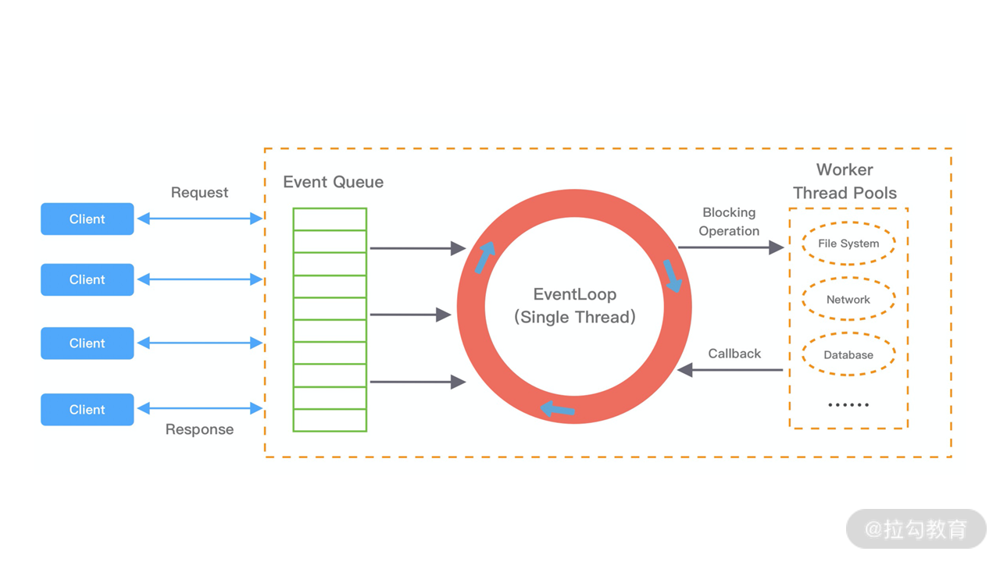

## Netty 如何实现 EventLoop

在 Netty 中 EventLoop 可以理解为 Reactor 线程模型的事件处理引擎，每个 EventLoop 线程都维护一个 Selector 选择器和任务队列 taskQueue。它主要负责处理 I/O 事件、普通任务和定时任务。

Netty 中推荐使用 NioEventLoop 作为实现类，那么 Netty 是如何实现 NioEventLoop 的呢？首先我们来看 NioEventLoop 最核心的 run() 方法源码，本节课我们不会对源码做深入的分析，只是先了解 NioEventLoop 的实现结构。

```java
protected void run() {

    for (;;) {

        try {

            try {

                switch (selectStrategy.calculateStrategy(selectNowSupplier, hasTasks())) {

                case SelectStrategy.CONTINUE:

                    continue;

                case SelectStrategy.BUSY_WAIT:

                case SelectStrategy.SELECT:

                    select(wakenUp.getAndSet(false)); // 轮询 I/O 事件

                    if (wakenUp.get()) {

                        selector.wakeup();

                    }

                default:

                }

            } catch (IOException e) {

                rebuildSelector0();

                handleLoopException(e);

                continue;

            }
            cancelledKeys = 0;

            needsToSelectAgain = false;

            final int ioRatio = this.ioRatio;

            if (ioRatio == 100) {

                try {

                    processSelectedKeys(); // 处理 I/O 事件

                } finally {

                    runAllTasks(); // 处理所有任务

                }

            } else {

                final long ioStartTime = System.nanoTime();

                try {

                    processSelectedKeys(); // 处理 I/O 事件

                } finally {

                    final long ioTime = System.nanoTime() - ioStartTime;

                    runAllTasks(ioTime * (100 - ioRatio) / ioRatio); // 处理完 I/O 事件，再处理异步任务队列

                }

            }

        } catch (Throwable t) {

            handleLoopException(t);

        }

        try {

            if (isShuttingDown()) {

                closeAll();

                if (confirmShutdown()) {

                    return;

                }

            }

        } catch (Throwable t) {

            handleLoopException(t);

        }

    }

}
```

上述源码的结构比较清晰，NioEventLoop 每次循环的处理流程都包含事件轮询 select、事件处理 processSelectedKeys、任务处理 runAllTasks 几个步骤，是典型的 Reactor 线程模型的运行机制。而且 Netty 提供了一个参数 ioRatio，可以调整 I/O 事件处理和任务处理的时间比例。下面我们将着重从**事件处理**和**任务处理**两个核心部分出发，详细介绍 Netty EventLoop 的实现原理。

### 事件处理机制


结合 Netty 的整体架构，我们一起看下 EventLoop 的事件流转图，以便更好地理解 Netty EventLoop 的设计原理。NioEventLoop 的事件处理机制采用的是**无锁串行化的设计思路**。

*   **BossEventLoopGroup** 和 **WorkerEventLoopGroup** 包含一个或者多个 NioEventLoop。BossEventLoopGroup 负责监听客户端的 Accept 事件，当事件触发时，将事件注册至 WorkerEventLoopGroup 中的一个 NioEventLoop 上。每新建一个 Channel， 只选择一个 NioEventLoop 与其绑定。所以说 Channel 生命周期的所有事件处理都是**线程独立**的，不同的 NioEventLoop 线程之间不会发生任何交集。
*   NioEventLoop 完成数据读取后，会调用绑定的 ChannelPipeline 进行事件传播，ChannelPipeline 也是**线程安全**的，数据会被传递到 ChannelPipeline 的第一个 ChannelHandler 中。数据处理完成后，将加工完成的数据再传递给下一个 ChannelHandler，整个过程是**串行化**执行，不会发生线程上下文切换的问题。

NioEventLoop 无锁串行化的设计不仅使系统吞吐量达到最大化，而且降低了用户开发业务逻辑的难度，不需要花太多精力关心线程安全问题。虽然单线程执行避免了线程切换，但是它的缺陷就是不能执行时间过长的 I/O 操作，一旦某个 I/O 事件发生阻塞，那么后续的所有 I/O 事件都无法执行，甚至造成事件积压。在使用 Netty 进行程序开发时，我们一定要对 ChannelHandler 的实现逻辑有充分的风险意识。

NioEventLoop 线程的可靠性至关重要，一旦 NioEventLoop 发生阻塞或者陷入空轮询，就会导致整个系统不可用。在 JDK 中， Epoll 的实现是存在漏洞的，即使 Selector 轮询的事件列表为空，NIO 线程一样可以被唤醒，导致 CPU 100% 占用。这就是臭名昭著的 JDK epoll 空轮询的 Bug。Netty 作为一个高性能、高可靠的网络框架，需要保证 I/O 线程的安全性。那么它是如何解决 JDK epoll 空轮询的 Bug 呢？实际上 Netty 并没有从根源上解决该问题，而是巧妙地规避了这个问题。

我们抛开其他细枝末节，直接定位到事件轮询 select() 方法中的最后一部分代码，一起看下 Netty 是如何解决 epoll 空轮询的 Bug。

```java
long time = System.nanoTime();

if (time - TimeUnit.MILLISECONDS.toNanos(timeoutMillis) >= currentTimeNanos) {

    selectCnt = 1;

} else if (SELECTOR_AUTO_REBUILD_THRESHOLD > 0 &&

        selectCnt >= SELECTOR_AUTO_REBUILD_THRESHOLD) {

    selector = selectRebuildSelector(selectCnt);

    selectCnt = 1;

    break;

}
```

Netty 提供了一种检测机制判断线程是否可能陷入空轮询，具体的实现方式如下：

1.  每次执行 Select 操作之前记录当前时间 currentTimeNanos。
2.  time - TimeUnit.MILLISECONDS.toNanos(timeoutMillis) >= currentTimeNanos，如果事件轮询的持续时间大于等于 timeoutMillis，那么说明是正常的，否则表明阻塞时间并未达到预期，可能触发了空轮询的 Bug。
3.  Netty 引入了计数变量 selectCnt。在正常情况下，selectCnt 会重置，否则会对 selectCnt 自增计数。当 selectCnt 达到 SELECTOR\_AUTO\_REBUILD_THRESHOLD（默认512） 阈值时，会触发重建 Selector 对象。

Netty 采用这种方法巧妙地规避了 JDK Bug。异常的 Selector 中所有的 SelectionKey 会重新注册到新建的 Selector 上，重建完成之后异常的 Selector 就可以废弃了。

### 任务处理机制

NioEventLoop 不仅负责处理 I/O 事件，还要兼顾执行任务队列中的任务。任务队列遵循 FIFO 规则，可以保证任务执行的公平性。NioEventLoop 处理的任务类型基本可以分为三类。

1.  **普通任务**：通过 NioEventLoop 的 execute() 方法向任务队列 taskQueue 中添加任务。例如 Netty 在写数据时会封装 WriteAndFlushTask 提交给 taskQueue。taskQueue 的实现类是多生产者单消费者队列 MpscChunkedArrayQueue，在多线程并发添加任务时，可以保证线程安全。
2.  **定时任务**：通过调用 NioEventLoop 的 schedule() 方法向定时任务队列 scheduledTaskQueue 添加一个定时任务，用于周期性执行该任务。例如，心跳消息发送等。定时任务队列 scheduledTaskQueue 采用优先队列 PriorityQueue 实现。
3.  **尾部队列**：tailTasks 相比于普通任务队列优先级较低，在每次执行完 taskQueue 中任务后会去获取尾部队列中任务执行。尾部任务并不常用，主要用于做一些收尾工作，例如统计事件循环的执行时间、监控信息上报等。

下面结合任务处理 runAllTasks 的源码结构，分析下 NioEventLoop 处理任务的逻辑，源码实现如下：

```java
protected boolean runAllTasks(long timeoutNanos) {

    // 1. 合并定时任务到普通任务队列

    fetchFromScheduledTaskQueue();

    // 2. 从普通任务队列中取出任务

    Runnable task = pollTask();

    if (task == null) {

        afterRunningAllTasks();

        return false;

    }

    // 3. 计算任务处理的超时时间

    final long deadline = ScheduledFutureTask.nanoTime() + timeoutNanos;

    long runTasks = 0;

    long lastExecutionTime;

    for (;;) {

        // 4. 安全执行任务

        safeExecute(task);

        runTasks ++;

        // 5. 每执行 64 个任务检查一下是否超时

        if ((runTasks & 0x3F) == 0) {

            lastExecutionTime = ScheduledFutureTask.nanoTime();

            if (lastExecutionTime >= deadline) {

                break;

            }

        }

        task = pollTask();

        if (task == null) {

            lastExecutionTime = ScheduledFutureTask.nanoTime();

            break;

        }

    }

    // 6. 收尾工作

    afterRunningAllTasks();

    this.lastExecutionTime = lastExecutionTime;

    return true;

}
```

我在代码中以注释的方式标注了具体的实现步骤，可以分为 6 个步骤。

1.  fetchFromScheduledTaskQueue 函数：将定时任务从 scheduledTaskQueue 中取出，聚合放入普通任务队列 taskQueue 中，只有定时任务的截止时间小于当前时间才可以被合并。
2.  从普通任务队列 taskQueue 中取出任务。
3.  计算任务执行的最大超时时间。
4.  safeExecute 函数：安全执行任务，实际直接调用的 Runnable 的 run() 方法。
5.  每执行 64 个任务进行超时时间的检查，如果执行时间大于最大超时时间，则立即停止执行任务，避免影响下一轮的 I/O 事件的处理。
6.  最后获取尾部队列中的任务执行。

## EventLoop 最佳实践

在日常开发中用好 EventLoop 至关重要，这里结合实际工作中的经验给出一些 EventLoop 的最佳实践方案。

1.  网络连接建立过程中三次握手、安全认证的过程会消耗不少时间。这里建议采用 Boss 和 Worker 两个 EventLoopGroup，有助于分担 Reactor 线程的压力。
2.  由于 Reactor 线程模式适合处理耗时短的任务场景，对于耗时较长的 ChannelHandler 可以考虑维护一个业务线程池，将编解码后的数据封装成 Task 进行异步处理，避免 ChannelHandler 阻塞而造成 EventLoop 不可用。
3.  如果业务逻辑执行时间较短，建议直接在 ChannelHandler 中执行。例如编解码操作，这样可以避免过度设计而造成架构的复杂性。
4.  不宜设计过多的 ChannelHandler。对于系统性能和可维护性都会存在问题，在设计业务架构的时候，需要明确业务分层和 Netty 分层之间的界限。不要一味地将业务逻辑都添加到 ChannelHandler 中。

## 总结

本节课我们一起学习了 Netty Reactor 线程模型的核心处理引擎 EventLoop，熟悉了 EventLoop 的来龙去脉。结合 Reactor 主从多线程模型，我们对 Netty EventLoop 的功能用处做一个简单的归纳总结。

*   MainReactor 线程：处理客户端请求接入。
*   SubReactor 线程：数据读取、I/O 事件的分发与执行。
*   任务处理线程：用于执行普通任务或者定时任务，如空闲连接检测、心跳上报等。

EventLoop 的设计思想被运用于较多的高性能框架中，如 Redis、Nginx、Node.js 等，它的设计原理是否对你有所启发呢？在后续源码篇的章节中我们将进一步介绍 EventLoop 的源码实现，吃透 EventLoop 这个死循环，可以说你就是一个 Netty 专家了。

05 服务编排层：Pipeline 如何协调各类 Handler ？
==================================

通过上节课的学习，我们知道 EventLoop 可以说是 Netty 的调度中心，负责监听多种事件类型：I/O 事件、信号事件、定时事件等，然而实际的业务处理逻辑则是由 ChannelPipeline 中所定义的 ChannelHandler 完成的，ChannelPipeline 和 ChannelHandler 也是我们在平时应用开发的过程中打交道最多的组件。Netty 服务编排层的核心组件 ChannelPipeline 和 ChannelHandler 为用户提供了 I/O 事件的全部控制权。今天这节课我们便一起深入学习 Netty 是如何利用这两个组件，将数据玩转起来。

在学习这节课之前，我先抛出几个问题。

*   ChannelPipeline 与 ChannelHandler 的关系是什么？它们之间是如何协同工作的？
*   ChannelHandler 的类型有哪些？有什么区别？
*   Netty 中 I/O 事件是如何传播的？

希望你在学习完本课时后，可以找到问题的答案。

## ChannelPipeline 概述

Pipeline 的字面意思是管道、流水线。它在 Netty 中起到的作用，和一个工厂的流水线类似。原始的网络字节流经过 Pipeline ，被一步步加工包装，最后得到加工后的成品。经过前面课程核心组件的初步学习，我们已经对 ChannelPipeline 有了初步的印象：它是 Netty 的核心处理链，用以实现网络事件的动态编排和有序传播。

今天我们将从以下几个方面一起探讨 ChannelPipeline 的实现原理：

*   ChannelPipeline 内部结构；
*   ChannelHandler 接口设计；
*   ChannelPipeline 事件传播机制；
*   ChannelPipeline 异常传播机制。

## ChannelPipeline 内部结构

首先我们要理清楚 ChannelPipeline 的内部结构是什么样子，这样才能理解 ChannelPipeline 的处理流程。ChannelPipeline 作为 Netty 的核心编排组件，负责调度各种类型的 ChannelHandler，实际数据的加工处理操作则是由 ChannelHandler 完成的。

ChannelPipeline 可以看作是 ChannelHandler 的容器载体，它是由一组 ChannelHandler 实例组成的，内部通过双向链表将不同的 ChannelHandler 链接在一起，如下图所示。当有 I/O 读写事件触发时，ChannelPipeline 会依次调用 ChannelHandler 列表对 Channel 的数据进行拦截和处理。


由上图可知，每个 Channel 会绑定一个 ChannelPipeline，每一个 ChannelPipeline 都包含多个 ChannelHandlerContext，所有 ChannelHandlerContext 之间组成了双向链表。又因为每个 ChannelHandler 都对应一个 ChannelHandlerContext，所以实际上 ChannelPipeline 维护的是它与 ChannelHandlerContext 的关系。那么你可能会有疑问，为什么这里会多一层 ChannelHandlerContext 的封装呢？

其实这是一种比较常用的编程思想。ChannelHandlerContext 用于保存 ChannelHandler 上下文；ChannelHandlerContext 则包含了 ChannelHandler 生命周期的所有事件，如 connect、bind、read、flush、write、close 等。可以试想一下，如果没有 ChannelHandlerContext 的这层封装，那么我们在做 ChannelHandler 之间传递的时候，前置后置的通用逻辑就要在每个 ChannelHandler 里都实现一份。这样虽然能解决问题，但是代码结构的耦合，会非常不优雅。

根据网络数据的流向，ChannelPipeline 分为入站 ChannelInboundHandler 和出站 ChannelOutboundHandler 两种处理器。在客户端与服务端通信的过程中，数据从客户端发向服务端的过程叫出站，反之称为入站。数据先由一系列 InboundHandler 处理后入站，然后再由相反方向的 OutboundHandler 处理完成后出站，如下图所示。我们经常使用的解码器 Decoder 就是入站操作，编码器 Encoder 就是出站操作。服务端接收到客户端数据需要先经过 Decoder 入站处理后，再通过 Encoder 出站通知客户端。

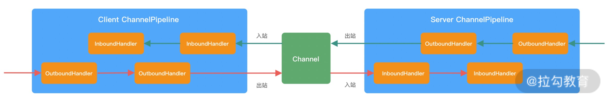

接下来我们详细分析下 ChannelPipeline 双向链表的构造，ChannelPipeline 的双向链表分别维护了 HeadContext 和 TailContext 的头尾节点。我们自定义的 ChannelHandler 会插入到 Head 和 Tail 之间，这两个节点在 Netty 中已经默认实现了，它们在 ChannelPipeline 中起到了至关重要的作用。首先我们看下 HeadContext 和 TailContext 的继承关系，如下图所示。

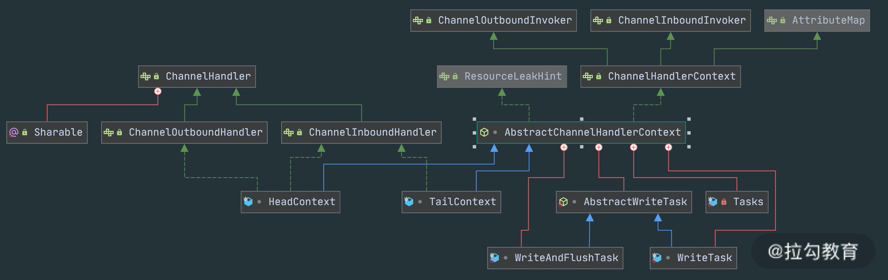

HeadContext 既是 Inbound 处理器，也是 Outbound 处理器。它分别实现了 ChannelInboundHandler 和 ChannelOutboundHandler。网络数据写入操作的入口就是由 HeadContext 节点完成的。HeadContext 作为 Pipeline 的头结点负责读取数据并开始传递 InBound 事件，当数据处理完成后，数据会反方向经过 Outbound 处理器，最终传递到 HeadContext，所以 HeadContext 又是处理 Outbound 事件的最后一站。此外 HeadContext 在传递事件之前，还会执行一些前置操作。

TailContext 只实现了 ChannelInboundHandler 接口。它会在 ChannelInboundHandler 调用链路的最后一步执行，主要用于终止 Inbound 事件传播，例如释放 Message 数据资源等。TailContext 节点作为 OutBound 事件传播的第一站，仅仅是将 OutBound 事件传递给上一个节点。

从整个 ChannelPipeline 调用链路来看，如果由 Channel 直接触发事件传播，那么调用链路将贯穿整个 ChannelPipeline。然而也可以在其中某一个 ChannelHandlerContext 触发同样的方法，这样只会从当前的 ChannelHandler 开始执行事件传播，该过程不会从头贯穿到尾，在一定场景下，可以提高程序性能。

## ChannelHandler 接口设计

在学习 ChannelPipeline 事件传播机制之前，我们需要了解 I/O 事件的生命周期。整个 ChannelHandler 是围绕 I/O 事件的生命周期所设计的，例如建立连接、读数据、写数据、连接销毁等。ChannelHandler 有两个重要的**子接口**：**ChannelInboundHandler**和**ChannelOutboundHandler**，分别拦截**入站和出站的各种 I/O 事件**。

**1\. ChannelInboundHandler 的事件回调方法与触发时机。**

事件回调方法 | 触发时机
-- | -- 
channelRegistered | Channel 被注册到 EventLoop
channelUnregistered | Channel 从 EventLoop 中取消注册
channelActive | Channel 处于就绪状态，可以被读写
channelInactive | Channel 处于非就绪状态Channel 可以从远端读取到数据
channelRead | Channel 可以从远端读取到数据
channelReadComplete | Channel 读取数据完成
userEventTriggered | 用户事件触发时
channelWritabilityChanged | Channel 的写状态发生变化


**2\. ChannelOutboundHandler 的事件回调方法与触发时机。**

ChannelOutboundHandler 的事件回调方法非常清晰，直接通过 ChannelOutboundHandler 的接口列表可以看到每种操作所对应的回调方法，如下图所示。这里每个回调方法都是在相应操作执行之前触发，在此就不多做赘述了。此外 ChannelOutboundHandler 中绝大部分接口都包含ChannelPromise 参数，以便于在操作完成时能够及时获得通知。


## 事件传播机制

在上文中我们介绍了 ChannelPipeline 可分为入站 ChannelInboundHandler 和出站 ChannelOutboundHandler 两种处理器，与此对应传输的事件类型可以分为**Inbound 事件**和**Outbound 事件**。

我们通过一个代码示例，一起体验下 ChannelPipeline 的事件传播机制。

```java
serverBootstrap.childHandler(new ChannelInitializer<SocketChannel>() {

    @Override

    public void initChannel(SocketChannel ch) {

        ch.pipeline()
          .addLast(new SampleInBoundHandler("SampleInBoundHandlerA", false))
          .addLast(new SampleInBoundHandler("SampleInBoundHandlerB", false))
          .addLast(new SampleInBoundHandler("SampleInBoundHandlerC", true));

        ch.pipeline()
          .addLast(new SampleOutBoundHandler("SampleOutBoundHandlerA"))
          .addLast(new SampleOutBoundHandler("SampleOutBoundHandlerB"))
          .addLast(new SampleOutBoundHandler("SampleOutBoundHandlerC"));
    }

}

public class SampleInBoundHandler extends ChannelInboundHandlerAdapter {

    private final String name;
    private final boolean flush;

    public SampleInBoundHandler(String name, boolean flush) {
        this.name = name;
        this.flush = flush;

    }

    @Override
    public void channelRead(ChannelHandlerContext ctx, Object msg) throws Exception {
        System.out.println("InBoundHandler: " + name);
        if (flush) {
            ctx.channel().writeAndFlush(msg);

        } else {
            super.channelRead(ctx, msg);
        }
    }

}
public class SampleOutBoundHandler extends ChannelOutboundHandlerAdapter {

    private final String name;

    public SampleOutBoundHandler(String name) {
        this.name = name;
    }

    @Override
    public void write(ChannelHandlerContext ctx, Object msg, ChannelPromise promise) throws Exception {
        System.out.println("OutBoundHandler: " + name);
        super.write(ctx, msg, promise);
    }
}
```

通过 Pipeline 的 addLast 方法分别添加了三个 InboundHandler 和 OutboundHandler，添加顺序都是 A -> B -> C，下图可以表示初始化后 ChannelPipeline 的内部结构。


当客户端向服务端发送请求时，会触发 SampleInBoundHandler 调用链的 channelRead 事件。经过 SampleInBoundHandler 调用链处理完成后，在 SampleInBoundHandlerC 中会调用 writeAndFlush 方法向客户端写回数据，此时会触发 SampleOutBoundHandler 调用链的 write 事件。最后我们看下代码示例的控制台输出：


由此可见，Inbound 事件和 Outbound 事件的传播方向是不一样的。Inbound 事件的传播方向为 Head -> Tail，而 Outbound 事件传播方向是 Tail -> Head，两者恰恰相反。在 Netty 应用编程中一定要理清楚事件传播的顺序。推荐你在系统设计时模拟客户端和服务端的场景画出 ChannelPipeline 的内部结构图，以避免搞混调用关系。

## 异常传播机制

ChannelPipeline 事件传播的实现采用了经典的责任链模式，调用链路环环相扣。那么如果有一个节点处理逻辑异常会出现什么现象呢？我们通过修改 SampleInBoundHandler 的实现来模拟业务逻辑异常：

```java
public class SampleInBoundHandler extends ChannelInboundHandlerAdapter {

    private final String name;
    private final boolean flush;

    public SampleInBoundHandler(String name, boolean flush) {
        this.name = name;
        this.flush = flush;
    }

    @Override
    public void channelRead(ChannelHandlerContext ctx, Object msg) {
        System.out.println("InBoundHandler: " + name);
        if (flush) {
            ctx.channel().writeAndFlush(msg);
        } else {
            throw new RuntimeException("InBoundHandler: " + name);
        }
    }

    @Override
    public void exceptionCaught(ChannelHandlerContext ctx, Throwable cause) {
        System.out.println("InBoundHandlerException: " + name);
        ctx.fireExceptionCaught(cause);
    }
}
```

在 channelRead 事件处理中，第一个 A 节点就会抛出 RuntimeException。同时我们重写了 ChannelInboundHandlerAdapter 中的 exceptionCaught 方法，只是在开头加上了控制台输出，方便观察异常传播的行为。下面看一下代码运行的控制台输出结果：

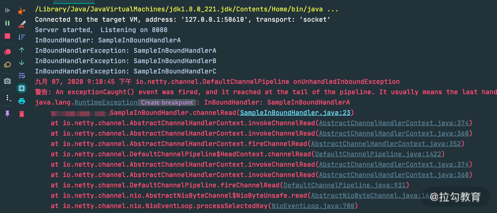

由输出结果可以看出 ctx.fireExceptionCaugh 会将异常按顺序从 Head 节点传播到 Tail 节点。如果用户没有对异常进行拦截处理，最后将由 Tail 节点统一处理，在 TailContext 源码中可以找到具体实现：

```java
protected void onUnhandledInboundException(Throwable cause) {

    try {

        logger.warn(
                "An exceptionCaught() event was fired, and it reached at the tail of the pipeline. " +
                        "It usually means the last handler in the pipeline did not handle the exception.",
                cause);

    } finally {
        ReferenceCountUtil.release(cause);
    }
}
```

虽然 Netty 中 TailContext 提供了兜底的异常处理逻辑，但是在很多场景下，并不能满足我们的需求。假如你需要拦截指定的异常类型，并做出相应的异常处理，应该如何实现呢？我们接着往下看。

## 异常处理的最佳实践

在 Netty 应用开发的过程中，良好的异常处理机制会让排查问题的过程事半功倍。所以推荐用户对异常进行统一拦截，然后根据实际业务场景实现更加完善的异常处理机制。通过异常传播机制的学习，我们应该可以想到最好的方法是在 ChannelPipeline 自定义处理器的末端添加统一的异常处理器，此时 ChannelPipeline 的内部结构如下图所示。

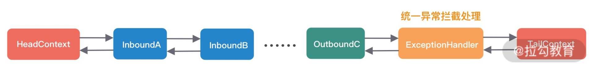

用户自定义的异常处理器代码示例如下：

```java
public class ExceptionHandler extends ChannelDuplexHandler {

    @Override
    public void exceptionCaught(ChannelHandlerContext ctx, Throwable cause) {
        if (cause instanceof RuntimeException) {
            System.out.println("Handle Business Exception Success.");
        }
    }
}
```

加入统一的异常处理器后，可以看到异常已经被优雅地拦截并处理掉了。这也是 Netty 推荐的最佳异常处理实践。

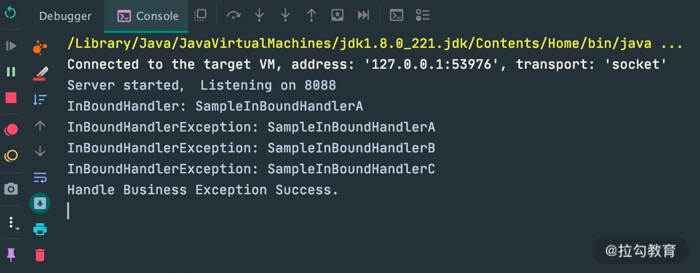

## 总结

本节课我们深入分析了 Pipeline 的设计原理与事件传播机制。那么课程最初我提出的几个问题你是否已经都找到答案了？我来做个简单的总结：

*   ChannelPipeline 是双向链表结构，包含 ChannelInboundHandler 和 ChannelOutboundHandler 两种处理器。
*   ChannelHandlerContext 是对 ChannelHandler 的封装，每个 ChannelHandler 都对应一个 ChannelHandlerContext，实际上 ChannelPipeline 维护的是与 ChannelHandlerContext 的关系。
*   Inbound 事件和 Outbound 事件的传播方向相反，Inbound 事件的传播方向为 Head -> Tail，而 Outbound 事件传播方向是 Tail -> Head。
*   异常事件的处理顺序与 ChannelHandler 的添加顺序相同，会依次向后传播，与 Inbound 事件和 Outbound 事件无关。

ChannelPipeline 精妙的设计思想值得我们学以致用，建议有兴趣的同学可以深入学习下这个组件的核心源码。在未来源码篇的课程中我们将会继续深入了解 ChannelPipeline 这个组件。

06 粘包拆包问题：如何获取一个完整的网络包？
=======================

本节课开始我们将学习 Netty 通信过程中的编解码技术。编解码技术这是实现网络通信的基础，让我们可以定义任何满足业务需求的应用层协议。在网络编程中，我们经常会使用各种网络传输协议，其中 TCP 是最常用的协议。我们首先需要了解的是 TCP 最基本的**拆包/粘包问题**以及常用的解决方案，才能更好地理解 Netty 的编解码框架。

## 为什么有拆包/粘包

TCP 传输协议是面向流的，没有数据包界限。客户端向服务端发送数据时，可能将一个完整的报文拆分成多个小报文进行发送，也可能将多个报文合并成一个大的报文进行发送。因此就有了拆包和粘包。

为什么会出现拆包/粘包现象呢？在网络通信的过程中，每次可以发送的数据包大小是受多种因素限制的，如 MTU 传输单元大小、MSS 最大分段大小、滑动窗口等。如果一次传输的网络包数据大小超过传输单元大小，那么我们的数据可能会拆分为多个数据包发送出去。如果每次请求的网络包数据都很小，一共请求了 10000 次，TCP 并不会分别发送 10000 次。因为 TCP 采用的 Nagle 算法对此作出了优化。如果你是一位网络新手，可能对这些概念并不非常清楚。那我们先了解下计算机网络中 MTU、MSS、Nagle 这些基础概念以及它们为什么会造成拆包/粘包问题。

### MTU 最大传输单元和 MSS 最大分段大小

**MTU（Maxitum Transmission Unit）** 是链路层一次最大传输数据的大小。MTU 一般来说大小为 1500 byte。**MSS（Maximum Segement Size）** 是指 TCP 最大报文段长度，它是传输层一次发送最大数据的大小。如下图所示，MTU 和 MSS 一般的计算关系为：MSS = MTU - IP 首部 - TCP首部，如果 MSS + TCP 首部 + IP 首部 > MTU，那么数据包将会被拆分为多个发送。这就是拆包现象。


### 滑动窗口

**滑动窗口**是 TCP 传输层用于流量控制的一种有效措施，也被称为**通告窗口**。滑动窗口是数据接收方设置的窗口大小，随后接收方会把窗口大小告诉发送方，以此限制发送方每次发送数据的大小，从而达到流量控制的目的。这样数据发送方不需要每发送一组数据就阻塞等待接收方确认，允许发送方同时发送多个数据分组，每次发送的数据都会被限制在窗口大小内。由此可见，滑动窗口可以大幅度提升网络吞吐量。

那么 TCP 报文是怎么确保数据包按次序到达且不丢数据呢？首先，所有的数据帧都是有编号的，TCP 并不会为每个报文段都回复 ACK 响应，它会对多个报文段回复一次 ACK。假设有三个报文段 A、B、C，发送方先发送了B、C，接收方则必须等待 A 报文段到达，如果一定时间内仍未等到 A 报文段，那么 B、C 也会被丢弃，发送方会发起重试。如果已接收到 A 报文段，那么将会回复发送方一次 ACK 确认。

### Nagle 算法

**Nagle 算法**于 1984 年被福特航空和通信公司定义为 TCP/IP 拥塞控制方法。它主要用于解决频繁发送小数据包而带来的网络拥塞问题。试想如果每次需要发送的数据只有 1 字节，加上 20 个字节 IP Header 和 20 个字节 TCP Header，每次发送的数据包大小为 41 字节，但是只有 1 字节是有效信息，这就造成了非常大的浪费。Nagle 算法可以理解为**批量发送**，也是我们平时编程中经常用到的优化思路，它是在数据未得到确认之前先写入缓冲区，等待数据确认或者缓冲区积攒到一定大小再把数据包发送出去。

Linux 在默认情况下是开启 Nagle 算法的，在大量小数据包的场景下可以有效地降低网络开销。但如果你的业务场景每次发送的数据都需要获得及时响应，那么 Nagle 算法就不能满足你的需求了，因为 Nagle 算法会有一定的数据延迟。你可以通过 Linux 提供的 TCP_NODELAY 参数禁用 Nagle 算法。Netty 中为了使数据传输延迟最小化，就默认禁用了 Nagle 算法，这一点与 Linux 操作系统的默认行为是相反的。

## 拆包/粘包的解决方案


在客户端和服务端通信的过程中，服务端一次读到的数据大小是不确定的。如上图所示，拆包/粘包可能会出现以下五种情况：

*   服务端恰巧读到了两个完整的数据包 A 和 B，没有出现拆包/粘包问题；
*   服务端接收到 A 和 B 粘在一起的数据包，服务端需要解析出 A 和 B；
*   服务端收到完整的 A 和 B 的一部分数据包 B-1，服务端需要解析出完整的 A，并等待读取完整的 B 数据包；
*   服务端接收到 A 的一部分数据包 A-1，此时需要等待接收到完整的 A 数据包；
*   数据包 A 较大，服务端需要多次才可以接收完数据包 A。

由于拆包/粘包问题的存在，数据接收方很难界定数据包的边界在哪里，很难识别出一个完整的数据包。所以需要提供一种机制来识别数据包的界限，这也是解决拆包/粘包的唯一方法：**定义应用层的通信协议**。下面我们一起看下主流协议的解决方案。

### 消息长度固定

每个数据报文都需要一个固定的长度。当接收方累计读取到固定长度的报文后，就认为已经获得一个完整的消息。当发送方的数据小于固定长度时，则需要空位补齐。

```
+----+------+------+---+----+
| AB | CDEF | GHIJ | K | LM |
+----+------+------+---+----+
```

假设我们的固定长度为 4 字节，那么如上所示的 5 条数据一共需要发送 4 个报文：

```
+------+------+------+------+
| ABCD | EFGH | IJKL | M000 |
+------+------+------+------+
```

消息定长法使用非常简单，但是缺点也非常明显，无法很好设定固定长度的值，如果长度太大会造成字节浪费，长度太小又会影响消息传输，所以在一般情况下消息定长法不会被采用。

### 特定分隔符

既然接收方无法区分消息的边界，那么我们可以在每次发送报文的尾部加上**特定分隔符**，接收方就可以根据特殊分隔符进行消息拆分。以下报文根据特定分隔符 \\n 按行解析，即可得到 AB、CDEF、GHIJ、K、LM 五条原始报文。

```
+-------------------------+
| AB\nCDEF\nGHIJ\nK\nLM\n |
+-------------------------+
```

由于在发送报文时尾部需要添加特定分隔符，所以对于分隔符的选择一定要避免和消息体中字符相同，以免冲突。否则可能出现错误的消息拆分。比较推荐的做法是将消息进行编码，例如 base64 编码，然后可以选择 64 个编码字符之外的字符作为特定分隔符。特定分隔符法在消息协议足够简单的场景下比较高效，例如大名鼎鼎的 Redis 在通信过程中采用的就是换行分隔符。

### 消息长度 \+ 消息内容

```
消息头     消息体
+--------+----------+
| Length |  Content |
+--------+----------+
```

**消息长度 \+ 消息内容**是项目开发中最常用的一种协议，如上展示了该协议的基本格式。消息头中存放消息的总长度，例如使用 4 字节的 int 值记录消息的长度，消息体实际的二进制的字节数据。接收方在解析数据时，首先读取消息头的长度字段 Len，然后紧接着读取长度为 Len 的字节数据，该数据即判定为一个完整的数据报文。依然以上述提到的原始字节数据为例，使用该协议进行编码后的结果如下所示：

```
+-----+-------+-------+----+-----+
| 2AB | 4CDEF | 4GHIJ | 1K | 2LM |
+-----+-------+-------+----+-----+
```

消息长度 \+ 消息内容的使用方式非常灵活，且不会存在消息定长法和特定分隔符法的明显缺陷。当然在消息头中不仅只限于存放消息的长度，而且可以自定义其他必要的扩展字段，例如消息版本、算法类型等。

## 总结

本节课我们详细讨论了 TCP 中的拆包/粘包问题，以及如何通过应用层的通信协议来解决拆包/粘包问题。其中基于消息长度 + 消息内容的变长协议是项目开发中最常用的一种方法，需要我们重点掌握，例如开源中间件 Dubbo、RocketMQ 等都基于该方法自定义了自己的通信协议，下节课我们将一起学习如何设计高效、可扩展、易维护的自定义网络通信协议。

07 接头暗语：如何利用 Netty 实现自定义协议通信？
=============================

既然是网络编程，自然离不开通信协议，应用层之间通信需要实现各种各样的网络协议。在项目开发的过程中，我们就需要去构建满足自己业务场景的应用层协议。在上节课中我们介绍了如何使用网络协议解决 TCP 拆包/粘包的底层问题，本节课我们将在此基础上继续讨论如何设计一个高效、可扩展、易维护的自定义通信协议，以及如何使用 Netty 实现自定义通信协议。

## 通信协议设计

所谓协议，就是通信双方事先商量好的接口暗语，在 TCP 网络编程中，发送方和接收方的数据包格式都是二进制，发送方将对象转化成二进制流发送给接收方，接收方获得二进制数据后需要知道如何解析成对象，所以协议是**双方能够正常通信的基础**。

目前市面上已经有不少通用的协议，例如 HTTP、HTTPS、JSON-RPC、FTP、IMAP、Protobuf 等。**通用协议**兼容性好，易于维护，各种异构系统之间可以实现无缝对接。如果在满足业务场景以及性能需求的前提下，推荐采用通用协议的方案。相比通用协议，自定义协议主要有以下优点。

*   **极致性能**：通用的通信协议考虑了很多兼容性的因素，必然在性能方面有所损失。
*   **扩展性**：自定义的协议相比通用协议更好扩展，可以更好地满足自己的业务需求。
*   **安全性**：通用协议是公开的，很多漏洞已经很多被黑客攻破。自定义协议更加**安全**，因为黑客需要先破解你的协议内容。

那么如何设计自定义的通信协议呢？这个答案见仁见智，但是设计通信协议有经验方法可循。结合实战经验我们一起看下一个完备的网络协议需要具备哪些基本要素。

### 1\. 魔数

魔数是通信双方协商的一个暗号，通常采用固定的几个字节表示。魔数的作用是**防止任何人随便向服务器的端口上发送数据**。服务端在接收到数据时会解析出前几个固定字节的魔数，然后做正确性比对。如果和约定的魔数不匹配，则认为是非法数据，可以直接关闭连接或者采取其他措施以增强系统的安全防护。魔数的思想在压缩算法、Java Class 文件等场景中都有所体现，例如 Class 文件开头就存储了魔数 0xCAFEBABE，在加载 Class 文件时首先会验证魔数的正确性。

### 2\. 协议版本号

随着业务需求的变化，协议可能需要对结构或字段进行改动，不同版本的协议对应的解析方法也是不同的。所以在生产级项目中强烈建议预留**协议版本号**这个字段。

### 3\. 序列化算法

序列化算法字段表示数据发送方应该采用何种方法将请求的对象转化为二进制，以及如何再将二进制转化为对象，如 JSON、Hessian、Java 自带序列化等。

### 4\. 报文类型

在不同的业务场景中，报文可能存在不同的类型。例如在 RPC 框架中有请求、响应、心跳等类型的报文，在 IM 即时通信的场景中有登陆、创建群聊、发送消息、接收消息、退出群聊等类型的报文。

### 5\. 长度域字段

长度域字段代表**请求数据**的长度，接收方根据长度域字段获取一个完整的报文。

### 6\. 请求数据

请求数据通常为序列化之后得到的**二进制流**，每种请求数据的内容是不一样的。

### 7\. 状态

状态字段用于标识**请求是否正常**。一般由被调用方设置。例如一次 RPC 调用失败，状态字段可被服务提供方设置为异常状态。

### 8\. 保留字段

保留字段是可选项，为了应对协议升级的可能性，可以预留若干字节的保留字段，以备不时之需。

通过以上协议基本要素的学习，我们可以得到一个较为通用的协议示例：

```
+---------------------------------------------------------------+
| 魔数 2byte | 协议版本号 1byte | 序列化算法 1byte | 报文类型 1byte  |
+---------------------------------------------------------------+
| 状态 1byte |        保留字段 4byte     |      数据长度 4byte     | 
+---------------------------------------------------------------+
|                   数据内容 （长度不定）                          |
+---------------------------------------------------------------+
```

## Netty 如何实现自定义通信协议

在学习完如何设计协议之后，我们又该如何在 Netty 中实现自定义的通信协议呢？其实 Netty 作为一个非常优秀的网络通信框架，已经为我们提供了非常丰富的编解码抽象基类，帮助我们更方便地基于这些抽象基类扩展实现自定义协议。

首先我们看下 Netty 中编解码器是如何分类的。

**Netty 常用编码器类型：**

*   MessageToByteEncoder 对象编码成字节流；
*   MessageToMessageEncoder 一种消息类型编码成另外一种消息类型。

**Netty 常用解码器类型：**

*   ByteToMessageDecoder/ReplayingDecoder 将字节流解码为消息对象；
*   MessageToMessageDecoder 将一种消息类型解码为另外一种消息类型。

编解码器可以分为**一次解码器**和**二次解码器**，一次解码器用于解决 TCP 拆包/粘包问题，按协议解析后得到的字节数据。如果你需要对解析后的字节数据做对象模型的转换，这时候便需要用到二次解码器，同理编码器的过程是反过来的。

*   一次编解码器：MessageToByteEncoder/ByteToMessageDecoder。
*   二次编解码器：MessageToMessageEncoder/MessageToMessageDecoder。

下面我们对 Netty 中常用的抽象编解码类进行详细的介绍。

### 抽象编码类

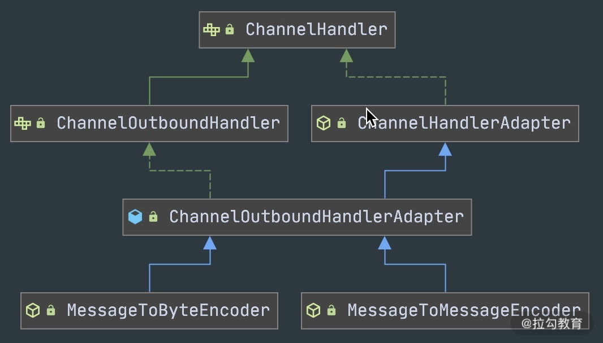

通过抽象编码类的继承图可以看出，编码类是 ChanneOutboundHandler 的抽象类实现，具体操作的是 Outbound 出站数据。

*   **MessageToByteEncoder**

MessageToByteEncoder 用于将对象编码成**字节流**，MessageToByteEncoder 提供了唯一的 encode 抽象方法，我们只需要实现**encode 方法**即可完成自定义编码。那么encode() 方法是在什么时候被调用的呢？我们一起看下MessageToByteEncoder 的核心源码片段，如下所示。

```java
@Override
public void write(ChannelHandlerContext ctx, Object msg, ChannelPromise promise) throws Exception {

    ByteBuf buf = null;

    try {
        if (acceptOutboundMessage(msg)) { // 1. 消息类型是否匹配
            @SuppressWarnings("unchecked")
            I cast = (I) msg;

            buf = allocateBuffer(ctx, cast, preferDirect); // 2. 分配 ByteBuf 资源

            try {
                encode(ctx, cast, buf); // 3. 执行 encode 方法完成数据编码
            } finally {
                ReferenceCountUtil.release(cast);
            }

            if (buf.isReadable()) {
                ctx.write(buf, promise); // 4. 向后传递写事件
            } else {
                buf.release();
                ctx.write(Unpooled.EMPTY_BUFFER, promise);
            }
            buf = null;
        } else {
            ctx.write(msg, promise);
        }
    } catch (EncoderException e) {
        throw e;
    } catch (Throwable e) {
        throw new EncoderException(e);
    } finally {
        if (buf != null) {
            buf.release();
        }
    }
}
```

MessageToByteEncoder 重写了 ChanneOutboundHandler 的 write() 方法，其主要逻辑分为以下几个步骤：

1.  acceptOutboundMessage 判断是否有匹配的消息类型，如果匹配需要执行编码流程，如果不匹配直接继续传递给下一个 ChannelOutboundHandler；
2.  分配 ByteBuf 资源，默认使用**堆外内存；**
3.  调用子类实现的 encode 方法完成数据编码，一旦消息被成功编码，会通过调用 ReferenceCountUtil.release(cast) 自动释放；
4.  如果 ByteBuf 可读，说明已经成功编码得到数据，然后写入 ChannelHandlerContext 交到下一个节点；如果 ByteBuf 不可读，则释放 ByteBuf 资源，向下传递空的 ByteBuf 对象。

编码器实现非常简单，不需要关注拆包/粘包问题。如下例子，展示了如何将字符串类型的数据写入到 ByteBuf 实例，ByteBuf 实例将传递给 ChannelPipeline 链表中的下一个 ChannelOutboundHandler。

```java
public class StringToByteEncoder extends MessageToByteEncoder<String> {

        @Override
        protected void encode(ChannelHandlerContext channelHandlerContext, String data, ByteBuf byteBuf) throws Exception {
            byteBuf.writeBytes(data.getBytes());
        }
}
```

*   **MessageToMessageEncoder**

MessageToMessageEncoder 与 MessageToByteEncoder 类似，同样只需要实现 encode 方法。与 MessageToByteEncoder 不同的是，MessageToMessageEncoder 是将一种格式的消息转换为另外一种格式的消息。其中第二个 Message 所指的可以是任意一个对象，如果该对象是 ByteBuf 类型，那么基本上和 MessageToByteEncoder 的实现原理是一致的。此外 MessageToByteEncoder 的输出结果是对象列表，编码后的结果属于**中间对象**，最终仍然会转化成 ByteBuf 进行传输。

MessageToMessageEncoder 常用的**实现子类**有 StringEncoder、LineEncoder、Base64Encoder 等。以 StringEncoder 为例看下 MessageToMessageEncoder 的用法。源码示例如下：将 CharSequence 类型（String、StringBuilder、StringBuffer 等）转换成 ByteBuf 类型，结合 StringDecoder 可以直接实现 String 类型数据的编解码。

```java
@Override
protected void encode(ChannelHandlerContext ctx, CharSequence msg, List<Object> out) throws Exception {
    if (msg.length() == 0) {
        return;
    }
    out.add(ByteBufUtil.encodeString(ctx.alloc(), CharBuffer.wrap(msg), charset));
}
```

### 抽象解码类

同样，我们先看下抽象解码类的继承关系图。解码类是 ChanneInboundHandler 的抽象类实现，操作的是 Inbound 入站数据。解码器实现的难度要远大于编码器，因为解码器需要考虑拆包/粘包问题。由于接收方有可能没有接收到完整的消息，所以解码框架需要对入站的数据做缓冲操作，直至获取到完整的消息。


*   **抽象解码类 ByteToMessageDecoder。**

首先，我们看下 ByteToMessageDecoder 定义的抽象方法：

```java
public abstract class ByteToMessageDecoder extends ChannelInboundHandlerAdapter {

    protected abstract void decode(ChannelHandlerContext ctx, ByteBuf in, List<Object> out) throws Exception;

    protected void decodeLast(ChannelHandlerContext ctx, ByteBuf in, List<Object> out) throws Exception {
        if (in.isReadable()) {
            decodeRemovalReentryProtection(ctx, in, out);
        }
    }
}
```

decode() 是用户必须实现的抽象方法，在该方法在调用时需要传入接收的数据 ByteBuf，及用来添加编码后消息的 List。由于 TCP 粘包问题，ByteBuf 中可能包含多个有效的报文，或者不够一个完整的报文。Netty 会重复回调 decode() 方法，直到没有解码出新的完整报文可以添加到 List 当中，或者 ByteBuf 没有更多可读取的数据为止。如果此时 List 的内容不为空，那么会传递给 ChannelPipeline 中的下一个ChannelInboundHandler。

此外 ByteToMessageDecoder 还定义了 decodeLast() 方法。为什么抽象解码器要比编码器多一个 decodeLast() 方法呢？因为 decodeLast 在 Channel 关闭后会被调用一次，主要用于处理 ByteBuf 最后剩余的字节数据。Netty 中 decodeLast 的默认实现只是简单调用了 decode() 方法。如果有特殊的业务需求，则可以通过重写 decodeLast() 方法扩展自定义逻辑。

ByteToMessageDecoder 还有一个抽象子类是 ReplayingDecoder。它封装了缓冲区的管理，在读取缓冲区数据时，你无须再对字节长度进行检查。因为如果没有足够长度的字节数据，ReplayingDecoder 将终止解码操作。ReplayingDecoder 的性能相比直接使用 ByteToMessageDecoder 要慢，大部分情况下并不推荐使用 ReplayingDecoder。

*   **抽象解码类 MessageToMessageDecoder。**

MessageToMessageDecoder 与 ByteToMessageDecoder 作用类似，都是将一种消息类型的编码成另外一种消息类型。与 ByteToMessageDecoder 不同的是 MessageToMessageDecoder 并不会对数据报文进行缓存，它主要用作转换消息模型。比较推荐的做法是使用 ByteToMessageDecoder 解析 TCP 协议，解决拆包/粘包问题。解析得到有效的 ByteBuf 数据，然后传递给后续的 MessageToMessageDecoder 做数据对象的转换，具体流程如下图所示。 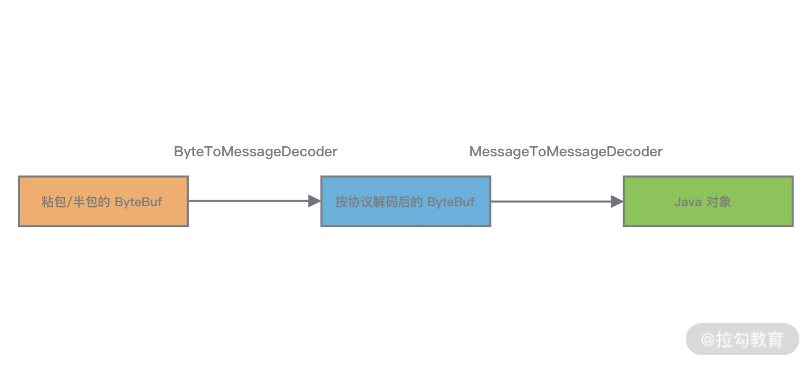

## 通信协议实战

在上述通信协议设计的小节内容中，我们提到了协议的基本要素并给出了一个较为通用的协议示例。下面我们通过 Netty 的编辑码框架实现该协议的解码器，加深我们对 Netty 编解码框架的理解。

在实现协议编码器之前，我们首先需要清楚一个问题：如何判断 ByteBuf 是否存在完整的报文？最常用的做法就是通过读取消息长度 dataLength 进行判断。如果 ByteBuf 的可读数据长度小于 dataLength，说明 ByteBuf 还不够获取一个完整的报文。在该协议前面的消息头部分包含了魔数、协议版本号、数据长度等固定字段，共 14 个字节。固定字段长度和数据长度可以作为我们判断消息完整性的依据，具体编码器实现逻辑示例如下：

```java
/*
+---------------------------------------------------------------+
| 魔数 2byte | 协议版本号 1byte | 序列化算法 1byte | 报文类型 1byte  |
+---------------------------------------------------------------+
| 状态 1byte |        保留字段 4byte     |      数据长度 4byte     | 
+---------------------------------------------------------------+
|                   数据内容 （长度不定）                          |
+---------------------------------------------------------------+
 */

@Override
public final void decode(ChannelHandlerContext ctx, ByteBuf in, List<Object> out) {

    // 判断 ByteBuf 可读取字节
    if (in.readableBytes() < 14) { 
        return;
    }
    in.markReaderIndex(); // 标记 ByteBuf 读指针位置
    in.skipBytes(2); // 跳过魔数
    in.skipBytes(1); // 跳过协议版本号
    byte serializeType = in.readByte();
    in.skipBytes(1); // 跳过报文类型
    in.skipBytes(1); // 跳过状态字段
    in.skipBytes(4); // 跳过保留字段
    int dataLength = in.readInt();
    if (in.readableBytes() < dataLength) {
        in.resetReaderIndex(); // 重置 ByteBuf 读指针位置
        return;
    }
    byte[] data = new byte[dataLength];
    in.readBytes(data);
    SerializeService serializeService = getSerializeServiceByType(serializeType);
    Object obj = serializeService.deserialize(data);
    if (obj != null) {
        out.add(obj);
    }
}
```

上述实现中所涉及的 ByteBuf API，在本章节就不做详细阐述了。在本专栏第三章我们会深入学习 ByteBuf。

## 总结

本节课我们学习了协议设计的基本要素，以及如何使用 Netty 实现自定义协议。Netty 提供了一组 ChannelHandler 实现的抽象类，在项目开发中基于这些抽象类实现自定义的编解码器具备较好的可扩展性，最后通过具体示例协议的实战加深对编解码器的理解。你学会了吗？

当然 Netty 在编解码方面所做的工作远不止于此。它还提供了丰富的开箱即用的编解码器，下节课我们便一起探索实用的编解码技巧。


08 开箱即用：Netty 支持哪些常用的解码器？
=========================

在前两节课我们介绍了 TCP 拆包/粘包的问题，以及如何使用 Netty 实现自定义协议的编解码。可以看到，网络通信的底层实现，Netty 都已经帮我们封装好了，我们只需要扩展 ChannelHandler 实现自定义的编解码逻辑即可。更加人性化的是，Netty 提供了很多开箱即用的解码器，这些解码器基本覆盖了 TCP 拆包/粘包的通用解决方案。本节课我们将对 Netty 常用的解码器进行讲解，一起探索下它们有哪些用法和技巧。

在本节课开始之前，我们首先回顾一下 TCP 拆包/粘包的主流解决方案。并梳理出 Netty 对应的编码器类。

## 固定长度解码器 FixedLengthFrameDecoder

固定长度解码器 FixedLengthFrameDecoder 非常简单，直接通过构造函数设置固定长度的大小 frameLength，无论接收方一次获取多大的数据，都会严格按照 frameLength 进行解码。如果累积读取到长度大小为 frameLength 的消息，那么解码器认为已经获取到了一个完整的消息。如果消息长度小于 frameLength，FixedLengthFrameDecoder 解码器会一直等后续数据包的到达，直至获得完整的消息。下面我们通过一个例子感受一下使用 Netty 实现固定长度解码是多么简单。

```java
public class EchoServer {
        public void startEchoServer(int port) throws Exception {
            EventLoopGroup bossGroup = new NioEventLoopGroup();
        EventLoopGroup workerGroup = new NioEventLoopGroup();
        try {
                ServerBootstrap b = new ServerBootstrap();
            b.group(bossGroup, workerGroup)
                    .channel(NioServerSocketChannel.class)
                    .childHandler(new ChannelInitializer<SocketChannel>() {
                            @Override
                        public void initChannel(SocketChannel ch) {
                                ch.pipeline().addLast(new FixedLengthFrameDecoder(10));
                            ch.pipeline().addLast(new EchoServerHandler());
                        }
                    });
            ChannelFuture f = b.bind(port).sync();
            f.channel().closeFuture().sync();
        } finally {
                bossGroup.shutdownGracefully();
            workerGroup.shutdownGracefully();
        }
    }
    public static void main(String[] args) throws Exception {
            new EchoServer().startEchoServer(8088);
    }
}
@Sharable
public class EchoServerHandler extends ChannelInboundHandlerAdapter {
        @Override
    public void channelRead(ChannelHandlerContext ctx, Object msg) {
            System.out.println("Receive client : [" + ((ByteBuf) msg).toString(CharsetUtil.UTF_8) + "]");
    }
}
```

在上述服务端的代码中使用了固定 10 字节的解码器，并在解码之后通过 EchoServerHandler 打印结果。我们可以启动服务端，通过 telnet 命令像服务端发送数据，观察代码输出的结果。

客户端输入：

```shell
telnet localhost 8088
Trying ::1...
Connected to localhost.
Escape character is '^]'.
1234567890123
456789012
```

服务端输出：

```shell
Receive client : [1234567890]
Receive client : [123
45678]
```

## 特殊分隔符解码器 DelimiterBasedFrameDecoder

使用特殊分隔符解码器 DelimiterBasedFrameDecoder 之前我们需要了解以下几个属性的作用。

*   **delimiters**

delimiters 指定特殊分隔符，通过写入 ByteBuf 作为**参数**传入。delimiters 的类型是 ByteBuf 数组，所以我们可以同时指定多个分隔符，但是最终会选择长度最短的分隔符进行消息拆分。

例如接收方收到的数据为：

```
+--------------+
| ABC\nDEF\r\n |
+--------------+
```

如果指定的多个分隔符为 \\n 和 \\r\\n，DelimiterBasedFrameDecoder 会退化成使用 LineBasedFrameDecoder 进行解析，那么会解码出两个消息。

```
+-----+-----+
| ABC | DEF |
+-----+-----+
```

如果指定的特定分隔符只有 \\r\\n，那么只会解码出一个消息：

```
+----------+
| ABC\nDEF |
+----------+
```

*   **maxLength**

maxLength 是报文最大长度的限制。如果超过 maxLength 还没有检测到指定分隔符，将会抛出 TooLongFrameException。可以说 maxLength 是对程序在极端情况下的一种**保护措施**。

*   **failFast**

failFast 与 maxLength 需要搭配使用，通过设置 failFast 可以控制抛出 TooLongFrameException 的时机，可以说 Netty 在细节上考虑得面面俱到。如果 failFast=true，那么在超出 maxLength 会立即抛出 TooLongFrameException，不再继续进行解码。如果 failFast=false，那么会等到解码出一个完整的消息后才会抛出 TooLongFrameException。

*   **stripDelimiter**

stripDelimiter 的作用是判断解码后得到的消息是否去除分隔符。如果 stripDelimiter=false，特定分隔符为 \\n，那么上述数据包解码出的结果为：

```
+-------+---------+
| ABC\n | DEF\r\n |
+-------+---------+
```

下面我们还是结合代码示例学习 DelimiterBasedFrameDecoder 的用法，依然以固定编码器小节中使用的代码为基础稍做改动，引入特殊分隔符解码器 DelimiterBasedFrameDecoder：

```java
b.group(bossGroup, workerGroup)
    .channel(NioServerSocketChannel.class)
    .childHandler(new ChannelInitializer<SocketChannel>() {
        @Override
        public void initChannel(SocketChannel ch) {
            ByteBuf delimiter = Unpooled.copiedBuffer("&".getBytes());
            ch.pipeline().addLast(new DelimiterBasedFrameDecoder(10, true, true, delimiter));
            ch.pipeline().addLast(new EchoServerHandler());
        }
    });
```

我们依然通过 telnet 模拟客户端发送数据，观察代码输出的结果，可以发现由于 maxLength 设置的只有 10，所以在解析到第三个消息时抛出异常。

客户端输入：

```shell
telnet localhost 8088
Trying ::1...
Connected to localhost.
Escape character is '^]'.
hello&world&1234567890ab
```

服务端输出：

```shell
Receive client : [hello]
Receive client : [world]
九月 25, 2020 8:46:01 下午 io.netty.channel.DefaultChannelPipeline onUnhandledInboundException
警告: An exceptionCaught() event was fired, and it reached at the tail of the pipeline. It usually means the last handler in the pipeline did not handle th
exception.
io.netty.handler.codec.TooLongFrameException: frame length exceeds 10: 13 - discarded
	at io.netty.handler.codec.DelimiterBasedFrameDecoder.fail(DelimiterBasedFrameDecoder.java:302)
	at io.netty.handler.codec.DelimiterBasedFrameDecoder.decode(DelimiterBasedFrameDecoder.java:268)
	at io.netty.handler.codec.DelimiterBasedFrameDecoder.decode(DelimiterBasedFrameDecoder.java:218)
```

## 长度域解码器 LengthFieldBasedFrameDecoder

长度域解码器 LengthFieldBasedFrameDecoder 是解决 TCP 拆包/粘包问题最常用的**解码器。**它基本上可以覆盖大部分基于长度拆包场景，开源消息中间件 RocketMQ 就是使用 LengthFieldBasedFrameDecoder 进行解码的。LengthFieldBasedFrameDecoder 相比 FixedLengthFrameDecoder 和 DelimiterBasedFrameDecoder 要复杂一些，接下来我们就一起学习下这个强大的解码器。

首先我们同样先了解 LengthFieldBasedFrameDecoder 中的几个重要属性，这里我主要把它们分为两个部分：**长度域解码器特有属性**以及**与其他解码器（如特定分隔符解码器）的相似的属性**。

*   **长度域解码器特有属性。**

```java
// 长度字段的偏移量，也就是存放长度数据的起始位置
private final int lengthFieldOffset; 
// 长度字段所占用的字节数
private final int lengthFieldLength; 
/*
 * 消息长度的修正值
 *
 * 在很多较为复杂一些的协议设计中，长度域不仅仅包含消息的长度，而且包含其他的数据，如版本号、数据类型、数据状态等，那么这时候我们需要使用 lengthAdjustment 进行修正
 * 
 * lengthAdjustment = 包体的长度值 - 长度域的值
 *
 */
private final int lengthAdjustment; 
// 解码后需要跳过的初始字节数，也就是消息内容字段的起始位置
private final int initialBytesToStrip;
// 长度字段结束的偏移量，lengthFieldEndOffset = lengthFieldOffset + lengthFieldLength
private final int lengthFieldEndOffset;
```

*   **与固定长度解码器和特定分隔符解码器相似的属性。**

```java
private final int maxFrameLength; // 报文最大限制长度
private final boolean failFast; // 是否立即抛出 TooLongFrameException，与 maxFrameLength 搭配使用
private boolean discardingTooLongFrame; // 是否处于丢弃模式
private long tooLongFrameLength; // 需要丢弃的字节数
private long bytesToDiscard; // 累计丢弃的字节数
```

下面我们结合具体的示例来解释下每种参数的组合，其实在 Netty LengthFieldBasedFrameDecoder 源码的注释中已经描述得非常详细，一共给出了 7 个场景示例，理解了这些示例基本上可以真正掌握 LengthFieldBasedFrameDecoder 的参数用法。

**示例 1：典型的基于消息长度 + 消息内容的解码。**

```
BEFORE DECODE (14 bytes)         AFTER DECODE (14 bytes)
+--------+----------------+      +--------+----------------+
| Length | Actual Content |----->| Length | Actual Content |
| 0x000C | "HELLO, WORLD" |      | 0x000C | "HELLO, WORLD" |
+--------+----------------+      +--------+----------------+
```

上述协议是最基本的格式，报文只包含消息长度 Length 和消息内容 Content 字段，其中 Length 为 16 进制表示，共占用 2 字节，Length 的值 0x000C 代表 Content 占用 12 字节。该协议对应的解码器参数组合如下：

*   lengthFieldOffset = 0，因为 Length 字段就在报文的开始位置。
*   lengthFieldLength = 2，协议设计的固定长度。
*   lengthAdjustment = 0，Length 字段只包含消息长度，不需要做任何修正。
*   initialBytesToStrip = 0，解码后内容依然是 Length + Content，不需要跳过任何初始字节。

**示例 2：解码结果需要截断。**

```
BEFORE DECODE (14 bytes)         AFTER DECODE (12 bytes)
+--------+----------------+      +----------------+
| Length | Actual Content |----->| Actual Content |
| 0x000C | "HELLO, WORLD" |      | "HELLO, WORLD" |
+--------+----------------+      +----------------+
```

示例 2 和示例 1 的区别在于解码后的结果只包含消息内容，其他的部分是不变的。该协议对应的解码器参数组合如下：

*   lengthFieldOffset = 0，因为 Length 字段就在报文的开始位置。
*   lengthFieldLength = 2，协议设计的固定长度。
*   lengthAdjustment = 0，Length 字段只包含消息长度，不需要做任何修正。
*   initialBytesToStrip = 2，跳过 Length 字段的字节长度，解码后 ByteBuf 中只包含 Content字段。

**示例 3：长度字段包含消息长度和消息内容所占的字节。**

```
BEFORE DECODE (14 bytes)         AFTER DECODE (14 bytes)
+--------+----------------+      +--------+----------------+
| Length | Actual Content |----->| Length | Actual Content |
| 0x000E | "HELLO, WORLD" |      | 0x000E | "HELLO, WORLD" |
+--------+----------------+      +--------+----------------+
```

与前两个示例不同的是，示例 3 的 Length 字段包含 Length 字段自身的固定长度以及 Content 字段所占用的字节数，Length 的值为 0x000E（2 + 12 = 14 字节），在 Length 字段值（14 字节）的基础上做 lengthAdjustment（-2）的修正，才能得到真实的 Content 字段长度，所以对应的解码器参数组合如下：

*   lengthFieldOffset = 0，因为 Length 字段就在报文的开始位置。
*   lengthFieldLength = 2，协议设计的固定长度。
*   lengthAdjustment = -2，长度字段为 14 字节，需要减 2 才是拆包所需要的长度。
*   initialBytesToStrip = 0，解码后内容依然是 Length + Content，不需要跳过任何初始字节。

**示例 4：基于长度字段偏移的解码。**

```
BEFORE DECODE (17 bytes)                      AFTER DECODE (17 bytes)
+----------+----------+----------------+      +----------+----------+----------------+
| Header 1 |  Length  | Actual Content |----->| Header 1 |  Length  | Actual Content |
|  0xCAFE  | 0x00000C | "HELLO, WORLD" |      |  0xCAFE  | 0x00000C | "HELLO, WORLD" |
+----------+----------+----------------+      +----------+----------+----------------+
```

示例 4 中 Length 字段不再是报文的起始位置，Length 字段的值为 0x00000C，表示 Content 字段占用 12 字节，该协议对应的解码器参数组合如下：

*   lengthFieldOffset = 2，需要跳过 Header 1 所占用的 2 字节，才是 Length 的起始位置。
*   lengthFieldLength = 3，协议设计的固定长度。
*   lengthAdjustment = 0，Length 字段只包含消息长度，不需要做任何修正。
*   initialBytesToStrip = 0，解码后内容依然是完整的报文，不需要跳过任何初始字节。

**示例 5：长度字段与内容字段不再相邻。**

```
BEFORE DECODE (17 bytes)                      AFTER DECODE (17 bytes)
+----------+----------+----------------+      +----------+----------+----------------+
|  Length  | Header 1 | Actual Content |----->|  Length  | Header 1 | Actual Content |
| 0x00000C |  0xCAFE  | "HELLO, WORLD" |      | 0x00000C |  0xCAFE  | "HELLO, WORLD" |
+----------+----------+----------------+      +----------+----------+----------------+
```

示例 5 中的 Length 字段之后是 Header 1，Length 与 Content 字段不再相邻。Length 字段所表示的内容略过了 Header 1 字段，所以也需要通过 lengthAdjustment 修正才能得到 Header + Content 的内容。示例 5 所对应的解码器参数组合如下：

*   lengthFieldOffset = 0，因为 Length 字段就在报文的开始位置。
*   lengthFieldLength = 3，协议设计的固定长度。
*   lengthAdjustment = 2，由于 Header + Content 一共占用 2 + 12 = 14 字节，所以 Length 字段值（12 字节）加上 lengthAdjustment（2 字节）才能得到 Header + Content 的内容（14 字节）。
*   initialBytesToStrip = 0，解码后内容依然是完整的报文，不需要跳过任何初始字节。

**示例 6：基于长度偏移和长度修正的解码。**

```
BEFORE DECODE (16 bytes)                       AFTER DECODE (13 bytes)
+------+--------+------+----------------+      +------+----------------+
| HDR1 | Length | HDR2 | Actual Content |----->| HDR2 | Actual Content |
| 0xCA | 0x000C | 0xFE | "HELLO, WORLD" |      | 0xFE | "HELLO, WORLD" |
+------+--------+------+----------------+      +------+----------------+
```

示例 6 中 Length 字段前后分为别 HDR1 和 HDR2 字段，各占用 1 字节，所以既需要做长度字段的偏移，也需要做 lengthAdjustment 修正，具体修正的过程与 示例 5 类似。对应的解码器参数组合如下：

*   lengthFieldOffset = 1，需要跳过 HDR1 所占用的 1 字节，才是 Length 的起始位置。
*   lengthFieldLength = 2，协议设计的固定长度。
*   lengthAdjustment = 1，由于 HDR2 + Content 一共占用 1 + 12 = 13 字节，所以 Length 字段值（12 字节）加上 lengthAdjustment（1）才能得到 HDR2 + Content 的内容（13 字节）。
*   initialBytesToStrip = 3，解码后跳过 HDR1 和 Length 字段，共占用 3 字节。

**示例 7：长度字段包含除 Content 外的多个其他字段。**

```
BEFORE DECODE (16 bytes)                       AFTER DECODE (13 bytes)
+------+--------+------+----------------+      +------+----------------+
| HDR1 | Length | HDR2 | Actual Content |----->| HDR2 | Actual Content |
| 0xCA | 0x0010 | 0xFE | "HELLO, WORLD" |      | 0xFE | "HELLO, WORLD" |
+------+--------+------+----------------+      +------+----------------+
```

示例 7 与 示例 6 的区别在于 Length 字段记录了整个报文的长度，包含 Length 自身所占字节、HDR1 、HDR2 以及 Content 字段的长度，解码器需要知道如何进行 lengthAdjustment 调整，才能得到 HDR2 和 Content 的内容。所以我们可以采用如下的解码器参数组合：

*   lengthFieldOffset = 1，需要跳过 HDR1 所占用的 1 字节，才是 Length 的起始位置。
*   lengthFieldLength = 2，协议设计的固定长度。
*   lengthAdjustment = -3，Length 字段值（16 字节）需要减去 HDR1（1 字节） 和 Length 自身所占字节长度（2 字节）才能得到 HDR2 和 Content 的内容（1 + 12 = 13 字节）。
*   initialBytesToStrip = 3，解码后跳过 HDR1 和 Length 字段，共占用 3 字节。

以上 7 种示例涵盖了 LengthFieldBasedFrameDecoder 大部分的使用场景，你是否学会了呢？最后留一个小任务，在上一节课程中我们设计了一个较为通用的协议，如下所示。如何使用长度域解码器 LengthFieldBasedFrameDecoder 完成该协议的解码呢？抓紧自己尝试下吧。

```
+---------------------------------------------------------------+
| 魔数 2byte | 协议版本号 1byte | 序列化算法 1byte | 报文类型 1byte  |
+---------------------------------------------------------------+
| 状态 1byte |        保留字段 4byte     |      数据长度 4byte     | 
+---------------------------------------------------------------+
|                   数据内容 （长度不定）                          |
+---------------------------------------------------------------+
```

## 总结

本节课我们介绍了三种常用的解码器，从中我们可以体会到 Netty 在设计上的优雅，只需要调整参数就可以轻松实现各种功能。在健壮性上，Netty 也考虑得非常全面，很多边界情况 Netty 都贴心地增加了保护性措施。实现一个健壮的解码器并不容易，很可能因为一次解析错误就会导致解码器一直处理错乱的状态。如果你使用了基于长度编码的二进制协议，那么推荐你使用 LengthFieldBasedFrameDecoder，它已经可以满足实际项目中的大部分场景，基本不需要再自定义实现了。希望朋友们在项目开发中能够学以致用。


09 数据传输：writeAndFlush 处理流程剖析
============================

在前面几节课我们介绍了 Netty 编解码的基础知识，想必你已经掌握了 Netty 实现编解码逻辑的技巧。那么接下来我们如何将编解码后的结果发送出去呢？在 Netty 中实现数据发送非常简单，只需要调用 writeAndFlush 方法即可，这么简单的一行代码究竟 Netty 帮我们完成了哪些事情呢？一起进入我们今天这节课要探讨的主题吧！

## Pipeline 事件传播回顾

在介绍 writeAndFlush 的工作原理之前，我们首先回顾下 Pipeline 的事件传播机制，因为他们是息息相关的。根据网络数据的流向，ChannelPipeline 分为入站 ChannelInboundHandler 和出站 ChannelOutboundHandler 两种处理器，如下图所示。

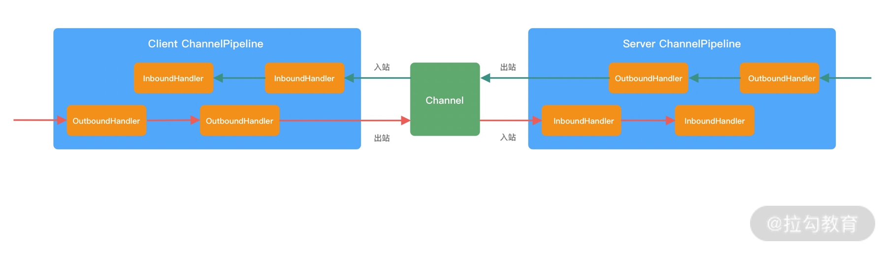

当我们从客户端向服务端发送请求，或者服务端向客户端响应请求结果都属于出站处理器 ChannelOutboundHandler 的行为，所以当我们调用 writeAndFlush 时，数据一定会在 Pipeline 中进行传播。

在这里我首先抛出几个问题，学完本节课后可以用于检验下自己是否真的理解了 writeAndFlush 的原理。

*   writeAndFlush 是如何触发事件传播的？数据是怎样写到 Socket 底层的？
*   为什么会有 write 和 flush 两个动作？执行 flush 之前数据是如何存储的？
*   writeAndFlush 是同步还是异步？它是线程安全的吗？

## writeAndFlush 事件传播分析

为了便于我们分析 writeAndFlush 的事件传播流程，首先我们通过代码模拟一个最简单的数据出站场景，服务端在接收到客户端的请求后，将响应结果编码后写回客户端。

以下是服务端的启动类，分别注册了三个 ChannelHandler：**固定长度解码器 FixedLengthFrameDecoder**、**响应结果编码器 ResponseSampleEncoder**、**业务逻辑处理器 RequestSampleHandler**。

```java
public class EchoServer {
    public void startEchoServer(int port) throws Exception {
        EventLoopGroup bossGroup = new NioEventLoopGroup();
        EventLoopGroup workerGroup = new NioEventLoopGroup();
        try {
            ServerBootstrap b = new ServerBootstrap();
            b.group(bossGroup, workerGroup)
             .channel(NioServerSocketChannel.class)
             .childHandler(new ChannelInitializer<SocketChannel>() {
                @Override
                public void initChannel(SocketChannel ch) {
                    ch.pipeline().addLast(new FixedLengthFrameDecoder(10));
                    ch.pipeline().addLast(new ResponseSampleEncoder());
                    ch.pipeline().addLast(new RequestSampleHandler());
                }
            });
            ChannelFuture f = b.bind(port).sync();
            f.channel().closeFuture().sync();
        } finally {
            bossGroup.shutdownGracefully();
            workerGroup.shutdownGracefully();
        }
    }
    public static void main(String[] args) throws Exception {
            new EchoServer().startEchoServer(8088);
    }
}
```

其中固定长度解码器 FixedLengthFrameDecoder 是 Netty 自带的解码器，在这里就不做赘述了。下面我们分别看下另外两个 ChannelHandler 的具体实现。

响应结果编码器 ResponseSampleEncoder 用于将服务端的处理结果进行编码，具体的实现逻辑如下：

```java
public class ResponseSampleEncoder extends MessageToByteEncoder<ResponseSample> {
    @Override
    protected void encode(ChannelHandlerContext ctx, ResponseSample msg, ByteBuf out) {
        if (msg != null) {
            out.writeBytes(msg.getCode().getBytes());
            out.writeBytes(msg.getData().getBytes());
            out.writeLong(msg.getTimestamp());
        }
    }
}
```

RequestSampleHandler 主要负责客户端的数据处理，并通过调用 ctx.channel().writeAndFlush 向客户端返回 ResponseSample 对象，其中包含返回码、响应数据以及时间戳。

```java
public class RequestSampleHandler extends ChannelInboundHandlerAdapter {
    @Override
    public void channelRead(ChannelHandlerContext ctx, Object msg) {
        String data = ((ByteBuf) msg).toString(CharsetUtil.UTF_8);
        ResponseSample response = new ResponseSample("OK", data, System.currentTimeMillis());
        ctx.channel().writeAndFlush(response);
    }
}
```

通过以上的代码示例我们可以描绘出 Pipeline 的链表结构，如下图所示。

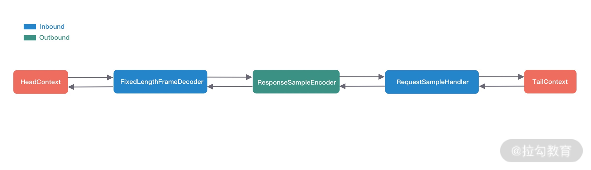

那么当 RequestSampleHandler 调用 writeAndFlush 时，数据是如何在 Pipeline 中传播、处理并向客户端发送的呢？下面我们结合该场景对 writeAndFlush 的处理流程做深入的分析。

既然 writeAndFlush 是特有的出站操作，那么我们猜测它是从 Pipeline 的 Tail 节点开始传播的，然后一直向前传播到 Head 节点。我们跟进去 ctx.channel().writeAndFlush 的源码，如下所示，发现 DefaultChannelPipeline 类中果然是调用的 Tail 节点 writeAndFlush 方法。

```java
@Override
public final ChannelFuture writeAndFlush(Object msg) {
    return tail.writeAndFlush(msg);
}
```

继续跟进 tail.writeAndFlush 的源码，最终会定位到 AbstractChannelHandlerContext 中的 write 方法。该方法是 writeAndFlush 的**核心逻辑**，具体见以下源码。

```java
private void write(Object msg, boolean flush, ChannelPromise promise) {
    // ...... 省略部分非核心代码 ......
    // 找到 Pipeline 链表中下一个 Outbound 类型的 ChannelHandler 节点
    final AbstractChannelHandlerContext next = findContextOutbound(flush ? (MASK_WRITE | MASK_FLUSH) : MASK_WRITE);
    final Object m = pipeline.touch(msg, next);
    EventExecutor executor = next.executor();
    // 判断当前线程是否是 NioEventLoop 中的线程
    if (executor.inEventLoop()) {
        if (flush) {
            // 因为 flush == true，所以流程走到这里
            next.invokeWriteAndFlush(m, promise);
        } else {
            next.invokeWrite(m, promise);
        }
    } else {
        final AbstractWriteTask task;
        if (flush) {
            task = WriteAndFlushTask.newInstance(next, m, promise);
        }  else {
            task = WriteTask.newInstance(next, m, promise);
        }
        if (!safeExecute(executor, task, promise, m)) {
            task.cancel();
        }
    }
}
```

首先我们确认下方法的入参，因为我们需要执行 flush 动作，所以 flush == true；write 方法还需要 ChannelPromise 参数，可见写操作是个异步的过程。AbstractChannelHandlerContext 会默认初始化一个 ChannelPromise 完成该异步操作，ChannelPromise 内部持有当前的 Channel 和 EventLoop，此外你可以向 ChannelPromise 中注册回调监听 listener 来获得异步操作的结果。

write 方法的核心逻辑主要分为三个重要步骤，我已经以注释的形式在源码中标注出来。下面我们将结合上文中的 EchoServer 代码示例详细分析 write 方法的执行机制。

第一步，调用 findContextOutbound 方法找到 Pipeline 链表中下一个 Outbound 类型的 ChannelHandler。在我们模拟的场景中下一个 Outbound 节点是 ResponseSampleEncoder。

第二步，通过 inEventLoop 方法判断当前线程的身份标识，如果当前线程和 EventLoop 分配给当前 Channel 的线程是同一个线程的话，那么所提交的任务将被立即执行。否则当前的操作将被封装成一个 Task 放入到 EventLoop 的任务队列，稍后执行。所以 writeAndFlush 是否是线程安全的呢，你心里有答案了吗？

第三步，因为 flush== true，将会直接执行 next.invokeWriteAndFlush(m, promise) 这行代码，我们跟进去源码。发现最终会它会执行下一个 ChannelHandler 节点的 write 方法，那么流程又回到了 到 AbstractChannelHandlerContext 中重复执行 write 方法，继续寻找下一个 Outbound 节点。

```java
private void invokeWriteAndFlush(Object msg, ChannelPromise promise) {
    if (invokeHandler()) {
        invokeWrite0(msg, promise);
        invokeFlush0();
    } else {
        writeAndFlush(msg, promise);
    }
}
private void invokeWrite0(Object msg, ChannelPromise promise) {
    try {
        ((ChannelOutboundHandler) handler()).write(this, msg, promise);
    } catch (Throwable t) {
        notifyOutboundHandlerException(t, promise);
    }
}
```

为什么 ResponseSampleEncoder 中重写的是 encode 方法，而不是 write 方法？encode 方法又是什么时机被执行的呢？这就回到了《Netty 如何实现自定义通信协议》课程中所介绍的 MessageToByteEncoder 源码。因为我们在实现编码器的时候都会继承 MessageToByteEncoder 抽象类，MessageToByteEncoder 重写了 ChanneOutboundHandler 的 write 方法，其中会调用子类实现的 encode 方法完成数据编码，在这里我们不再赘述。

到目前为止，writeAndFlush 的事件传播流程已经分析完毕，可以看出 Netty 的 Pipeline 设计非常精妙，调用 writeAndFlush 时数据是在 Outbound 类型的 ChannelHandler 节点之间进行传播，那么最终数据是如何写到 Socket 底层的呢？我们一起继续向下分析吧。

## 写 Buffer 队列

通过上述场景示例分析，我们知道数据将会在 Pipeline 中一直寻找 Outbound 节点并向前传播，直到 Head 节点结束，由 Head 节点完成最后的数据发送。所以 Pipeline 中的 Head 节点在完成 writeAndFlush 过程中扮演着重要的角色。我们直接看下 Head 节点的 write 方法源码：

```java
// HeadContext # write
@Override
public void write(ChannelHandlerContext ctx, Object msg, ChannelPromise promise) {
    unsafe.write(msg, promise);
}
// AbstractChannel # AbstractUnsafe # write
@Override
public final void write(Object msg, ChannelPromise promise) {
    assertEventLoop();
    ChannelOutboundBuffer outboundBuffer = this.outboundBuffer;
    if (outboundBuffer == null) {
        safeSetFailure(promise, newClosedChannelException(initialCloseCause));
        ReferenceCountUtil.release(msg);
        return;
    }
    int size;
    try {
        msg = filterOutboundMessage(msg); // 过滤消息
        size = pipeline.estimatorHandle().size(msg);
        if (size < 0) {
            size = 0;
        }
    } catch (Throwable t) {
        safeSetFailure(promise, t);
        ReferenceCountUtil.release(msg);
        return;
    }
    outboundBuffer.addMessage(msg, size, promise); // 向 Buffer 中添加数据
}
```

可以看出 Head 节点是通过调用 unsafe 对象完成数据写入的，unsafe 对应的是 NioSocketChannelUnsafe 对象实例，最终调用到 AbstractChannel 中的 write 方法，该方法有两个重要的点需要指出：

1.  filterOutboundMessage 方法会对待写入的 msg 进行过滤，如果 msg 使用的不是 DirectByteBuf，那么它会将 msg 转换成 DirectByteBuf。
2.  ChannelOutboundBuffer 可以理解为一个缓存结构，从源码最后一行 outboundBuffer.addMessage 可以看出是在向这个缓存中添加数据，所以 ChannelOutboundBuffer 才是理解数据发送的关键。

writeAndFlush 主要分为两个步骤，write 和 flush。通过上面的分析可以看出只调用 write 方法，数据并不会被真正发送出去，而是存储在 ChannelOutboundBuffer 的缓存内。下面我们重点分析一下 ChannelOutboundBuffer 的内部构造，跟进一下 addMessage 的源码：

```java
public void addMessage(Object msg, int size, ChannelPromise promise) {

    Entry entry = Entry.newInstance(msg, size, total(msg), promise);
    if (tailEntry == null) {
        flushedEntry = null;
    } else {
        Entry tail = tailEntry;
        tail.next = entry;
    }
    tailEntry = entry;
    if (unflushedEntry == null) {
        unflushedEntry = entry;
    }
    incrementPendingOutboundBytes(entry.pendingSize, false);
}
```

ChannelOutboundBuffer 缓存是一个链表结构，每次传入的数据都会被封装成一个 Entry 对象添加到链表中。ChannelOutboundBuffer 包含**三个非常重要的指针**：第一个被写到缓冲区的**节点 flushedEntry**、第一个未被写到缓冲区的**节点 unflushedEntry**和最后一个**节点 tailEntry。**

在初始状态下这三个指针都指向 NULL，当我们每次调用 write 方法是，都会调用 addMessage 方法改变这三个指针的指向，可以参考下图理解指针的移动过程会更加形象。

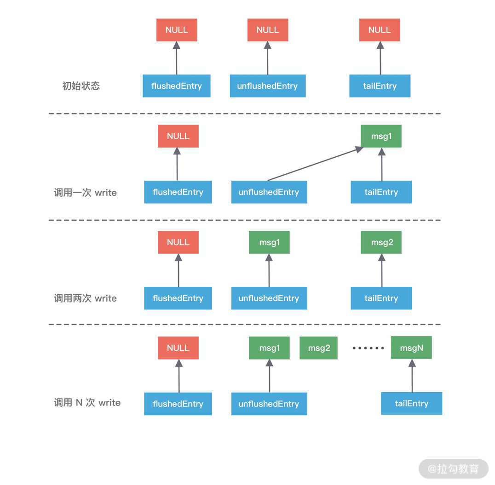

第一次调用 write，因为链表里只有一个数据，所以 unflushedEntry 和 tailEntry 指针都指向第一个添加的数据 msg1。flushedEntry 指针在没有触发 flush 动作时会一直指向 NULL。

第二次调用 write，tailEntry 指针会指向新加入的 msg2，unflushedEntry 保持不变。

第 N 次调用 write，tailEntry 指针会不断指向新加入的 msgN，unflushedEntry 依然保持不变，unflushedEntry 和 tailEntry 指针之间的数据都是未写入 Socket 缓冲区的。

以上便是写 Buffer 队列写入数据的实现原理，但是我们不可能一直向缓存中写入数据，所以 addMessage 方法中每次写入数据后都会调用 incrementPendingOutboundBytes 方法判断缓存的水位线，具体源码如下。

```java
private static final int DEFAULT_LOW_WATER_MARK = 32 * 1024;
private static final int DEFAULT_HIGH_WATER_MARK = 64 * 1024;

private void incrementPendingOutboundBytes(long size, boolean invokeLater) {
    if (size == 0) {
        return;
    }
    long newWriteBufferSize = TOTAL_PENDING_SIZE_UPDATER.addAndGet(this, size);

    // 判断缓存大小是否超过高水位线
    if (newWriteBufferSize > channel.config().getWriteBufferHighWaterMark()) {
        setUnwritable(invokeLater);
    }
}
```

incrementPendingOutboundBytes 的逻辑非常简单，每次添加数据时都会累加数据的字节数，然后判断缓存大小是否超过所设置的高水位线 64KB，如果超过了高水位，那么 Channel 会被设置为不可写状态。直到缓存的数据大小低于低水位线 32KB 以后，Channel 才恢复成可写状态。

有关写数据的逻辑已经分析完了，那么执行 flush 动作缓存又会是什么变化呢？我们接下来一起看下 flush 的工作原理吧。

## 刷新 Buffer 队列

当执行完 write 写操作之后，invokeFlush0 会触发 flush 动作，与 write 方法类似，flush 方法同样会从 Tail 节点开始传播到 Head 节点，同样我们跟进下 HeadContext 的 flush 源码：

```java
// HeadContext # flush
@Override
public void flush(ChannelHandlerContext ctx) {
    unsafe.flush();
}

// AbstractChannel # flush
@Override
public final void flush() {
    assertEventLoop();
    ChannelOutboundBuffer outboundBuffer = this.outboundBuffer;
    if (outboundBuffer == null) {
        return;
    }
    outboundBuffer.addFlush();
    flush0();
}
```

可以看出 flush 的核心逻辑主要分为两个步骤：addFlush 和 flush0，下面我们逐一对它们进行分析。

首先看下 addFlush 方法的源码：

```java
// ChannelOutboundBuffer # addFlush
public void addFlush() {
    Entry entry = unflushedEntry;
    if (entry != null) {
        if (flushedEntry == null) {
            flushedEntry = entry;
        }
        do {
            flushed ++;
            if (!entry.promise.setUncancellable()) {
                int pending = entry.cancel();
                // 减去待发送的数据，如果总字节数低于低水位，那么 Channel 将变为可写状态
                decrementPendingOutboundBytes(pending, false, true);
            }
            entry = entry.next;
        } while (entry != null);
        unflushedEntry = null;
    }
}
```

addFlush 方法同样也会操作 ChannelOutboundBuffer 缓存数据。在执行 addFlush 方法时，缓存中的指针变化又是如何呢？如下图所示，我们在写入流程的基础上继续进行分析。

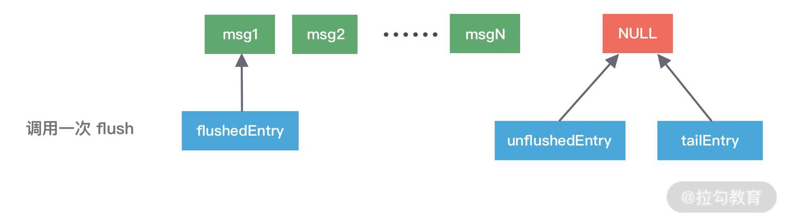

此时 flushedEntry 指针有所改变，变更为 unflushedEntry 指针所指向的数据，然后 unflushedEntry 指针指向 NULL，flushedEntry 指针指向的数据才会被真正发送到 Socket 缓冲区。

在 addFlush 源码中 decrementPendingOutboundBytes 与之前 addMessage 源码中的 incrementPendingOutboundBytes 是相对应的。decrementPendingOutboundBytes 主要作用是减去待发送的数据字节，如果缓存的大小已经小于低水位，那么 Channel 会恢复为可写状态。

addFlush 的大体流程我们已经介绍完毕，接下来便是第二步负责发送数据的 flush0 方法。同样我们跟进 flush0 的源码，定位出 flush0 的核心调用链路：

```java
// AbstractNioUnsafe # flush0
@Override
protected final void flush0() {
    if (!isFlushPending()) {
        super.flush0();
    }
}

// AbstractNioByteChannel # doWrite
@Override
protected void doWrite(ChannelOutboundBuffer in) throws Exception {
    int writeSpinCount = config().getWriteSpinCount();
    do {
        Object msg = in.current();
        if (msg == null) {
            clearOpWrite();
            return;
        }
        writeSpinCount -= doWriteInternal(in, msg);
    } while (writeSpinCount > 0);
    incompleteWrite(writeSpinCount < 0);
}
```

实际 flush0 的调用层次很深，但其实核心的逻辑在于 AbstractNioByteChannel 的 doWrite 方法，该方法负责将数据真正写入到 Socket 缓冲区。doWrite 方法的处理流程主要分为三步：

第一，根据配置获取自旋锁的次数 writeSpinCount。那么你的疑问就来了，这个自旋锁的次数主要是用来干什么的呢？当我们向 Socket 底层写数据的时候，如果每次要写入的数据量很大，是不可能一次将数据写完的，所以只能分批写入。Netty 在不断调用执行写入逻辑的时候，EventLoop 线程可能一直在等待，这样有可能会阻塞其他事件处理。所以这里自旋锁的次数相当于控制一次写入数据的最大的循环执行次数，如果超过所设置的自旋锁次数，那么写操作将会被暂时中断。

第二，根据自旋锁次数重复调用 doWriteInternal 方法发送数据，每成功发送一次数据，自旋锁的次数 writeSpinCount 减 1，当 writeSpinCount 耗尽，那么 doWrite 操作将会被暂时中断。doWriteInternal 的源码涉及 JDK NIO 底层，在这里我们不再深入展开，它的主要作用在于删除缓存中的链表节点以及调用底层 API 发送数据，有兴趣的同学可以自行研究。

第三，调用 incompleteWrite 方法确保数据能够全部发送出去，因为自旋锁次数的限制，可能数据并没有写完，所以需要继续 OP\_WRITE 事件；如果数据已经写完，清除 OP\_WRITE 事件即可。

至此，整个 writeAndFlush 的工作原理已经全部分析完了，整个过程的调用层次比较深，我整理了 writeAndFlush 的时序图，如下所示，帮助大家梳理 writeAndFlush 的调用流程，加深对上述知识点的理解。

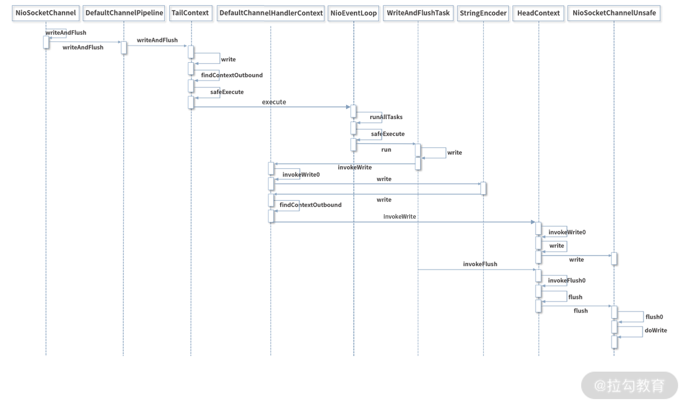

## 总结

本节课我们深入分析了 writeAndFlush 的处理流程，可以总结以下三点：

*   writeAndFlush 属于出站操作，它是从 Pipeline 的 Tail 节点开始进行事件传播，一直向前传播到 Head 节点。不管在 write 还是 flush 过程，Head 节点都中扮演着重要的角色。
*   write 方法并没有将数据写入 Socket 缓冲区，只是将数据写入到 ChannelOutboundBuffer 缓存中，ChannelOutboundBuffer 缓存内部是由单向链表实现的。
*   flush 方法才最终将数据写入到 Socket 缓冲区。

最后，留一个小的思考题，Channel 和 ChannelHandlerContext 都有 writeAndFlush 方法，它们之间有什么区别呢？

10 双刃剑：合理管理 Netty 堆外内存
======================

本节课我们将进入 Netty 内存管理的课程学习，在此之前，我们需要了解 Java 堆外内存的基本知识，因为当你在使用 Netty 时，需要时刻与堆外内存打交道。我们经常看到各类堆外内存泄漏的排查案例，堆外内存使用不当会使得应用出错、崩溃的概率变大，所以在使用堆外内存时一定要慎重，本节课我将带你一起认识堆外内存，并探讨如何更好地使用它。

## 为什么需要堆外内存

在 Java 中对象都是在堆内分配的，通常我们说的**JVM 内存**也就指的**堆内内存**，**堆内内存**完全被**JVM 虚拟机**所管理，JVM 有自己的垃圾回收算法，对于使用者来说不必关心对象的内存如何回收。

**堆外内存**与堆内内存相对应，对于整个机器内存而言，除**堆内内存以外部分即为堆外内存**，如下图所示。堆外内存不受 JVM 虚拟机管理，直接由操作系统管理。


堆外内存和堆内内存各有利弊，这里我针对其中重要的几点进行说明。

1.  堆内内存由 JVM GC 自动回收内存，降低了 Java 用户的使用心智，但是 GC 是需要时间开销成本的，堆外内存由于不受 JVM 管理，所以在一定程度上可以降低 GC 对应用运行时带来的影响。
2.  堆外内存需要手动释放，这一点跟 C/C++ 很像，稍有不慎就会造成应用程序内存泄漏，当出现内存泄漏问题时排查起来会相对困难。
3.  当进行网络 I/O 操作、文件读写时，堆内内存都需要转换为堆外内存，然后再与底层设备进行交互，这一点在介绍 writeAndFlush 的工作原理中也有提到，所以直接使用堆外内存可以减少一次内存拷贝。
4.  堆外内存可以实现进程之间、JVM 多实例之间的数据共享。

由此可以看出，如果你想实现高效的 I/O 操作、缓存常用的对象、降低 JVM GC 压力，堆外内存是一个非常不错的选择。

## 堆外内存的分配

Java 中堆外内存的分配方式有两种：**ByteBuffer#allocateDirect**和**Unsafe#allocateMemory**。

首先我们介绍下 Java NIO 包中的 ByteBuffer 类的分配方式，使用方式如下：

```java
// 分配 10M 堆外内存
ByteBuffer buffer = ByteBuffer.allocateDirect(10 * 1024 * 1024); 
```

跟进 ByteBuffer.allocateDirect 源码，发现其中直接调用的 DirectByteBuffer 构造函数：

```java
DirectByteBuffer(int cap) {
    super(-1, 0, cap, cap);
    boolean pa = VM.isDirectMemoryPageAligned();
    int ps = Bits.pageSize();
    long size = Math.max(1L, (long)cap + (pa ? ps : 0));
    Bits.reserveMemory(size, cap);
    long base = 0;
    try {
        base = unsafe.allocateMemory(size);
    } catch (OutOfMemoryError x) {
        Bits.unreserveMemory(size, cap);
        throw x;
    }
    unsafe.setMemory(base, size, (byte) 0);
    if (pa && (base % ps != 0)) {
        address = base + ps - (base & (ps - 1));
    } else {
        address = base;
    }
    cleaner = Cleaner.create(this, new Deallocator(base, size, cap));
    att = null;
}
```

如下图所示，描述了 DirectByteBuffer 的内存引用情况，方便你更好地理解上述源码的初始化过程。在堆内存放的 DirectByteBuffer 对象并不大，仅仅包含堆外内存的地址、大小等属性，同时还会创建对应的 Cleaner 对象，通过 ByteBuffer 分配的堆外内存不需要手动回收，它可以被 JVM 自动回收。当堆内的 DirectByteBuffer 对象被 GC 回收时，Cleaner 就会用于回收对应的堆外内存。


从 DirectByteBuffer 的构造函数中可以看出，真正分配堆外内存的逻辑还是通过 unsafe.allocateMemory(size)，接下来我们一起认识下 Unsafe 这个神秘的工具类。

Unsafe 是一个非常不安全的类，它用于执行内存访问、分配、修改等**敏感操作**，可以越过 JVM 限制的枷锁。Unsafe 最初并不是为开发者设计的，使用它时虽然可以获取对底层资源的控制权，但也失去了安全性的保证，所以使用 Unsafe 一定要慎重。Netty 中依赖了 Unsafe 工具类，是因为 Netty 需要与底层 Socket 进行交互，Unsafe 在提升 Netty 的性能方面起到了一定的帮助。

在 Java 中是不能直接使用 Unsafe 的，但是我们可以通过反射获取 Unsafe 实例，使用方式如下所示。

```java
private static Unsafe unsafe = null;
static {
    try {
        Field getUnsafe = Unsafe.class.getDeclaredField("theUnsafe");
        getUnsafe.setAccessible(true);
        unsafe = (Unsafe) getUnsafe.get(null);
    } catch (NoSuchFieldException | IllegalAccessException e) {
        e.printStackTrace();
    }
}
```

获得 Unsafe 实例后，我们可以通过 allocateMemory 方法分配堆外内存，allocateMemory 方法返回的是内存地址，使用方法如下所示：

```java
// 分配 10M 堆外内存
long address = unsafe.allocateMemory(10 * 1024 * 1024);
```

与 DirectByteBuffer 不同的是，Unsafe#allocateMemory 所分配的内存必须自己手动释放，否则会造成内存泄漏，这也是 Unsafe 不安全的体现。Unsafe 同样提供了内存释放的操作：

```java
unsafe.freeMemory(address);
```

到目前为止，我们了解了堆外内存分配的两种方式，对于 Java 开发者而言，常用的是 ByteBuffer.allocateDirect 分配方式，我们平时常说的堆外内存泄漏都与该分配方式有关，接下来我们一起看看使用 ByteBuffer 分配的堆外内存如何被 JVM 回收，这对我们排查堆外内存泄漏问题有较大的帮助。

## 堆外内存的回收

我们试想这么一种场景，因为 DirectByteBuffer 对象有可能长时间存在于堆内内存，所以它很可能晋升到 JVM 的老年代，所以这时候 DirectByteBuffer 对象的回收需要依赖 Old GC 或者 Full GC 才能触发清理。如果长时间没有 Old GC 或者 Full GC 执行，那么堆外内存即使不再使用，也会一直在占用内存不释放，很容易将机器的物理内存耗尽，这是相当危险的。

那么在使用 DirectByteBuffer 时我们如何避免物理内存被耗尽呢？因为 JVM 并不知道堆外内存是不是已经不足了，所以我们最好通过 JVM 参数 -XX:MaxDirectMemorySize 指定堆外内存的上限大小，当堆外内存的大小超过该阈值时，就会触发一次 Full GC 进行清理回收，如果在 Full GC 之后还是无法满足堆外内存的分配，那么程序将会抛出 OOM 异常。

此外在 ByteBuffer.allocateDirect 分配的过程中，如果没有足够的空间分配堆外内存，在 Bits.reserveMemory 方法中也会主动调用 System.gc() 强制执行 Full GC，但是在生产环境一般都是设置了 -XX:+DisableExplicitGC，System.gc() 是不起作用的，所以依赖 System.gc() 并不是一个好办法。

通过前面堆外内存分配方式的介绍，我们知道 DirectByteBuffer 在初始化时会创建一个 Cleaner 对象，它会负责堆外内存的回收工作，那么 Cleaner 是如何与 GC 关联起来的呢？

Java 对象有四种引用方式：强引用 StrongReference、软引用 SoftReference、弱引用 WeakReference 和虚引用 PhantomReference。其中 PhantomReference 是最不常用的一种引用方式，Cleaner 就属于 PhantomReference 的子类，如以下源码所示，PhantomReference 不能被单独使用，需要与引用队列 ReferenceQueue 联合使用。

```java
public class Cleaner extends java.lang.ref.PhantomReference<java.lang.Object> {
        private static final java.lang.ref.ReferenceQueue<java.lang.Object> dummyQueue;
    private static sun.misc.Cleaner first;
    private sun.misc.Cleaner next;
    private sun.misc.Cleaner prev;
    private final java.lang.Runnable thunk;
    public void clean() {}
}
```

首先我们看下，当初始化堆外内存时，内存中的对象引用情况如下图所示，first 是 Cleaner 类中的静态变量，Cleaner 对象在初始化时会加入 Cleaner 链表中。DirectByteBuffer 对象包含堆外内存的地址、大小以及 Cleaner 对象的引用，ReferenceQueue 用于保存需要回收的 Cleaner 对象。


当发生 GC 时，DirectByteBuffer 对象被回收，内存中的对象引用情况发生了如下变化：


此时 Cleaner 对象不再有任何引用关系，在下一次 GC 时，该 Cleaner 对象将被添加到 ReferenceQueue 中，并执行 clean() 方法。clean() 方法主要做两件事情：

1.  将 Cleaner 对象从 Cleaner 链表中移除；
2.  调用 unsafe.freeMemory 方法清理堆外内存。

至此，堆外内存的回收已经介绍完了，下次再排查内存泄漏问题的时候先回顾下这些最基本的知识，做到心中有数。

## 总结

堆外内存是一把双刃剑，在网络 I/O、文件读写、分布式缓存等领域使用堆外内存都更加简单、高效，此外使用堆外内存不受 JVM 约束，可以避免 JVM GC 的压力，降低对业务应用的影响。当然天下没有免费的午餐，堆外内存也不能滥用，使用堆外内存你就需要关注内存回收问题，虽然 JVM 在一定程度上帮助我们实现了堆外内存的自动回收，但我们仍然需要培养类似 C/C++ 的分配/回收的意识，出现内存泄漏问题能够知道如何分析和处理。


11 另起炉灶：Netty 数据传输载体 ByteBuf 详解
===============================

在学习编解码章节的过程中，我们看到 Netty 大量使用了自己实现的 ByteBuf 工具类，ByteBuf 是 Netty 的数据容器，所有网络通信中字节流的传输都是通过 ByteBuf 完成的。然而 JDK NIO 包中已经提供了类似的 ByteBuffer 类，为什么 Netty 还要去重复造轮子呢？本节课我会详细地讲解 ByteBuf。

## 为什么选择 ByteBuf

我们首先介绍下 JDK NIO 的 ByteBuffer，才能知道 ByteBuffer 有哪些缺陷和痛点。下图展示了 ByteBuffer 的内部结构：


从图中可知，ByteBuffer 包含以下四个基本属性：

*   mark：为某个读取过的关键位置做标记，方便回退到该位置；
*   position：当前读取的位置；
*   limit：buffer 中有效的数据长度大小；
*   capacity：初始化时的空间容量。

以上**四个基本属性**的关系是：**mark <= position <= limit <= capacity**。结合 ByteBuffer 的基本属性，不难理解它在使用上的一些缺陷。

第一，ByteBuffer 分配的长度是固定的，无法动态扩缩容，所以很难控制需要分配多大的容量。如果分配太大容量，容易造成内存浪费；如果分配太小，存放太大的数据会抛出 BufferOverflowException 异常。在使用 ByteBuffer 时，为了避免容量不足问题，你必须每次在存放数据的时候对容量大小做校验，如果超出 ByteBuffer 最大容量，那么需要重新开辟一个更大容量的 ByteBuffer，将已有的数据迁移过去。整个过程相对烦琐，对开发者而言是非常不友好的。

第二，ByteBuffer 只能通过 position 获取当前可操作的位置，因为读写共用的 position 指针，所以需要频繁调用 flip、rewind 方法切换读写状态，开发者必须很小心处理 ByteBuffer 的数据读写，稍不留意就会出错。

ByteBuffer 作为网络通信中高频使用的数据载体，显然不能够满足 Netty 的需求，Netty 重新实现了一个性能更高、易用性更强的 ByteBuf，相比于 ByteBuffer 它提供了很多非常酷的特性：

*   容量可以按需动态扩展，类似于 StringBuffer；
*   读写采用了不同的指针，读写模式可以随意切换，不需要调用 flip 方法；
*   通过内置的复合缓冲类型可以实现零拷贝；
*   支持引用计数；
*   支持缓存池。

这里我们只是对 ByteBuf 有一个简单的了解，接下来我们就一起看下 ByteBuf 是如何实现的吧。

## ByteBuf 内部结构

同样我们看下 ByteBuf 的内部结构，与 ByteBuffer 做一个对比。

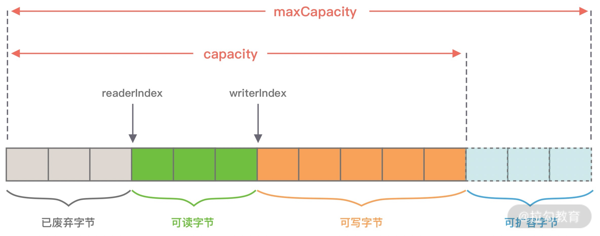

从图中可以看出，ByteBuf 包含三个指针：**读指针 readerIndex**、**写指针 writeIndex**、**最大容量 maxCapacity**，根据指针的位置又可以将 ByteBuf 内部结构可以分为四个部分：

第一部分是**废弃字节**，表示已经丢弃的无效字节数据。

第二部分是**可读字节**，表示 ByteBuf 中可以被读取的字节内容，可以通过 writeIndex - readerIndex 计算得出。从 ByteBuf 读取 N 个字节，readerIndex 就会自增 N，readerIndex 不会大于 writeIndex，当 readerIndex == writeIndex 时，表示 ByteBuf 已经不可读。

第三部分是**可写字节**，向 ByteBuf 中写入数据都会存储到可写字节区域。向 ByteBuf 写入 N 字节数据，writeIndex 就会自增 N，当 writeIndex 超过 capacity，表示 ByteBuf 容量不足，需要扩容。

第四部分是**可扩容字节**，表示 ByteBuf 最多还可以扩容多少字节，当 writeIndex 超过 capacity 时，会触发 ByteBuf 扩容，最多扩容到 maxCapacity 为止，超过 maxCapacity 再写入就会出错。

由此可见，Netty 重新设计的 ByteBuf 有效地区分了可读、可写以及可扩容数据，解决了 ByteBuffer 无法扩容以及读写模式切换烦琐的缺陷。接下来，我们一起学习下 ByteBuf 的核心 API，你可以把它当作 ByteBuffer 的替代品单独使用。

## 引用计数

ByteBuf 是基于引用计数设计的，它实现了 ReferenceCounted 接口，ByteBuf 的生命周期是由引用计数所管理。只要引用计数大于 0，表示 ByteBuf 还在被使用；当 ByteBuf 不再被其他对象所引用时，引用计数为 0，那么代表该对象可以被释放。

当新创建一个 ByteBuf 对象时，它的初始引用计数为 1，当 ByteBuf 调用 release() 后，引用计数减 1，所以不要误以为调用了 release() 就会保证 ByteBuf 对象一定会被回收。你可以结合以下的代码示例做验证：

```java
ByteBuf buffer = ctx.alloc().directbuffer();
assert buffer.refCnt() == 1;
buffer.release();
assert buffer.refCnt() == 0;
```

引用计数对于 Netty 设计缓存池化有非常大的帮助，当引用计数为 0，该 ByteBuf 可以被放入到对象池中，避免每次使用 ByteBuf 都重复创建，对于实现高性能的内存管理有着很大的意义。

此外 Netty 可以利用引用计数的特点实现内存泄漏检测工具。JVM 并不知道 Netty 的引用计数是如何实现的，当 ByteBuf 对象不可达时，一样会被 GC 回收掉，但是如果此时 ByteBuf 的引用计数不为 0，那么该对象就不会释放或者被放入对象池，从而发生了内存泄漏。Netty 会对分配的 ByteBuf 进行抽样分析，检测 ByteBuf 是否已经不可达且引用计数大于 0，判定内存泄漏的位置并输出到日志中，你需要关注日志中 LEAK 关键字。

## ByteBuf 分类

ByteBuf 有多种实现类，每种都有不同的特性，下图是 ByteBuf 的家族图谱，可以划分为三个不同的维度：**Heap/Direct**、**Pooled/Unpooled**和**Unsafe/非 Unsafe**，我逐一介绍这三个维度的不同特性。

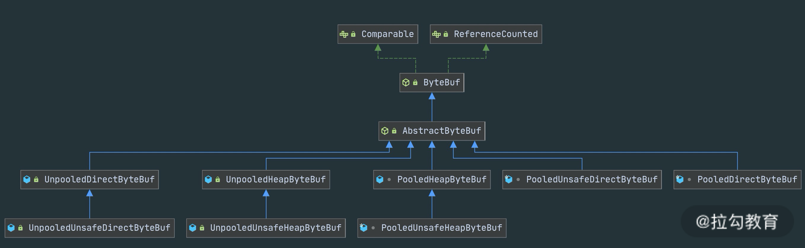

**Heap/Direct 就是堆内和堆外内存**。Heap 指的是在 JVM 堆内分配，底层依赖的是字节数据；Direct 则是堆外内存，不受 JVM 限制，分配方式依赖 JDK 底层的 ByteBuffer。

**Pooled/Unpooled 表示池化还是非池化内存**。Pooled 是从预先分配好的内存中取出，使用完可以放回 ByteBuf 内存池，等待下一次分配。而 Unpooled 是直接调用系统 API 去申请内存，确保能够被 JVM GC 管理回收。

**Unsafe/非 Unsafe 的区别在于操作方式是否安全。** Unsafe 表示每次调用 JDK 的 Unsafe 对象操作物理内存，依赖 offset + index 的方式操作数据。非 Unsafe 则不需要依赖 JDK 的 Unsafe 对象，直接通过数组下标的方式操作数据。

## ByteBuf 核心 API

我会分为**指针操作**、**数据读写**和**内存管理**三个方面介绍 ByteBuf 的核心 API。在开始讲解 API 的使用方法之前，先回顾下之前我们实现的自定义解码器，以便于加深对 ByteBuf API 的理解。

```java
public final void decode(ChannelHandlerContext ctx, ByteBuf in, List<Object> out) {
    // 判断 ByteBuf 可读取字节
    if (in.readableBytes() < 14) { 
        return;
    }
    in.markReaderIndex(); // 标记 ByteBuf 读指针位置
    in.skipBytes(2); // 跳过魔数
    in.skipBytes(1); // 跳过协议版本号
    byte serializeType = in.readByte();
    in.skipBytes(1); // 跳过报文类型
    in.skipBytes(1); // 跳过状态字段
    in.skipBytes(4); // 跳过保留字段
    int dataLength = in.readInt();
    if (in.readableBytes() < dataLength) {
        in.resetReaderIndex(); // 重置 ByteBuf 读指针位置
        return;
    }
    byte[] data = new byte[dataLength];
    in.readBytes(data);
    SerializeService serializeService = getSerializeServiceByType(serializeType);
    Object obj = serializeService.deserialize(data);
    if (obj != null) {
        out.add(obj);
    }
}
```

### 指针操作 API

*   **readerIndex() & writeIndex()**

readerIndex() 返回的是当前的读指针的 readerIndex 位置，writeIndex() 返回的当前写指针 writeIndex 位置。

*   **markReaderIndex() & resetReaderIndex()**

markReaderIndex() 用于保存 readerIndex 的位置，resetReaderIndex() 则将当前 readerIndex 重置为之前保存的位置。

这对 API 在实现协议解码时最为常用，例如在上述自定义解码器的源码中，在读取协议内容长度字段之前，先使用 markReaderIndex() 保存了 readerIndex 的位置，如果 ByteBuf 中可读字节数小于长度字段的值，则表示 ByteBuf 还没有一个完整的数据包，此时直接使用 resetReaderIndex() 重置 readerIndex 的位置。

此外对应的写指针操作还有 markWriterIndex() 和 resetWriterIndex()，与读指针的操作类似，我就不再一一赘述了。

### 数据读写 API

*   **isReadable()**

isReadable() 用于判断 ByteBuf 是否可读，如果 writerIndex 大于 readerIndex，那么 ByteBuf 是可读的，否则是不可读状态。

*   **readableBytes()**

readableBytes() 可以获取 ByteBuf 当前可读取的字节数，可以通过 writerIndex - readerIndex 计算得到。

*   **readBytes(byte\[\] dst) & writeBytes(byte\[\] src)**

readBytes() 和 writeBytes() 是两个最为常用的方法。readBytes() 是将 ByteBuf 的数据读取相应的字节到字节数组 dst 中，readBytes() 经常结合 readableBytes() 一起使用，dst 字节数组的大小通常等于 readableBytes() 的大小。

*   **readByte() & writeByte(int value)**

readByte() 是从 ByteBuf 中读取一个字节，相应的 readerIndex + 1；同理 writeByte 是向 ByteBuf 写入一个字节，相应的 writerIndex + 1。类似的 Netty 提供了 8 种基础数据类型的读取和写入，例如 readChar()、readShort()、readInt()、readLong()、writeChar()、writeShort()、writeInt()、writeLong() 等，在这里就不详细展开了。

*   **getByte(int index) & setByte(int index, int value)**

与 readByte() 和 writeByte() 相对应的还有 getByte() 和 setByte()，get/set 系列方法也提供了 8 种基础类型的读写，那么这两个系列的方法有什么区别呢？read/write 方法在读写时会改变readerIndex 和 writerIndex 指针，而 get/set 方法则不会改变指针位置。

### 内存管理 API

*   **release() & retain()**

之前已经介绍了引用计数的基本概念，每调用一次 release() 引用计数减 1，每调用一次 retain() 引用计数加 1。

*   **slice() & duplicate()**

slice() 等同于 slice(buffer.readerIndex(), buffer.readableBytes())，默认截取 readerIndex 到 writerIndex 之间的数据，最大容量 maxCapacity 为原始 ByteBuf 的可读取字节数，底层分配的内存、引用计数都与原始的 ByteBuf 共享。

duplicate() 与 slice() 不同的是，duplicate()截取的是整个原始 ByteBuf 信息，底层分配的内存、引用计数也是共享的。如果向 duplicate() 分配出来的 ByteBuf 写入数据，那么都会影响到原始的 ByteBuf 底层数据。

*   **copy()**

copy() 会从原始的 ByteBuf 中拷贝所有信息，所有数据都是独立的，向 copy() 分配的 ByteBuf 中写数据不会影响原始的 ByteBuf。

到底为止，ByteBuf 的核心 API 我们基本已经介绍完了，ByteBuf 读写指针分离的小设计，确实带来了很多实用和便利的功能，在开发的过程中不必再去想着 flip、rewind 这种头疼的操作了。

## ByteBuf 实战演练

学习完 ByteBuf 的内部构造以及核心 API 之后，我们下面通过一个简单的示例演示一下 ByteBuf 应该如何使用，代码如下所示。

```java
public class ByteBufTest {
    public static void main(String[] args) {
        ByteBuf buffer = ByteBufAllocator.DEFAULT.buffer(6, 10);
        printByteBufInfo("ByteBufAllocator.buffer(5, 10)", buffer);
        buffer.writeBytes(new byte[]{1, 2});
        printByteBufInfo("write 2 Bytes", buffer);
        buffer.writeInt(100);
        printByteBufInfo("write Int 100", buffer);
        buffer.writeBytes(new byte[]{3, 4, 5});
        printByteBufInfo("write 3 Bytes", buffer);
        byte[] read = new byte[buffer.readableBytes()];
        buffer.readBytes(read);
        printByteBufInfo("readBytes(" + buffer.readableBytes() + ")", buffer);
        printByteBufInfo("BeforeGetAndSet", buffer);
        System.out.println("getInt(2): " + buffer.getInt(2));
        buffer.setByte(1, 0);
        System.out.println("getByte(1): " + buffer.getByte(1));
        printByteBufInfo("AfterGetAndSet", buffer);
    }
    private static void printByteBufInfo(String step, ByteBuf buffer) {
        System.out.println("------" + step + "-----");
        System.out.println("readerIndex(): " + buffer.readerIndex());
        System.out.println("writerIndex(): " + buffer.writerIndex());
        System.out.println("isReadable(): " + buffer.isReadable());
        System.out.println("isWritable(): " + buffer.isWritable());
        System.out.println("readableBytes(): " + buffer.readableBytes());
        System.out.println("writableBytes(): " + buffer.writableBytes());
        System.out.println("maxWritableBytes(): " + buffer.maxWritableBytes());
        System.out.println("capacity(): " + buffer.capacity());
        System.out.println("maxCapacity(): " + buffer.maxCapacity());
    }
}
```

程序的输出结果在此我就不贴出了，建议你可以先尝试思考 readerIndex、writerIndex 是如何改变的，然后再动手跑下上述代码，验证结果是否正确。

结合代码示例，我们总结一下 ByteBuf API 使用时的注意点：

*   write 系列方法会改变 writerIndex 位置，当 writerIndex 等于 capacity 的时候，Buffer 置为不可写状态；
*   向不可写 Buffer 写入数据时，Buffer 会尝试扩容，但是扩容后 capacity 最大不能超过 maxCapacity，如果写入的数据超过 maxCapacity，程序会直接抛出异常；
*   read 系列方法会改变 readerIndex 位置，get/set 系列方法不会改变 readerIndex/writerIndex 位置。

## 总结

本节课我们介绍了 Netty 强大的数据容器 ByteBuf，它不仅解决了 JDK NIO 中 ByteBuffer 的缺陷，而且提供了易用性更强的接口。很多开发者已经使用 ByteBuf 代替 ByteBuffer，即便他没有在写一个网络应用，也会单独使用 ByteBuf。ByteBuf 作为 Netty 中最基础的数据结构，你必须熟练掌握它，这是你精通 Netty 的必经之路，接下来的课程我们会围绕 ByteBuf 介绍关于 Netty 内存管理的相关设计。

12 他山之石：高性能内存分配器 jemalloc 基本原理
==============================

在上节课，我们介绍了强大的 ByteBuf 工具类，ByteBuf 在 Netty 中随处可见，那么这些 ByteBuf 在 Netty 中是如何被分配和管理的呢？接下来的我们会对 Netty 高性能内存管理进行剖析，这些知识相比前面的章节有些晦涩难懂，你不必过于担心，Netty 内存管理的实现并不是一蹴而就的，它也是参考了 jemalloc 内存分配器。今天我们就先介绍 jemalloc 内存分配器的基本原理，为我们后面的课程打好基础。

## 背景知识

jemalloc 是由 Jason Evans 在 FreeBSD 项目中引入的新一代内存分配器。它是一个通用的 malloc 实现，侧重于减少内存碎片和提升高并发场景下内存的分配效率，其目标是能够替代 malloc。jemalloc 应用十分广泛，在 Firefox、Redis、Rust、Netty 等出名的产品或者编程语言中都有大量使用。具体细节可以参考 Jason Evans 发表的论文 《A Scalable Concurrent malloc Implementation for FreeBSD》

除了 jemalloc 之外，业界还有一些著名的内存分配器实现，例如 ptmalloc 和 tcmalloc。我们对这三种内存分配器做一个简单的对比：

ptmalloc 是基于 glibc 实现的内存分配器，它是一个标准实现，所以兼容性较好。pt 表示 per thread 的意思。当然 ptmalloc 确实在多线程的性能优化上下了很多功夫。由于过于考虑性能问题，多线程之间内存无法实现共享，只能每个线程都独立使用各自的内存，所以在内存开销上是有很大浪费的。

tcmalloc 出身于 Google，全称是 thread-caching malloc，所以 tcmalloc 最大的特点是带有线程缓存，tcmalloc 非常出名，目前在 Chrome、Safari 等知名产品中都有所应有。tcmalloc 为每个线程分配了一个局部缓存，对于小对象的分配，可以直接由线程局部缓存来完成，对于大对象的分配场景，tcmalloc 尝试采用自旋锁来减少多线程的锁竞争问题。

jemalloc 借鉴了 tcmalloc 优秀的设计思路，所以在架构设计方面两者有很多相似之处，同样都包含 thread cache 的特性。但是 jemalloc 在设计上比 ptmalloc 和 tcmalloc 都要复杂，jemalloc 将内存分配粒度划分为 Small、Large、Huge 三个分类，并记录了很多 meta 数据，所以在空间占用上要略多于 tcmalloc，不过在大内存分配的场景，jemalloc 的内存碎片要少于 tcmalloc。tcmalloc 内部采用红黑树管理内存块和分页，Huge 对象通过红黑树查找索引数据可以控制在指数级时间。

由此可见，虽然几个内存分配器的侧重点不同，但是它们的核心目标是一致的：

*   高效的内存分配和回收，提升单线程或者多线程场景下的性能。
*   减少内存碎片，包括内部碎片和外部碎片，提高内存的有效利用率。

那么这里又涉及一个概念，什么是内存碎片呢？Linux 中物理内存会被划分成若干个 4K 大小的内存页 Page，物理内存的分配和回收都是基于 Page 完成的，Page 内产生的内存碎片称为内部碎片，Page 之间产生的内存碎片称为外部碎片。

首先讲下内部碎片，因为内存是按 Page 进行分配的，即便我们只需要很小的内存，操作系统至少也会分配 4K 大小的 Page，单个 Page 内只有一部分字节都被使用，剩余的字节形成了内部碎片，如下图所示。

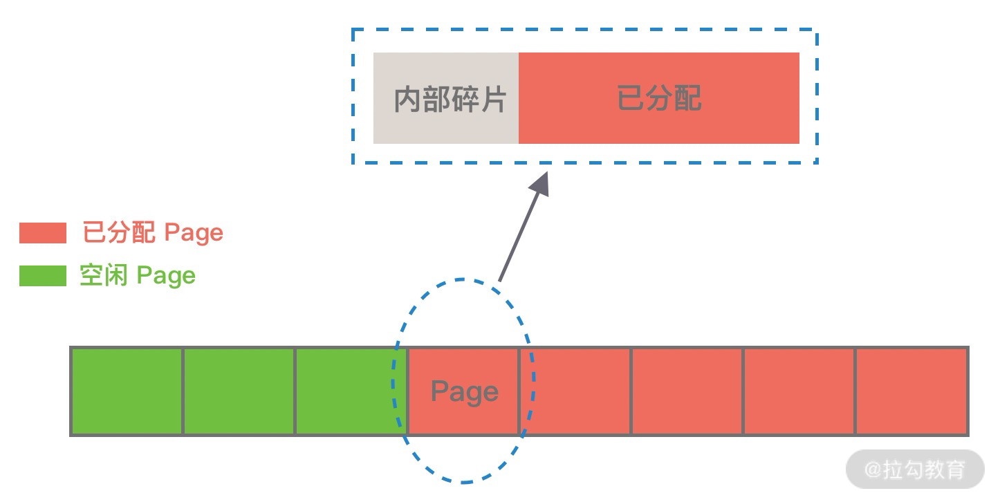

外部碎片与内部碎片相反，是在分配较大内存块时产生的。我们试想一下，当需要分配大内存块的时候，操作系统只能通过分配连续的 Page 才能满足要求，在程序不断运行的过程中，这些 Page 被频繁的回收并重新分配，Page 之间就会出现小的空闲内存块，这样就形成了外部碎片，如下图所示。

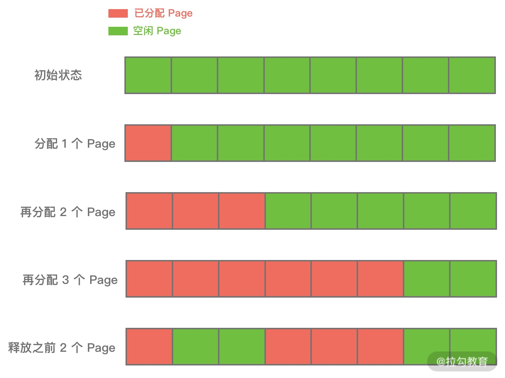

上述我们介绍了内存分配器的一些背景知识，它们是操作系统以及高性能组件的必备神器，如果你对内存管理有兴趣，jemalloc 和 tcmalloc 都是非常推荐学习的。

## 常用内存分配器算法

在学习 jemalloc 的实现原理之前，我们先了解下最常用的内存分配器算法：**动态内存分配**、**伙伴算法**和**Slab 算法**，这将对于我们理解 jemalloc 大有裨益。

### 动态内存分配

动态内存分配（Dynamic memory allocation）又称为堆内存分配，后面简称 DMA，操作系统根据程序运行过程中的需求即时分配内存，且分配的内存大小就是程序需求的大小。在大部分场景下，只有在程序运行的时候才知道所需要分配的内存大小，如果提前分配可能会分配的大小无法把控，分配太大会浪费空间，分配太小会无法使用。

DMA 是从一整块内存中按需分配，对于分配出的内存会记录元数据，同时还会使用空闲分区链维护空闲内存，便于在内存分配时查找可用的空闲分区，常用的有三种查找策略：

**第一种是⾸次适应算法（first fit）**，空闲分区链以地址递增的顺序将空闲分区以双向链表的形式连接在一起，从空闲分区链中找到第一个满足分配条件的空闲分区，然后从空闲分区中划分出一块可用内存给请求进程，剩余的空闲分区仍然保留在空闲分区链中。如下图所示，P1 和 P2 的请求可以在内存块 A 中完成分配。该算法每次都从低地址开始查找，造成低地址部分会不断被分配，同时也会产生很多小的空闲分区。


**第二种是循环首次适应算法（next fit）**，该算法是由首次适应算法的变种，循环首次适应算法不再是每次从链表的开始进行查找，而是从上次找到的空闲分区的下⼀个空闲分区开始查找。如下图所示，P1 请求在内存块 A 完成分配，然后再为 P2 分配内存时，是直接继续向下寻找可用分区，最终在 B 内存块中完成分配。该算法相比⾸次适应算法空闲分区的分布更加均匀，而且查找的效率有所提升，但是正因为如此会造成空闲分区链中大的空闲分区会越来越少。


**第三种是最佳适应算法（best fit）**，空闲分区链以空闲分区大小递增的顺序将空闲分区以双向链表的形式连接在一起，每次从空闲分区链的开头进行查找，这样第一个满足分配条件的空间分区就是最优解。如下图所示，在 A 内存块分配完 P1 请求后，空闲分区链重新按分区大小进行排序，再为 P2 请求查找满足条件的空闲分区。该算法的空间利用率更高，但同样也会留下很多较难利用的小空闲分区，由于每次分配完需要重新排序，所以会有造成性能损耗。


### 伙伴算法

伙伴算法是一种非常经典的内存分配算法，它采用了分离适配的设计思想，将物理内存按照 2 的次幂进行划分，内存分配时也是按照 2 的次幂大小进行按需分配，例如 4KB、 8KB、16KB 等。假设我们请求分配的内存大小为 10KB，那么会按照 16KB 分配。

伙伴算法相对比较复杂，我们结合下面这张图来讲解它的分配原理。


伙伴算法把内存划分为 11 组不同的 2 次幂大小的内存块集合，每组内存块集合都用双向链表连接。链表中每个节点的内存块大小分别为 1、2、4、8、16、32、64、128、256、512 和 1024 个连续的 Page，例如第一组链表的节点为 2^0 个连续 Page，第二组链表的节点为 2^1 个连续 Page，以此类推。

假设我们需要分配 10K 大小的内存块，看下伙伴算法的具体分配过程：

1.  首先需要找到存储 2^4 连续 Page 所对应的链表，即数组下标为 4；
2.  查找 2^4 链表中是否有空闲的内存块，如果有则分配成功；
3.  如果 2^4 链表不存在空闲的内存块，则继续沿数组向上查找，即定位到数组下标为 5 的链表，链表中每个节点存储 2^5 的连续 Page；
4.  如果 2^5 链表中存在空闲的内存块，则取出该内存块并将它分割为 2 个 2^4 大小的内存块，其中一块分配给进程使用，剩余的一块链接到 2^4 链表中。

以上是伙伴算法的分配过程，那么释放内存时候伙伴算法又会发生什么行为呢？当进程使用完内存归还时，需要检查其伙伴块的内存是否释放，所谓伙伴块是不仅大小相同，而且两个块的地址是连续的，其中低地址的内存块起始地址必须为 2 的整数次幂。如果伙伴块是空闲的，那么就会将两个内存块合并成更大的块，然后重复执行上述伙伴块的检查机制。直至伙伴块是非空闲状态，那么就会将该内存块按照实际大小归还到对应的链表中。频繁的合并会造成 CPU 浪费，所以并不是每次释放都会触发合并操作，当链表中的内存块个数小于某个阈值时，并不会触发合并操作。

由此可见，伙伴算法有效地减少了外部碎片，但是有可能会造成非常严重的内部碎片，最严重的情况会带来 50% 的内存碎片。

### Slab 算法

因为伙伴算法都是以 Page 为最小管理单位，在小内存的分配场景，伙伴算法并不适用，如果每次都分配一个 Page 岂不是非常浪费内存，因此 Slab 算法应运而生了。Slab 算法在伙伴算法的基础上，对小内存的场景专门做了优化，采用了内存池的方案，解决内部碎片问题。

Linux 内核使用的就是 Slab 算法，因为内核需要频繁地分配小内存，所以 Slab 算法提供了一种高速缓存机制，使用缓存存储内核对象，当内核需要分配内存时，基本上可以通过缓存中获取。此外 Slab 算法还可以支持通用对象的初始化操作，避免对象重复初始化的开销。下图是 Slab 算法的结构图，Slab 算法实现起来非常复杂，本文只做一个简单的了解。

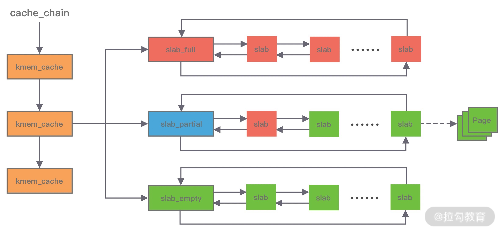

在 Slab 算法中维护着大小不同的 Slab 集合，在最顶层是 cache\_chain，cache\_chain 中维护着一组 kmem\_cache 引用，kmem\_cache 负责管理一块固定大小的对象池。通常会提前分配一块内存，然后将这块内存划分为大小相同的 slot，不会对内存块再进行合并，同时使用位图 bitmap 记录每个 slot 的使用情况。

kmem_cache 中包含三个 Slab 链表：**完全分配使用 slab_full**、**部分分配使用 slab_partial**和**完全空闲 slabs_empty**，这三个链表负责内存的分配和释放。每个链表中维护的 Slab 都是一个或多个连续 Page，每个 Slab 被分配多个对象进行存储。Slab 算法是基于对象进行内存管理的，它把相同类型的对象分为一类。当分配内存时，从 Slab 链表中划分相应的内存单元；当释放内存时，Slab 算法并不会丢弃已经分配的对象，而是将它保存在缓存中，当下次再为对象分配内存时，直接会使用最近释放的内存块。

单个 Slab 可以在不同的链表之间移动，例如当一个 Slab 被分配完，就会从 slab\_partial 移动到 slabs\_full，当一个 Slab 中有对象被释放后，就会从 slab\_full 再次回到 slab\_partial，所有对象都被释放完的话，就会从 slab\_partial 移动到 slab\_empty。

至此，三种最常用的内存分配算法已经介绍完了，优秀的内存分配算法都是在性能和内存利用率之间寻找平衡点，我们今天的主角 jemalloc 就是非常典型的例子。

## jemalloc 架构设计

在了解了常用的内存分配算法之后，再理解 jemalloc 的架构设计会相对轻松一些。下图是 jemalloc 的架构图，我们一起学习下它的核心设计理念。


上图中涉及 jemalloc 的几个核心概念，例如 arena、bin、chunk、run、region、tcache 等，我们下面逐一进行介绍。

**arena 是 jemalloc 最重要的部分**，内存由一定数量的 arenas 负责管理。每个用户线程都会被绑定到一个 arena 上，线程采用 round-robin 轮询的方式选择可用的 arena 进行内存分配，为了减少线程之间的锁竞争，默认每个 CPU 会分配 4 个 arena。

**bin 用于管理不同档位的内存单元**，每个 bin 管理的内存大小是按分类依次递增。因为 jemalloc 中小内存的分配是基于 Slab 算法完成的，所以会产生不同类别的内存块。

**chunk 是负责管理用户内存块的数据结构**，chunk 以 Page 为单位管理内存，默认大小是 4M，即 1024 个连续 Page。每个 chunk 可被用于多次小内存的申请，但是在大内存分配的场景下只能分配一次。

**run 实际上是 chunk 中的一块内存区域**，每个 bin 管理相同类型的 run，最终通过操作 run 完成内存分配。run 结构具体的大小由不同的 bin 决定，例如 8 字节的 bin 对应的 run 只有一个 Page，可以从中选取 8 字节的块进行分配。

**region 是每个 run 中的对应的若干个小内存块**，每个 run 会将划分为若干个等长的 region，每次内存分配也是按照 region 进行分发。

**tcache 是每个线程私有的缓存**，用于 small 和 large 场景下的内存分配，每个 tcahe 会对应一个 arena，tcache 本身也会有一个 bin 数组，称为tbin。与 arena 中 bin 不同的是，它不会有 run 的概念。tcache 每次从 arena 申请一批内存，在分配内存时首先在 tcache 查找，从而避免锁竞争，如果分配失败才会通过 run 执行内存分配。

jemalloc 的几个核心的概念介绍完了，我们再重新梳理下它们之间的关系：

*   内存是由一定数量的 arenas 负责管理，线程均匀分布在 arenas 当中；
*   每个 arena 都包含一个 bin 数组，每个 bin 管理不同档位的内存块；
*   每个 arena 被划分为若干个 chunks，每个 chunk 又包含若干个 runs，每个 run 由连续的 Page 组成，run 才是实际分配内存的操作对象；
*   每个 run 会被划分为一定数量的 regions，在小内存的分配场景，region 相当于用户内存；
*   每个 tcache 对应 一个 arena，tcache 中包含多种类型的 bin。

接下来我们分析下 jemalloc 的整体内存分配和释放流程，主要分为 **Samll**、**Large** 和 **Huge** 三种场景。

首先讲下 Samll 场景，如果请求分配内存的大小小于 arena 中的最小的 bin，那么优先从线程中对应的 tcache 中进行分配。首先确定查找对应的 tbin 中是否存在缓存的内存块，如果存在则分配成功，否则找到 tbin 对应的 arena，从 arena 中对应的 bin 中分配 region 保存在 tbin 的 avail 数组中，最终从 availl 数组中选取一个地址进行内存分配，当内存释放时也会将被回收的内存块进行缓存。

Large 场景的内存分配与 Samll 类似，如果请求分配内存的大小大于 arena 中的最小的 bin，但是不大于 tcache 中能够缓存的最大块，依然会通过 tcache 进行分配，但是不同的是此时会分配 chunk 以及所对应的 run，从 chunk 中找到相应的内存空间进行分配。内存释放时也跟 samll 场景类似，会把释放的内存块缓存在 tacache 的 tbin 中。此外还有一种情况，当请求分配内存的大小大于tcache 中能够缓存的最大块，但是不大于 chunk 的大小，那么将不会采用 tcache 机制，直接在 chunk 中进行内存分配。

Huge 场景，如果请求分配内存的大小大于 chunk 的大小，那么直接通过 mmap 进行分配，调用 munmap 进行回收。

到底为止，jemalloc 的基础知识介绍完毕，你需要花点时间消化它，这对于后面学习 Netty 的内存管理很有帮助。

## 总结

内存管理是每个高阶程序员的必备知识，万变不离其宗，jemalloc 的思想在很多场景都非常适用，在 Redis、Netty 等知名的高性能组件中都有它的原型，你会发现它们的实现思路都是类似的，申请大块内存，避免“细水长流”。趁热打铁吧，下节课我们将继续学习 Netty 是如何设计高性能的内存管理的。

13 举一反三：Netty 高性能内存管理设计（上）
==========================

Netty 作为一款高性能的网络框架，需要处理海量的字节数据，而且 Netty 默认提供了池化对象的内存分配，使用完后归还到内存池，所以一套高性能的内存管理机制是 Netty 必不可少的。在上节课中我们介绍了原生 jemalloc 的基本原理，而 Netty 高性能的内存管理也是借鉴 jemalloc 实现的，它同样需要解决两个经典的核心问题：

*   在单线程或者多线程的场景下，如何高效地进行内存分配和回收？
*   如何减少内存碎片，提高内存的有效利用率？

我们同样带着这两个经典问题开始 Netty 内存管理的课程学习。

## 内存规格介绍

Netty 保留了内存规格分类的设计理念，不同大小的内存块采用的分配策略是不同的，具体内存规格的分类情况如下图所示。


上图中 Tiny 代表 0 ~ 512B 之间的内存块，Samll 代表 512B ~ 8K 之间的内存块，Normal 代表 8K ~ 16M 的内存块，Huge 代表大于 16M 的内存块。在 Netty 中定义了一个 SizeClass 类型的枚举，用于描述上图中的内存规格类型，分别为 Tiny、Small 和 Normal。但是图中 Huge 并未在代码中定义，当分配大于 16M 时，可以归类为 Huge 场景，Netty 会直接使用非池化的方式进行内存分配。

Netty 在每个区域内又定义了更细粒度的内存分配单位，分别为 Chunk、Page、Subpage，我们将逐一对其进行介绍。

Chunk 是 Netty 向操作系统申请内存的单位，所有的内存分配操作也是基于 Chunk 完成的，Chunk 可以理解为 Page 的集合，每个 Chunk 默认大小为 16M。

Page 是 Chunk 用于管理内存的单位，Netty 中的 Page 的大小为 8K，不要与 Linux 中的内存页 Page 相混淆了。假如我们需要分配 64K 的内存，需要在 Chunk 中选取 8 个 Page 进行分配。

Subpage 负责 Page 内的内存分配，假如我们分配的内存大小远小于 Page，直接分配一个 Page 会造成严重的内存浪费，所以需要将 Page 划分为多个相同的子块进行分配，这里的子块就相当于 Subpage。按照 Tiny 和 Small 两种内存规格，SubPage 的大小也会分为两种情况。在 Tiny 场景下，最小的划分单位为 16B，按 16B 依次递增，16B、32B、48B ...... 496B；在 Small 场景下，总共可以划分为 512B、1024B、2048B、4096B 四种情况。Subpage 没有固定的大小，需要根据用户分配的缓冲区大小决定，例如分配 1K 的内存时，Netty 会把一个 Page 等分为 8 个 1K 的 Subpage。

了解了 Netty 不同粒度的内存的分配单位后，我们接下来看看 Netty 中的 jemalloc 是如何实现的。

## Netty 内存池架构设计

Netty 中的内存池可以看作一个 Java 版本的 jemalloc 实现，并结合 JVM 的诸多特性做了部分优化。如下图所示，我们首先从全局视角看下 Netty 内存池的整体布局，对它有一个宏观的认识。


基于上图的内存池模型，Netty 抽象出一些核心组件，如 PoolArena、PoolChunk、PoolChunkList、PoolSubpage、PoolThreadCache、MemoryRegionCache 等，可以看出与 jemalloc 中的核心概念有些是类似的，接下来我们逐一进行介绍。

### PoolArena

Netty 借鉴了 jemalloc 中 Arena 的设计思想，采用固定数量的多个 Arena 进行内存分配，Arena 的默认数量与 CPU 核数有关，通过创建多个 Arena 来缓解资源竞争问题，从而提高内存分配效率。线程在首次申请分配内存时，会通过 round-robin 的方式轮询 Arena 数组，选择一个固定的 Arena，在线程的生命周期内只与该 Arena 打交道，所以每个线程都保存了 Arena 信息，从而提高访问效率。

根据分配内存的类型，ByteBuf 可以分为 Heap 和 Direct，同样 PoolArena 抽象类提供了 HeapArena 和 DirectArena 两个子类。首先看下 PoolArena 的数据结构，如下图所示。


PoolArena 的数据结构包含两个 PoolSubpage 数组和六个 PoolChunkList，两个 PoolSubpage 数组分别存放 Tiny 和 Small 类型的内存块，六个 PoolChunkList 分别存储不同利用率的 Chunk，构成一个双向循环链表。

之前我们介绍了 Netty 内存规格的分类，PoolArena 对应实现了 Subpage 和 Chunk 中的内存分配，其 中 PoolSubpage 用于分配小于 8K 的内存，PoolChunkList 用于分配大于 8K 的内存。

PoolSubpage 也是按照 Tiny 和 Small 两种内存规格，设计了tinySubpagePools 和 smallSubpagePools 两个数组，根据关于 Subpage 的介绍，我们知道 Tiny 场景下，内存单位最小为 16B，按 16B 依次递增，共 32 种情况，Small 场景下共分为 512B、1024B、2048B、4096B 四种情况，分别对应两个数组的长度大小，每种粒度的内存单位都由一个 PoolSubpage 进行管理。假如我们分配 20B 大小的内存空间，也会向上取整找到 32B 的 PoolSubpage 节点进行分配。

PoolChunkList 用于 Chunk 场景下的内存分配，PoolArena 中初始化了六个 PoolChunkList，分别为 qInit、q000、q025、q050、q075、q100，这与 jemalloc 中 run 队列思路是一致的，它们分别代表不同的内存使用率，如下所示：

*   qInit，内存使用率为 0 ~ 25% 的 Chunk。
*   q000，内存使用率为 1 ~ 50% 的 Chunk。
*   q025，内存使用率为 25% ~ 75% 的 Chunk。
*   q050，内存使用率为 50% ~ 100% 的 Chunk。
*   q075，内存使用率为 75% ~ 100% 的 Chunk。
*   q100，内存使用率为 100% 的 Chunk。

六种类型的 PoolChunkList 除了 qInit，它们之间都形成了双向链表，如下图所示。


随着 Chunk 内存使用率的变化，Netty 会重新检查内存的使用率并放入对应的 PoolChunkList，所以 PoolChunk 会在不同的 PoolChunkList 移动。

我在刚开始学习 PoolChunkList 的时候的一个疑问就是，qInit 和 q000 为什么需要设计成两个，是否可以合并成一个？其实它们各有用处。

qInit 用于存储初始分配的 PoolChunk，因为在第一次内存分配时，PoolChunkList 中并没有可用的 PoolChunk，所以需要新创建一个 PoolChunk 并添加到 qInit 列表中。qInit 中的 PoolChunk 即使内存被完全释放也不会被回收，避免 PoolChunk 的重复初始化工作。

q000 则用于存放内存使用率为 1 ~ 50% 的 PoolChunk，q000 中的 PoolChunk 内存被完全释放后，PoolChunk 从链表中移除，对应分配的内存也会被回收。

还有一点需要注意的是，在分配大于 8K 的内存时，其链表的访问顺序是 q050->q025->q000->qInit->q075，遍历检查 PoolChunkList 中是否有 PoolChunk 可以用于内存分配，源码如下：

```java
private void allocateNormal(PooledByteBuf<T> buf, int reqCapacity, int normCapacity) {
    if (q050.allocate(buf, reqCapacity, normCapacity) || q025.allocate(buf, reqCapacity, normCapacity) ||
        q000.allocate(buf, reqCapacity, normCapacity) || qInit.allocate(buf, reqCapacity, normCapacity) ||
        q075.allocate(buf, reqCapacity, normCapacity)) {
        return;
    }
    PoolChunk<T> c = newChunk(pageSize, maxOrder, pageShifts, chunkSize);
    boolean success = c.allocate(buf, reqCapacity, normCapacity);
    assert success;
    qInit.add(c);
}
```

这里你或许有了疑问，为什么会优先选择 q050，而不是从 q000 开始呢？

可以说这是一个折中的选择，在频繁分配内存的场景下，如果从 q000 开始，会有大部分的 PoolChunk 面临频繁的创建和销毁，造成内存分配的性能降低。如果从 q050 开始，会使 PoolChunk 的使用率范围保持在中间水平，降低了 PoolChunk 被回收的概率，从而兼顾了性能。

PoolArena 是 Netty 内存分配中非常重要的部分，我们花了较多篇幅进行讲解，对之后理解内存分配的实现原理会有所帮助。

### PoolChunkList

PoolChunkList 负责管理多个 PoolChunk 的生命周期，同一个 PoolChunkList 中存放内存使用率相近的 PoolChunk，这些 PoolChunk 同样以双向链表的形式连接在一起，PoolChunkList 的结构如下图所示。因为 PoolChunk 经常要从 PoolChunkList 中删除，并且需要在不同的 PoolChunkList 中移动，所以双向链表是管理 PoolChunk 时间复杂度较低的数据结构。


每个 PoolChunkList 都有内存使用率的上下限：minUsage 和 maxUsage，当 PoolChunk 进行内存分配后，如果使用率超过 maxUsage，那么 PoolChunk 会从当前 PoolChunkList 移除，并移动到下一个 PoolChunkList。同理，PoolChunk 中的内存发生释放后，如果使用率小于 minUsage，那么 PoolChunk 会从当前 PoolChunkList 移除，并移动到前一个 PoolChunkList。

回过头再看下 Netty 初始化的六个 PoolChunkList，每个 PoolChunkList 的上下限都有交叉重叠的部分，如下图所示。因为 PoolChunk 需要在 PoolChunkList 不断移动，如果每个 PoolChunkList 的内存使用率的临界值都是恰好衔接的，例如 1 ~ 50%、50% ~ 75%，那么如果 PoolChunk 的使用率一直处于 50% 的临界值，会导致 PoolChunk 在两个 PoolChunkList 不断移动，造成性能损耗。


### PoolChunk

Netty 内存的分配和回收都是基于 PoolChunk 完成的，PoolChunk 是真正存储内存数据的地方，每个 PoolChunk 的默认大小为 16M，首先我们看下 PoolChunk 数据结构的定义：

```java
final class PoolChunk<T> implements PoolChunkMetric {
    final PoolArena<T> arena;
    final T memory; // 存储的数据
    private final byte[] memoryMap; // 满二叉树中的节点是否被分配，数组大小为 4096
    private final byte[] depthMap; // 满二叉树中的节点高度，数组大小为 4096
    private final PoolSubpage<T>[] subpages; // PoolChunk 中管理的 2048 个 8K 内存块
    private int freeBytes; // 剩余的内存大小
    PoolChunkList<T> parent;
    PoolChunk<T> prev;
    PoolChunk<T> next;
    // 省略其他代码
}
```

PoolChunk 可以理解为 Page 的集合，Page 只是一种抽象的概念，实际在 Netty 中 Page 所指的是 PoolChunk 所管理的子内存块，每个子内存块采用 PoolSubpage 表示。Netty 会使用伙伴算法将 PoolChunk 分配成 2048 个 Page，最终形成一颗满二叉树，二叉树中所有子节点的内存都属于其父节点管理，如下图所示。


结合 PoolChunk 的结构图，我们介绍一下 PoolChunk 中几个重要的属性：

depthMap 用于存放节点所对应的高度。例如第 2048 个节点 depthMap\[1025\] = 10。

memoryMap 用于记录二叉树节点的分配信息，memoryMap 初始值与 depthMap 是一样的，随着节点被分配，不仅节点的值会改变，而且会递归遍历更新其父节点的值，父节点的值取两个子节点中最小的值。

subpages 对应上图中 PoolChunk 内部的 Page0、Page1、Page2 ...... Page2047，Netty 中并没有 Page 的定义，直接使用 PoolSubpage 表示。当分配的内存小于 8K 时，PoolChunk 中的每个 Page 节点会被划分成为更小粒度的内存块进行管理，小内存块同样以 PoolSubpage 管理。从图中可以看出，小内存的分配场景下，会首先找到对应的 PoolArena ，然后根据计算出对应的 tinySubpagePools 或者 smallSubpagePools 数组对应的下标，如果对应数组元素所包含的 PoolSubpage 链表不存在任何节点，那么将创建新的 PoolSubpage 加入链表中。

### PoolSubpage

目前大家对 PoolSubpage 应该有了一些认识，在小内存分配的场景下，即分配的内存大小小于一个 Page 8K，会使用 PoolSubpage 进行管理。首先看下 PoolSubpage 的定义：

```java
final class PoolSubpage<T> implements PoolSubpageMetric {
    final PoolChunk<T> chunk;
    private final int memoryMapIdx; // 对应满二叉树节点的下标
    private final int runOffset; // PoolSubpage 在 PoolChunk 中 memory 的偏移量
    private final long[] bitmap; // 记录每个小内存块的状态
    // 与 PoolArena 中 tinySubpagePools 或 smallSubpagePools 中元素连接成双向链表
    PoolSubpage<T> prev;
    PoolSubpage<T> next;
    int elemSize; // 每个小内存块的大小
    private int maxNumElems; // 最多可以存放多少小内存块：8K/elemSize
    private int numAvail; // 可用于分配的内存块个数
    // 省略其他代码
}
```

PoolSubpage 中每个属性的含义都比较清晰易懂，我都以注释的形式标出，在这里就不一一赘述了，只指出其中比较重点的两个知识点：

第一个就是 PoolSubpage 是如何记录内存块的使用状态的呢？PoolSubpage 通过位图 bitmap 记录子内存是否已经被使用，bit 的取值为 0 或者 1，如下图所示。


第二个就是 PoolSubpage 和 PoolArena 之间是如何联系起来的？

通过之前的介绍，我们知道 PoolArena 在创建是会初始化 tinySubpagePools 和 smallSubpagePools 两个 PoolSubpage 数组，数组的大小分别为 32 和 4。

假如我们现在需要分配 20B 大小的内存，会向上取整为 32B，从满二叉树的第 11 层找到一个 PoolSubpage 节点，并把它等分为 8KB/32B = 256B 个小内存块，然后找到这个 PoolSubpage 节点对应的 PoolArena，将 PoolSubpage 节点与 tinySubpagePools\[1\] 对应的 head 节点连接成双向链表，形成下图所示的结构。


下次再有 32B 规格的内存分配时，会直接查找 PoolArena 中 tinySubpagePools\[1\] 元素的 next 节点是否存在可用的 PoolSubpage，如果存在将直接使用该 PoolSubpage 执行内存分配，从而提高了内存分配效率，其他内存规格的分配原理类似。

### PoolThreadCache & MemoryRegionCache

PoolThreadCache 顾名思义，对应的是 jemalloc 中本地线程缓存的意思。那么 PoolThreadCache 是如何被使用的呢？它可以缓存哪些类型的数据呢？

当内存释放时，与 jemalloc 一样，Netty 并没有将缓存归还给 PoolChunk，而是使用 PoolThreadCache 缓存起来，当下次有同样规格的内存分配时，直接从 PoolThreadCache 取出使用即可。PoolThreadCache 缓存 Tiny、Small、Normal 三种类型的数据，而且根据堆内和堆外内存的类型进行了区分，如 PoolThreadCache 的源码定义所示：

```java
final class PoolThreadCache {
    final PoolArena<byte[]> heapArena;
    final PoolArena<ByteBuffer> directArena;
    private final MemoryRegionCache<byte[]>[] tinySubPageHeapCaches;
    private final MemoryRegionCache<byte[]>[] smallSubPageHeapCaches;
    private final MemoryRegionCache<ByteBuffer>[] tinySubPageDirectCaches;
    private final MemoryRegionCache<ByteBuffer>[] smallSubPageDirectCaches;
    private final MemoryRegionCache<byte[]>[] normalHeapCaches;
    private final MemoryRegionCache<ByteBuffer>[] normalDirectCaches;
    // 省略其他代码
}
```

PoolThreadCache 中有一个重要的数据结构：MemoryRegionCache。MemoryRegionCache 有三个重要的属性，分别为 queue，sizeClass 和 size，下图是不同内存规格所对应的 MemoryRegionCache 属性取值范围。


MemoryRegionCache 实际就是一个队列，当内存释放时，将内存块加入队列当中，下次再分配同样规格的内存时，直接从队列中取出空闲的内存块。

PoolThreadCache 将不同规格大小的内存都使用单独的 MemoryRegionCache 维护，如下图所示，图中的每个节点都对应一个 MemoryRegionCache，例如 Tiny 场景下对应的 32 种内存规格会使用 32 个 MemoryRegionCache 维护，所以 PoolThreadCache 源码中 Tiny、Small、Normal 类型的 MemoryRegionCache 数组长度分别为 32、4、3。


到此为止，Netty 中内存管理所涉及的核心组件都介绍完毕，推荐你回头再梳理一遍 jemalloc 的核心概念，与 Netty 做一个简单的对比，思路会更加清晰。

## 总结

知识都是殊途同归的，当你理解 jemalloc 之后，Netty 的内存管理也就不是那么难了，其中大部分的思路与 jemalloc 是保持一致的，所以打好基础非常重要。下节课我们继续看下 Netty 内存分配与回收的实现原理。

14 举一反三：Netty 高性能内存管理设计（下）
==========================

在上一节课，我们学习了 Netty 的内存规格分类以及内存管理的核心组件，今天这节课我们继续介绍 Netty 内存分配与回收的实现原理。有了上节课的基础，相信接下来的学习过程会事半功倍。

本节课会侧重于详细分析不同场景下 Netty 内存分配和回收的实现过程，让你对 Netty 内存池的整体设计有一个更加清晰的认识。

## 内存分配实现原理

Netty 中负责线程分配的组件有两个：**PoolArena**和**PoolThreadCache**。PoolArena 是多个线程共享的，每个线程会固定绑定一个 PoolArena，PoolThreadCache 是每个线程私有的缓存空间，如下图所示。


在上节课中，我们介绍了 PoolChunk、PoolSubpage、PoolChunkList，它们都是 PoolArena 中所用到的概念。PoolArena 中管理的内存单位为 PoolChunk，每个 PoolChunk 会被划分为 2048 个 8K 的 Page。在申请的内存大于 8K 时，PoolChunk 会以 Page 为单位进行内存分配。当申请的内存大小小于 8K 时，会由 PoolSubpage 管理更小粒度的内存分配。

PoolArena 分配的内存被释放后，不会立即会还给 PoolChunk，而且会缓存在本地私有缓存 PoolThreadCache 中，在下一次进行内存分配时，会优先从 PoolThreadCache 中查找匹配的内存块。

由此可见，Netty 中不同的内存规格采用的分配策略是不同的，我们主要分为以下三个场景逐一进行分析。

*   分配内存大于 8K 时，PoolChunk 中采用的 Page 级别的内存分配策略。
*   分配内存小于 8K 时，由 PoolSubpage 负责管理的内存分配策略。
*   分配内存小于 8K 时，为了提高内存分配效率，由 PoolThreadCache 本地线程缓存提供的内存分配。

### PoolChunk 中 Page 级别的内存分配

每个 PoolChunk 默认大小为 16M，PoolChunk 是通过伙伴算法管理多个 Page，每个 PoolChunk 被划分为 2048 个 Page，最终通过一颗满二叉树实现，我们再一起回顾下 PoolChunk 的二叉树结构，如下图所示。

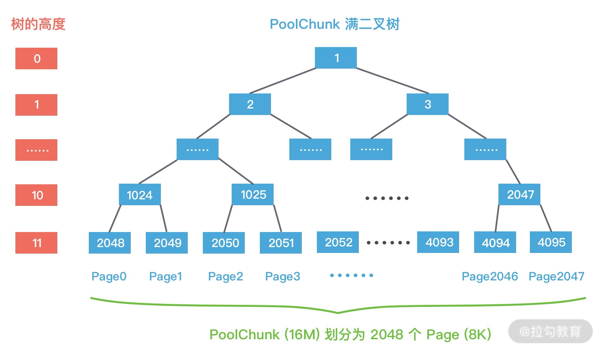

假如用户需要依次申请 8K、16K、8K 的内存，通过这里例子我们详细描述下 PoolChunk 如何分配 Page 级别的内存，方便大家理解伙伴算法的原理。

首先看下分配逻辑 allocateRun 的源码，如下所示。PoolChunk 分配 Page 主要分为三步：首先根据分配内存大小计算二叉树所在节点的高度，然后查找对应高度中是否存在可用节点，如果分配成功则减去已分配的内存大小得到剩余可用空间。

```java
private long allocateRun(int normCapacity) {
    // 根据分配内存大小计算二叉树对应的节点高度
    int d = maxOrder - (log2(normCapacity) - pageShifts);
    // 查找对应高度中是否存在可用节点
    int id = allocateNode(d);
    if (id < 0) {
        return id;
    }
    // 减去已分配的内存大小
    freeBytes -= runLength(id);
    return id;
}
```

结合 PoolChunk 的二叉树结构以及 allocateRun 源码我们开始分析模拟的示例：

第一次分配 8K 大小的内存时，通过 d = maxOrder - (log2(normCapacity) - pageShifts) 计算得到二叉树所在节点高度为 11，其中 maxOrder 为二叉树的最大高度，normCapacity 为 8K，pageShifts 默认值为 13，因为只有当申请内存大小大于 2^13 = 8K 时才会使用 allocateRun 分配内存。然后从第 11 层查找可用的 Page，下标为 2048 的节点可以被用于分配内存，即 Page\[0\] 被分配使用，此时赋值 memoryMap\[2048\] = 12，表示该节点已经不可用，然后递归更新父节点的值，父节点的值取两个子节点的最小值，memoryMap\[1024\] = 11，memoryMap\[512\] = 10，以此类推直至 memoryMap\[1\] = 1，更新后的二叉树分配结果如下图所示。


第二次分配 16K 大小内存时，计算得到所需节点的高度为 10。此时 1024 节点已经分配了一个 8K 内存，不再满足条件，继续寻找到 1025 节点。1025 节点并未使用过，满足分配条件，于是将 1025 节点的两个子节点 2050 和 2051 全部分配出去，并赋值 memoryMap\[2050\] = 12，memoryMap\[2051\] = 12，再次递归更新父节点的值，更新后的二叉树分配结果如下图所示。

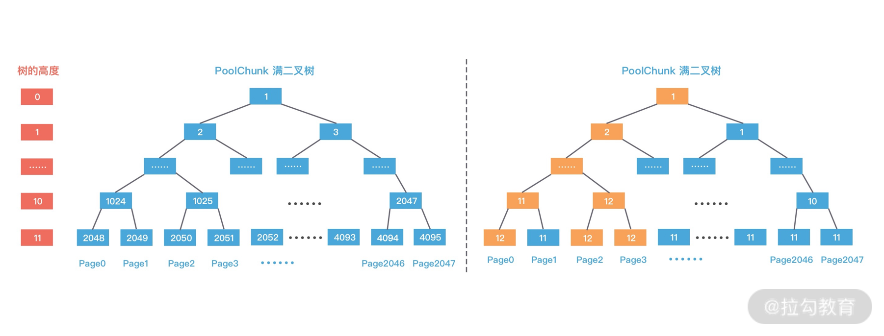

第三次再次分配 8K 大小的内存时，依然从二叉树第 11 层开始查找，2048 已经被使用，2049 可以被分配，赋值 memoryMap\[2049\] = 12，并递归更新父节点值，memoryMap\[1024\] = 12，memoryMap\[512\] = 12，以此类推直至 memoryMap\[1\] = 1，最终的二叉树分配结果如下图所示。


至此，PoolChunk 中 Page 级别的内存分配已经介绍完了，可以看出伙伴算法尽可能保证了分配内存地址的连续性，有效地降低了内存碎片。

### Subpage 级别的内存分配

为了提高内存分配的利用率，在分配小于 8K 的内存时，PoolChunk 不在分配单独的 Page，而是将 Page 划分为更小的内存块，由 PoolSubpage 进行管理。

首先我们看下 PoolSubpage 的创建过程，由于分配的内存小于 8K，所以走到了 allocateSubpage 源码中：

```java
private long allocateSubpage(int normCapacity) {
    // 根据内存大小找到 PoolArena 中 subpage 数组对应的头结点
    PoolSubpage<T> head = arena.findSubpagePoolHead(normCapacity);
    int d = maxOrder; // 因为分配内存小于 8K，所以从满二叉树最底层开始查找
    synchronized (head) {
        int id = allocateNode(d); // 在满二叉树中找到一个可用的节点
        if (id < 0) {
                return id;
        }
        final PoolSubpage<T>[] subpages = this.subpages; // 记录哪些 Page 被转化为 Subpage
        final int pageSize = this.pageSize; 
        freeBytes -= pageSize;
        int subpageIdx = subpageIdx(id); // pageId 到 subpageId 的转化，例如 pageId=2048 对应的 subpageId=0
        PoolSubpage<T> subpage = subpages[subpageIdx];
        if (subpage == null) {
            // 创建 PoolSubpage，并切分为相同大小的子内存块，然后加入 PoolArena 对应的双向链表中
            subpage = new PoolSubpage<T>(head, this, id, runOffset(id), pageSize, normCapacity);
            subpages[subpageIdx] = subpage;
        } else {
            subpage.init(head, normCapacity);
        }
        return subpage.allocate(); // 执行内存分配并返回内存地址
    }
}
```

假如我们需要分配 20B 大小的内存，一起分析下上述源码的执行过程：

1.  因为 20B 小于 512B，属于 Tiny 场景，按照内存规格的分类 20B 需要向上取整到 32B。
2.  根据内存规格的大小找到 PoolArena 中 tinySubpagePools 数组对应的头结点，32B 对应的 tinySubpagePools\[1\]。
3.  在满二叉树中寻找可用的节点用于内存分配，因为我们分配的内存小于 8K，所以直接从二叉树的最底层开始查找。假如 2049 节点是可用的，那么返回的 id = 2049。
4.  找到可用节点后，因为 pageIdx 是从叶子节点 2048 开始记录索引，而 subpageIdx 需要从 0 开始的，所以需要将 pageIdx 转化为 subpageIdx，例如 2048 对应的 subpageIdx = 0，2049 对应的 subpageIdx = 1，以此类推。
5.  如果 PoolChunk 中 subpages 数组的 subpageIdx 下标对应的 PoolSubpage 不存在，那么将创建一个新的 PoolSubpage，并将 PoolSubpage 切分为相同大小的子内存块，示例对应的子内存块大小为 32B，最后将新创建的 PoolSubpage 节点与 tinySubpagePools\[1\] 对应的 head 节点连接成双向链表。
6.  最后 PoolSubpage 执行内存分配并返回内存地址。

接下来我们跟进一下 subpage.allocate() 源码，看下 PoolSubpage 是如何执行内存分配的，源码如下：

```java
long allocate() {
    if (elemSize == 0) {
        return toHandle(0);
    }
    if (numAvail == 0 || !doNotDestroy) {
        return -1;
    }
    final int bitmapIdx = getNextAvail(); // 在 bitmap 中找到第一个索引段，然后将该 bit 置为 1
    int q = bitmapIdx >>> 6; // 定位到 bitmap 的数组下标
    int r = bitmapIdx & 63; // 取到节点对应一个 long 类型中的二进制位
    assert (bitmap[q] >>> r & 1) == 0;
    bitmap[q] |= 1L << r;
    if (-- numAvail == 0) {
        removeFromPool(); // 如果 PoolSubpage 没有可分配的内存块，从 PoolArena 双向链表中删除
    }
    return toHandle(bitmapIdx);
}
```

PoolSubpage 通过位图 bitmap 记录每个内存块是否已经被使用。在上述的示例中，8K/32B = 256，因为每个 long 有 64 位，所以需要 256/64 = 4 个 long 类型的即可描述全部的内存块分配状态，因此 bitmap 数组的长度为 4，从 bitmap\[0\] 开始记录，每分配一个内存块，就会移动到 bitmap\[0\] 中的下一个二进制位，直至 bitmap\[0\] 的所有二进制位都赋值为 1，然后继续分配 bitmap\[1\]，以此类推。当我们使用 2049 节点进行内存分配时，bitmap\[0\] 中的二进制位如下图所示：


当 bitmap 分成成功后，PoolSubpage 会将可用节点的个数 numAvail 减 1，当 numAvail 降为 0 时，表示 PoolSubpage 已经没有可分配的内存块，此时需要从 PoolArena 中 tinySubpagePools\[1\] 的双向链表中删除。

至此，整个 PoolChunk 中 Subpage 的内存分配过程已经完成了，可见 PoolChunk 的伙伴算法几乎贯穿了整个流程，位图 bitmap 的设计也是非常巧妙的，不仅节省了内存空间，而且加快了定位内存块的速度。

### PoolThreadCache 的内存分配

上节课已经介绍了 PoolThreadCache 的基本概念，我们知道 PoolArena 分配的内存被释放时，Netty 并没有将缓存归还给 PoolChunk，而是使用 PoolThreadCache 缓存起来，当下次有同样规格的内存分配时，直接从 PoolThreadCache 取出使用即可。所以下面我们从 PoolArena#allocate() 的源码中看下 PoolThreadCache 是如何使用的。

```java
private void allocate(PoolThreadCache cache, PooledByteBuf<T> buf, final int reqCapacity) {
    final int normCapacity = normalizeCapacity(reqCapacity);
    if (isTinyOrSmall(normCapacity)) { // capacity < pageSize
        int tableIdx;
        PoolSubpage<T>[] table;
        boolean tiny = isTiny(normCapacity);
        if (tiny) { // < 512
            if (cache.allocateTiny(this, buf, reqCapacity, normCapacity)) {
                return;
            }
            tableIdx = tinyIdx(normCapacity);
            table = tinySubpagePools;
        } else {
            if (cache.allocateSmall(this, buf, reqCapacity, normCapacity)) {
                return;
            }
            tableIdx = smallIdx(normCapacity);
            table = smallSubpagePools;
        }
        // 省略其他代码
    }
    if (normCapacity <= chunkSize) {
        if (cache.allocateNormal(this, buf, reqCapacity, normCapacity)) {
            return;
        }
        synchronized (this) {
            allocateNormal(buf, reqCapacity, normCapacity);
            ++allocationsNormal;
        }
    } else {
        allocateHuge(buf, reqCapacity);
    }
}
```

从源码中可以看出在分配 Tiny、Small 和 Normal 类型的内存时，都会尝试先从 PoolThreadCache 中进行分配，源码结构比较清晰，我们整体梳理一遍流程：

1.  对申请的内存大小做向上取整，例如 20B 的内存大小会取整为 32B。
2.  当申请的内存大小小于 8K 时，分为 Tiny 和 Small 两种情况，分别都会优先尝试从 PoolThreadCache 分配内存，如果 PoolThreadCache 分配失败，才会走 PoolArena 的分配流程。
3.  当申请的内存大小大于 8K，但是小于 Chunk 的默认大小 16M，属于 Normal 的内存分配，也会优先尝试从 PoolThreadCache 分配内存，如果 PoolThreadCache 分配失败，才会走 PoolArena 的分配流程。
4.  当申请的内存大小大于 Chunk 的 16M，则不会经过 PoolThreadCache，直接进行分配。

PoolThreadCache 具体分配内存的过程使用到了一个重要的数据结构 MemoryRegionCache，关于 MemoryRegionCache 的概念你可以回顾下上节课的内容，在这里我就不再赘述了。假如我们现在需要分配 32B 大小的堆外内存，会从 MemoryRegionCache 数组 tinySubPageDirectCaches\[1\] 中取出对应的 MemoryRegionCache 节点，尝试从 MemoryRegionCache 的队列中取出可用的内存块。

## 内存回收实现原理

通过之前的介绍我们知道，当用户线程释放内存时会将内存块缓存到本地线程的私有缓存 PoolThreadCache 中，这样在下次分配内存时会提高分配效率，但是当内存块被用完一次后，再没有分配需求，那么一直驻留在内存中又会造成浪费。接下来我们就看下 Netty 是如何实现内存释放的呢？直接跟进下 PoolThreadCache 的源码。

```java
private boolean allocate(MemoryRegionCache<?> cache, PooledByteBuf buf, int reqCapacity) {
    if (cache == null) {
        return false;
    }
    // 默认每执行 8192 次 allocate()，就会调用一次 trim() 进行内存整理
    boolean allocated = cache.allocate(buf, reqCapacity);
    if (++ allocations >= freeSweepAllocationThreshold) {
        allocations = 0;
        trim();
    }
    return allocated;
}
void trim() {
    trim(tinySubPageDirectCaches);
    trim(smallSubPageDirectCaches);
    trim(normalDirectCaches);
    trim(tinySubPageHeapCaches);
    trim(smallSubPageHeapCaches);
    trim(normalHeapCaches);
}
```

从源码中可以看出，Netty 记录了 allocate() 的执行次数，默认每执行 8192 次，就会触发 PoolThreadCache 调用一次 trim() 进行内存整理，会对 PoolThreadCache 中维护的六个 MemoryRegionCache 数组分别进行整理。我们继续跟进 trim 的源码，定位到核心逻辑。

```java
public final void trim() {
    int free = size - allocations;
    allocations = 0;
    // We not even allocated all the number that are
    if (free > 0) {
        free(free, false);
    }
}
private int free(int max, boolean finalizer) {
    int numFreed = 0;
    for (; numFreed < max; numFreed++) {
        Entry<T> entry = queue.poll();
        if (entry != null) {
            freeEntry(entry, finalizer);
        } else {
            // all cleared
            return numFreed;
        }
    }
    return numFreed;
}
```

通过 size - allocations 衡量内存分配执行的频繁程度，其中 size 为该 MemoryRegionCache 对应的内存规格大小，size 为固定值，例如 Tiny 类型默认为 512。allocations 表示 MemoryRegionCache 距离上一次内存整理已经发生了多少次 allocate 调用，当调用次数小于 size 时，表示 MemoryRegionCache 中缓存的内存块并不常用，从队列中取出内存块依次释放。

此外 Netty 在线程退出的时候还会回收该线程的所有内存，PoolThreadCache 重载了 finalize() 方法，在销毁前执行缓存回收的逻辑，对应源码如下：

```java
@Override
protected void finalize() throws Throwable {
    try {
        super.finalize();
    } finally {
        free(true);
    }
}
void free(boolean finalizer) {
    if (freed.compareAndSet(false, true)) {
        int numFreed = free(tinySubPageDirectCaches, finalizer) +
            free(smallSubPageDirectCaches, finalizer) +
            free(normalDirectCaches, finalizer) +
            free(tinySubPageHeapCaches, finalizer) +
            free(smallSubPageHeapCaches, finalizer) +
            free(normalHeapCaches, finalizer);
        if (numFreed > 0 && logger.isDebugEnabled()) {
            logger.debug("Freed {} thread-local buffer(s) from thread: {}", numFreed, Thread.currentThread().getName());
        }
        if (directArena != null) {
            directArena.numThreadCaches.getAndDecrement();
        }
        if (heapArena != null) {
            heapArena.numThreadCaches.getAndDecrement();
        }
    }
}
```

线程销毁时 PoolThreadCache 会依次释放所有 MemoryRegionCache 中的内存数据，其中 free 方法的核心逻辑与之前内存整理 trim 中释放内存的过程是一致的，有兴趣的同学可以自行翻阅源码。

到此为止，整个 Netty 内存池的分配和释放原理我们已经分析完了，其中巧妙的设计思路以及源码细节的实现，都是非常值得我们学习的宝贵资源。

## 总结

最后，我们对 Netty 内存池的设计思想做一个知识点总结：

*   分四种内存规格管理内存，分别为 Tiny、Samll、Normal、Huge，PoolChunk 负责管理 8K 以上的内存分配，PoolSubpage 用于管理 8K 以下的内存分配。当申请内存大于 16M 时，不会经过内存池，直接分配。
*   设计了本地线程缓存机制 PoolThreadCache，用于提升内存分配时的并发性能。用于申请 Tiny、Samll、Normal 三种类型的内存时，会优先尝试从 PoolThreadCache 中分配。
*   PoolChunk 使用伙伴算法管理 Page，以二叉树的数据结构实现，是整个内存池分配的核心所在。
*   每调用 PoolThreadCache 的 allocate() 方法到一定次数，会触发检查 PoolThreadCache 中缓存的使用频率，使用频率较低的内存块会被释放。
*   线程退出时，Netty 会回收该线程对应的所有内存。

Netty 中引入类似 jemalloc 的内存池管理技术可以说是一大突破，将 Netty 的性能又提升了一个台阶，而这种思想不仅可以用于 Netty，在很对缓存的场景下都可以借鉴学习，希望这些优秀的设计思想能够对你有所帮助，在实际工作中学以致用。

15 轻量级对象回收站：Recycler 对象池技术解析
============================

前面两节课，我们学习了 Netty 内存池的高性能设计原理，这节课会介绍 Netty 的另一种池化技术：Recycler 对象池。在刚接触到 Netty 对象池这个概念时，你是不是也会有类似的疑问：

*   对象池和内存池有什么区别？它们有什么联系吗？
*   实现对象池的方法有很多，Netty 也是自己实现的吗？是如何实现的？
*   对象池在实践中我们应该怎么使用？

带着这些问题，我们进入今天课程的学习吧。

## Recycler 快速上手

我们通过一个例子直观感受下 Recycler 如何使用，假设我们有一个 User 类，需要实现 User 对象的复用，具体实现代码如下：

```java
public class UserCache {
    private static final Recycler<User> userRecycler = new Recycler<User>() {
        @Override
        protected User newObject(Handle<User> handle) {
            return new User(handle);
        }
    };
    static final class User {
        private String name;
        private Recycler.Handle<User> handle;
        public void setName(String name) {
            this.name = name;
        }
        public String getName() {
            return name;
        }
        public User(Recycler.Handle<User> handle) {
            this.handle = handle;
        }
        public void recycle() {
            handle.recycle(this);
        }
    }
    public static void main(String[] args) {
        User user1 = userRecycler.get(); // 1、从对象池获取 User 对象
        user1.setName("hello"); // 2、设置 User 对象的属性
        user1.recycle(); // 3、回收对象到对象池
        User user2 = userRecycler.get(); // 4、从对象池获取对象
        System.out.println(user2.getName());
        System.out.println(user1 == user2);
    }
}
```

控制台的输出结果如下：

```shell
hello
true
```

代码示例中定义了对象池实例 userRecycler，其中实现了 newObject() 方法，如果对象池没有可用的对象，会调用该方法新建对象。此外需要创建 Recycler.Handle 对象与 User 对象进行绑定，这样我们就可以通过 userRecycler.get() 从对象池中获取 User 对象，如果对象不再使用，通过调用 User 类实现的 recycle() 方法即可完成回收对象到对象池。

Recycler 的使用方式是不是特别简单，我们可以单独把它当作工具类在项目中使用。

## Recycler 的设计理念

对象池与内存池的都是为了提高 Netty 的并发处理能力，我们知道 Java 中频繁地创建和销毁对象的开销是很大的，所以很多人会将一些通用对象缓存起来，当需要某个对象时，优先从对象池中获取对象实例。通过重用对象，不仅避免频繁地创建和销毁所带来的性能损耗，而且对 JVM GC 是友好的，这就是对象池的作用。

Recycler 是 Netty 提供的自定义实现的轻量级对象回收站，借助 Recycler 可以完成对象的获取和回收。既然 Recycler 是 Netty 自己实现的对象池，那么它是如何设计的呢？首先看下 Recycler 的内部结构，如下图所示：


通过 Recycler 的 UML 图可以看出，一共包含四个核心组件：**Stack**、**WeakOrderQueue**、**Link**、**DefaultHandle**，接下来我们逐一进行介绍。

首先我们先看下整个 Recycler 的内部结构中各个组件的关系，可以通过下面这幅图进行描述。


第一个核心组件是 Stack，Stack 是整个对象池的顶层数据结构，描述了整个对象池的构造，用于存储当前本线程回收的对象。在多线程的场景下，Netty 为了避免锁竞争问题，每个线程都会持有各自的对象池，内部通过 FastThreadLocal 来实现每个线程的私有化。FastThreadLocal 你可以理解为 Java 里的 ThreadLocal，后续会有专门的课程介绍它。

我们有必要先学习下 Stack 的数据结构，先看下 Stack 的源码定义：

```java
static final class Stack<T> {
    final Recycler<T> parent; // 所属的 Recycler
    final WeakReference<Thread> threadRef; // 所属线程的弱引用
    final AtomicInteger availableSharedCapacity; // 异线程回收对象时，其他线程能保存的被回收对象的最大个数
    final int maxDelayedQueues; // WeakOrderQueue最大个数
    private final int maxCapacity; // 对象池的最大大小，默认最大为 4k
    private final int ratioMask; // 控制对象的回收比率，默认只回收 1/8 的对象
    private DefaultHandle<?>[] elements; // 存储缓存数据的数组
    private int size; // 缓存的 DefaultHandle 对象个数
    private int handleRecycleCount = -1; 
    // WeakOrderQueue 链表的三个重要节点
    private WeakOrderQueue cursor, prev;
    private volatile WeakOrderQueue head;
    // 省略其他代码
}
```

对应上面 Recycler 的内部结构图，Stack 包用于存储缓存数据的 DefaultHandle 数组，以及维护了 WeakOrderQueue 链表中的三个重要节点，关于 WeakOrderQueue 相关概念我们之后再详细介绍。除此之外，Stack 其他的重要属性我在源码中已经全部以注释的形式标出，大部分已经都非常清楚，其中 availableSharedCapacity 是比较难理解的，每个 Stack 会维护一个 WeakOrderQueue 的链表，每个 WeakOrderQueue 节点会保存非当前线程的其他线程所释放的对象，例如图中 ThreadA 表示当前线程，WeakOrderQueue 的链表存储着 ThreadB、ThreadC 等其他线程释放的对象。availableSharedCapacity 的初始化方式为 new AtomicInteger(max(maxCapacity / maxSharedCapacityFactor, LINK_CAPACITY))，默认大小为 16K，其他线程在回收对象时，最多可以回收 ThreadA 创建的对象个数不能超过 availableSharedCapacity。还有一个疑问就是既然 Stack 是每个线程私有的，为什么 availableSharedCapacity 还需要用 AtomicInteger 呢？因为 ThreadB、ThreadC 等多个线程可能都会创建 ThreadA 的 WeakOrderQueue，存在同时操作 availableSharedCapacity 的情况。

第二个要介绍的组件是 WeakOrderQueue，WeakOrderQueue 用于存储其他线程回收到当前线程所分配的对象，并且在合适的时机，Stack 会从异线程的 WeakOrderQueue 中收割对象。如上图所示，ThreadB 回收到 ThreadA 所分配的内存时，就会被放到 ThreadA 的 WeakOrderQueue 当中。

第三个组件是 Link，每个 WeakOrderQueue 中都包含一个 Link 链表，回收对象都会被存在 Link 链表中的节点上，每个 Link 节点默认存储 16 个对象，当每个 Link 节点存储满了会创建新的 Link 节点放入链表尾部。

第四个组件是 DefaultHandle，DefaultHandle 实例中保存了实际回收的对象，Stack 和 WeakOrderQueue 都使用 DefaultHandle 存储回收的对象。在 Stack 中包含一个 elements 数组，该数组保存的是 DefaultHandle 实例。DefaultHandle 中每个 Link 节点所存储的 16 个对象也是使用 DefaultHandle 表示的。

到此为止，我们已经介绍完 Recycler 的内存结构，对 Recycler 有了初步的认识。Recycler 作为一个高性能的对象池，在多线程的场景下，Netty 是如何保证 Recycler 高效地分配和回收对象的呢？接下来我们一起看下 Recycler 对象获取和回收的原理。

## 从 Recycler 中获取对象

前面我们介绍了 Recycler 如何使用，从代码示例中可以看出，从对象池中获取对象的入口是在 Recycler#get() 方法，直接定位到源码：

```java
public final T get() {
    if (maxCapacityPerThread == 0) {
        return newObject((Handle<T>) NOOP_HANDLE);
    }
    Stack<T> stack = threadLocal.get(); // 获取当前线程缓存的 Stack
    DefaultHandle<T> handle = stack.pop(); // 从 Stack 中弹出一个 DefaultHandle 对象
    if (handle == null) {
        handle = stack.newHandle();
        handle.value = newObject(handle); // 创建的对象并保存到 DefaultHandle
    }
    return (T) handle.value;
}
```

Recycler#get() 方法的逻辑非常清晰，首先通过 FastThreadLocal 获取当前线程的唯一栈缓存 Stack，然后尝试从栈顶弹出 DefaultHandle 对象实例，如果 Stack 中没有可用的 DefaultHandle 对象实例，那么会调用 newObject 生成一个新的对象，完成 handle 与用户对象和 Stack 的绑定。

那么 Stack 是如何从 elements 数组中弹出 DefaultHandle 对象实例的呢？只是从 elements 数组中取出一个实例吗？我们一起跟进下 stack.pop() 的源码：

```java
DefaultHandle<T> pop() {
    int size = this.size;
    if (size == 0) {
        // 就尝试从其他线程回收的对象中转移一些到 elements 数组当中
        if (!scavenge()) {
            return null;
        }
        size = this.size;
    }
    size --;
    DefaultHandle ret = elements[size]; // 将实例从栈顶弹出
    elements[size] = null;
    if (ret.lastRecycledId != ret.recycleId) {
        throw new IllegalStateException("recycled multiple times");
    }
    ret.recycleId = 0;
    ret.lastRecycledId = 0;
    this.size = size;
    return ret;
}
```

如果 Stack 的 elements 数组中有可用的对象实例，直接将对象实例弹出；如果 elements 数组中没有可用的对象实例，会调用 scavenge 方法，scavenge 的作用是从其他线程回收的对象实例中转移一些到 elements 数组当中，也就是说，它会想办法从 WeakOrderQueue 链表中迁移部分对象实例。每个 Stack 会有一个 WeakOrderQueue 链表，每个 WeakOrderQueue 节点都维持了相应异线程回收的对象，那么以什么样的策略从 WeakOrderQueue 链表中迁移对象实例呢？继续跟进 scavenge 的源码：

```java
boolean scavenge() {
    // 尝试从 WeakOrderQueue 中转移对象实例到 Stack 中
    if (scavengeSome()) {
        return true;
    }
    // 如果迁移失败，就会重置 cursor 指针到 head 节点
    prev = null;
    cursor = head;
    return false;
}
boolean scavengeSome() {
    WeakOrderQueue prev;
    WeakOrderQueue cursor = this.cursor; // cursor 指针指向当前 WeakorderQueueu 链表的读取位置
    // 如果 cursor 指针为 null, 则是第一次从 WeakorderQueueu 链表中获取对象
    if (cursor == null) {
        prev = null;
        cursor = head;
        if (cursor == null) {
            return false;
        }
    } else {
        prev = this.prev;
    }
    boolean success = false;
    // 不断循环从 WeakOrderQueue 链表中找到一个可用的对象实例
    do {
        // 尝试迁移 WeakOrderQueue 中部分对象实例到 Stack 中
        if (cursor.transfer(this)) {
            success = true;
            break;
        }
        WeakOrderQueue next = cursor.next;
        if (cursor.owner.get() == null) {
            // 如果已退出的线程还有数据
            if (cursor.hasFinalData()) {
                for (;;) {
                    if (cursor.transfer(this)) {
                        success = true;
                    } else {
                        break;
                    }
                }
            }
            // 将已退出的线程从 WeakOrderQueue 链表中移除
            if (prev != null) {
                prev.setNext(next);
            }
        } else {
            prev = cursor;
        }
        // 将 cursor 指针指向下一个 WeakOrderQueue
        cursor = next;
    } while (cursor != null && !success);
    this.prev = prev;
    this.cursor = cursor;
    return success;
}
```

scavenge 的源码中首先会从 cursor 指针指向的 WeakOrderQueue 节点回收部分对象到 Stack 的 elements 数组中，如果没有回收到数据就会将 cursor 指针移到下一个 WeakOrderQueue，重复执行以上过程直至回到到对象实例为止。具体的流程可以结合下图来理解。

 此外，每次移动 cursor 时，都会检查 WeakOrderQueue 对应的线程是否已经退出了，如果线程已经退出，那么线程中的对象实例都会被回收，然后将 WeakOrderQueue 节点从链表中移除。

还有一个问题，每次 Stack 从 WeakOrderQueue 链表会回收多少数据呢？我们依然结合上图讲解，每个 WeakOrderQueue 中都包含一个 Link 链表，Netty 每次会回收其中的一个 Link 节点所存储的对象。从图中可以看出，Link 内部会包含一个读指针 readIndex，每个 Link 节点默认存储 16 个对象，读指针到链表尾部就是可以用于回收的对象实例，每次回收对象时，readIndex 都会从上一次记录的位置开始回收。

在回收对象实例之前，Netty 会计算出可回收对象的数量，加上 Stack 中已有的对象数量后，如果超过 Stack 的当前容量且小于 Stack 的最大容量，会对 Stack 进行扩容。为了防止回收对象太多导致 Stack 的容量激增，在每次回收时 Netty 会调用 dropHandle 方法控制回收频率，具体源码如下：

```java
boolean dropHandle(DefaultHandle<?> handle) {
    if (!handle.hasBeenRecycled) {
        if ((++handleRecycleCount & ratioMask) != 0) {
            // Drop the object.
        return true;
        }
        handle.hasBeenRecycled = true;
    }
    return false;
}
```

dropHandle 方法中主要靠 hasBeenRecycled 和 handleRecycleCount 两个变量控制回收的频率，会从每 8 个未被收回的对象中选取一个进行回收，其他的都被丢弃掉。

到此为止，从 Recycler 中获取对象的主流程已经讲完了，简单总结为两点：

*   当 Stack 中 elements 有数据时，直接从栈顶弹出。
*   当 Stack 中 elements 没有数据时，尝试从 WeakOrderQueue 中回收一个 Link 包含的对象实例到 Stack 中，然后从栈顶弹出。

## Recycler 对象回收原理

理解了如何从 Recycler 获取对象之后，再学习 Recycler 对象回收的原理就会清晰很多了，同样上文代码示例中定位到对象回收的源码入口 DefaultHandle#recycle()。

```java
// DefaultHandle#recycle
public void recycle(Object object) {
    if (object != value) {
        throw new IllegalArgumentException("object does not belong to handle");
    }
    Stack<?> stack = this.stack;
    if (lastRecycledId != recycleId || stack == null) {
        throw new IllegalStateException("recycled already");
    }
    stack.push(this);
}
// Stack#push
void push(DefaultHandle<?> item) {
    Thread currentThread = Thread.currentThread();
    if (threadRef.get() == currentThread) {
        pushNow(item);
    } else {
        pushLater(item, currentThread);
    }
}
```

从源码中可以看出，在回收对象时，会向 Stack 中 push 对象，push 会分为同线程回收和异线程回收两种情况，分别对应 pushNow 和 pushLater 两个方法，我们逐一进行分析。

### 同线程对象回收

如果是当前线程回收自己分配的对象时，会调用 pushNow 方法：

```java
private void pushNow(DefaultHandle<?> item) {
    if ((item.recycleId | item.lastRecycledId) != 0) { // 防止被多次回收
        throw new IllegalStateException("recycled already");
    }
    item.recycleId = item.lastRecycledId = OWN_THREAD_ID;
    int size = this.size;
    // 1. 超出最大容量 2. 控制回收速率
    if (size >= maxCapacity || dropHandle(item)) {
        return;
    }
    if (size == elements.length) {
        elements = Arrays.copyOf(elements, min(size << 1, maxCapacity));
    }
    elements[size] = item;
    this.size = size + 1;
}
```

同线程回收对象的逻辑非常简单，就是直接向 Stack 的 elements 数组中添加数据，对象会被存放在栈顶指针指向的位置。如果超过了 Stack 的最大容量，那么对象会被直接丢弃，同样这里使用了 dropHandle 方法控制对象的回收速率，每 8 个对象会有一个被回收到 Stack 中。

### 异线程对象回收

接下来我们分析异线程对象回收的场景，想必你已经猜到，异线程回收对象时，并不会添加到 Stack 中，而是会与 WeakOrderQueue 直接打交道，先看下 pushLater 的源码：

```java
private void pushLater(DefaultHandle<?> item, Thread thread) {
    Map<Stack<?>, WeakOrderQueue> delayedRecycled = DELAYED_RECYCLED.get(); // 当前线程帮助其他线程回收对象的缓存
    WeakOrderQueue queue = delayedRecycled.get(this); // 取出对象绑定的 Stack 对应的 WeakOrderQueue
    if (queue == null) {
        // 最多帮助 2*CPU 核数的线程回收线程
        if (delayedRecycled.size() >= maxDelayedQueues) {
            delayedRecycled.put(this, WeakOrderQueue.DUMMY); // WeakOrderQueue.DUMMY 表示当前线程无法再帮助该 Stack 回收对象
            return;
        }
        // 新建 WeakOrderQueue
        if ((queue = WeakOrderQueue.allocate(this, thread)) == null) {
            // drop object
            return;
        }
        delayedRecycled.put(this, queue);
    } else if (queue == WeakOrderQueue.DUMMY) {
        // drop object
        return;
    }
    queue.add(item); // 添加对象到 WeakOrderQueue 的 Link 链表中
}
```

pushLater 的实现过程可以总结为两个步骤：**获取 WeakOrderQueue**，**添加对象到 WeakOrderQueue 中**。

首先看下如何获取 WeakOrderQueue 对象。通过 FastThreadLocal 取出当前对象的 DELAYED\_RECYCLED 缓存，DELAYED\_RECYCLED 存放着当前线程帮助其他线程回收对象的映射关系。假如 item 是 ThreadA 分配的对象，当前线程是 ThreadB，此时 ThreadB 帮助 ThreadA 回收 item，那么 DELAYED\_RECYCLED 放入的 key 是 StackA。然后从 delayedRecycled 中取出 StackA 对应的 WeakOrderQueue，如果 WeakOrderQueue 不存在，那么为 StackA 新创建一个 WeakOrderQueue，并将其加入 DELAYED\_RECYCLED 缓存。WeakOrderQueue.allocate() 会检查帮助 StackA 回收的对象总数是否超过 2K 个，如果没有超过 2K，会将 StackA 的 head 指针指向新创建的 WeakOrderQueue，否则不再为 StackA 回收对象。

当然 ThreadB 不会只帮助 ThreadA 回收对象，它可以帮助其他多个线程回收，所以 DELAYED\_RECYCLED 使用的 Map 结构，为了防止 DELAYED\_RECYCLED 内存膨胀，Netty 也采取了保护措施，从 delayedRecycled.size() >= maxDelayedQueues 可以看出，每个线程最多帮助 2 倍 CPU 核数的线程回收线程，如果超过了该阈值，假设当前对象绑定的为 StackX，那么将在 Map 中为 StackX 放入一种特殊的 WeakOrderQueue.DUMMY，表示当前线程无法帮助 StackX 回收对象。

接下来我们继续分析对象是如何被添加到 WeakOrderQueue 的，直接跟进 queue.add(item) 的源码：

```java
void add(DefaultHandle<?> handle) {
    handle.lastRecycledId = id;
    Link tail = this.tail;
    int writeIndex;
    // 如果链表尾部的 Link 已经写满，那么再新建一个 Link 追加到链表尾部
    if ((writeIndex = tail.get()) == LINK_CAPACITY) {
        // 检查是否超过对应 Stack 可以存放的其他线程帮助回收的最大对象数
        if (!head.reserveSpace(LINK_CAPACITY)) {
            // Drop it.
            return;
        }
        this.tail = tail = tail.next = new Link();
        writeIndex = tail.get();
    }
    tail.elements[writeIndex] = handle; // 添加对象到 Link 尾部
    handle.stack = null; // handle 的 stack 属性赋值为 null
    tail.lazySet(writeIndex + 1);
}
```

在向 WeakOrderQueue 写入对象之前，会先判断 Link 链表的 tail 节点是否还有空间存放对象。如果还有空间，直接向 tail Link 尾部写入数据，否则直接丢弃对象。如果 tail Link 已经没有空间，会新建一个 Link 之后再存放对象，新建 Link 之前会检查异线程帮助回收的对象总数超过了 Stack 设置的阈值，如果超过了阈值，那么对象也会被丢弃掉。

对象被添加到 Link 之后，handle 的 stack 属性被赋值为 null，而在取出对象的时候，handle 的 stack 属性又再次被赋值回来，为什么这么做呢，岂不是很麻烦？如果 Stack 不再使用，期望被 GC 回收，发现 handle 中还持有 Stack 的引用，那么就无法被 GC 回收，从而造成内存泄漏。

到此为止，Recycler 如何回收对象的实现原理就全部分析完了，在多线程的场景下，Netty 考虑的还是非常细致的，Recycler 回收对象时向 WeakOrderQueue 中存放对象，从 Recycler 获取对象时，WeakOrderQueue 中的对象会作为 Stack 的储备，而且有效地解决了跨线程回收的问题，是一个挺新颖别致的设计。

## Recycler 在 Netty 中的应用

Recycler 在 Netty 里面使用也是非常频繁的，我们直接看下 Netty 源码中 newObject 相关的引用，如下图所示。


其中比较常用的有 PooledHeapByteBuf 和 PooledDirectByteBuf，分别对应的堆内存和堆外内存的池化实现。例如我们在使用 PooledDirectByteBuf 的时候，并不是每次都去创建新的对象实例，而是从对象池中获取预先分配好的对象实例，不再使用 PooledDirectByteBuf 时，被回收归还到对象池中。

此外，可以看到内存池的 MemoryRegionCache 也有使用到对象池，MemoryRegionCache 中保存着一个队列，队列中每个 Entry 节点用于保存内存块，Entry 节点在 Netty 中就是以对象池的形式进行分配和释放，在这里我就不展开了，建议你翻阅下源码，学习下 Entry 节点是何时被分配和释放的，从而加深下对 Recycler 对象池的理解。

## 总结

最后，简单总结下对象池几个重要的知识点：

*   对象池有两个重要的组成部分：Stack 和 WeakOrderQueue。
*   从 Recycler 获取对象时，优先从 Stack 中查找，如果 Stack 没有可用对象，会尝试从 WeakOrderQueue 迁移部分对象到 Stack 中。
*   Recycler 回收对象时，分为同线程对象回收和异线程对象回收两种情况，同线程回收直接向 Stack 中添加对象，异线程回收向 WeakOrderQueue 中的 Link 添加对象。
*   对象回收都会控制回收速率，每 8 个对象会回收一个，其他的全部丢弃。

学完内存池、对象池的设计之后，相信你已经有很大的收获，同时也感受到学好数据结构是多么重要。为了避免依赖，Netty 并没有借助第三方库实现对象池，而是采用了独特的思路自己实现了一个轻量级的对象池，其中优秀的设计思路在开发中是非常值得借鉴的。如果你已经理解了 Recycler，你可以直接在项目中当成工具类使用它，在一些高并发的场景下能够较好地提升应用的性能。

16 IO 加速：与众不同的 Netty 零拷贝技术
==========================

今天的课程我们继续讨论 Netty 实现高性能的另一个高阶特性——零拷贝。零拷贝是一个耳熟能详的词语，在 Linux、Kafka、RocketMQ 等知名的产品中都有使用，通常用于提升 I/O 性能。而且零拷贝也是面试过程中的高频问题，那么你知道零拷贝体现在哪些地方吗？Netty 的零拷贝技术又是如何实现的呢？接下来我们就针对 Netty 零拷贝特性进行详细地分析。

### 传统 Linux 中的零拷贝技术

在介绍 Netty 零拷贝特性之前，我们有必要学习下传统 Linux 中零拷贝的工作原理。所谓零拷贝，就是在数据操作时，不需要将数据从一个内存位置拷贝到另外一个内存位置，这样可以减少一次内存拷贝的损耗，从而节省了 CPU 时钟周期和内存带宽。

我们模拟一个场景，从文件中读取数据，然后将数据传输到网络上，那么传统的数据拷贝过程会分为哪几个阶段呢？具体如下图所示。


从上图中可以看出，从数据读取到发送一共经历了**四次数据拷贝**，具体流程如下：

1.  当用户进程发起 read() 调用后，上下文从用户态切换至内核态。DMA 引擎从文件中读取数据，并存储到内核态缓冲区，这里是**第一次数据拷贝**。
2.  请求的数据从内核态缓冲区拷贝到用户态缓冲区，然后返回给用户进程。第二次数据拷贝的过程同时，会导致上下文从内核态再次切换到用户态。
3.  用户进程调用 send() 方法期望将数据发送到网络中，此时会触发第三次线程切换，用户态会再次切换到内核态，请求的数据从用户态缓冲区被拷贝到 Socket 缓冲区。
4.  最终 send() 系统调用结束返回给用户进程，发生了第四次上下文切换。第四次拷贝会异步执行，从 Socket 缓冲区拷贝到协议引擎中。

> 说明：DMA（Direct Memory Access，直接内存存取）是现代大部分硬盘都支持的特性，DMA 接管了数据读写的工作，不需要 CPU 再参与 I/O 中断的处理，从而减轻了 CPU 的负担。

传统的数据拷贝过程为什么不是将数据直接传输到用户缓冲区呢？其实引入内核缓冲区可以充当缓存的作用，这样就可以实现文件数据的预读，提升 I/O 的性能。但是当请求数据量大于内核缓冲区大小时，在完成一次数据的读取到发送可能要经历数倍次数的数据拷贝，这就造成严重的性能损耗。

接下来我们介绍下使用零拷贝技术之后数据传输的流程。重新回顾一遍传统数据拷贝的过程，可以发现第二次和第三次拷贝是可以去除的，DMA 引擎从文件读取数据后放入到内核缓冲区，然后可以直接从内核缓冲区传输到 Socket 缓冲区，从而减少内存拷贝的次数。

在 Linux 中系统调用 sendfile() 可以实现将数据从一个文件描述符传输到另一个文件描述符，从而实现了零拷贝技术。在 Java 中也使用了零拷贝技术，它就是 NIO FileChannel 类中的 transferTo() 方法，transferTo() 底层就依赖了操作系统零拷贝的机制，它可以将数据从 FileChannel 直接传输到另外一个 Channel。transferTo() 方法的定义如下：

```java
public abstract long transferTo(long position, long count, WritableByteChannel target) throws IOException;
```

FileChannel#transferTo() 的使用也非常简单，我们直接看如下的代码示例，通过 transferTo() 将 from.data 传输到 to.data()，等于实现了文件拷贝的功能。

```java
public void testTransferTo() throws IOException {
    RandomAccessFile fromFile = new RandomAccessFile("from.data", "rw");
    FileChannel fromChannel = fromFile.getChannel();
    RandomAccessFile toFile = new RandomAccessFile("to.data", "rw");
    FileChannel toChannel = toFile.getChannel();
    long position = 0;
    long count = fromChannel.size();
    fromChannel.transferTo(position, count, toChannel);
}
```

在使用了 FileChannel#transferTo() 传输数据之后，我们看下数据拷贝流程发生了哪些变化，如下图所示：

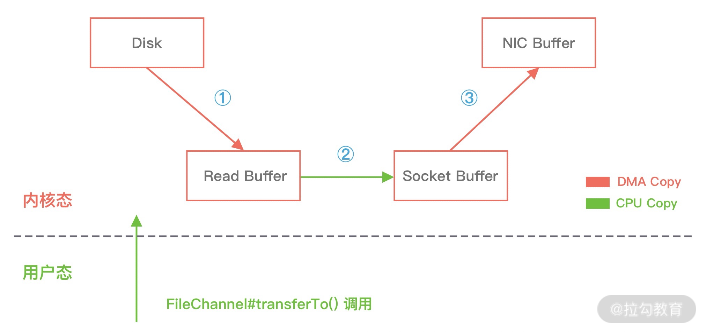

比较大的一个变化是，DMA 引擎从文件中读取数据拷贝到内核态缓冲区之后，由操作系统直接拷贝到 Socket 缓冲区，不再拷贝到用户态缓冲区，所以数据拷贝的次数从之前的 4 次减少到 3 次。

但是上述的优化离达到零拷贝的要求还是有差距的，能否继续减少内核中的数据拷贝次数呢？在 Linux 2.4 版本之后，开发者对 Socket Buffer 追加一些 Descriptor 信息来进一步减少内核数据的复制。如下图所示，DMA 引擎读取文件内容并拷贝到内核缓冲区，然后并没有再拷贝到 Socket 缓冲区，只是将数据的长度以及位置信息被追加到 Socket 缓冲区，然后 DMA 引擎根据这些描述信息，直接从内核缓冲区读取数据并传输到协议引擎中，从而消除最后一次 CPU 拷贝。


通过上述 Linux 零拷贝技术的介绍，你也许还会存在疑问，最终使用零拷贝之后，不是还存在着数据拷贝操作吗？其实从 Linux 操作系统的角度来说，零拷贝就是为了避免用户态和内存态之间的数据拷贝。无论是传统的数据拷贝还是使用零拷贝技术，其中有 2 次 DMA 的数据拷贝必不可少，只是这 2 次 DMA 拷贝都是依赖硬件来完成，不需要 CPU 参与。所以，在这里我们讨论的零拷贝是个广义的概念，只要能够减少不必要的 CPU 拷贝，都可以被称为零拷贝。

### Netty 的零拷贝技术

介绍完传统 Linux 的零拷贝技术之后，我们再来学习下 Netty 中的零拷贝如何实现。Netty 中的零拷贝和传统 Linux 的零拷贝不太一样。Netty 中的零拷贝技术除了操作系统级别的功能封装，更多的是面向用户态的数据操作优化，主要体现在以下 5 个方面：

*   堆外内存，避免 JVM 堆内存到堆外内存的数据拷贝。
*   CompositeByteBuf 类，可以组合多个 Buffer 对象合并成一个逻辑上的对象，避免通过传统内存拷贝的方式将几个 Buffer 合并成一个大的 Buffer。
*   通过 Unpooled.wrappedBuffer 可以将 byte 数组包装成 ByteBuf 对象，包装过程中不会产生内存拷贝。
*   ByteBuf.slice 操作与 Unpooled.wrappedBuffer 相反，slice 操作可以将一个 ByteBuf 对象切分成多个 ByteBuf 对象，切分过程中不会产生内存拷贝，底层共享一个 byte 数组的存储空间。
*   Netty 使用 FileRegion 实现文件传输，FileRegion 底层封装了 FileChannel#transferTo() 方法，可以将文件缓冲区的数据直接传输到目标 Channel，避免内核缓冲区和用户态缓冲区之间的数据拷贝，这属于操作系统级别的零拷贝。

下面我们从以上 5 个方面逐一进行介绍。

#### 堆外内存

如果在 JVM 内部执行 I/O 操作时，必须将数据拷贝到堆外内存，才能执行系统调用。这是所有 VM 语言都会存在的问题。那么为什么操作系统不能直接使用 JVM 堆内存进行 I/O 的读写呢？主要有两点原因：第一，操作系统并不感知 JVM 的堆内存，而且 JVM 的内存布局与操作系统所分配的是不一样的，操作系统并不会按照 JVM 的行为来读写数据。第二，同一个对象的内存地址随着 JVM GC 的执行可能会随时发生变化，例如 JVM GC 的过程中会通过压缩来减少内存碎片，这就涉及对象移动的问题了。

Netty 在进行 I/O 操作时都是使用的堆外内存，可以避免数据从 JVM 堆内存到堆外内存的拷贝。

#### CompositeByteBuf

CompositeByteBuf 是 Netty 中实现零拷贝机制非常重要的一个数据结构，CompositeByteBuf 可以理解为一个虚拟的 Buffer 对象，它是由多个 ByteBuf 组合而成，但是在 CompositeByteBuf 内部保存着每个 ByteBuf 的引用关系，从逻辑上构成一个整体。比较常见的像 HTTP 协议数据可以分为**头部信息 header**和**消息体数据 body**，分别存在两个不同的 ByteBuf 中，通常我们需要将两个 ByteBuf 合并成一个完整的协议数据进行发送，可以使用如下方式完成：

```java
ByteBuf httpBuf = Unpooled.buffer(header.readableBytes() + body.readableBytes());
httpBuf.writeBytes(header);
httpBuf.writeBytes(body);
```

可以看出，如果想实现 header 和 body 这两个 ByteBuf 的合并，需要先初始化一个新的 httpBuf，然后再将 header 和 body 分别拷贝到新的 httpBuf。合并过程中涉及两次 CPU 拷贝，这非常浪费性能。如果使用 CompositeByteBuf 如何实现类似的需求呢？如下所示：

```java
CompositeByteBuf httpBuf = Unpooled.compositeBuffer();
httpBuf.addComponents(true, header, body);
```

CompositeByteBuf 通过调用 addComponents() 方法来添加多个 ByteBuf，但是底层的 byte 数组是复用的，不会发生内存拷贝。但对于用户来说，它可以当作一个整体进行操作。那么 CompositeByteBuf 内部是如何存放这些 ByteBuf，并且如何进行合并的呢？我们先通过一张图看下 CompositeByteBuf 的内部结构：


从图上可以看出，CompositeByteBuf 内部维护了一个 Components 数组。在每个 Component 中存放着不同的 ByteBuf，各个 ByteBuf 独立维护自己的读写索引，而 CompositeByteBuf 自身也会单独维护一个读写索引。由此可见，Component 是实现 CompositeByteBuf 的关键所在，下面看下 Component 结构定义：

```java
private static final class Component {
    final ByteBuf srcBuf; // 原始的 ByteBuf
    final ByteBuf buf; // srcBuf 去除包装之后的 ByteBuf
    int srcAdjustment; // CompositeByteBuf 的起始索引相对于 srcBuf 读索引的偏移
    int adjustment; // CompositeByteBuf 的起始索引相对于 buf 的读索引的偏移
    int offset; // Component 相对于 CompositeByteBuf 的起始索引位置
    int endOffset; // Component 相对于 CompositeByteBuf 的结束索引位置
    // 省略其他代码
}
````

为了方便理解上述 Component 中的属性含义，我同样以 HTTP 协议中 header 和 body 为示例，通过一张图来描述 CompositeByteBuf 组合后其中 Component 的布局情况，如下所示：

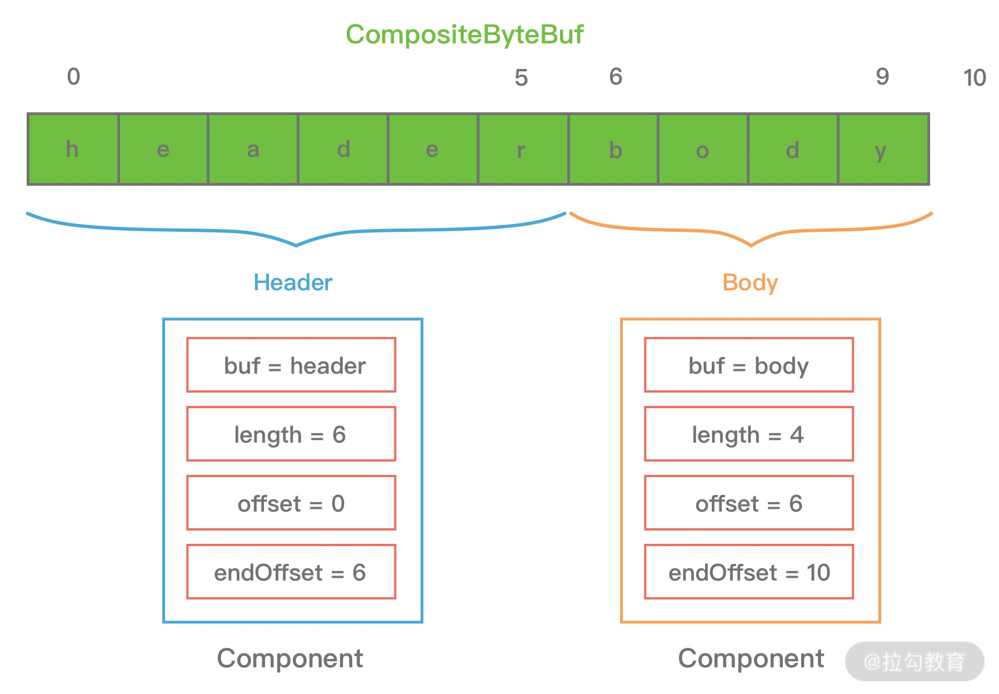

从图中可以看出，header 和 body 分别对应两个 ByteBuf，假设 ByteBuf 的内容分别为 "header" 和 "body"，那么 header ByteBuf 中 offset~endOffset 为 0~6，body ByteBuf 对应的 offset~endOffset 为 0~10。由此可见，Component 中的 offset 和 endOffset 可以表示当前 ByteBuf 可以读取的范围，通过 offset 和 endOffset 可以将每一个 Component 所对应的 ByteBuf 连接起来，形成一个逻辑整体。

此外 Component 中 srcAdjustment 和 adjustment 表示 CompositeByteBuf 起始索引相对于 ByteBuf 读索引的偏移。初始 adjustment = readIndex - offset，这样通过 CompositeByteBuf 的起始索引就可以直接定位到 Component 中 ByteBuf 的读索引位置。当 header ByteBuf 读取 1 个字节，body ByteBuf 读取 2 个字节，此时每个 Component 的属性又会发生什么变化呢？如下图所示。


至此，CompositeByteBuf 的基本原理我们已经介绍完了，关于具体 CompositeByteBuf 数据操作的细节在这里就不做展开了，有兴趣的同学可以自己深入研究 CompositeByteBuf 的源码。

#### Unpooled.wrappedBuffer 操作

介绍完 CompositeByteBuf 之后，再来理解 Unpooled.wrappedBuffer 操作就非常容易了，Unpooled.wrappedBuffer 同时也是创建 CompositeByteBuf 对象的另一种推荐做法。

Unpooled 提供了一系列用于包装数据源的 wrappedBuffer 方法，如下所示：


Unpooled.wrappedBuffer 方法可以将不同的数据源的一个或者多个数据包装成一个大的 ByteBuf 对象，其中数据源的类型包括 byte\[\]、ByteBuf、ByteBuffer。包装的过程中不会发生数据拷贝操作，包装后生成的 ByteBuf 对象和原始 ByteBuf 对象是共享底层的 byte 数组。

#### ByteBuf.slice 操作

ByteBuf.slice 和 Unpooled.wrappedBuffer 的逻辑正好相反，ByteBuf.slice 是将一个 ByteBuf 对象切分成多个共享同一个底层存储的 ByteBuf 对象。

ByteBuf 提供了两个 slice 切分方法:

```java
public ByteBuf slice();
public ByteBuf slice(int index, int length);
```

假设我们已经有一份完整的 HTTP 数据，可以通过 slice 方法切分获得 header 和 body 两个 ByteBuf 对象，对应的内容分别为 "header" 和 "body"，实现方式如下：

```java
ByteBuf httpBuf = ...
ByteBuf header = httpBuf.slice(0, 6);
ByteBuf body = httpBuf.slice(6, 4);
```

通过 slice 切分后都会返回一个新的 ByteBuf 对象，而且新的对象有自己独立的 readerIndex、writerIndex 索引，如下图所示。由于新的 ByteBuf 对象与原始的 ByteBuf 对象数据是共享的，所以通过新的 ByteBuf 对象进行数据操作也会对原始 ByteBuf 对象生效。


#### 文件传输 FileRegion

在 Netty 源码的 example 包中，提供了 FileRegion 的使用示例，以下代码片段摘自 FileServerHandler.java。

```java
@Override
public void channelRead0(ChannelHandlerContext ctx, String msg) throws Exception {
    RandomAccessFile raf = null;
    long length = -1;
    try {
        raf = new RandomAccessFile(msg, "r");
        length = raf.length();
    } catch (Exception e) {
        ctx.writeAndFlush("ERR: " + e.getClass().getSimpleName() + ": " + e.getMessage() + '\n');
        return;
    } finally {
        if (length < 0 && raf != null) {
            raf.close();
        }
    }
    ctx.write("OK: " + raf.length() + '\n');
    if (ctx.pipeline().get(SslHandler.class) == null) {
        // SSL not enabled - can use zero-copy file transfer.
        ctx.write(new DefaultFileRegion(raf.getChannel(), 0, length));
    } else {
        // SSL enabled - cannot use zero-copy file transfer.
        ctx.write(new ChunkedFile(raf));
    }
    ctx.writeAndFlush("\n");
}
```

从 FileRegion 的使用示例可以看出，Netty 使用 FileRegion 实现文件传输的零拷贝。FileRegion 的默认实现类是 DefaultFileRegion，通过 DefaultFileRegion 将文件内容写入到 NioSocketChannel。那么 FileRegion 是如何实现零拷贝的呢？我们通过源码看看 FileRegion 到底使用了什么黑科技。

```java
public class DefaultFileRegion extends AbstractReferenceCounted implements FileRegion {
    private final File f; // 传输的文件
    private final long position; // 文件的起始位置
    private final long count; // 传输的字节数
    private long transferred; // 已经写入的字节数
    private FileChannel file; // 文件对应的 FileChannel
    @Override
    public long transferTo(WritableByteChannel target, long position) throws IOException {
        long count = this.count - position;
        if (count < 0 || position < 0) {
            throw new IllegalArgumentException("position out of range: " + position +" (expected: 0 - " + (this.count - 1) + ')');
        }
        if (count == 0) {
            return 0L;
        }
        if (refCnt() == 0) {
            throw new IllegalReferenceCountException(0);
        }
        open();
        long written = file.transferTo(this.position + position, count, target);
        if (written > 0) {
            transferred += written;
        } else if (written == 0) {
            validate(this, position);
        }
        return written;
    }
    // 省略其他代码
}
```

从源码可以看出，FileRegion 其实就是对 FileChannel 的包装，并没有什么特殊操作，底层使用的是 JDK NIO 中的 FileChannel#transferTo() 方法实现文件传输，所以 FileRegion 是操作系统级别的零拷贝，对于传输大文件会很有帮助。

到此为止，Netty 相关的零拷贝技术都已经介绍完了，可以看出 Netty 对于 ByteBuf 做了更多精进的设计和优化。

### 总结

零拷贝是网络编程中一种常用的技术，可以用于优化网络数据传输的性能。本文介绍了操作系统 Linux 和 Netty 中的零拷贝技术，Netty 除了支持操作系统级别的零拷贝，更多提供了面向用户态的零拷贝特性，主要体现在 5 个方面：堆外内存、CompositeByteBuf、Unpooled.wrappedBuffer、ByteBuf.slice 以及 FileRegion。以操作系统的角度来看，零拷贝是一个广义的概念，可以认为只要能够减少不必要的 CPU 拷贝，都可以理解为是零拷贝。

最后，留一个思考题，使用具备零拷贝特性的 transfer() 方法拷贝文件，一定会比传统 I/O 的方式更高效吗？

# 17 源码篇：从 Linux 出发深入剖析服务端启动流程

通过前几章课程的学习，我们已经对 Netty 的技术思想和基本原理有了初步的认识，从今天这节课开始我们将正式进入 Netty 核心源码学习的课程。希望能够通过源码解析的方式让你更加深入理解 Netty 的精髓，如 Netty 的设计思想、工程技巧等，为之后继续深入研究 Netty 打下坚实的基础。

在课程开始之前，我想分享一下关于源码学习的几点经验和建议。第一，很多同学在开始学习源码时面临的第一个问题就是不知道从何下手，这个时候一定不能对着源码毫无意义地四处翻看。建议你可以通过 Hello World 或者 TestCase 作为源码学习的入口，然后再通过 Debug 断点的方式调试并跑通源码。第二，阅读源码一定要有全局观。首先要把握源码的主流程，避免刚开始陷入代码细节的死胡同。第三，源码一定要反复阅读，让自己每一次读都有不同的收获。我们可以通过画图、注释的方式帮助自己更容易理解源码的核心流程，方便后续的复习和回顾。

作为源码解析的第一节课，我们将深入分析 Netty 服务端的启动流程。启动服务的过程中我们可以了解到 Netty 各大核心组件的关系，这将是学习 Netty 源码一个非常好的切入点，让我们一起看看 Netty 的每个零件是如何运转起来的吧。

> 说明：本文参考的 Netty 源码版本为 4.1.42.Final。

## 从 Echo 服务器示例入手


在《引导器作用：客户端和服务端启动都要做些什么？》的课程中，我们介绍了如何使用引导器搭建服务端的基本框架。在这里我们实现了一个最简单的 Echo 服务器，用于调试 Netty 服务端启动的源码。

```java
public class EchoServer {
    public void startEchoServer(int port) throws Exception {
        EventLoopGroup bossGroup = new NioEventLoopGroup();
        EventLoopGroup workerGroup = new NioEventLoopGroup();
        try {
            ServerBootstrap b = new ServerBootstrap();
            b.group(bossGroup, workerGroup)
                .channel(NioServerSocketChannel.class)
                .handler(new LoggingHandler(LogLevel.INFO)) // 设置ServerSocketChannel 对应的 Handler
                .childHandler(new ChannelInitializer<SocketChannel>() { // 设置 SocketChannel 对应的 Handler
                        @Override
                        public void initChannel(SocketChannel ch) {
                            ch.pipeline().addLast(new FixedLengthFrameDecoder(10));
                            ch.pipeline().addLast(new ResponseSampleEncoder());
                            ch.pipeline().addLast(new RequestSampleHandler());
                        }
                    });
            ChannelFuture f = b.bind(port).sync();
            f.channel().closeFuture().sync();
        } finally {
            bossGroup.shutdownGracefully();
            workerGroup.shutdownGracefully();
        }
    }
}
```

我们以引导器 ServerBootstrap 为切入点，开始深入分析 Netty 服务端的启动流程。在服务端启动之前，需要配置 ServerBootstrap 的相关参数，这一步大致可以分为以下几个步骤：

*   配置 EventLoopGroup 线程组；
*   配置 Channel 的类型；
*   设置 ServerSocketChannel 对应的 Handler；
*   设置网络监听的端口；
*   设置 SocketChannel 对应的 Handler；
*   配置 Channel 参数。


配置 ServerBootstrap 参数的过程非常简单，把参数值保存在 ServerBootstrap 定义的成员变量里就可以了。我们可以看下 ServerBootstrap 的成员变量定义，基本与 ServerBootstrap 暴露出来的配置方法是一一对应的。如下所示，我以注释的形式说明每个成员变量对应的调用方法。

```java
volatile EventLoopGroup group; // group()
volatile EventLoopGroup childGroup; // group()
volatile ChannelFactory<? extends C> channelFactory; // channel()
volatile SocketAddress localAddress; // localAddress
Map<ChannelOption<?>, Object> childOptions = new ConcurrentHashMap<ChannelOption<?>, Object>(); // childOption()
volatile ChannelHandler childHandler; // childHandler()
ServerBootstrapConfig config = new ServerBootstrapConfig(this);
```

关于 ServerBootstrap 如何为每个成员变量保存参数的过程，我们就不一一展开了，你可以理解为这部分工作只是一个前置准备，课后你可以自己跟进下每个方法的源码。今天我们核心聚焦在 b.bind().sync() 这行代码，bind() 才是真正进行服务器端口绑定和启动的入口，sync() 表示阻塞等待服务器启动完成。接下来我们对 bind() 方法进行展开分析。

在开始源码分析之前，我们带着以下几个问题边看边思考：

*   Netty 自己实现的 Channel 与 JDK 底层的 Channel 是如何产生联系的？
*   ChannelInitializer 这个特殊的 Handler 处理器的作用是什么？
*   Pipeline 初始化的过程是什么样的？

## 服务端启动全过程

首先我们来看下 ServerBootstrap 中 bind() 方法的源码实现：

```java
public ChannelFuture bind() {
    validate();
    SocketAddress localAddress = this.localAddress;
    if (localAddress == null) {
        throw new IllegalStateException("localAddress not set");
    }
    return doBind(localAddress);
}
private ChannelFuture doBind(final SocketAddress localAddress) {
    final ChannelFuture regFuture = initAndRegister();
    final Channel channel = regFuture.channel();
    if (regFuture.cause() != null) {
        return regFuture;
    }
    if (regFuture.isDone()) {
        ChannelPromise promise = channel.newPromise();
        doBind0(regFuture, channel, localAddress, promise);
        return promise;
    } else {
        final PendingRegistrationPromise promise = new PendingRegistrationPromise(channel);
        regFuture.addListener(new ChannelFutureListener() {
            @Override
            public void operationComplete(ChannelFuture future) throws Exception {
                Throwable cause = future.cause();
                if (cause != null) {
                    promise.setFailure(cause);
                } else {
                    promise.registered();
                    doBind0(regFuture, channel, localAddress, promise);
                }
            }
        });
        return promise;
    }
}
```

由此可见，doBind() 方法是我们需要分析的重点。我们再一起看下 doBind() 具体做了哪些事情：

1.  调用 initAndRegister() 初始化并注册 Channel，同时返回一个 ChannelFuture 实例 regFuture，所以我们可以猜测出 initAndRegister() 是一个异步的过程。
2.  接下来通过 regFuture.cause() 方法判断 initAndRegister() 的过程是否发生异常，如果发生异常则直接返回。
3.  regFuture.isDone() 表示 initAndRegister() 是否执行完毕，如果执行完毕则调用 doBind0() 进行 Socket 绑定。如果 initAndRegister() 还没有执行结束，regFuture 会添加一个 ChannelFutureListener 回调监听，当 initAndRegister() 执行结束后会调用 operationComplete()，同样通过 doBind0() 进行端口绑定。

doBind() 整个实现结构非常清晰，其中 initAndRegister() 负责 Channel 初始化和注册，doBind0() 用于端口绑定。这两个过程最为重要，下面我们分别进行详细的介绍。

## 服务端 Channel 初始化及注册

initAndRegister() 方法顾名思义，主要负责初始化和注册的相关工作，我们具体看下它的源码实现：

```java
final ChannelFuture initAndRegister() {
    Channel channel = null;
    try {
        channel = channelFactory.newChannel(); // 创建 Channel
        init(channel); // 初始化 Channel
    } catch (Throwable t) {
        if (channel != null) {
            channel.unsafe().closeForcibly();
            return new DefaultChannelPromise(channel, GlobalEventExecutor.INSTANCE).setFailure(t);
        }
        return new DefaultChannelPromise(new FailedChannel(), GlobalEventExecutor.INSTANCE).setFailure(t);
    }

    ChannelFuture regFuture = config().group().register(channel); // 注册 Channel

    if (regFuture.cause() != null) {
        if (channel.isRegistered()) {
            channel.close();
        } else {
            channel.unsafe().closeForcibly();
        }
    }
    return regFuture;
}
```

initAndRegister() 可以分为三步：创建 Channel、初始化 Channel 和注册 Channel，接下来我们一步步进行拆解分析。

### 创建服务端 Channel

首先看下创建 Channel 的过程，直接跟进 channelFactory.newChannel() 的源码。

```java
public class ReflectiveChannelFactory<T extends Channel> implements ChannelFactory<T> {
    private final Constructor<? extends T> constructor;
    public ReflectiveChannelFactory(Class<? extends T> clazz) {
        ObjectUtil.checkNotNull(clazz, "clazz");
        try {
            this.constructor = clazz.getConstructor();
        } catch (NoSuchMethodException e) {
            throw new IllegalArgumentException("Class " + StringUtil.simpleClassName(clazz) +
                    " does not have a public non-arg constructor", e);
        }
    }
    @Override
    public T newChannel() {
        try {
            return constructor.newInstance(); // 反射创建对象
        } catch (Throwable t) {
            throw new ChannelException("Unable to create Channel from class " + constructor.getDeclaringClass(), t);
        }
    }
    // 省略其他代码
}
```

在前面 Echo 服务器的示例中，我们通过 channel(NioServerSocketChannel.class) 配置 Channel 的类型，工厂类 ReflectiveChannelFactory 是在该过程中被创建的。从 constructor.newInstance() 我们可以看出，ReflectiveChannelFactory 通过反射创建出 NioServerSocketChannel 对象，所以我们重点需要关注 NioServerSocketChannel 的构造函数。

```java
public NioServerSocketChannel() {
    this(newSocket(DEFAULT_SELECTOR_PROVIDER)); 
}
public NioServerSocketChannel(ServerSocketChannel channel) {
    super(null, channel, SelectionKey.OP_ACCEPT); // 调用父类方法
    config = new NioServerSocketChannelConfig(this, javaChannel().socket());
}
private static ServerSocketChannel newSocket(SelectorProvider provider) {
    try {
        return provider.openServerSocketChannel(); // 创建 JDK 底层的 ServerSocketChannel
    } catch (IOException e) {
        throw new ChannelException(
                    "Failed to open a server socket.", e);
    }
}
```

SelectorProvider 是 JDK NIO 中的抽象类实现，通过 openServerSocketChannel() 方法可以用于创建服务端的 ServerSocketChannel。而且 SelectorProvider 会根据操作系统类型和版本的不同，返回不同的实现类，具体可以参考 DefaultSelectorProvider 的源码实现：

```java
public static SelectorProvider create() {
    String osname = AccessController.doPrivileged(new GetPropertyAction("os.name"));
    if (osname.equals("SunOS"))
        return createProvider("sun.nio.ch.DevPollSelectorProvider");
    if (osname.equals("Linux"))
        return createProvider("sun.nio.ch.EPollSelectorProvider");
    return new sun.nio.ch.PollSelectorProvider();
}
```

在这里我们只讨论 Linux 操作系统的场景，在 Linux 内核 2.6版本及以上都会默认采用 EPollSelectorProvider。如果是旧版本则使用 PollSelectorProvider。对于目前的主流 Linux 平台而言，都是采用 Epoll 机制实现的。

创建完 ServerSocketChannel，我们回到 NioServerSocketChannel 的构造函数，接着它会通过 super() 依次调用到父类的构造进行初始化工作，最终我们可以定位到 AbstractNioChannel 和 AbstractChannel 的构造函数：

```java
protected AbstractNioChannel(Channel parent, SelectableChannel ch, int readInterestOp) {
    super(parent);
    // 省略其他代码
    try {
        ch.configureBlocking(false);
    } catch (IOException e) {
        // 省略其他代码
    }
}
protected AbstractChannel(Channel parent) {
    this.parent = parent;
    id = newId(); // Channel 全局唯一 id 
    unsafe = newUnsafe(); // unsafe 操作底层读写
    pipeline = newChannelPipeline(); // pipeline 负责业务处理器编排
}
```

首先调用 AbstractChannel 的构造函数创建了三个重要的成员变量，分别为 id、unsafe、pipeline。id 表示全局唯一的 Channel，unsafe 用于操作底层数据的读写操作，pipeline 负责业务处理器的编排。初始化状态，pipeline 的内部结构只包含头尾两个节点，如下图所示。三个核心成员变量创建好之后，会回到 AbstractNioChannel 的构造函数，通过 ch.configureBlocking(false) 设置 Channel 是非阻塞模式。

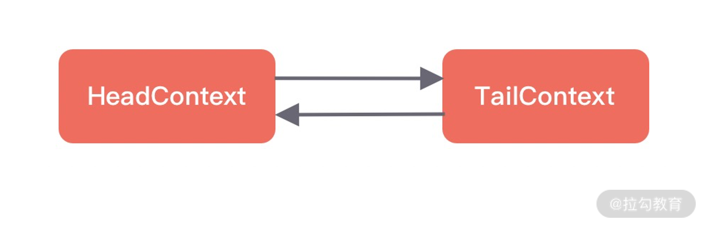

创建服务端 Channel 的过程我们已经讲完了，简单总结下其中几个重要的步骤：

1.  ReflectiveChannelFactory 通过反射创建 NioServerSocketChannel 实例；
2.  创建 JDK 底层的 ServerSocketChannel；
3.  为 Channel 创建 id、unsafe、pipeline 三个重要的成员变量；
4.  设置 Channel 为非阻塞模式。

### 初始化服务端 Channel

回到 ServerBootstrap 的 initAndRegister() 方法，继续跟进用于初始化服务端 Channel 的 init() 方法源码：

```java
void init(Channel channel) {
    setChannelOptions(channel, options0().entrySet().toArray(newOptionArray(0)), logger); // 设置 Socket 参数
    setAttributes(channel, attrs0().entrySet().toArray(newAttrArray(0))); // 保存用户自定义属性
    ChannelPipeline p = channel.pipeline();
    // 获取 ServerBootstrapAcceptor 的构造参数
    final EventLoopGroup currentChildGroup = childGroup;
    final ChannelHandler currentChildHandler = childHandler;
    final Entry<ChannelOption<?>, Object>[] currentChildOptions = childOptions.entrySet().toArray(newOptionArray(0));
    final Entry<AttributeKey<?>, Object>[] currentChildAttrs = childAttrs.entrySet().toArray(newAttrArray(0));
    // 添加特殊的 Handler 处理器
    p.addLast(new ChannelInitializer<Channel>() {
        @Override
        public void initChannel(final Channel ch) {
            final ChannelPipeline pipeline = ch.pipeline();
            ChannelHandler handler = config.handler();
            if (handler != null) {
                pipeline.addLast(handler);
            }
            ch.eventLoop().execute(new Runnable() {
                @Override
                public void run() {
                    pipeline.addLast(new ServerBootstrapAcceptor(ch, currentChildGroup, currentChildHandler, currentChildOptions, currentChildAttrs));
                }
            });
        }
    });
}
```

init() 方法的源码比较长，我们依然拆解成两个部分来看：

第一步，设置 Socket 参数以及用户自定义属性。在创建服务端 Channel 时，Channel 的配置参数保存在 NioServerSocketChannelConfig 中，在初始化 Channel 的过程中，Netty 会将这些参数设置到 JDK 底层的 Socket 上，并把用户自定义的属性绑定在 Channel 上。

第二步，添加特殊的 Handler 处理器。首先 ServerBootstrap 为 Pipeline 添加了一个 ChannelInitializer，ChannelInitializer 是实现了 ChannelHandler 接口的匿名类，其中 ChannelInitializer 实现的 initChannel() 方法用于添加 ServerSocketChannel 对应的 Handler。然后 Netty 通过异步 task 的方式又向 Pipeline 一个处理器 ServerBootstrapAcceptor，从 ServerBootstrapAcceptor 的命名可以看出，这是一个连接接入器，专门用于接收新的连接，然后把事件分发给 EventLoop 执行，在这里我们先不做展开。此时服务端的 pipeline 内部结构又发生了变化，如下图所示。

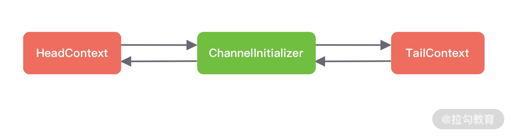

思考一个问题，为什么需要 ChannelInitializer 处理器呢？ServerBootstrapAcceptor 的注册过程为什么又需要封装成异步 task 呢？因为我们在初始化时，还没有将 Channel 注册到 Selector 对象上，所以还无法注册 Accept 事件到 Selector 上，所以事先添加了 ChannelInitializer 处理器，等待 Channel 注册完成后，再向 Pipeline 中添加 ServerBootstrapAcceptor 处理器。

服务端 Channel 初始化的过程已经结束了。整体流程比较简单，主要是设置 Socket 参数以及用户自定义属性，并向 Pipeline 中添加了两个特殊的处理器。接下来我们继续分析，如何将初始化好的 Channel 注册到 Selector 对象上？

### 注册服务端 Channel

回到 initAndRegister() 的主流程，创建完服务端 Channel 之后，继续一层层跟进 register() 方法的源码：

```java
// MultithreadEventLoopGroup#register
public ChannelFuture register(Channel channel) {
    return next().register(channel); // 选择一个 eventLoop 注册
}
// AbstractChannel#register
public final void register(EventLoop eventLoop, final ChannelPromise promise) {
    // 省略其他代码
    AbstractChannel.this.eventLoop = eventLoop;
    if (eventLoop.inEventLoop()) { // Reactor 线程内部调用
        register0(promise);
    } else { // 外部线程调用
        try {
            eventLoop.execute(new Runnable() {
                @Override
                public void run() {
                        register0(promise);
                }
            });
        } catch (Throwable t) {
            // 省略其他代码
        }
    }
}
```

Netty 会在线程池 EventLoopGroup 中选择一个 EventLoop 与当前 Channel 进行绑定，之后 Channel 生命周期内的所有 I/O 事件都由这个 EventLoop 负责处理，如 accept、connect、read、write 等 I/O 事件。可以看出，不管是 EventLoop 线程本身调用，还是外部线程用，最终都会通过 register0() 方法进行注册：

```java
private void register0(ChannelPromise promise) {
    try {
        if (!promise.setUncancellable() || !ensureOpen(promise)) {
            return;
        }
        boolean firstRegistration = neverRegistered;
        doRegister(); // 调用 JDK 底层的 register() 进行注册
        neverRegistered = false;
        registered = true;
        pipeline.invokeHandlerAddedIfNeeded(); // 触发 handlerAdded 事件
        safeSetSuccess(promise);
        pipeline.fireChannelRegistered(); // 触发 channelRegistered 事件
        // 此时 Channel 还未注册绑定地址，所以处于非活跃状态
        if (isActive()) {
            if (firstRegistration) {
                pipeline.fireChannelActive(); // Channel 当前状态为活跃时，触发 channelActive 事件
            } else if (config().isAutoRead()) {
                beginRead();
            }
        }
    } catch (Throwable t) {
            // 省略其他代码
    }
}
```

register0() 主要做了四件事：调用 JDK 底层进行 Channel 注册、触发 handlerAdded 事件、触发 channelRegistered 事件、Channel 当前状态为活跃时，触发 channelActive 事件。我们对它们逐一进行分析。

首先看下 JDK 底层注册 Channel 的过程，对应 doRegister() 方法的实现逻辑。

```java
protected void doRegister() throws Exception {
    boolean selected = false;
    for (;;) {
        try {
            selectionKey = javaChannel().register(eventLoop().unwrappedSelector(), 0, this); // 调用 JDK 底层的 register() 进行注册
            return;
        } catch (CancelledKeyException e) {
            // 省略其他代码
        }
    }
}
public final SelectionKey register(Selector sel, int ops, Object att) throws ClosedChannelException {
    synchronized (regLock) {
        // 省略其他代码
        SelectionKey k = findKey(sel);
        if (k != null) {
                k.interestOps(ops);
            k.attach(att);
        }
        if (k == null) {
            synchronized (keyLock) {
                if (!isOpen())
                    throw new ClosedChannelException();
                k = ((AbstractSelector)sel).register(this, ops, att);
                addKey(k);
            }
        }
        return k;
    }
}
```

javaChannel().register() 负责调用 JDK 底层，将 Channel 注册到 Selector 上，register() 的第三个入参传入的是 Netty 自己实现的 Channel 对象，调用 register() 方法会将它绑定在 JDK 底层 Channel 的 attachment 上。这样在每次 Selector 对象进行事件循环时，Netty 都可以从返回的 JDK 底层 Channel 中获得自己的 Channel 对象。

完成 Channel 向 Selector 注册后，接下来就会触发 Pipeline 一系列的事件传播。在事件传播之前，用户自定义的业务处理器是如何被添加到 Pipeline 中的呢？答案就在pipeline.invokeHandlerAddedIfNeeded() 当中，我们重点看下 handlerAdded 事件的处理过程。invokeHandlerAddedIfNeeded() 方法的调用层次比较深，推荐你结合上述 Echo 服务端示例，使用 IDE Debug 的方式跟踪调用栈，如下图所示。


我们首先抓住 ChannelInitializer 中的核心源码，逐层进行分析。

```java
// ChannelInitializer
public void handlerAdded(ChannelHandlerContext ctx) throws Exception {
        if (ctx.channel().isRegistered()) {
            if (initChannel(ctx)) {
                removeState(ctx);
        }
    }
}
private boolean initChannel(ChannelHandlerContext ctx) throws Exception {
        if (initMap.add(ctx)) {
        try {
            initChannel((C) ctx.channel()); // 调用 ChannelInitializer 实现的 initChannel() 方法
        } catch (Throwable cause) {
            exceptionCaught(ctx, cause);
        } finally {
            ChannelPipeline pipeline = ctx.pipeline();
            if (pipeline.context(this) != null) {
                pipeline.remove(this); // 将 ChannelInitializer 自身从 Pipeline 中移出
            }
        }
        return true;
    }
    return false;
}
```

可以看出 ChannelInitializer 首先会调用 initChannel() 抽象方法，然后 Netty 会把 ChannelInitializer 自身从 Pipeline 移出。其中 initChannel() 抽象方法是在哪里实现的呢？这就要跟踪到 ServerBootstrap 之前的 init() 方法，其中有这么一段代码：


```java
p.addLast(new ChannelInitializer<Channel>() {
    @Override
    public void initChannel(final Channel ch) {
        final ChannelPipeline pipeline = ch.pipeline();
        ChannelHandler handler = config.handler();
        if (handler != null) {
            pipeline.addLast(handler);
        }
        ch.eventLoop().execute(new Runnable() {
            @Override
            public void run() {
                pipeline.addLast(new ServerBootstrapAcceptor(ch, currentChildGroup, currentChildHandler, currentChildOptions, currentChildAttrs));
            }
        });
    }
});
```

在前面我们已经分析了 initChannel() 方法的实现逻辑，首先向 Pipeline 中添加 ServerSocketChannel 对应的 Handler，然后通过异步 task 的方式向 Pipeline 添加 ServerBootstrapAcceptor 处理器。其中有一个点不要混淆，handler() 方法是添加到服务端的Pipeline 上，而 childHandler() 方法是添加到客户端的 Pipeline 上。所以对应 Echo 服务器示例中，此时被添加的是 LoggingHandler 处理器。

因为添加 ServerBootstrapAcceptor 是一个异步过程，需要 EventLoop 线程负责执行。而当前 EventLoop 线程正在执行 register0() 的注册流程，所以等到 register0() 执行完之后才能被添加到 Pipeline 当中。完成 initChannel() 这一步之后，ServerBootstrapAcceptor 并没有被添加到 Pipeline 中，此时 Pipeline 的内部结构变化如下图所示。 


我们回到 register0() 的主流程，接着向下分析。channelRegistered 事件是由 fireChannelRegistered() 方法触发，沿着 Pipeline 的 Head 节点传播到 Tail 节点，并依次调用每个 ChannelHandler 的 channelRegistered() 方法。然而此时 Channel 还未注册绑定地址，所以处于非活跃状态，所以并不会触发 channelActive 事件。

执行完整个 register0() 的注册流程之后，EventLoop 线程会将 ServerBootstrapAcceptor 添加到 Pipeline 当中，此时 Pipeline 的内部结构又发生了变化，如下图所示。 


整个服务端 Channel 注册的流程我们已经讲完，注册过程中 Pipeline 结构的变化值得你再反复梳理，从而加深理解。目前服务端还是不能工作的，还差最后一步就是进行端口绑定，我们继续向下分析。

### 端口绑定

回到 ServerBootstrap 的 bind() 方法，我们继续跟进端口绑定 doBind0() 的源码。

```java
public final void bind(final SocketAddress localAddress, final ChannelPromise promise) {
    assertEventLoop();
    // 省略其他代码
    boolean wasActive = isActive();
    try {
        doBind(localAddress); // 调用 JDK 底层进行端口绑定
    } catch (Throwable t) {
        safeSetFailure(promise, t);
        closeIfClosed();
        return;
    }
    if (!wasActive && isActive()) {
        invokeLater(new Runnable() {
            @Override
            public void run() {
                pipeline.fireChannelActive(); // 触发 channelActive 事件
            }
        });
    }
    safeSetSuccess(promise);
}
```

bind() 方法主要做了两件事，分别为调用 JDK 底层进行端口绑定；绑定成功后并触发 channelActive 事件。下面我们逐一进行分析。

首先看下调用 JDK 底层进行端口绑定的 doBind() 方法：

```java
protected void doBind(SocketAddress localAddress) throws Exception {
    if (PlatformDependent.javaVersion() >= 7) {
        javaChannel().bind(localAddress, config.getBacklog());
    } else {
        javaChannel().socket().bind(localAddress, config.getBacklog());
    }
}
```

Netty 会根据 JDK 版本的不同，分别调用 JDK 底层不同的 bind() 方法。我使用的是 JDK8，所以会调用 JDK 原生 Channel 的 bind() 方法。执行完 doBind() 之后，服务端 JDK 原生的 Channel 真正已经完成端口绑定了。

完成端口绑定之后，Channel 处于活跃 Active 状态，然后会调用 pipeline.fireChannelActive() 方法触发 channelActive 事件。我们可以一层层跟进 fireChannelActive() 方法，发现其中比较重要的部分：

```java
// DefaultChannelPipeline#channelActive
public void channelActive(ChannelHandlerContext ctx) {
    ctx.fireChannelActive();
    readIfIsAutoRead();
}
// AbstractNioChannel#doBeginRead
protected void doBeginRead() throws Exception {
    // Channel.read() or ChannelHandlerContext.read() was called
    final SelectionKey selectionKey = this.selectionKey;
    if (!selectionKey.isValid()) {
        return;
    }
    readPending = true;
    final int interestOps = selectionKey.interestOps();
    if ((interestOps & readInterestOp) == 0) {
        selectionKey.interestOps(interestOps | readInterestOp); // 注册 OP_ACCEPT 事件到服务端 Channel 的事件集合
    }
}
```

可以看出，在执行完 channelActive 事件传播之后，会调用 readIfIsAutoRead() 方法触发 Channel 的 read 事件，而它最终调用到 AbstractNioChannel 中的 doBeginRead() 方法，其中 readInterestOp 参数就是在前面初始化 Channel 所传入的 SelectionKey.OP\_ACCEPT 事件，所以 OP\_ACCEPT 事件会被注册到 Channel 的事件集合中。

到此为止，整个服务端已经真正启动完毕。我们总结一下服务端启动的全流程，如下图所示。 


*   **创建服务端 Channel**：本质是创建 JDK 底层原生的 Channel，并初始化几个重要的属性，包括 id、unsafe、pipeline 等。
*   **初始化服务端 Channel**：设置 Socket 参数以及用户自定义属性，并添加两个特殊的处理器 ChannelInitializer 和 ServerBootstrapAcceptor。
*   **注册服务端 Channel**：调用 JDK 底层将 Channel 注册到 Selector 上。
*   **端口绑定**：调用 JDK 底层进行端口绑定，并触发 channelActive 事件，把 OP_ACCEPT 事件注册到 Channel 的事件集合中。

## 加餐：服务端如何处理客户端新建连接

Netty 服务端完全启动后，就可以对外工作了。接下来 Netty 服务端是如何处理客户端新建连接的呢？主要分为四步：

1.  Boss NioEventLoop 线程轮询客户端新连接 OP_ACCEPT 事件；
2.  构造 Netty 客户端 NioSocketChannel；
3.  注册 Netty 客户端 NioSocketChannel 到 Worker 工作线程中；
4.  注册 OP_READ 事件到 NioSocketChannel 的事件集合。

下面我们对每个步骤逐一进行简单的介绍。

Netty 中 Boss NioEventLoop 专门负责接收新的连接，关于 NioEventLoop 的核心源码我们下节课会着重介绍，在这里我们只先了解基本的处理流程。当客户端有新连接接入服务端时，Boss NioEventLoop 会监听到 OP_ACCEPT 事件，源码如下所示：

```java
// NioEventLoop#processSelectedKey
if ((readyOps & (SelectionKey.OP_READ | SelectionKey.OP_ACCEPT)) != 0 || readyOps == 0) {
    unsafe.read();
}
```

NioServerSocketChannel 所持有的 unsafe 是 NioMessageUnsafe 类型，我们看下 NioMessageUnsafe.read() 方法中做了什么事。

```java
public void read() {
    assert eventLoop().inEventLoop();
    final ChannelConfig config = config();
    final ChannelPipeline pipeline = pipeline();
    final RecvByteBufAllocator.Handle allocHandle = unsafe().recvBufAllocHandle(); 
    allocHandle.reset(config);
    boolean closed = false;
    Throwable exception = null;
    try {
        try {
            do {
                int localRead = doReadMessages(readBuf);  // while 循环不断读取 Buffer 中的数据
                if (localRead == 0) {
                    break;
                }
                if (localRead < 0) {
                    closed = true;
                    break;
                }
                allocHandle.incMessagesRead(localRead);
            } while (allocHandle.continueReading());
        } catch (Throwable t) {
            exception = t;
        }
        int size = readBuf.size();
        for (int i = 0; i < size; i ++) {
            readPending = false;
            pipeline.fireChannelRead(readBuf.get(i)); // 传播读取事件
        }
        readBuf.clear();
        allocHandle.readComplete();
        pipeline.fireChannelReadComplete(); // 传播读取完毕事件
        // 省略其他代码
    } finally {
            if (!readPending && !config.isAutoRead()) {
                removeReadOp();
        }
    }
}
```

可以看出 read() 方法的核心逻辑就是通过 while 循环不断读取数据，然后放入 List 中，这里的数据其实就是新连接。需要重点跟进一下 NioServerSocketChannel 的 doReadMessages() 方法。

```java
protected int doReadMessages(List<Object> buf) throws Exception {
    SocketChannel ch = SocketUtils.accept(javaChannel());
    try {
        if (ch != null) {
            buf.add(new NioSocketChannel(this, ch));
            return 1;
        }
    } catch (Throwable t) {
        logger.warn("Failed to create a new channel from an accepted socket.", t);
        try {
            ch.close();
        } catch (Throwable t2) {
            logger.warn("Failed to close a socket.", t2);
        }
    }
    return 0;
}
```

这时就开始执行第二个步骤：构造 Netty 客户端 NioSocketChannel。Netty 先通过 JDK 底层的 accept() 获取 JDK 原生的 SocketChannel，然后将它封装成 Netty 自己的 NioSocketChannel。新建 Netty 的客户端 Channel 的实现原理与上文中我们讲到的创建服务端 Channel 的过程是类似的，只是服务端 Channel 的类型是 NioServerSocketChannel，而客户端 Channel 的类型是 NioSocketChannel。NioSocketChannel 的创建同样会完成几件事：创建核心成员变量 id、unsafe、pipeline；注册 SelectionKey.OP_READ 事件；设置 Channel 的为非阻塞模式；新建客户端 Channel 的配置。

成功构造客户端 NioSocketChannel 后，接下来会通过 pipeline.fireChannelRead() 触发 channelRead 事件传播。对于服务端来说，此时 Pipeline 的内部结构如下图所示。 


上文中我们提到了一种特殊的处理器 ServerBootstrapAcceptor，在这里它就发挥了重要的作用。channelRead 事件会传播到 ServerBootstrapAcceptor.channelRead() 方法，channelRead() 会将客户端 Channel 分配到工作线程组中去执行。具体实现如下：

```java
public void channelRead(ChannelHandlerContext ctx, Object msg) {
    final Channel child = (Channel) msg;
    // 在客户端 Channel 中添加 childHandler，childHandler 是用户在启动类中通过 childHandler() 方法指定的
    child.pipeline().addLast(childHandler);
    setChannelOptions(child, childOptions, logger);
    setAttributes(child, childAttrs);
    try {
        // 注册客户端 Channel
        childGroup.register(child).addListener(new ChannelFutureListener() {
            @Override
            public void operationComplete(ChannelFuture future) throws Exception {
                if (!future.isSuccess()) {
                    forceClose(child, future.cause());
                }
            }
        });
    } catch (Throwable t) {
        forceClose(child, t);
    }
}
```

ServerBootstrapAcceptor 开始就把 msg 强制转换为 Channel。难道不会有其他类型的数据吗？因为 ServerBootstrapAcceptor 是服务端 Channel 中一个特殊的处理器，而服务端 Channel 的 channelRead 事件只会在新连接接入时触发，所以这里拿到的数据都是客户端新连接。

ServerBootstrapAcceptor 通过 childGroup.register() 方法会完成第三和第四两个步骤，将 NioSocketChannel 注册到 Worker 工作线程中，并注册 OP\_READ 事件到 NioSocketChannel 的事件集合。在注册过程中比较有意思的一点是，它会调用 pipeline.fireChannelRegistered() 方法传播 channelRegistered 事件，然后再调用 pipeline.fireChannelActive() 方法传播 channelActive 事件。兜了一圈，这又会回到之前我们介绍的 readIfIsAutoRead() 方法，此时它会将 SelectionKey.OP\_READ 事件注册到 Channel 的事件集合。

关于服务端如何处理客户端新建连接的具体源码，我在此就不继续展开了。这里留一个小任务，建议你亲自动手分析下 childGroup.register() 的相关源码，从而加深对服务端启动以及新连接处理流程的理解。有了服务端启动源码分析的基础，再去理解客户端新建连接的过程会相对容易很多。

## 总结

本节课我们深入分析了 Netty 服务端启动的全流程，对其中涉及的核心组件有了基本的认识。Netty 服务端启动的相关源码层次比较深，推荐大家在读源码的时候，可以先把主体流程梳理清楚，开始时先不用纠结具体的方法是用来做什么，自顶而下先画出完整的调用链路图（如下图所示），然后再逐一击破。 

下节课，我们将学习 Netty 最核心的 Reactor 线程模型的源码，推荐你把两节课放在一起再进行复习，可以解答你目前不少的疑问，如异步 task 是如何封装并执行的？事件注册之后是如何被处理的？

# 18 源码篇：解密 Netty Reactor 线程模型

通过第一章 Netty 基础课程的学习，我们知道 Reactor 线程模型是 Netty 实现高性能的核心所在，在 Netty 中 EventLoop 是 Reactor 线程模型的核心处理引擎，那么 EventLoop 到底是如何实现的呢？又是如何保证高性能和线程安全性的呢？今天这节课让我们一起一探究竟。

> 说明：本文参考的 Netty 源码版本为 4.1.42.Final。

## Reactor 线程执行的主流程

在《事件调度层：为什么 EventLoop 是 Netty 的精髓》的课程中，我们介绍了 EventLoop 的概貌，因为 Netty 是基于 NIO 实现的，所以推荐使用 NioEventLoop 实现，我们再次通过 NioEventLoop 的核心入口 run() 方法回顾 Netty Reactor 线程模型执行的主流程，并以此为基础继续深入研究 NioEventLoop 的逻辑细节。

```
protected void run() {
    for (;;) {
        try {
            try {
                switch (selectStrategy.calculateStrategy(selectNowSupplier, hasTasks())) {
                case SelectStrategy.CONTINUE:
                continue;
                case SelectStrategy.BUSY_WAIT:
                case SelectStrategy.SELECT:
                    select(wakenUp.getAndSet(false)); // 轮询 I/O 事件
                    if (wakenUp.get()) {
                            selector.wakeup();
                    }
                default:
                }
            } catch (IOException e) {
                rebuildSelector0();
                handleLoopException(e);
                continue;
            }
            cancelledKeys = 0;
            needsToSelectAgain = false;
            final int ioRatio = this.ioRatio;
            if (ioRatio == 100) {
                try {
                     processSelectedKeys(); // 处理 I/O 事件
                } finally {
                    runAllTasks(); // 处理所有任务
                }
            } else {
                final long ioStartTime = System.nanoTime();
                try {
                    processSelectedKeys(); // 处理 I/O 事件
                } finally {
                    final long ioTime = System.nanoTime() - ioStartTime;
                    runAllTasks(ioTime * (100 - ioRatio) / ioRatio); // 处理完 I/O 事件，再处理异步任务队列
                }
            }
        } catch (Throwable t) {
            handleLoopException(t);
        }
        try {
                if (isShuttingDown()) {
                    closeAll();
                if (confirmShutdown()) {
                        return;
                }
            }
        } catch (Throwable t) {
            handleLoopException(t);
        }
    }
}
```

NioEventLoop 的 run() 方法是一个无限循环，没有任何退出条件，在不间断循环执行以下三件事情，可以用下面这张图形象地表示。


*   轮询 I/O 事件（select）：轮询 Selector 选择器中已经注册的所有 Channel 的 I/O 事件。
*   处理 I/O 事件（processSelectedKeys）：处理已经准备就绪的 I/O 事件。
*   处理异步任务队列（runAllTasks）：Reactor 线程还有一个非常重要的职责，就是处理任务队列中的非 I/O 任务。Netty 提供了 ioRatio 参数用于调整 I/O 事件处理和任务处理的时间比例。

下面我们对 NioEventLoop 的三个步骤进行详细的介绍。

### 轮询 I/O 事件

我们首先聚焦在轮询 I/O 事件的关键代码片段：

```
case SelectStrategy.CONTINUE:
    continue;
case SelectStrategy.BUSY_WAIT:
case SelectStrategy.SELECT:
    select(wakenUp.getAndSet(false));
    if (wakenUp.get()) {
            selector.wakeup();
    }
```

NioEventLoop 通过核心方法 select() 不断轮询注册的 I/O 事件。当没有 I/O 事件产生时，为了避免 NioEventLoop 线程一直循环空转，在获取 I/O 事件或者异步任务时需要阻塞线程，等待 I/O 事件就绪或者异步任务产生后才唤醒线程。NioEventLoop 使用 wakeUp 变量表示是否唤醒 selector，Netty 在每一次执行新的一轮循环之前，都会将 wakeUp 设置为 false。

Netty 提供了选择策略 SelectStrategy 对象，它用于控制 select 循环行为，包含 CONTINUE、SELECT、BUSY\_WAIT 三种策略，因为 NIO 并不支持 BUSY\_WAIT，所以 BUSY_WAIT 与 SELECT 的执行逻辑是一样的。在 I/O 事件循环的过程中 Netty 选择使用何种策略，具体的判断依据如下：

```java
// DefaultSelectStrategy#calculateStrategy
public int calculateStrategy(IntSupplier selectSupplier, boolean hasTasks) throws Exception {
    return hasTasks ? selectSupplier.get() : SelectStrategy.SELECT;
}
// NioEventLoop#selectNowSupplier
private final IntSupplier selectNowSupplier = new IntSupplier() {
    @Override
    public int get() throws Exception {
        return selectNow();
    }
}
// NioEventLoop#selectNow
int selectNow() throws IOException {
    try {
        return selector.selectNow();
    } finally {
        if (wakenUp.get()) {
            selector.wakeup();
        }
    }
}
```

如果当前 NioEventLoop 线程存在异步任务，会通过 selectSupplier.get() 最终调用到 selectNow() 方法，selectNow() 是非阻塞，执行后立即返回。如果存在就绪的 I/O 事件，那么会走到 default 分支后直接跳出，然后执行 I/O 事件处理 processSelectedKeys 和异步任务队列处理 runAllTasks 的逻辑。所以在存在异步任务的场景，NioEventLoop 会优先保证 CPU 能够及时处理异步任务。

当 NioEventLoop 线程的不存在异步任务，即任务队列为空，返回的是 SELECT 策略, 就会调用 select(boolean oldWakenUp) 方法，接下来我们看看 select() 内部是如何实现的：

```java
private void select(boolean oldWakenUp) throws IOException {
    Selector selector = this.selector;
    try {
        int selectCnt = 0;
        long currentTimeNanos = System.nanoTime();
        long selectDeadLineNanos = currentTimeNanos + delayNanos(currentTimeNanos); // 计算 select 阻塞操作的最后截止时间
        long normalizedDeadlineNanos = selectDeadLineNanos - initialNanoTime();
        if (nextWakeupTime != normalizedDeadlineNanos) {
            nextWakeupTime = normalizedDeadlineNanos;
        }
        for (; ; ) {
            // ------ 1. 检测 select 阻塞操作是否超过截止时间 ------
            long timeoutMillis = (selectDeadLineNanos - currentTimeNanos + 500000L) / 1000000L;
            if (timeoutMillis <= 0) {
                if (selectCnt == 0) {
                    selector.selectNow();
                    selectCnt = 1;
                }
                break;
            }
            // ------ 2. 轮询过程中如果有任务产生，中断本次轮询
            if (hasTasks() && wakenUp.compareAndSet(false, true)) {
                selector.selectNow();
                selectCnt = 1;
                break;
            }
            // ------ 3. select 阻塞等待获取 I/O 事件 ------
            int selectedKeys = selector.select(timeoutMillis);
            selectCnt++;
            if (selectedKeys != 0 || oldWakenUp || wakenUp.get() || hasTasks() || hasScheduledTasks()) {
                break;
            }
            if (Thread.interrupted()) {
                if (logger.isDebugEnabled()) {
                    logger.debug("Selector.select() returned prematurely because " +
                            "Thread.currentThread().interrupt() was called. Use " +
                            "NioEventLoop.shutdownGracefully() to shutdown the NioEventLoop.");
                }
                selectCnt = 1;
                break;
            }
            // ------ 4. 解决臭名昭著的 JDK epoll 空轮询 Bug ------
            long time = System.nanoTime();
            if (time - TimeUnit.MILLISECONDS.toNanos(timeoutMillis) >= currentTimeNanos) {
                selectCnt = 1;
            } else if (SELECTOR_AUTO_REBUILD_THRESHOLD > 0 &&
                    selectCnt >= SELECTOR_AUTO_REBUILD_THRESHOLD) {
                selector = selectRebuildSelector(selectCnt);
                selectCnt = 1;
                break;
            }
            currentTimeNanos = time;
        }
        if (selectCnt > MIN_PREMATURE_SELECTOR_RETURNS) {
            if (logger.isDebugEnabled()) {
                logger.debug("Selector.select() returned prematurely {} times in a row for Selector {}.",
                        selectCnt - 1, selector);
            }
        }
    } catch (CancelledKeyException e) {
        if (logger.isDebugEnabled()) {
            logger.debug(CancelledKeyException.class.getSimpleName() + " raised by a Selector {} - JDK bug?",
                    selector, e);
        }
    }
}
```

Netty 为了解决臭名昭著的 JDK epoll 空轮询 Bug，造成整个 select() 方法是相对比较复杂的，我把它划分成四个部分逐一拆解来看。

**第一步，检测 select 阻塞操作是否超过截止时间。** 在进入无限循环之前，Netty 首先记录了当前时间 currentTimeNanos 以及定时任务队列中最近待执行任务的执行时间 selectDeadLineNanos，Netty 中定时任务队列是按照延迟时间从小到大进行排列的，通过调用 delayNanos(currentTimeNanos) 方法可以获得第一个待执行定时任务的延迟时间。然后代码会进入无限循环。首先判断 currentTimeNanos 是否超过 selectDeadLineNanos 0.5ms 以上，如果超过说明当前任务队列中有定时任务需要立刻执行，所以此时会退出无限循环。退出之前如果从未执行过 select 操作，那么会立即一次非阻塞的 selectNow 操作。那么这里有一个疑问，为什么会留出 0.5ms 的时间窗口呢？在任务队列为空的情况下，可能 select 操作没有获得到任何 I/O 事件就立即停止阻塞返回。

其中有一点容易混淆，Netty 的任务队列包括普通任务、定时任务以及尾部任务，hasTask() 判断的是普通任务队列和尾部队列是否为空，而 delayNanos(currentTimeNanos) 方法获取的是定时任务的延迟时间。

**第二步，轮询过程中及时处理产生的任务。** Netty 为了保证任务能够及时执行，会立即一次非阻塞的 selectNow 操作后，立即跳出循环回到事件循环的主流程，确保接下来能够优先执行 runAllTasks。

**第三步，select 阻塞等待获取 I/O 事件。** 执行 select 阻塞操作，说明任务队列已经为空，而且第一个待执行定时任务还没有到达任务执行的截止时间，需要阻塞等待 timeoutMillis 的超时时间。假设一种极端情况，如果定时任务的截止时间非常久，那么 select 操作岂不是会一直阻塞造成 Netty 无法工作？所以 Netty 在外部线程添加任务的时候，可以唤醒 select 阻塞操作，具体源码如下：

```java
// SingleThreadEventExecutor#execute
public void execute(Runnable task) {
    // 省略其他代码
    if (!addTaskWakesUp && wakesUpForTask(task)) {
        wakeup(inEventLoop); 
    }
}
// NioEventLoop#wakeup
protected void wakeup(boolean inEventLoop) {
    // 如果是外部线程，设置 wakenUp 为true，则唤醒 select 阻塞操作
    if (!inEventLoop && wakenUp.compareAndSet(false, true)) {
        selector.wakeup(); 
    }
}
```

selector.wakeup() 操作的开销是非常大的，所以 Netty 并不是每次都直接调用，在每次调用之前都会先执行 wakenUp.compareAndSet(false, true)，只有设置成功之后才会执行 selector.wakeup() 操作。

**第四步，解决臭名昭著的 JDK epoll 空轮询 Bug。** 在之前的课程中已经初步介绍了 Netty 的解决方案，在这里结合整体 select 操作我们再做一次回顾。实际上 Netty 并没有从根源上解决该问题，而是巧妙地规避了这个问题。Netty 引入了计数变量 selectCnt，用于记录 select 操作的次数，如果事件轮询时间小于 timeoutMillis，并且在该时间周期内连续发生超过 SELECTOR\_AUTO\_REBUILD_THRESHOLD（默认512） 次空轮询，说明可能触发了 epoll 空轮询 Bug。Netty 通过重建新的 Selector 对象，将异常的 Selector 中所有的 SelectionKey 会重新注册到新建的 Selector，重建完成之后异常的 Selector 就可以废弃了。

NioEventLoop 轮询 I/O 事件 select 的过程已经讲完了，我们简单总结 select 过程所做的事情。select 操作也是一个无限循环，在事件轮询之前检查任务队列是否为空，确保任务队列中待执行的任务能够及时执行。如果任务队列中已经为空，然后执行 select 阻塞操作获取等待获取 I/O 事件。Netty 通过引入计数器变量，并统计在一定时间窗口内 select 操作的执行次数，识别出可能存在异常的 Selector 对象，然后采用重建 Selector 的方式巧妙地避免了 JDK epoll 空轮询的问题。

### 处理 I/O 事件

通过 select 过程我们已经获取到准备就绪的 I/O 事件，接下来就需要调用 processSelectedKeys() 方法处理 I/O 事件。在开始处理 I/O 事件之前，Netty 通过 ioRatio 参数控制 I/O 事件处理和任务处理的时间比例，默认为 ioRatio = 50。如果 ioRatio = 100，表示每次都处理完 I/O 事件后，会执行所有的 task。如果 ioRatio < 100，也会优先处理完 I/O 事件，再处理异步任务队列。所以不论如何 processSelectedKeys() 都是先执行的，接下来跟进下 processSelectedKeys() 的源码：

```java
private void processSelectedKeys() {
    if (selectedKeys != null) {
        processSelectedKeysOptimized();
    } else {
        processSelectedKeysPlain(selector.selectedKeys());
    }
}
```

处理 I/O 事件时有两种选择，一种是处理 Netty 优化过的 selectedKeys，另外一种是正常的处理逻辑。根据是否设置了 selectedKeys 来判断使用哪种策略，这两种策略使用的 selectedKeys 集合是不一样的。Netty 优化过的 selectedKeys 是 SelectedSelectionKeySet 类型，而正常逻辑使用的是 JDK HashSet 类型。下面我们逐一介绍两种策略的实现。

**1\. processSelectedKeysPlain**

首先看下正常的处理逻辑 processSelectedKeysPlain 的源码：

```java
private void processSelectedKeysPlain(Set<SelectionKey> selectedKeys) {
    if (selectedKeys.isEmpty()) {
        return;
    }
    Iterator<SelectionKey> i = selectedKeys.iterator();
    for (; ; ) {
        final SelectionKey k = i.next();
        final Object a = k.attachment();
        i.remove();
        if (a instanceof AbstractNioChannel) {
            // I/O 事件由 Netty 负责处理
            processSelectedKey(k, (AbstractNioChannel) a);
        } else {
            // 用户自定义任务
            @SuppressWarnings("unchecked")
            NioTask<SelectableChannel> task = (NioTask<SelectableChannel>) a;
            processSelectedKey(k, task);
        }
        if (!i.hasNext()) {
            break;
        }
        if (needsToSelectAgain) {
            selectAgain();
            selectedKeys = selector.selectedKeys();
            if (selectedKeys.isEmpty()) {
                break;
            } else {
                i = selectedKeys.iterator();
            }
        }
    }
}
```

Netty 会遍历依次处理已经就绪的 SelectionKey，SelectionKey 上面可以挂载 attachment。再根据 attachment 属性可以判断 SelectionKey 的类型，SelectionKey 的类型可能是 AbstractNioChannel 和 NioTask，这两种类型对应的处理方式也是不同的，AbstractNioChannel 类型由 Netty 框架负责处理，NioTask 是用户自定义的 task，一般不会是这种类型。我们着重看下 AbstractNioChannel 的处理场景，跟进 processSelectedKey() 的源码：

```java
private void processSelectedKey(SelectionKey k, AbstractNioChannel ch) {
    final AbstractNioChannel.NioUnsafe unsafe = ch.unsafe();
    if (!k.isValid()) { // 检查 Key 是否合法
        final EventLoop eventLoop;
        try {
            eventLoop = ch.eventLoop();
        } catch (Throwable ignored) {
            return;
        }
        if (eventLoop != this || eventLoop == null) {
            return;
        }
        unsafe.close(unsafe.voidPromise()); // Key 不合法，直接关闭连接
        return;
    }
    try {
        int readyOps = k.readyOps();
        // 处理连接事件
        if ((readyOps & SelectionKey.OP_CONNECT) != 0) {
            int ops = k.interestOps();
            ops &= ~SelectionKey.OP_CONNECT;
            k.interestOps(ops);
            unsafe.finishConnect();
        }
        // 处理可写事件
        if ((readyOps & SelectionKey.OP_WRITE) != 0) {
            ch.unsafe().forceFlush();
        }
        // 处理可读事件
        if ((readyOps & (SelectionKey.OP_READ | SelectionKey.OP_ACCEPT)) != 0 || readyOps == 0) {
            unsafe.read();
        }
    } catch (CancelledKeyException ignored) {
        unsafe.close(unsafe.voidPromise());
    }
}
```


从上述源码可知，processSelectedKey 一共处理了 OP\_CONNECT、OP\_WRITE、OP_READ 三个事件，我们分别了解下这三个事件的处理过程。

OP\_CONNECT 连接建立事件。表示 TCP 连接建立成功, Channel 处于 Active 状态。处理 OP\_CONNECT 事件首先将该事件从事件集合中清除，避免事件集合中一直存在连接建立事件，然后调用 unsafe.finishConnect() 方法通知上层连接已经建立。可以跟进 unsafe.finishConnect() 的源码发现会底层调用的 pipeline().fireChannelActive() 方法，这时会产生一个 Inbound 事件，然后会在 Pipeline 中进行传播，依次调用 ChannelHandler 的 channelActive() 方法，通知各个 ChannelHandler 连接建立成功。

*   **OP_WRITE，可写事件**。表示上层可以向 Channel 写入数据，通过执行 ch.unsafe().forceFlush() 操作，将数据冲刷到客户端，最终会调用 javaChannel 的 write() 方法执行底层写操作。
*   **OP_READ，可读事件**。表示 Channel 收到了可以被读取的新数据。Netty 将 READ 和 Accept 事件进行了统一的封装，都通过 unsafe.read() 进行处理。unsafe.read() 的逻辑可以归纳为几个步骤：从 Channel 中读取数据并存储到分配的 ByteBuf；调用 pipeline.fireChannelRead() 方法产生 Inbound 事件，然后依次调用 ChannelHandler 的 channelRead() 方法处理数据；调用 pipeline.fireChannelReadComplete() 方法完成读操作；最终执行 removeReadOp() 清除 OP_READ 事件。

我们再次回到 processSelectedKeysPlain 的主流程，接下来会判断 needsToSelectAgain 决定是否需要重新轮询。如果 needsToSelectAgain == true，会调用 selectAgain() 方法进行重新轮询，该方法会将 needsToSelectAgain 再次置为 false，然后调用 selectorNow() 后立即返回。

我们回顾一下 Reactor 线程的主流程，会发现每次在处理 I/O 事件之前，needsToSelectAgain 都会被设置为 false，那么在什么场景下 needsToSelectAgain 会再次设置为 true 呢？我们通过查找变量的引用，最后定位到 AbstractChannel#doDeregister。该方法的作用是将 Channel 从当前注册的 Selector 对象中移除，方法内部可能会把 needsToSelectAgain 设置为 true，具体源码如下：

```java
protected void doDeregister() throws Exception {
    eventLoop().cancel(selectionKey());
}
void cancel(SelectionKey key) {
    key.cancel();
    cancelledKeys++;
    // 当取消的 Key 超过默认阈值 256，needsToSelectAgain 设置为 true
    if (cancelledKeys >= CLEANUP_INTERVAL) {
        cancelledKeys = 0;
        needsToSelectAgain = true;
    }
}
```

当 Netty 在处理 I/O 事件的过程中，如果发现超过默认阈值 256 个 Channel 从 Selector 对象中移除后，会将 needsToSelectAgai 设置为 true，重新做一次轮询操作，从而确保 keySet 的有效性。

**2\. processSelectedKeysOptimized**

介绍完正常的 I/O 事件处理 processSelectedKeysPlain 之后，回过头我们再来分析 Netty 优化的 processSelectedKeysOptimized 就会轻松很多，Netty 是否采用 SelectedSelectionKeySet 类型的优化策略由 DISABLE\_KEYSET\_OPTIMIZATION 参数决定。那么到底 SelectedSelectionKeySet 是如何进行优化的呢？我们继续跟进下 processSelectedKeysOptimized 的源码：

```java
private void processSelectedKeysOptimized() {
    for (int i = 0; i < selectedKeys.size; ++i) {
        final SelectionKey k = selectedKeys.keys[i];
        selectedKeys.keys[i] = null;
        final Object a = k.attachment();
        if (a instanceof AbstractNioChannel) {
            processSelectedKey(k, (AbstractNioChannel) a);
        } else {
            @SuppressWarnings("unchecked")
            NioTask<SelectableChannel> task = (NioTask<SelectableChannel>) a;
            processSelectedKey(k, task);
        }
        if (needsToSelectAgain) {
            selectedKeys.reset(i + 1);
            selectAgain();
            i = -1;
        }
    }
}
```

可以发现 processSelectedKeysOptimized 与 processSelectedKeysPlain 的代码结构非常相似，其中最重要的一点就是 selectedKeys 的遍历方式是不同的，所以还是需要看下 SelectedSelectionKeySet 的源码一探究竟。

```java
final class SelectedSelectionKeySet extends AbstractSet<SelectionKey> {
    SelectionKey[] keys;
    int size;
    SelectedSelectionKeySet() {
        keys = new SelectionKey[1024];
    }
    @Override
    public boolean add(SelectionKey o) {
        if (o == null) {
            return false;
        }
        keys[size++] = o;
        if (size == keys.length) {
            increaseCapacity();
        }
        return true;
    }
    // 省略其他代码}
}
```

因为 SelectedSelectionKeySet 内部使用的是 SelectionKey 数组，所以 processSelectedKeysOptimized 可以直接通过遍历数组取出 I/O 事件，相比 JDK HashSet 的遍历效率更高。SelectedSelectionKeySet 内部通过 size 变量记录数据的逻辑长度，每次执行 add 操作时，会把对象添加到 SelectionKey\[\] 尾部。当 size 等于 SelectionKey\[\] 的真实长度时，SelectionKey\[\] 会进行扩容。相比于 HashSet，SelectionKey\[\] 不需要考虑哈希冲突的问题，所以可以实现 O(1) 时间复杂度的 add 操作。

那么 SelectedSelectionKeySet 是什么时候生成的呢？通过查找 SelectedSelectionKeySet 的引用定位到 NioEventLoop#openSelector 方法，摘录核心源码片段如下：

```java
private SelectorTuple openSelector() {
    // 省略其他代码
    final SelectedSelectionKeySet selectedKeySet = new SelectedSelectionKeySet();
    Object maybeException = AccessController.doPrivileged(new PrivilegedAction<Object>() {
        @Override
        public Object run() {
            try {
                Field selectedKeysField = selectorImplClass.getDeclaredField("selectedKeys");
                Field publicSelectedKeysField = selectorImplClass.getDeclaredField("publicSelectedKeys");
                if (PlatformDependent.javaVersion() >= 9 && PlatformDependent.hasUnsafe()) {
                    long selectedKeysFieldOffset = PlatformDependent.objectFieldOffset(selectedKeysField);
                    long publicSelectedKeysFieldOffset =
                            PlatformDependent.objectFieldOffset(publicSelectedKeysField);
                    if (selectedKeysFieldOffset != -1 && publicSelectedKeysFieldOffset != -1) {
                        PlatformDependent.putObject(
                                unwrappedSelector, selectedKeysFieldOffset, selectedKeySet);
                        PlatformDependent.putObject(
                                unwrappedSelector, publicSelectedKeysFieldOffset, selectedKeySet);
                        return null;
                    }
                }
                // 省略其他代码
            } catch (NoSuchFieldException e) {
                return e;
            } catch (IllegalAccessException e) {
                return e;
            }
        }
    });
    // 省略其他代码
}
```

Netty 通过反射的方式，将 Selector 对象内部的 selectedKeys 和 publicSelectedKeys 替换为 SelectedSelectionKeySet，原先 selectedKeys 和 publicSelectedKeys 这两个字段都是 HashSet 类型。这真是很棒的一个小技巧，对于 JDK 底层的优化一般是很少见的，Netty 在细节优化上追求极致的精神值得我们学习。

到这里，Reactor 线程主流程的第二步。处理 I/O 事件 processSelectedKeys 已经讲完了，简单总结一下 processSelectedKeys 的要点。处理 I/O 事件时有两种选择，一种是处理 Netty 优化过的 selectedKeys，另外一种是正常的处理逻辑，两种策略的处理逻辑是相似的，都是通过获取 SelectionKey 上挂载的 attachment 判断 SelectionKey 的类型，不同的 SelectionKey 的类型又会调用不同的处理方法，然后通过 Pipeline 进行事件传播。Netty 优化过的 selectedKeys 是使用数组存储的 SelectionKey，相比于 JDK 的 HashSet 遍历效率更高效。processSelectedKeys 还做了更多的优化处理，如果发现超过默认阈值 256 个 Channel 从 Selector 对象中移除后，会重新做一次轮询操作，以确保 keySet 的有效性。

### 处理异步任务队列

继续分析 Reactor 线程主流程的最后一步，处理异步任务队列 runAllTasks。为什么 Netty 能够保证 Channel 的操作都是线程安全的呢？这要归功于 Netty 的任务机制。下面我们从任务添加和任务执行两个方面介绍 Netty 的任务机制。

*   **任务添加**

NioEventLoop 内部有两个非常重要的异步任务队列，分别为普通任务队列和定时任务队列。NioEventLoop 提供了 execute() 和 schedule() 方法用于向不同的队列中添加任务，execute() 用于添加普通任务，schedule() 方法用于添加定时任务。

首先我们看下如何添加普通任务。NioEventLoop 继承自 SingleThreadEventExecutor，SingleThreadEventExecutor 提供了 execute() 用于添加普通任务，源码如下：

```java
public void execute(Runnable task) {
    if (task == null) {
        throw new NullPointerException("task");
    }
    boolean inEventLoop = inEventLoop();
    addTask(task);
    if (!inEventLoop) {
        startThread();
        if (isShutdown()) {
            boolean reject = false;
            try {
                if (removeTask(task)) {
                    reject = true;
                }
            } catch (UnsupportedOperationException e) {
            }
            if (reject) {
                reject();
            }
        }
    }
    if (!addTaskWakesUp && wakesUpForTask(task)) {
        wakeup(inEventLoop);
    }
}
protected void addTask(Runnable task) {
    if (task == null) {
        throw new NullPointerException("task");
    }
    if (!offerTask(task)) {
        reject(task);
    }
}
final boolean offerTask(Runnable task) {
    if (isShutdown()) {
        reject();
    }
    return taskQueue.offer(task);
}
```

我们一步步跟进 addTask(task)，发现最后是将任务添加到了 taskQueue，SingleThreadEventExecutor 中 taskQueue 就是普通任务队列。taskQueue 默认使用的是 Mpsc Queue，可以理解为多生产者单消费者队列，关于 Mpsc Queue 我们会有一节课程单独介绍，在这里不详细展开。此外，在任务处理的场景下，inEventLoop() 始终是返回 true，始终都是在 Reactor 线程内执行，既然在 Reactor 线程内都是串行执行，可以保证线程安全，那为什么还需要 Mpsc Queue 呢？我们继续往下看。

这里举一种很常见的场景，比如在 RPC 业务线程池里处理完业务请求后，可以根据用户请求拿到关联的 Channel，将数据写回客户端。那么对于外部线程调用 Channel 的相关方法 Netty 是如何操作的呢？我们一直跟进下 channel.write() 的源码：

```java
// #AbstractChannel#write
public ChannelFuture write(Object msg) {
    return pipeline.write(msg);
}
// AbstractChannelHandlerContext#write
private void write(Object msg, boolean flush, ChannelPromise promise) {
    // 省略其他代码
    final AbstractChannelHandlerContext next = findContextOutbound(flush ?
            (MASK_WRITE | MASK_FLUSH) : MASK_WRITE);
    final Object m = pipeline.touch(msg, next);
    EventExecutor executor = next.executor();
    if (executor.inEventLoop()) { // Reactor 线程内部调用
        if (flush) {
            next.invokeWriteAndFlush(m, promise);
        } else {
            next.invokeWrite(m, promise);
        }
    } else { // 外部线程调用会走到该分支
        final AbstractWriteTask task;
        if (flush) {
            task = WriteAndFlushTask.newInstance(next, m, promise);
        } else {
            task = WriteTask.newInstance(next, m, promise);
        }
        if (!safeExecute(executor, task, promise, m)) {
            task.cancel();
        }
    }
}
// AbstractChannelHandlerContext#safeExecute
private static boolean safeExecute(EventExecutor executor, Runnable runnable, ChannelPromise promise, Object msg) {
    try {
        executor.execute(runnable);
        return true;
    } catch (Throwable cause) {
        try {
            promise.setFailure(cause);
        } finally {
            if (msg != null) {
                ReferenceCountUtil.release(msg);
            }
        }
        return false;
    }
}
```

如果是 Reactor 线程发起调用 channel.write() 方法，inEventLoop() 返回 true，此时直接在 Reactor 线程内部直接交由 Pipeline 进行事件处理。如果是外部线程调用，那么会走到 else 分支，此时会将写操作封装成一个 WriteTask，然后通过 safeExecute() 执行，可以发现 safeExecute() 就是调用的 SingleThreadEventExecutor#execute() 方法，最终会将任务添加到 taskQueue 中。因为多个外部线程可能会并发操作同一个 Channel，这时候 Mpsc Queue 就可以保证线程的安全性。

接下来我们再分析定时任务的添加过程。与普通任务类似，定时任务也会有 Reactor 线程内和外部线程两种场景，我们直接跟进到 AbstractScheduledEventExecutor#schedule() 源码的深层，发现如下核心代码：

```java
private <V> ScheduledFuture<V> schedule(final ScheduledFutureTask<V> task) {
    if (inEventLoop()) { // Reactor 线程内部
        scheduledTaskQueue().add(task.setId(nextTaskId++));
    } else { // 外部线程
        executeScheduledRunnable(new Runnable() {
            @Override
            public void run() {
                scheduledTaskQueue().add(task.setId(nextTaskId++));
            }
        }, true, task.deadlineNanos());
    }
    return task;
}
PriorityQueue<ScheduledFutureTask<?>> scheduledTaskQueue() {
    if (scheduledTaskQueue == null) {
        scheduledTaskQueue = new DefaultPriorityQueue<ScheduledFutureTask<?>>(
                SCHEDULED_FUTURE_TASK_COMPARATOR,
                11);
    }
    return scheduledTaskQueue;
}
void executeScheduledRunnable(Runnable runnable,
                              @SuppressWarnings("unused") boolean isAddition,
                              @SuppressWarnings("unused") long deadlineNanos) {
    execute(runnable);
}
```

AbstractScheduledEventExecutor 中 scheduledTaskQueue 就是定时任务队列，可以看到 scheduledTaskQueue 的默认实现是优先级队列 DefaultPriorityQueue，这样可以方便队列中的任务按照时间进行排序。但是 DefaultPriorityQueue 是非线程安全的，如果是 Reactor 线程内部调用，因为是串行执行，所以不会有线程安全问题。如果是外部线程添加定时任务，我们发现 Netty 把添加定时任务的操作又再次封装成一个任务交由 executeScheduledRunnable() 处理，而 executeScheduledRunnable() 中又再次调用了普通任务的 execute() 的方法，巧妙地借助普通任务场景中 Mpsc Queue 解决了外部线程添加定时任务的线程安全问题。

*   **任务执行**

介绍完 Netty 中不同任务的添加过程，回过头我们再来分析 Reactor 线程是如何执行这些任务的呢？通过 Reactor 线程主流程的分析，我们知道处理异步任务队列有 runAllTasks() 和 runAllTasks(long timeoutNanos) 两种实现，第一种会处理所有任务，第二种是带有超时时间来处理任务。之所以设置超时时间是为了防止 Reactor 线程处理任务时间过长而导致 I/O 事件阻塞，我们着重分析下 runAllTasks(long timeoutNanos) 的源码：

```java
protected boolean runAllTasks(long timeoutNanos) {
    fetchFromScheduledTaskQueue(); // 1. 合并定时任务到普通任务队列
    // 2. 从普通任务队列中取出任务并处理
    Runnable task = pollTask();
    if (task == null) {
        afterRunningAllTasks();
        return false;
    }
    // 计算任务处理的超时时间
    final long deadline = ScheduledFutureTask.nanoTime() + timeoutNanos;
    long runTasks = 0;
    long lastExecutionTime;
    for (; ; ) {
        safeExecute(task); // 执行任务
        runTasks++;
        // 每执行 64 个任务检查一下是否超时
        if ((runTasks & 0x3F) == 0) {
            lastExecutionTime = ScheduledFutureTask.nanoTime();
            if (lastExecutionTime >= deadline) {
                break;
            }
        }
        task = pollTask(); // 继续取出下一个任务
        if (task == null) {
            lastExecutionTime = ScheduledFutureTask.nanoTime();
            break;
        }
    }
    // 3. 收尾工作
    afterRunningAllTasks();
    this.lastExecutionTime = lastExecutionTime;
    return true;
}
```


异步任务处理 runAllTasks 的过程可以分为三步：合并定时任务到普通任务队列，然后从普通任务队列中取出任务并处理，最后进行收尾工作。我们分别看看三个步骤都是如何实现的。

第一步，合并定时任务到普通任务队列，对应的实现是 fetchFromScheduledTaskQueue() 方法。

```java
private boolean fetchFromScheduledTaskQueue() {
    if (scheduledTaskQueue == null || scheduledTaskQueue.isEmpty()) {
        return true;
    }
    long nanoTime = AbstractScheduledEventExecutor.nanoTime();
    for (; ; ) {
        Runnable scheduledTask = pollScheduledTask(nanoTime); // 从定时任务队列中取出截止时间小于等于当前时间的定时任务
        if (scheduledTask == null) {
            return true;
        }
        if (!taskQueue.offer(scheduledTask)) {
            // 如果普通任务队列已满，把定时任务放回
            scheduledTaskQueue.add((ScheduledFutureTask<?>) scheduledTask);
            return false;
        }
    }
}
protected final Runnable pollScheduledTask(long nanoTime) {
    assert inEventLoop();
    Queue<ScheduledFutureTask<?>> scheduledTaskQueue = this.scheduledTaskQueue;
    ScheduledFutureTask<?> scheduledTask = scheduledTaskQueue == null ? null : scheduledTaskQueue.peek();
    // 如果定时任务的 deadlineNanos 小于当前时间就取出
    if (scheduledTask == null || scheduledTask.deadlineNanos() - nanoTime > 0) {
        return null;
    }
    scheduledTaskQueue.remove();
    return scheduledTask;
}
```


定时任务只有满足截止时间 deadlineNanos 小于当前时间，才可以取出合并到普通任务。由于定时任务是按照截止时间 deadlineNanos 从小到大排列的，所以取出的定时任务不满足合并条件，那么定时任务队列中剩下的所有任务都不会满足条件，合并操作完成并退出。

第二步，从普通任务队列中取出任务并处理，可以回过头再看 runAllTasks(long timeoutNanos) 第二部分的源码，我已经用注释标明。真正处理任务的 safeExecute() 非常简单，就是直接调用的 Runnable 的 run() 方法。因为异步任务处理是有超时时间的，所以 Netty 采取了定时检测的策略，每执行 64 个任务的时候就会检查一下是否超时，这也是出于对性能的折中考虑，如果异步队列中有大量的短时间任务，每一次执行完都检测一次超时性能会有所降低。

第三步，收尾工作，对应的是 afterRunningAllTasks() 方法实现。

```java
protected void afterRunningAllTasks() {
    runAllTasksFrom(tailTasks);
}
protected final boolean runAllTasksFrom(Queue<Runnable> taskQueue) {
    Runnable task = pollTaskFrom(taskQueue);
    if (task == null) {
        return false;
    }
    for (; ; ) {
        safeExecute(task);
        task = pollTaskFrom(taskQueue);
        if (task == null) {
            return true;
        }
    }
}
```

这里的尾部队列 tailTasks 相比于普通任务队列优先级较低，可以理解为是收尾任务，在每次执行完 taskQueue 中任务后会去获取尾部队列中任务执行。可以看出 afterRunningAllTasks() 就是把尾部队列 tailTasks 里的任务以此取出执行一遍。尾部队列并不常用，一般用于什么场景呢？例如你想对 Netty 的运行状态做一些统计数据，例如任务循环的耗时、占用物理内存的大小等等，都可以向尾部队列添加一个收尾任务完成统计数据的实时更新。

到这里，Netty 处理异步任务队列的流程就讲完了，再做一个简单的总结。异步任务主要分为普通任务和定时任务两种，在任务添加和任务执行时，都需要考虑 Reactor 线程内和外部线程两种情况。外部线程添加定时任务时，Netty 巧妙地借助普通任务的 Mpsc Queue 解决多线程并发操作时的线程安全问题。Netty 执行任务之前会将满足条件的定时任务合并到普通任务队列，由普通任务队列统一负责执行，并且每执行 64 个任务的时候就会检查一下是否超时。

## 总结

Reactor 线程模型是 Netty 最核心的内容，本节课我也花了大量的篇幅对其进行讲解。NioEventLoop 作为 Netty Reactor 线程的实现，它的设计原理是非常精妙的，值得我们反复阅读和思考。我们始终需要记住 NioEventLoop 的无限循环中所做的三件事：轮询 I/O 事件，处理 I/O 事件，处理异步任务队列。

关于 Netty Reactor 线程模型经常会遇到几个高频的面试问题，读完本节课之后你是否都已经清楚了呢？

*   Netty 的 NioEventLoop 是如何实现的？它为什么能够保证 Channel 的操作是线程安全的？
*   Netty 如何解决 JDK epoll 空轮询 Bug？
*   NioEventLoop 是如何实现无锁化的？

欢迎你在评论区留言，期待看到你分享关于 Reactor 线程模型更多的认识和思考。

19 源码篇：一个网络请求在 Netty 中的旅程
=========================

通过前面两节源码课程的学习，我们知道 Netty 在服务端启动时会为创建 NioServerSocketChannel，当客户端新连接接入时又会创建 NioSocketChannel，不管是服务端还是客户端 Channel，在创建时都会初始化自己的 ChannelPipeline。如果把 Netty 比作成一个生产车间，那么 Reactor 线程无疑是车间的中央管控系统，ChannelPipeline 可以看作是车间的流水线，将原材料按顺序进行一步步加工，然后形成一个完整的产品。本节课我将带你完整梳理一遍网络请求在 Netty 中的处理流程，从而加深对前两节课内容的理解，并着重讲解 ChannelPipeline 的工作原理。

> 说明：本文参考的 Netty 源码版本为 4.1.42.Final。

## 事件处理机制回顾

首先我们以服务端接入客户端新连接为例，并结合前两节源码课学习的知识点，一起复习下 Netty 的事件处理流程，如下图所示。

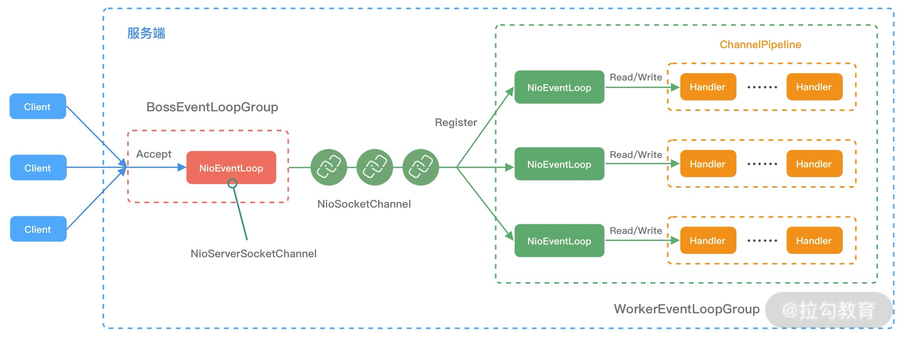

Netty 服务端启动后，BossEventLoopGroup 会负责监听客户端的 Accept 事件。当有客户端新连接接入时，BossEventLoopGroup 中的 NioEventLoop 首先会新建客户端 Channel，然后在 NioServerSocketChannel 中触发 channelRead 事件传播，NioServerSocketChannel 中包含了一种特殊的处理器 ServerBootstrapAcceptor，最终通过 ServerBootstrapAcceptor 的 channelRead() 方法将新建的客户端 Channel 分配到 WorkerEventLoopGroup 中。WorkerEventLoopGroup 中包含多个 NioEventLoop，它会选择其中一个 NioEventLoop 与新建的客户端 Channel 绑定。

完成客户端连接注册之后，就可以接收客户端的请求数据了。当客户端向服务端发送数据时，NioEventLoop 会监听到 OP_READ 事件，然后分配 ByteBuf 并读取数据，读取完成后将数据传递给 Pipeline 进行处理。一般来说，数据会从 ChannelPipeline 的第一个 ChannelHandler 开始传播，将加工处理后的消息传递给下一个 ChannelHandler，整个过程是串行化执行。

在前面两节课中，我们介绍了服务端如何接收客户端新连接，以及 NioEventLoop 的工作流程，接下来我们重点介绍 ChannelPipeline 是如何实现 Netty 事件驱动的，这样 Netty 整个事件处理流程已经可以串成一条主线。

### Pipeline 的初始化

我们知道 ChannelPipeline 是在创建 Channel 时被创建的，它是 Channel 中非常重要的一个成员变量。回到 AbstractChannel 的构造函数，以此为切入点，我们一起看下 ChannelPipeline 是如何一步步被构造出来的。

```java
// AbstractChannel
protected AbstractChannel(Channel parent) {
    this.parent = parent;
    id = newId();
    unsafe = newUnsafe();
    pipeline = newChannelPipeline();
}
// AbstractChannel#newChannelPipeline
protected DefaultChannelPipeline newChannelPipeline() {
    return new DefaultChannelPipeline(this);
}
// DefaultChannelPipeline
protected DefaultChannelPipeline(Channel channel) {
    this.channel = ObjectUtil.checkNotNull(channel, "channel");
    succeededFuture = new SucceededChannelFuture(channel, null);
    voidPromise =  new VoidChannelPromise(channel, true);
    tail = new TailContext(this);
    head = new HeadContext(this);
    head.next = tail;
    tail.prev = head;
}
```

当 ChannelPipeline 初始化完成后，会构成一个由 ChannelHandlerContext 对象组成的双向链表，默认 ChannelPipeline 初始化状态的最小结构仅包含 HeadContext 和 TailContext 两个节点，如下图所示。


HeadContext 和 TailContext 属于 ChannelPipeline 中两个特殊的节点，它们都继承自 AbstractChannelHandlerContext，根据源码看下 AbstractChannelHandlerContext 有哪些实现类，如下图所示。除了 HeadContext 和 TailContext，还有一个默认实现类 DefaultChannelHandlerContext，我们可以猜到 DefaultChannelHandlerContext 封装的是用户在 Netty 启动配置类中添加的自定义业务处理器，DefaultChannelHandlerContext 会插入到 HeadContext 和 TailContext 之间。


接着我们比较一下上述三种 AbstractChannelHandlerContext 实现类的内部结构，发现它们都包含当前 ChannelPipeline 的引用、处理器 ChannelHandler。有一点不同的是 HeadContext 节点还包含了用于操作底层数据读写的 unsafe 对象。对于 Inbound 事件，会先从 HeadContext 节点开始传播，所以 unsafe 可以看作是 Inbound 事件的发起者；对于 Outbound 事件，数据最后又会经过 HeadContext 节点返回给客户端，此时 unsafe 可以看作是 Outbound 事件的处理者。

接下来我们继续看下用户自定义的处理器是如何加入 ChannelPipeline 的双向链表的。

### Pipeline 添加 Handler

在 Netty 客户端或者服务端启动时，就需要用户配置自定义实现的业务处理器。我们先看一段服务端启动类的代码片段：

```java
ServerBootstrap b = new ServerBootstrap();
b.group(bossGroup, workerGroup)
        .channel(NioServerSocketChannel.class)
        .childHandler(new ChannelInitializer<SocketChannel>() {
            @Override
            public void initChannel(SocketChannel ch) {
                ch.pipeline().addLast(new SampleInboundA());
                ch.pipeline().addLast(new SampleInboundB());
                ch.pipeline().addLast(new SampleOutboundA());
                ch.pipeline().addLast(new SampleOutboundB());
            }
        });
```

我们知道 ChannelPipeline 分为入站 ChannelInboundHandler 和出站 ChannelOutboundHandler 两种处理器，它们都会被 ChannelHandlerContext 封装，不管是哪种处理器，最终都是通过双向链表连接，代码示例中构成的 ChannelPipeline 的结构如下。


那么 ChannelPipeline 在添加 Handler 时是如何区分 Inbound 和 Outbound 类型的呢？我们一起跟进 ch.pipeline().addLast() 方法源码，定位到核心代码如下。

```java
public final ChannelPipeline addLast(EventExecutorGroup group, String name, ChannelHandler handler) {
    final AbstractChannelHandlerContext newCtx;
    synchronized (this) {
        // 1. 检查是否重复添加 Handler
        checkMultiplicity(handler);
        // 2. 创建新的 DefaultChannelHandlerContext 节点
        newCtx = newContext(group, filterName(name, handler), handler);
        // 3. 添加新的 DefaultChannelHandlerContext 节点到 ChannelPipeline
         addLast0(newCtx);
        // 省略其他代码
    }
    // 4. 回调用户方法
    callHandlerAdded0(newCtx);
    return this;
}
```

addLast() 主要做了以下四件事：

1.  检查是否重复添加 Handler。
2.  创建新的 DefaultChannelHandlerContext 节点。
3.  添加新的 DefaultChannelHandlerContext 节点到 ChannelPipeline。
4.  回调用户方法。

前三个步骤通过 synchronized 加锁完成的，为了防止多线程并发操作 ChannelPipeline 底层双向链表。下面我们一步步进行拆解介绍。

首先在添加 Handler 时，ChannelPipeline 会检查该 Handler 有没有被添加过。如果一个非线程安全的 Handler 被添加到 ChannelPipeline 中，那么当多线程访问时会造成线程安全问题。Netty 具体检查重复性的逻辑由 checkMultiplicity() 方法实现：

```java
private static void checkMultiplicity(ChannelHandler handler) {
    if (handler instanceof ChannelHandlerAdapter) {
        ChannelHandlerAdapter h = (ChannelHandlerAdapter) handler;
        if (!h.isSharable() && h.added) {
            throw new ChannelPipelineException(
                    h.getClass().getName() +
                    " is not a @Sharable handler, so can't be added or removed multiple times.");
        }
        h.added = true;
    }
}
```

用户自定义实现的处理一般都继承于 ChannelHandlerAdapter，ChannelHandlerAdapter 中使用 added 变量标识该 Handler 是否被添加过。如果当前添加的 Handler 是非共享且已被添加过，那么就会抛出异常，否则将当前 Handler 标记为已添加。

h.isSharable() 用于判断 Handler 是否是共享的，所谓共享就是这个 Handler 可以被重复添加到不同的 ChannelPipeline 中，共享的 Handler 必须要确保是线程安全的。如果我们想实现一个共享的 Handler，只需要在 Handler 中添加 @Sharable 注解即可，如下所示：

```java
@ChannelHandler.Sharable
public class SampleInBoundHandler extends ChannelInboundHandlerAdapter {}
```

接下来我们分析 addLast() 的第二步，创建新的 DefaultChannelHandlerContext 节点。在执行 newContext() 方法之前，会通过 filterName() 为 Handler 创建一个唯一的名称，一起先看下 Netty 生成名称的策略是怎样的。

```java
private String filterName(String name, ChannelHandler handler) {
    if (name == null) {
        return generateName(handler);
    }
    checkDuplicateName(name);
    return name;
}
private String generateName(ChannelHandler handler) {
    Map<Class<?>, String> cache = nameCaches.get();
    Class<?> handlerType = handler.getClass();
    String name = cache.get(handlerType);
    if (name == null) {
        name = generateName0(handlerType);
        cache.put(handlerType, name);
    }
    if (context0(name) != null) {
        String baseName = name.substring(0, name.length() - 1);
        for (int i = 1;; i ++) {
            String newName = baseName + i;
            if (context0(newName) == null) {
                name = newName;
                break;
            }
        }
    }
    return name;
}
private static String generateName0(Class<?> handlerType) {
    return StringUtil.simpleClassName(handlerType) + "#0";
}
```

Netty 会使用 FastThreadLocal 缓存 Handler 和名称的映射关系，在为 Handler 生成默认名称的之前，会先从缓存中查找是否已经存在，如果不存在，会调用 generateName0() 方法生成默认名称后，并加入缓存。可以看出 Netty 生成名称的默认规则是 “简单类名#0”，例如 HeadContext 的默认名称为 “DefaultChannelPipeline$HeadContext#0”。

为 Handler 生成完默认名称之后，还会通过 context0() 方法检查生成的名称是否和 ChannelPipeline 已有的名称出现冲突，查重的过程很简单，就是对双向链表进行线性搜索。如果存在冲突现象，Netty 会将名称最后的序列号截取出来，一直递增直至生成不冲突的名称为止，例如 “简单类名#1” “简单类名#2” “简单类名#3” 等等。

接下来回到 newContext() 创建节点的流程，可以定位到 AbstractChannelHandlerContext 的构造函数：

```java
AbstractChannelHandlerContext(DefaultChannelPipeline pipeline, EventExecutor executor,
                              String name, Class<? extends ChannelHandler> handlerClass) {
    this.name = ObjectUtil.checkNotNull(name, "name");
    this.pipeline = pipeline;
    this.executor = executor;
    this.executionMask = mask(handlerClass);
    ordered = executor == null || executor instanceof OrderedEventExecutor;
}
```

AbstractChannelHandlerContext 中有一个 executionMask 属性并不是很好理解，它其实是一种常用的掩码运算操作，看下 mask() 方法是如何生成掩码的呢？

```java
private static int mask0(Class<? extends ChannelHandler> handlerType) {
    int mask = MASK_EXCEPTION_CAUGHT;
    try {
        if (ChannelInboundHandler.class.isAssignableFrom(handlerType)) {
            // 如果是 ChannelInboundHandler 实例，所有 Inbound 事件置为 1
            mask |= MASK_ALL_INBOUND;
            // 排除 Handler 不感兴趣的 Inbound 事件
            if (isSkippable(handlerType, "channelRegistered", ChannelHandlerContext.class)) {
                mask &= ~MASK_CHANNEL_REGISTERED;
            }
            if (isSkippable(handlerType, "channelUnregistered", ChannelHandlerContext.class)) {
                mask &= ~MASK_CHANNEL_UNREGISTERED;
            }
            if (isSkippable(handlerType, "channelActive", ChannelHandlerContext.class)) {
                mask &= ~MASK_CHANNEL_ACTIVE;
            }
            if (isSkippable(handlerType, "channelInactive", ChannelHandlerContext.class)) {
                mask &= ~MASK_CHANNEL_INACTIVE;
            }
            if (isSkippable(handlerType, "channelRead", ChannelHandlerContext.class, Object.class)) {
                mask &= ~MASK_CHANNEL_READ;
            }
            if (isSkippable(handlerType, "channelReadComplete", ChannelHandlerContext.class)) {
                mask &= ~MASK_CHANNEL_READ_COMPLETE;
            }
            if (isSkippable(handlerType, "channelWritabilityChanged", ChannelHandlerContext.class)) {
                mask &= ~MASK_CHANNEL_WRITABILITY_CHANGED;
            }
            if (isSkippable(handlerType, "userEventTriggered", ChannelHandlerContext.class, Object.class)) {
                mask &= ~MASK_USER_EVENT_TRIGGERED;
            }
        }
        if (ChannelOutboundHandler.class.isAssignableFrom(handlerType)) {
            // 如果是 ChannelOutboundHandler 实例，所有 Outbound 事件置为 1
            mask |= MASK_ALL_OUTBOUND;
            // 排除 Handler 不感兴趣的 Outbound 事件
            if (isSkippable(handlerType, "bind", ChannelHandlerContext.class,
                    SocketAddress.class, ChannelPromise.class)) {
                mask &= ~MASK_BIND;
            }
            if (isSkippable(handlerType, "connect", ChannelHandlerContext.class, SocketAddress.class,
                    SocketAddress.class, ChannelPromise.class)) {
                mask &= ~MASK_CONNECT;
            }
            if (isSkippable(handlerType, "disconnect", ChannelHandlerContext.class, ChannelPromise.class)) {
                mask &= ~MASK_DISCONNECT;
            }
            if (isSkippable(handlerType, "close", ChannelHandlerContext.class, ChannelPromise.class)) {
                mask &= ~MASK_CLOSE;
            }
            if (isSkippable(handlerType, "deregister", ChannelHandlerContext.class, ChannelPromise.class)) {
                mask &= ~MASK_DEREGISTER;
            }
            if (isSkippable(handlerType, "read", ChannelHandlerContext.class)) {
                mask &= ~MASK_READ;
            }
            if (isSkippable(handlerType, "write", ChannelHandlerContext.class,
                    Object.class, ChannelPromise.class)) {
                mask &= ~MASK_WRITE;
            }
            if (isSkippable(handlerType, "flush", ChannelHandlerContext.class)) {
                mask &= ~MASK_FLUSH;
            }
        }
        if (isSkippable(handlerType, "exceptionCaught", ChannelHandlerContext.class, Throwable.class)) {
            mask &= ~MASK_EXCEPTION_CAUGHT;
        }
    } catch (Exception e) {
        PlatformDependent.throwException(e);
    }
    return mask;
}
```

Netty 中分别有多种 Inbound 事件和 Outbound 事件，如 Inbound 事件有 channelRegistered、channelActive、channelRead 等等。Netty 会判断 Handler 的类型是否是 ChannelInboundHandler 的实例，如果是会把所有 Inbound 事件先置为 1，然后排除 Handler 不感兴趣的方法。同理，Handler 类型如果是 ChannelOutboundHandler，也是这么实现的。

那么如何排除 Handler 不感兴趣的事件呢？Handler 对应事件的方法上如果有 @Skip 注解，Netty 认为该事件是需要排除的。大部分情况下，用户自定义实现的 Handler 只需要关心个别事件，那么剩余不关心的方法都需要加上 @Skip 注解吗？Netty 其实已经在 ChannelHandlerAdapter 中默认都添加好了，所以用户如果继承了 ChannelHandlerAdapter，默认没有重写的方法都是加上 @Skip 的，只有用户重写的方法才是 Handler 关心的事件。

回到 addLast() 的主流程，接着需要将新创建的 DefaultChannelHandlerContext 节点添加到 ChannelPipeline 中，跟进 addLast0() 方法的源码。

```java
private void addLast0(AbstractChannelHandlerContext newCtx) {
    AbstractChannelHandlerContext prev = tail.prev;
    newCtx.prev = prev;
    newCtx.next = tail;
    prev.next = newCtx;
    tail.prev = newCtx;
}
```

addLast0() 非常简单，就是向 ChannelPipeline 中双向链表的尾部插入新的节点，其中 HeadContext 和 TailContext 一直是链表的头和尾，新的节点被插入到 HeadContext 和 TailContext 之间。例如代码示例中 SampleOutboundA 被添加时，双向链表的结构变化如下所示。


最后，添加完节点后，就到了回调用户方法，定位到 callHandlerAdded() 的核心源码：

```java
final void callHandlerAdded() throws Exception {
    if (setAddComplete()) {
        handler().handlerAdded(this);
    }
}
final boolean setAddComplete() {
    for (;;) {
        int oldState = handlerState;
        if (oldState == REMOVE_COMPLETE) {
            return false;
        }
        if (HANDLER_STATE_UPDATER.compareAndSet(this, oldState, ADD_COMPLETE)) {
            return true;
        }
    }
}
```

Netty 会通过 CAS 修改节点的状态直至 REMOVE\_COMPLETE 或者 ADD\_COMPLETE，如果修改节点为 ADD_COMPLETE 状态，表示节点已经添加成功，然后会回调用户 Handler 中实现的 handlerAdded() 方法。

至此，Pipeline 添加 Handler 的实现原理我们已经讲完了，下面接着看下 Pipeline 删除 Handler 的场景。

### Pipeline 删除 Handler

在《源码篇：从 Linux 出发深入剖析服务端启动流程》的课程中我们介绍了一种特殊的处理器 ChannelInitializer，ChannelInitializer 在服务端 Channel 注册完成之后会从 Pipeline 的双向链表中移除，我们一起回顾下这段代码：

```java
private boolean initChannel(ChannelHandlerContext ctx) throws Exception {
    if (initMap.add(ctx)) {
        try {
            initChannel((C) ctx.channel()); // 调用 ChannelInitializer 实现的 initChannel() 方法
        } catch (Throwable cause) {
            exceptionCaught(ctx, cause);
        } finally {
            ChannelPipeline pipeline = ctx.pipeline();
            if (pipeline.context(this) != null) {
                pipeline.remove(this); // 将 ChannelInitializer 自身从 Pipeline 中移出
            }
        }
        return true;
    }
    return false;
}
```

继续跟进 pipeline.remove() 的源码。

```java
@Override
public final ChannelPipeline remove(ChannelHandler handler) {
    // 1. getContextOrDie 用于查找需要删除的节点
    remove(getContextOrDie(handler));
    return this;
}
private AbstractChannelHandlerContext remove(final AbstractChannelHandlerContext ctx) {
    assert ctx != head && ctx != tail;
    synchronized (this) {
        // 删除双向链表中的 Handler 节点
        atomicRemoveFromHandlerList(ctx);
        if (!registered) {
            callHandlerCallbackLater(ctx, false);
            return ctx;
        }
        EventExecutor executor = ctx.executor();
        if (!executor.inEventLoop()) {
            executor.execute(new Runnable() {
                @Override
                public void run() {
                    callHandlerRemoved0(ctx);
                }
            });
            return ctx;
        }
    }
    // 3. 回调用户函数
    callHandlerRemoved0(ctx);
    return ctx;
}
```

整个删除 Handler 的过程可以分为三步，分别为：

1.  查找需要删除的 Handler 节点；
2.  然后删除双向链表中的 Handler 节点；
3.  最后回调用户函数。

我们对每一步逐一进行拆解。

第一步查找需要删除的 Handler 节点，我们自然可以想到通过遍历双向链表实现。一起看下 getContextOrDie() 方法的源码：

```java
private AbstractChannelHandlerContext getContextOrDie(ChannelHandler handler) {
    AbstractChannelHandlerContext ctx = (AbstractChannelHandlerContext) context(handler);
    if (ctx == null) {
        throw new NoSuchElementException(handler.getClass().getName());
    } else {
        return ctx;
    }
}
public final ChannelHandlerContext context(ChannelHandler handler) {
    if (handler == null) {
        throw new NullPointerException("handler");
    }
    // 遍历双向链表查找
    AbstractChannelHandlerContext ctx = head.next;
    for (;;) {
        if (ctx == null) {
            return null;
        }
        // 如果 Handler 相同，返回当前的 Context 节点
        if (ctx.handler() == handler) { 
            return ctx;
        }
        ctx = ctx.next;
    }
}
```

Netty 确实是从双向链表的头结点开始依次遍历，如果当前 Context 节点的 Handler 要被删除的 Handler 相同，那么便找到了要删除的 Handler，然后返回当前 Context 节点。

找到需要删除的 Handler 节点之后，接下来就是将节点从双向链表中删除，再跟进atomicRemoveFromHandlerList() 方法的源码：

```java
private synchronized void atomicRemoveFromHandlerList(AbstractChannelHandlerContext ctx) {
    AbstractChannelHandlerContext prev = ctx.prev;
    AbstractChannelHandlerContext next = ctx.next;
    prev.next = next;
    next.prev = prev;
}
```

删除节点和添加节点类似，都是基本的链表操作，通过调整双向链表的指针即可实现。假设现在需要删除 SampleOutboundA 节点，我们以一幅图来表示删除时指针的变化过程，如下所示。


删除完节点之后，最后 Netty 会回调用户自定义实现的 handlerRemoved() 方法，回调的实现过程与添加节点时是类似的，在这里我就不赘述了。

到此为止，我们已经学会了 ChannelPipeline 内部结构的基本操作，只需要基本的链表操作就可以实现 Handler 节点的添加和删除，添加时通过掩码运算的方式排出 Handler 不关心的事件。 ChannelPipeline 是如何调度 Handler 的呢？接下来我们继续学习。

## 数据在 Pipeline 中的运转

我们知道，根据数据的流向，ChannelPipeline 分为入站 ChannelInboundHandler 和出站 ChannelOutboundHandler 两种处理器。Inbound 事件和 Outbound 事件的传播方向相反，Inbound 事件的传播方向为 Head -> Tail，而 Outbound 事件传播方向是 Tail -> Head。今天我们就以客户端和服务端请求-响应的场景，深入研究 ChannelPipeline 的事件传播机制。

### Inbound 事件传播

当客户端向服务端发送数据时，服务端是如何接收的呢？回顾下之前我们所学习的 Netty Reactor 线程模型，首先 NioEventLoop 会不断轮询 OP\_ACCEPT 和 OP\_READ 事件，当事件就绪时，NioEventLoop 会及时响应。首先定位到 NioEventLoop 中源码的入口：

```java
// NioEventLoop#processSelectedKey
if ((readyOps & (SelectionKey.OP_READ | SelectionKey.OP_ACCEPT)) != 0 || readyOps == 0) {
    unsafe.read();
}
```

可以看出 unsafe.read() 会触发后续事件的处理，有一点需要避免混淆，在服务端 Channel 和客户端 Channel 中绑定的 unsafe 对象是不一样的，因为服务端 Channel 只关心如何接收客户端连接，而客户端 Channel 需要关心数据的读写。这里我们重点分析一下客户端 Channel 读取数据的过程，跟进 unsafe.read() 的源码：

```java
public final void read() {
    final ChannelConfig config = config();
    // 省略其他代码
    final ChannelPipeline pipeline = pipeline();
    final ByteBufAllocator allocator = config.getAllocator();
    final RecvByteBufAllocator.Handle allocHandle = recvBufAllocHandle();
    allocHandle.reset(config);
    ByteBuf byteBuf = null;
    boolean close = false;
    try {
        do {
            byteBuf = allocHandle.allocate(allocator); // 分配 ByteBuf
            allocHandle.lastBytesRead(doReadBytes(byteBuf)); // 将 Channel 中的数据读到 ByteBuf 中
            if (allocHandle.lastBytesRead() <= 0) {
                byteBuf.release();
                byteBuf = null;
                close = allocHandle.lastBytesRead() < 0;
                if (close) {
                    readPending = false;
                }
                break;
            }
            allocHandle.incMessagesRead(1);
            readPending = false;
            pipeline.fireChannelRead(byteBuf); // 传播 ChannelRead 事件
            byteBuf = null;
        } while (allocHandle.continueReading());
        allocHandle.readComplete();
        pipeline.fireChannelReadComplete(); // 传播 readComplete 事件
        if (close) {
            closeOnRead(pipeline);
        }
    } catch (Throwable t) {
        handleReadException(pipeline, byteBuf, t, close, allocHandle);
    } finally {
        if (!readPending && !config.isAutoRead()) {
            removeReadOp();
        }
    }
}
```

Netty 会不断从 Channel 中读取数据到分配的 ByteBuf 中，然后通过 pipeline.fireChannelRead() 方法触发 ChannelRead 事件的传播，fireChannelRead() 是我们需要重点分析的对象。

```java
// DefaultChannelPipeline
public final ChannelPipeline fireChannelRead(Object msg) {
    AbstractChannelHandlerContext.invokeChannelRead(head, msg);
    return this;
}
// AbstractChannelHandlerContext
static void invokeChannelRead(final AbstractChannelHandlerContext next, Object msg) {
    final Object m = next.pipeline.touch(ObjectUtil.checkNotNull(msg, "msg"), next);
    EventExecutor executor = next.executor();
    if (executor.inEventLoop()) { // 当前在 Reactor 线程内部，直接执行
        next.invokeChannelRead(m);
    } else {
        executor.execute(new Runnable() { // 如果是外部线程，则提交给异步任务队列
            @Override
            public void run() {
                    next.invokeChannelRead(m);
            }
        });
    }
}
```

Netty 首先会以 Head 节点为入参，直接调用一个静态方法 invokeChannelRead()。如果当前是在 Reactor 线程内部，会直接执行 next.invokeChannelRead() 方法。如果是外部线程发起的调用，Netty 会把 next.invokeChannelRead() 调用封装成异步任务提交到任务队列。通过之前对 NioEventLoop 源码的学习，我们知道这样可以保证执行流程全部控制在当前 NioEventLoop 线程内部串行化执行，确保线程安全性。我们抓住核心逻辑 next.invokeChannelRead() 继续跟进。

```java
// AbstractChannelHandlerContext
private void invokeChannelRead(Object msg) {
    if (invokeHandler()) {
        try {
            ((ChannelInboundHandler) handler()).channelRead(this, msg);
        } catch (Throwable t) {
            notifyHandlerException(t);
        }
    } else {
        fireChannelRead(msg);
    }
}
```

可以看出，当前 ChannelHandlerContext 节点会取出自身对应的 Handler，执行 Handler 的 channelRead 方法。此时当前节点是 HeadContext，所以 Inbound 事件是从 HeadContext 节点开始进行传播的，看下 HeadContext.channelRead() 是如何实现的。

```java
// HeadContext
public void channelRead(ChannelHandlerContext ctx, Object msg) {
    ctx.fireChannelRead(msg);
}
// AbstractChannelHandlerContext
public ChannelHandlerContext fireChannelRead(final Object msg) {
    // 找到下一个节点，执行 invokeChannelRead
    invokeChannelRead(findContextInbound(MASK_CHANNEL_READ), msg);
    return this;
}
```

我们发现 HeadContext.channelRead() 并没有做什么特殊操作，而是直接通过 fireChannelRead() 方法继续将读事件继续传播下去。接下来 Netty 会通过 findContextInbound(MASK\_CHANNEL\_READ), msg) 找到 HeadContext 的下一个节点，然后继续执行我们之前介绍的静态方法 invokeChannelRead()，从而进入一个递归调用的过程，直至某个条件结束。以上 channelRead 的执行过程我们可以梳理成一幅流程图：


Netty 是如何判断 InboundHandler 是否关心 channelRead 事件呢？这就涉及findContextInbound(MASK\_CHANNEL\_READ), msg) 中的一个知识点，和上文中我们介绍的 executionMask 掩码运算是息息相关的。首先看下 findContextInbound() 的源码：

```java
private AbstractChannelHandlerContext findContextInbound(int mask) {
    AbstractChannelHandlerContext ctx = this;
    do {
        ctx = ctx.next;
    } while ((ctx.executionMask & mask) == 0);
    return ctx;
}
```

MASK\_CHANNEL\_READ 的值为 1 << 5，表示 channelRead 事件所在的二进制位已被置为 1。在代码示例中，SampleInboundA 是我们添加的 Inbound 类型的自定义处理器，它所对应的 executionMask 掩码和 MASK\_CHANNEL\_READ 进行与运算的结果如果不为 0，表示 SampleInboundA 对 channelRead 事件感兴趣，需要触发执行 SampleInboundA 的 channelRead() 方法。

Inbound 事件在上述递归调用的流程中什么时候能够结束呢？有以下两种情况：

1.  用户自定义的 Handler 没有执行 fireChannelRead() 操作，则在当前 Handler 终止 Inbound 事件传播。
2.  如果用户自定义的 Handler 都执行了 fireChannelRead() 操作，Inbound 事件传播最终会在 TailContext 节点终止。

接下来，我们着重看下 TailContext 节点做了哪些工作。

```java
public void channelRead(ChannelHandlerContext ctx, Object msg) {
    onUnhandledInboundMessage(ctx, msg);
}
protected void onUnhandledInboundMessage(Object msg) {
    try {
        logger.debug(
                "Discarded inbound message {} that reached at the tail of the pipeline. " +
                        "Please check your pipeline configuration.", msg);
    } finally {
            ReferenceCountUtil.release(msg);
    }
}
```

可以看出 TailContext 只是日志记录了丢弃的 Inbound 消息，并释放 ByteBuf 做一个兜底保护，防止内存泄漏。

到此为止，Inbound 事件的传播流程已经介绍完了，Inbound 事件在 ChannelPipeline 中的传播方向是 Head -> Tail。Netty 会从 ChannelPipeline 中找到对传播事件感兴趣的 Inbound 处理器，执行事件回调方法，然后继续向下一个节点传播，整个事件传播流程是一个递归调用的过程。

### Outbound 事件传播

分析完 Inbound 事件的传播流程之后，再学习 Outbound 事件传播就会简单很多。Outbound 事件传播的方向是从 Tail -> Head，与 Inbound 事件的传播方向恰恰是相反的。Outbound 事件最常见的就是写事件，执行 writeAndFlush() 方法时就会触发 Outbound 事件传播。我们直接从 TailContext 跟进 writeAndFlush() 源码：

```java
@Override
public final ChannelFuture writeAndFlush(Object msg) {
    return tail.writeAndFlush(msg);
}
```

继续跟进 tail.writeAndFlush() 的源码，最终会定位到 AbstractChannelHandlerContext 中的 write 方法。该方法是 writeAndFlush 的核心逻辑，具体源码如下。

```java
private void write(Object msg, boolean flush, ChannelPromise promise) {
    // ...... 省略部分非核心代码 ......
    // 找到 Pipeline 链表中下一个 Outbound 类型的 ChannelHandler 节点
    final AbstractChannelHandlerContext next = findContextOutbound(flush ? (MASK_WRITE | MASK_FLUSH) : MASK_WRITE);
    final Object m = pipeline.touch(msg, next);
    EventExecutor executor = next.executor();
    // 判断当前线程是否是 NioEventLoop 中的线程
    if (executor.inEventLoop()) {
        if (flush) {
            // 因为 flush == true，所以流程走到这里
            next.invokeWriteAndFlush(m, promise);
        } else {
            next.invokeWrite(m, promise);
        }
    } else {
        final AbstractWriteTask task;
        if (flush) {
            task = WriteAndFlushTask.newInstance(next, m, promise);
        }  else {
            task = WriteTask.newInstance(next, m, promise);
        }
        if (!safeExecute(executor, task, promise, m)) {
            task.cancel();
        }
    }
}
```

在《数据传输：writeAndFlush 处理流程剖析》的课程中，我们已经对 write() 方法做了深入分析，这里抛开其他技术细节，我们只分析 Outbound 事件传播的过程。

假设我们在代码示例中 SampleOutboundB 调用了 writeAndFlush() 方法，那么 Netty 会调用 findContextOutbound() 方法找到 Pipeline 链表中下一个 Outbound 类型的 ChannelHandler，对应上述代码示例中下一个 Outbound 节点是 SampleOutboundA，然后调用 next.invokeWriteAndFlush(m, promise)，我们跟进去：

```java
private void invokeWriteAndFlush(Object msg, ChannelPromise promise) {
    if (invokeHandler()) {
        invokeWrite0(msg, promise);
        invokeFlush0();
    } else {
        writeAndFlush(msg, promise);
    }
}
private void invokeWrite0(Object msg, ChannelPromise promise) {
    try {
        ((ChannelOutboundHandler) handler()).write(this, msg, promise);
    } catch (Throwable t) {
        notifyOutboundHandlerException(t, promise);
    }
}
```

我们发现，invokeWriteAndFlush() 方法最终会它会执行下一个 ChannelHandler 节点的 write 方法。一般情况下，用户在实现 outBound 类型的 ChannelHandler 时都会继承 ChannelOutboundHandlerAdapter，一起看下它的 write() 方法是如何处理 outBound 事件的。

```java
public void write(ChannelHandlerContext ctx, Object msg, ChannelPromise promise) throws Exception {
    ctx.write(msg, promise);
}
```

ChannelOutboundHandlerAdapter.write() 只是调用了 AbstractChannelHandlerContext 的 write() 方法，是不是似曾相识？与之前介绍的 Inbound 事件处理流程类似，此时流程又回到了 AbstractChannelHandlerContext 中重复执行 write 方法，继续寻找下一个 Outbound 节点，也是一个递归调用的过程。

编码器是用户经常需要自定义实现的处理器，然而为什么用户的编码器里并没有重写 write()，只是重写一个 encode() 方法呢？在《Netty 如何实现自定义通信协议》课程中，我们所介绍的 MessageToByteEncoder 源码，用户自定义的编码器基本都会继承 MessageToByteEncoder，MessageToByteEncoder 重写了 ChanneOutboundHandler 的 write() 方法，其中会调用子类实现的 encode 方法完成数据编码，这里我们不再赘述了。

那么 OutBound 事件什么时候传播结束呢？也许你已经猜到了，OutBound 事件最终会传播到 HeadContext 节点。所以 HeadContext 节点既是 Inbound 处理器，又是 OutBound 处理器，继续看下 HeadContext 是如何拦截和处理 write 事件的。

```java
public void write(ChannelHandlerContext ctx, Object msg, ChannelPromise promise) {
    unsafe.write(msg, promise);
}
```

HeadContext 最终调用了底层的 unsafe 写入数据，数据在执行 write() 方法时，只会写入到一个底层的缓冲数据结构，然后等待 flush 操作将数据冲刷到 Channel 中。关于 write 和 flush 是如何操作缓存数据结构的，快去复习一遍《数据传输：writeAndFlush 处理流程剖析》吧，将知识点形成一个完整的体系。

到此为止，outbound 事件传播也介绍完了，它的传播方向是 Tail -> Head，与 Inbound 事件的传播是相反的。MessageToByteEncoder 是用户在实现编码时经常用到的一个抽象类，MessageToByteEncoder 中已经重写了 ChanneOutboundHandler 的 write() 方法，大部分情况下用户只需要重写 encode() 即可。

### 异常事件传播

在《服务编排层：Pipeline 如何协调各类 Handler》中，我们已经初步介绍了 Netty 实现统一异常拦截和处理的最佳实践，首先回顾下异常拦截器的简单实现。

```java
public class ExceptionHandler extends ChannelDuplexHandler {
    @Override
    public void exceptionCaught(ChannelHandlerContext ctx, Throwable cause) {
        if (cause instanceof RuntimeException) {
            System.out.println("Handle Business Exception Success.");
        }
    }
}
```

异常处理器 ExceptionHandler 一般会继承 ChannelDuplexHandler，ChannelDuplexHandler 既是一个 Inbound 处理器，又是一个 Outbound 处理器。ExceptionHandler 应该被添加在自定义处理器的尾部，如下图所示：

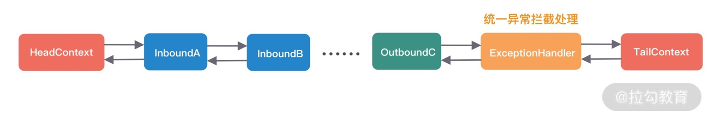

那么异常处理器 ExceptionHandler 什么时候被执行呢？我们分别从 Inbound 异常事件传播和 Outbound 异常事件传播两种场景进行分析。

首先看下 Inbound 异常事件的传播。还是从数据读取的场景入手，发现 Inbound 事件传播的时候有异常处理的相关逻辑，我们再一起重新分析下数据读取环节的源码。

```java
// AbstractChannelHandlerContext
private void invokeChannelRead(Object msg) {
    if (invokeHandler()) {
        try {
            ((ChannelInboundHandler) handler()).channelRead(this, msg);
        } catch (Throwable t) {
             notifyHandlerException(t);
        }
    } else {
        fireChannelRead(msg);
    }
}
// AbstractChannelHandlerContext
private void notifyHandlerException(Throwable cause) {
    // 省略其他代码
    invokeExceptionCaught(cause);
}
// AbstractChannelHandlerContext
private void invokeExceptionCaught(final Throwable cause) {
    if (invokeHandler()) {
        try {
            handler().exceptionCaught(this, cause); // 调用 Handler 实现的 exceptionCaught 方法
        } catch (Throwable error) {
            // 省略其他代码
        }
    } else {
        fireExceptionCaught(cause);
    }
}
```

如果 SampleInboundA 在读取数据时发生了异常，invokeChannelRead 会捕获异常，并执行 notifyHandlerException() 方法进行异常处理。我们一步步跟进，发现最终会调用 Handler 的 exceptionCaught() 方法，所以用户可以通过重写 exceptionCaught() 实现自定义的异常处理。

我们知道，统一异常处理器 ExceptionHandler 是在 ChannelPipeline 的末端，SampleInboundA 并没有重写 exceptionCaught() 方法，那么 SampleInboundA 产生的异常是如何传播到 ExceptionHandler 中呢？用户实现的 Inbound 处理器一般都会继承 ChannelInboundHandlerAdapter 抽象类，果然我们在 ChannelInboundHandlerAdapter 中发现了 exceptionCaught() 的实现：

```java
// ChannelInboundHandlerAdapter
public void exceptionCaught(ChannelHandlerContext ctx, Throwable cause) throws Exception {
    ctx.fireExceptionCaught(cause);
}
// AbstractChannelHandlerContext
public ChannelHandlerContext fireExceptionCaught(final Throwable cause) {
    invokeExceptionCaught(findContextInbound(MASK_EXCEPTION_CAUGHT), cause);
    return this;
}
```

ChannelInboundHandlerAdapter 默认调用 fireExceptionCaught() 方法传播异常事件，而 fireExceptionCaught() 执行时会先调用 findContextInbound() 方法找到下一个对异常事件关注的 Inbound 处理器，然后继续向下传播异常。所以这里应该明白为什么统一异常处理器 ExceptionHandler 为什么需要添加在 ChannelPipeline 的末端了吧？这样 ExceptionHandler 可以接收所有 Inbound 处理器发生的异常。

接下来，我们分析 Outbound 异常事件传播。你可能此时就会有一个疑问，Outbound 事件的传播方向与 Inbound 事件是相反的，为什么统一异常处理器 ExceptionHandler 没有添加在 ChannelPipeline 的头部呢？我们通过 writeAndFlush() 的调用过程再来一探究竟。

```java
// AbstractChannelHandlerContext
private void invokeFlush0() {
    try {
        ((ChannelOutboundHandler) handler()).flush(this);
    } catch (Throwable t) {
        notifyHandlerException(t);
    }
}
```

我们发现，flush 发送数据时如果发生异常，那么异常也会被捕获并交由同样的 notifyHandlerException() 方法进行处理。因为 notifyHandlerException() 方法中会向下寻找 Inbound 处理器，此时又会回到 Inbound 异常事件的传播流程。所以说，异常事件的传播方向与 Inbound 事件几乎是一样的，最后一定会传播到统一异常处理器 ExceptionHandler。

到这里，整个异常事件的传播过程已经分析完了。你需要记住的是，异常事件的传播顺序与 ChannelHandler 的添加顺序相同，会依次向后传播，与 Inbound 事件和 Outbound 事件无关。

## 总结

这节点我们学习了数据在 Netty 中的完整处理流程，其中重点分析了数据是如何在 ChannelPipeline 中流转的。我们做一个知识点总结：

*   ChannelPipeline 是双向链表结构，包含 ChannelInboundHandler 和 ChannelOutboundHandler 两种处理器。
*   Inbound 事件和 Outbound 事件的传播方向相反，Inbound 事件的传播方向为 Head -> Tail，而 Outbound 事件传播方向是 Tail -> Head。
*   异常事件的处理顺序与 ChannelHandler 的添加顺序相同，会依次向后传播，与 Inbound 事件和 Outbound 事件无关。

再整体回顾下 ChannelPipeline 中事件传播的实现原理：

*   Inbound 事件传播从 HeadContext 节点开始，Outbound 事件传播从 TailContext 节点开始。
*   AbstractChannelHandlerContext 抽象类中实现了一系列 fire 和 invoke 方法，如果想让事件想下传播，只需要调用 fire 系列的方法即可。fire 和 invoke 的系列方法结合 findContextInbound() 和 findContextOutbound() 可以控制 Inbound 和 Outbound 事件的传播方向，整个过程是一个递归调用。

20 技巧篇：Netty 的 FastThreadLocal 究竟比 ThreadLocal 快在哪儿？
====================================================

在前面几篇源码解析的课程中，我们都有在源码中发现 FastThreadLocal 的身影。顾名思义，Netty 作为高性能的网络通信框架，FastThreadLocal 是比 JDK 自身的 ThreadLocal 性能更高的通信框架。FastThreadLocal 到底比 ThreadLocal 快在哪里呢？这节课我们就一起来探索 FastThreadLocal 高性能的奥秘。

> 说明：本文参考的 Netty 源码版本为 4.1.42.Final。

## JDK ThreadLocal 基本原理

JDK ThreadLocal 不仅是高频的面试知识点，而且在日常工作中也是常用一种工具，所以首先我们先学习下 Java 原生的 ThreadLocal 的实现原理，可以帮助我们更好地对比和理解 Netty 的 FastThreadLocal。

如果你需要变量在多线程之间隔离，或者在同线程内的类和方法中共享，那么 ThreadLocal 大显身手的时候就到了。ThreadLocal 可以理解为线程本地变量，它是 Java 并发编程中非常重要的一个类。ThreadLocal 为变量在每个线程中都创建了一个副本，该副本只能被当前线程访问，多线程之间是隔离的，变量不能在多线程之间共享。这样每个线程修改变量副本时，不会对其他线程产生影响。

接下来我们通过一个例子看下 ThreadLocal 如何使用：

```java
    public class ThreadLocalTest {
        private static final ThreadLocal<String> THREAD_NAME_LOCAL = ThreadLocal.withInitial(() -> Thread.currentThread().getName());
        private static final ThreadLocal<TradeOrder> TRADE_THREAD_LOCAL = new ThreadLocal<>();
        public static void main(String[] args) {
            for (int i = 0; i < 2; i++) {
                int tradeId = i;
                new Thread(() -> {
                    TradeOrder tradeOrder = new TradeOrder(tradeId, tradeId % 2 == 0 ? "已支付" : "未支付");
                    TRADE_THREAD_LOCAL.set(tradeOrder);
                    System.out.println("threadName: " + THREAD_NAME_LOCAL.get());
                    System.out.println("tradeOrder info：" + TRADE_THREAD_LOCAL.get());
                }, "thread-" + i).start();
            }
        }
        static class TradeOrder {
            long id;
            String status;
            public TradeOrder(int id, String status) {
                this.id = id;
                this.status = status;
            }
            @Override
            public String toString() {
                return "id=" + id + ", status=" + status;
            }
        }
    }
```
在上述示例中，构造了 THREAD\_NAME\_LOCAL 和 TRADE\_THREAD\_LOCAL 两个 ThreadLocal 变量，分别用于记录当前线程名称和订单交易信息。ThreadLocal 是可以支持泛型的，THREAD\_NAME\_LOCAL 和 TRADE\_THREAD\_LOCAL 存放 String 类型和 TradeOrder 对象类型的数据，你可以通过 set()/get() 方法设置和读取 ThreadLocal 实例。一起看下示例代码的运行结果：

```java
    threadName: thread-0
    threadName: thread-1
    tradeOrder info：id=1, status=未支付
    tradeOrder info：id=0, status=已支付
```

可以看出 thread-1 和 thread-2 虽然操作的是同一个 ThreadLocal 对象，但是它们取到了不同的线程名称和订单交易信息。那么一个线程内如何存在多个 ThreadLocal 对象，每个 ThreadLocal 对象是如何存储和检索的呢？

接下来我们看看 ThreadLocal 的实现原理。既然多线程访问 ThreadLocal 变量时都会有自己独立的实例副本，那么很容易想到的方案就是在 ThreadLocal 中维护一个 Map，记录线程与实例之间的映射关系。当新增线程和销毁线程时都需要更新 Map 中的映射关系，因为会存在多线程并发修改，所以需要保证 Map 是线程安全的。那么 JDK 的 ThreadLocal 是这么实现的吗？答案是 NO。因为在高并发的场景并发修改 Map 需要加锁，势必会降低性能。JDK 为了避免加锁，采用了相反的设计思路。以 Thread 入手，在 Thread 中维护一个 Map，记录 ThreadLocal 与实例之间的映射关系，这样在同一个线程内，Map 就不需要加锁了。示例代码中线程 Thread 和 ThreadLocal 的关系可以用以下这幅图表示。

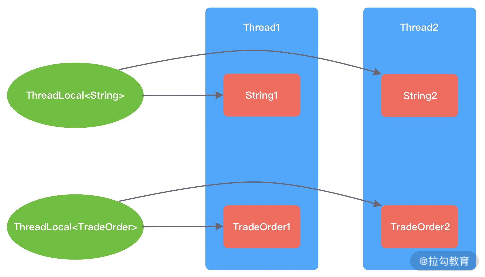

那么在 Thread 内部，维护映射关系的 Map 是如何实现的呢？从源码中可以发现 Thread 使用的是 ThreadLocal 的内部类 ThreadLocalMap，所以 Thread、ThreadLocal 和 ThreadLocalMap 之间的关系可以用下图表示：

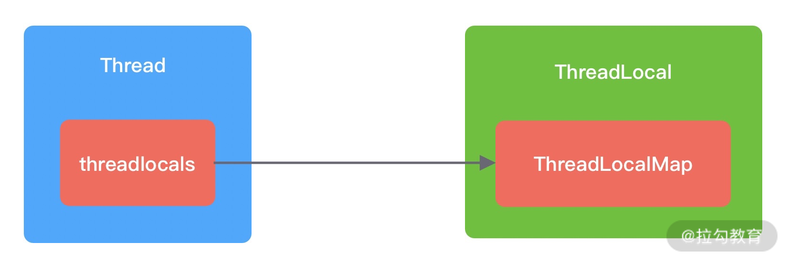

为了更加深入理解 ThreadLocal，了解 ThreadLocalMap 的内部实现是非常有必要的。ThreadLocalMap 其实与 HashMap 的数据结构类似，但是 ThreadLocalMap 不具备通用性，它是为 ThreadLocal 量身定制的。

ThreadLocalMap 是一种使用线性探测法实现的哈希表，底层采用数组存储数据。如下图所示，ThreadLocalMap 会初始化一个长度为 16 的 Entry 数组，每个 Entry 对象用于保存 key-value 键值对。与 HashMap 不同的是，Entry 的 key 就是 ThreadLocal 对象本身，value 就是用户具体需要存储的值。


当调用 ThreadLocal.set() 添加 Entry 对象时，是如何解决 Hash 冲突的呢？这就需要我们了解线性探测法的实现原理。每个 ThreadLocal 在初始化时都会有一个 Hash 值为 threadLocalHashCode，每增加一个 ThreadLocal， Hash 值就会固定增加一个魔术 HASH_INCREMENT = 0x61c88647。为什么取 0x61c88647 这个魔数呢？实验证明，通过 0x61c88647 累加生成的 threadLocalHashCode 与 2 的幂取模，得到的结果可以较为均匀地分布在长度为 2 的幂大小的数组中。有了 threadLocalHashCode 的基础，下面我们通过下面的表格来具体讲解线性探测法是如何实现的。

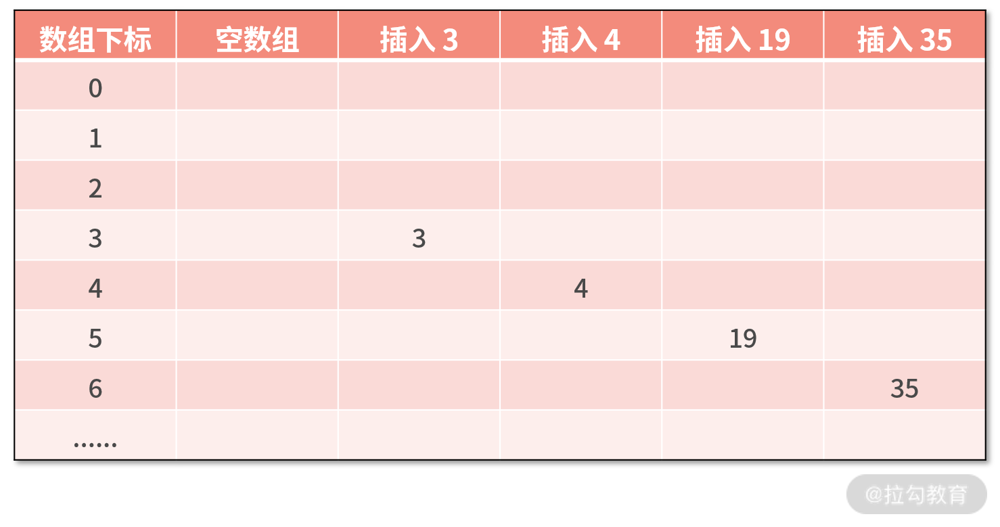

为了便于理解，我们采用一组简单的数据模拟 ThreadLocal.set() 的过程是如何解决 Hash 冲突的。

1.  threadLocalHashCode = 4，threadLocalHashCode & 15 = 4；此时数据应该放在数组下标为 4 的位置。下标 4 的位置正好没有数据，可以存放。
2.  threadLocalHashCode = 19，threadLocalHashCode & 15 = 4；但是下标 4 的位置已经有数据了，如果当前需要添加的 Entry 与下标 4 位置已存在的 Entry 两者的 key 相同，那么该位置 Entry 的 value 将被覆盖为新的值。我们假设 key 都是不相同的，所以此时需要向后移动一位，下标 5 的位置没有冲突，可以存放。
3.  threadLocalHashCode = 33，threadLocalHashCode & 15 = 3；下标 3 的位置已经有数据，向后移一位，下标 4 位置还是有数据，继续向后查找，发现下标 6 没有数据，可以存放。

ThreadLocal.get() 的过程也是类似的，也是根据 threadLocalHashCode 的值定位到数组下标，然后判断当前位置 Entry 对象与待查询 Entry 对象的 key 是否相同，如果不同，继续向下查找。由此可见，ThreadLocal.set()/get() 方法在数据密集时很容易出现 Hash 冲突，需要 O(n) 时间复杂度解决冲突问题，效率较低。

下面我们再聊聊 ThreadLocalMap 中 Entry 的设计原理。Entry 继承自弱引用类 WeakReference，Entry 的 key 是弱引用，value 是强引用。在 JVM 垃圾回收时，只要发现了弱引用的对象，不管内存是否充足，都会被回收。那么为什么 Entry 的 key 要设计成弱引用呢？我们试想下，如果 key 都是强引用，当 ThreadLocal 不再使用时，然而 ThreadLocalMap 中还是存在对 ThreadLocal 的强引用，那么 GC 是无法回收的，从而造成内存泄漏。

虽然 Entry 的 key 设计成了弱引用，但是当 ThreadLocal 不再使用被 GC 回收后，ThreadLocalMap 中可能出现 Entry 的 key 为 NULL，那么 Entry 的 value 一直会强引用数据而得不到释放，只能等待线程销毁。那么应该如何避免 ThreadLocalMap 内存泄漏呢？ThreadLocal 已经帮助我们做了一定的保护措施，在执行 ThreadLocal.set()/get() 方法时，ThreadLocal 会清除 ThreadLocalMap 中 key 为 NULL 的 Entry 对象，让它还能够被 GC 回收。除此之外，当线程中某个 ThreadLocal 对象不再使用时，立即调用 remove() 方法删除 Entry 对象。如果是在异常的场景中，记得在 finally 代码块中进行清理，保持良好的编码意识。

关于 JDK 的 ThreadLocal 的基本原理我们已经介绍完了，既然 ThreadLocal 已经非常成熟，而且在日常开发中也被广泛使用，Netty 为什么还要自己实现一个 FastThreadLocal 呢？性能真的比 ThreadLocal 高很多吗？我们接下来一起一探究竟。

## FastThreadLocal 为什么快

FastThreadLocal 的实现与 ThreadLocal 非常类似，Netty 为 FastThreadLocal 量身打造了 FastThreadLocalThread 和 InternalThreadLocalMap 两个重要的类。下面我们看下这两个类是如何实现的。

FastThreadLocalThread 是对 Thread 类的一层包装，每个线程对应一个 InternalThreadLocalMap 实例。只有 FastThreadLocal 和 FastThreadLocalThread 组合使用时，才能发挥 FastThreadLocal 的性能优势。首先看下 FastThreadLocalThread 的源码定义：

```java
    public class FastThreadLocalThread extends Thread {
        private InternalThreadLocalMap threadLocalMap;
        // 省略其他代码    
    }
```

可以看出 FastThreadLocalThread 主要扩展了 InternalThreadLocalMap 字段，我们可以猜测到 FastThreadLocalThread 主要使用 InternalThreadLocalMap 存储数据，而不再是使用 Thread 中的 ThreadLocalMap。所以想知道 FastThreadLocalThread 高性能的奥秘，必须要了解 InternalThreadLocalMap 的设计原理。

上文中我们讲到了 ThreadLocal 的一个重要缺点，就是 ThreadLocalMap 采用线性探测法解决 Hash 冲突性能较慢，那么 InternalThreadLocalMap 又是如何优化的呢？首先一起看下 InternalThreadLocalMap 的内部构造。

```java
    public final class InternalThreadLocalMap extends UnpaddedInternalThreadLocalMap {
        private static final int DEFAULT_ARRAY_LIST_INITIAL_CAPACITY = 8;
        private static final int STRING_BUILDER_INITIAL_SIZE;
        private static final int STRING_BUILDER_MAX_SIZE;
        public static final Object UNSET = new Object();
        private BitSet cleanerFlags;
        private InternalThreadLocalMap() {
            super(newIndexedVariableTable());
        }
    
        private static Object[] newIndexedVariableTable() {
            Object[] array = new Object[32];
            Arrays.fill(array, UNSET);
            return array;
        }
        public static int nextVariableIndex() {
            int index = nextIndex.getAndIncrement();
            if (index < 0) {
                nextIndex.decrementAndGet();
                throw new IllegalStateException("too many thread-local indexed variables");
            }
    
            return index;
        }
        // 省略其他代码
    }
    
    class UnpaddedInternalThreadLocalMap {
        static final ThreadLocal<InternalThreadLocalMap> slowThreadLocalMap = new ThreadLocal<InternalThreadLocalMap>();
        static final AtomicInteger nextIndex = new AtomicInteger();
        Object[] indexedVariables;
        UnpaddedInternalThreadLocalMap(Object[] indexedVariables) {
            this.indexedVariables = indexedVariables;
        }
        // 省略其他代码
    }
```

从 InternalThreadLocalMap 内部实现来看，与 ThreadLocalMap 一样都是采用数组的存储方式。但是 InternalThreadLocalMap 并没有使用线性探测法来解决 Hash 冲突，而是在 FastThreadLocal 初始化的时候分配一个数组索引 index，index 的值采用原子类 AtomicInteger 保证顺序递增，通过调用 InternalThreadLocalMap.nextVariableIndex() 方法获得。然后在读写数据的时候通过数组下标 index 直接定位到 FastThreadLocal 的位置，时间复杂度为 O(1)。如果数组下标递增到非常大，那么数组也会比较大，所以 FastThreadLocal 是通过空间换时间的思想提升读写性能。下面通过一幅图描述 InternalThreadLocalMap、index 和 FastThreadLocal 之间的关系。

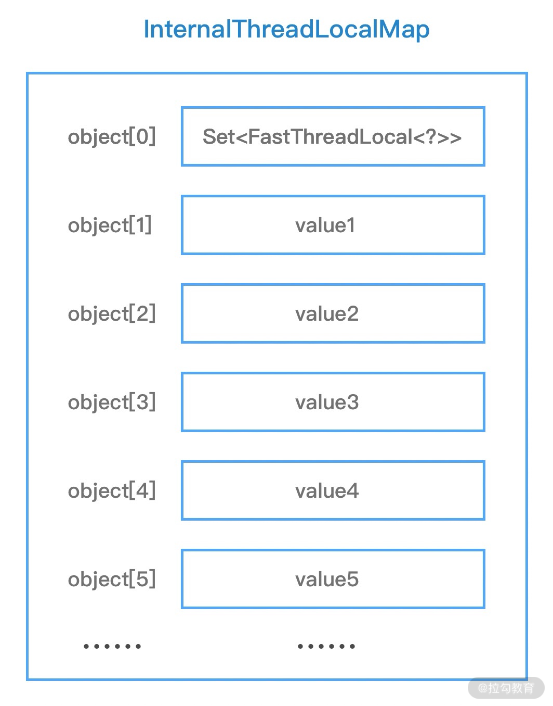

通过上面 FastThreadLocal 的内部结构图，我们对比下与 ThreadLocal 有哪些区别呢？FastThreadLocal 使用 Object 数组替代了 Entry 数组，Object\[0\] 存储的是一个Set<FastThreadLocal<?>> 集合，从数组下标 1 开始都是直接存储的 value 数据，不再采用 ThreadLocal 的键值对形式进行存储。

假设现在我们有一批数据需要添加到数组中，分别为 value1、value2、value3、value4，对应的 FastThreadLocal 在初始化的时候生成的数组索引分别为 1、2、3、4。如下图所示。

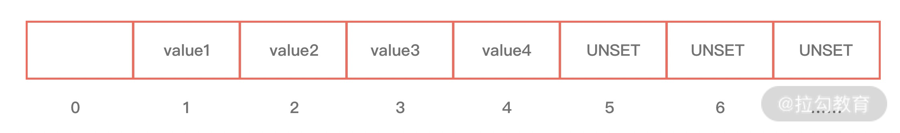

至此，我们已经对 FastThreadLocal 有了一个基本的认识，下面我们结合具体的源码分析 FastThreadLocal 的实现原理。

## FastThreadLocal 源码分析

在讲解源码之前，我们回过头看下上文中的 ThreadLocal 示例，如果把示例中 ThreadLocal 替换成 FastThread，应当如何使用呢？

```java
    public class FastThreadLocalTest {
        private static final FastThreadLocal<String> THREAD_NAME_LOCAL = new FastThreadLocal<>();
        private static final FastThreadLocal<TradeOrder> TRADE_THREAD_LOCAL = new FastThreadLocal<>();
        public static void main(String[] args) {
            for (int i = 0; i < 2; i++) {
                int tradeId = i;
                String threadName = "thread-" + i;
                new FastThreadLocalThread(() -> {
                    THREAD_NAME_LOCAL.set(threadName);
                    TradeOrder tradeOrder = new TradeOrder(tradeId, tradeId % 2 == 0 ? "已支付" : "未支付");
                    TRADE_THREAD_LOCAL.set(tradeOrder);
                    System.out.println("threadName: " + THREAD_NAME_LOCAL.get());
                    System.out.println("tradeOrder info：" + TRADE_THREAD_LOCAL.get());
                }, threadName).start();
            }
        }
    }
```

可以看出，FastThreadLocal 的使用方法几乎和 ThreadLocal 保持一致，只需要把代码中 Thread、ThreadLocal 替换为 FastThreadLocalThread 和 FastThreadLocal 即可，Netty 在易用性方面做得相当棒。下面我们重点对示例中用得到 FastThreadLocal.set()/get() 方法做深入分析。

首先看下 FastThreadLocal.set() 的源码：

```java
    public final void set(V value) {
        if (value != InternalThreadLocalMap.UNSET) { // 1. value 是否为缺省值
            InternalThreadLocalMap threadLocalMap = InternalThreadLocalMap.get(); // 2. 获取当前线程的 InternalThreadLocalMap
            setKnownNotUnset(threadLocalMap, value); // 3. 将 InternalThreadLocalMap 中数据替换为新的 value
        } else {
            remove();
        }
    }
```

FastThreadLocal.set() 方法虽然入口只有几行代码，但是内部逻辑是相当复杂的。我们首先还是抓住代码主干，一步步进行拆解分析。set() 的过程主要分为三步：

1.  判断 value 是否为缺省值，如果等于缺省值，那么直接调用 remove() 方法。这里我们还不知道缺省值和 remove() 之间的联系是什么，我们暂且把 remove() 放在最后分析。
2.  如果 value 不等于缺省值，接下来会获取当前线程的 InternalThreadLocalMap。
3.  然后将 InternalThreadLocalMap 中对应数据替换为新的 value。

首先我们看下 InternalThreadLocalMap.get() 方法，源码如下：

```java
    public static InternalThreadLocalMap get() {
        Thread thread = Thread.currentThread();
        if (thread instanceof FastThreadLocalThread) { // 当前线程是否为 FastThreadLocalThread 类型
            return fastGet((FastThreadLocalThread) thread);
        } else {
            return slowGet();
        }
    }
    
    private static InternalThreadLocalMap fastGet(FastThreadLocalThread thread) {
        InternalThreadLocalMap threadLocalMap = thread.threadLocalMap(); // 获取 FastThreadLocalThread 的 threadLocalMap 属性
        if (threadLocalMap == null) {
            thread.setThreadLocalMap(threadLocalMap = new InternalThreadLocalMap());
        }
        return threadLocalMap;
    }
    
    private static InternalThreadLocalMap slowGet() {
        ThreadLocal<InternalThreadLocalMap> slowThreadLocalMap = UnpaddedInternalThreadLocalMap.slowThreadLocalMap; 
        InternalThreadLocalMap ret = slowThreadLocalMap.get(); // 从 JDK 原生 ThreadLocal 中获取 InternalThreadLocalMap
        if (ret == null) {
            ret = new InternalThreadLocalMap();
            slowThreadLocalMap.set(ret);
        }
        return ret;
    }
```

InternalThreadLocalMap.get() 逻辑很简单，为了帮助你更好地理解，下面使用一幅图描述 InternalThreadLocalMap 的获取方式。


如果当前线程是 FastThreadLocalThread 类型，那么直接通过 fastGet() 方法获取 FastThreadLocalThread 的 threadLocalMap 属性即可。如果此时 InternalThreadLocalMap 不存在，直接创建一个返回。关于 InternalThreadLocalMap 的初始化在上文中已经介绍过，它会初始化一个长度为 32 的 Object 数组，数组中填充着 32 个缺省对象 UNSET 的引用。

那么 slowGet() 又是什么作用呢？从代码分支来看，slowGet() 是针对非 FastThreadLocalThread 类型的线程发起调用时的一种兜底方案。如果当前线程不是 FastThreadLocalThread，内部是没有 InternalThreadLocalMap 属性的，Netty 在 UnpaddedInternalThreadLocalMap 中保存了一个 JDK 原生的 ThreadLocal，ThreadLocal 中存放着 InternalThreadLocalMap，此时获取 InternalThreadLocalMap 就退化成 JDK 原生的 ThreadLocal 获取。

获取 InternalThreadLocalMap 的过程已经讲完了，下面看下 setKnownNotUnset() 如何将数据添加到 InternalThreadLocalMap 的。

```java
    private void setKnownNotUnset(InternalThreadLocalMap threadLocalMap, V value) {
        if (threadLocalMap.setIndexedVariable(index, value)) { // 1. 找到数组下标 index 位置，设置新的 value
            addToVariablesToRemove(threadLocalMap, this); // 2. 将 FastThreadLocal 对象保存到待清理的 Set 中
        }
    }
```

setKnownNotUnset() 主要做了两件事：

1.  找到数组下标 index 位置，设置新的 value。
2.  将 FastThreadLocal 对象保存到待清理的 Set 中。

首先我们看下第一步 threadLocalMap.setIndexedVariable() 的源码实现：

```java
    public boolean setIndexedVariable(int index, Object value) {
        Object[] lookup = indexedVariables;
        if (index < lookup.length) {
            Object oldValue = lookup[index]; 
            lookup[index] = value; // 直接将数组 index 位置设置为 value，时间复杂度为 O(1)
            return oldValue == UNSET;
        } else {
            expandIndexedVariableTableAndSet(index, value); // 容量不够，先扩容再设置值
            return true;
        }
    }
```

indexedVariables 就是 InternalThreadLocalMap 中用于存放数据的数组，如果数组容量大于 FastThreadLocal 的 index 索引，那么直接找到数组下标 index 位置将新 value 设置进去，事件复杂度为 O(1)。在设置新的 value 之前，会将之前 index 位置的元素取出，如果旧的元素还是 UNSET 缺省对象，那么返回成功。

如果数组容量不够了怎么办呢？InternalThreadLocalMap 会自动扩容，然后再设置 value。接下来看看 expandIndexedVariableTableAndSet() 的扩容逻辑：

```java
    private void expandIndexedVariableTableAndSet(int index, Object value) {
        Object[] oldArray = indexedVariables;
        final int oldCapacity = oldArray.length;
        int newCapacity = index;
        newCapacity |= newCapacity >>>  1;
        newCapacity |= newCapacity >>>  2;
        newCapacity |= newCapacity >>>  4;
        newCapacity |= newCapacity >>>  8;
        newCapacity |= newCapacity >>> 16;
        newCapacity ++;
        Object[] newArray = Arrays.copyOf(oldArray, newCapacity);
        Arrays.fill(newArray, oldCapacity, newArray.length, UNSET);
        newArray[index] = value;
        indexedVariables = newArray;
    }
```

上述代码的位移操作是不是似曾相识？我们去翻阅下 JDK HashMap 中扩容的源码，其中有这么一段代码：

```java
    static final int tableSizeFor(int cap) {
        int n = cap - 1;
        n |= n >>> 1;
        n |= n >>> 2;
        n |= n >>> 4;
        n |= n >>> 8;
        n |= n >>> 16;
        return (n < 0) ? 1 : (n >= MAXIMUM_CAPACITY) ? MAXIMUM_CAPACITY : n + 1;
    }
```

可以看出 InternalThreadLocalMap 实现数组扩容几乎和 HashMap 完全是一模一样的，所以多读源码还是可以给我们很多启发的。InternalThreadLocalMap 以 index 为基准进行扩容，将数组扩容后的容量向上取整为 2 的次幂。然后将原数组内容拷贝到新的数组中，空余部分填充缺省对象 UNSET，最终把新数组赋值给 indexedVariables。

为什么 InternalThreadLocalMap 以 index 为基准进行扩容，而不是原数组长度呢？假设现在初始化了 70 个 FastThreadLocal，但是这些 FastThreadLocal 从来没有调用过 set() 方法，此时数组还是默认长度 32。当第 index = 70 的 FastThreadLocal 调用 set() 方法时，如果按原数组容量 32 进行扩容 2 倍后，还是无法填充 index = 70 的数据。所以使用 index 为基准进行扩容可以解决这个问题，但是如果 FastThreadLocal 特别多，数组的长度也是非常大的。

回到 setKnownNotUnset() 的主流程，向 InternalThreadLocalMap 添加完数据之后，接下就是将 FastThreadLocal 对象保存到待清理的 Set 中。我们继续看下 addToVariablesToRemove() 是如何实现的。

```java
    private static void addToVariablesToRemove(InternalThreadLocalMap threadLocalMap, FastThreadLocal<?> variable) {
        Object v = threadLocalMap.indexedVariable(variablesToRemoveIndex); // 获取数组下标为 0 的元素
        Set<FastThreadLocal<?>> variablesToRemove;
        if (v == InternalThreadLocalMap.UNSET || v == null) {
            variablesToRemove = Collections.newSetFromMap(new IdentityHashMap<FastThreadLocal<?>, Boolean>()); // 创建 FastThreadLocal 类型的 Set 集合
            threadLocalMap.setIndexedVariable(variablesToRemoveIndex, variablesToRemove); // 将 Set 集合填充到数组下标 0 的位置
        } else {
            variablesToRemove = (Set<FastThreadLocal<?>>) v; // 如果不是 UNSET，Set 集合已存在，直接强转获得 Set 集合
        }
        variablesToRemove.add(variable); // 将 FastThreadLocal 添加到 Set 集合中
    }
```

variablesToRemoveIndex 是采用 static final 修饰的变量，在 FastThreadLocal 初始化时 variablesToRemoveIndex 被赋值为 0。InternalThreadLocalMap 首先会找到数组下标为 0 的元素，如果该元素是缺省对象 UNSET 或者不存在，那么会创建一个 FastThreadLocal 类型的 Set 集合，然后把 Set 集合填充到数组下标 0 的位置。如果数组第一个元素不是缺省对象 UNSET，说明 Set 集合已经被填充，直接强转获得 Set 集合即可。这就解释了 InternalThreadLocalMap 的 value 数据为什么是从下标为 1 的位置开始存储了，因为 0 的位置已经被 Set 集合占用了。

为什么 InternalThreadLocalMap 要在数组下标为 0 的位置存放一个 FastThreadLocal 类型的 Set 集合呢？这时候我们回过头看下 remove() 方法。

```java
public final void remove() {
    remove(InternalThreadLocalMap.getIfSet());
}
public static InternalThreadLocalMap getIfSet() {
    Thread thread = Thread.currentThread();
    if (thread instanceof FastThreadLocalThread) {
        return ((FastThreadLocalThread) thread).threadLocalMap();
    }
    return slowThreadLocalMap.get();
}
public final void remove(InternalThreadLocalMap threadLocalMap) {
    if (threadLocalMap == null) {
        return;
    }
    Object v = threadLocalMap.removeIndexedVariable(index); // 删除数组下标 index 位置对应的 value
    removeFromVariablesToRemove(threadLocalMap, this); // 从数组下标 0 的位置取出 Set 集合，并删除当前 FastThreadLocal
    if (v != InternalThreadLocalMap.UNSET) {
        try {
            onRemoval((V) v); // 空方法，用户可以继承实现
        } catch (Exception e) {
            PlatformDependent.throwException(e);
        }
    }
}
```

在执行 remove 操作之前，会调用 InternalThreadLocalMap.getIfSet() 获取当前 InternalThreadLocalMap。有了之前的基础，理解 getIfSet() 方法就非常简单了，如果是 FastThreadLocalThread 类型，直接取 FastThreadLocalThread 中 threadLocalMap 属性。如果是普通线程 Thread，从 ThreadLocal 类型的 slowThreadLocalMap 中获取。 找到 InternalThreadLocalMap 之后，InternalThreadLocalMap 会从数组中定位到下标 index 位置的元素，并将 index 位置的元素覆盖为缺省对象 UNSET。接下来就需要清理当前的 FastThreadLocal 对象，此时 Set 集合就派上了用场，InternalThreadLocalMap 会取出数组下标 0 位置的 Set 集合，然后删除当前 FastThreadLocal。最后 onRemoval() 方法起到什么作用呢？Netty 只是留了一处扩展，并没有实现，用户需要在删除的时候做一些后置操作，可以继承 FastThreadLocal 实现该方法。

至此，FastThreadLocal.set() 的完成过程已经讲完了，接下来我们继续 FastThreadLocal.get() 方法的实现就易如反掌拉。FastThreadLocal.get() 的源码实现如下：

```java
public final V get() {
    InternalThreadLocalMap threadLocalMap = InternalThreadLocalMap.get();
    Object v = threadLocalMap.indexedVariable(index); // 从数组中取出 index 位置的元素
    if (v != InternalThreadLocalMap.UNSET) {
        return (V) v;
    }
    return initialize(threadLocalMap); // 如果获取到的数组元素是缺省对象，执行初始化操作
}
public Object indexedVariable(int index) {
    Object[] lookup = indexedVariables;
    return index < lookup.length? lookup[index] : UNSET;
}
private V initialize(InternalThreadLocalMap threadLocalMap) {
    V v = null;
    try {
        v = initialValue();
    } catch (Exception e) {
        PlatformDependent.throwException(e);
    }
    threadLocalMap.setIndexedVariable(index, v);
    addToVariablesToRemove(threadLocalMap, this);
    return v;
}
```

首先根据当前线程是否是 FastThreadLocalThread 类型找到 InternalThreadLocalMap，然后取出从数组下标 index 的元素，如果 index 位置的元素不是缺省对象 UNSET，说明该位置已经填充过数据，直接取出返回即可。如果 index 位置的元素是缺省对象 UNSET，那么需要执行初始化操作。可以看到，initialize() 方法会调用用户重写的 initialValue 方法构造需要存储的对象数据，如下所示。

```java
private final FastThreadLocal<String> threadLocal = new FastThreadLocal<String>() {
    @Override
    protected String initialValue() {
        return "hello world";
    }
};
```

构造完用户对象数据之后，接下来就会将它填充到数组 index 的位置，然后再把当前 FastThreadLocal 对象保存到待清理的 Set 中。整个过程我们在分析 FastThreadLocal.set() 时都已经介绍过，就不再赘述了。

到此为止，FastThreadLocal 最核心的两个方法 set()/get() 我们已经分析完了。下面有两个问题我们再深入思考下。

1.  FastThreadLocal 真的一定比 ThreadLocal 快吗？答案是不一定的，只有使用FastThreadLocalThread 类型的线程才会更快，如果是普通线程反而会更慢。
2.  FastThreadLocal 会浪费很大的空间吗？虽然 FastThreadLocal 采用的空间换时间的思路，但是在 FastThreadLocal 设计之初就认为不会存在特别多的 FastThreadLocal 对象，而且在数据中没有使用的元素只是存放了同一个缺省对象的引用，并不会占用太多内存空间。

## 总结

本节课我们对比介绍了 ThreadLocal 和 FastThreadLocal，简单总结下 FastThreadLocal 的优势。

*   **高效查找**。FastThreadLocal 在定位数据的时候可以直接根据数组下标 index 获取，时间复杂度 O(1)。而 JDK 原生的 ThreadLocal 在数据较多时哈希表很容易发生 Hash 冲突，线性探测法在解决 Hash 冲突时需要不停地向下寻找，效率较低。此外，FastThreadLocal 相比 ThreadLocal 数据扩容更加简单高效，FastThreadLocal 以 index 为基准向上取整到 2 的次幂作为扩容后容量，然后把原数据拷贝到新数组。而 ThreadLocal 由于采用的哈希表，所以在扩容后需要再做一轮 rehash。
*   **安全性更高**。JDK 原生的 ThreadLocal 使用不当可能造成内存泄漏，只能等待线程销毁。在使用线程池的场景下，ThreadLocal 只能通过主动检测的方式防止内存泄漏，从而造成了一定的开销。然而 FastThreadLocal 不仅提供了 remove() 主动清除对象的方法，而且在线程池场景中 Netty 还封装了 FastThreadLocalRunnable，FastThreadLocalRunnable 最后会执行 FastThreadLocal.removeAll() 将 Set 集合中所有 FastThreadLocal 对象都清理掉，

FastThreadLocal 体现了 Netty 在高性能方面精益求精的设计精神，FastThreadLocal 仅仅是其中的冰山一角，下节课我们继续探索 Netty 中其他高效的数据结构技巧。

21 技巧篇：延迟任务处理神器之时间轮 HashedWheelTimer
====================================

Netty 中有很多场景依赖定时任务实现，比较典型的有客户端连接的超时控制、通信双方连接的心跳检测等场景。在学习 Netty Reactor 线程模型时，我们知道 NioEventLoop 不仅负责处理 I/O 事件，而且兼顾执行任务队列中的任务，其中就包括定时任务。为了实现高性能的定时任务调度，Netty 引入了时间轮算法驱动定时任务的执行。时间轮到底是什么呢？为什么 Netty 一定要用时间轮来处理定时任务呢？JDK 原生的实现方案不能满足要求吗？本节课我将一步步为你深入剖析时间轮的原理以及 Netty 中是如何实现时间轮算法的。

> 说明：本文参考的 Netty 源码版本为 4.1.42.Final。

## 定时任务的基础知识

首先，我们先了解下什么是定时任务？定时器有非常多的使用场景，大家在平时工作中应该经常遇到，例如生成月统计报表、财务对账、会员积分结算、邮件推送等，都是定时器的使用场景。定时器一般有三种表现形式：按固定周期定时执行、延迟一定时间后执行、指定某个时刻执行。

定时器的本质是设计一种数据结构，能够存储和调度任务集合，而且 deadline 越近的任务拥有更高的优先级。那么定时器如何知道一个任务是否到期了呢？定时器需要通过轮询的方式来实现，每隔一个时间片去检查任务是否到期。

所以定时器的内部结构一般需要一个任务队列和一个异步轮询线程，并且能够提供三种基本操作：

*   Schedule 新增任务至任务集合；
*   Cancel 取消某个任务；
*   Run 执行到期的任务。

JDK 原生提供了三种常用的定时器实现方式，分别为 Timer、DelayedQueue 和 ScheduledThreadPoolExecutor。下面我们逐一对它们进行介绍。

### Timer

Timer 属于 JDK 比较早期版本的实现，它可以实现固定周期的任务，以及延迟任务。Timer 会起动一个异步线程去执行到期的任务，任务可以只被调度执行一次，也可以周期性反复执行多次。我们先来看下 Timer 是如何使用的，示例代码如下。

```java
Timer timer = new Timer();
timer.scheduleAtFixedRate(new TimerTask() {
    @Override
    public void run() {
        // do something
    }

}, 10000, 1000);  // 10s 后调度一个周期为 1s 的定时任务
```

可以看出，任务是由 TimerTask 类实现，TimerTask 是实现了 Runnable 接口的抽象类，Timer 负责调度和执行 TimerTask。接下来我们看下 Timer 的内部构造。

```java
public class Timer {
    private final TaskQueue queue = new TaskQueue();
    private final TimerThread thread = new TimerThread(queue);
    public Timer(String name) {
        thread.setName(name);
        thread.start();
    }
}
```

TaskQueue 是由数组结构实现的小根堆，deadline 最近的任务位于堆顶端，queue\[1\] 始终是最优先被执行的任务。所以使用小根堆的数据结构，Run 操作时间复杂度 O(1)，新增 Schedule 和取消 Cancel 操作的时间复杂度都是 O(logn)。

Timer 内部启动了一个 TimerThread 异步线程，不论有多少任务被加入数组，始终都是由 TimerThread 负责处理。TimerThread 会定时轮询 TaskQueue 中的任务，如果堆顶的任务的 deadline 已到，那么执行任务；如果是周期性任务，执行完成后重新计算下一次任务的 deadline，并再次放入小根堆；如果是单次执行的任务，执行结束后会从 TaskQueue 中删除。

### DelayedQueue

DelayedQueue 是 JDK 中一种可以延迟获取对象的阻塞队列，其内部是采用优先级队列 PriorityQueue 存储对象。DelayQueue 中的每个对象都必须实现 Delayed 接口，并重写 compareTo 和 getDelay 方法。DelayedQueue 的使用方法如下：

```java
public class DelayQueueTest {
    public static void main(String[] args) throws Exception {
        BlockingQueue<SampleTask> delayQueue = new DelayQueue<>();
        long now = System.currentTimeMillis();
        delayQueue.put(new SampleTask(now + 1000));
        delayQueue.put(new SampleTask(now + 2000));
        delayQueue.put(new SampleTask(now + 3000));
        for (int i = 0; i < 3; i++) {
            System.out.println(new Date(delayQueue.take().getTime()));
        }
    }

    static class SampleTask implements Delayed {
        long time;
        public SampleTask(long time) {
            this.time = time;
        }
        public long getTime() {
            return time;
        }
        @Override
        public int compareTo(Delayed o) {
            return Long.compare(this.getDelay(TimeUnit.MILLISECONDS), o.getDelay(TimeUnit.MILLISECONDS));
        }
        @Override
        public long getDelay(TimeUnit unit) {
            return unit.convert(time - System.currentTimeMillis(), TimeUnit.MILLISECONDS);
        }
    }
}
```

DelayQueue 提供了 put() 和 take() 的阻塞方法，可以向队列中添加对象和取出对象。对象被添加到 DelayQueue 后，会根据 compareTo() 方法进行优先级排序。getDelay() 方法用于计算消息延迟的剩余时间，只有 getDelay <=0 时，该对象才能从 DelayQueue 中取出。

DelayQueue 在日常开发中最常用的场景就是实现重试机制。例如，接口调用失败或者请求超时后，可以将当前请求对象放入 DelayQueue，通过一个异步线程 take() 取出对象然后继续进行重试。如果还是请求失败，继续放回 DelayQueue。为了限制重试的频率，可以设置重试的最大次数以及采用指数退避算法设置对象的 deadline，如 2s、4s、8s、16s ……以此类推。

相比于 Timer，DelayQueue 只实现了任务管理的功能，需要与异步线程配合使用。DelayQueue 使用优先级队列实现任务的优先级排序，新增 Schedule 和取消 Cancel 操作的时间复杂度也是 O(logn)。

### ScheduledThreadPoolExecutor

上文中介绍的 Timer 其实目前并不推荐用户使用，它是存在不少设计缺陷的。

*   Timer 是单线程模式。如果某个 TimerTask 执行时间很久，会影响其他任务的调度。
*   Timer 的任务调度是基于系统绝对时间的，如果系统时间不正确，可能会出现问题。
*   TimerTask 如果执行出现异常，Timer 并不会捕获，会导致线程终止，其他任务永远不会执行。

为了解决 Timer 的设计缺陷，JDK 提供了功能更加丰富的 ScheduledThreadPoolExecutor。ScheduledThreadPoolExecutor 提供了周期执行任务和延迟执行任务的特性，下面通过一个例子先看下 ScheduledThreadPoolExecutor 如何使用。

```java
public class ScheduledExecutorServiceTest {
    public static void main(String[] args) {
        ScheduledExecutorService executor = Executors.newScheduledThreadPool(5);
        executor.scheduleAtFixedRate(() -> System.out.println("Hello World"), 1000, 2000, TimeUnit.MILLISECONDS); // 1s 延迟后开始执行任务，每 2s 重复执行一次
    }
}
```

ScheduledThreadPoolExecutor 继承于 ThreadPoolExecutor，因此它具备线程池异步处理任务的能力。线程池主要负责管理创建和管理线程，并从自身的阻塞队列中不断获取任务执行。线程池有两个重要的角色，分别是任务和阻塞队列。ScheduledThreadPoolExecutor 在 ThreadPoolExecutor 的基础上，重新设计了任务 ScheduledFutureTask 和阻塞队列 DelayedWorkQueue。ScheduledFutureTask 继承于 FutureTask，并重写了 run() 方法，使其具备周期执行任务的能力。DelayedWorkQueue 内部是优先级队列，deadline 最近的任务在队列头部。对于周期执行的任务，在执行完会重新设置时间，并再次放入队列中。ScheduledThreadPoolExecutor 的实现原理可以用下图表示。

 以上我们简单介绍了 JDK 三种实现定时器的方式。可以说它们的实现思路非常类似，都离不开**任务**、**任务管理**、**任务调度**三个角色。三种定时器新增和取消任务的时间复杂度都是 O(logn)，面对海量任务插入和删除的场景，这三种定时器都会遇到比较严重的性能瓶颈。因此，对于性能要求较高的场景，我们一般都会采用时间轮算法。那么时间轮又是如何解决海量任务插入和删除的呢？我们继续向下分析。

## 时间轮原理分析

技术有时就源于生活，例如排队买票可以想到队列，公司的组织关系可以理解为树等，而时间轮算法的设计思想就来源于钟表。如下图所示，时间轮可以理解为一种环形结构，像钟表一样被分为多个 slot 槽位。每个 slot 代表一个时间段，每个 slot 中可以存放多个任务，使用的是链表结构保存该时间段到期的所有任务。时间轮通过一个时针随着时间一个个 slot 转动，并执行 slot 中的所有到期任务。

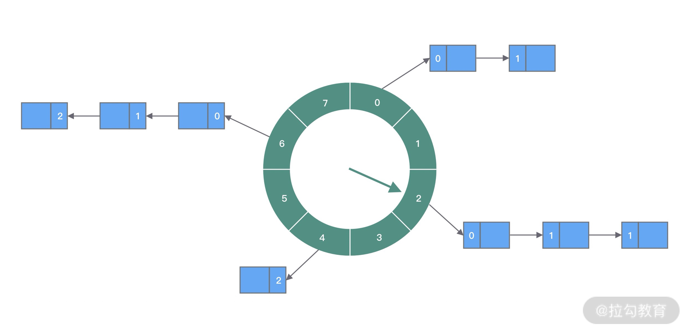

任务是如何添加到时间轮当中的呢？可以根据任务的到期时间进行取模，然后将任务分布到不同的 slot 中。如上图所示，时间轮被划分为 8 个 slot，每个 slot 代表 1s，当前时针指向 2。假如现在需要调度一个 3s 后执行的任务，应该加入 2+3=5 的 slot 中；如果需要调度一个 12s 以后的任务，需要等待时针完整走完一圈 round 零 4 个 slot，需要放入第 (2+12)%8=6 个 slot。

那么当时针走到第 6 个 slot 时，怎么区分每个任务是否需要立即执行，还是需要等待下一圈 round，甚至更久时间之后执行呢？所以我们需要把 round 信息保存在任务中。例如图中第 6 个 slot 的链表中包含 3 个任务，第一个任务 round=0，需要立即执行；第二个任务 round=1，需要等待 1_8=8s 后执行；第三个任务 round=2，需要等待 2_8=8s 后执行。所以当时针转动到对应 slot 时，只执行 round=0 的任务，slot 中其余任务的 round 应当减 1，等待下一个 round 之后执行。

上面介绍了时间轮算法的基本理论，可以看出时间轮有点类似 HashMap，如果多个任务如果对应同一个 slot，处理冲突的方法采用的是拉链法。在任务数量比较多的场景下，适当增加时间轮的 slot 数量，可以减少时针转动时遍历的任务个数。

时间轮定时器最大的优势就是，任务的新增和取消都是 O(1) 时间复杂度，而且只需要一个线程就可以驱动时间轮进行工作。HashedWheelTimer 是 Netty 中时间轮算法的实现类，下面我就结合 HashedWheelTimer 的源码详细分析时间轮算法的实现原理。

## Netty HashedWheelTimer 源码解析

在开始学习 HashedWheelTimer 的源码之前，需要了解 HashedWheelTimer 接口定义以及相关组件，才能更好地使用 HashedWheelTimer。

### 接口定义

HashedWheelTimer 实现了接口 io.netty.util.Timer，Timer 接口是我们研究 HashedWheelTimer 一个很好的切入口。一起看下 Timer 接口的定义：

```java
public interface Timer {
    Timeout newTimeout(TimerTask task, long delay, TimeUnit unit);
    Set<Timeout> stop();
}
```

Timer 接口提供了两个方法，分别是创建任务 newTimeout() 和停止所有未执行任务 stop()。从方法的定义可以看出，Timer 可以认为是上层的时间轮调度器，通过 newTimeout() 方法可以提交一个任务 TimerTask，并返回一个 Timeout。TimerTask 和 Timeout 是两个接口类，它们有什么作用呢？我们分别看下 TimerTask 和 Timeout 的接口定义：

```java
public interface TimerTask {
    void run(Timeout timeout) throws Exception;
}

public interface Timeout {
    Timer timer();
    TimerTask task();
    boolean isExpired();
    boolean isCancelled();
    boolean cancel();
}
```

Timeout 持有 Timer 和 TimerTask 的引用，而且通过 Timeout 接口可以执行取消任务的操作。Timer、Timeout 和 TimerTask 之间的关系如下图所示：

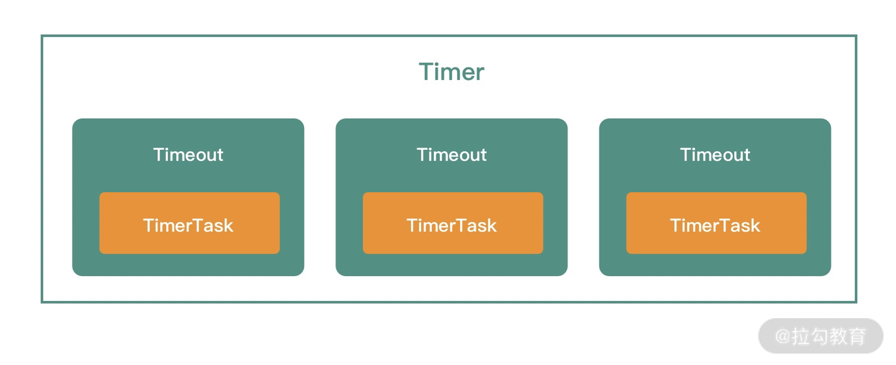 清楚 HashedWheelTimer 的接口定义以及相关组件的概念之后，接下来我们就可以开始使用它了。

### 快速上手

通过下面这个简单的例子，我们看下 HashedWheelTimer 是如何使用的。

```java
public class HashedWheelTimerTest {
    public static void main(String[] args) {
        Timer timer = new HashedWheelTimer();
        Timeout timeout1 = timer.newTimeout(new TimerTask() {
            @Override
            public void run(Timeout timeout) {
                System.out.println("timeout1: " + new Date());
            }
        }, 10, TimeUnit.SECONDS);
        if (!timeout1.isExpired()) {
            timeout1.cancel();
        }
        timer.newTimeout(new TimerTask() {
            @Override
            public void run(Timeout timeout) throws InterruptedException {
                System.out.println("timeout2: " + new Date());
                Thread.sleep(5000);
            }
        }, 1, TimeUnit.SECONDS);
        timer.newTimeout(new TimerTask() {
            @Override
            public void run(Timeout timeout) {
                System.out.println("timeout3: " + new Date());
            }
        }, 3, TimeUnit.SECONDS);
    }
}
```

代码运行结果如下：

```java
timeout2: Mon Nov 09 19:57:04 CST 2020
timeout3: Mon Nov 09 19:57:09 CST 2020
```

简单的几行代码，基本展示了 HashedWheelTimer 的大部分用法。示例中我们通过 newTimeout() 启动了三个 TimerTask，timeout1 由于被取消了，所以并没有执行。timeout2 和 timeout3 分别应该在 1s 和 3s 后执行。然而从结果输出看并不是，timeout2 和 timeout3 的打印时间相差了 5s，这是由于 timeout2 阻塞了 5s 造成的。由此可以看出，时间轮中的任务执行是**串行**的，当一个任务执行的时间过长，会影响后续任务的调度和执行，很可能产生任务堆积的情况。

至此，对 HashedWheelTimer 的基本使用方法已经有了初步了解，下面我们开始深入研究 HashedWheelTimer 的实现原理。

### 内部结构

我们先从 HashedWheelTimer 的构造函数看起，结合上文中介绍的时间轮算法，一起梳理出 HashedWheelTimer 的内部实现结构。

```java
public HashedWheelTimer(
        ThreadFactory threadFactory,
        long tickDuration, 
        TimeUnit unit, 
        int ticksPerWheel, 
        boolean leakDetection,
        long maxPendingTimeouts) {
        // 省略其他代码
    wheel = createWheel(ticksPerWheel); // 创建时间轮的环形数组结构
    mask = wheel.length - 1; // 用于快速取模的掩码
    long duration = unit.toNanos(tickDuration); // 转换成纳秒处理
    // 省略其他代码
    workerThread = threadFactory.newThread(worker); // 创建工作线程
    leak = leakDetection || !workerThread.isDaemon() ? leakDetector.track(this) : null; // 是否开启内存泄漏检测
    this.maxPendingTimeouts = maxPendingTimeouts; // 最大允许等待任务数，HashedWheelTimer 中任务超出该阈值时会抛出异常
    // 如果 HashedWheelTimer 的实例数超过 64，会打印错误日志
    if (INSTANCE_COUNTER.incrementAndGet() > INSTANCE_COUNT_LIMIT &&
        WARNED_TOO_MANY_INSTANCES.compareAndSet(false, true)) {
            reportTooManyInstances();
    }
}
```

HashedWheelTimer 的构造函数清晰地列举出了几个核心属性：

*   **threadFactory**，线程池，但是只创建了一个线程；
*   **tickDuration**，时针每次 tick 的时间，相当于时针间隔多久走到下一个 slot；
*   **unit**，表示 tickDuration 的时间单位；
*   **ticksPerWheel**，时间轮上一共有多少个 slot，默认 512 个。分配的 slot 越多，占用的内存空间就越大；
*   **leakDetection**，是否开启内存泄漏检测；
*   **maxPendingTimeouts**，最大允许等待任务数。

下面我们看下 HashedWheelTimer 是如何创建出来的，我们直接跟进 createWheel() 方法的源码：

```java
private static HashedWheelBucket[] createWheel(int ticksPerWheel) {
    // 省略其他代码
    ticksPerWheel = normalizeTicksPerWheel(ticksPerWheel);
    HashedWheelBucket[] wheel = new HashedWheelBucket[ticksPerWheel];
    for (int i = 0; i < wheel.length; i ++) {
        wheel[i] = new HashedWheelBucket();
    }
    return wheel;
}
private static int normalizeTicksPerWheel(int ticksPerWheel) {
    int normalizedTicksPerWheel = 1;
    while (normalizedTicksPerWheel < ticksPerWheel) {
        normalizedTicksPerWheel <<= 1;
    }
    return normalizedTicksPerWheel;
}
private static final class HashedWheelBucket {
    private HashedWheelTimeout head;
    private HashedWheelTimeout tail;
    // 省略其他代码
}
```

时间轮的创建就是为了创建 HashedWheelBucket 数组，每个 HashedWheelBucket 表示时间轮中一个 slot。从 HashedWheelBucket 的结构定义可以看出，HashedWheelBucket 内部是一个双向链表结构，双向链表的每个节点持有一个 HashedWheelTimeout 对象，HashedWheelTimeout 代表一个定时任务。每个 HashedWheelBucket 都包含双向链表 head 和 tail 两个 HashedWheelTimeout 节点，这样就可以实现不同方向进行链表遍历。关于 HashedWheelBucket 和 HashedWheelTimeout 的具体功能下文再继续介绍。

因为时间轮需要使用 & 做取模运算，所以数组的长度需要是 2 的次幂。normalizeTicksPerWheel() 方法的作用就是找到不小于 ticksPerWheel 的最小 2 次幂，这个方法实现的并不好，可以参考 JDK HashMap 扩容 tableSizeFor 的实现进行性能优化，如下所示。当然 normalizeTicksPerWheel() 只是在初始化的时候使用，所以并无影响。

```java
static final int MAXIMUM_CAPACITY = 1 << 30;
private static int normalizeTicksPerWheel(int ticksPerWheel) {
    int n = ticksPerWheel - 1;
    n |= n >>> 1;
    n |= n >>> 2;
    n |= n >>> 4;
    n |= n >>> 8;
    n |= n >>> 16;
    return (n < 0) ? 1 : (n >= MAXIMUM_CAPACITY) ? MAXIMUM_CAPACITY : n + 1;
}
```

HashedWheelTimer 初始化的主要工作我们已经介绍完了，其内部结构与上文中介绍的时间轮算法类似，如下图所示。


接下来我们围绕定时器的三种基本操作，分析下 HashedWheelTimer 是如何实现添加任务、执行任务和取消任务的。

### 添加任务

HashedWheelTimer 初始化完成后，如何向 HashedWheelTimer 添加任务呢？我们自然想到 HashedWheelTimer 提供的 newTimeout() 方法。

```java
public Timeout newTimeout(TimerTask task, long delay, TimeUnit unit) {
    // 省略其他代码
    long pendingTimeoutsCount = pendingTimeouts.incrementAndGet();
    if (maxPendingTimeouts > 0 && pendingTimeoutsCount > maxPendingTimeouts) {
        pendingTimeouts.decrementAndGet();
        throw new RejectedExecutionException("Number of pending timeouts ("
            + pendingTimeoutsCount + ") is greater than or equal to maximum allowed pending "
            + "timeouts (" + maxPendingTimeouts + ")");
    }
    start(); // 1. 如果 worker 线程没有启动，需要启动
    long deadline = System.nanoTime() + unit.toNanos(delay) - startTime; // 计算任务的 deadline
    if (delay > 0 && deadline < 0) {
        deadline = Long.MAX_VALUE;
    }
    HashedWheelTimeout timeout = new HashedWheelTimeout(this, task, deadline); //  2. 创建定时任务
    timeouts.add(timeout); // 3. 添加任务到 Mpsc Queue
    return timeout;
}
private final Queue<HashedWheelTimeout> timeouts = PlatformDependent.newMpscQueue();
```

newTimeout() 方法主要做了三件事，分别为启动工作线程，创建定时任务，并把任务添加到 Mpsc Queue。HashedWheelTimer 的工作线程采用了懒启动的方式，不需要用户显示调用。这样做的好处是在时间轮中没有任务时，可以避免工作线程空转而造成性能损耗。先看下启动工作线程 start() 的源码：

```java
public void start() {
    switch (WORKER_STATE_UPDATER.get(this)) {
        case WORKER_STATE_INIT:
            if (WORKER_STATE_UPDATER.compareAndSet(this, WORKER_STATE_INIT, WORKER_STATE_STARTED)) {
                workerThread.start();
            }
            break;
        case WORKER_STATE_STARTED:
            break;
        case WORKER_STATE_SHUTDOWN:
            throw new IllegalStateException("cannot be started once stopped");
        default:
            throw new Error("Invalid WorkerState");
    }
    while (startTime == 0) {
        try {
            startTimeInitialized.await();
        } catch (InterruptedException ignore) {

        }
    }
}
```

工作线程的启动之前，会通过 CAS 操作获取工作线程的状态，如果已经启动，则直接跳过。如果没有启动，再次通过 CAS 操作更改工作线程状态，然后启动工作线程。启动的过程是直接调用的 Thread#start() 方法，我们暂且先不关注工作线程具体做了什么，下文再继续分析。

回到 newTimeout() 的主流程，接下来的逻辑就非常简单了。根据用户传入的任务延迟时间，可以计算出任务的 deadline，然后创建定时任务 HashedWheelTimeout 对象，最终把 HashedWheelTimeout 添加到 Mpsc Queue 中。看到这里，你会不会有个疑问，为什么不是将 HashedWheelTimeout 直接添加到时间轮中呢？而是先添加到 Mpsc Queue？Mpsc Queue 可以理解为多生产者单消费者的线程安全队列，下节课我们会对 Mpsc Queue 详细分析，在这里就不做展开了。可以猜到 HashedWheelTimer 是想借助 Mpsc Queue 保证多线程向时间轮添加任务的线程安全性。

那么什么时候任务才会被加入时间轮并执行呢？此时还没有太多信息，接下来我们只能工作线程 Worker 里寻找问题的答案。

### 工作线程 Worker

工作线程 Worker 是时间轮的核心引擎，随着时针的转动，到期任务的处理都由 Worker 处理完成。下面我们定位到 Worker 的 run() 方法一探究竟。

```java
    private final class Worker implements Runnable {
        private final Set<Timeout> unprocessedTimeouts = new HashSet<Timeout>(); // 未处理任务列表
        private long tick;
        @Override
        public void run() {
            startTime = System.nanoTime();
            if (startTime == 0) {
                startTime = 1;
            }
            startTimeInitialized.countDown();
            do {
                final long deadline = waitForNextTick(); // 1. 计算下次 tick 的时间, 然后sleep 到下次 tick
                if (deadline > 0) { // 可能因为溢出或者线程中断，造成 deadline <= 0
                    int idx = (int) (tick & mask); // 2. 获取当前 tick 在 HashedWheelBucket 数组中对应的下标
                    processCancelledTasks(); // 3. 移除被取消的任务
                    HashedWheelBucket bucket = wheel[idx];
                    transferTimeoutsToBuckets(); // 4. 从 Mpsc Queue 中取出任务加入对应的 slot 中
                    bucket.expireTimeouts(deadline); // 5. 执行到期的任务
                    tick++;
                }
            } while (WORKER_STATE_UPDATER.get(HashedWheelTimer.this) == WORKER_STATE_STARTED);
            // 时间轮退出后，取出 slot 中未执行且未被取消的任务，并加入未处理任务列表，以便 stop() 方法返回
            for (HashedWheelBucket bucket: wheel) {
                bucket.clearTimeouts(unprocessedTimeouts);
            }
            // 将还没来得及添加到 slot 中的任务取出，如果任务未取消则加入未处理任务列表，以便 stop() 方法返回
            for (;;) {
                HashedWheelTimeout timeout = timeouts.poll();
                if (timeout == null) {
                    break;
                }
                if (!timeout.isCancelled()) {
                    unprocessedTimeouts.add(timeout);
                }
            }
            processCancelledTasks();
        }
    }
```

工作线程 Worker 的核心执行流程是代码中的 do-while 循环，只要 Worker 处于 STARTED 状态，就会执行 do-while 循环，我们把该过程拆分成为以下几个步骤，逐一分析。

*   通过 waitForNextTick() 方法计算出时针到下一次 tick 的时间间隔，然后 sleep 到下一次 tick。
*   通过位运算获取当前 tick 在 HashedWheelBucket 数组中对应的下标
*   移除被取消的任务。
*   从 Mpsc Queue 中取出任务加入对应的 HashedWheelBucket 中。
*   执行当前 HashedWheelBucket 中的到期任务。

首先看下 waitForNextTick() 方法是如何计算等待时间的，源码如下：

```java
private long waitForNextTick() {
    long deadline = tickDuration * (tick + 1);
    for (;;) {
        final long currentTime = System.nanoTime() - startTime;
        long sleepTimeMs = (deadline - currentTime + 999999) / 1000000;
        if (sleepTimeMs <= 0) {
            if (currentTime == Long.MIN_VALUE) {
                return -Long.MAX_VALUE;
            } else {
                return currentTime;
            }
        }
        if (PlatformDependent.isWindows()) {
            sleepTimeMs = sleepTimeMs / 10 * 10;
        }
        try {
            Thread.sleep(sleepTimeMs);
        } catch (InterruptedException ignored) {
            if (WORKER_STATE_UPDATER.get(HashedWheelTimer.this) == WORKER_STATE_SHUTDOWN) {
                return Long.MIN_VALUE;
            }
        }
    }
}
```

根据 tickDuration 可以推算出下一次 tick 的 deadline，deadline 减去当前时间就可以得到需要 sleep 的等待时间。所以 tickDuration 的值越小，时间的精准度也就越高，同时 Worker 的繁忙程度越高。如果 tickDuration 设置过小，为了防止系统会频繁地 sleep 再唤醒，会保证 Worker 至少 sleep 的时间为 1ms 以上。

Worker 从 sleep 状态唤醒后，接下来会执行第二步流程，通过按位与的操作计算出当前 tick 在 HashedWheelBucket 数组中对应的下标。按位与比普通的取模运算效率要快很多，前提是时间轮中的数组长度是 2 的次幂，掩码 mask 为 2 的次幂减 1，这样才能达到与取模一样的效果。

接下来 Worker 会调用 processCancelledTasks() 方法处理被取消的任务，所有取消的任务都会加入 cancelledTimeouts 队列中，Worker 会从队列中取出任务，然后将其从对应的 HashedWheelBucket 中删除，删除操作为基本的链表操作。processCancelledTasks() 的源码比较简单，我们在此就不展开了。

之前我们还留了一个疑问，Mpsc Queue 中的任务什么时候加入时间轮的呢？答案就在 transferTimeoutsToBuckets() 方法中。

```java
private void transferTimeoutsToBuckets() {
    // 每次时针 tick 最多只处理 100000 个任务，以防阻塞 Worker 线程
    for (int i = 0; i < 100000; i++) {
        HashedWheelTimeout timeout = timeouts.poll();
        if (timeout == null) {
            break;
        }
        if (timeout.state() == HashedWheelTimeout.ST_CANCELLED) {
            continue;
        }
        long calculated = timeout.deadline / tickDuration; // 计算任务需要经过多少个 tick
        timeout.remainingRounds = (calculated - tick) / wheel.length; // 计算任务需要在时间轮中经历的圈数 remainingRounds
        final long ticks = Math.max(calculated, tick); // 如果任务在 timeouts 队列里已经过了执行时间, 那么会加入当前 HashedWheelBucket 中
        int stopIndex = (int) (ticks & mask);
        HashedWheelBucket bucket = wheel[stopIndex];
        bucket.addTimeout(timeout);
    }
}
```

transferTimeoutsToBuckets() 的主要工作就是从 Mpsc Queue 中取出任务，然后添加到时间轮对应的 HashedWheelBucket 中。每次时针 tick 最多只处理 100000 个任务，一方面避免取任务的操作耗时过长，另一方面为了防止执行太多任务造成 Worker 线程阻塞。

根据用户设置的任务 deadline，可以计算出任务需要经过多少次 tick 才能开始执行以及需要在时间轮中转动圈数 remainingRounds，remainingRounds 会记录在 HashedWheelTimeout 中，在执行任务的时候 remainingRounds 会被使用到。因为时间轮中的任务并不能够保证及时执行，假如有一个任务执行的时间特别长，那么任务在 timeouts 队列里已经过了执行时间，也没有关系，Worker 会将这些任务直接加入当前HashedWheelBucket 中，所以过期的任务并不会被遗漏。

任务被添加到时间轮之后，重新再回到 Worker#run() 的主流程，接下来就是执行当前 HashedWheelBucket 中的到期任务，跟进 HashedWheelBucket#expireTimeouts() 方法的源码：

```java
public void expireTimeouts(long deadline) {
    HashedWheelTimeout timeout = head;
    while (timeout != null) {
        HashedWheelTimeout next = timeout.next;
        if (timeout.remainingRounds <= 0) {
            next = remove(timeout);
            if (timeout.deadline <= deadline) {
                timeout.expire(); // 执行任务
            } else {
                throw new IllegalStateException(String.format(
                            "timeout.deadline (%d) > deadline (%d)", timeout.deadline, deadline));
            }
        } else if (timeout.isCancelled()) {
            next = remove(timeout);
        } else {
            timeout.remainingRounds --; // 未到执行时间，remainingRounds 减 1
        }
        timeout = next;
    }
}
```

执行任务的操作比较简单，就是从头开始遍历 HashedWheelBucket 中的双向链表。如果 remainingRounds <=0，则调用 expire() 方法执行任务，timeout.expire() 内部就是调用了 TimerTask 的 run() 方法。如果任务已经被取消，直接从链表中移除。否则表示任务的执行时间还没到，remainingRounds 减 1，等待下一圈即可。

至此，工作线程 Worker 的核心逻辑 do-while 循环我们已经讲完了。当时间轮退出后，Worker 还会执行一些后置的收尾工作。Worker 会从每个 HashedWheelBucket 取出未执行且未取消的任务，以及还来得及添加到 HashedWheelBucket 中的任务，然后加入未处理任务列表，以便 stop() 方法统一处理。

### 停止时间轮

回到 Timer 接口两个方法，newTimeout() 上文已经分析完了，接下来我们就以 stop() 方法为入口，看下时间轮停止都做了哪些工作。

```java
@Override
public Set<Timeout> stop() {
    // Worker 线程无法停止时间轮
    if (Thread.currentThread() == workerThread) {
        throw new IllegalStateException(HashedWheelTimer.class.getSimpleName() + ".stop() cannot be called from " + TimerTask.class.getSimpleName());
    }
    // 尝试通过 CAS 操作将工作线程的状态更新为 SHUTDOWN 状态
    if (!WORKER_STATE_UPDATER.compareAndSet(this, WORKER_STATE_STARTED, WORKER_STATE_SHUTDOWN)) {
        if (WORKER_STATE_UPDATER.getAndSet(this, WORKER_STATE_SHUTDOWN) != WORKER_STATE_SHUTDOWN) {
            INSTANCE_COUNTER.decrementAndGet();
            if (leak != null) {
                boolean closed = leak.close(this);
                assert closed;
            }
            return Collections.emptySet();
        }
        try {
            boolean interrupted = false;
            while (workerThread.isAlive()) {
                workerThread.interrupt(); // 中断 Worker 线程
                try {
                    workerThread.join(100);
                } catch (InterruptedException ignored) {
                    interrupted = true;
                }
            }
            if (interrupted) {
                Thread.currentThread().interrupt();
            }
        } finally {
            INSTANCE_COUNTER.decrementAndGet();
            if (leak != null) {
                boolean closed = leak.close(this);
                assert closed;
            }
        }
        return worker.unprocessedTimeouts(); // 返回未处理任务的列表
    }
}
```

如果当前线程是 Worker 线程，它是不能发起停止时间轮的操作的，是为了防止有定时任务发起停止时间轮的恶意操作。停止时间轮主要做了三件事，首先尝试通过 CAS 操作将工作线程的状态更新为 SHUTDOWN 状态，然后中断工作线程 Worker，最后将未处理的任务列表返回给上层。

到此为止，HashedWheelTimer 的实现原理我们已经分析完了。再来回顾一下 HashedWheelTimer 的几个核心成员。

*   **HashedWheelTimeout**，任务的封装类，包含任务的到期时间 deadline、需要经历的圈数 remainingRounds 等属性。
*   **HashedWheelBucket**，相当于时间轮的每个 slot，内部采用双向链表保存了当前需要执行的 HashedWheelTimeout 列表。
*   **Worker**，HashedWheelTimer 的核心工作引擎，负责处理定时任务。

## 时间轮进阶应用

Netty 中的时间轮是通过固定的时间间隔 tickDuration 进行推动的，如果长时间没有到期任务，那么会存在时间轮空推进的现象，从而造成一定的性能损耗。此外，如果任务的到期时间跨度很大，例如 A 任务 1s 后执行，B 任务 6 小时之后执行，也会造成空推进的问题。

那么上述问题有没有什么解决方案呢？在研究 Kafka 的时候，Kafka 也有时间轮的应用，它的实现思路与 Netty 是存在区别的。因为 Kafka 面对的应用场景是更加严苛的，可能会存在各种时间粒度的定时任务，那么 Kafka 是否有解决时间跨度问题呢？我们接下来就简单介绍下 Kafka 的优化思路。

Kafka 时间轮的内部结构与 Netty 类似，如下图所示。Kafka 的时间轮也是采用环形数组存储定时任务，数组中的每个 slot 代表一个 Bucket，每个 Bucket 保存了定时任务列表 TimerTaskList，TimerTaskList 同样采用双向链表的结构实现，链表的每个节点代表真正的定时任务 TimerTaskEntry。


为了解决空推进的问题，Kafka 借助 JDK 的 DelayQueue 来负责推进时间轮。DelayQueue 保存了时间轮中的每个 Bucket，并且根据 Bucket 的到期时间进行排序，最近的到期时间被放在 DelayQueue 的队头。Kafka 中会有一个线程来读取 DelayQueue 中的任务列表，如果时间没有到，那么 DelayQueue 会一直处于阻塞状态，从而解决空推荐的问题。这时候你可能会问，DelayQueue 插入和删除的性能不是并不好吗？其实 Kafka 采用的是一种权衡的策略，把 DelayQueue 用在了合适的地方。DelayQueue 只存放了 Bucket，Bucket 的数量并不多，相比空推进带来的影响是利大于弊的。

为了解决任务时间跨度很大的问题，Kafka 引入了层级时间轮，如下图所示。当任务的 deadline 超出当前所在层的时间轮表示范围时，就会尝试将任务添加到上一层时间轮中，跟钟表的时针、分针、秒针的转动规则是同一个道理。


从图中可以看出，第一层时间轮每个时间格为 1ms，整个时间轮的跨度为 20ms；第二层时间轮每个时间格为 20ms，整个时间轮跨度为 400ms；第三层时间轮每个时间格为 400ms，整个时间轮跨度为 8000ms。每一层时间轮都有自己的指针，每层时间轮走完一圈后，上层时间轮也会相应推进一格。

假设现在有一个任务到期时间是 450ms 之后，应该放在第三层时间轮的第一格。随着时间的流逝，当指针指向该时间格时，发现任务到期时间还有 50ms，这里就涉及时间轮降级的操作，它会将任务重新提交到时间轮中。此时发现第一层时间轮整体跨度不够，需要放在第二层时间轮中第三格。当时间再经历 40ms 之后，该任务又会触发一次降级操作，放入到第一层时间轮，最后等到 10ms 后执行任务。

由此可见，Kafka 的层级时间轮的时间粒度更好控制，可以应对更加复杂的定时任务处理场景，适用的范围更广。

## 总结

HashedWheelTimer 的源码通俗易懂，其设计思想值得我们借鉴。在平时开发中如果有类似的任务处理机制，你可以尝试套用 HashedWheelTimer 的工作模式。

HashedWheelTimer 并不是十全十美的，使用的时候需要清楚它存在的问题：

*   如果长时间没有到期任务，那么会存在时间轮空推进的现象。
*   只适用于处理耗时较短的任务，由于 Worker 是单线程的，如果一个任务执行的时间过长，会造成 Worker 线程阻塞。
*   相比传统定时器的实现方式，内存占用较大。

22 技巧篇：高性能无锁队列 Mpsc Queue
=========================

在前面的源码课程中，NioEventLoop 线程以及时间轮 HashedWheelTimer 的任务队列中都出现了 Mpsc Queue 的身影。这又是 Netty 使用的什么 “黑科技” 呢？为什么不使用 JDK 原生的队列呢？Mpsc Queue 应该在什么场景下使用呢？今天这节课就让我们一起再来长长知识吧！

## JDK 原生并发队列

在介绍 Mpsc Queue 之前，我们先回顾下 JDK 原生队列的工作原理。JDK 并发队列按照实现方式可以分为阻塞队列和非阻塞队列两种类型，阻塞队列是基于锁实现的，非阻塞队列是基于 CAS 操作实现的。JDK 中包含多种阻塞和非阻塞的队列实现，如下图所示。


队列是一种 FIFO（先进先出）的数据结构，JDK 中定义了 java.util.Queue 的队列接口，与 List、Set 接口类似，java.util.Queue 也继承于 Collection 集合接口。此外，JDK 还提供了一种双端队列接口 java.util.Deque，我们最常用的 LinkedList 就是实现了 Deque 接口。下面我们简单说说上图中的每个队列的特点，并给出一些对比和总结。

### 阻塞队列

阻塞队列在队列为空或者队列满时，都会发生阻塞。阻塞队列自身是线程安全的，使用者无需关心线程安全问题，降低了多线程开发难度。阻塞队列主要分为以下几种：

*   **ArrayBlockingQueue**：最基础且开发中最常用的阻塞队列，底层采用数组实现的有界队列，初始化需要指定队列的容量。ArrayBlockingQueue 是如何保证线程安全的呢？它内部是使用了一个重入锁 ReentrantLock，并搭配 notEmpty、notFull 两个条件变量 Condition 来控制并发访问。从队列读取数据时，如果队列为空，那么会阻塞等待，直到队列有数据了才会被唤醒。如果队列已经满了，也同样会进入阻塞状态，直到队列有空闲才会被唤醒。
*   **LinkedBlockingQueue**：内部采用的数据结构是链表，队列的长度可以是有界或者无界的，初始化不需要指定队列长度，默认是 Integer.MAX_VALUE。LinkedBlockingQueue 内部使用了 takeLock、putLock两个重入锁 ReentrantLock，以及 notEmpty、notFull 两个条件变量 Condition 来控制并发访问。采用读锁和写锁的好处是可以避免读写时相互竞争锁的现象，所以相比于 ArrayBlockingQueue，LinkedBlockingQueue 的性能要更好。
*   **PriorityBlockingQueue**：采用最小堆实现的优先级队列，队列中的元素按照优先级进行排列，每次出队都是返回优先级最高的元素。PriorityBlockingQueue 内部是使用了一个 ReentrantLock 以及一个条件变量 Condition notEmpty 来控制并发访问，不需要 notFull 是因为 PriorityBlockingQueue 是无界队列，所以每次 put 都不会发生阻塞。PriorityBlockingQueue 底层的最小堆是采用数组实现的，当元素个数大于等于最大容量时会触发扩容，在扩容时会先释放锁，保证其他元素可以正常出队，然后使用 CAS 操作确保只有一个线程可以执行扩容逻辑。
*   **DelayQueue**，一种支持延迟获取元素的阻塞队列，常用于缓存、定时任务调度等场景。DelayQueue 内部是采用优先级队列 PriorityQueue 存储对象。DelayQueue 中的每个对象都必须实现 Delayed 接口，并重写 compareTo 和 getDelay 方法。向队列中存放元素的时候必须指定延迟时间，只有延迟时间已满的元素才能从队列中取出。
*   **SynchronizedQueue**，又称无缓冲队列。比较特别的是 SynchronizedQueue 内部不会存储元素。与 ArrayBlockingQueue、LinkedBlockingQueue 不同，SynchronizedQueue 直接使用 CAS 操作控制线程的安全访问。其中 put 和 take 操作都是阻塞的，每一个 put 操作都必须阻塞等待一个 take 操作，反之亦然。所以 SynchronizedQueue 可以理解为生产者和消费者配对的场景，双方必须互相等待，直至配对成功。在 JDK 的线程池 Executors.newCachedThreadPool 中就存在 SynchronousQueue 的运用，对于新提交的任务，如果有空闲线程，将重复利用空闲线程处理任务，否则将新建线程进行处理。
*   **LinkedTransferQueue**，一种特殊的无界阻塞队列，可以看作 LinkedBlockingQueues、SynchronousQueue（公平模式）、ConcurrentLinkedQueue 的合体。与 SynchronousQueue 不同的是，LinkedTransferQueue 内部可以存储实际的数据，当执行 put 操作时，如果有等待线程，那么直接将数据交给对方，否则放入队列中。与 LinkedBlockingQueues 相比，LinkedTransferQueue 使用 CAS 无锁操作进一步提升了性能。

### 非阻塞队列

说完阻塞队列，我们再来看下非阻塞队列。非阻塞队列不需要通过加锁的方式对线程阻塞，并发性能更好。JDK 中常用的非阻塞队列有以下几种：

*   **ConcurrentLinkedQueue**，它是一个采用双向链表实现的无界并发非阻塞队列，它属于 LinkedQueue 的安全版本。ConcurrentLinkedQueue 内部采用 CAS 操作保证线程安全，这是非阻塞队列实现的基础，相比 ArrayBlockingQueue、LinkedBlockingQueue 具备较高的性能。
*   **ConcurrentLinkedDeque**，也是一种采用双向链表结构的无界并发非阻塞队列。与 ConcurrentLinkedQueue 不同的是，ConcurrentLinkedDeque 属于双端队列，它同时支持 FIFO 和 FILO 两种模式，可以从队列的头部插入和删除数据，也可以从队列尾部插入和删除数据，适用于多生产者和多消费者的场景。

至此，常见的队列类型我们已经介绍完了。我们在平时开发中使用频率最高的是 BlockingQueue。实现一个阻塞队列需要具备哪些基本功能呢？下面看 BlockingQueue 的接口，如下图所示。

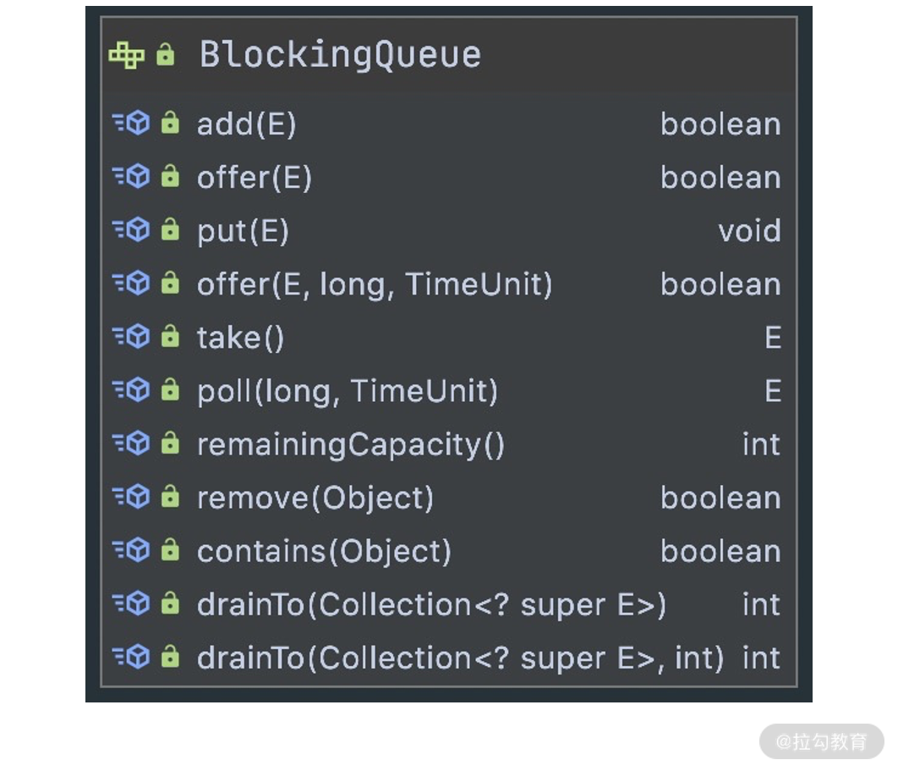

我们可以通过下面一张表格，对上述 BlockingQueue 接口的具体行为进行归类。

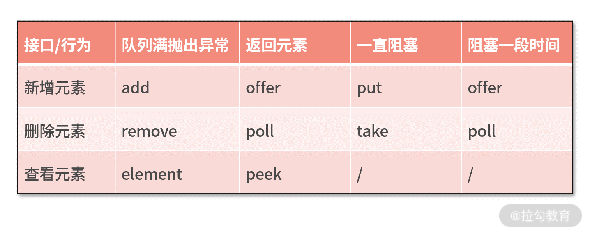

JDK 提供的并发队列已经能够满足我们大部分的需求，但是在大规模流量的高并发系统中，如果你对性能要求严苛，JDK 的非阻塞并发队列可选择面较少且性能并不够出色。如果你还是需要一个数组 + CAS 操作实现的无锁安全队列，有没有成熟的解决方案呢？Java 强大的生态总能给我们带来惊喜，一些第三方框架提供的高性能无锁队列已经可以满足我们的需求，其中非常出名的有 Disruptor 和 JCTools。

Disruptor 是 LMAX 公司开发的一款高性能无锁队列，我们平时常称它为 RingBuffer，其设计初衷是为了解决内存队列的延迟问题。Disruptor 内部采用环形数组和 CAS 操作实现，性能非常优越。为什么 Disruptor 的性能会比 JDK 原生的无锁队列要好呢？环形数组可以复用内存，减少分配内存和释放内存带来的性能损耗。而且数组可以设置长度为 2 的次幂，直接通过位运算加快数组下标的定位速度。此外，Disruptor 还解决了伪共享问题，对 CPU Cache 更加友好。Disruptor 已经开源，详细可查阅 Github 地址 [https://github.com/LMAX-Exchange/disruptor](https://github.com/LMAX-Exchange/disruptor)。

JCTools 也是一个开源项目，Github 地址为 [https://github.com/JCTools/JCTools](https://github.com/JCTools/JCTools)。JCTools 是适用于 JVM 并发开发的工具，主要提供了一些 JDK 确实的并发数据结构，例如非阻塞 Map、非阻塞 Queue 等。其中非阻塞队列可以分为四种类型，可以根据不同的场景选择使用。

*   Spsc 单生产者单消费者；
*   Mpsc 多生产者单消费者；
*   Spmc 单生产者多消费者；
*   Mpmc 多生产者多消费者。

Netty 中直接引入了 JCTools 的 Mpsc Queue，相比于 JDK 原生的并发队列，Mpsc Queue 又有什么过人之处呢？接下来便开始我们今天要讨论的重点。

## Mpsc Queue 基础知识

Mpsc 的全称是 Multi Producer Single Consumer，多生产者单消费者。Mpsc Queue 可以保证多个生产者同时访问队列是线程安全的，而且同一时刻只允许一个消费者从队列中读取数据。Netty Reactor 线程中任务队列 taskQueue 必须满足多个生产者可以同时提交任务，所以 JCTools 提供的 Mpsc Queue 非常适合 Netty Reactor 线程模型。

Mpsc Queue 有多种的实现类，例如 MpscArrayQueue、MpscUnboundedArrayQueue、MpscChunkedArrayQueue 等。我们先抛开一些提供特性功能的队列，聚焦在最基础的 MpscArrayQueue，回过头再学习其他类型的队列会事半功倍。

首先我们看下 MpscArrayQueue 的继承关系，会发现相当复杂，如下图所示。


除了顶层 JDK 原生的 AbstractCollection、AbstractQueue，MpscArrayQueue 还继承了很多类似于 MpscXxxPad 以及 MpscXxxField 的类。我们可以发现一个很有意思的规律，每个有包含属性的类后面都会被 MpscXxxPad 类隔开。MpscXxxPad 到底起到什么作用呢？我们自顶向下，将所有类的字段合并在一起，看下 MpscArrayQueue 的整体结构。

```java
// ConcurrentCircularArrayQueueL0Pad
long p01, p02, p03, p04, p05, p06, p07;
long p10, p11, p12, p13, p14, p15, p16, p17;

// ConcurrentCircularArrayQueue
protected final long mask;
protected final E[] buffer;

// MpmcArrayQueueL1Pad
long p00, p01, p02, p03, p04, p05, p06, p07;
long p10, p11, p12, p13, p14, p15, p16;

// MpmcArrayQueueProducerIndexField
private volatile long producerIndex;

// MpscArrayQueueMidPad
long p01, p02, p03, p04, p05, p06, p07;
long p10, p11, p12, p13, p14, p15, p16, p17;

// MpscArrayQueueProducerLimitField
private volatile long producerLimit;

// MpscArrayQueueL2Pad
long p00, p01, p02, p03, p04, p05, p06, p07;
long p10, p11, p12, p13, p14, p15, p16;

// MpscArrayQueueConsumerIndexField
protected long consumerIndex;

// MpscArrayQueueL3Pad
long p01, p02, p03, p04, p05, p06, p07;
long p10, p11, p12, p13, p14, p15, p16, p17;
```

可以看出，MpscXxxPad 类中使用了大量 long 类型的变量，其命名没有什么特殊的含义，只是起到填充的作用。如果你也读过 Disruptor 的源码，会发现 Disruptor 也使用了类似的填充方法。Mpsc Queue 和 Disruptor 之所以填充这些无意义的变量，是为了解决伪共享（false sharing）问题。

什么是伪共享呢？我们有必要补充这方面的基础知识。在计算机组成中，CPU 的运算速度比内存高出几个数量级，为了 CPU 能够更高效地与内存进行交互，在 CPU 和内存之间设计了多层缓存机制，如下图所示。

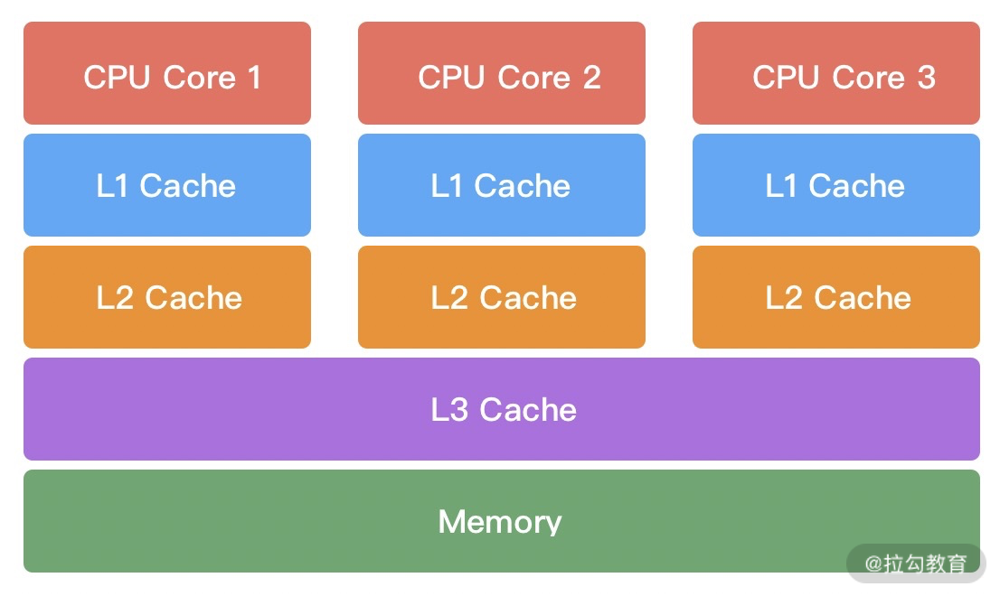

一般来说，CPU 会分为三级缓存，分别为**L1 一级缓存**、**L2 二级缓存**和**L3 三级缓存**。越靠近 CPU 的缓存，速度越快，但是缓存的容量也越小。所以从性能上来说，L1 > L2 > L3，容量方面 L1 < L2 < L3。CPU 读取数据时，首先会从 L1 查找，如果未命中则继续查找 L2，如果还未能命中则继续查找 L3，最后还没命中的话只能从内存中查找，读取完成后再将数据逐级放入缓存中。此外，多线程之间共享一份数据的时候，需要其中一个线程将数据写回主存，其他线程访问主存数据。

由此可见，引入多级缓存是为了能够让 CPU 利用率最大化。如果你在做频繁的 CPU 运算时，需要尽可能将数据保持在缓存中。那么 CPU 从内存中加载数据的时候，是如何提高缓存的利用率的呢？这就涉及缓存行（Cache Line）的概念，Cache Line 是 CPU 缓存可操作的最小单位，CPU 缓存由若干个 Cache Line 组成。Cache Line 的大小与 CPU 架构有关，在目前主流的 64 位架构下，Cache Line 的大小通常为 64 Byte。Java 中一个 long 类型是 8 Byte，所以一个 Cache Line 可以存储 8 个 long 类型变量。CPU 在加载内存数据时，会将相邻的数据一同读取到 Cache Line 中，因为相邻的数据未来被访问的可能性最大，这样就可以避免 CPU 频繁与内存进行交互了。

伪共享问题是如何发生的呢？它又会造成什么影响呢？我们使用下面这幅图进行讲解。 

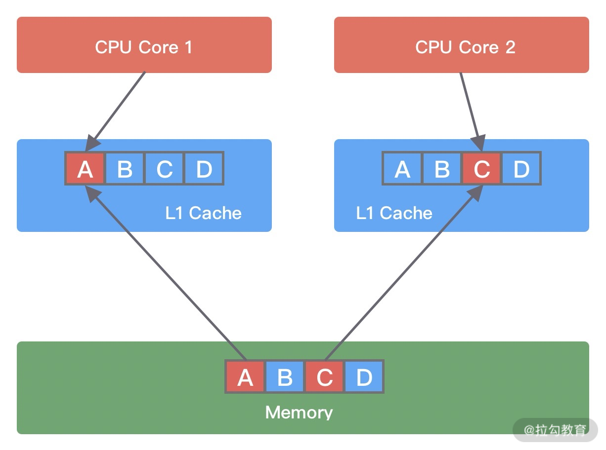

假设变量 A、B、C、D 被加载到同一个 Cache Line，它们会被高频地修改。当线程 1 在 CPU Core1 中中对变量 A 进行修改，修改完成后 CPU Core1 会通知其他 CPU Core 该缓存行已经失效。然后线程 2 在 CPU Core2 中对变量 C 进行修改时，发现 Cache line 已经失效，此时 CPU Core1 会将数据重新写回内存，CPU Core2 再从内存中读取数据加载到当前 Cache line 中。

由此可见，如果同一个 Cache line 被越多的线程修改，那么造成的写竞争就会越激烈，数据会频繁写入内存，导致性能浪费。题外话，多核处理器中，每个核的缓存行内容是如何保证一致的呢？有兴趣的同学可以深入学习下缓存一致性协议 MESI，具体可以参考 [https://zh.wikipedia.org/wiki/MESI%E5%8D%8F%E8%AE%AE](https://zh.wikipedia.org/wiki/MESI协议)。

对于伪共享问题，我们应该如何解决呢？Disruptor 和 Mpsc Queue 都采取了空间换时间的策略，让不同线程共享的对象加载到不同的缓存行即可。下面我们通过一个简单的例子进行说明。

```java
public class FalseSharingPadding {
    protected long p1, p2, p3, p4, p5, p6, p7;
    protected volatile long value = 0L;
    protected long p9, p10, p11, p12, p13, p14, p15;
}
```

从上述代码中可以看出，变量 value 前后都填充了 7 个 long 类型的变量。这样不论在什么情况下，都可以保证在多线程访问 value 变量时，value 与其他不相关的变量处于不同的 Cache Line，如下图所示。


伪共享问题一般是非常隐蔽的，在实际开发的过程中，并不是项目中所有地方都需要花费大量的精力去优化伪共享问题。CPU Cache 的填充本身也是比较珍贵的，我们应该把精力聚焦在一些高性能的数据结构设计上，把资源用在刀刃上，使系统性能收益最大化。

至此，我们知道 Mpsc Queue 为了解决伪共享问题填充了大量的 long 类型变量，造成源码不易阅读。因为变量填充只是为了提升 Mpsc Queue 的性能，与 Mpsc Queue 的主体功能无关。接下来我们先忽略填充变量，开始分析 Mpsc Queue 的基本实现原理。

## Mpsc Queue 源码分析

在开始源码学习之前，我们同样先看看 MpscArrayQueue 如何使用，示例代码如下：

```java
public class MpscArrayQueueTest {
    public static final MpscArrayQueue<String> MPSC_ARRAY_QUEUE = new MpscArrayQueue<>(2);
    public static void main(String[] args) {
        for (int i = 1; i <= 2; i++) {
            int index = i;
            new Thread(() -> MPSC_ARRAY_QUEUE.offer("data" + index), "thread" + index).start();
        }
        try {
            Thread.sleep(1000L);
            MPSC_ARRAY_QUEUE.add("data3"); // 入队操作，队列满则抛出异常
        } catch (Exception e) {
            e.printStackTrace();
        }
        System.out.println("队列大小：" + MPSC_ARRAY_QUEUE.size() + ", 队列容量：" + MPSC_ARRAY_QUEUE.capacity());
        System.out.println("出队：" + MPSC_ARRAY_QUEUE.remove()); // 出队操作，队列为空则抛出异常
        System.out.println("出队：" + MPSC_ARRAY_QUEUE.poll()); // 出队操作，队列为空则返回 NULL
    }
}
```

程序输出结果如下：

```shell
java.lang.IllegalStateException: Queue full
	at java.util.AbstractQueue.add(AbstractQueue.java:98)
	at MpscArrayQueueTest.main(MpscArrayQueueTest.java:17)
队列大小：2, 队列容量：2
出队：data1
出队：data2
Disconnected from the target VM, address: '127.0.0.1:58005', transport: 'socket'
```

说到底 MpscArrayQueue 终究还是是个队列，基本用法与 ArrayBlockingQueue 都是类似的，都离不开队列的基本操作：**入队 offer()和出队 poll()**。下面我们就入队 offer() 和出队 poll() 两个最重要的操作分别进行详细的讲解。

## 入队 offer

首先我们先回顾下 MpscArrayQueue 的重要属性：

```java
// ConcurrentCircularArrayQueue
protected final long mask; // 计算数组下标的掩码
protected final E[] buffer; // 存放队列数据的数组

// MpmcArrayQueueProducerIndexField
private volatile long producerIndex; // 生产者的索引

// MpscArrayQueueProducerLimitField
private volatile long producerLimit; // 生产者索引的最大值

// MpscArrayQueueConsumerIndexField
protected long consumerIndex; // 消费者索引
```

看到 mask 变量，你现在是不是条件反射想到队列中数组的容量大小肯定是 2 的次幂。因为 Mpsc 是多生产者单消费者队列，所以 producerIndex、producerLimit 都是用 volatile 进行修饰的，其中一个生产者线程的修改需要对其他生产者线程可见。队列入队和出队时会如何操作上述这些属性呢？其中生产者和消费者的索引变量又有什么作用呢？带着这些问题我们开始阅读源码。

首先跟进 offer() 方法的源码：

```java
public boolean offer(E e) {
    if (null == e) {
        throw new NullPointerException();
    } else {
        long mask = this.mask;
        long producerLimit = this.lvProducerLimit(); // 获取生产者索引最大限制
        long pIndex;
        long offset;
        do {
            pIndex = this.lvProducerIndex(); // 获取生产者索引
            if (pIndex >= producerLimit) {
                offset = this.lvConsumerIndex(); // 获取消费者索引
                producerLimit = offset + mask + 1L;
                if (pIndex >= producerLimit) {
                    return false; // 队列已满
                }
                this.soProducerLimit(producerLimit); // 更新 producerLimit
            }
        } while(!this.casProducerIndex(pIndex, pIndex + 1L)); // CAS 更新生产者索引，更新成功则退出，说明当前生产者已经占领索引值
        offset = calcElementOffset(pIndex, mask); // 计算生产者索引在数组中下标
        UnsafeRefArrayAccess.soElement(this.buffer, offset, e); // 向数组中放入数据
        return true;
    }
}
```

MpscArrayQueue 的 offer() 方法虽然比较简短，但是需要具备一些底层知识才能看得懂，先不用担心，我们一点点开始拆解。首先需要搞懂 producerIndex、producerLimit 以及 consumerIndex 之间的关系，这也是 MpscArrayQueue 中设计比较独特的地方。首先看下 lvProducerLimit() 方法的源码：

```java
public MpscArrayQueueProducerLimitField(int capacity) {
    super(capacity);
    this.producerLimit = capacity;
}
protected final long lvProducerLimit() {
    return producerLimit;
}
```

在初始化状态，producerLimit 与队列的容量是相等的，对应到 MpscArrayQueueTest 代码示例中，producerLimit = capacity = 2，而 producerIndex = consumerIndex = 0。接下来 Thread1 和 Thread2 并发向 MpscArrayQueue 中存放数据，如下图所示。


两个线程此时拿到的 producerIndex 都是 0，是小于 producerLimit 的。此时两个线程都会尝试使用 CAS 操作更新 producerIndex，其中必然有一个是成功的，另外一个是失败的。假设 Thread1 执行 CAS 操作成功，那么 Thread2 失败后就会重新更新 producerIndex。Thread1 更新后 producerIndex 的值为 1，由于 producerIndex 是 volatile 修饰的，更新后立刻对 Thread2 可见。这里有一点需要注意的是，当前线程更新后的值是被其他线程使用，当 Thread1 和 Thread2 都通过 CAS 抢占成功后，它们拿到的 pIndex 分别是 0 和 1。接下来就是根据 pIndex 进行位运算计算得到数组对应的下标，然后通过 UNSAFE.putOrderedObject() 方法将数据写入到数组中，源码如下所示。

```java
public static <E> void soElement(E[] buffer, long offset, E e) {
    UnsafeAccess.UNSAFE.putOrderedObject(buffer, offset, e);
}
```

putOrderedObject() 和 putObject() 都可以用于更新对象的值，但是 putOrderedObject() 并不会立刻将数据更新到内存中，并把其他 Cache Line 置为失效。putOrderedObject() 使用的是 LazySet 延迟更新机制，所以性能方面 putOrderedObject() 要比 putObject() 高很多。

Java 中有四种类型的内存屏障，分别为 LoadLoad、StoreStore、LoadStore 和 StoreLoad。putOrderedObject() 使用了 StoreStore Barrier，对于 Store1，StoreStore，Store2 这样的操作序列，在 Store2 进行写入之前，会保证 Store1 的写操作对其他处理器可见。

LazySet 机制是有代价的，就是写操作结果有纳秒级的延迟，不会立刻被其他线程以及自身线程可见。因为在 Mpsc Queue 的使用场景中，多个生产者只负责写入数据，并没有写入之后立刻读取的需求，所以使用 LazySet 机制是没有问题的，只要 StoreStore Barrier 保证多线程写入的顺序即可。

至此，offer() 的核心操作我们已经讲完了。现在我们继续把目光聚焦在 do-while 循环内的逻辑，为什么需要两次 if(pIndex >= producerLimit) 判断呢？说明当生产者索引大于 producerLimit 阈值时，可能存在两种情况：producerLimit 缓存值过期了或者队列已经满了。所以此时我们需要读取最新的消费者索引 consumerIndex，之前读取过的数据位置都可以被重复使用，重新做一次 producerLimit 计算，然后再做一次 if(pIndex >= producerLimit) 判断，如果生产者索引还是大于 producerLimit 阈值，说明队列的真的满了。

因为生产者有多个线程，所以 MpscArrayQueue 采用了 UNSAFE.getLongVolatile() 方法保证获取消费者索引 consumerIndex 的准确性。getLongVolatile() 使用了 StoreLoad Barrier，对于 Store1，StoreLoad，Load2 的操作序列，在 Load2 以及后续的读取操作之前，都会保证 Store1 的写入操作对其他处理器可见。StoreLoad 是四种内存屏障开销最大的，现在你是不是可以体会到引入 producerLimit 的好处了呢？假设我们的消费速度和生产速度比较均衡的情况下，差不多走完一圈数组才需要获取一次消费者索引 consumerIndex，从而大幅度减少了 getLongVolatile() 操作的执行次数，性能提升是显著的。

学习完 MpscArrayQueue 的入队 offer() 方法后，再来看出队 poll() 就会容易很多，我们继续向下看。

## 出队 poll

poll() 方法的作用是移除队列的首个元素并返回，如果队列为空则返回 NULL。我们看下 poll() 源码是如何实现的。

```java
public E poll() {
    long cIndex = this.lpConsumerIndex(); // 直接返回消费者索引 consumerIndex
    long offset = this.calcElementOffset(cIndex); // 计算数组对应的偏移量
    E[] buffer = this.buffer;
    E e = UnsafeRefArrayAccess.lvElement(buffer, offset); // 取出数组中 offset 对应的元素
    if (null == e) {
        if (cIndex == this.lvProducerIndex()) { // 队列已满
            return null;
        }
        do {
            e = UnsafeRefArrayAccess.lvElement(buffer, offset); 
        } while(e == null); // 等待生产者填充元素
    }
    UnsafeRefArrayAccess.spElement(buffer, offset, (Object)null); // 消费成功后将当前位置置为 NULL
    this.soConsumerIndex(cIndex + 1L); // 更新 consumerIndex 到下一个位置
    return e;
}
```

因为只有一个消费者线程，所以整个 poll() 的过程没有 CAS 操作。poll() 方法核心思路是获取消费者索引 consumerIndex，然后根据 consumerIndex 计算得出数组对应的偏移量，然后将数组对应位置的元素取出并返回，最后将 consumerIndex 移动到环形数组下一个位置。

获取消费者索引以及计算数组对应的偏移量的逻辑与 offer() 类似，在这里就不赘述了。下面直接看下如何取出数组中 offset 对应的元素，跟进 lvElement() 方法的源码。

```java
public static <E> E lvElement(E[] buffer, long offset) {
    return (E) UNSAFE.getObjectVolatile(buffer, offset);
}
```

获取数组元素的时候同样使用了 UNSAFE 系列方法，getObjectVolatile() 方法则使用的是 LoadLoad Barrier，对于 Load1，LoadLoad，Load2 操作序列，在 Load2 以及后续读取操作之前，会保证 Load1 的读取操作执行完毕，所以 getObjectVolatile() 方法可以保证每次读取数据都可以从内存中拿到最新值。

与 offer() 相反，poll() 比较关注队列为空的情况。当调用 lvElement() 方法获取到的元素为 NULL 时，有两种可能的情况：队列为空或者生产者填充的元素还没有对消费者可见。如果消费者索引 consumerIndex 等于生产者 producerIndex，说明队列为空。只要两者不相等，消费者需要等待生产者填充数据完毕。

当成功消费数组中的元素之后，需要把当前消费者索引 consumerIndex 的位置置为 NULL，然后把 consumerIndex 移动到数组下一个位置。逻辑比较简单，下面我们把 spElement() 和 soConsumerIndex() 方法放在一起看。

```java
public static <E> void spElement(E[] buffer, long offset, E e) {
    UNSAFE.putObject(buffer, offset, e);
}
protected void soConsumerIndex(long newValue) {
    UNSAFE.putOrderedLong(this, C_INDEX_OFFSET, newValue);
}
```

最后的更新操作我们又看到了 UNSAFE put 系列方法的运用，其中 putObject() 不会使用任何内存屏障，它会直接更新对象对应偏移量的值。而 putOrderedLong 与 putOrderedObject() 是一样的，都使用了 StoreStore Barrier，也是延迟更新 LazySet 机制，我们就不再赘述了。

到此为止，MpscArrayQueue 入队和出队的核心源码已经分析完了。因为 JCTools 是服务于 JVM 的并发工具类，其中包含了很多黑科技的技巧，例如填充法解决伪共享问题、Unsafe 直接操作内存等，让我们对底层知识的掌握又更进一步。此外 JCTools 还提供了 MpscUnboundedArrayQueue、MpscChunkedArrayQueue 等其他具有特色功能的队列，有兴趣的话你可以课后自行研究，相信有了本节课的基础，再分析其他队列一定不会难倒你。

## 总结

MpscArrayQueue 还只是 Jctools 中的冰山一角，其中蕴藏着丰富的技术细节，我们对 MpscArrayQueue 的知识点做一个简单的总结。

*   通过大量填充 long 类型变量解决伪共享问题。
*   环形数组的容量设置为 2 的次幂，可以通过位运算快速定位到数组对应下标。
*   入队 offer() 操作中 producerLimit 的巧妙设计，大幅度减少了主动获取消费者索引 consumerIndex 的次数，性能提升显著。
*   入队和出队操作中都大量使用了 UNSAFE 系列方法，针对生产者和消费者的场景不同，使用的 UNSAFE 方法也是不一样的。Jctools 在底层操作的运用上也是有的放矢，把性能发挥到极致。

到此为止，我们源码解析的课程就告一段落了。Netty 还有很多黑科技等待我们去探索，希望通过前面 Netty 核心源码的学习，在今后深入研究 Netty 的道路上能够有所帮助。

23 架构设计：如何实现一个高性能分布式 RPC 框架
===========================

在前面的课程中，我们由浅入深地讲解了 Netty 的基础知识和实现原理，并对 Netty 的核心源码进行了剖析，相信你已经体会到了 Netty 的强大之处。本身学习一门技术是一个比较漫长的过程，恭喜你坚持了下来。纸上得来终觉浅，绝知此事要躬行。你是不是已经迫不及待想在项目中使用 Netty 了呢？接下来我会带着你完成一个相对完整的 RPC 框架原型，帮助你加深对 Netty 的理解，希望你能亲自动手跟我一起完成它。

我先来说说，为什么要选择 RPC 框架作为实战项目。RPC 框架是大型企业高频使用的一种中间件框架，用于解决分布式系统中服务之间的调用问题。RPC 框架设计很多重要的知识点，如线程模型、通信协议设计、同步/异步调用、负载均衡等，对于提高我们的技术综合能力有非常大的帮助。

我们实战课需要达到什么样的目标呢？市面上有较多出名的 RPC 框架，例如 Dubbo、Thrift、gRPC 等，RPC 框架本身是非常负责的，我们不可能面面俱到，而是抓住 RPC 框架的核心流程以及必备的组件，开发一个功能比较丰富的小型 RPC 框架。麻雀虽小，五脏俱全。

在正式开始 RPC 实战项目之前，我们先学习一下 RPC 的架构设计，这是项目前期规划非常重要的一步。

## RPC 框架架构设计

RPC 又称远程过程调用（Remote Procedure Call），用于解决分布式系统中服务之间的调用问题。通俗地讲，就是开发者能够像调用本地方法一样调用远程的服务。下面我们通过一幅图来说说 RPC 框架的基本架构。


RPC 框架包含三个最重要的组件，分别是客户端、服务端和注册中心。在一次 RPC 调用流程中，这三个组件是这样交互的：

*   服务端在启动后，会将它提供的服务列表发布到注册中心，客户端向注册中心订阅服务地址；
*   客户端会通过本地代理模块 Proxy 调用服务端，Proxy 模块收到负责将方法、参数等数据转化成网络字节流；
*   客户端从服务列表中选取其中一个的服务地址，并将数据通过网络发送给服务端；
*   服务端接收到数据后进行解码，得到请求信息；
*   服务端根据解码后的请求信息调用对应的服务，然后将调用结果返回给客户端。

虽然 RPC 调用流程很容易理解，但是实现一个完整的 RPC 框架设计到很多内容，例如服务注册与发现、通信协议与序列化、负载均衡、动态代理等，下面我们一一进行初步地讲解。

## 服务注册与发现

在分布式系统中，不同服务之间应该如何通信呢？传统的方式可以通过 HTTP 请求调用、保存服务端的服务列表等，这样做需要开发者主动感知到服务端暴露的信息，系统之间耦合严重。为了更好地将客户端和服务端解耦，以及实现服务优雅上线和下线，于是注册中心就出现了。

在 RPC 框架中，主要是使用注册中心来实现服务注册和发现的功能。服务端节点上线后自行向注册中心注册服务列表，节点下线时需要从注册中心将节点元数据信息移除。客户端向服务端发起调用时，自己负责从注册中心获取服务端的服务列表，然后在通过负载均衡算法选择其中一个服务节点进行调用。以上是最简单直接的服务端和客户端的发布和订阅模式，不需要再借助任何中间服务器，性能损耗也是最小的。

现在思考一个问题，服务在下线时需要从注册中心移除元数据，那么注册中心怎么才能感知到服务下线呢？我们最先想到的方法就是节点主动通知的实现方式，当节点需要下线时，向注册中心发送下线请求，让注册中心移除自己的元数据信息。但是如果节点异常退出，例如断网、进程崩溃等，那么注册中心将会一直残留异常节点的元数据，从而可能造成服务调用出现问题。

为了避免上述问题，实现服务优雅下线比较好的方式是采用主动通知 \+ 心跳检测的方案。除了主动通知注册中心下线外，还需要增加节点与注册中心的心跳检测功能，这个过程也叫作探活。心跳检测可以由节点或者注册中心负责，例如注册中心可以向服务节点每 60s 发送一次心跳包，如果 3 次心跳包都没有收到请求结果，可以任务该服务节点已经下线。

由此可见，采用注册中心的好处是可以解耦客户端和服务端之间错综复杂的关系，并且能够实现对服务的动态管理。服务配置可以支持动态修改，然后将更新后的配置推送到客户端和服务端，无须重启任何服务。

## 通信协议与序列化

既然 RPC 是远程调用，必然离不开网络通信协议。客户端在向服务端发起调用之前，需要考虑采用何种方式将调用信息进行编码，并传输到服务端。因为 RPC 框架对性能有非常高的要求，所以通信协议应该越简单越好，这样可以减少编解码的性能损耗。RPC 框架可以基于不同的协议实现，大部分主流 RPC 框架会选择 TCP、HTTP 协议，出名的 gRPC 框架使用的则是 HTTP2。TCP、HTTP、HTTP2 都是稳定可靠的，但其实使用 UDP 协议也是可以的，具体看业务使用的场景。成熟的 RCP 框架能够支持多种协议，例如阿里开源的 Dubbo 框架被很多互联网公司广泛使用，其中可插拔的协议支持是 Dubbo 的一大特色，这样不仅可以给开发者提供多种不同的选择，而且为接入异构系统提供了便利。

客户端和服务端在通信过程中需要传输哪些数据呢？这些数据又该如何编解码呢？如果采用 TCP 协议，你需要将调用的接口、方法、请求参数、调用属性等信息序列化成二进制字节流传递给服务提供方，服务端接收到数据后，再把二进制字节流反序列化得到调用信息，然后利用反射的原理调用对应方法，最后将返回结果、返回码、异常信息等返回给客户端。所谓序列化和反序列化就是将对象转换成二进制流以及将二进制流再转换成对象的过程。因为网络通信依赖于字节流，而且这些请求信息都是不确定的，所以一般会选用通用且高效的序列化算法。比较常用的序列化算法有 FastJson、Kryo、Hessian、Protobuf 等，这些第三方序列化算法都比 Java 原生的序列化操作都更加高效。Dubbo 支持多种序列化算法，并定义了 Serialization 接口规范，所有序列化算法扩展都必须实现该接口，其中默认使用的是 Hessian 序列化算法。

## RPC 调用方式

成熟的 RPC 框架一般会提供四种调用方式，分别为**同步 Sync**、**异步 Future**、**回调 Callback**和**单向 Oneway**。RPC 框架的性能和吞吐量与合理使用调用方式是息息相关的，下面我们逐一介绍下四种调用方式的实现原理。

Sync 同步调用。客户端线程发起 RPC 调用后，当前线程会一直阻塞，直至服务端返回结果或者处理超时异常。Sync 同步调用一般是 RPC 框架默认的调用方式，为了保证系统可用性，客户端设置合理的超时时间是非常重要的。虽说 Sync 是同步调用，但是客户端线程和服务端线程并不是同一个线程，实际在 RPC 框架内部还是异步处理的。Sync 同步调用的过程如下图所示。


*   **Future 异步调用**。客户端发起调用后不会再阻塞等待，而是拿到 RPC 框架返回的 Future 对象，调用结果会被服务端缓存，客户端自行决定后续何时获取返回结果。当客户端主动获取结果时，该过程是阻塞等待的。Future 异步调用过程如下图所示。


*   **Callback 回调调用**。如下图所示，客户端发起调用时，将 Callback 对象传递给 RPC 框架，无须同步等待返回结果，直接返回。当获取到服务端响应结果或者超时异常后，再执行用户注册的 Callback 回调。所以 Callback 接口一般包含 onResponse 和 onException 两个方法，分别对应成功返回和异常返回两种情况。


*   **Oneway 单向调用**。客户端发起请求之后直接返回，忽略返回结果。Oneway 方式是最简单的，具体调用过程如下图所示。


四种调用方式都各有优缺点，很难说异步方式一定会比同步方式效果好，在不用的业务场景可以按需选取更合适的调用方式。

## 线程模型

线程模型是 RPC 框架需要重点关注的部分，与我们之前介绍的 Netty Reactor 线程模型有什么区别和联系吗？

首先我们需要明确 I/O 线程和业务线程的区别，以 Dubbo 框架为例，Dubbo 使用 Netty 作为底层的网络通信框架，采用了我们熟悉的主从 Reactor 线程模型，其中 Boss 和 Worker 线程池就可以看作 I/O 线程。I/O 线程可以理解为主要负责处理网络数据，例如事件轮询、编解码、数据传输等。如果业务逻辑能够立即完成，也可以使用 I/O 线程进行处理，这样可以省去线程上下文切换的开销。如果业务逻辑耗时较多，例如包含查询数据库、复杂规则计算等耗时逻辑，那么 I/O 必须将这些请求分发到业务线程池中进行处理，以免阻塞 I/O 线程。

那么哪些请求需要在 I/O 线程中执行，哪些又需要在业务线程池中执行呢？Dubbo 框架的做法值得借鉴，它给用户提供了多种选择，它一共提供了 5 种分发策略，如下表格所示。

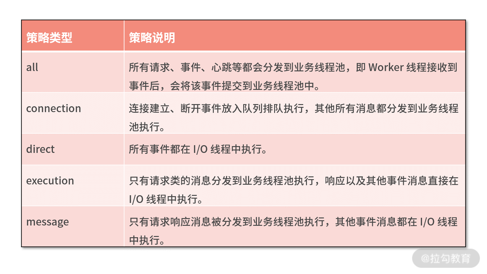

## 负载均衡

在分布式系统中，服务提供者和服务消费者都会有多台节点，如何保证服务提供者所有节点的负载均衡呢？客户端在发起调用之前，需要感知有多少服务端节点可用，然后从中选取一个进行调用。客户端需要拿到服务端节点的状态信息，并根据不同的策略实现负载均衡算法。负载均衡策略是影响 RPC 框架吞吐量很重要的一个因素，下面我们介绍几种最常用的负载均衡策略。

*   **Round-Robin 轮询**。Round-Robin 是最简单有效的负载均衡策略，并没有考虑服务端节点的实际负载水平，而是依次轮询服务端节点。
*   **Weighted Round-Robin 权重轮询**。对不同负载水平的服务端节点增加权重系数，这样可以通过权重系数降低性能较差或者配置较低的节点流量。权重系数可以根据服务端负载水平实时进行调整，使集群达到相对均衡的状态。
*   **Least Connections 最少连接数**。客户端根据服务端节点当前的连接数进行负载均衡，客户端会选择连接数最少的一台服务器进行调用。Least Connections 策略只是服务端其中一种维度，我们可以演化出最少请求数、CPU 利用率最低等其他维度的负载均衡方案。
*   **Consistent Hash 一致性 Hash**。目前主流推荐的负载均衡策略，Consistent Hash 是一种特殊的 Hash 算法，在服务端节点扩容或者下线时，尽可能保证客户端请求还是固定分配到同一台服务器节点。Consistent Hash 算法是采用哈希环来实现的，通过 Hash 函数将对象和服务器节点放置在哈希环上，一般来说服务器可以选择 IP + Port 进行 Hash，然后为对象选择对应的服务器节点，在哈希环中顺时针查找距离对象 Hash 值最近的服务器节点。

此外，负载均衡算法可以是多种多样的，客户端可以记录例如健康状态、连接数、内存、CPU、Load 等更加丰富的信息，根据综合因素进行更好地决策。

## 动态代理

RPC 框架怎么做到像调用本地接口一样调用远端服务呢？这必须依赖动态代理来实现。需要创建一个代理对象，在代理对象中完成数据报文编码，然后发起调用发送数据给服务提供方，以此屏蔽 RPC 框架的调用细节。因为代理类是在运行时生成的，所以代理类的生成速度、生成的字节码大小都会影响 RPC 框架整体的性能和资源消耗，所以需要慎重选择动态代理的实现方案。动态代理比较主流的实现方案有以下几种：JDK 动态代理、Cglib、Javassist、ASM、Byte Buddy，我们简单做一个对比和介绍。

*   **JDK 动态代理**。在运行时可以动态创建代理类，但是 JDK 动态代理的功能比较局限，代理对象必须实现一个接口，否则抛出异常。因为代理类会继承 Proxy 类，然而 Java 是不支持多重继承的，只能通过接口实现多态。JDK 动态代理所生成的代理类是接口的实现类，不能代理接口中不存在的方法。JDK 动态代理是通过反射调用的形式代理类中的方法，比直接调用肯定是性能要慢的。
*   **Cglib 动态代理**。Cglib 是基于 ASM 字节码生成框架实现的，通过字节码技术生成的代理类，所以代理类的类型是不受限制的。而且 Cglib 生成的代理类是继承于被代理类，所以可以提供更加灵活的功能。在代理方法方面，Cglib 是有优势的，它采用了 FastClass 机制，为代理类和被代理类各自创建一个 Class，这个 Class 会为代理类和被代理类的方法分配 index 索引，FastClass 就可以通过 index 直接定位要调用的方法，并直接调用，这是一种空间换时间的优化思路。
*   **Javassist 和 ASM**。二者都是 Java 字节码操作框架，使用起来难度较大，需要开发者对 Class 文件结构以及 JVM 都有所了解，但是它们都比反射的性能要高。Byte Buddy 也是一个字节码生成和操作的类库，Byte Buddy 功能强大，相比于 Javassist 和 ASM，Byte Buddy 提供了更加便捷的 API，用于创建和修改 Java 类，无须理解字节码的格式，而且 Byte Buddy 更加轻量，性能更好。

至此，我们已经对实现 RPC 框架的几个核心要点做了一个大致的介绍，关于通信协议、负载均衡、动态代理在 RPC 框架中如何实现，我们后面会有专门的实践课对其进行详细介绍，本节课我们先有个大概的印象即可。

## 总结

如果你可以完成上述 RPC 框架的核心功能，那么一个简易的 RPC 框架的 MVP 原型就完成了，这也是我们实践课的目标。当然实现一个高性能高可靠的 RPC 框架并不容易，需要考虑的问题远不止如此，例如异常重试、服务级别线程池隔离、熔断限流、集群容错、优雅下线等等，在实践课最后我会为你讲解 RPC 框架进阶的拓展内容。

24 服务发布与订阅：搭建生产者和消费者的基础框架
=========================

从本节课开始，我们开始动手开发一个完整的 RPC 框架原型，通过整个实践课程的学习，你不仅可以熟悉 RPC 的实现原理，而且可以对之前 Netty 基础知识加深理解，同样在工作中也可以学以致用。

我会从服务发布与订阅、远程通信、服务治理、动态代理四个方面详细地介绍一个通用 RPC 框架的实现过程，相信你只要坚持完成本次实践课，之后你再独立完成工作中项目研发会变得更加容易。你是不是已经迫不及待地想动手了呢？让我们一起开始吧！

> 源码参考地址：[mini-rpc](https://github.com/wangyapu/mini-rpc)

## 环境搭建

工欲善其事必先利其器，首先我们需要搭建我们的开发环境，这是每个程序员的必备技能。以下是我的本机环境清单，仅供参考。

*   操作系统：MacOS Big Sur，11.0.1。
*   集成开发工具：IntelliJ IDEA 2020.3，当然你也可以选择 eclipse。
*   项目技术栈：SpringBoot 2.1.12.RELEASE + JDK 1.8.0_221 + Netty 4.1.42.Final。
*   项目依赖管理工具：Maven 3.5.4，你可以独立安装 Maven 或者使用 IDEA 的集成版，独立安装的 Maven 需要配置 MAVEN_HOME 和 PATH 环境变量。
*   注册中心：Zookeeeper 3.4.14，需要特别注意 Zookeeeper 和 Apache Curator 一定要搭配使用，Zookeeper 3.4.x 版本，Apache Curator 只有 2.x.x 才能支持。

## 项目结构

在动手开发项目之前，我们需要对项目结构有清晰的构思。根据上节课介绍的 RPC 框架设计架构，我们可以将项目结构划分为以下几个模块。


其中每个模块都是什么角色呢？下面我们一一进行介绍。

*   rpc-provider，服务提供者。负责发布 RPC 服务，接收和处理 RPC 请求。
*   rpc-consumer，服务消费者。使用动态代理发起 RPC 远程调用，帮助使用者来屏蔽底层网络通信的细节。
*   rpc-registry，注册中心模块。提供服务注册、服务发现、负载均衡的基本功能。
*   rpc-protocol，网络通信模块。包含 RPC 协议的编解码器、序列化和反序列化工具等。
*   rpc-core，基础类库。提供通用的工具类以及模型定义，例如 RPC 请求和响应类、RPC 服务元数据类等。
*   rpc-facade，RPC 服务接口。包含服务提供者需要对外暴露的接口，本模块主要用于模拟真实 RPC 调用的测试。

如下图所示，首先我们需要清楚各个模块之间的依赖关系，才能帮助我们更好地梳理 Maven 的 pom 定义。rpc-core 是最基础的类库，所以大部分模块都依赖它。rpc-consumer 用于发起 RPC 调用。rpc-provider 负责处理 RPC 请求，如果不知道远程服务的地址，那么一切都是空谈了，所以两者都需要依赖 rpc-registry 提供的服务发现和服务注册的能力。

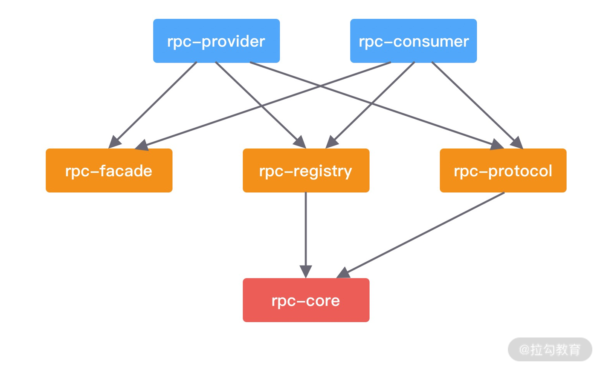

## 如何使用

我们不着急开始动手实现代码细节，而是考虑一个问题，最终实现的 RPC 框架应该让用户如何使用呢？这就跟我们学习一门技术一样，你不可能刚开始就直接陷入源码的细节，而是先熟悉它的基本使用方式，然后找到关键的切入点再深入研究实现原理，会起到事半功倍的效果。

首先我们看下 RPC 框架想要实现的效果，如下所示：

```java
// rpc-facade # HelloFacade
public interface HelloFacade {
    String hello(String name);
}
// rpc-provider # HelloFacadeImpl
@RpcService(serviceInterface = HelloFacade.class, serviceVersion = "1.0.0")
public class HelloFacadeImpl implements HelloFacade {
    @Override
    public String hello(String name) {
        return "hello" + name;
    }
}
// rpc-consumer # HelloController
@RestController
public class HelloController {
    @RpcReference(serviceVersion = "1.0.0", timeout = 3000)
    private HelloFacade helloFacade;
    @RequestMapping(value = "/hello", method = RequestMethod.GET)
    public String sayHello() {
        return helloFacade.hello("mini rpc");
    }
}
```

为了方便在本地模拟客户端和服务端，我会把 rpc-provider 和 rpc-consumer 两个模块能够做到独立启动。rpc-provider 通过 @RpcService 注解暴露 RPC 服务 HelloFacade，rpc-consumer 通过 @RpcReference 注解引用 HelloFacade 服务并发起调用，基本与我们常用的 RPC 框架使用方式保持一致。

梳理清楚项目结构和整体实现思路之后，下面我们从服务提供者开始入手开发。

## 服务提供者发布服务

服务提供者 rpc-provider 需要完成哪些事情呢？主要分为四个核心流程：

*   服务提供者启动服务，并暴露服务端口；
*   启动时扫描需要对外发布的服务，并将服务元数据信息发布到注册中心；
*   接收 RPC 请求，解码后得到请求消息；
*   提交请求至自定义线程池进行处理，并将处理结果写回客户端。

本节课我们先实现 rpc-provider 模块前面两个流程。

### 服务提供者启动

服务提供者启动的配置方式基本是固定模式，也是从引导器 Bootstrap 开始入手，你可以复习下基础课程《03 引导器作用：客户端和服务端启动都要做些什么？》。我们首先看下服务提供者的启动实现，代码如下所示：

```java
private void startRpcServer() throws Exception {
    this.serverAddress = InetAddress.getLocalHost().getHostAddress();
    EventLoopGroup boss = new NioEventLoopGroup();
    EventLoopGroup worker = new NioEventLoopGroup();
    try {
        ServerBootstrap bootstrap = new ServerBootstrap();
        bootstrap.group(boss, worker)
                .channel(NioServerSocketChannel.class)
                .childHandler(new ChannelInitializer<SocketChannel>() {
                    @Override
                    protected void initChannel(SocketChannel socketChannel) throws Exception {

                    }
                })
                .childOption(ChannelOption.SO_KEEPALIVE, true);
        ChannelFuture channelFuture = bootstrap.bind(this.serverAddress, this.serverPort).sync();
        log.info("server addr {} started on port {}", this.serverAddress, this.serverPort);
        channelFuture.channel().closeFuture().sync();
    } finally {
        boss.shutdownGracefully();
        worker.shutdownGracefully();
    }
}
```

服务提供者采用的是主从 Reactor 线程模型，启动过程包括配置线程池、Channel 初始化、端口绑定三个步骤，我们暂时先不关注 Channel 初始化中自定义的业务处理器 Handler 是如何设计和实现的。

对于 RPC 框架而言，可扩展性是比较重要的一方面。接下来我们看下如何借助 Spring Boot 的能力将服务提供者启动所依赖的参数做成可配置化。

### 参数配置

服务提供者启动需要配置一些参数，我们不应该把这些参数固定在代码里，而是以命令行参数或者配置文件的方式进行输入。我们可以使用 Spring Boot 的 @ConfigurationProperties 注解很轻松地实现配置项的加载，并且可以把相同前缀类型的配置项自动封装成实体类。接下来我们为服务提供者提供参数映射的对象：

```java
@Data
@ConfigurationProperties(prefix = "rpc")
public class RpcProperties {
    private int servicePort;
    private String registryAddr;
    private String registryType;
}
```

我们一共提取了三个参数，分别为服务暴露的端口 servicePort、注册中心的地址 registryAddr 和注册中心的类型 registryType。@ConfigurationProperties 注解最经典的使用方式就是通过 prefix 属性指定配置参数的前缀，默认会与全局配置文件 application.properties 或者 application.yml 中的参数进行一一绑定。如果你想自定义一个配置文件，可以通过 @PropertySource 注解指定配置文件的位置。下面我们在 rpc-provider 模块的 resources 目录下创建全局配置文件 application.properties，并配置以上三个参数：

```
rpc.servicePort=2781
rpc.registryType=ZOOKEEPER
rpc.registryAddr=127.0.0.1:2181
```

application.properties 配置文件中的属性必须和实体类的成员变量是一一对应的，可以采用以下常用的命名规则，例如驼峰命名 rpc.servicePort=2781；或者虚线 - 分割的方式 rpc.service-port=2781；以及大写加下划线的形式 RPC\_Service\_Port，建议在环境变量中使用。@ConfigurationProperties 注解还可以支持更多复杂结构的配置，并且可以 Validation 功能进行参数校验，如果你有兴趣可以课后再进行深入研究。

有了 RpcProperties 实体类，我们接下来应该如何使用呢？如果只配置 @ConfigurationProperties 注解，Spring 容器并不能获取配置文件的内容并映射为对象，这时 @EnableConfigurationProperties 注解就登场了。@EnableConfigurationProperties 注解的作用就是将声明 @ConfigurationProperties 注解的类注入为 Spring 容器中的 Bean。具体用法如下：

```java
@Configuration
@EnableConfigurationProperties(RpcProperties.class)
public class RpcProviderAutoConfiguration {
    @Resource
    private RpcProperties rpcProperties;
    @Bean
    public RpcProvider init() throws Exception {
        RegistryType type = RegistryType.valueOf(rpcProperties.getRegistryType());
        RegistryService serviceRegistry = RegistryFactory.getInstance(rpcProperties.getRegistryAddr(), type);
        return new RpcProvider(rpcProperties.getServicePort(), serviceRegistry);
    }
}
```

我们通过 @EnableConfigurationProperties 注解使得 RpcProperties 生效，并通过 @Configuration 和 @Bean 注解自定义了 RpcProvider 的生成方式。@Configuration 主要用于定义配置类，配置类内部可以包含多个 @Bean 注解的方法，可以替换传统 XML 的定义方式。被 @Bean 注解的方法会返回一个自定义的对象，@Bean 注解会将这个对象注册为 Bean 并装配到 Spring 容器中，@Bean 比 @Component 注解的自定义功能更强。

至此，我们服务提供者启动的准备工作就完成了，下面你需要添加 Spring Boot 的 main 方法，如下所示，然后尝试启动下 rpc-provider 模块吧。

```java
@EnableConfigurationProperties
@SpringBootApplication
public class RpcProviderApplication {
    public static void main(String[] args) {
        SpringApplication.run(RpcProviderApplication.class, args);
    }
}
```

### 发布服务

在服务提供者启动时，我们需要思考一个核心问题，服务提供者需要将服务发布到注册中心，怎么知道哪些服务需要发布呢？服务提供者需要定义需要发布服务类型、服务版本等属性，主流的 RPC 框架都采用 XML 文件或者注解的方式进行定义。以注解的方式暴露服务现在最为常用，省去了很多烦琐的 XML 配置过程。例如 Dubbo 框架中使用 @Service 注解替代 [dubbo:service](dubbo:service) 的定义方式，服务消费者则使用 @Reference 注解替代 [dubbo:reference](dubbo:reference)。接下来我们看看作为服务提供者，如何通过注解暴露服务，首先给出我们自定义的 @RpcService 注解定义：

```java
@Retention(RetentionPolicy.RUNTIME)
@Target(ElementType.TYPE)
@Component
public @interface RpcService {
    Class<?> serviceInterface() default Object.class;
    String serviceVersion() default "1.0";
}
```

@RpcService 提供了两个必不可少的属性：服务类型 serviceInterface 和服务版本 serviceVersion，服务消费者必须指定完全一样的属性才能正确调用。有了 @RpcService 注解之后，我们就可以在服务实现类上使用它，@RpcService 注解本质上就是 @Component，可以将服务实现类注册成 Spring 容器所管理的 Bean，那么 serviceInterface、serviceVersion 的属性值怎么才能和 Bean 关联起来呢？这就需要我们就 Bean 的生命周期以及 Bean 的可扩展点有所了解。

Spring 的 BeanPostProcessor 接口给提供了对 Bean 进行再加工的扩展点，BeanPostProcessor 常用于处理自定义注解。自定义的 Bean 可以通过实现 BeanPostProcessor 接口，在 Bean 实例化的前后加入自定义的逻辑处理。如下所示，我们通过 RpcProvider 实现 BeanPostProcessor 接口，来实现对 声明 @RpcService 注解服务的自定义处理。

```java
public class RpcProvider implements InitializingBean, BeanPostProcessor {
    // 省略其他代码

    private final Map<String, Object> rpcServiceMap = new HashMap<>();
    @Override
    public Object postProcessAfterInitialization(Object bean, String beanName) throws BeansException {
        RpcService rpcService = bean.getClass().getAnnotation(RpcService.class);
        if (rpcService != null) {
            String serviceName = rpcService.serviceInterface().getName();
            String serviceVersion = rpcService.serviceVersion();
            try {
                ServiceMeta serviceMeta = new ServiceMeta();
                serviceMeta.setServiceAddr(serverAddress);
                serviceMeta.setServicePort(serverPort);
                serviceMeta.setServiceName(serviceName);
                serviceMeta.setServiceVersion(serviceVersion);
                // TODO 发布服务元数据至注册中心
                rpcServiceMap.put(RpcServiceHelper.buildServiceKey(serviceMeta.getServiceName(), serviceMeta.getServiceVersion()), bean);
            } catch (Exception e) {
                log.error("failed to register service {}#{}", serviceName, serviceVersion, e);
            }
        }
        return bean;
    }
}
```

RpcProvider 重写了 BeanPostProcessor 接口的 postProcessAfterInitialization 方法，对所有初始化完成后的 Bean 进行扫描。如果 Bean 包含 @RpcService 注解，那么通过注解读取服务的元数据信息并构造出 ServiceMeta 对象，接下来准备将服务的元数据信息发布至注册中心，注册中心的实现我们先暂且跳过，后面会有单独一节课进行讲解注册中心的实现。此外，RpcProvider 还维护了一个 rpcServiceMap，存放服务初始化后所对应的 Bean，rpcServiceMap 起到了缓存的角色，在处理 RPC 请求时可以直接通过 rpcServiceMap 拿到对应的服务进行调用。

明白服务提供者如何处理 @RpcService 注解的原理之后，接下来再实现服务消费者就容易很多了。

## 服务消费者订阅服务

与服务提供者不同的是，服务消费者并不是一个常驻的服务，每次发起 RPC 调用时它才会去选择向哪个远端服务发送数据。所以服务消费者的实现要复杂一些，对于声明 @RpcReference 注解的成员变量，我们需要构造出一个可以真正进行 RPC 调用的 Bean，然后将它注册到 Spring 的容器中。

首先我们看下 @RpcReference 注解的定义，代码如下所示：

```java
@Retention(RetentionPolicy.RUNTIME)
@Target(ElementType.FIELD)
@Autowired
public @interface RpcReference {
    String serviceVersion() default "1.0";
    String registryType() default "ZOOKEEPER";
    String registryAddress() default "127.0.0.1:2181";
    long timeout() default 5000;
}
```

@RpcReference 注解提供了服务版本 serviceVersion、注册中心类型 registryType、注册中心地址 registryAddress 和超时时间 timeout 四个属性，接下来我们需要使用这些属性构造出一个自定义的 Bean，并对该 Bean 执行的所有方法进行拦截。

Spring 的 FactoryBean 接口可以帮助我们实现自定义的 Bean，FactoryBean 是一种特种的工厂 Bean，通过 getObject() 方法返回对象，而并不是 FactoryBean 本身。

```java
public class RpcReferenceBean implements FactoryBean<Object> {
    private Class<?> interfaceClass;
    private String serviceVersion;
    private String registryType;
    private String registryAddr;
    private long timeout;
    private Object object;
    @Override
    public Object getObject() throws Exception {
        return object;
    }
    @Override
    public Class<?> getObjectType() {
        return interfaceClass;
    }
    public void init() throws Exception {
        // TODO 生成动态代理对象并赋值给 object
    }
    public void setInterfaceClass(Class<?> interfaceClass) {
        this.interfaceClass = interfaceClass;
    }
    public void setServiceVersion(String serviceVersion) {
        this.serviceVersion = serviceVersion;
    }
    public void setRegistryType(String registryType) {
        this.registryType = registryType;
    }
    public void setRegistryAddr(String registryAddr) {
        this.registryAddr = registryAddr;
    }
    public void setTimeout(long timeout) {
        this.timeout = timeout;
    }
}
```

在 RpcReferenceBean 中 init() 方法被我标注了 TODO，此处需要实现动态代理对象，并通过代理对象完成 RPC 调用。对于使用者来说只是通过 @RpcReference 订阅了服务，并不感知底层调用的细节。对于如何实现 RPC 通信、服务寻址等，都是在动态代理类中完成的，在后面我们会有专门的一节课详细讲解动态代理的实现。

有了 @RpcReference 注解和 RpcReferenceBean 之后，我们可以使用 Spring 的扩展点 BeanFactoryPostProcessor 对 Bean 的定义进行修改。上文中服务提供者使用的是 BeanPostProcessor，BeanFactoryPostProcessor 和 BeanPostProcessor 都是 Spring 的核心扩展点，它们之间有什么区别呢？BeanFactoryPostProcessor 是 Spring 容器加载 Bean 的定义之后以及 Bean 实例化之前执行，所以 BeanFactoryPostProcessor 可以在 Bean 实例化之前获取 Bean 的配置元数据，并允许用户对其修改。而 BeanPostProcessor 是在 Bean 初始化前后执行，它并不能修改 Bean 的配置信息。

现在我们需要对声明 @RpcReference 注解的成员变量构造出 RpcReferenceBean，所以需要实现 BeanFactoryPostProcessor 修改 Bean 的定义，具体实现如下所示。

```java
@Component
@Slf4j
public class RpcConsumerPostProcessor implements ApplicationContextAware, BeanClassLoaderAware, BeanFactoryPostProcessor {
    private ApplicationContext context;
    private ClassLoader classLoader;
    private final Map<String, BeanDefinition> rpcRefBeanDefinitions = new LinkedHashMap<>();
    @Override
    public void setApplicationContext(ApplicationContext applicationContext) throws BeansException {
        this.context = applicationContext;
    }
    @Override
    public void setBeanClassLoader(ClassLoader classLoader) {
        this.classLoader = classLoader;
    }
    @Override
    public void postProcessBeanFactory(ConfigurableListableBeanFactory beanFactory) throws BeansException {
        for (String beanDefinitionName : beanFactory.getBeanDefinitionNames()) {
            BeanDefinition beanDefinition = beanFactory.getBeanDefinition(beanDefinitionName);
            String beanClassName = beanDefinition.getBeanClassName();
            if (beanClassName != null) {
                Class<?> clazz = ClassUtils.resolveClassName(beanClassName, this.classLoader);
                ReflectionUtils.doWithFields(clazz, this::parseRpcReference);
            }
        }
        BeanDefinitionRegistry registry = (BeanDefinitionRegistry) beanFactory;
        this.rpcRefBeanDefinitions.forEach((beanName, beanDefinition) -> {
            if (context.containsBean(beanName)) {
                throw new IllegalArgumentException("spring context already has a bean named " + beanName);
            }
            registry.registerBeanDefinition(beanName, rpcRefBeanDefinitions.get(beanName));
            log.info("registered RpcReferenceBean {} success.", beanName);
        });
    }
    private void parseRpcReference(Field field) {
        RpcReference annotation = AnnotationUtils.getAnnotation(field, RpcReference.class);
        if (annotation != null) {
            BeanDefinitionBuilder builder = BeanDefinitionBuilder.genericBeanDefinition(RpcReferenceBean.class);
            builder.setInitMethodName(RpcConstants.INIT_METHOD_NAME);
            builder.addPropertyValue("interfaceClass", field.getType());
            builder.addPropertyValue("serviceVersion", annotation.serviceVersion());
            builder.addPropertyValue("registryType", annotation.registryType());
            builder.addPropertyValue("registryAddr", annotation.registryAddress());
            builder.addPropertyValue("timeout", annotation.timeout());
            BeanDefinition beanDefinition = builder.getBeanDefinition();
            rpcRefBeanDefinitions.put(field.getName(), beanDefinition);
        }
    }
}
```

RpcConsumerPostProcessor 类中重写了 BeanFactoryPostProcessor 的 postProcessBeanFactory 方法，从 beanFactory 中获取所有 Bean 的定义信息，然后分别对每个 Bean 的所有 field 进行检测。如果 field 被声明了 @RpcReference 注解，通过 BeanDefinitionBuilder 构造 RpcReferenceBean 的定义，并为 RpcReferenceBean 的成员变量赋值，包括服务类型 interfaceClass、服务版本 serviceVersion、注册中心类型 registryType、注册中心地址 registryAddr 以及超时时间 timeout。构造完 RpcReferenceBean 的定义之后，会将RpcReferenceBean 的 BeanDefinition 重新注册到 Spring 容器中。

至此，我们已经将服务提供者服务消费者的基本框架搭建出来了，并且着重介绍了服务提供者使用 @RpcService 注解是如何发布服务的，服务消费者相应需要一个能够注入服务接口的注解 @RpcReference，被 @RpcReference 修饰的成员变量都会被构造成 RpcReferenceBean，并为它生成动态代理类，后面我们再继续深入介绍。

## 总结

本节课我们介绍了服务发布与订阅的实现原理，搭建出了服务提供者和服务消费者的基本框架。可以看出，如果采用 Java 语言实现 RPC 框架核心的服务发布与订阅的核心逻辑，需要你具备较为扎实的 Spring 框架基础。了解 Spring 重要的扩展接口，可以帮助我们开发出更优雅的代码。

留两个课后作业：

1.  本节课我留下了几处待完成的 TODO，你可以独立思考下，从这些 TODO 入手，是否可以构思出整个 RPC 框架的脉络呢？
2.  复习 Netty 自定义处理器 ChannelHandler 和编解码的基础知识，下节课我们将完成 RPC 框架的网络通信部分。

25 远程通信：通信协议设计以及编解码的实现
======================

上节课我们搭建了服务提供者和服务消费者的基本框架，现在我们可以建立两个模块之间的通信机制了。本节课我们通过向 ChannelPipeline 添加自定义的业务处理器，来完成 RPC 框架的远程通信机制。需要实现的主要功能如下：

*   服务消费者实现协议编码，向服务提供者发送调用数据。
*   服务提供者收到数据后解码，然后向服务消费者发送响应数据，暂时忽略 RPC 请求是如何被调用的。
*   服务消费者收到响应数据后成功返回。

> 源码参考地址：[mini-rpc](https://github.com/wangyapu/mini-rpc)

## RPC 通信方案设计

结合本节课的目标，接下来我们对 RPC 请求调用和结果响应两个过程分别进行详细拆解分析。首先看下 RPC 请求调用的过程，如下图所示。


RPC 请求的过程对于服务消费者来说是出站操作，对于服务提供者来说是入站操作。数据发送前，服务消费者将 RPC 请求信息封装成 MiniRpcProtocol 对象，然后通过编码器 MiniRpcEncoder 进行二进制编码，最后直接向发送至远端即可。服务提供者收到请求数据后，将二进制数据交给解码器 MiniRpcDecoder，解码后再次生成 MiniRpcProtocol 对象，然后传递给 RpcRequestHandler 执行真正的 RPC 请求调用。

我们暂时忽略 RpcRequestHandler 是如何执行 RPC 请求调用的，接下来我们继续分析 RpcRequestHandler 处理成功后是如何向服务消费者返回响应结果的，如下图所示：


与 RPC 请求过程相反，是由服务提供者将响应结果封装成 MiniRpcProtocol 对象，然后通过 MiniRpcEncoder 编码发送给服务消费者。服务消费者对响应结果进行解码，因为 RPC 请求是高并发的，所以需要 RpcRequestHandler 根据响应结果找到对应的请求，最后将响应结果返回。

综合 RPC 请求调用和结果响应的处理过程来看，编码器 MiniRpcEncoder、解码器 MiniRpcDecoder 以及通信协议对象 MiniRpcProtocol 都可以设计成复用的，最终服务消费者和服务提供者的 ChannelPipeline 结构如下图所示。


由此可见，在实现 Netty 网络通信模块时，先画图分析 ChannelHandler 的处理流程是非常有帮助的。

## 自定义 RPC 通信协议

协议是服务消费者和服务提供者之间通信的基础，主流的 RPC 框架都会自定义通信协议，相比于 HTTP、HTTPS、JSON 等通用的协议，自定义协议可以实现更好的性能、扩展性以及安全性。在《接头暗语：利用 Netty 如何实现自定义协议通信》课程中，我们学习了设计一个完备的通信协议需要考虑哪些因素，同时结合 RPC 请求调用与结果响应的场景，我们设计了一个简易版的 RPC 自定义协议，如下所示：

```
+---------------------------------------------------------------+
| 魔数 2byte | 协议版本号 1byte | 序列化算法 1byte | 报文类型 1byte  |
+---------------------------------------------------------------+
| 状态 1byte |        消息 ID 8byte     |      数据长度 4byte     |
+---------------------------------------------------------------+
|                   数据内容 （长度不定）                          |
+---------------------------------------------------------------+
```

我们把协议分为协议头 Header 和协议体 Body 两个部分。协议头 Header 包含魔数、协议版本号、序列化算法、报文类型、状态、消息 ID、数据长度，协议体 Body 只包含数据内容部分，数据内容的长度是不固定的。RPC 请求和响应都可以使用该协议进行通信，对应协议实体类的定义如下所示：

```java
@Data
public class MiniRpcProtocol<T> implements Serializable {
    private MsgHeader header; // 协议头
    private T body; // 协议体
}
@Data
public class MsgHeader implements Serializable {
    private short magic; // 魔数
    private byte version; // 协议版本号
    private byte serialization; // 序列化算法
    private byte msgType; // 报文类型
    private byte status; // 状态
    private long requestId; // 消息 ID
    private int msgLen; // 数据长度
}
```

在 RPC 请求调用的场景下，MiniRpcProtocol 中泛型 T 对应的 MiniRpcRequest 类型，MiniRpcRequest 主要包含 RPC 远程调用需要的必要参数，定义如下所示。

```java
@Data
public class MiniRpcRequest implements Serializable {
    private String serviceVersion; // 服务版本
    private String className; // 服务接口名
    private String methodName; // 服务方法名
    private Object[] params; // 方法参数列表
    private Class<?>[] parameterTypes; // 方法参数类型列表
}
```

在 RPC 结果响应的场景下，MiniRpcProtocol 中泛型 T 对应的 MiniRpcResponse 类型，MiniRpcResponse 实体类的定义如下所示。此外，响应结果是否成功可以使用 MsgHeader 中的 status 字段表示，0 表示成功，非 0 表示失败。MiniRpcResponse 中 data 表示成功状态下返回的 RPC 请求结果，message 表示 RPC 请求调用失败的错误信息。

```java
@Data
public class MiniRpcResponse implements Serializable {
    private Object data; // 请求结果
    private String message; // 错误信息
}
```

设计完 RPC 自定义协议之后，我们接下来再来解决 MiniRpcRequest 和 MiniRpcResponse 如何进行编码的问题。

## 序列化选型

MiniRpcRequest 和 MiniRpcResponse 实体类表示的协议体内容都是不确定具体长度的，所以我们一般会选用通用且高效的序列化算法将其转换成二进制数据，这样可以有效减少网络传输的带宽，提升 RPC 框架的整体性能。目前比较常用的序列化算法包括 Json、Kryo、Hessian、Protobuf 等，这些第三方序列化算法都比 Java 原生的序列化操作都更加高效。

首先我们定义了一个通用的序列化接口 RpcSerialization，所有序列化算法扩展都必须实现该接口，RpcSerialization 接口分别提供了序列化 serialize() 和反序列化 deserialize() 方法，如下所示：

```java
public interface RpcSerialization {
     <T> byte[] serialize(T obj) throws IOException;
    <T> T deserialize(byte[] data, Class<T> clz) throws IOException;
}
```

接下来我们为 RpcSerialization 提供了 HessianSerialization 和 JsonSerialization 两种类型的实现类。以 HessianSerialization 为例，实现逻辑如下：

```java
@Component
@Slf4j
public class HessianSerialization implements RpcSerialization {
    @Override
    public <T> byte[] serialize(T object) {
        if (object == null) {
            throw new NullPointerException();
        }
        byte[] results;
        HessianSerializerOutput hessianOutput;
        try (ByteArrayOutputStream os = new ByteArrayOutputStream()) {
            hessianOutput = new HessianSerializerOutput(os);
            hessianOutput.writeObject(object);
            hessianOutput.flush();
            results = os.toByteArray();
        } catch (Exception e) {
            throw new SerializationException(e);
        }
        return results;
    }
    @SuppressWarnings("unchecked")
    @Override
    public <T> T deserialize(byte[] bytes, Class<T> clz) {
        if (bytes == null) {
            throw new NullPointerException();
        }
        T result;
        try (ByteArrayInputStream is = new ByteArrayInputStream(bytes)) {
            HessianSerializerInput hessianInput = new HessianSerializerInput(is);
            result = (T) hessianInput.readObject(clz);
        } catch (Exception e) {
            throw new SerializationException(e);
        }
        return result;
    }
}
```

为了能够支持不同序列化算法，我们采用工厂模式来实现不同序列化算法之间的切换，使用相同的序列化接口指向不同的序列化算法。对于使用者来说只需要知道序列化算法的类型即可，不用关心底层序列化是如何实现的。具体实现如下：

```java
public class SerializationFactory {
    public static RpcSerialization getRpcSerialization(byte serializationType) {
        SerializationTypeEnum typeEnum = SerializationTypeEnum.findByType(serializationType);
        switch (typeEnum) {
            case HESSIAN:
                return new HessianSerialization();
            case JSON:
                return new JsonSerialization();
            default:
                throw new IllegalArgumentException("serialization type is illegal, " + serializationType);
        }
    }
}
```

有了以上基础知识的储备，接下来我们就可以开始实现自定义的处理器了。

## 协议编码实现

在《接头暗语：利用 Netty 如何实现自定义协议通信》课程中，我们同样介绍了如何使用 Netty 实现自定义的通信协议。Netty 提供了两个最为常用的编解码抽象基类 MessageToByteEncoder 和 ByteToMessageDecoder，帮助我们很方便地扩展实现自定义协议。

我们接下来要完成的编码器 MiniRpcEncoder 需要继承 MessageToByteEncoder，并重写 encode() 方法，具体实现如下所示：

```java
public class MiniRpcEncoder extends MessageToByteEncoder<MiniRpcProtocol<Object>> {
    @Override
    protected void encode(ChannelHandlerContext ctx, MiniRpcProtocol<Object> msg, ByteBuf byteBuf) throws Exception {
        MsgHeader header = msg.getHeader();
        byteBuf.writeShort(header.getMagic());
        byteBuf.writeByte(header.getVersion());
        byteBuf.writeByte(header.getSerialization());
        byteBuf.writeByte(header.getMsgType());
        byteBuf.writeByte(header.getStatus());
        byteBuf.writeLong(header.getRequestId());
        RpcSerialization rpcSerialization = SerializationFactory.getRpcSerialization(header.getSerialization());
        byte[] data = rpcSerialization.serialize(msg.getBody());
        byteBuf.writeInt(data.length);
        byteBuf.writeBytes(data);
    }
}
```

编码逻辑比较简单，在服务消费者或者服务提供者调用 writeAndFlush() 将数据写给对方前，都已经封装成 MiniRpcRequest 或者 MiniRpcResponse，所以可以采用 MiniRpcProtocol`<Object>` 作为 MiniRpcEncoder 编码器能够支持的编码类型。

## 协议解码实现

解码器 MiniRpcDecoder 需要继承 ByteToMessageDecoder，并重写 decode() 方法，具体实现如下所示：

```java
public class MiniRpcDecoder extends ByteToMessageDecoder {
    @Override
    public final void decode(ChannelHandlerContext ctx, ByteBuf in, List<Object> out) throws Exception {
        if (in.readableBytes() < ProtocolConstants.HEADER_TOTAL_LEN) {
            return;
        }
        in.markReaderIndex();
        short magic = in.readShort();
        if (magic != ProtocolConstants.MAGIC) {
            throw new IllegalArgumentException("magic number is illegal, " + magic);
        }
        byte version = in.readByte();
        byte serializeType = in.readByte();
        byte msgType = in.readByte();
        byte status = in.readByte();
        long requestId = in.readLong();
        int dataLength = in.readInt();
        if (in.readableBytes() < dataLength) {
            in.resetReaderIndex();
            return;
        }
        byte[] data = new byte[dataLength];
        in.readBytes(data);
        MsgType msgTypeEnum = MsgType.findByType(msgType);
        if (msgTypeEnum == null) {
            return;
        }
        MsgHeader header = new MsgHeader();
        header.setMagic(magic);
        header.setVersion(version);
        header.setSerialization(serializeType);
        header.setStatus(status);
        header.setRequestId(requestId);
        header.setMsgType(msgType);
        header.setMsgLen(dataLength);
        RpcSerialization rpcSerialization = SerializationFactory.getRpcSerialization(serializeType);
        switch (msgTypeEnum) {
            case REQUEST:
                MiniRpcRequest request = rpcSerialization.deserialize(data, MiniRpcRequest.class);
                if (request != null) {
                    MiniRpcProtocol<MiniRpcRequest> protocol = new MiniRpcProtocol<>();
                    protocol.setHeader(header);
                    protocol.setBody(request);
                    out.add(protocol);
                }
            case RESPONSE:
                MiniRpcResponse response = rpcSerialization.deserialize(data, MiniRpcResponse.class);
                if (response != null) {
                        MiniRpcProtocol<MiniRpcResponse> protocol = new MiniRpcProtocol<>();
                    protocol.setHeader(header);
                    protocol.setBody(response);
                    out.add(protocol);
                }
            case HEARTBEAT:
                // TODO
                break;
        }
    }
}
```

解码器 MiniRpcDecoder 相比于编码器 MiniRpcEncoder 要复杂很多，MiniRpcDecoder 的目标是将字节流数据解码为消息对象，并传递给下一个 Inbound 处理器。整个 MiniRpcDecoder 解码过程有几个要点要特别注意：

*   只有当 ByteBuf 中内容大于协议头 Header 的固定的 18 字节时，才开始读取数据。
*   即使已经可以完整读取出协议头 Header，但是协议体 Body 有可能还未就绪。所以在刚开始读取数据时，需要使用 markReaderIndex() 方法标记读指针位置，当 ByteBuf 中可读字节长度小于协议体 Body 的长度时，再使用 resetReaderIndex() 还原读指针位置，说明现在 ByteBuf 中可读字节还不够一个完整的数据包。
*   根据不同的报文类型 MsgType，需要反序列化出不同的协议体对象。在 RPC 请求调用的场景下，服务提供者需要将协议体内容反序列化成 MiniRpcRequest 对象；在 RPC 结果响应的场景下，服务消费者需要将协议体内容反序列化成 MiniRpcResponse 对象。

## 请求处理与响应

在 RPC 请求调用的场景下，服务提供者的 MiniRpcDecoder 编码器将二进制数据解码成 MiniRpcProtocol`<MiniRpcRequest>` 对象后，再传递给 RpcRequestHandler 执行 RPC 请求调用。RpcRequestHandler 也是一个 Inbound 处理器，它并不需要承担解码工作，所以 RpcRequestHandler 直接继承 SimpleChannelInboundHandler 即可，然后重写 channelRead0() 方法，具体实现如下：

```java
@Slf4j
public class RpcRequestHandler extends SimpleChannelInboundHandler<MiniRpcProtocol<MiniRpcRequest>> {
    private final Map<String, Object> rpcServiceMap;
    public RpcRequestHandler(Map<String, Object> rpcServiceMap) {
        this.rpcServiceMap = rpcServiceMap;
    }
    @Override
    protected void channelRead0(ChannelHandlerContext ctx, MiniRpcProtocol<MiniRpcRequest> protocol) {
        RpcRequestProcessor.submitRequest(() -> {
            MiniRpcProtocol<MiniRpcResponse> resProtocol = new MiniRpcProtocol<>();
            MiniRpcResponse response = new MiniRpcResponse();
            MsgHeader header = protocol.getHeader();
            header.setMsgType((byte) MsgType.RESPONSE.getType());
            try {
                Object result = handle(protocol.getBody()); // TODO 调用 RPC 服务
                response.setData(result);
                header.setStatus((byte) MsgStatus.SUCCESS.getCode());
                resProtocol.setHeader(header);
                resProtocol.setBody(response);
            } catch (Throwable throwable) {
                header.setStatus((byte) MsgStatus.FAIL.getCode());
                response.setMessage(throwable.toString());
                log.error("process request {} error", header.getRequestId(), throwable);
            }
            ctx.writeAndFlush(resProtocol);
        });
    }
}
```

因为 RPC 请求调用是比较耗时的，所以比较推荐的做法是将 RPC 请求提交到自定义的业务线程池中执行。其中 handle() 方法是真正执行 RPC 调用的地方，你可以先留一个空的实现，在之后动态代理的课程中我们再完成它。根据 handle() 的执行情况，MiniRpcProtocol`<MiniRpcResponse>` 最终会被设置成功或者失败的状态，以及相应的请求结果或者错误信息，最终通过 writeAndFlush() 方法将数据写回服务消费者。

上文中我们已经分析了服务消费者入站操作，首先要经过 MiniRpcDecoder 解码器，根据报文类型 msgType 解码出 MiniRpcProtocol`<MiniRpcResponse>` 响应结果，然后传递给 RpcResponseHandler 处理器，RpcResponseHandler 负责响应不同线程的请求结果，具体实现如下：

```java
public class RpcResponseHandler extends SimpleChannelInboundHandler<MiniRpcProtocol<MiniRpcResponse>> {
    @Override
    protected void channelRead0(ChannelHandlerContext ctx, MiniRpcProtocol<MiniRpcResponse> msg) {
        long requestId = msg.getHeader().getRequestId();
        MiniRpcFuture<MiniRpcResponse> future = MiniRpcRequestHolder.REQUEST_MAP.remove(requestId);
        future.getPromise().setSuccess(msg.getBody());
    }
}
public class MiniRpcRequestHolder {
    public final static AtomicLong REQUEST_ID_GEN = new AtomicLong(0);
    public static final Map<Long, MiniRpcFuture<MiniRpcResponse>> REQUEST_MAP = new ConcurrentHashMap<>();
}
@Data
public class MiniRpcFuture<T> {
    private Promise<T> promise;
    private long timeout;
    public MiniRpcFuture(Promise<T> promise, long timeout) {
        this.promise = promise;
        this.timeout = timeout;
    }
}
```

服务消费者在发起调用时，维护了请求 requestId 和 MiniRpcFuture`<MiniRpcResponse>` 的映射关系，RpcResponseHandler 会根据请求的 requestId 找到对应发起调用的 MiniRpcFuture，然后为 MiniRpcFuture 设置响应结果。

我们采用 Netty 提供的 Promise 工具来实现 RPC 请求的同步等待，Promise 基于 JDK 的 Future 扩展了更多新的特性，帮助我们更好地以同步的方式进行异步编程。Promise 模式本质是一种异步编程模型，我们可以先拿到一个查看任务执行结果的凭证，不必等待任务执行完毕，当我们需要获取任务执行结果时，再使用凭证提供的相关接口进行获取。

至此，RPC 框架的通信模块我们已经实现完了。自定义协议、编解码、序列化/反序列化都是实现远程通信的必备基础知识，我们务必要熟练掌握。此外在《架构设计：如何实现一个高性能分布式 RPC 框架》课程中，我们介绍了 RPC 调用的多种方式，快开动你的大脑，想想其他方式应当如何实现呢？

## 总结

本节课我们通过 RPC 自定义协议的设计与实现，加深了对 Netty 自定义处理器 ChannelHandler 的理解。ChannelPipeline 和 ChannelHandler 是我们在项目开发过程中打交道最多的组件，在设计之初一定要梳理清楚 Inbound 和 Outbound 处理的传递顺序，以及数据模型之间是如何转换的。

留两个课后任务：

1.  Protobuf 序列化算法也是我们必备的技能，在本课程中并未实现，需要你按照接口规范进行扩展。
2.  如果希望对协议体的内容进行压缩，那么 RPC 自定义协议应该如何改进呢？编解码器又该如何实现呢？

26 服务治理：服务发现与负载均衡机制的实现
======================

在分布式系统中，服务消费者和服务提供者都存在多个节点，如果服务提供者出现部分机器节点负载过高，那么可能会导致该节点上接收的请求处理超时，从而导致服务提供者整体可用率下降。所以 RPC 框架需要实现合理的负载均衡算法，那么如何控制流量能够均匀地分摊到每个服务提供者呢？今天这节课我们便讨论 RPC 框架负载均衡机制的相关实现。

> 源码参考地址：[mini-rpc](https://github.com/wangyapu/mini-rpc)

## 注册中心选型

服务消费者在发起 RPC 调用之前，需要知道服务提供者有哪些节点是可用的，而且服务提供者节点会存在上线和下线的情况。所以服务消费者需要感知服务提供者的节点列表的动态变化，在 RPC 框架中一般采用注册中心来实现服务的注册和发现。

目前主流的注册中心有 ZooKeeper、Eureka、Etcd、Consul、Nacos 等，选择一个高性能、高可用的注册中心对 RPC 框架至关重要。说到高可用自然离不开 CAP 理论，一致性 Consistency、可用性 Availability 和分区容忍性 Partition tolerance 是无法同时满足的，注册中心一般分为 CP 类型注册中心和 AP 类型注册中心。使用最为广泛的 Zookeeper 就是 CP 类型的注册中心，集群中会有一个节点作为 Leader，如果 Leader 节点挂了，会重新进行 Leader 选举，ZooKeeper 保证了所有节点的强一致性，但是在 Leader 选举的过程中是无法对外提供服务的，牺牲了部分可用性。Eureka 是典型的 AP 类型注册中心，在实现服务发现的场景下有很大的优势，整个集群是不存在 Leader、Flower 概念的，如果其中一个节点挂了，请求会立刻转移到其他节点上。可能会存在的问题是如果不同分区无法进行节点通信，那么可能会造成节点之间的数据是有差异的，所以 AP 类型的注册中心通过牺牲强一致性来保证高可用性 。

对于 RPC 框架而言，即使注册中心出现问题，也不应该影响服务的正常调用，所以 AP 类型的注册中心在该场景下相比于 CP 类型的注册中心更有优势。对于成熟的 RPC 框架而言，会提供多种注册中心的选择，接下来我们便设计一个通用的注册中心接口，然后每种注册中心的实现都按该接口规范行扩展。

## 注册中心接口设计

注册中心主要用于存储服务的元数据信息，首先我们需要将服务元数据信息封装成一个对象，该对象包括服务名称、服务版本、服务地址和服务端口号，如下所示：

```java
@Data
public class ServiceMeta {
    private String serviceName;
    private String serviceVersion;
    private String serviceAddr;
    private int servicePort;
}
```

接下来我们提供一个通用的注册中心接口，该接口主要的操作对象是 ServiceMeta，不应该与其他任何第三方的注册中心工具库有任何联系，如下所示。

```java
public interface RegistryService {
    void register(ServiceMeta serviceMeta) throws Exception;
    void unRegister(ServiceMeta serviceMeta) throws Exception;
    ServiceMeta discovery(String serviceName, int invokerHashCode) throws Exception;
    void destroy() throws IOException;
}
```

RegistryService 接口包含注册中心四个基本操作：**服务注册 register**、**服务注销 unRegister**、**服务发现 discovery**、**注册中心销毁 destroy**。下面我们以 ZooKeeper 注册中心实现为例，逐一实现上面四个接口。

## 注册中心初始化和销毁

Zookeeper 常用的开源客户端工具包有 ZkClient 和 Apache Curator，目前都推荐使用 Apache Curator 客户端。Apache Curator 相比于 ZkClient，不仅提供的功能更加丰富，而且它的抽象层次更高，提供了更加易用的 API 接口以及 Fluent 流式编程风格。在使用 Apache Curator 之前，我们需要在 pom.xml 中引入 Maven 依赖，如下所示：

```xml
<dependency>
    <groupId>org.apache.curator</groupId>
    <artifactId>curator-framework</artifactId>
    <version>2.12.0</version>
    <exclusions>
        <exclusion>
            <groupId>log4j</groupId>
            <artifactId>log4j</artifactId>
        </exclusion>
    </exclusions>
</dependency>
<dependency>
    <groupId>org.apache.curator</groupId>
    <artifactId>curator-recipes</artifactId>
    <version>2.12.0</version>
</dependency>
<dependency>
    <groupId>org.apache.curator</groupId>
    <artifactId>curator-x-discovery</artifactId>
    <version>2.12.0</version>
</dependency>
```

需要注意的是，Apache Curator 需要和 Zookeeeper 版本搭配使用，本项目使用的是 Zookeeeper 3.4.14，关于版本兼容性你需要更多关注 Curator 官网（[https://curator.apache.org](https://curator.apache.org/)）的版本更新说明。

首先我们需要构建 Zookeeeper 的客户端，使用 Apache Curator 初始化 Zookeeeper 客户端的基于用法大多都与如下代码类似：

```java
public class ZookeeperRegistryService implements RegistryService {
    public static final int BASE_SLEEP_TIME_MS = 1000;
    public static final int MAX_RETRIES = 3;
    public static final String ZK_BASE_PATH = "/mini_rpc";
    private final ServiceDiscovery<ServiceMeta> serviceDiscovery;
    public ZookeeperRegistryService(String registryAddr) throws Exception {
        CuratorFramework client = CuratorFrameworkFactory.newClient(registryAddr, new ExponentialBackoffRetry(BASE_SLEEP_TIME_MS, MAX_RETRIES));
        client.start();
        JsonInstanceSerializer<ServiceMeta> serializer = new JsonInstanceSerializer<>(ServiceMeta.class);
        this.serviceDiscovery = ServiceDiscoveryBuilder.builder(ServiceMeta.class)
                .client(client)
                .serializer(serializer)
                .basePath(ZK_BASE_PATH)
                .build();
        this.serviceDiscovery.start();
    }
}
```

通过 CuratorFrameworkFactory 采用工厂模式创建 CuratorFramework 实例，构造客户端唯一需你指定的是重试策略，创建完 CuratorFramework 实例之后需要调用 start() 进行启动。然后我们需要创建 ServiceDiscovery 对象，由 ServiceDiscovery 完成服务的注册和发现，在系统退出的时候需要将初始化的实例进行关闭，destroy() 方法实现非常简单，代码如下所示：

```java
@Override
public void destroy() throws IOException {
    serviceDiscovery.close();
}
```

## 服务注册实现

初始化得到 ServiceDiscovery 实例之后，我们就可以将服务元数据信息 ServiceMeta 发布到注册中心，register() 方法的代码实现如下所示：

```java
@Override
public void register(ServiceMeta serviceMeta) throws Exception {
    ServiceInstance<ServiceMeta> serviceInstance = ServiceInstance
            .<ServiceMeta>builder()
            .name(RpcServiceHelper.buildServiceKey(serviceMeta.getServiceName(), serviceMeta.getServiceVersion()))
            .address(serviceMeta.getServiceAddr())
            .port(serviceMeta.getServicePort())
            .payload(serviceMeta)
            .build();
    serviceDiscovery.registerService(serviceInstance);
}
```

ServiceInstance 对象代表一个服务实例，它包含名称 name、唯一标识 id、地址 address、端口 port 以及用户自定义的可选属性 payload，我们有必要了解 ServiceInstance 在 Zookeeper 服务器中的存储形式，如下图所示。

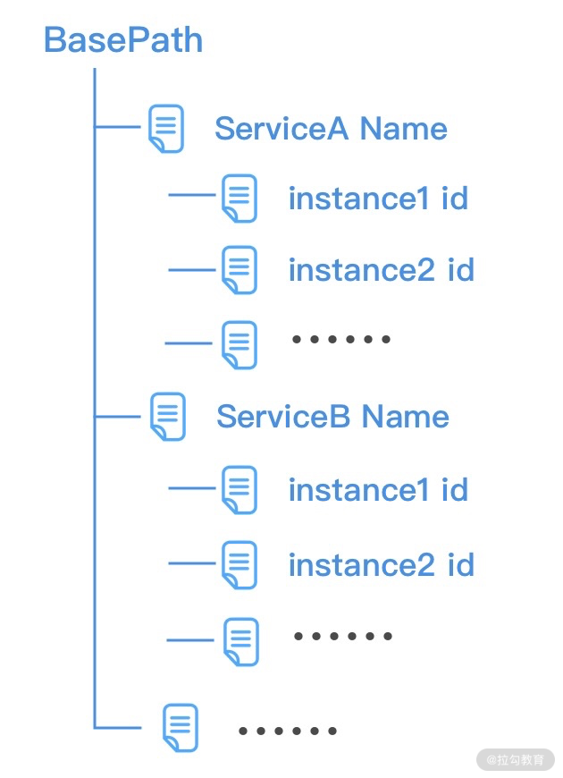

一般来说，我们会将相同版本的 RPC 服务归类在一起，所以可以将 ServiceInstance 的名称 name 根据服务名称和服务版本进行赋值，如下所示。

```java
public class RpcServiceHelper {
    public static String buildServiceKey(String serviceName, String serviceVersion) {
        return String.join("#", serviceName, serviceVersion);
    }
}
```

在《服务发布与订阅：搭建生产者和消费者的基础框架》课程中，我们讲解了 RpcProvider 在启动过程中是如何根据 @RpcService 注解识别需要发布的服务，现在我们可以使用 RegistryService 接口的 register() 方法将识别出的服务进行发布了，完善后的 RpcProvider#postProcessAfterInitialization() 方法实现如下。

```java
@Override
public Object postProcessAfterInitialization(Object bean, String beanName) throws BeansException {
    RpcService rpcService = bean.getClass().getAnnotation(RpcService.class);
    if (rpcService != null) {
        String serviceName = rpcService.serviceInterface().getName();
        String serviceVersion = rpcService.serviceVersion();
        try {
            ServiceMeta serviceMeta = new ServiceMeta();
            serviceMeta.setServiceAddr(serverAddress);
            serviceMeta.setServicePort(serverPort);
            serviceMeta.setServiceName(serviceName);
            serviceMeta.setServiceVersion(serviceVersion);
            serviceRegistry.register(serviceMeta); // 注册服务
            rpcServiceMap.put(RpcServiceHelper.buildServiceKey(serviceMeta.getServiceName(), serviceMeta.getServiceVersion()), bean);
        } catch (Exception e) {
            log.error("failed to register service {}#{}", serviceName, serviceVersion, e);
        }
    }
    return bean;
}
```

至此，服务提供者在启动后就可以将 @RpcService 注解修饰的服务发布到注册中心了，下面我们继续看看服务消费者应当如何通过合理的负载均衡算法得到合适的服务节点呢？在此之前，我们先来了解下负载均衡算法的基础知识。

## 负载均衡算法基础

服务消费者在发起 RPC 调用之前，需要感知有多少服务端节点可用，然后从中选取一个进行调用。之前我们提到了几种常用的负载均衡策略：Round-Robin 轮询、Weighted Round-Robin 权重轮询、Least Connections 最少连接数、Consistent Hash 一致性 Hash 等。本节课我们讨论的主角是基于一致性 Hash 的负载均衡算法，一致性 Hash 算法可以保证每个服务节点分摊的流量尽可能均匀，而且能够把服务节点扩缩容带来的影响降到最低。下面我们一起看下一致性 Hash 算法的设计思路。

在服务端节点扩缩容时，一致性 Hash 算法会尽可能保证客户端发起的 RPC 调用还是固定分配到相同的服务节点上。一致性 Hash 算法是采用哈希环来实现的，通过 Hash 函数将对象和服务器节点放置在哈希环上，一般来说服务器可以选择 IP + Port 进行 Hash，如下图所示。


图中 C1、C2、C3、C4 是客户端对象，N1、N2、N3 为服务节点，然后在哈希环中顺时针查找距离客户端对象 Hash 值最近的服务节点，即为客户端对应要调用的服务节点。假设现在服务节点扩容了一台 N4，经过 Hash 函数计算将其放入到哈希环中，哈希环变化如下图所示。


此时 N2 和 N4 之间的客户端对象需要重新进行分配，可以看出只有 C3 会被分配到新的节点 N4 上，其他的都保持不变。服务节点下线与上线的处理过程是类似的，你可以自行分析下服务节点下线时哈希环是如何变化的。

如果服务节点的数量很少，不管 Hash 算法如何，很大可能存在服务节点负载不均的现象。而且上图中在新增服务节点 N4 时，仅仅分担了 N1 节点的流量，其他节点并没有流量变化。为了解决上述问题，一致性 Hash 算法一般会引入虚拟节点的概念。如下图所示。


图中相同颜色表示同一组虚拟服务器，它们经过 Hash 函数计算后被均匀放置在哈希环中。如果真实的服务节点越多，那么所需的虚拟节点就越少。在为客户端对象分配节点的时候，需要顺时针从哈希环中找到距离最近的虚拟节点，然后即可确定真实的服务节点。

有了上述一致性 Hash 算法的基础知识，下面我们看看一致性 Hash 算法是如何实现的。

## 负载均衡算法实现

与注册中心类似，我们也首先定义一个通用的负载均衡接口，Round-Robin 轮询、一致性 Hash 等负载均衡算法都需要实现该接口，接口的定义如下所示：

```java
public interface ServiceLoadBalancer<T> {
    T select(List<T> servers, int hashCode);
}
```

select() 方法的传入参数是一批服务节点以及客户端对象的 hashCode，针对 Zookeeper 的场景，我们可以实现一个比较通用的一致性 Hash 算法。

```java
public class ZKConsistentHashLoadBalancer implements ServiceLoadBalancer<ServiceInstance<ServiceMeta>> {
    private final static int VIRTUAL_NODE_SIZE = 10;
    private final static String VIRTUAL_NODE_SPLIT = "#";
    @Override
    public ServiceInstance<ServiceMeta> select(List<ServiceInstance<ServiceMeta>> servers, int hashCode) {
        TreeMap<Integer, ServiceInstance<ServiceMeta>> ring = makeConsistentHashRing(servers); // 构造哈希环
        return allocateNode(ring, hashCode); // 根据 hashCode 分配节点
    }
    private ServiceInstance<ServiceMeta> allocateNode(TreeMap<Integer, ServiceInstance<ServiceMeta>> ring, int hashCode) {
        Map.Entry<Integer, ServiceInstance<ServiceMeta>> entry = ring.ceilingEntry(hashCode); // 顺时针找到第一个节点
        if (entry == null) {
            entry = ring.firstEntry(); // 如果没有大于 hashCode 的节点，直接取第一个
        }
        return entry.getValue();
    }
    private TreeMap<Integer, ServiceInstance<ServiceMeta>> makeConsistentHashRing(List<ServiceInstance<ServiceMeta>> servers) {
        TreeMap<Integer, ServiceInstance<ServiceMeta>> ring = new TreeMap<>();
        for (ServiceInstance<ServiceMeta> instance : servers) {
            for (int i = 0; i < VIRTUAL_NODE_SIZE; i++) {
                ring.put((buildServiceInstanceKey(instance) + VIRTUAL_NODE_SPLIT + i).hashCode(), instance);
            }
        }
        return ring;
    }
    private String buildServiceInstanceKey(ServiceInstance<ServiceMeta> instance) {
        ServiceMeta payload = instance.getPayload();
        return String.join(":", payload.getServiceAddr(), String.valueOf(payload.getServicePort()));
    }
}
```

JDK 提供了 TreeMap 数据结构，可以非常方便地构造哈希环。通过计算出每个服务实例 ServiceInstance 的地址和端口对应的 hashCode，然后直接放入 TreeMap 中，TreeMap 会对 hashCode 默认从小到大进行排序。在为客户端对象分配节点时，通过 TreeMap 的 ceilingEntry() 方法找出大于或等于客户端 hashCode 的第一个节点，即为客户端对应要调用的服务节点。如果没有找到大于或等于客户端 hashCode 的节点，那么直接去 TreeMap 中的第一个节点即可。

至此，一个基本的一致性 Hash 算法已经实现完了，接下来我们就可以把注册中心的服务发现 discovery() 方法补充完整了。

## 服务发现实现

服务发现的实现思路比较简单，首先找出被调用服务所有的节点列表，然后通过 ZKConsistentHashLoadBalancer 提供的一致性 Hash 算法找出相应的服务节点。具体代码实现如下：

```java
@Override
public ServiceMeta discovery(String serviceName, int invokerHashCode) throws Exception {
    Collection<ServiceInstance<ServiceMeta>> serviceInstances = serviceDiscovery.queryForInstances(serviceName);
    ServiceInstance<ServiceMeta> instance = new ZKConsistentHashLoadBalancer().select((List<ServiceInstance<ServiceMeta>>) serviceInstances, invokerHashCode);
    if (instance != null) {
        return instance.getPayload();
    }
    return null;
}
```

服务消费者通过动态代理发起 RPC 调用之前，需要通过服务发现接口获取到可调用的节点，在下节课《动态代理：为用户屏蔽 RPC 调用的底层细节》会有相应的代码实现，本节课先不做展开。

## 总结

服务注册和发现是 RPC 框架中非常重要的一环，本节课我们设计了通用的注册中心接口，并给出了 Zookeeper 场景下的默认实现。在服务发现中需要使用到负载均衡算法，其中一致性 Hash 算法在很多场景中被广泛使用，它可以保证每个服务节点分摊的流量尽可能均匀，而且能够把服务节点扩缩容带来的影响降到最低。关于一致性 Hash 算法的实现原理务必掌握，这也是面试中的高频问题。

最后留两个课后任务：

1.  如果你对 Eureka 或者其他类型的注册中心比较熟悉，你可以尝试扩展 RegistryService 接口并实现它。
2.  在一致性 Hash 算法的实现中，我们只是简单使用了服务实例的 hashCode 作为哈希环的构建依据，更好的 Hash 函数可以参考更加高性能的 MurmurHash，Guava 工具库中就有默认实现，你可以引入 MurmurHash 对上文中的一致性 Hash 算法实现进行优化。

27 动态代理：为用户屏蔽 RPC 调用的底层细节
=========================

动态代理在 RPC 框架的实现中起到了至关重要的作用，它可以帮助用户屏蔽 RPC 调用时底层网络通信、服务发现、负载均衡等具体细节，这些对用户来说并没有什么意义。你在平时项目开发中使用 RPC 框架的时候，只需要调用接口方法，然后就拿到了返回结果，你是否好奇 RPC 框架是如何完成整个调用流程的呢？今天这节课我们就一起来完成 RPC 框架的最后一部分内容：RPC 请求调用和处理，看看如何使用动态代理机制完成这个神奇的操作。

> 源码参考地址：[mini-rpc](https://github.com/wangyapu/mini-rpc)

## 动态代理基础

为什么需要代理模式呢？代理模式的优势是可以很好地遵循设计模式中的开放封闭原则，对扩展开发，对修改关闭。你不需要关注目标类的实现细节，通过代理模式可以在不修改目标类的情况下，增强目标类功能的行为。Spring AOP 是 Java 动态代理机制的经典运用，我们在项目开发中经常使用 AOP 技术完成一些切面服务，如耗时监控、事务管理、权限校验等，所有操作都是通过切面扩展实现的，不需要对源代码有所侵入。

动态代理是一种代理模式，它提供了一种能够在运行时动态构建代理类以及动态调用目标方法的机制。为什么称为动态是因为代理类和被代理对象的关系是在运行时决定的，代理类可以看作是对被代理对象的包装，对目标方法的调用是通过代理类来完成的。所以通过代理模式可以有效地将服务提供者和服务消费者进行解耦，隐藏了 RPC 调用的具体细节，如下图所示。

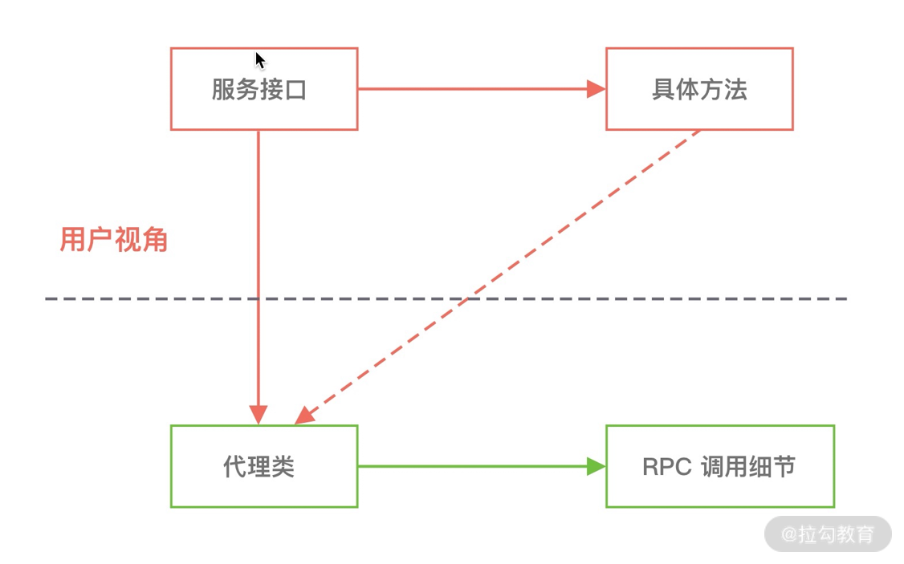

接下来我们一起探讨下动态代理的实现原理，以及常用的 JDK 动态代理、Cglib 动态代理是如何使用的。

### JDK 动态代理

JDK 动态代理实现依赖 java.lang.reflect 包中的两个核心类：**InvocationHandler 接口**和**Proxy 类**。

*   **InvocationHandler 接口**

JDK 动态代理所代理的对象必须实现一个或者多个接口，生成的代理类也是接口的实现类，然后通过 JDK 动态代理是通过反射调用的方式代理类中的方法，不能代理接口中不存在的方法。每一个动态代理对象必须提供 InvocationHandler 接口的实现类，InvocationHandler 接口中只有一个 invoke() 方法。当我们使用代理对象调用某个方法的时候，最终都会被转发到 invoke() 方法执行具体的逻辑。invoke() 方法的定义如下：

```java
public interface InvocationHandler {
    public Object invoke(Object proxy, Method method, Object[] args) throws Throwable;
}
```

其中 proxy 参数表示需要代理的对象，method 参数表示代理对象被调用的方法，args 参数为被调用方法所需的参数。

*   **Proxy 类**

Proxy 类可以理解为动态创建代理类的工厂类，它提供了一组静态方法和接口用于动态生成对象和代理类。通常我们只需要使用 newProxyInstance() 方法，方法定义如下所示。

```java
public static Object newProxyInstance(ClassLoader loader, Class<?>[] interfaces, InvocationHandler h) {
    Objects.requireNonNull(h);
    Class<?> caller = System.getSecurityManager() == null ? null : Reflection.getCallerClass();
    Constructor<?> cons = getProxyConstructor(caller, loader, interfaces);
    return newProxyInstance(caller, cons, h);
}
```

其中 loader 参数表示需要装载的类加载器 ClassLoader，interfaces 参数表示代理类实现的接口列表，然后你还需要提供一个 InvocationHandler 接口类型的处理器，所有动态代理类的方法调用都会交由该处理器进行处理，这是动态代理的核心所在。

下面我们用一个简单的例子模拟数据库操作的事务管理，从而学习 JDK 动态代理的具体使用方式。首先我们定义数据库表 User 的接口以及实现类：

```java
public interface UserDao {
    void insert();
}
public class UserDaoImpl implements UserDao {
    @Override
    public void insert() {
        System.out.println("insert user success.");
    }
}
```

接下来我们实现一个事务管理的工具类，在数据库操作执行前后执行事务操作，代码如下所示：

```java
public class TransactionProxy {
    private Object target;
    public TransactionProxy(Object target) {
        this.target = target;
    }
    public Object genProxyInstance() {
        return Proxy.newProxyInstance(target.getClass().getClassLoader(), target.getClass().getInterfaces(), (proxy, method, args) -> {
                    System.out.println("start transaction");
                    Object result = method.invoke(target, args);
                    System.out.println("submit transaction");
                    return result;
                });
    }
}
```

在 genProxyInstance() 方法中我们最主要的是实现 InvocationHandler 接口，在真实对象方法执行方法调用的前后可以扩展自定义行为，以此来增强目标类的功能。为了便于理解，上述例子中我们只简单打印了控制台日志，可以通过测试类看看 JDK 动态代理的实际效果：

```java
public class TransactionProxyTest {
    @Test
    public void testProxy() {
        UserDao userDao = new UserDaoImpl();
        UserDao proxyInstance = (UserDao) new TransactionProxy(userDao).genProxyInstance();
        proxyInstance.insert();
    }
}
```

程序运行结果如下：

```shell
start transaction
insert user success.
submit transaction
```

### Cglib 动态代理

Cglib 动态代理是基于 ASM 字节码生成框架实现的第三方工具类库，相比于 JDK 动态代理，Cglib 动态代理更加灵活，它是通过字节码技术生成的代理类，所以代理类的类型是不受限制的。使用 Cglib 代理的目标类无须实现任何接口，可以做到对目标类零侵入。

Cglib 动态代理是对指定类以字节码的方式生成一个子类，并重写其中的方法，以此来实现动态代理。因为 Cglib 动态代理创建的是目标类的子类，所以目标类必须要有无参构造函数，而且目标类不要用 final 进行修饰。

在我们使用 Cglib 动态代理之前，需要引入相关的 Maven 依赖，如下所示。如果你的项目中已经引入了 spring-core 的依赖，则已经包含了 Cglib 的相关依赖，无须再次引入。

```xml
<dependency>
    <groupId>cglib</groupId>
    <artifactId>cglib</artifactId>
    <version>3.3.0</version>
</dependency>
```

下面我们还是使用上述数据库事务管理的例子，从而学习 JDK 动态代理的具体使用方式。UserDao 接口和实现类保持不变，TransactionProxy 需要重新实现，代码如下所示：

```java
public class CglibTransactionProxy implements MethodInterceptor {
    private Object target;
    public CglibTransactionProxy(Object target) {
        this.target = target;
    }
    public Object genProxyInstance() {
        Enhancer enhancer = new Enhancer();
        enhancer.setSuperclass(target.getClass());
        enhancer.setCallback(this);
        return enhancer.create();
    }
    @Override
    public Object intercept(Object object, Method method, Object[] args, MethodProxy methodProxy) throws Throwable {
        System.out.println("start transaction");
        Object result = methodProxy.invokeSuper(object, args);
        System.out.println("submit transaction");
        return result;
    }
}
```

Cglib 动态代理的实现需要依赖两个核心组件：MethodInterceptor 接口和 Enhancer 类，类似于 JDK 动态代理中的**InvocationHandler 接口**和**Proxy 类**。

*   **MethodInterceptor 接口**

MethodInterceptor 接口只有 intercept() 一个方法，所有被代理类的方法执行最终都会转移到 intercept() 方法中进行行为增强，真实方法的执行逻辑则通过 Method 或者 MethodProxy 对象进行调用。

*   **Enhancer 类**

Enhancer 类是 Cglib 中的一个字节码增强器，它为我们对代理类进行扩展时提供了极大的便利。Enhancer 类的本质是在运行时动态为代理类生成一个子类，并且拦截代理类中的所有方法。我们可以通过 Enhancer 设置 Callback 接口对代理类方法执行的前后执行一些自定义行为，其中 MethodInterceptor 接口是我们最常用的 Callback 操作。

Cglib 动态代理的测试类与 JDK 动态代理测试类大同小异，程序输出结果也是一样的。测试类代码如下所示：

```java
public class CglibTransactionProxyTest {
    public static void main(String[] args) {
        UserDao userDao = new UserDaoImpl();
        UserDao proxyInstance = (UserDao) new CglibTransactionProxy(userDao).genProxyInstance();
        proxyInstance.insert();
    }
}
```

学习完动态代理的基础后，我们接下来实现 RPC 框架中的请求调用和处理就易如反掌啦，首先我们先从服务消费者如何通过动态代理发起 RPC 请求入手。

## 服务消费者动态代理实现

在《服务发布与订阅：搭建生产者和消费者的基础框架》课程中，我们讲解了 @RpcReference 注解的实现过程。通过一个自定义的 RpcReferenceBean 完成了所有执行方法的拦截，RpcReferenceBean 中 init() 方法是当时留下的 TODO 内容，这里就是代理对象的创建入口，代理对象创建如下所示.

```java
public class RpcReferenceBean implements FactoryBean<Object> {
    // 省略其他代码
    public void init() throws Exception {
        RegistryService registryService = RegistryFactory.getInstance(this.registryAddr, RegistryType.valueOf(this.registryType));
        this.object = Proxy.newProxyInstance(
                interfaceClass.getClassLoader(),
                new Class<?>[]{interfaceClass},
                new RpcInvokerProxy(serviceVersion, timeout, registryService));
    }
    // 省略其他代码
}
```

RpcInvokerProxy 处理器是实现动态代理逻辑的核心所在，其中包含 RPC 调用时底层网络通信、服务发现、负载均衡等具体细节，我们详细看下如何实现 RpcInvokerProxy 处理器，代码如下所示：

```java
public class RpcInvokerProxy implements InvocationHandler {
    private final String serviceVersion;
    private final long timeout;
    private final RegistryService registryService;
    public RpcInvokerProxy(String serviceVersion, long timeout, RegistryService registryService) {
        this.serviceVersion = serviceVersion;
        this.timeout = timeout;
        this.registryService = registryService;
    }
    @Override
    public Object invoke(Object proxy, Method method, Object[] args) throws Throwable {
        // 构造 RPC 协议对象
        MiniRpcProtocol<MiniRpcRequest> protocol = new MiniRpcProtocol<>();
        MsgHeader header = new MsgHeader();
        long requestId = MiniRpcRequestHolder.REQUEST_ID_GEN.incrementAndGet();
        header.setMagic(ProtocolConstants.MAGIC);
        header.setVersion(ProtocolConstants.VERSION);
        header.setRequestId(requestId);
        header.setSerialization((byte) SerializationTypeEnum.HESSIAN.getType());
        header.setMsgType((byte) MsgType.REQUEST.getType());
        header.setStatus((byte) 0x1);
        protocol.setHeader(header);
        MiniRpcRequest request = new MiniRpcRequest();
        request.setServiceVersion(this.serviceVersion);
        request.setClassName(method.getDeclaringClass().getName());
        request.setMethodName(method.getName());
        request.setParameterTypes(method.getParameterTypes());
        request.setParams(args);
        protocol.setBody(request);
        RpcConsumer rpcConsumer = new RpcConsumer();
        MiniRpcFuture<MiniRpcResponse> future = new MiniRpcFuture<>(new DefaultPromise<>(new DefaultEventLoop()), timeout);
        MiniRpcRequestHolder.REQUEST_MAP.put(requestId, future);
        // 发起 RPC 远程调用
        rpcConsumer.sendRequest(protocol, this.registryService);
        // 等待 RPC 调用执行结果
        return future.getPromise().get(future.getTimeout(), TimeUnit.MILLISECONDS).getData();
    }
}
```

RpcInvokerProxy 处理器必须要实现 InvocationHandler 接口的 invoke() 方法，被代理的 RPC 接口在执行方法调用时，都会转发到 invoke() 方法上。invoke() 方法的核心流程主要分为三步：构造 RPC 协议对象、发起 RPC 远程调用、等待 RPC 调用执行结果。

RPC 协议对象的构建，只要根据用户配置的接口参数对 MiniRpcProtocol 类的属性依次赋值即可。构建完MiniRpcProtocol 协议对象后，就可以对远端服务节点发起 RPC 调用了，所以 sendRequest() 方法是我们需要重点实现的内容。

```java
public void sendRequest(MiniRpcProtocol<MiniRpcRequest> protocol, RegistryService registryService) throws Exception {
    MiniRpcRequest request = protocol.getBody();
    Object[] params = request.getParams();
    String serviceKey = RpcServiceHelper.buildServiceKey(request.getClassName(), request.getServiceVersion());
    int invokerHashCode = params.length > 0 ? params[0].hashCode() : serviceKey.hashCode();
    ServiceMeta serviceMetadata = registryService.discovery(serviceKey, invokerHashCode);
    if (serviceMetadata != null) {
        ChannelFuture future = bootstrap.connect(serviceMetadata.getServiceAddr(), serviceMetadata.getServicePort()).sync();
        future.addListener((ChannelFutureListener) arg0 -> {
            if (future.isSuccess()) {
                log.info("connect rpc server {} on port {} success.", serviceMetadata.getServiceAddr(), serviceMetadata.getServicePort());
            } else {
                log.error("connect rpc server {} on port {} failed.", serviceMetadata.getServiceAddr(), serviceMetadata.getServicePort());
                future.cause().printStackTrace();
                eventLoopGroup.shutdownGracefully();
            }
        });
        future.channel().writeAndFlush(protocol);
    }
}
```

发起 RPC 调用之前，我们需要找到最合适的服务节点，直接调用注册中心服务 RegistryService 的 discovery() 方法即可，默认是采用一致性 Hash 算法实现的服务发现。这里有一个小技巧，为了尽可能使所有服务节点收到的请求流量更加均匀，需要为 discovery() 提供一个 invokerHashCode，一般可以采用 RPC 服务接口参数列表中第一个参数的 hashCode 作为参考依据。找到服务节点地址后，接下来通过 Netty 建立 TCP 连接，然后调用 writeAndFlush() 方法将数据发送到远端服务节点。

再次回到 invoke() 方法的主流程，发送 RPC 远程调用后如何等待调用结果返回呢？在《远程通信：通信协议设计以及编解码的实现》课程中，我们介绍了如何使用 Netty 提供的 Promise 工具来实现 RPC 请求的同步等待，Promise 模式本质是一种异步编程模型，我们可以先拿到一个查看任务执行结果的凭证，不必等待任务执行完毕，当我们需要获取任务执行结果时，再使用凭证提供的相关接口进行获取。

当服务提供者收到 RPC 请求后，又应该如何执行真实的方法调用呢？接下来我们继续看下服务提供者如何处理 RPC 请求。

## 服务提供者反射调用实现

在《远程通信：通信协议设计以及编解码的实现》课程中，我们已经介绍了服务提供者的 Handler 处理器，RPC 请求数据经过 MiniRpcDecoder 解码成 MiniRpcProtocol 对象后，再交由 RpcRequestHandler 执行 RPC 请求调用。一起先来回顾下 RpcRequestHandler 中 channelRead0() 方法的处理逻辑：

```java
@Slf4j
public class RpcRequestHandler extends SimpleChannelInboundHandler<MiniRpcProtocol<MiniRpcRequest>> {
    private final Map<String, Object> rpcServiceMap;
    public RpcRequestHandler(Map<String, Object> rpcServiceMap) {
        this.rpcServiceMap = rpcServiceMap;
    }
    @Override
    protected void channelRead0(ChannelHandlerContext ctx, MiniRpcProtocol<MiniRpcRequest> protocol) {
            RpcRequestProcessor.submitRequest(() -> {
            MiniRpcProtocol<MiniRpcResponse> resProtocol = new MiniRpcProtocol<>();
            MiniRpcResponse response = new MiniRpcResponse();
            MsgHeader header = protocol.getHeader();
            header.setMsgType((byte) MsgType.RESPONSE.getType());
            try {
                Object result = handle(protocol.getBody());
                response.setData(result);
                header.setStatus((byte) MsgStatus.SUCCESS.getCode());
                resProtocol.setHeader(header);
                resProtocol.setBody(response);
            } catch (Throwable throwable) {
                header.setStatus((byte) MsgStatus.FAIL.getCode());
                response.setMessage(throwable.toString());
                log.error("process request {} error", header.getRequestId(), throwable);
            }
            ctx.writeAndFlush(resProtocol);
        });
    }
}
```

因为 RPC 请求调用是比较耗时的，推荐的做法是将 RPC 请求提交到自定义的业务线程池中执行。其中 handle() 方法是真正执行 RPC 调用的地方，是我们这节课需要实现的内容，handle() 方法的实现如下所示：

```java
private Object handle(MiniRpcRequest request) throws Throwable {
    String serviceKey = RpcServiceHelper.buildServiceKey(request.getClassName(), request.getServiceVersion());
    Object serviceBean = rpcServiceMap.get(serviceKey);
    if (serviceBean == null) {
        throw new RuntimeException(String.format("service not exist: %s:%s", request.getClassName(), request.getMethodName()));
    }
    Class<?> serviceClass = serviceBean.getClass();
    String methodName = request.getMethodName();
    Class<?>[] parameterTypes = request.getParameterTypes();
    Object[] parameters = request.getParams();
    FastClass fastClass = FastClass.create(serviceClass);
    int methodIndex = fastClass.getIndex(methodName, parameterTypes);
    return fastClass.invoke(methodIndex, serviceBean, parameters);
}
```

rpcServiceMap 中存放着服务提供者所有对外发布的服务接口，我们可以通过服务名和服务版本找到对应的服务接口。通过服务接口、方法名、方法参数列表、参数类型列表，我们一般可以使用反射的方式执行方法调用。为了加速服务接口调用的性能，我们采用 Cglib 提供的 FastClass 机制直接调用方法，Cglib 中 MethodProxy 对象就是采用了 FastClass 机制，它可以和 Method 对象完成同样的事情，但是相比于反射性能更高。

FastClass 机制并没有采用反射的方式调用被代理的方法，而是运行时动态生成一个新的 FastClass 子类，向子类中写入直接调用目标方法的逻辑。同时该子类会为代理类分配一个 int 类型的 index 索引，FastClass 即可通过 index 索引定位到需要调用的方法。

至此，整个 RPC 框架的原型我们已经实现完毕。你可以在本地先启动 Zookeeper 服务器，然后启动 rpc-provider、rpc-consumer 两个模块，通过 HTTP 请求发起测试，如下所示：

```shell
$ curl http://localhost:8080/hello
hellomini rpc
```

## 总结

本节课我们介绍了动态代理的基本原理，并使用动态代理技术完成了 RPC 请求的调用和处理。动态代理技术是 RPC 框架的核心技术之一，也是很重要的一个性能优化点。选择哪种动态代理技术需要根据场景有的放矢，实践出真知，在技术选型时还是要做好性能测试。例如，在 JDK 1.8 版本之后 JDK 动态代理在运行多次之后比 Cglib 的速度更快了，但是它还是有使用的局限性；虽然 Javassist 字节码生成的性能相比 JDK 动态代理和 Cglib 动态代理更好，但是 Javassist 在生成动态代理类上性能较慢的。

留两个课后任务：

*   Dubbo 框架默认使用 Javassist 实现动态代理功能，你可以将 JDK 动态代理的方式替换为 Javassist 的实现方式。
*   服务消费者每次发起 RPC 调用时都建立了一次 TCP 连接，你知道怎么优化吗？

28 实战总结：RPC 实战总结与进阶延伸
=====================

经过前面几节的实战课，我们已经初步完成了一个 RPC 框架原型，其中串联了 RPC 框架所涉及的大部分核心知识点。纸上得来终觉浅，绝知此事要躬行，编码是每个程序员的基本功，一定要亲自动手做一遍，不要停留在纸上谈兵。虽然 RPC 框架原型已经可以运行起来了，但是离生产级使用还差得很远，例如性能、高可用等。本节课我会做一个有关知识点的总结回顾，并结合业界成熟的 RPC 框架再做一些知识补充，希望对你提升系统设计能力所有帮助。

## 实战知识点总结

### Netty 服务端启动

Netty 提供了 ServerBootstrap 引导类作为程序启动入口，ServerBootstrap 将 Netty 核心组件像搭积木一样组装在一起，服务端启动过程我们需要完成以下三个基本步骤：

*   配置线程池。Netty 是采用 Reactor 模型进行开发的，在大多数场景下，我们采用的都是主从多线程 Reactor 模型。
*   Channel 初始化。设置 Channel 类型，并向 ChannelPipeline 中注册 ChannelHandler，此外可以按需设置 Socket 参数以及用户自定义属性。
*   端口绑定。调用 bind() 方法会真正触发启动，sync() 方法则会阻塞，直至整个启动过程完成。

### 自定义通信协议

一个完备的网络协议需要具备的基本要素：魔数、协议版本号、序列化算法、报文类型、长度域字段、请求数据、保留字段。在实现协议编解码时经常用到两个重要的抽象类：**MessageToByteEncoder 编码器**和**ByteToMessageDecoder 解码器**。Netty 也提供了很多开箱即用的拆包器，推荐最广泛使用的 LengthFieldBasedFrameDecoder，它可以满足实际项目中的大部分场景。如果对 LengthFieldBasedFrameDecoder 的参数不够熟悉，实际直接使用 ByteBuf 反而更加直观，根据个人喜好按需选择。

### ByteBuf

ByteBuf 是必须要掌握的核心工具类，并且能够理解 ByteBuf 的内部构造。ByteBuf 包含三个指针：**读指针 readerIndex**、**写指针 writeIndex**、**最大容量 maxCapacity**，根据指针的位置又可以将 ByteBuf 内部结构可以分为四个部分：废弃字节、可读字节、可写字节和可扩容字节。如下图所示。

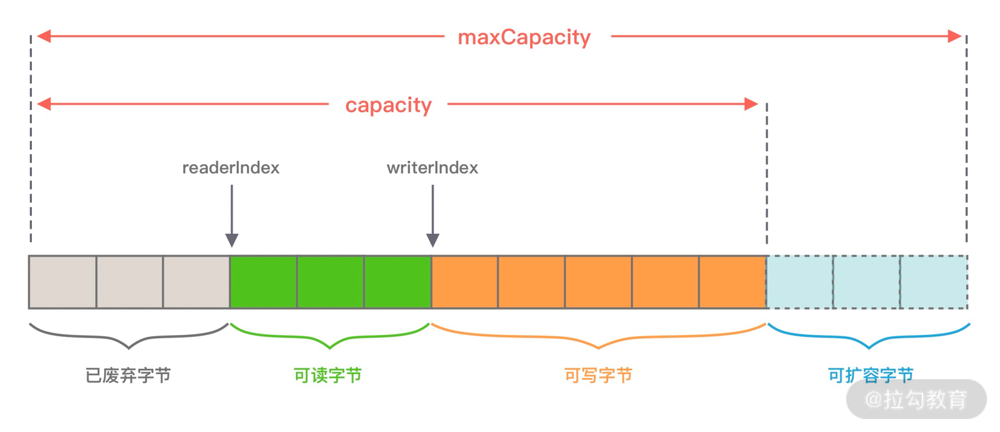

### Pipeline & ChannelHandler

ChannelPipeline 和 ChannelHandler 也是我们在平时应用开发的过程中打交道最多的组件，这两个组件为用户提供了 I/O 事件的全部控制权。ChannelPipeline 是双向链表结构，包含 ChannelInboundHandler 和 ChannelOutboundHandler 两种处理器。Inbound 事件和 Outbound 事件的传播方向相反，Inbound 事件的传播方向为 Head -> Tail，而 Outbound 事件传播方向是 Tail -> Head。在设计之初一定要梳理清楚 Inbound 和 Outbound 处理的传递顺序，以及数据模型之间是如何转换的。

### 注册中心

注册中心是 RPC 框架中一个非常重要的组件，主要用于实现服务的注册和发现。目前主流的注册中心有 ZooKeeper、Eureka、Etcd、Consul、Nacos 等，到底选择 CP 还是 AP 类型的注册中心呢？没有最好的选择，需要根据实际的业务场景进行技术选型。对于 RPC 框架而言，应当弱依赖于注册中心，即使注册中心出现问题，也不应该影响服务正常使用。所以建议使用 AP 类型的注册中心，在实现服务发现的场景下相比 CP 类型的注册中心有性能优势，整个集群是不存在 Leader、Flower 概念的，如果其中一个节点挂了，请求会立刻转移到其他节点上，通过牺牲强一致性来保证高可用性。

当服务节点下线时，注册中心需要及时通知服务消费者该节点已经下线了，否则可能会造成部分服务调用出现问题。实现服务优雅下线比较好的方式是采用主动通知 \+ 心跳检测的方案，心跳检测可以由节点或者注册中心负责，例如注册中心可以向服务节点每 60s 发送一次心跳包，如果 3 次心跳包都没有收到请求结果，可以认为该服务节点已经下线。心跳检测通常也是客户端和服务端之间通知对方存活状态的一种机制，下文我会给你展示心跳检测的基本实现方式。

### 动态代理和反射调用

如果想做到 RPC 底层细节对服务消费者无感知，就无法绕开动态代理。动态代理提供了一种能够在运行时动态构建代理类以及动态调用目标方法的机制，我们必须创建一个接口代理对象，在代理对象中实现编码、请求调用、解码等操作。

常用的动态代理实现有 JDK 动态代理和 Cglib 动态代理，选择哪种动态代理技术需要根据场景有的放矢，需要做好性能压测。JDK 动态代理所代理的对象必须实现一个或者多个接口，生成的代理类也是接口的实现类，然后通过 JDK 动态代理是通过反射调用的方式代理类中的方法，不能代理接口中不存在的方法。Cglib 动态代理相比 JDK 动态代理更加灵活，Cglib 是通过字节码技术对指定类生成一个子类，并重写其中的方法，所以代理类的类型是不受限制的。

服务提供者在接收到 RPC 请求后，需要通过反射机制执行真实的方法调用。为了加速服务接口调用的性能，可以采用 Cglib 提供的 FastClass 机制直接调用方法，相比于反射性能更高。FastClass 机制并没有采用反射的方式调用被代理的方法，而是运行时动态生成一个新的 FastClass 子类，向子类中写入直接调用目标方法的逻辑。同时该子类会为代理类分配一个 int 类型的 index 索引，FastClass 即可通过 index 索引定位到需要调用的方法。生成 FastClass 子类是比较耗时的，可以使用缓存 FastClass 的方式进一步优化 RPC 框架的性能。

## 性能优化篇

RPC 框架的性能取决于很多因素，我们通常会关注几个方面：I/O 模型、网络参数、序列化方法、内存管理等。接下来我们主要以知识点的形式逐一介绍 RPC 框架中常用的优化方法。

### I/O 模型

Netty 提供了高效的主从 Reactor 多线程模型，主 Reactor 线程负责新的网络连接 Channel 创建，然后把 Channel 注册到从 Reactor，由从 Reactor 线程负责处理后续的 I/O 操作。主从 Reactor 多线程模型很好地解决了高并发场景下单个 NIO 线程无法承载海量客户端连接建立以及 I/O 操作的性能瓶颈。

通常我们使用如下的方式配置主从 Reactor 线程模型：

```java
EventLoopGroup bossGroup = new NioEventLoopGroup();
EventLoopGroup workerGroup = new NioEventLoopGroup();
ServerBootstrap b = new ServerBootstrap();
b.group(bossGroup, workerGroup)
```

如果你没有指定 workerGroup 线程组初始化的线程数，那么 Netty 会默认创建 2 倍 CPU 核数作的线程，但这并不一定是一个最佳数量，可以根据实际的压测情况进行适当调整。一般来说，只要服务性能能够满足要求，workerGroup 初始化的线程数应该越少越好，这样可以有效地减少线程上下文切换。

Netty 提供了一个参数 ioRatio，可以调整 I/O 事件处理和任务处理的时间比例，默认值为 50。对于高并发的 RPC 调用场景，ioRatio 可以适当调大，控制 Netty 有更多的时间比例在执行 I/O 任务。

### Netty 网络参数配置

Netty 提供了 ChannelOption 以便于我们优化 TCP 参数配置，为了提高网络通信的吞吐量，一些可选的网络参数我们有必要掌握。

*   TCP_NODELAY，是否开启 Nagle 算法。Nagle 算法通过缓存的方式将网络数据包累积到一定量才会发送，从而避免频繁发送小的数据包。Nagle 算法 在海量流量的场景下非常有效，但是会造成一定的数据延迟。如果对数据传输延迟敏感，那么应该禁用该参数。
*   SO\_BACKLOG，已完成三次握手的请求队列最大长度。同一时刻服务端可能会处理多个连接，在高并发海量连接的场景下，该参数应适当调大。但是 SO\_BACKLOG 也不能太大，否则无法防止 SYN-Flood 攻击。
*   SO\_SNDBUF/SO\_RCVBUF，TCP 发送缓冲区和接收缓冲区的大小。为了能够达到最大的网络吞吐量，SO\_SNDBUF 不应当小于带宽和时延的乘积。SO\_RCVBUF 一直会保存数据到应用进程读取为止，如果 SO\_RCVBUF 满了，接收端会通知对端 TCP 协议中的窗口关闭，保证 SO\_RCVBUF 不会溢出。
*   SO\_KEEPALIVE，连接保活。启用了 TCP SO\_KEEPALIVE 属性，TCP 会主动探测连接状态，Linux 默认设置了 2 小时的心跳频率。TCP KEEPALIVE 机制主要用于回收死亡时间交长的连接，不适合实时性高的场景。

### 序列化方式

在网络通信过程中，必然涉及序列化和反序列化操作，即将对象编码成字节，再把字节解码成对象的过程。序列化和反序列化属于高频且较笨重的操作，属于 RPC 框架中一个重要的性能优化点。在选择序列化方式时需要综合考虑各方面因素，如高性能、跨语言、可维护性、可扩展性等。

比较常用的序列化算法有 Kryo、Hessian、Protobuf 等，这些第三方序列化算法都比 Java 原生的序列化操作都更加高效。Kryo 序列化后占用字节数较少，网络传输效率更高，但是不支持跨语言。Hessian 是目前业界使用较为广泛的序列化协议，它的兼容性好，支持跨语言，API 方便使用，序列化后的字节数适中。Protobuf 是 gRPC 框架默认使用的序列化协议，属于 Google 出品的序列化框架。Protobuf 支持跨语言、跨平台，具有较好的扩展性，并且性能优于 Hessian。但是 Protobuf 使用时需要编写特定的 prpto 文件，然后进行静态编译成不同语言的程序后拷贝到项目工程中，一定程序增加了开发者的复杂度。综合各方面因素以及实际口碑，个人比较推荐使用 Hessian 和 Protobuf 序列化协议。

关于 RPC 框架序列化进一步的性能优化我们可以采用以下方法：

*   减少不必要的字段以及精简字段的长度，从而降低序列化后占用的字节数。
*   提供不同的序列化策略。可以将不同的字段拆分至不同的线程里进行反序列化，例如 Netty I/O 线程可以只负责 className 和 消息头 Header 的反序列化，然后根据 Header 分发到不同的业务线程池中，由业务线程负责反序列化消息内容 Content，这样可以有效地降低 I/O 线程的压力。

### 内存管理

Netty 会使用堆外内存 DirectBuffer 进行 Socket 读写，相比使用堆内存减少了一次内存拷贝。然而堆外内存的创建和销毁成本更高，所以通常会使用内存池来提高性能，你可以回顾下《轻量级对象回收站：Recycler 对象池技术解析》课程中所介绍的 Netty 池化技术。对于数据量较小的一些场景，可以考虑使用 HeapBuffer，由 JVM 负责内存的分配和回收可能效率更高。

此外，Netty 还提供了一些技巧来避免内存拷贝：

*   CompositeByteBuf 是 Netty 中实现零拷贝机制非常重要的一个数据结构，它可以组合多个 Buffer 对象合并成一个逻辑上的对象，避免通过传统内存拷贝的方式将几个 Buffer 合并成一个大的 Buffer，我们经常使用 CompositeByteBuf 拼接协议数据的 头部信息 Header 和消息体数据 Body。
*   在失败重试的场景，我们想保留 ByteBuf 继续使用，你可以使用 copy() 方法拷贝原始 ByteBuf 的所有信息。但是深拷贝非常浪费性能的，你可以使用浅拷贝操作 oldBuffer.duplicate().retain() 复制出独立的读写索引，底层分配的内存、引用计数都是与原始 ByteBuf 共享的，其中 retain() 又会将 ByteBuffer 的引用计数加 1，从而避免了 ByteBuffer 被释放。

## 高可用篇

在整个 RPC 框架实践课中，我们并没有太多考虑 RPC 框架高可用相关的内容，但是高可用是分布式系统架构设计中一个重要的因素，下面我们便一起讨论如何提高 RPC 框架的可用性。

### 连接空闲检测+心跳检测

连接空闲检测是指每隔一段时间检测连接是否有数据读写，如果服务端一直能收到客户端连接发送过来的数据，说明连接处于活跃状态，对于假死的连接是收不到对端发送的数据的。如果一段时间内没收到客户端发送的数据，并不能说明连接一定处于假死状态，有可能客户端就是长时间没有数据需要发送，但是建立的连接还是健康状态，所以服务端还需要通过心跳检测的机制判断客户端是否存活。客户端可以定时向服务端发送一次心跳包，如果有 N 次没收到心跳数据，可以判断当前客户端已经下线或处于不健康状态。由此可见，连接空闲检测和心跳检测是应对连接假死的一种有效手段，通常空闲检测时间间隔要大于 2 个周期的心跳检测时间间隔，主要是为了排除网络抖动的造成心跳包未能成功收到。

Netty 中提供了开箱即用的 IdleStateHandler 实现连接空闲检测，如果我们想把一定时间间隔内没有读到数据的客户端连接进行关闭，可以采取如下的实现方式：

```java
public class RpcIdleStateHandler extends IdleStateHandler {
    public RpcIdleStateHandler() {
        super(60, 0, 0, TimeUnit.SECONDS);
    }
    @Override
    protected void channelIdle(ChannelHandlerContext ctx, IdleStateEvent evt) {
        ctx.channel().close();
    }
}
```

IdleStateHandler 实现心跳检测本质是向任务队列中添加定时任务，判断 channelRead() 或 write() 方法是否发生空闲超时，IdleStateHandler 的构造函数支持设置读空闲时间、写空闲时间、读写空闲时间。super(60, 0, 0, TimeUnit.SECONDS) 表示我们只关注读空闲时间，如果服务端 60s 没未读到数据，就会回调 channelIdle() 方法，此时我们进行连接关闭，避免资源浪费。

心跳检测在 Netty 中并没有现成的实现，但是与空闲检测实现的原理是差不多的，客户端可以采用 EventLoop 提供的 schedule() 方法向任务队列中添加心跳数据上报的定时任务，如下所示：

```java
public class RpcHeartBeatHandler extends ChannelInboundHandlerAdapter {
    @Override
    public void channelActive(ChannelHandlerContext ctx) throws Exception {
        super.channelActive(ctx);
        doHeartBeatTask(ctx);
    }
    private void doHeartBeatTask(ChannelHandlerContext ctx) {
        ctx.executor().schedule(() -> {
            if (ctx.channel().isActive()) {
                HeartBeatData heartBeatData = buildHeartBeatData();
                ctx.writeAndFlush(heartBeatData);
                doHeartBeatTask(ctx);
            }
        }, 10, TimeUnit.SECONDS);
    }
}
```

客户端向服务端定时发送心跳包，服务端收到后并不回复响应，因为如果同时与服务端建立的客户端连接规模较大，响应心跳数据需要消耗一定的资源。如果想要实现客户端和服务端互相感知存活状态，需要采用双向心跳机制。我们需要根据实际场景选择最合理的心跳检测方式。

## 线程池隔离

如果你的 RPC 服务是公司的基础服务，可能会有非常多的调用方，例如用户接口、订单接口等等。在我们实现的 RPC 框架中，业务线程池是共用的，所有的 RPC 请求都会有该线程池处理。如果有一天其中一个服务调用方的流量激增，导致线程池资源耗尽，那么其他服务调用方都会受到严重的影响。我们可以尝试将不同的服务调用方划分到不同等级的业务线程池中，通过分组的方式对服务调用方的流量进行隔离，从而避免其中一个调用方出现异常状态导致其他所有调用方都不可用，提高服务整体性能和可用率。

流量隔离技术是服务治理中非常重要的一个措施，在很多大规模流量的业务系统中都有所应用，例如秒杀系统，可以根据特殊的请求头识别出是否是秒杀请求，从而跟日常请求的流量隔离开来。那么对于 RPC 框架而言，如何对服务调用方进行合理的分组呢？一般来说，根据应用的重要等级作为分组依据是一个很好的衡量标准，一定要保障核心业务不受影响，例如下单、支付等接口都需要有自己独立的业务线程池，避免受到其他服务调用方的影响。

### 重试机制

重试机制你再熟悉不过了，在平时的项目开发中你一定经常用到。为了保障服务的稳定性和容错性，重试机制是一般可以帮助我们解决不少问题，例如网络抖动、请求超时等场景都需要重试机制。

关于 RPC 框架的重试机制有几点最佳实践和注意事项，有必要与你分享一下：

*   被调用的服务接口的业务逻辑需要保证幂等才可以考虑使用重试机制，例如数据插入、更新操作，无论重复请求多少次都不会产生任何影响。
*   重试机制虽然可以提升服务可用性，但是重试可能会导致服务提供方流量倍增，极端情况下甚至造成雪崩。服务调用方最好设置合理的服务调用超时时间以及失败后的重试次数，需要综合考虑接口依赖服务的平均耗时、TP99 响应时间、服务重要等级等因素作为参考依据。为了防止重试引发的流量风暴，服务提供方必须考虑熔断、限流、降级等保护措施。
*   RPC 框架的重试机制一般会采取指数退避的策略，两次重试之间指数级增加间隔时间，例如 1s、2s、4s、8s，以此类推，同时必须限制最大延迟时间。指数退避会存在负载峰值的问题，例如服务提供方可能发生 FullGC 导致同一时间产生超时重试的请求增多。为了解决负载峰值问题，可以在重试间隔中增加随机值，将请求分摊在不同的时间点中。
*   在负载均衡选择服务节点时，应该剔除上次重试失败的节点，进一步提高重试的成功率。

### 集群容错

集群容错是指服务消费者调用服务提供者集群时发生异常时的处理方案。以 Dubbo 框架为例，提供了六种内置的集群容错措施。

*   **Failover，失效转移策略**。Failover 是 Dubbo 默认的集群容错措施，当出现调用失败时，会重新尝试调用其他服务节点。对于幂等性操作我们可以选择 Failover 策略，但是重试的副作用在上文中我们已经提到过，如果服务提供者出现问题可能会产生大量的重试请求。
*   **Failfast，快速失败策略**。Failfast 非常适合非幂等性操作，服务消费者只发起一次调用，如果出现失败的情况则立刻报错，不进行任何重试。Failfast 的缺点就是需要服务消费者自己控制重试逻辑。
*   **Failsafe，失效安全策略**。Failsafe 策略在出现异常时，直接忽略。Failsafe 策略适合执行非核心的操作，如监控日志记录。
*   **Failback，失效自动恢复策略**。服务消费者调用失败后，Dubbo 会记录此次失败请求到队列中，然后定时重新发送该请求。Failback 策略适用于实时性不高的场景，如消息推送。
*   **Forking，并行措施**。服务调用者并行调用多个服务提供者节点，只要有一个调用成功就返回结果。通常用于实时性要求较高的操作，而且可以降低 TP999 指标，但是需要牺牲一定的服务器资源。
*   **Broadcast，广播措施**。Broadcast 策略会广播所有的服务提供者，逐个调用，任意一台失败则等待广播最后完成之后抛出，通常用于更新服务提供方的本地资源状态。

以上几种集群容错措施可以根据实际的业务场景进行配置选择，而且 Dubbo 给我们提供了 Cluster 扩展接口，我们可以自己定制集群的容错模式。

此外，实现 RPC 框架高可用的措施还有很多，如限流保护、动态扩容、平滑重启、服务治理等等，由于篇幅有限，我在这里就不一一展开了。实现一个 RPC 框架原型并不是什么难事，但是如何保证 RPC 框架的高性能、高可用、易扩展，是需要我们不断去学习和积累的技能。

## 总结

要想精通一门技术，自然离不开源码学习以及长期的实践经验。为了便于学习，本专栏完整地实现了 RPC 框架的基础功能，更有趣的是 RPC 框架还有更多高阶特性等待我们去挖掘，如服务治理、线程池隔离、集群容错、熔断限流等。你是否已经迫不及待地想去进一步深入研究 RPC 框架更多的知识了呢？一起动手把实战项目打磨得更加完善，一步步提升自己架构设计和编码的基本功！

29 编程思想：Netty 中应用了哪些设计模式？
=========================

设计模式的运用是面试过程中常考的，学习设计模式切勿死记硬背，结合优秀项目的源码去理解设计模式的使用会事半功倍。Netty 源码中运用了大量的设计模式，常见的设计模式在 Netty 源码中都有所体现。本节课我们便一起梳理 Netty 源码中所包含的设计模式，希望能帮助你更深入地了解 Netty 的设计精髓，并可以结合 Netty 源码向面试官讲述你对设计模式的理解。

## 单例模式

单例模式是最常见的设计模式，它可以保证全局只有一个实例，避免线程安全问题。单例模式有很多种实现方法，其中我比较推荐三种最佳实践：**双重检验锁**、**静态内部类方式**、**饿汉方式**和**枚举方式**，其中双重检验锁和静态内部类方式属于懒汉式单例，饿汉方式和枚举方式属于饿汉式单例。

### 双重检验锁

在多线程环境下，为了提高实例初始化的性能，不是每次获取实例时在方法上加锁，而是当实例未创建时才会加锁，如下所示：

```java
public class SingletonTest {
    private SingletonTest instance;
    public static SingletonTest getInstance() {
        if (instance == null) {
            synchronized (this) {
                if (instance == null) {
                    instance = new SingletonTest();
                }
            }
        }
        return instance;
    }
}
```

### 静态内部类方式

静态内部类方式实现单例巧妙地利用了 Java 类加载机制，保证其在多线程环境下的线程安全性。当一个类被加载时，其静态内部类是不会被同时加载的，只有第一次被调用时才会初始化，而且我们不能通过反射的方式获取内部的属性。由此可见，静态内部类方式实现单例更加安全，可以防止被反射入侵。具体实现方式如下：

```
public class SingletonTest {
    private SingletonTest() {
    }
    public static Singleton getInstance() {
        return SingletonInstance.instance;
    }
    private static class SingletonInstance {
        private static final Singleton instance = new Singleton();
    }
}
```

### 饿汉方式

饿汉式实现单例非常简单，类加载的时候就创建出实例。饿汉方式使用私有构造函数实现全局单个实例的初始化，并使用 public static final 加以修饰，实现延迟加载和保证线程安全性。实现方式如下所示：

```java
public class SingletonTest {
    private static Singleton instance = new Singleton();
    private Singleton() {

    }
    public static Singleton getInstance() {
        return instance;
    }
}
```

### 枚举方式

枚举方式是一种天然的单例实现，在项目开发中枚举方式是非常推荐使用的。它能够保证序列化和反序列化过程中实例的唯一性，而且不用担心线程安全问题。枚举方式实现单例如下所示：

```java
public enum SingletonTest {
    SERVICE_A {
        @Override
        protected void hello() {
            System.out.println("hello, service A");
        }
    },
    SERVICE_B {
        @Override
        protected void hello() {
            System.out.println("hello, service B");
        }
    };
    protected abstract void hello();
}
```

在《源码篇：解密 Netty Reactor 的线程模型》课程中，我们介绍了 NioEventLoop 的核心原理。NioEventLoop 通过核心方法 select() 不断轮询注册的 I/O 事件，Netty 提供了选择策略 SelectStrategy 对象，它用于控制 select 循环行为，包含 CONTINUE、SELECT、BUSY_WAIT 三种策略。SelectStrategy 对象的默认实现就是使用的饿汉式单例，源码如下：

```java
final class DefaultSelectStrategy implements SelectStrategy {
    static final SelectStrategy INSTANCE = new DefaultSelectStrategy();
    private DefaultSelectStrategy() { }
    @Override
    public int calculateStrategy(IntSupplier selectSupplier, boolean hasTasks) throws Exception {
        return hasTasks ? selectSupplier.get() : SelectStrategy.SELECT;
    }
}
```

此外 Netty 中还有不少饿汉方式实现单例的实践，例如 MqttEncoder、ReadTimeoutException 等。

## 工厂方法模式

工厂模式封装了对象创建的过程，使用者不需要关心对象创建的细节。在需要生成复杂对象的场景下，都可以使用工厂模式实现。工厂模式分为三种：**简单工厂模式**、**工厂方法模式**和**抽象工厂模式**。

*   **简单工厂模式**。定义一个工厂类，根据参数类型返回不同类型的实例。适用于对象实例类型不多的场景，如果对象实例类型太多，每增加一种类型就要在工厂类中增加相应的创建逻辑，这是违背开放封闭原则的。
*   **工厂方法模式**。简单工厂模式的升级版，不再是提供一个统一的工厂类来创建所有对象的实例，而是每种类型的对象实例都对应不同的工厂类，每个具体的工厂类只能创建一个类型的对象实例。
*   **抽象工厂模式**。较少使用，适用于创建多个产品的场景。如果按照工厂方法模式的实现思路，需要在具体工厂类中实现多个工厂方法，是非常不友好的。抽象工厂模式就是把这些工厂方法单独剥离到抽象工厂类中，然后创建工厂对象并通过组合的方式来获取工厂方法。

Netty 中使用的就是工厂方法模式，这也是项目开发中最常用的一种工厂模式。工厂方法模式如何使用呢？我们先来看个简单的例子：

```java
public class TSLAFactory implements CarFactory {
    @Override
    public Car createCar() {
        return new TSLA();
    }
}
public class BMWFactory implements CarFactory {
    @Override
    public Car createCar() {
        return new BMW();
    }
}
```

Netty 在创建 Channel 的时候使用的就是工厂方法模式，因为服务端和客户端的 Channel 是不一样的。Netty 将反射和工厂方法模式结合在一起，只使用一个工厂类，然后根据传入的 Class 参数来构建出对应的 Channel，不需要再为每一种 Channel 类型创建一个工厂类。具体源码实现如下：

```java
public class ReflectiveChannelFactory<T extends Channel> implements ChannelFactory<T> {
    private final Constructor<? extends T> constructor;
    public ReflectiveChannelFactory(Class<? extends T> clazz) {
        ObjectUtil.checkNotNull(clazz, "clazz");
        try {
            this.constructor = clazz.getConstructor();
        } catch (NoSuchMethodException e) {
            throw new IllegalArgumentException("Class " + StringUtil.simpleClassName(clazz) +
                    " does not have a public non-arg constructor", e);
        }
    }
    @Override
    public T newChannel() {
        try {
            return constructor.newInstance();
        } catch (Throwable t) {
            throw new ChannelException("Unable to create Channel from class " + constructor.getDeclaringClass(), t);
        }
    }
    @Override
    public String toString() {
        return StringUtil.simpleClassName(ReflectiveChannelFactory.class) +
                '(' + StringUtil.simpleClassName(constructor.getDeclaringClass()) + ".class)";
    }
}
```

虽然通过反射技术可以有效地减少工厂类的数据量，但是反射相比直接创建工厂类有性能损失，所以对于性能敏感的场景，应当谨慎使用反射。

## 责任链模式

想必学完本专栏的前面课程后，责任链模式大家应该再熟悉不过了，自然而然联想到 ChannlPipeline 和 ChannelHandler。ChannlPipeline 内部是由一组 ChannelHandler 实例组成的，内部通过双向链表将不同的 ChannelHandler 链接在一起，如下图所示。

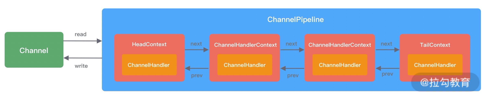

对于 Netty 中责任链模式的实现，也遵循了责任链模式的四个基本要素：

### 责任处理器接口

ChannelHandler 对应的就是责任处理器接口，ChannelHandler 有两个重要的子接口：ChannelInboundHandler和ChannelOutboundHandler，分别拦截入站和出站的各种 I/O 事件。

### 动态创建责任链，添加、删除责任处理器

ChannelPipeline 负责创建责任链，其内部采用双向链表实现，ChannelPipeline 的内部结构定义如下所示：

```java
public class DefaultChannelPipeline implements ChannelPipeline {
    static final InternalLogger logger = InternalLoggerFactory.getInstance(DefaultChannelPipeline.class);
    private static final String HEAD_NAME = generateName0(HeadContext.class);
    private static final String TAIL_NAME = generateName0(TailContext.class);
    // 省略其他代码
    final AbstractChannelHandlerContext head; // 头结点
    final AbstractChannelHandlerContext tail; // 尾节点
    private final Channel channel;
    private final ChannelFuture succeededFuture;
    private final VoidChannelPromise voidPromise;
    private final boolean touch = ResourceLeakDetector.isEnabled();

    // 省略其他代码
}
```

ChannelPipeline 提供了一系列 add 和 remove 相关接口用于动态添加和删除 ChannelHandler 处理器，如下所示：

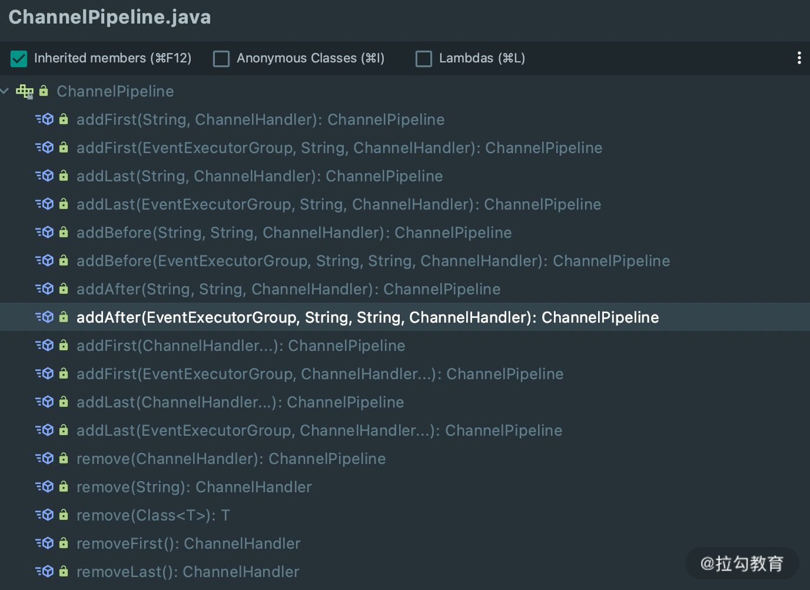

### 上下文

从 ChannelPipeline 内部结构定义可以看出，ChannelHandlerContext 负责保存责任链节点上下文信息。ChannelHandlerContext 是对 ChannelHandler 的封装，每个 ChannelHandler 都对应一个 ChannelHandlerContext，实际上 ChannelPipeline 维护的是与 ChannelHandlerContext 的关系。

### 责任传播和终止机制

ChannelHandlerContext 提供了 fire 系列的方法用于事件传播，如下所示：

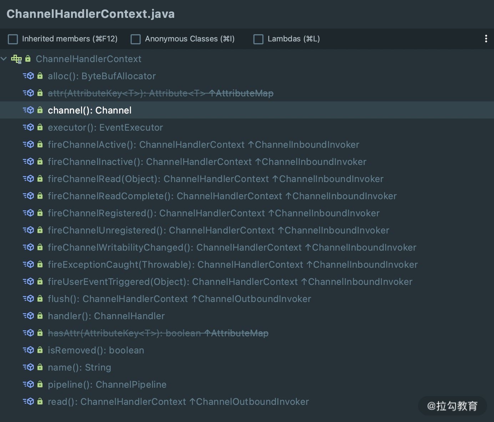

以 ChannelInboundHandlerAdapter 的 channelRead 方法为例，ChannelHandlerContext 会默认调用 fireChannelRead 方法将事件默认传递到下一个处理器。如果我们重写了 ChannelInboundHandlerAdapter 的 channelRead 方法，并且没有调用 fireChannelRead 进行事件传播，那么表示此次事件传播已终止。

## 观察者模式

观察者模式有两个角色：观察者和被观察。被观察者发布消息，观察者订阅消息，没有订阅的观察者是收不到消息的。首先我们通过一个简单的例子看下观察者模式的是如何实现的。

```java
// 被观察者
public interface Observable {
    void registerObserver(Observer observer);
    void removeObserver(Observer observer);
    void notifyObservers(String message);
}
// 观察者
public interface Observer {
    void notify(String message);
}
// 默认被观察者实现
public class DefaultObservable implements Observable {
    private final List<Observer> observers = new ArrayList<>();
    @Override
    public void registerObserver(Observer observer) {
        observers.add(observer);
    }
    @Override
    public void removeObserver(Observer observer) {
        observers.remove(observer);
    }
    @Override
    public void notifyObservers(String message) {
        for (Observer observer : observers) {
            observer.notify(message);
        }
    }
}
```

Netty 中观察者模式的运用非常多，但是并没有以上示例代码这么直观，我们平时经常使用的ChannelFuture#addListener 接口就是观察者模式的实现。我们先来看下 ChannelFuture 使用的示例：

```java
ChannelFuture channelFuture = channel.writeAndFlush(object);
channelFuture.addListener(future -> {
    if (future.isSuccess()) {
        // do something
    } else {
        // do something
    }
});
```

addListener 方法会将添加监听器添加到 ChannelFuture 当中，并在 ChannelFuture 执行完毕的时候立刻通知已经注册的监听器。所以 ChannelFuture 是被观察者，addListener 方法用于添加观察者。

## 建造者模式

建造者模式非常简单，通过链式调用来设置对象的属性，在对象属性繁多的场景下非常有用。建造者模式的优势就是可以像搭积木一样自由选择需要的属性，并不是强绑定的。对于使用者来说，必须清楚需要设置哪些属性，在不同场景下可能需要的属性也是不一样的。

Netty 中 ServerBootStrap 和 Bootstrap 引导器是最经典的建造者模式实现，在构建过程中需要设置非常多的参数，例如配置线程池 EventLoopGroup、设置 Channel 类型、注册 ChannelHandler、设置 Channel 参数、端口绑定等。ServerBootStrap 引导器的具体使用可以参考《引导器作用：客户端和服务端启动都要做些什么？》课程，在此我就不多作赘述了。

## 策略模式

策略模式针对同一个问题提供多种策略的处理方式，这些策略之间可以相互替换，在一定程度上提高了系统的灵活性。策略模式非常符合开闭原则，使用者在不修改现有系统的情况下选择不同的策略，而且便于扩展增加新的策略。

Netty 在多处地方使用了策略模式，例如 EventExecutorChooser 提供了不同的策略选择 NioEventLoop，newChooser() 方法会根据线程池的大小是否是 2 的幂次，以此来动态的选择取模运算的方式，从而提高性能。EventExecutorChooser 源码实现如下所示：

```java
public final class DefaultEventExecutorChooserFactory implements EventExecutorChooserFactory {
    public static final DefaultEventExecutorChooserFactory INSTANCE = new DefaultEventExecutorChooserFactory();
    private DefaultEventExecutorChooserFactory() { }
    @SuppressWarnings("unchecked")
    @Override
    public EventExecutorChooser newChooser(EventExecutor[] executors) {
        if (isPowerOfTwo(executors.length)) {
            return new PowerOfTwoEventExecutorChooser(executors);
        } else {
            return new GenericEventExecutorChooser(executors);
        }
    }

    // 省略其他代码
}
```

## 装饰者模式

装饰器模式是对被装饰类的功能增强，在不修改被装饰类的前提下，能够为被装饰类添加新的功能特性。当我们需要为一个类扩展功能时会使用装饰器模式，但是该模式的缺点是需要增加额外的代码。我们先通过一个简单的例子学习下装饰器模式应当如何使用，如下所示：

```java
public interface Shape {
    void draw();
}
class Circle implements Shape {
    @Override
    public void draw() {
        System.out.print("draw a circle.");
    }
}
abstract class ShapeDecorator implements Shape {
    protected Shape shapeDecorated;
    public ShapeDecorator(Shape shapeDecorated) {
        this.shapeDecorated = shapeDecorated;
    }
    public void draw() {
        shapeDecorated.draw();
    }
}
class FillReadColorShapeDecorator extends ShapeDecorator {
    public FillReadColorShapeDecorator(Shape shapeDecorated) {
        super(shapeDecorated);
    }
    @Override
    public void draw() {
        shapeDecorated.draw();
        fillColor();
    }
    private void fillColor() {
        System.out.println("Fill Read Color.");
    }
}
```

我们创建了一个 Shape 接口的抽象装饰类 ShapeDecorator，并维护 Shape 原始对象，FillReadColorShapeDecorator 是用于装饰 ShapeDecorator 的实体类，它不对 draw() 方法做任何修改，而是直接调用 Shape 对象原有的 draw() 方法，然后再调用 fillColor() 方法进行颜色填充。

下面我们再来看一下 Netty 中 WrappedByteBuf 是如何装饰 ByteBuf 的，源码如下所示：

```java
class WrappedByteBuf extends ByteBuf {
    protected final ByteBuf buf;
    protected WrappedByteBuf(ByteBuf buf) {
        if (buf == null) {
            throw new NullPointerException("buf");
        }
        this.buf = buf;
    }
    @Override
    public final boolean hasMemoryAddress() {
        return buf.hasMemoryAddress();
    }
    @Override
    public final long memoryAddress() {
        return buf.memoryAddress();
    }

    // 省略其他代码
}
```

WrappedByteBuf 是所有 ByteBuf 装饰器的基类，它并没有什么特别的，也是在构造函数里传入了原始的 ByteBuf 实例作为被装饰者。WrappedByteBuf 有两个子类 UnreleasableByteBuf 和 SimpleLeakAwareByteBuf，它们是真正实现对 ByteBuf 的功能增强，例如 UnreleasableByteBuf 类的 release() 方法是直接返回 false 表示不可被释放，源码实现如下所示。

```java
final class UnreleasableByteBuf extends WrappedByteBuf {
    private SwappedByteBuf swappedBuf;
    UnreleasableByteBuf(ByteBuf buf) {
        super(buf instanceof UnreleasableByteBuf ? buf.unwrap() : buf);
    }
    @Override
    public boolean release() {
        return false;
    }
    // 省略其他代码
}
```

不知道你会不会有一个疑问，装饰器模式和代理模式都是实现目标类增强，他们有什么区别吗？装饰器模式和代理模式的实现确实是非常相似的，都需要维护原始的目标对象，装饰器模式侧重于为目标类增加新的功能，代理模式更侧重于在现有功能的基础上进行扩展。

## 总结

学习设计模式切勿死记硬背，不仅要吸收设计模式的思想，还要理解为什么使用该设计模式。锻炼代码设计能力比较好的办法就是读优秀框架的源码，Netty 就是一个非常丰富的学习资源。我们需要了解源码中设计模式的使用场景，不断吸收消化，并能够做到在项目开发中学以致用。

本节课所介绍的设计模式在 Netty 中并不能涵盖所有，还有很多等待我们去挖掘。留一个课后任务，学习以下设计模式在 Netty 中的运用。

*   模板方法模式：ServerBootStrap 和 Bootstrap 的 init 过程实现；
*   迭代器模式：CompositeByteBuf；
*   适配器模式：ScheduledFutureTask。

30 实践总结：Netty 在项目开发中的一些最佳实践
===========================

这是专栏的最后一节课，首先恭喜你持之以恒学习到现在，你已经离成为一个 Netty 高手不远啦！本节课我会结合自身的实践经验，整理出一些 Netty 的最佳实践，帮助你回顾之前课程的知识点以及进一步提升 Netty 的进阶技巧。

本节课我们的内容以知识点列表的方式呈现，仅仅对 Netty 的核心要点进行提炼，更多详细的实现原理需要你课后深入研究源码。

## 性能篇

### 网络参数优化

Netty 提供了 ChannelOption 以便于我们优化 TCP 参数配置，为了提高网络通信的吞吐量，一些可选的网络参数我们有必要掌握。在之前的课程中我们已经介绍了一些常用的参数，我们在此基础上再做一些详细地扩展。

*   **SO\_SNDBUF/SO\_RCVBUF**

TCP 发送缓冲区和接收缓冲区的大小。为了能够达到最大的网络吞吐量，SO\_SNDBUF 不应当小于带宽和时延的乘积。SO\_RCVBUF 一直会保存数据到应用进程读取为止，如果 SO\_RCVBUF 满了，接收端会通知对端 TCP 协议中的窗口关闭，保证 SO\_RCVBUF 不会溢出。

SO\_SNDBUF/SO\_RCVBUF 大小的设置建议参考消息的平均大小，不要按照最大消息来进行设置，这样会造成额外的内存浪费。更灵活的方式是可以动态调整缓冲区的大小，这时候就体现出 ByteBuf 的优势，Netty 提供的 ByteBuf 是可以支持动态调整容量的，而且提供了开箱即用的工具，例如可动态调整容量的接收缓冲区分配器 AdaptiveRecvByteBufAllocator。

*   **TCP_NODELAY**

是否开启 Nagle 算法。Nagle 算法通过缓存的方式将网络数据包累积到一定量才会发送，从而避免频繁发送小的数据包。Nagle 算法 在海量流量的场景下非常有效，但是会造成一定的数据延迟。如果对数据传输延迟敏感，那么应该禁用该参数。

*   **SO_BACKLOG**

已完成三次握手的请求队列最大长度。同一时刻服务端可能会处理多个连接，在高并发海量连接的场景下，该参数应适当调大。但是 SO_BACKLOG 也不能太大，否则无法防止 SYN-Flood 攻击。

*   **SO_KEEPALIVE**

连接保活。启用了 TCP SO_KEEPALIVE 属性，TCP 会主动探测连接状态，Linux 默认设置了 2 小时的心跳频率。TCP KEEPALIVE 机制主要用于回收死亡时间交长的连接，不适合实时性高的场景。

在海量连接的场景下，也许你会遇到类似 "too many open files" 的报错，所以 Linux 操作系统最大文件句柄数基本是必须要调优参数。可以通过 vi /etc/security/limits.conf，添加如下配置：

```
* soft nofile 1000000
* hard nofile 1000000
```

修改保存以后，执行 sysctl -p 命令使配置生效，然后通过 ulimit -a 命令查看参数是否生效。

### 业务线程池的必要性

Netty 是基于 Reactor 线程模型实现的，I/O 线程数量固定且资源珍贵，ChannelPipeline 负责所有事件的传播，如果其中任何一个 ChannelHandler 处理器需要执行耗时的操作，其中那么 I/O 线程就会出现阻塞，甚至整个系统都会被拖垮。所以推荐的做法是在 ChannelHandler 处理器中自定义新的业务线程池，将耗时的操作提交到业务线程池中执行。以 RPC 框架为例，在服务提供者处理 RPC 请求调用时就是将 RPC 请求提交到自定义的业务线程池中执行，如下所示：

```java
public class RpcRequestHandler extends SimpleChannelInboundHandler<MiniRpcProtocol<MiniRpcRequest>> {
    @Override
    protected void channelRead0(ChannelHandlerContext ctx, MiniRpcProtocol<MiniRpcRequest> protocol) {
        RpcRequestProcessor.submitRequest(() -> {
            // 处理 RPC 请求
        });
    }
}
```

### 共享 ChannelHandler

我们经常使用以下 new HandlerXXX() 的方式进行 Channel 初始化，在每建立一个新连接的时候会初始化新的 HandlerA 和 HandlerB，如果系统承载了 1w 个连接，那么就会初始化 2w 个处理器，造成非常大的内存浪费。

```java
ServerBootstrap b = new ServerBootstrap();
b.group(bossGroup, workerGroup)
    .channel(NioServerSocketChannel.class)
    .localAddress(new InetSocketAddress(port))
    .childHandler(new ChannelInitializer<SocketChannel>() {
        @Override
        public void initChannel(SocketChannel ch) {
                                ch.pipeline()
                                    .addLast(new HandlerA())
                                    .addLast(new HandlerB());
                        }
                    });
```

为了解决上述问题，Netty 提供了 @Sharable 注解用于修饰 ChannelHandler，标识该 ChannelHandler 全局只有一个实例，而且会被多个 ChannelPipeline 共享。所以我们必须要注意的是，@Sharable 修饰的 ChannelHandler 必须都是无状态的，这样才能保证线程安全。

### 设置高低水位线

高低水位线 WRITE\_BUFFER\_HIGH\_WATER\_MARK 和 WRITE\_BUFFER\_LOW\_WATER\_MARK 是两个非常重要的流控参数。Netty 每次添加数据时都会累加数据的字节数，然后判断缓存大小是否超过所设置的高水位线，如果超过了高水位，那么 Channel 会被设置为不可写状态。直到缓存的数据大小低于低水位线以后，Channel 才恢复成可写状态。Netty 默认的高低水位线配置是 32K ~ 64K，可以根据发送端和接收端的实际情况合理设置高低水位线，如果你没有足够的测试数据作为参考依据，建议不要随意更改高低水位线。高低水位线的设置方式如下：

```java
// Server
ServerBootstrap bootstrap = new ServerBootstrap();
bootstrap.childOption(ChannelOption.WRITE_BUFFER_HIGH_WATER_MARK, 32 * 1024);
bootstrap.childOption(ChannelOption.WRITE_BUFFER_LOW_WATER_MARK, 8 * 1024);

// Client
Bootstrap bootstrap = new Bootstrap();
bootstrap.option(ChannelOption.WRITE_BUFFER_HIGH_WATER_MARK, 32 * 1024);
bootstrap.option(ChannelOption.WRITE_BUFFER_LOW_WATER_MARK, 8 * 1024);
```

当缓存超过了高水位，Channel 会被设置为不可写状态，调用 isWritable() 方法会返回 false。建议在 Channel 写数据之前，使用 isWritable() 方法来判断缓存水位情况，防止因为接收方处理较慢造成 OOM。推荐的使用方式如下：

```java
if (ctx.channel().isActive() && ctx.channel().isWritable()) {
    ctx.writeAndFlush(message);
} else {
    // handle message
}
```

### GC 参数优化

对不同场景下的网络应用程序进行 JVM 参数调优，可以取得很好的性能提升，以及避免 OOM 风险。因为不同业务系统的特性是不一样的，在此我只能给你分享一些重要的注意事项。

*   **堆内存**：-Xms 和 -Xmx 参数，-Xmx 用于控制 JVM Heap 的最大值，必须设置其大小，合理调整 -Xmx 有助于降低 GC 开销，提升系统吞吐量。-Xms 表示 JVM Heap 的初始值，对于生产环境的服务端来说 -Xms 和 -Xmx 最好设置为相同值。
*   **堆外内存**：DirectByteBuffer 最容易造成 OOM 的情况，DirectByteBuffer 对象的回收需要依赖 Old GC 或者 Full GC 才能触发清理。如果长时间没有 Old GC 或者 Full GC 执行，那么堆外内存即使不再使用，也会一直在占用内存不释放。我们最好通过 JVM 参数 -XX:MaxDirectMemorySize 指定堆外内存的上限大小，当堆外内存的大小超过该阈值时，就会触发一次 Full GC 进行清理回收，如果在 Full GC 之后还是无法满足堆外内存的分配，那么程序将会抛出 OOM 异常。
*   **年轻代**：-Xmn 调整新生代大小，-XX:SurvivorRatio 设置 SurvivorRatio 和 eden 区比例。我们经常遇到 YGC 频繁的情况，应该清楚程序中对象的基本分布情况，如果存在大量朝生夕灭的对象，应适当调大新生代；反之应适当调大老年代。例如在类似百万长连接、推送服务等延迟敏感的场景中，老年代的内存增长缓慢，优化年轻代的空间大小以及各区的比例可以带来更大的收益。

### 内存池 & 对象池

从内存分配的角度来看，ByteBuf 可以分为堆内存 HeapByteBuf 和堆外内存 DirectByteBuf。DirectByteBuf 相比于 HeapByteBuf，虽然分配和回收的效率较慢，但是在 Socket 读写时可以少一次内存拷贝，性能更佳。

为了减少堆外内存的频繁创建和销毁，Netty 提供了池化类型的 PooledDirectByteBuf。Netty 提前申请一块连续内存作为 ByteBuf 内存池，如果有堆外内存申请的需求直接从内存池里获取即可，使用完之后必须重新放回内存池，否则会造成严重的内存泄漏。Netty 中启用内存池可以在创建客户端或者服务端的时候指定，示例代码如下：

```java
bootstrap.option(ChannelOption.ALLOCATOR, PooledByteBufAllocator.DEFAULT);
bootstrap.childOption(ChannelOption.ALLOCATOR, PooledByteBufAllocator.DEFAULT);
```

对象池与内存池的都是为了提高 Netty 的并发处理能力，通常在项目开发中我们会将一些通用的对象缓存起来，当需要该对象时，优先从对象池中获取对象实例。通过重用对象，不仅避免频繁地创建和销毁所带来的性能损耗，而且对 JVM GC 是友好的。如果你是一个高性能的网络应用系统，不妨试下 Netty 提供的 Recycler 对象池。Recycler 对象池如何使用在之前的课程有介绍过，在此我们一起回顾下。假设我们有一个 User 类，需要实现 User 对象的复用，具体实现代码如下：

```java
public class UserCache {
    private static final Recycler<User> userRecycler = new Recycler<User>() {
        @Override
        protected User newObject(Handle<User> handle) {
            return new User(handle);
        }
    };
    static final class User {
        private String name;
        private Recycler.Handle<User> handle;
        public void setName(String name) {
            this.name = name;
        }
        public String getName() {
            return name;
        }
        public User(Recycler.Handle<User> handle) {
            this.handle = handle;
        }
        public void recycle() {
            handle.recycle(this);
        }
    }
    public static void main(String[] args) {
            User user1 = userRecycler.get(); // 1、从对象池获取 User 对象
        user1.setName("hello"); // 2、设置 User 对象的属性
        user1.recycle(); // 3、回收对象到对象池
        User user2 = userRecycler.get(); // 4、从对象池获取对象
        System.out.println(user2.getName());
        System.out.println(user1 == user2);
    }
}
```

由此可见，Netty 内存池和 Recycler 对象池优化的核心目标都是为了减少资源分配的开销，避免大量朝生夕灭的对象造成严重的内存消耗和 GC 压力。关于内存池和对象池的原理可以复习下之前课程《举一反三：Netty 高性能内存管理设计》《轻量级对象回收站：Recycler 对象池技术解析》，值得我们反复消化理解。

### Native 支持

从 4.0.16 版本起，Netty 提供了用 C++ 编写 JNI 调用的 Socket Transport，相比 JDK NIO 具备更高的性能和更低的 GC 成本，并且支持更多的 TCP 参数。

```xml
<dependency>
    <groupId>io.netty</groupId>
    <artifactId>netty-transport-native-epoll</artifactId>
    <version>4.1.42.Final</version>
</dependency>
```

使用 Netty Native 非常简单，只需要替换相应的类即可：


### 线程绑定

如果是经常关注系统性能调优，一定挖掘过 Linux 操作系统 CPU 亲和性的黑科技招数。CPU 亲和性是指在多核 CPU 的机器上线程可以被强制运行在某个 CPU 上，而不会调度到其他 CPU，也被称为绑核。当绑定线程到某个固定的 CPU 后，不仅可以避免 CPU 切换的开销，而且可以提高 CPU Cache 命中率，对系统性能有一定提升。

在 C/C++、Golang 中实现绑核操作是非常容易的事，遗憾的是在 Java 中是比较麻烦的。目前 Java 中有一个开源 affinity 类库，GitHub 地址[https://github.com/OpenHFT/Java-Thread-Affinity](https://github.com/OpenHFT/Java-Thread-Affinity)。如果你的项目想引入使用它，需要先引入 Maven 依赖：

```xml
<dependency>
    <groupId>net.openhft</groupId>
    <artifactId>affinity</artifactId>
    <version>3.0.6</version>
</dependency>
```

affinity 类库可以和 Netty 轻松集成，比较常用的方式是创建一个 AffinityThreadFactory，然后传递给 EventLoopGroup，AffinityThreadFactory 负责创建 Worker 线程并完成绑核。代码实现如下所示：

```java
EventLoopGroup bossGroup = new NioEventLoopGroup(1);
ThreadFactory threadFactory = new AffinityThreadFactory("worker", AffinityStrategies.DIFFERENT_CORE);
EventLoopGroup workerGroup = new NioEventLoopGroup(4, threadFactory);
ServerBootstrap serverBootstrap = new ServerBootstrap().group(bossGroup, workerGroup);
```

## 高可用篇

### 连接空闲检测 \+ 心跳检测

连接空闲检测是指每隔一段时间检测连接是否有数据读写，如果服务端一直能收到客户端连接发送过来的数据，说明连接处于活跃状态，对于假死的连接是收不到对端发送的数据的。如果一段时间内没收到客户端发送的数据，并不能说明连接一定处于假死状态，有可能客户端就是长时间没有数据需要发送，但是建立的连接还是健康状态，所以服务端还需要通过心跳检测的机制判断客户端是否存活。

客户端可以定时向服务端发送一次心跳包，如果有 N 次没收到心跳数据，可以判断当前客户端已经下线或处于不健康状态。由此可见，连接空闲检测和心跳检测是应对连接假死的一种有效手段，通常空闲检测时间间隔要大于 2 个周期的心跳检测时间间隔，主要是为了排除网络抖动的造成心跳包未能成功收到。

TCP 中已经有 SO_KEEPALIVE 参数，为什么我们还要在应用层加入心跳机制呢？心跳机制不仅能说明应用程序是活跃状态，更重要的是可以判断应用程序是否还在正常工作。然而 TCP KEEPALIVE 是有严重缺陷的，KEEPALIVE 设计初衷是为了清除和回收处于死亡状态的连接，实时性不高。KEEPALIVE 只能检查连接是否活跃，但是不能判断连接是否可用，例如服务端如果处于高负载假死状态，但是连接依然是处于活跃状态的。

### 解码器保护

Netty 在实现数据解码时，需要等待到缓冲区有足够多的字节才能开始解码。为了避免缓冲区缓存太多数据造成内存耗尽，我们可以在解码器中设置一个最大字节的阈值，然后结合 Netty 提供的 TooLongFrameException 异常通知 ChannelPipeline 中其他 ChannelHandler。示例如下：

```java
public class MyDecoder extends ByteToMessageDecoder {
    private static final int MAX_FRAME_LIMIT = 1024;
    @Override
    public void decode(ChannelHandlerContext ctx, ByteBuf in, List<Object> out) {
        int readable = in.readableBytes();
        if (readable > MAX_FRAME_LIMIT) {
            in.skipBytes(readable);
            throw new TooLongFrameException("too long frame");
        }
        // decode
    }
}
```

检测缓冲区可读字节是否大于 MAX\_FRAME\_LIMIT，如果超过忽略这些可读字节，对于应用程序在特定的场景下是一种有效的保护措施。

### 线程池隔离

我们知道，如果有复杂且耗时的业务逻辑，推荐的做法是在 ChannelHandler 处理器中自定义新的业务线程池，将耗时的操作提交到业务线程池中执行。建议根据业务逻辑的核心等级拆分出多个业务线程池，如果某类业务逻辑出现异常造成线程池资源耗尽，也不会影响到其他业务逻辑，从而提高应用程序整体可用率。对于 Netty I/O 线程来说，每个 EventLoop 可以与某类业务线程池绑定，避免出现多线程锁竞争。如下图所示：

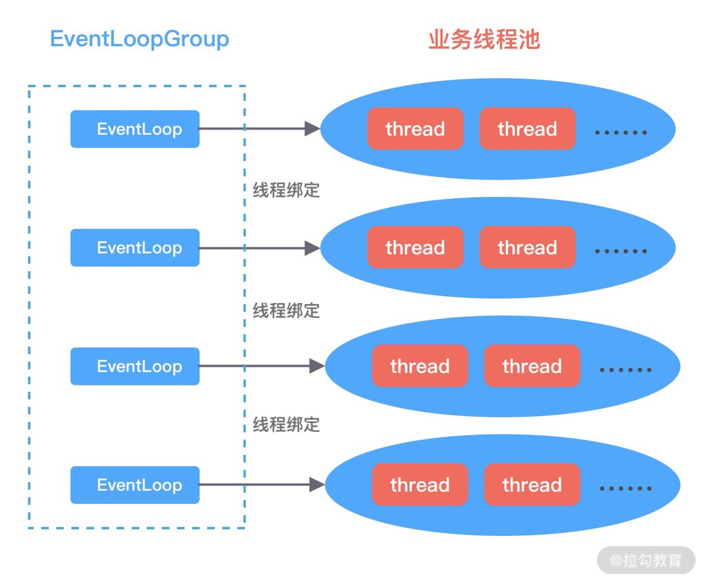

### 流量整形

流量整形（Traffic Shaping）是一种主动控制服务流量输出速率的措施，保证下游服务能够平稳处理。流量整形和流控的区别在于，流量整形不会丢弃和拒绝消息，无论流量洪峰有多大，它都会采用令牌桶算法控制流量以恒定的速率输出，如下图所示。


Netty 通过实现流量整形的抽象类 AbstractTrafficShapingHandler，提供了三种类型的流量整形策略：GlobalTrafficShapingHandler、ChannelTrafficShapingHandler 和 GlobalChannelTrafficShapingHandler，它们之间的关系如下：

```java
GlobalTrafficShapingHandler = ChannelTrafficShapingHandler + GlobalChannelTrafficShapingHandler
```

全局流量整形 GlobalChannelTrafficShapingHandler 作用范围是所有 Channel，用户可以设置全局报文的接收速率、发送速率、整形周期。Channel 级流量整形 ChannelTrafficShapingHandler 作用范围是单个 Channel，可以对不同的 Channel 设置流量整形策略。举个简单的例子，火爆的旅游景区不仅在大门口对游客限流（相当于 GlobalChannelTrafficShapingHandler），而且在景区内部不同的小景点也对游客有限流（相当于 ChannelTrafficShapingHandler），这两个流量整形策略加起来就是 GlobalTrafficShapingHandler。

流量整形并不能保证系统处于安全状态，当流量洪峰过大，数据会一直积压在内存中，所以流量整形和流控应该结合使用才能保证系统的高可用。

## 堆外内存泄漏排查思路

堆外内存泄漏问题是 Netty 应用程序的热点问题，经常遇到 Java 进程占用内存很高，但是堆内存并不高的情况。这里给你分享一些排查堆外内存泄漏的基本思路：

### 堆外内存回收

jmap -histo:live `<pid>` 手动触发 FullGC, 观察堆外内存是否被回收，如果正常回收很可能是因为堆外设置太小，可以通过 -XX:MaxDirectMemorySize 调整。当然这无法排除堆外内存缓慢泄漏的情况，需要借助其他工具进行分析。

### 堆外内存代码监控

前面的课程我们介绍过堆外内存回收原理，建议你再回过头复习下。JDK 默认采用 Cleaner 回收释放 DirectByteBuffer，Cleaner 继承于 PhantomReference，因为依赖 GC 进行处理，所以回收的时间是不可控的。对于 hasCleaner 的 DirectByteBuffer，Java 提供了一系列不同类型的 MXBean 用于获取 JVM 进程线程、内存等监控指标，代码实现如下：

```java
BufferPoolMXBean directBufferPoolMXBean = ManagementFactory.getPlatformMXBeans(BufferPoolMXBean.class).get(0);
LOGGER.info("DirectBuffer count: {}, MemoryUsed: {} K", directBufferPoolMXBean.getCount(), directBufferPoolMXBean.getMemoryUsed()/1024);
```

对于 Netty 中 noCleaner 的 DirectByteBuffer，直接通过 PlatformDependent.usedDirectMemory() 读取即可。

### Netty 自带检测工具

Netty 提供了自带的内存泄漏检测工具，我们可以通过以下命令启用堆外内存泄漏检测工具：

```shell
-Dio.netty.leakDetection.level=paranoid
```

Netty 一共提供了四种检测级别：

1.  disabled，关闭堆外内存泄漏检测；
2.  simple，以 1% 的采样率进行堆外内存泄漏检测，消耗资源较少，属于默认的检测级别；
3.  advanced，以 1% 的采样率进行堆外内存泄漏检测，并提供详细的内存泄漏报告；
4.  paranoid，追踪全部堆外内存的使用情况，并提供详细的内存泄漏报告，属于最高的检测级别，性能开销较大，常用于本地调试排查问题。

Netty 会检测 ByteBuf 是否已经不可达且引用计数大于 0，判定内存泄漏的位置并输出到日志中，你需要关注日志中 LEAK 关键字。

### MemoryAnalyzer 内存分析

我们可以通过传统 Dump 内存的方法排查堆外内存泄漏问题，运行如下命令：

```shell
jmap -dump:format=b,file=heap.dump pid
```

Dump 完内存堆栈之后，将其导入 MemoryAnalyzer 工具进行分析内存泄漏的可疑点，最终定位到代码源头。关于如何 MemoryAnalyzer 工具我在此就不展开了，需要你自行学习研究，这是每一个 Java 程序员的必备技能。

### Btrace 神器

Btrace 是一款通过字节码检测 Java 程序的排障神器，它可以获取程序在运行过程中的一切信息，与 AOP 的使用方式类似。我们可以通过如下方式追踪 DirectByteBuffer 的堆外内存申请的源头：

```java
@BTrace
public class TraceDirectAlloc {
    @OnMethod(clazz = "java.nio.Bits", method = "reserveMemory")
    public static void printThreadStack() {
        jstack();
    }
}
```

### 二分排查法：笨方法解决大问题

堆外内存泄漏问题有时候非常隐蔽，并不是很容易定位发现。为了提高问题排查的效率，我们最好能够在本地模拟复现出堆外内存泄漏问题，如果本地能够成功复现，那么已经成功了一半了。

我们可以根据近期代码变更的记录，通过二分法对代码进行回滚，然后再次尝试是否可以复现出堆外内存泄漏问题，最终可以定位出有问题的代码 commit。该思路虽然是一种笨方法，但是很多场景下可以有效解决问题。

## 总结

以上都是项目实践中的一些重要技巧，对于我们上手 Netty 应用程序开发已经足够使用，还有更多 Netty 的技巧和使用心得需要我们去自己在实践中探索。纸上得来终觉浅，绝知此事要躬行，当你积累了丰富的经验，不管是项目开发还是问题排障，都会越来越得心应手。

31 结束语 技术成长之路：如何打造自己的技术体系
=========================

时间飞逝，不知不觉整个专栏这节课就结束了。首先感谢你一路陪伴和支持，整个专栏的过程对我来说也是一段难忘的经历，希望专栏的内容能够让你有所收获。读完本专栏，我们就能够立刻变成一个 Netty 高手了吗？答案是 NO。Netty 的知识体系非常庞大，需要我们花时间去慢慢消化，并在不断实践中总结，也许在不同时间段你对 Netty 的理解会更加深刻。

相信你在刚开始学习一门技术的时候，多多少少都会遇到一些困难，例如方向不清晰，容易陷入死胡同。我们需要认真地思考如何规划最优的学习路线？如何打造该领域的技术体系？如何能够高效率地执行落地？

## 体系化：目标制定与执行

在学习一门技术之前我都会问自己几个问题：

1.  该技术能够解决什么问题，可以提升我的哪些能力？
2.  短期目标和长期目标是什么？
3.  我需要做哪些事情可以实现目标？

现在获取知识的成本非常低，通过官方文档、博客等渠道我们都可以快速了解一门技术的概貌。当你下定决心深入研究这门技术的时候，最重要的是制定自己的学习计划。以 Netty 为例，因为刚开始我们对 Netty 不是特别了解，但是应该大概知道 Netty 有哪些重要的概念、特性需要去深入学习，先将这些重要的内容列入我们的学习计划，然后制定一个周期（例如一个星期）学习计划表。在学习的过程中，我们会对 Netty 的理解越发深入，发现有更多的知识点需要去挖掘，此时我们可以再去调整和完善学习计划。就像一个大树的成长过程一样，首先要抓住目标主干，然后再学习分支的知识点，由点到线、线到面不断自我探索和建立自己的技术体系。

明确自己的学习方向后，实现自己学习目标的途径有非常多，项目实战、源码学习、写博客、参加社区等途径都是非常有效的办法。重要的是持之以恒地坚持下去，切忌急于求成或者半途而废。每隔一段时间我们应当回顾下自己的学习计划是否有效，我是否坚持完成了所有事情？如果达成阶段性的成果，可以适当奖励下自己，一定要让自己充满成就感。

## 善于思考和总结

在学习一门技术的时候，大部分人都只是停留在会使用的层面，并不知道该技术到底能够解决什么问题，相比同领域的其他技术有什么优缺点。我们刚开始不可能一下看清楚问题的本质，需要不断在学习中思考，积累实践经验，然后慢慢总结自己的见解。一名优秀的技术人可以从技术原理中去了解问题本质，然后找到问题的解决防范，也让结果更有说服力。学会从优秀的开源项目中挖掘技术原理对我们是非常有帮助的，起码在面对问题的时候可以让我们思路更加开阔，处理问题更加得心应手。

从技术的角度来说，我们一定要培养自己多维度的思考习惯，而不是停留在表面，这样永远都进步不了。一个方案、一个问题、一个功能都可能需要考虑到多种因素，如果我们能够把方方面面都考虑得非常细致，那么也会让自己做事更有技术深度、更具备全面性。在工作中，我们经常会得到别人大量的信息，看别人的观点和学习别人的方案，吸收值得学习的地方，再总结出自己的独特的思考。用多个维度去看待问题，有时候别人的观点并不一定是对的。

## 乐于交流与分享

交流与分享是检验自己学习成果非常有效的方法，例如团队或者公司的技术分享、撰写书籍、博客等都是沉淀知识的绝佳途径。交流与分享不仅可以有机会让我们梳理自己的知识体系，让知识变得更加牢固，而且可以让众人来检验自己对知识的理解是否正确。人外有人，天外有天，避免自己陷入技术人自满的状态。

我相信“会”一门技术并不等于你“会教”一门技术，把自己会的东西分享出来远比学习的过程更加困难。交流与分享需要我们更具备勇气，分享知识是获取勇气的一种方式，不要害怕自己会出错而退缩，也不要为了证明自己“很懂”而去与别人交流，虚心向他人学习，帮助团队成长，每次交流与分享让自己收获满满就足够了。

## 最后

路漫漫其修远兮，吾将上下而求索。我们不是天才，更不可能一蹴而就，成长需要时间的积累，整个过程需要我们不断学习、思考和总结。保持好奇心和热情，抛弃浮躁，相信我们都能成就更好的自己。最后的最后，还是要感谢你的支持和建议，欢迎填写这份调查问卷，还请你留下宝贵的意见和建议。也欢迎给我留言，咱们后会有期！
