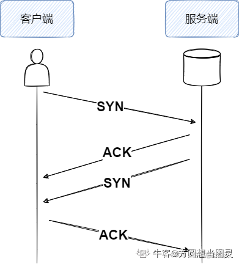
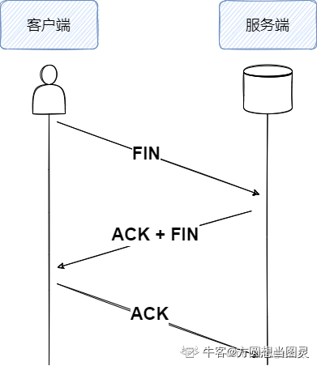
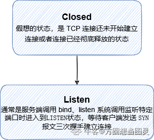
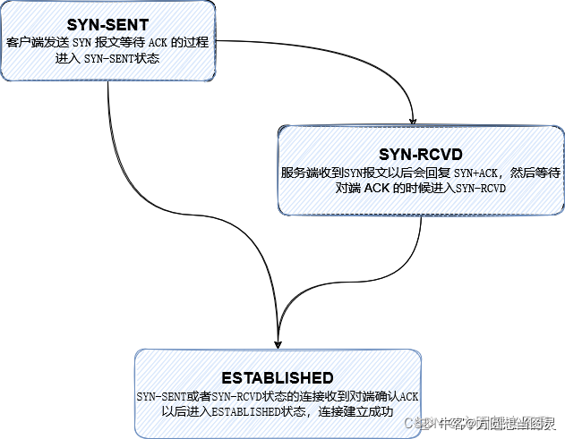
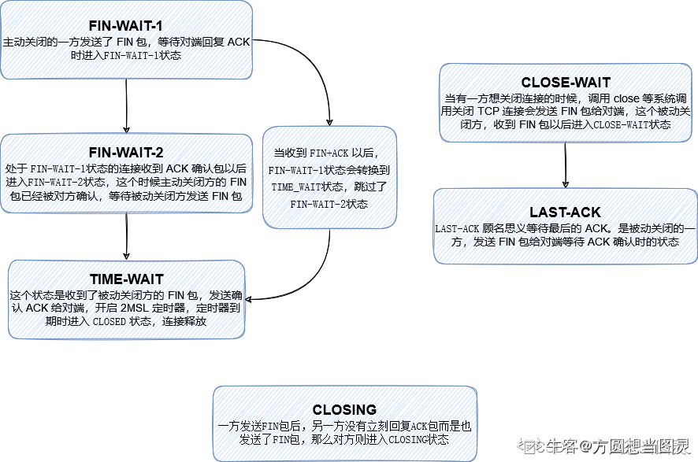

1\. 写在前头
--------

大家好，我是`方圆`。这个时间大家应该开始陆续的投简历奋战[春招](/jump/super-jump/word?word=%E6%98%A5%E6%8B%9B)了，`希望大家顺利`。最近读完了电子书`《深入理解TCP协议：从原理到实战》`，它写的很深，不是一本容易啃完、啃透的书，如果大家在平时不忙的时候，欢迎去读一读，一定会有收获，我也借此重新整理了一下TCP相关的[面经](/jump/super-jump/word?word=%E9%9D%A2%E7%BB%8F)和高频知识点，它不一定全也可能出现错误，非常希望大家能够补充和勘误！

* * *

2\. TCP相关[面经](/jump/super-jump/word?word=%E9%9D%A2%E7%BB%8F)和高频知识点
------------------------------------------------------------------

> 以下知识点的思路是`从TCP概念的四个点逐点深挖`，不知道大家读完能不能有所体会：为什么这么写

*   TCP是`可靠的`、`面向连接的`、`基于字节流的`、`全双工的`传输层协议

1.  为什么是`可靠的`？  
    1 使用`检验和`来验证传输报文中的错误  
    2 使用定时器来进行`超时重传`  
    3 使用`序列号`来检测乱序、丢失和冗余，使用确认应答报文使发送方确认收到信息  
    4 TCP使用`流量控制`和`拥塞控制`来保证可靠性

*   什么是`流量控制`？  
    TCP会把要发送的数据放入`发送缓冲区`，接收到的数据放入`接收缓冲区`，流量控制做的就是，`根据`接收缓冲区的接收能力（剩余可接收数据的空间），`调节`发送端发送数据的滑动窗口大小，`使得发送方的发送速率与接收方的接收速率相匹配`，流量控制是`基于发送端和接收端的控制机制`  
    （TCP 在收到数据包回复的 ACK 报文里会带上自己接收窗口的大小，接收端需要根据这个值调整自己的发送策略）
    
*   如果`发送方的滑动窗口变为0了`，那么它之后怎么确定它又能向接收端发送数据了呢？  
    TCP设计了`零窗口探测的机制`，用来向接收端探测接收窗口的大小，在接收端有接收能力的时候就能再次发送数据了
    
*   什么是`零窗口探测机制`？  
    零窗口探测机制是发送端会发送一个`零窗口探测的包`，其实就是一个ACK报文，以此来知悉接收方是否具备接收能力
    
*   什么是`拥塞控制`？  
    拥塞控制是`基于整个网络的通信情况`，在网络中对资源的请求超过资源可用量的情况叫拥塞（吞吐量小于理想吞吐量），TCP的发送方会根据在目的路径之间没什么拥塞而增加发送速率，若有拥塞则降低发送速率。通过超时或连续接收到3个冗余的ACK报文来判断拥塞，发送速率由拥塞窗口来控制。拥塞控制涉及`慢启动`、`拥塞避免`、`快重传`、`快恢复`四种[算法](/jump/super-jump/word?word=%E7%AE%97%E6%B3%95)，它的本质是`控制拥塞窗口的变化`
    
*   什么是`拥塞窗口`？  
    拥塞窗口指的是`在收到对端 ACK 之前`自己还能传输的[最大数](/jump/super-jump/word?word=%E6%9C%80%E5%A4%A7%E6%95%B0)据量大小，这里要与`滑动窗口`区分开，滑动窗口的大小是根据接收到的对端ACK报文中接收窗口的大小来指定的
    
*   那么真正的`发送窗口大小`是取决于滑动窗口的大小还是拥塞窗口的大小？  
    取的是两者间的最小值，如果滑动窗口比拥塞窗口小，表示接收端处理能力不够；如果拥塞窗口小于滑动窗口，表示接收端处理能力 ok，但网络拥塞
    
*   说说拥塞控制的`四个[算法](/jump/super-jump/word?word=%E7%AE%97%E6%B3%95)`吧  
    发送方维护一个叫做拥塞窗口的状态变量Cwnd，其值取决于网络拥塞程度，动态变化，慢启动[算法](/jump/super-jump/word?word=%E7%AE%97%E6%B3%95)阈值ssthresh，发送窗口大小Swnd  
    `慢启动[算法](/jump/super-jump/word?word=%E7%AE%97%E6%B3%95)`：发送窗口大小 = 拥塞窗口大小（一个较小的值MSS），随着双方通信，收到确认应答报文，拥塞窗口指数级增长，超过慢开始阈值后，使用拥塞避免[算法](/jump/super-jump/word?word=%E7%AE%97%E6%B3%95)  
    `拥塞避免[算法](/jump/super-jump/word?word=%E7%AE%97%E6%B3%95)`：拥塞窗口随着传输轮次增大，当cwnd > ssthresh，拥塞窗口的大小呈线性增长  
    `快重传[算法](/jump/super-jump/word?word=%E7%AE%97%E6%B3%95)`：在传输过程中有报文丢失，发送方累计连续3次收到重复确认报文，就将相应的报文段立即重传，而不是在该报文段的超时重传计时器超时重传  
    `快恢复[算法](/jump/super-jump/word?word=%E7%AE%97%E6%B3%95)`：当收到三次重复确认报文后，进入快恢复阶段。拥塞窗口大小 cwnd 设置为 ssthresh，将拥塞阈值 ssthresh 降低为 cwnd 的一半，再进行线性增长
    

2.  什么是`面向连接的`？  
    在正式发送请求数据之前需要通过`三次握手建立连接`，结束通信通过`四次挥手断开连接`

*   什么是三次握手？  
    `第一次握手`：客户端发送SYN报文，并且会随机选择一个数字作为初始化的序列号，请求建立连接  
    `第二次握手`：服务端收到客户端的SYN报文后，也会发送一个SYN报文，并随机生成初始化序列号，同时还会发送客户端SYN报文对应的ACK确认应答报文给客户端，其中ACK报文中的确认号等于客户端序列号加一  
    `第三次握手`：客户端收到服务端的SYN报文后，还要发送ACK确认应答报文给服务器，其确认号等于服务端序列号加一，三次握手完成，双方建立连接
    
*   为什么序列号`是随机生成的而不是从0开始`？  
    出于安全性考虑。如果被知道了连接的序列号，很容易伪造 RST 包，这样就可以将连接强制关闭掉了。如果采用动态增长的 ISN，要想构造一个在对方窗口内的序列号难度就大很多了
    
*   `为什么要三次握手才能建立连接`？  
    1 防止已经失效的连接请求报文传送到服务器产生脏连接  
    2 为了实现可靠的数据传输，TCP连接双方都需要维护一个序列号，若是两次握手的话，服务端发送的序列号得不到确认（客户端可以接收到序列号，但是没有确认收到的回应发送给服务器）
    
*   那么能`四次握手`吗？  
    可以，将服务器的第二次握手拆成两次，一次发送客户端的确认应答ACK报文，另一次发送SYN数据报文，这样就变成了四次握手  
    
    
*   什么是四次挥手？  
    `第一次挥手`：客户端向服务器发送一个FIN终止连接报文，从这以后客户端不再发送数据给服务端，但是能接受服务端的数据，客户端进入FIN-WAIT-1状态  
    `第二次挥手`：服务器收到该报文后，发送给客户端一个ACK确认报文，服务端进入CLOSE_WAIT状态，客户端收到 ACK 以后进入FIN-WAIT-2状态  
    `第三次挥手`：服务端在发送完数据，准备释放连接连接时，会向客户端发送FIN终止连接报文，然后进入LAST-ACK状态，等待客户端的ACK确认应答报文  
    `第四次挥手`：客户端收到服务端的FIN报文后，发送ACK确认报文，`等待2MSL后`，进入CLOSED状态
    
*   `为什么是四次挥手`？  
    客户端和服务器采用的是全双工通信，发送方和接收方都需要发送FIN终止链接报文和ACK确认应答报文才能断开
    
*   `变成三次`可以吗？  
    是可以的，可以将第二次挥手和第三次挥手变成一次挥手，同时发送ACK确认应答报文和FIN终止连接报文给客户端，这样就变成了三次挥手  
    
    
*   什么是`MSL`？  
    MSL（报文最大生存时间）是 TCP 报文在网络中的最大生存时间。这个值与 IP 报文头的 TTL（Time to live） 字段有密切的关系，它不是具体的时间，而是IP报文最多可以经过的路由器数量，每经过一个路由器，TTL的值减一，当它为0时报文则被丢弃，`指定TTL减为0的时间不能超过MSL秒`
    
*   为什么要`等待2MSL`后才能释放连接？  
    1 等待2MSL可以保证连接的所有报文都会从网络上消失，防止新旧连接的混淆  
    2 确保可靠实现 TCP 全双工终止连接，保证服务端能接收到客户端发送的确认报文（如果该报文丢失，服务端没收收到就会超时重传之前的终止连接报文，若客户端直接进入closed状态，则无法收到该报文，也不会发送确认报文，那么服务器就无法正常进入closed状态）
    
*   为什么时间是两个MSL？  
    1 个 MSL 确保四次挥手中`主动关闭方最后的 ACK 报文最终能达到对端`；  
    1 个 MSL 确保`对端没有收到 ACK 重传的 FIN 报文可以到达`；  
    2MSL = 去向 ACK 消息最大存活时间（MSL) + 来向 FIN 消息的最大存活时间（MSL）
    

3.  什么是`基于字节流的`？  
    在`发送报文之前`会将数据写入内核缓冲区，比如写入了800字节，那么这800字节的数据最终会以多少条报文发送出去是不确定的，这取决于路径最大传输单元 （MTU）、发送窗口大小、拥塞窗口大小等原因，`流强调的是报文数据没有边界`，也就是说它会有很多种情况发送出去，这800字节可能是200字节、200字节、400字节这样发送的

*   什么是`最大传输单元MTU`？  
    `数据链路层`传输的帧大小是有限制的，不能把一个太大的包直接塞给链路层，这个限制被称为`最大传输单元`（Maximum Transmission Unit, MTU）。一个包从发送端传输到接收端，中间要跨越很多网络，而每个网络的MTU可能不太一样，那么在通信过程中的最小MTU被称为`路径MTU`，是由网络中最小的MTU来决定的，就像是木桶效应
    
*   知道`MSS`吗？  
    TCP `为了避免被发送方分片`，会主动把数据分割成小段再交给网络层，最大的分段大小称之为 MSS（Max Segment Size）
    

4.  什么是`全双工通信`？  
    在通信过程中，发送端和接收端既可以是客户端也可以是服务器

*   听说过`TFO`吗？  
    TFO是在TCP协议上的扩展协议，当`客户端与服务器已经成功建立过正常的TCP三次握手`后，那么再次发送SYN请求建立连接的报文时就同时会传输数据了，它的`显著优势`是相比常规三次握手`节省一个RTT的往返时间`

3 TCP的11种状态
-----------

> 我按照如下三类进行了划分，感觉这样相比于把11种状态画在一个表格里更容易理解

### 3.1 初始状态

### 3.2 三次握手状态

### 3.3 四次挥手状态

* * *

**补充和勘误欢迎留言，看到都会修改**## 目标

去除 iconfinder 上 icon 的水印

### 原理

利用水印像素点和原图像素点颜色合并的原理，如果拥有加过水印的图片和水印图片，就可以反向推出原图原像素点的颜色；前提是你得拥有他的水印图片