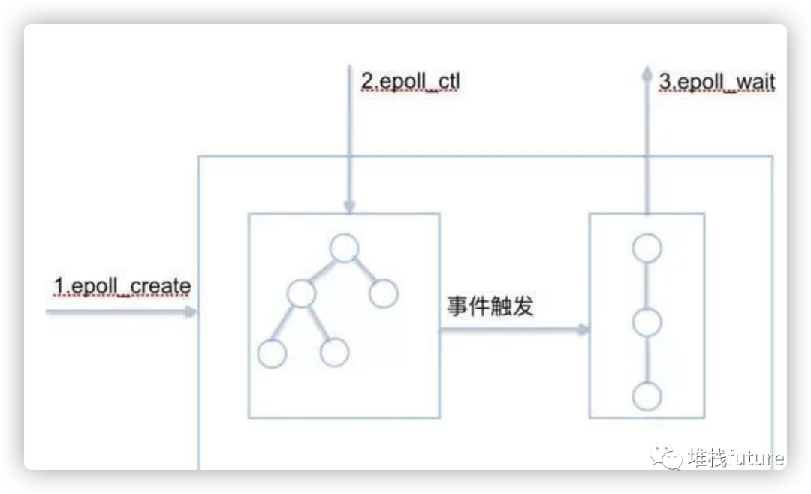
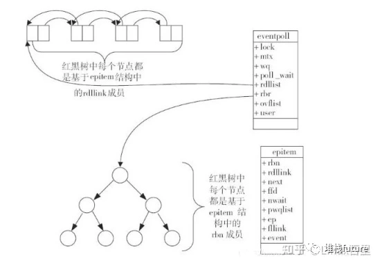
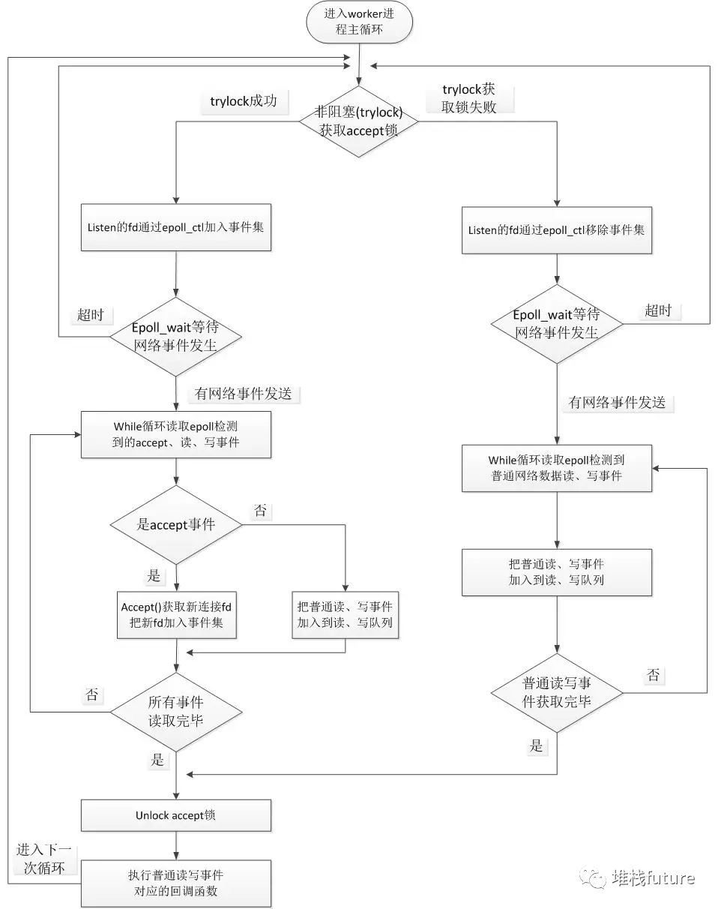
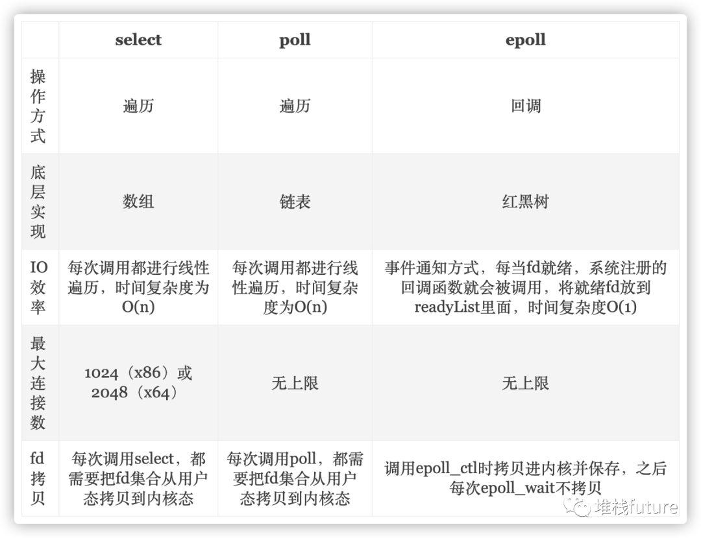

深入了解Nginx 三
===========

不管是从事前端开发人员还是后端开发人员，他们在部署服务时，第一个想到的就是用Nginx做代理和静态资源缓存，因为Nginx经过千锤百炼，足以应对百万并发。

但是对于Nginx这种高效web服务，它底层到底有什么神秘武器支持大流量并发呢？答案就在`epoll`  
里面。

1\. epoll 数据结构 + 算法
-------------------

epoll 的核心数据结构是：1个`红黑树` 和1个`双向链表` 
。还有`3个核心API` 
。如上图所示。

2\. 监视socket索引-红黑树
------------------

为什么采用红黑树呢？因为和epoll的工作机制有关。epoll在添加一个socket或者删除一个socket或者修改一个socket的时候，它需要查询速度更快，操作效率最高，因此需要一个更加优秀的数据结构能够管理这些socket。

我们想到的比如链表，数组，二叉搜索树，B+树等都无法满足要求，

*   因为链表在查询，删除的时候毫无疑问时间复杂度是O(n)；
    
*   数组查询很快，但是删除和新增时间复杂度是O(n)；
    
*   二叉搜索树虽然查询效率是lgn，但是如果不是平衡的，那么就会退化为线性查找，复杂度直接来到O(n)；
    
*   B+树是平衡多路查找树，主要是通过降低树的高度来存储上亿级别的数据，但是它的应用场景是内存放不下的时候能够用最少的IO访问次数从磁盘获取数据。比如数据库聚簇索引，成百上千万的数据内存无法满足查找就需要到内存查找，而因为B+树层高很低，只需要几次磁盘IO就能获取数据到内存，所以在这种磁盘到内存访问上B+树更适合。
    

因为我们处理上万级的fd，它们本身的存储空间并不会很大，所以倾向于在内存中去实现管理，而红黑树是一种非常优秀的平衡树，它完全是在内存中操作，而且查找，删除和新增时间复杂度都是lgn，效率非常高，因此选择用红黑树实现epoll是最佳的选择。

当然不选择用AVL树是因为红黑树是不符合AVL树的平衡条件的，红黑是用非严格的平衡来换取增删节点时候旋转次数的降低，任何不平衡都会在三次旋转之内解决；而AVL树是严格平衡树，在增加或者删除节点的时候，根据不同情况，旋转的次数比红黑树要多。所以红黑树的插入效率更高。

3\. 就绪socket列表-双向链表
-------------------

就绪列表存储的是就绪的socket，所以它应能够快速的插入数据。

程序可能随时调用epoll\_ctl添加监视socket，也可能随时删除。当删除时，若该socket已经存放在就绪列表中，它也应该被移除。（事实上，每个epoll\_item既是红黑树节点，也是链表节点，删除红黑树节点，自然删除了链表节点）

所以就绪列表应是一种能够快速插入和删除的数据结构。双向链表就是这样一种数据结构，epoll使用`双向链表来实现就绪队列`  （rdllist）

4\. 三个API
---------

### 4.1 int epoll_create(int size)

功能：

内核会产生一个epoll 实例数据结构并返回一个文件描述符epfd，这个特殊的描述符就是epoll实例的句柄，后面的两个接口都以它为中心。同时也会创建红黑树和就绪列表，红黑树来管理注册fd，就绪列表来收集所有就绪fd。size参数表示所要监视文件描述符的最大值，不过在后来的Linux版本中已经被弃用（同时，size不要传0，会报invalid argument错误）

### 4.2 int epoll\_ctl(int epfd， int op， int fd， struct epoll\_event *event)

功能：

将被监听的socket文件描述符添加到红黑树或从红黑树中删除或者对监听事件进行修改；同时向内核中断处理程序注册一个回调函数，内核在检测到某文件描述符可读/可写时会调用回调函数，该回调函数将文件描述符放在就绪链表中。

### 4.3 int epoll\_wait(int epfd， struct epoll\_event *events， int maxevents， int timeout);

功能：

阻塞等待注册的事件发生，返回事件的数目，并将触发的事件写入events数组中。

events: 用来记录被触发的events，其大小应该和maxevents一致

maxevents: 返回的events的最大个数处于ready状态的那些文件描述符会被复制进ready list中，epoll_wait用于向用户进程返回ready list(就绪列表)。

events和maxevents两个参数描述一个由用户分配的struct epoll event数组，调用返回时，内核将就绪列表(双向链表)复制到这个数组中，并将实际复制的个数作为返回值。

注意，如果就绪列表比maxevents长，则只能复制前maxevents个成员；反之，则能够完全复制就绪列表。

另外，struct epoll event结构中的events域在这里的解释是：`在被监测的文件描述符上实际发生的事件`  

### 4.4 小结

调用epoll_create时，在内核cache里建了个`红黑树`  
用于存储以后epoll_ctl传来的socket外，还会再建立一个list链表，用于存储准备就绪的事件。

当epoll\_wait调用时，仅仅观察这个双向链表里有没有数据即可。有数据就返回，没有数据就sleep，等到timeout时间到后即使链表没数据也返回。所以，epoll\_wait非常高效。而且，通常情况下即使我们要监控百万计的句柄，大多一次也只返回很少量的准备就绪句柄而已，所以，epoll_wait仅需要从内核态copy少量的句柄到用户态而已。

5\. 实现细节
--------

linux采用eventpoll数据结构来管理epoll，红黑树每个节点用epitime数据结构来管理，具体请参考linux3.16：eventpoll.c 和 eventpoll.h 主要位于fs/eventpoll.c 和 include/linux/eventpool.h ，文章末尾源码连接也可以看哦。

有了这两个核心数据结构之后，那么在处理事件和就绪队列的时候就会高效的多。

6\. 整个Nginx epoll流程
-------------------

结合前几篇Nginx文章我们知道worker进程是最终处理请求的，因此事件循环在worker里面进行。核心主流程就是多个worker进程去竞争锁，拿到锁的worker进程注册文件描述符fd到epoll的红黑树中，然后worker进程在等待就绪fd的时候将自己挂起。等内核获取到中断信号之后会发起回调，将已经就绪的fd写入到双向链表，然后内核遍历链表将fd拷贝到用户口空间的event\_list中，这样被挂起的worker进程就会被唤醒(之前阻塞在这里是因为没有fd就绪，现在数组有fd了，会换新进程)，通过遍历event\_list执行fd相应事件的回调，这样请求就从worker进来，经过epoll处理之后将我们关心的fd事件通过回调的方式通知到Nginx，Nginx可以做进一步处理，最后也释放了锁。如下图：

源码地址在文章末尾哈。遍历就绪事件的核心处理逻辑是：ngx\_epoll\_process_events

7\. epoll更高效的原因
---------------

有人说epoll使用了mmap，我找了源码半天没有找到，真的想打人。根据以上分析，epoll_ctl注册fd到红黑树拷贝一次，然后从就绪队列拷贝少量的fd到数组中又是一次拷贝，整体而言拷贝比较少(因为活跃的比较少，遇到大量活跃的可能性能就比较差了)。再加上少量轮循就可以处理就绪fd，所以效率非常高。

8\. 总结
------

参考：所有相关提到的数据结构可以在源码中找到，因为贴出来篇幅太大，所以把地址放到这里，供大家参考：

https://www.kancloud.cn/digest/understandingnginx/202601

https://xie.infoq.cn/article/2ee961483c66a146709e7e861

https://cloud.tencent.com/developer/article/1805838

https://xie.infoq.cn/article/1a956ec3827587c2618d0a4b2## 目标

去除 iconfinder 上 icon 的水印

### 原理

利用水印像素点和原图像素点颜色合并的原理，如果拥有加过水印的图片和水印图片，就可以反向推出原图原像素点的颜色；前提是你得拥有他的水印图片