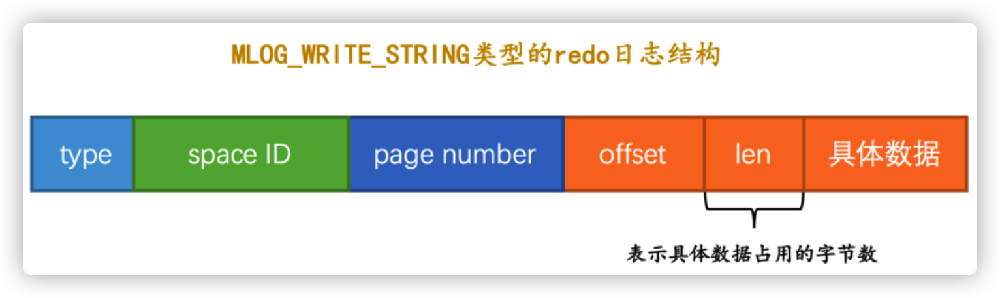
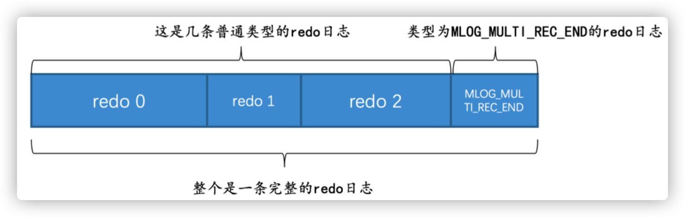
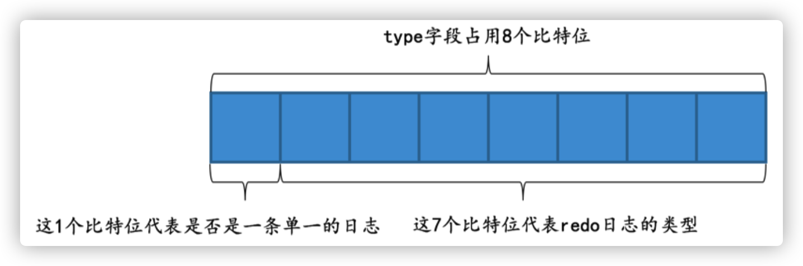
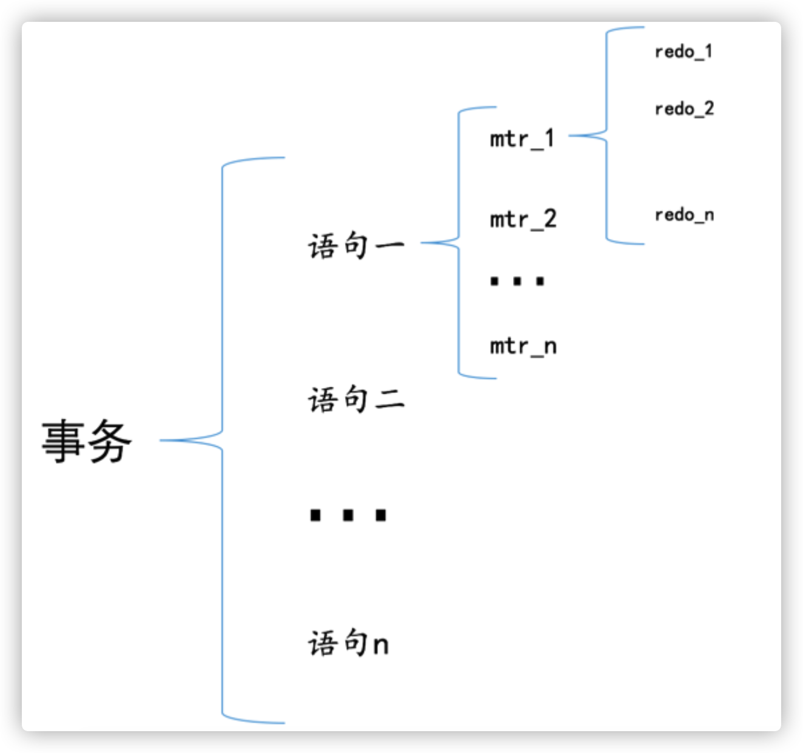
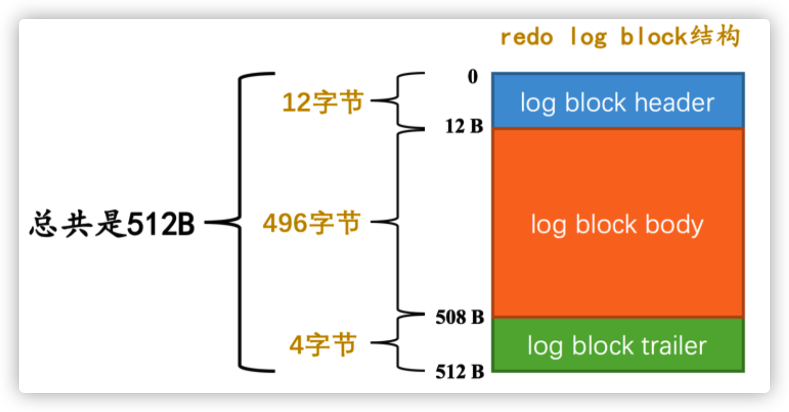
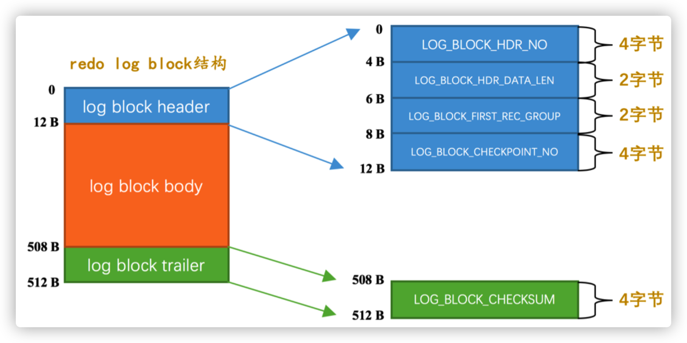

[toc]

# redo日志

## redo 日志格式

 redo 日志本质上只是记录了一下事务对数据库做了哪些修改

各个部分的详细释义如下:

- type :该条 redo 日志的类型。在 MySQL 5.7.21 这个版本中，设计 InnoDB 的大叔一共为 redo 日志设计了53种不同的类型，稍后会详细介 绍不同类型的 redo 日志。

- space ID :表空间ID。

- page number :页号。

- data :该条 redo 日志的具体内容。

## redo 日志类型

- MLOG_1BYTE ( type 字段对应的十进制数字为 1 ):表示在页面的某个偏移量处写入1个字节的 redo 日志 类型。
- MLOG_2BYTE ( type 字段对应的十进制数字为 2 ):表示在页面的某个偏移量处写入2个字节的 redo 日志 类型。
- MLOG_4BYTE ( type 字段对应的十进制数字为 4 ):表示在页面的某个偏移量处写入4个字节的 redo 日志 类型。
- MLOG_8BYTE ( type 字段对应的十进制数字为 8 ):表示在页面的某个偏移量处写入8个字节的 redo 日志 类型。
-  MLOG_WRITE_STRING ( type 字段对应的十进制数字为 30 ):表示在页面的某个偏移量处写入一串数据。

其余 MLOG_1BYTE 、 MLOG_2BYTE 、 MLOG_4BYTE 类型的 redo 日志结构和 MLOG_8BYTE 的类似，只不过具体数据 中包含对应个字节的数据罢了。 MLOG_WRITE_STRING 类型的 redo 日志表示写入一串数据，但是因为不能确定写 入的具体数据占用多少字节，所以需要在日志结构中添加一个 len 字段:

redo日志会把事务在执行过程 中对数据库所做的所有修改都记录下来，在之后系统奔溃重启后可以把事务所做的任何修改都恢复出来。

## Mini-Transaction

## 以组的形式写入**redo**日志

语句在执行过程中可能修改若干个页面。比如我们前边说的一条 INSERT 语句可能修改系统表空间页号为 7 的页 面的 Max Row ID 属性(当然也可能更新别的系统页面，只不过我们没有都列举出来而已)，还会更新聚簇索引 和二级索引对应 B+ 树中的页面。由于对这些页面的更改都发生在 Buffer Pool 中，所以在修改完页面之后，需 要记录一下相应的 redo 日志。在执行语句的过程中产生的 redo 日志被设计 InnoDB 的大叔人为的划分成了若干 个不可分割的组，比如:

- 更新 Max Row ID 属性时产生的 redo 日志是不可分割的。
- 向聚簇索引对应 B+ 树的页面中插入一条记录时产生的 redo 日志是不可分割的。 
- 向某个二级索引对应 B+ 树的页面中插入一条记录时产生的 redo 日志是不可分割的。 
- 还有其他的一些对页面的访问操作时产生的 redo 日志是不可分割的

规定在执行这些需要保证原子性的操作时必须以 组 的形式来记录的 redo 日志，在进行系统奔 溃重启恢复时，针对某个组中的 redo 日志，要么把全部的日志都恢复掉，要么一条也不恢复

- 有的需要保证原子性的操作会生成多条 redo 日志，比如向某个索引对应的 B+ 树中进行一次悲观插入就需要 生成许多条 redo 日志。

在该组中 的最后一条 redo 日志后边加上一条特殊类型的 redo 日志，该类型名称为 MLOG_MULTI_REC_END ， type 字 段对应的十进制数字为 31 ，该类型的 redo 日志结构很简单，只有一个 type 字段

所以某个需要保证原子性的操作产生的一系列 redo 日志必须要以一个类型为 MLOG_MULTI_REC_END 结尾，就 像这样:

这样在系统奔溃重启进行恢复时，只有当解析到类型为 MLOG_MULTI_REC_END 的 redo 日志，才认为解析到了 一组完整的 redo 日志，才会进行恢复。否则的话直接放弃前边解析到的 redo 日志。

- 有的需要保证原子性的操作只生成一条 redo 日志，比如更新 Max Row ID 属性的操作就只会生成一条 redo 日志。

其实在一条日志后边跟一个类型为 MLOG_MULTI_REC_END 的 redo 日志也是可以的，不过设计 InnoDB 的大叔 比较勤俭节约，他们不想浪费一个比特位。别忘了虽然 redo 日志的类型比较多，但撑死了也就是几十种， 是小于 127 这个数字的，也就是说我们用7个比特位就足以包括所有的 redo 日志类型，而 type 字段其实是 占用1个字节的，也就是说我们可以省出来一个比特位用来表示该需要保证原子性的操作只产生单一的一条

redo 日志，示意图如下

如果 type 字段的第一个比特位为 1 ，代表该需要保证原子性的操作只产生了单一的一条 redo 日志，否则 表示该需要保证原子性的操作产生了一系列的 redo 日志

## **redo**日志的写入过程

设计 MySQL 的大叔把对底层页面中的一次原子访问的过程称之为一个 Mini-Transaction ，简称 mtr 。一个所谓的 mtr 可以包含一组 redo 日志，在进 行奔溃恢复时这一组 redo 日志作为一个不可分割的整体。

一个事务可以包含若干条语句，每一条语句其实是由若干个 mtr 组成，每一个 mtr 又可以包含若干条 redo 日 志，画个图表示它们的关系就是这样

### redo log block

通过 mtr 生成的 redo 日志都放在了大小为 512字节 的 页 中。为了区分这里把用来存储 redo 日志的页称为 block (你心里清楚页和block的意思其实差不多就行了）

真正的 redo 日志都是存储到占用 496 字节大小的 log block body 中，图中的 log block header 和 log block trailer 存储的是一些管理信息

- LOG_BLOCK_HDR_NO :每一个block都有一个大于0的唯一标号，本属性就表示该标号值。
- LOG_BLOCK_HDR_DATA_LEN :表示block中已经使用了多少字节，初始值为 12 (因为 log block body 从第 12个字节处开始)。随着往block中写入的redo日志越来也多，本属性值也跟着增长。如果 log block body 已经被全部写满，那么本属性的值被设置为 512 。
- LOG_BLOCK_FIRST_REC_GROUP :一条 redo 日志也可以称之为一条 redo 日志记录( redo log record )， 一个 mtr 会生产多条 redo 日志记录，这些 redo 日志记录被称之为一个 redo 日志记录组( redo log record group )。 LOG_BLOCK_FIRST_REC_GROUP 就代表该block中第一个 mtr 生成的 redo 日志记录组的偏 移量(其实也就是这个block里第一个 mtr 生成的第一条 redo 日志的偏移量)。
- LOG_BLOCK_CHECKPOINT_NO :表示所谓的 checkpoint 的序号， checkpoint 是我们后续内容的重点，现在 先不用清楚它的意思，稍安勿躁。