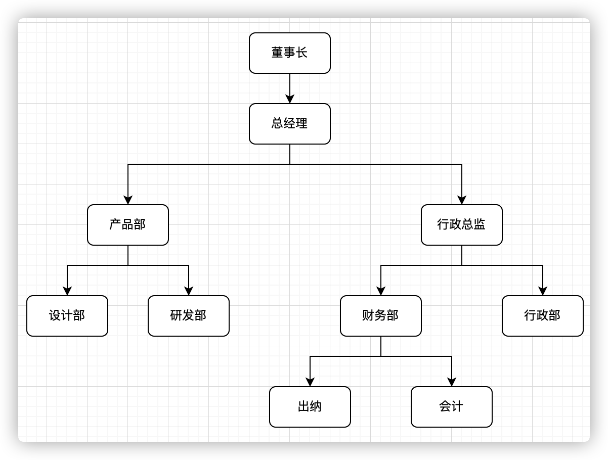
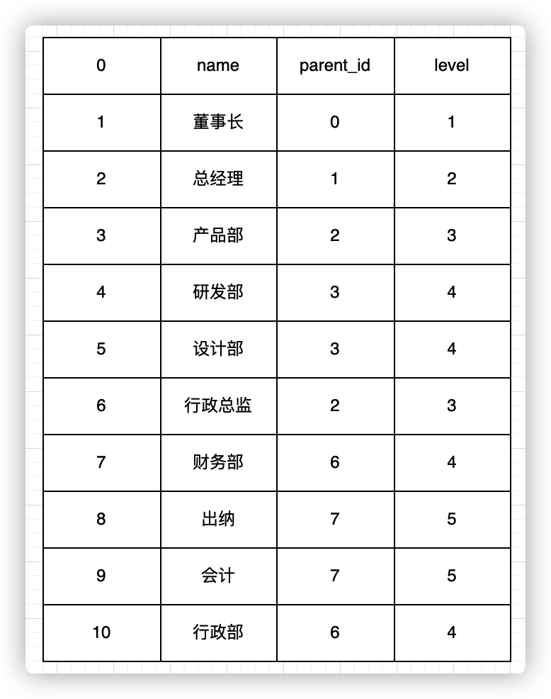
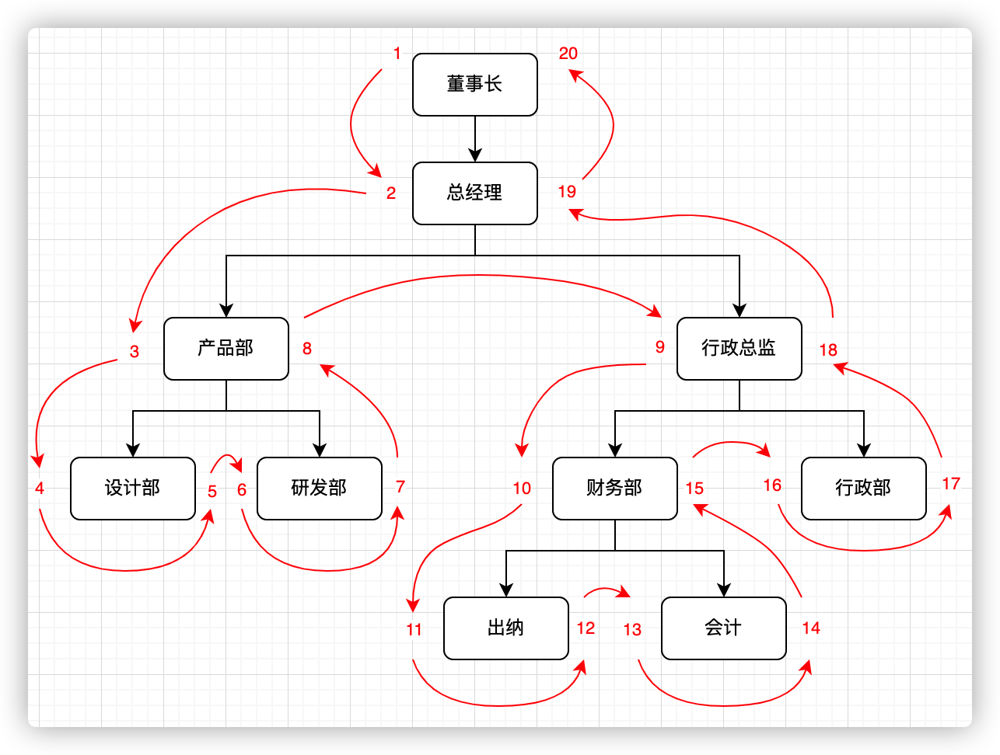
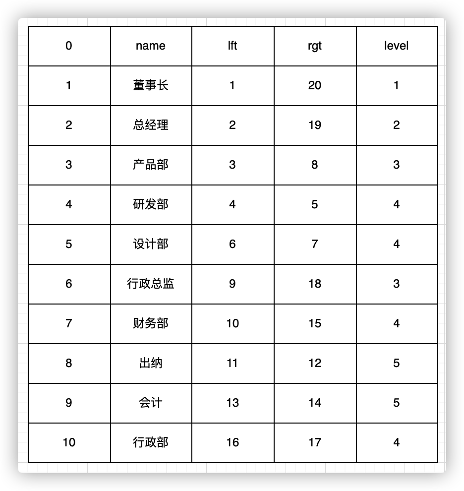
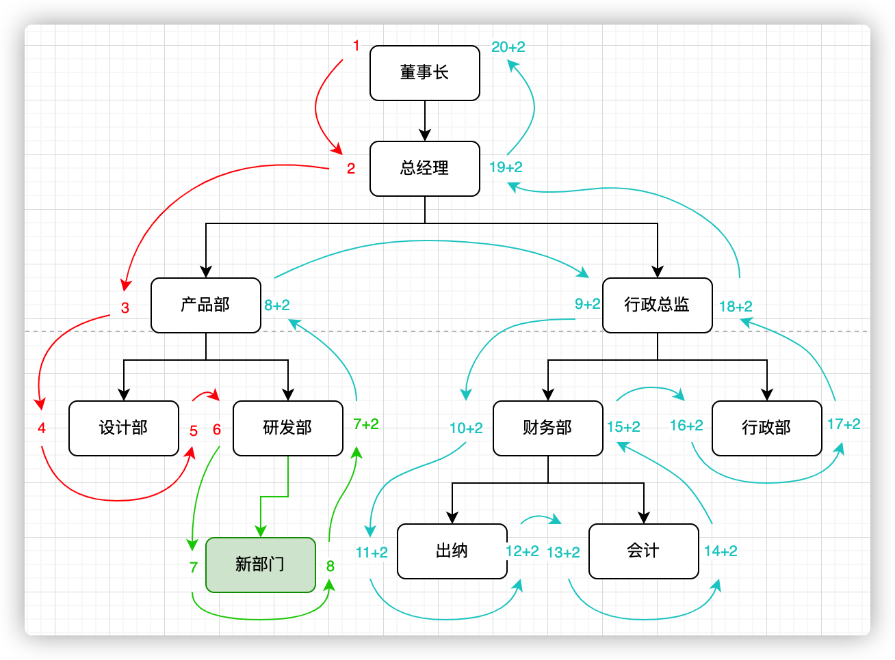
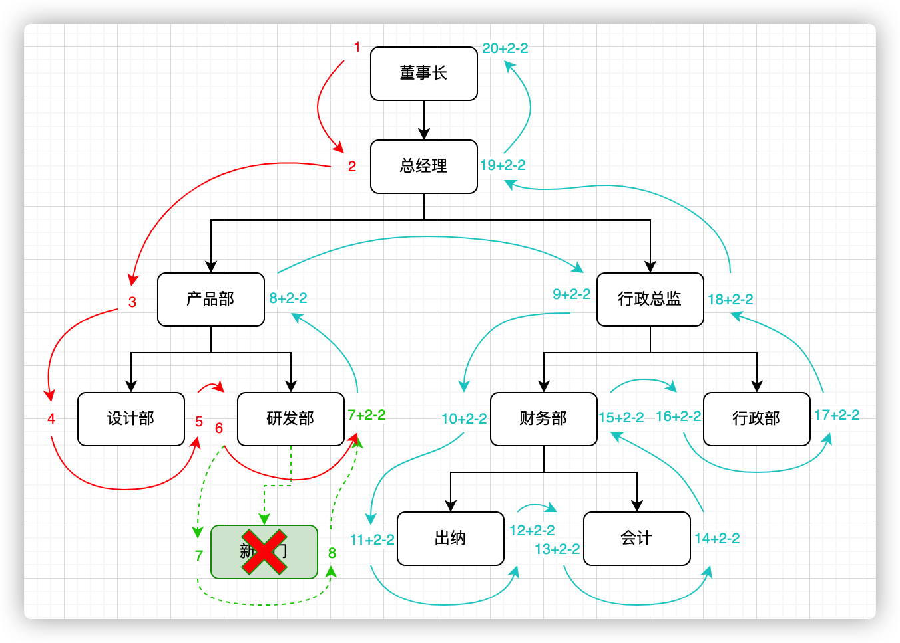
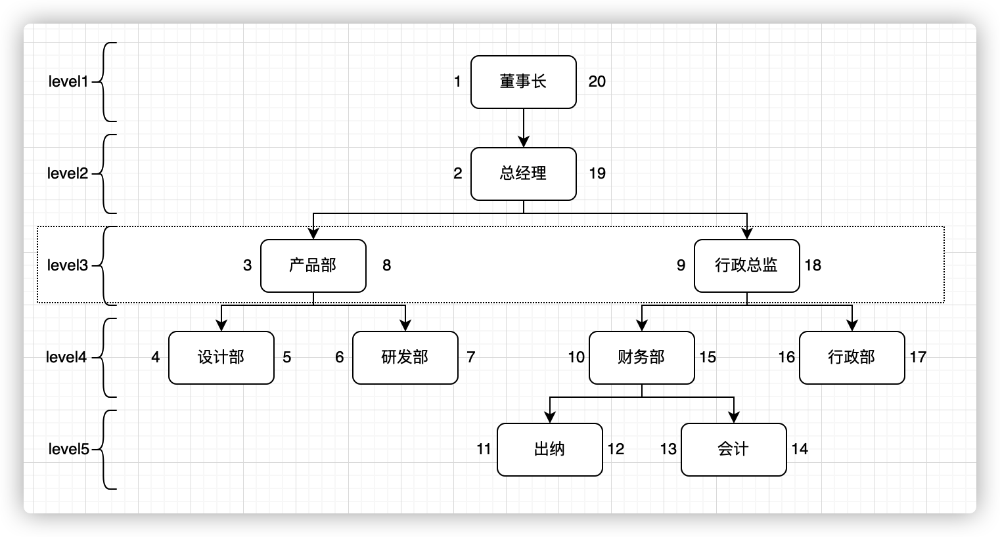

[toc]

通常树形结构的存储，是在子节点上存储父节点的编号来确定各节点的父子关系，例如这样的组织结构：



与之对应的表数据(department)：



部门表结构（department）

```
id          部门编号
name        部门名称
level       所在树层级
parent_id   上级部门编号
```

## 问题来了  

这样的方式很不错，可以很直观的体现各个节点之间的关系，通常可以满足大多数需求。但是当业务需求变得多了，数据量庞大了，这样的方式就不再适合用于生产。

例如：PM加了以下需求：

1. 查出指定部门下所有子孙部门
2. 查询子孙部门总数
3. 判断节点是否叶子节点

### 查出所有子孙部门

使用指定部门编号，一层一层使用递归往下查，可能是多数人会想到的方法。尽管在mysql8.0支持了 cte(公共表表达式)，递归效率比传统递归方式有明显提升，但是查询效率仍会随着部门树层级深度的提高而变差。

另外一种方法，一次性查出所有数据，放入内存中处理（数据量少时，可以选用。数据量多，不怕挨打的人也可以选这种）~

### 查询子孙部门总数

递归查询每一层的数量，最后相加。

### 判断是否叶子节点

- 方法1：可以加字段 isLeaf 的方式，来表示这个节点是否是叶子节点。
- 方法2：直接通过查询parent_id=当前id的count是否大于0，大于0表示不是叶子节点，等于0表示为叶子节点。

在日常中，可能会经常使用上述类似方法去解决类似的问题，但我觉得这样的方法在效率上不是最优解。于是乎开始查找更好的方案去解决这些问题。

## 要不试试这个方法？

直到后面查到国外一博客中，见到了所谓的《改进后的先序树遍历》文章（天哪，竟然是一篇2003年发表的文章）~

他具体是怎么做的呢？ 还是回到刚刚的组织架构


我们从根节点开始，给董事长左值设为1，下级部门总经理左值设为2，以此类推地沿着边缘开始遍历，给每个节点加上左值，遇到叶子节点处给节点加上右值，再继续向上沿着边缘继续遍历，遍历结束回到根节点右侧,你将得到类似这样的结构。



遍历完后每一个节点都有与之对应的左右值。这个时候可以去除parent_id字段，添加lft,rgt，来存储左右值。



数据和结构准备完毕，我们来试试操作解决上面的需求~

### 查出所有子孙部门

根据当前表结构的规律，可以发现，要想查出所有子孙部门，只要查左值在 被查寻部门的左\\右数之间的节点，查出来都是他的子节点。例如：查询行政总监的所有子部门，行政总监的左右数是9和18，因此只需要用9和18做lft字段的between查询，查询出的结果就是【被查部门本身数据和所有子孙部门】；

```sql
SET @lft := 9;
SET @rgt := 18;
SELECT * FROM department WHERE lft BETWEEN @lft AND @rgt ORDER BY lft ASC;
/*例子中用BETWEEN将被查部门本身也查了出来。实际中可以用大于小于*/
```

完美~ 

### 查询子孙部门总数

到这里可能会说，需求1都解决了，查总数自然也就解决了，直接上select count就可以了，确实没有错，但是没有那个必要，因为有个简单公式可以直接计算。

- 公式：总数 = (右值 \- 左值 \- 1) / 2

```shell
例如：  
行政总监的子孙部门数 = (18 - 9 - 1) / 2 = 4
董事长的子孙部门数 = (20 - 1 - 1) / 2 = 9
会计的子部门数 =  (14 - 13 - 1) / 2 = 0

可以数数看，确实没错哦～
```

### 判断是否叶子节点 

通过有了上述计算公式算总数的经验后，现在判断是否叶子节点，有的小伙伴已经知道了怎么做，那就是：  

- 右值 - 1 == 左值 那他就是叶子节点，
- 左值 + 1 == 右值 那他就是叶子节点，反之则不是叶子节点。

```shell
例如：
设计部，5 - 1 == 4，因此他是叶子节点。
董事长，20 - 1 != 1，因此他不是叶子节点。
```

至此已经完美的解决了上述需求问题，接下来再尝试一下业务的基本操作。   

## 其他基本操作

### 新增部门

当新增一个部门时，需要对新增节点位置的后续边缘进行加2操作，因为每一个节点有左右两个数值。这个操作通常需要放到事务中进行处理。例如：在研发部门下添加一个新部门：



对应sql：

```sql
SET @lft := 7;/*新部门的左值*/
SET @rgt := 8;/*新部门的左值*/
SET @level := 5;/*新部门的层级*/
begin;
/*将插入的后续边缘的节点左右数+2*/
UPDATE department SET lft=lft+2 WHERE lft > @lft;
UPDATE department SET rgt=rgt+2 WHERE rgt >= @lft;
/*插入数据*/
INSERT INTO department(name,lft,rgt,level) VALUES('新部门',@lft,@rgt,level);
/*新增影响行数为0时，必须回滚*/
commit;
/*rollback;*/
```

### 删除部门 

删除部门与新增部门类似，不同的是需要对删除节点的后续边缘节点减2操作。例如：删除刚刚添加的新部门：



对应sql

```sql
SET @lft := 7;/*要删除的节点左值*/
SET @rgt := 8;/*要删除的节点右值*/

begin;
UPDATE department SET lft=lft-2 WHERE lft > @lft;
UPDATE department SET rgt=rgt-2 WHERE rgt > @lft;
/*删除节点*/
DELETE FROM department WHERE lft=@lft AND rgt=@rgt;
/*删除影响行数为0时，必须回滚*/
commit;
/*rollback*/
```

### 查询直接子部门

查询某部门的直接子部门（即不包含孙子部门），例如：查询总经理下的直接子部门。正常需要返回产品部和行政总监



对应的sql

```sql
SET @level := 2;/*总经理的level*/
SET @lft := 2;/*总经理的左值*/
SET @rgt := 19;/*总经理的右值*/

SELECT * FROM department WHERE lft > @lft AND rgt < @rgt AND level = @level+1;
```

### 查询祖链路径

查询某部门的祖链路径。例如：查询产品部的祖链路径，正常需要返回董事长,总经理

```sql
SET @lft := 3;/*产品部左值*/
SET @rgt := 8;/*产品部右值*/

SELECT * FROM department WHERE lft < @lft AND rgt > @rgt ORDER BY lft ASC;
```

### 树形数据展示（JS示例） 

```js
let list = [//模拟sql查出来的列表。    {id:1,name:'root',lft:1,rgt:8,level:1},    {id:2,name:'child',lft:2,rgt:7,level:2},    {id:3,name:'grandson',lft:3,rgt:4,level:3},    {id:4,name:'grandson2',lft:5,rgt:6,level:3}];let rights = [] /*类似于一个栈结构（后进先出）*/let mp = {}//list.sort((a,b) => a.lft - b.lft)//如果你在sql中没有进行排序，需要在这里给他排序。list.forEach(item => {    if(rights.length > 0) {        while(rights[rights.length-1] < item.rgt) {            rights.splice(-1, 1)//从rights末尾去除        }    }    let _level = rights.length;    item._level = _level;    mp[_level] = item.id    item.parent_id = _level - 1 in mp ? mp[_level - 1] : null;//计算出上级部门编号    item.is_leaf = item.lft === item.rgt - 1;//判断是否叶子部门    rights.push(item.rgt)})/*上级部门计算出来了，和存parent_id的效果就一样了，后面只需要递归即可*//*递归函数 示例*/let recursive = (_list, parent_id = null) => {    let _tree = [];    _list.forEach(item => {        if(item.parent_id == parent_id) {            let childs = recursive(_list, item.id)            _tree.push({                ...item,                children: childs.length > 0 ? childs : (item.isLeaf ? null : [])            })        }    })    return _tree}console.log(recursive(list))
```

## 完结

在我目前看来，这个方法的唯一缺点就是，每一次的新增或删除，操作节点的后续边缘走到的节点都要加/减2操作。
